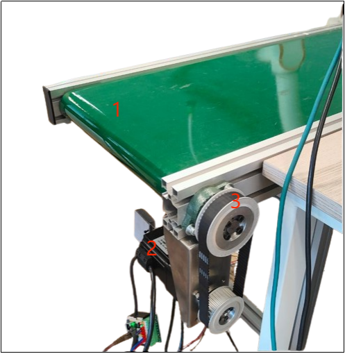
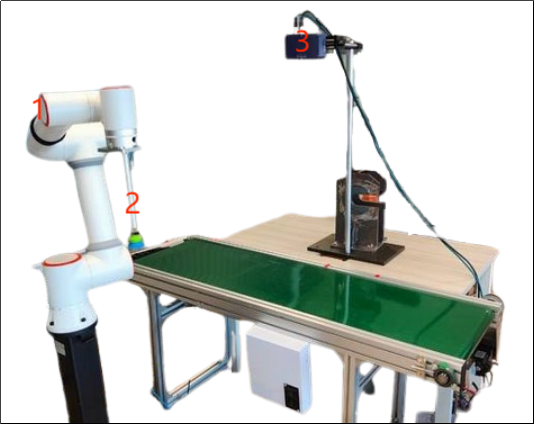
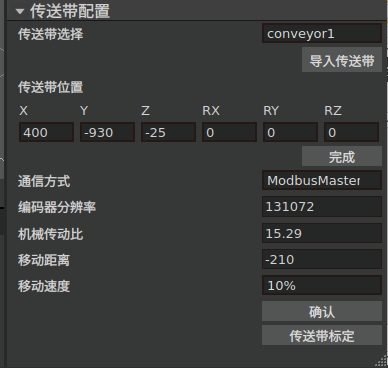
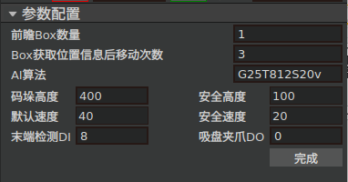
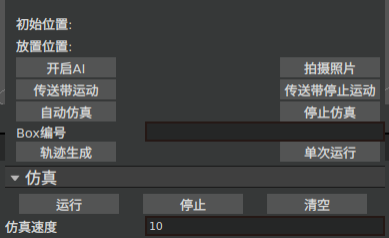
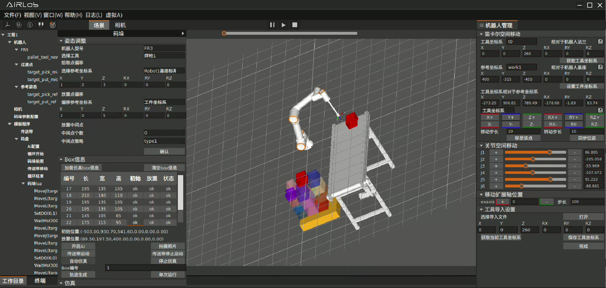
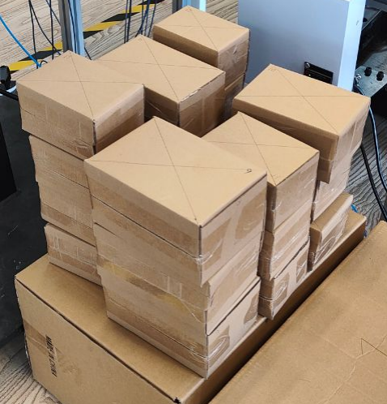
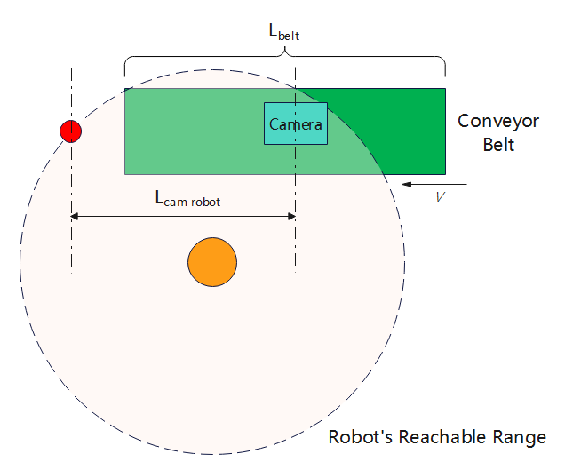

AIRLab Mixed Palletizing Software Case Manual
==================================================

.. toctree:: 
   :maxdepth: 6

Preface
--------------

Introduction
+++++++++++++++++

Firstly, thank you very much for choosing our AIRLab Mixed Palletizing Software. Please carefully read through this case manual to ensure you can correctly utilize our product and achieve the best user experience.

This usage case aims to provide users with a practical application example of the AIRLab Mixed Palletizing Software, helping users better understand and master the operation methods and functions of the software. Based on our actual operations in the testing environment, we demonstrate the complete process from initial configuration to task execution.

.. important::
    If you encounter any problems during usage that are difficult to resolve, please feel free to contact our after-sales personnel. We greatly appreciate your support and trust and look forward to providing you with better service and products.

Other Relevant Documents
++++++++++++++++++++++++++++++++++

AIRLab Mixed Palletizing Software User Manual

Environment
--------------

Hardware Environment
+++++++++++++++++++++++++

PC
~~~~~~~~~

**Model**: Yunxuan Industrial PC EPC-E12-A01

**OS**: Ubuntu 22.04.3 LTS-64bit

**Memory**: 32GB

**GPU**: NVIDIA RTX A2000

Robot
~~~~~~~~~

**Robot Model**: FAIRINO FR5 Cobot

**Robot Version**: V6.0 and above

**Controller Softwawre Version**: V3.7.2

**Firmware Version**: FR_CRTL_FV2.010.09 Apr 16 2024 08:46:28

Camera
~~~~~~~~~

**Model**: XYZ AL-M 3D Camera

Conveyor Belt
~~~~~~~~~~~~~~~~
**Belt Type**: Flat belt, length 1.5m

**Motor Model**: 60S01330L5HMQD-05, 400W servo motor, working voltage 48V, Sankyo

**Accessories**: synchronization pulley, synchronization belt

.. centered:: Figure 7-2-1 Conveyor Belt

.. note::
    1--Conveyor Belt

    2--Servo Motor

    3--Synchronization Pulley and Wheel

Construction
~~~~~~~~~~~~~~~~

The starting point of the conveyor belt is on the right side, meaning the boxes are placed onto the conveyor belt from the right side. The camera is positioned approximately 700mm from the starting point of the conveyor belt and 800mm above the surface of the conveyor belt. For detailed information, refer to the "Limitation on Preview Number" and "Selection of Camera Height from Conveyor Belt" sections. The robot is placed near the end of the conveyor belt, with its specific position adjusted to not interfere with visual calibration and box picking. For detailed information, refer to section 'Limitation on Preview Number'.

.. centered:: Figure 7-2-2 Constructed Mixed Palletizing Hardware Environment

.. note::
    1--Robot

    2--Suction Cup

    3--Camera

Software Environment
+++++++++++++++++++++++++

Please refer to AIRLab Mixed Palletizing Software User Manual, the section of "Installation and Configuration", to install the software environment.

Case Steps
--------------

Coordinate System Calibration
+++++++++++++++++++++++++++++++++++

Before starting palletizing, it is necessary to calibrate the coordinate systems of the pallet (workpiece), conveyor belt (workpiece), and suction cup (tool). For detailed instructions, please refer to sections 5.4.1 Tool Coordinates and 5.4.3 Workpiece Coordinates in the FAIRINO Cobots Manual.

Reference link: https://fair-documentation.readthedocs.io/en/latest/CobotsManual/intro.html#manual

Software Launch
+++++++++++++++++++++++

Please refer to AIRLab Mixed Palletizing Software User Manual, the section of "Starting ROS2 Nodes", to launch the software and required ROS2 nodes.

Initialization of Palletizing Task
++++++++++++++++++++++++++++++++++++++++

Please refer to AIRLab Mixed Palletizing Software User Manual, the section of "Starting ROS2 Nodes", to initialize the palletizing task.

.. centered:: Figure 7-3-1 Conveyor Belt Parameters Configuration

Configure the mixed palletizing parameters as shown below, using AI model G25T812S20v2:

.. centered:: Figure 7-3-2 Mixed Palletizing Parameters Configuration

Execution of Palletizing Task
+++++++++++++++++++++++++++++++++++

After completing the initialization configuration, click the Start AI button in the execution control area on the palletizing panel:

.. centered:: Figure 7-3-3 Mixed Palletizing Execution Control Area

Place the boxes to be palletized onto the conveyor belt. Click the start button on the top left corner of the interface to switch the robot mode to automatic mode. Then, click the button  on the top of the 3D robot and function area. The software will start the automatic operation process of "Capture -> Conveyor Belt Movement -> Robot Palletizing".

During the palletizing process, in the Box Information section on the palletizing panel, you can query in real-time the size of each box, its initial position on the conveyor belt, and its estimated placement position on the pallet. In the 3D scene interface, you can see the simulation model of each box. Clicking on a box number in the Box Information table will highlight the corresponding box in the 3D scene interface in red.

.. centered:: Figure 7-3-4 3D Scene Interface during Palletizing Execution

Stopping and Restarting the Palletizing Task
++++++++++++++++++++++++++++++++++++++++++++++++

When the AI inference completes normally, the terminal window at the bottom of the software will display AI planning has stopped, indicating that the current round of palletizing has been successfully completed. Once you have put away the palletized boxes and any remaining boxes on the conveyor belt, click the Start AI button to begin a new round of palletizing. If you need to manually stop during the execution, click the stop button at the top of the 3D robot and function area.

Result of the Palletizing Task
++++++++++++++++++++++++++++++++++++++++++++++++

The final palletizing result is as follows:

.. centered:: Figure 7-3-5 Palletizing Result

Supplementary Explanation
------------------------------

Limitation on Preview Number
+++++++++++++++++++++++++++++++++++

Visual calibration has certain requirements for the relative position of the camera and the robot, ensuring that the robot's end effector is within the camera's field of view. The robot is positioned near the end of the conveyor belt. After obtaining Box information, the number of conveyor belt movements is generally set to (k+1) times. Therefore, the distance the conveyor belt moves after obtaining Box information, (k+1)L\ :sub:`postmove`\, must satisfy:

.. centered:: (k+1)L\ :sub:`postmove`\ < L\ :sub:`cam-robot`\

where L\ :sub:`cam-robot`\ represents the distance between the farthest reachable position of the robot along the direction of conveyor belt motion and the camera (Fig. 4.1). This implies that there is an upper limit on the lookahead number k.

In this case, we have set the distance L\ :sub:`cam-robot`\ to be approximately 750mm and L\ :sub:`postmove`\=210mm. Therefore, the maximum value for k can be set to 2.

    
.. centered:: Figure 7-4-1 Position Relationship between the Conveyor Belt, Camera, and Robot

Selection of Conveyor Belt Length
+++++++++++++++++++++++++++++++++++

The selection of the conveyor belt length L\ :sub:`belt`\ is related to the preview number k, the distance L\ :sub:`cam`\ between the camera and the starting point of the conveyor belt, and the distance L\ :sub:`postmove`\ the conveyor belt moves after obtaining box information. Generally, L\ :sub:`belt`\ should satisfy:

.. centered:: L\ :sub:`belt`\ > (k+1)L\ :sub:`postmove`\ + L\ :sub:`cam`\

In this case, with k=2, L\ :sub:`postmove`\=210mm, and L\ :sub:`cam`\=700mm, the calculation yields L\ :sub:`belt`\ > 1330mm, which meets the requirement.

Selection of Camera Height from Conveyor Belt
+++++++++++++++++++++++++++++++++++++++++++++++++

Assuming the maximum edge length of the palletizing box is max(L\ :sub:`box`\), the height H\ :sub:`cam`\ of the camera from the conveyor belt surface can be calculated using the following formula:

.. centered:: H\ :sub:`cam`\ = H\ :sub:`cam-box`\ + max(L\ :sub:`box`\) = (2μ + 1)max(L\ :sub:`box`\), μ = 1.21
