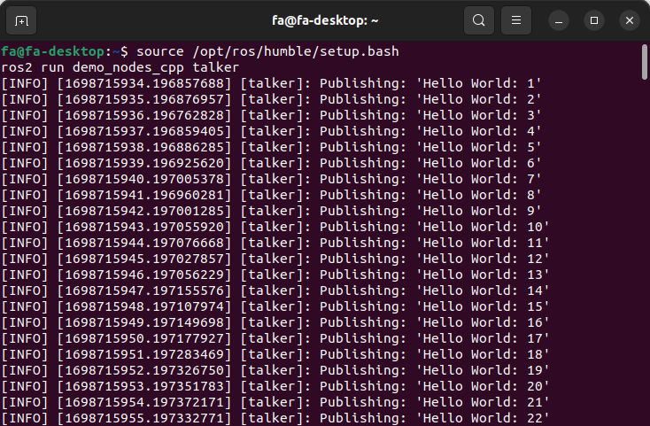
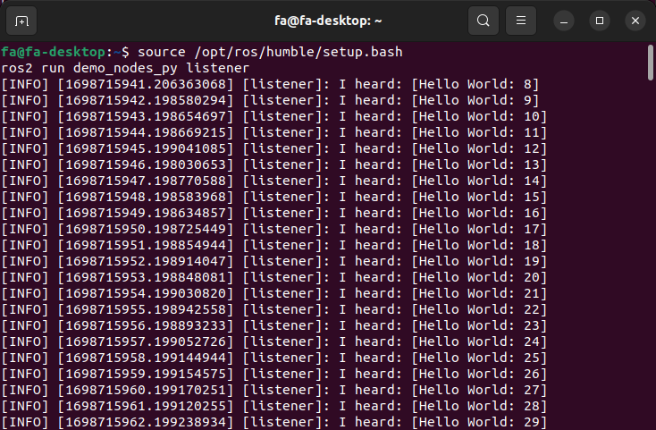
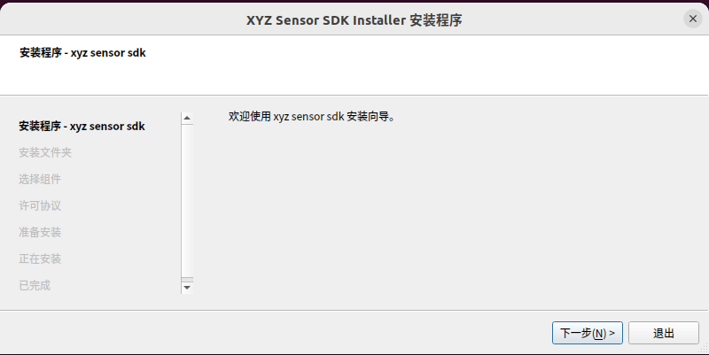
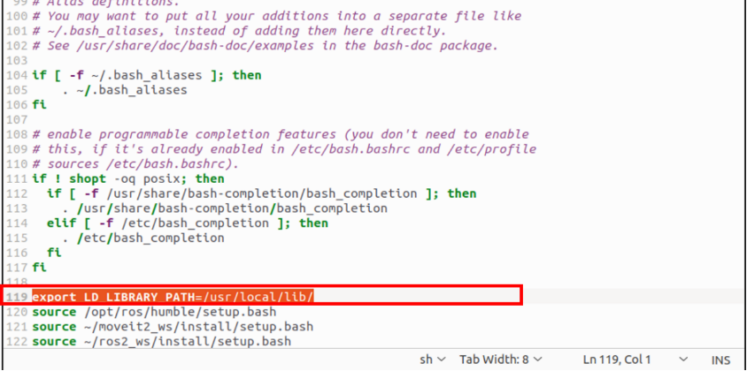

Installation and Configuration
==============================================

.. toctree:: 
   :maxdepth: 6

Environmental Requirements
------------------------------

This software is suitable for computers/industrial control machines with the following configurations:

- Operating System: Ubuntu 22.04.3 LTS-64bit

- Memory: No less than 16GB (32GB recommended)

- Python Version: 3.10

ROS2 Installation
------------------------------

Reference link: https://docs.ros.org/en/humble/Installation/Ubuntu-Install-Debians.html

Setting the Locale
++++++++++++++++++++

.. code-block:: console
    :linenos:

    locale  # check for UTF-8
    sudo apt update && sudo apt install locales
    sudo locale-gen en_US en_US.UTF-8
    sudo update-locale LC_ALL=en_US.UTF-8 LANG=en_US.UTF-8
    export LANG=en_US.UTF-8
    locale  # verify settings

Adding ROS 2 Sources
++++++++++++++++++++++++++

Ensuring the Ubuntu Universe repository is enabled:

.. code-block:: console
    :linenos:

    sudo apt install software-properties-common
    sudo add-apt-repository universe

Adding the ROS 2 GPG key:

.. code-block:: console
    :linenos:

    sudo apt update && sudo apt install curl -y
    sudo curl -sSL https://raw.githubusercontent.com/ros/rosdistro/master/ros.key -o /usr/share/keyrings/ros-archive-keyring.gpg

Adding to the sources list:

.. code-block:: console
    :linenos:

    echo "deb [arch=$(dpkg --print-architecture) signed-by=/usr/share/keyrings/ros-archive-keyring.gpg] http://packages.ros.org/ros2/ubuntu $(. /etc/os-release && echo $UBUNTU_CODENAME) main" | sudo tee /etc/apt/sources.list.d/ros2.list > /dev/null

Installing ROS2 Packages
++++++++++++++++++++++++++

Update and upgrade:

.. code-block:: console
    :linenos:

    sudo apt update
    sudo apt upgrade

For desktop installation (recommended): ROS, RViz, demos and tutorials:

.. code-block:: console
    :linenos:

    sudo apt install ros-humble-desktop

For ROS-Base installation (Bare Bones): Communication libraries, message packages, and command line tools:

.. code-block:: console
    :linenos:

    sudo apt install ros-humble-ros-base

For development tools: Compilers and other tools to build ROS packages:

.. code-block:: console
    :linenos:

    sudo apt install ros-dev-tools

Setting Up Environment
++++++++++++++++++++++++++

Adding 'source /opt/ros/humble/setup.bash' to .bashrc:

.. code-block:: console
    :linenos:

    echo 'source /opt/ros/humble/setup.bash' >> ~/.bashrc

Testing Talker-listener
++++++++++++++++++++++++++

If you have installed the ros-humble-desktop, you can try some examples.

In one terminal, source the setup file and run the C++ talker:

.. code-block:: console
    :linenos:

    source /opt/ros/humble/setup.bash
    ros2 run demo_nodes_cpp talker

In another terminal, source the setup file and run the Python listener:

.. code-block:: console
    :linenos:

    source /opt/ros/humble/setup.bash
    ros2 run demo_nodes_py listener

As shown below, the results should show the talker publishing messages and the listener receiving those messages, verifying the C++ and Python APIs work correctly.

.. centered:: Figure 2-2-1 ROS2 starts C++ talker

.. centered:: Figure 2-2-2 ROS2 starts the Python listener

ROS2-control Installation
-------------------------------

Reference link: https://github.com/ros-controls/control.ros.org/blob/master//doc/getting_started/getting_started.rst

Workspace Creation and Source Code Download
++++++++++++++++++++++++++++++++++++++++++++++++++++

.. code-block:: console
    :linenos:
    
    mkdir -p ~/ros2_control_ws/src
    cd ~/ros2_control_ws/
    wget https://raw.githubusercontent.com/ros-controls/control.ros.org/master/ros_controls.$ROS_DISTRO.repos
    vcs import src < ros_controls.$ROS_DISTRO.repos

Installing Dependencies
++++++++++++++++++++++++++++++++++++

.. code-block:: console
    :linenos:

    rosdep update --rosdistro=$ROS_DISTRO
    sudo apt-get update
    rosdep install --from-paths src --ignore-src -r -y

Compilation
+++++++++++++++++++++++++++

.. code-block:: console
    :linenos:

    ./opt/ros/${ROS_DISTRO}/setup.sh
    colcon build --symlink-install

PCL Installation
-------------------------------

Reference link：https://pcl.readthedocs.io/projects/tutorials/en/latest/compiling_pcl_posix.html

Download and Extraction
+++++++++++++++++++++++++++

Extracting the package:

.. code-block:: console
    :linenos:

    unzip pcl-master.zip

Creating the Workspace Directory
+++++++++++++++++++++++++++++++++++++++++++++

.. code-block:: console
    :linenos:

    cd pcl-master
    mkdir build
    cd build

Compilation
+++++++++++++++++++++++++++++++++

Running CMake with default options:

.. code-block:: console
    :linenos:

    cmake ..

Compiling the source code:and installing the compiled binaries:

.. code-block:: console
    :linenos:

    make -j2
    sudo make -j2 install

OpenCV Installation
---------------------------

Reference link：https://docs.opencv.org/4.5.4/d7/d9f/tutorial_linux_install.html

Download and Extraction
++++++++++++++++++++++++++++

Extracting the package:

.. code-block:: console
    :linenos:
    
    unzip opencv-4.5.4.zip

Creating the Workspace Directory
++++++++++++++++++++++++++++++++++++

.. code-block:: console
    :linenos:

    cd opencv-4.5.4
    mkdir build
    cd build

Compilation
++++++++++++++++++++++++++++++++++++

Running CMake with default options:

.. code-block:: console
    :linenos:

    cmake ..

Compiling the source code:and installing the compiled binaries:

.. code-block:: console
    :linenos:

    make
    sudo make install

Opencascade Installation
---------------------------

Download and Extraction
+++++++++++++++++++++++++++

Extracting the package:

.. code-block:: console
    :linenos:
    
    tar -xzvf opencascade-7.4.0.tgz

Creating the Workspace Directory
++++++++++++++++++++++++++++++++++++

.. code-block:: console
    :linenos:

    cd opencascade-7.4.0
    mkdir build
    cd build

Compilation
++++++++++++++++

Running CMake with default options:

.. code-block:: console
    :linenos:

    cmake ..

Compiling the source code:and installing the compiled binaries:

.. code-block:: console
    :linenos:

    make
    sudo make install

Nodeeditor Installation
-------------------------

Reference link：https://github.com/paceholder/nodeeditor

Download and Extraction

Extracting the package (modified source code for nodeeditor is provided):

.. code-block:: console
    :linenos:

    unzip nodeeditor

Creating the Workspace Directory
++++++++++++++++++++++++++++++++++++

.. code-block:: console
    :linenos:

    cd nodeeditor
    mkdir build
    cd build

Compilation
++++++++++++++++++++++++++++++++++++

Running CMake with default options:

.. code-block:: console
    :linenos:

    cmake ..

Compiling the source code:and installing the compiled binaries:
++++++++++++++++++++++++++++++++++++++++++++++++++++++++++++++++++++++++

.. code-block:: console
    :linenos:

    make -j
    sudo make install

XYZ Sensor SDK Installation
----------------------------------

Download and Extraction
+++++++++++++++++++++++++++

Extracting xyz-sensor-sdk-installer_staging_linux_amd64_0.5.5-pre.2+662156be.run, switch to the root user:

.. code-block:: console
    :linenos:

    ./xyz-sensor-sdk-installer_staging_linux_amd64_0.5.5-pre.2+662156be.run

.. centered:: Figure 2-8-1 XYZ Sensor SDK Installtion Page

Navigating to /lib Folder
++++++++++++++++++++++++++++++++

.. code-block:: console
    :linenos:

    cd /opt/xyz-sensor-sdk/lib

Copying the lib File
+++++++++++++++++++++++++++

.. code-block:: console
    :linenos:
    
    sudo cp lib* /usr/lib

FAIRINO ROS2 Package Installation
------------------------------------

Download and Extraction
++++++++++++++++++++++++++++

Extracting the package:

.. code-block:: console
    :linenos:
    
    unzip ros2_ws.zip

Navigating to the Workspace
++++++++++++++++++++++++++++

.. code-block:: console
    :linenos:
    
    cd ros2_ws

Python Third-Party Libraries Installation
++++++++++++++++++++++++++++++++++++++++++++++++++++++++

Using the following command to install the necessary Python third-party libraries for the AI package:

.. code-block:: console
    :linenos:
    
    pip3 install -r src/requirements.txt

Setting up Environment Variables
++++++++++++++++++++++++++++++++++++++++++++++++++++++++

Adding ‘source ~/ros2_ws/install/setup.bash’ to .bashrc:

.. code-block:: console
    :linenos:
    
    echo 'source ~/ros2_ws/install/setup.bash' >> ~/.bashrc

As shown in Fig. 2.4, add the following command above source /opt/ros/humble/setup.bash and save it:

.. code-block:: console
    :linenos:
    
    export LD_LIBRARY_PATH=/usr/local/lib/

.. centered:: Figure 2-9-1 Environment Variables Setup