Operation Guide
==================================================

Coordinate System Calibration
-----------------------------------

Before starting palletizing, it is necessary to calibrate the coordinate systems of the pallet (workpiece), conveyor belt (workpiece), and suction cup (tool). For detailed instructions, please refer to sections "Tool Coordinates" and "Workpiece Coordinates" in the FAIRINO Cobots Manual.

Reference link: https://fair-documentation.readthedocs.io/en/latest/CobotsManual/intro.html#manual

Starting ROS2 Nodes
------------------------

Open a new terminal and enter the following commands to start the ROS2 nodes required for mixed palletizing operation:

.. code-block:: console
    :linenos:

    cd 
    ./fr_pallet.sh

After executing the commands, four terminal windows will open, running the robot command node, vision node, AI node, and AIRLab software respectively.

Initialization of Palletizing Task
------------------------------------------------

The initialization steps for the mixed palletizing task include importing configuration files, visual calibration, configuring robot parameters, and setting up mixed palletizing parameters.

Importing Configuration Files
+++++++++++++++++++++++++++++++++++++++

Click on the menu bar "File - Import" to open the configuration file settings window:

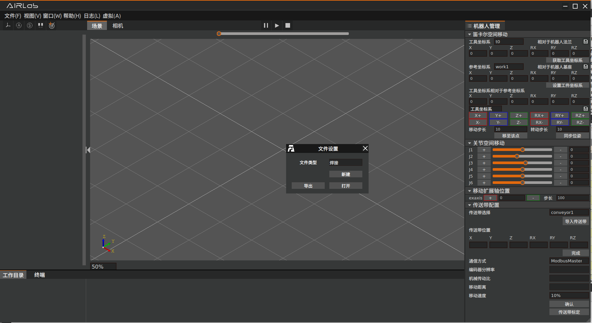

.. centered:: Figure 5-3-1 Configuration File Settings Window

Click "Open" to open the configuration file selection window, choose the configuration file, and click the "Open" button to import the file:

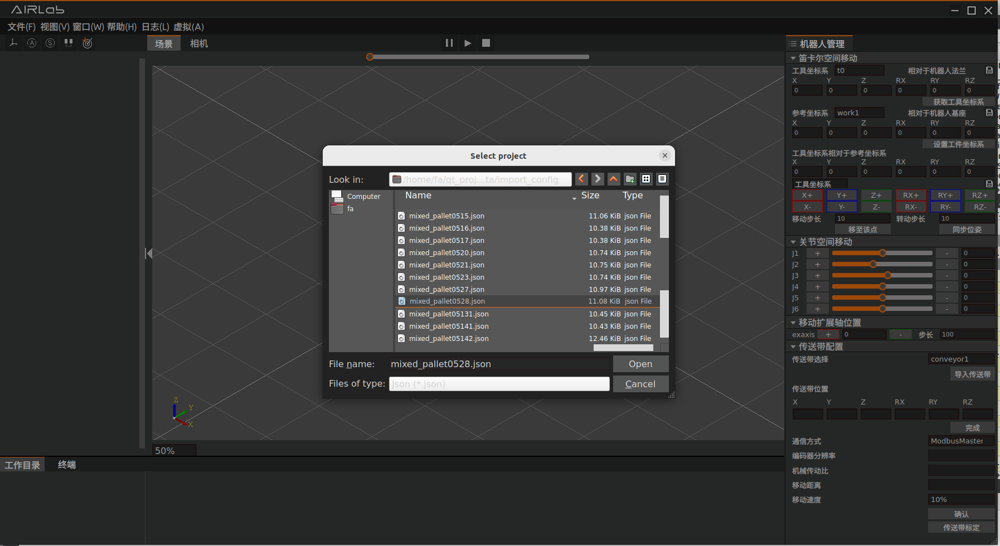

.. centered:: Figure 5-3-2 Configuration File Selection Window

After importing the configuration file, the software interface will appear as shown in the following image, with the contents of the configuration file displayed in the project tree on the left:

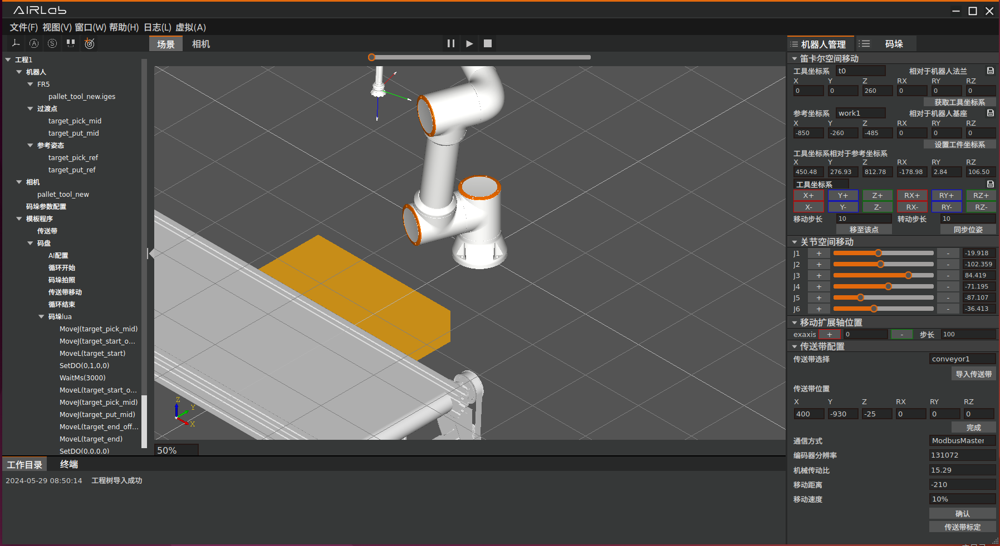

.. centered:: Figure 5-3-3 Software Interface after Importing the Configuration File

Visual Calibration
+++++++++++++++++++++

Visual calibration involves calibrating the relative relationship between the robot, conveyor belt, and camera. Once the entire stacking environment is set up, calibration only needs to be done once. If the positions of the three components do not change in subsequent processes, recalibration is unnecessary. However, if there are any positional changes, recalibration is required.

Camera Hand-Eye Calibration
~~~~~~~~~~~~~~~~~~~~~~~~~~~~~~~~~~

.. important::
    Mount the calibration board at the end flange of the robot and manually move the robot end effector below the camera to ensure that the camera can fully capture the calibration board.

(1) First, click on the camera in the project tree, and then the camera calibration page will appear at the bottom of the robot management panel on the right.

(2) When starting calibration each time, click the "Calibrate Again" button, and then start the calibration.

(3) The overall calibration requires eight shots. The first shot is taken by manually moving the robot to the appropriate position, followed by three translations and then four manual pose adjustments.

(4) After each movement, click the "Capture" button to complete all eight shots. After clicking the "Capture" button, the camera completes one shot, and the point cloud image captured is displayed on the right, with the log printing whether the shot was successful.

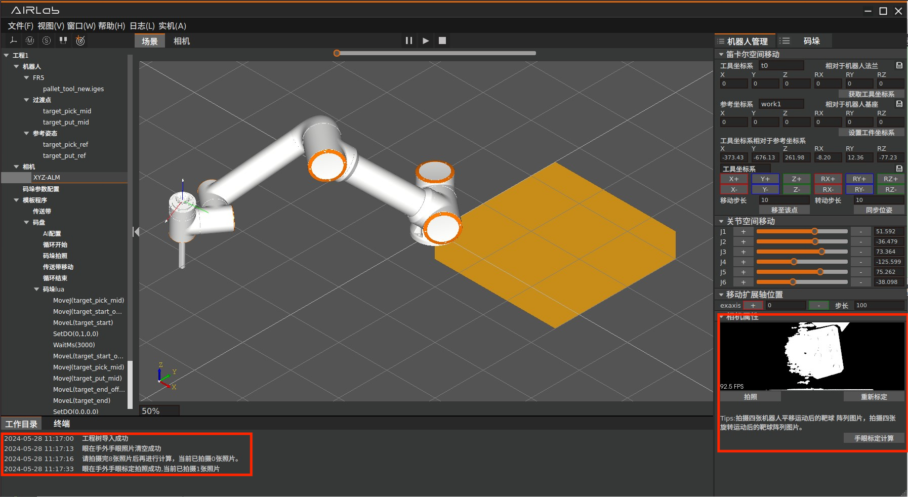

.. centered:: Figure 5-3-4 Photo Shooting Operation

For the first three translations of the robot, switch the status above the software to the "Real Robot" mode. Then, click on the Translation Jogging buttons (X+, X-, Y+, Y-, Z+, Z-) located on the right side of the tool coordinate system panel. Move the robot in any direction to ensure that the camera can still fully capture the calibration board after the translation.

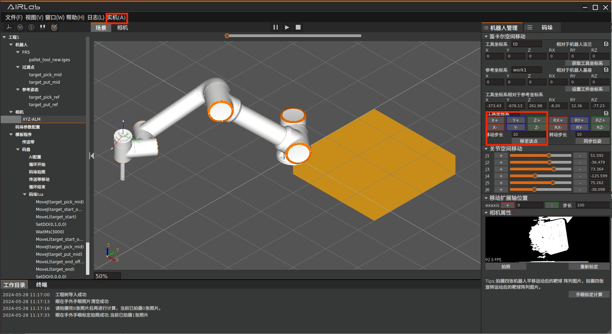

.. centered:: Figure 5-3-5 Translation of the Robot Operation

For the last four manual adjustments of the robot, manually move the robot to change its pose. Again, ensure that the camera can fully capture the calibration board. If the log indicates a failed shot, it's typically because the entire calibration board was not captured. In this case, re-translate or manually adjust the robot to continue with that shot.

After completing all eight shots, click the Hand-eye Calibration Calculation Button. Once the program finishes the calculation internally, the log will print "Calculation Complete" and output the calibration error. An error within 0.5mm indicates successful hand-eye calibration. If the error exceeds this threshold, it is recommended to recalibrate.

.. figure:: airlab_pictures/044.png
    :width: 6in
    :align: center

.. centered:: Figure 5-3-6 Calculation Operation

Conveyor Belt Calibration
~~~~~~~~~~~~~~~~~~~~~~~~~~~~~~~~

The Conveyor Belt Calibration button is located in the bottom right corner of the robot management panel. Click this button to enter the conveyor belt calibration interface.

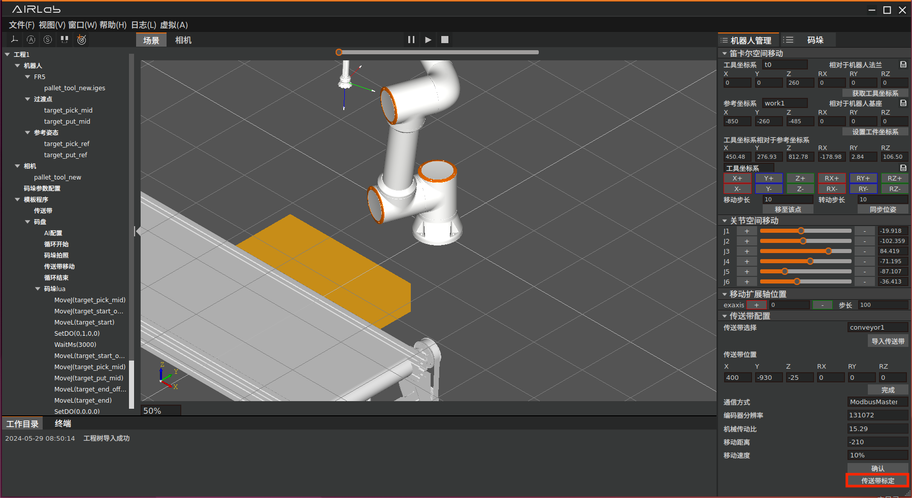

.. centered:: Figure 5-3-7 Conveyor Belt Calibration Button

.. important::
    First, perform calibration of the conveyor belt movement vector. Enter the conveyor belt calibration interface and place the calibration board on the conveyor belt, ensuring that the camera can capture the entire calibration board.

Calibration of the movement vector involves taking two pictures in total. First, click the Capture Image button to take a picture. After the capture, the point cloud image will be displayed, and the terminal will print whether the capture was successful.

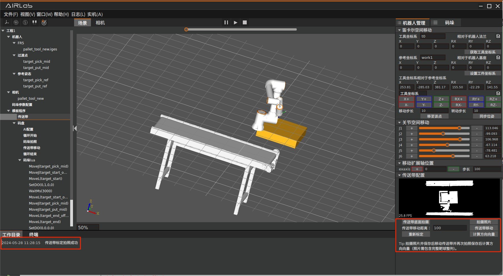

.. centered:: Figure 5-3-8 Conveyor Belt Movement Vector Calibration Capture Image Button

After the conveyor belt moves forward, click the Capture Image button again to take another picture. Once the capture is successful, click the Calculate Direction Vector button. After the program finishes the calculation, it will output the error. If the error is around 0.1mm, the calibration is successful.

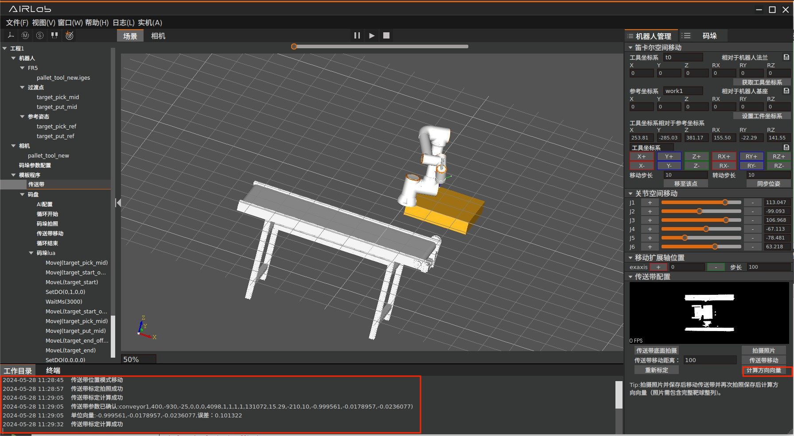

.. centered:: Figure 5-3-9 Calculate Direction Vector Button

Next, perform calibration of the conveyor belt bottom surface height. Remove the calibration board and ensure that the camera only captures the bottom surface of the conveyor belt. Click the Capture Conveyor Belt Bottom Surface button. After the capture is completed, the program will automatically calculate the height of the conveyor belt internally and return success. At this point, the visual ROS node will print the calculated height of the conveyor belt.

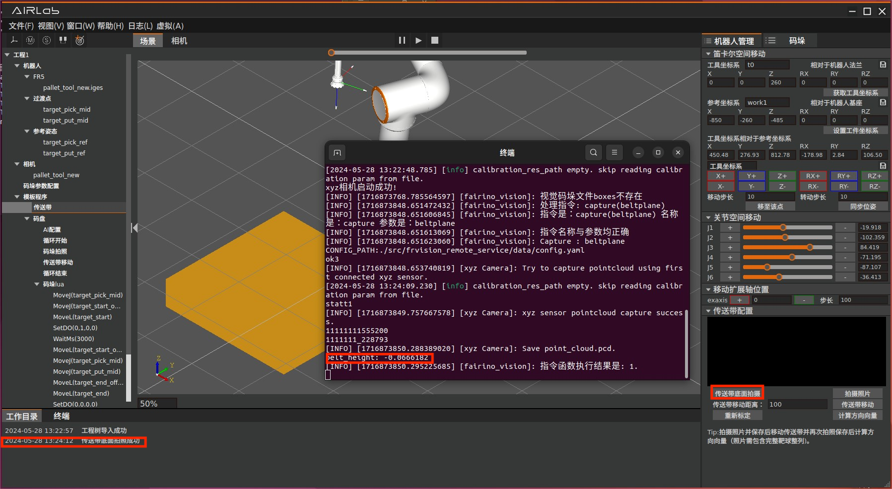

.. centered:: Figure 5-3-10 Conveyor Belt Bottom Surface Button

Robot Parameters Configuration
+++++++++++++++++++++++++++++++++++++++++++

Robot parameters are configured in the robot management panel on the right side. Refer to section "Custom Modules" for methods on importing the robot, tool, pallet, and setting up coordinate systems.

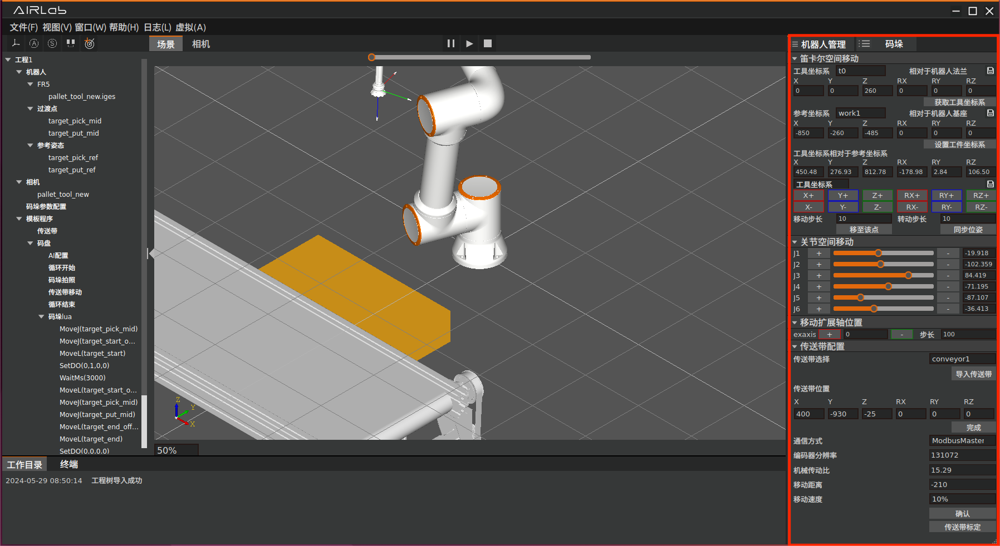

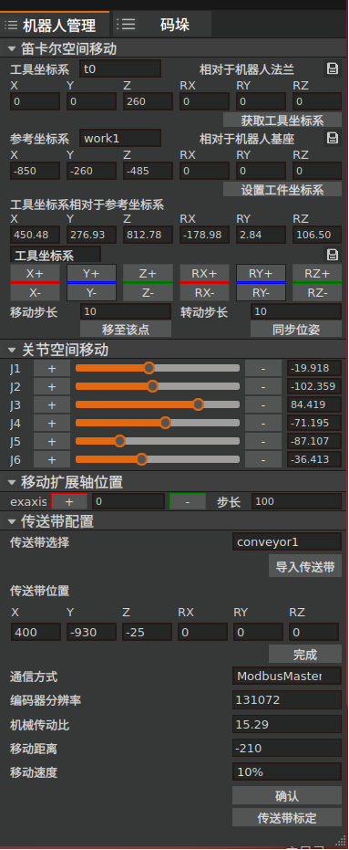

.. centered:: Figure 5-3-11 Robot Management Interface

In the Point Information Modification section, you can use teach and record methods to modify and record the points required for palletizing tasks, such as the pick-up and placement points of the boxes, as well as their respective reference poses.

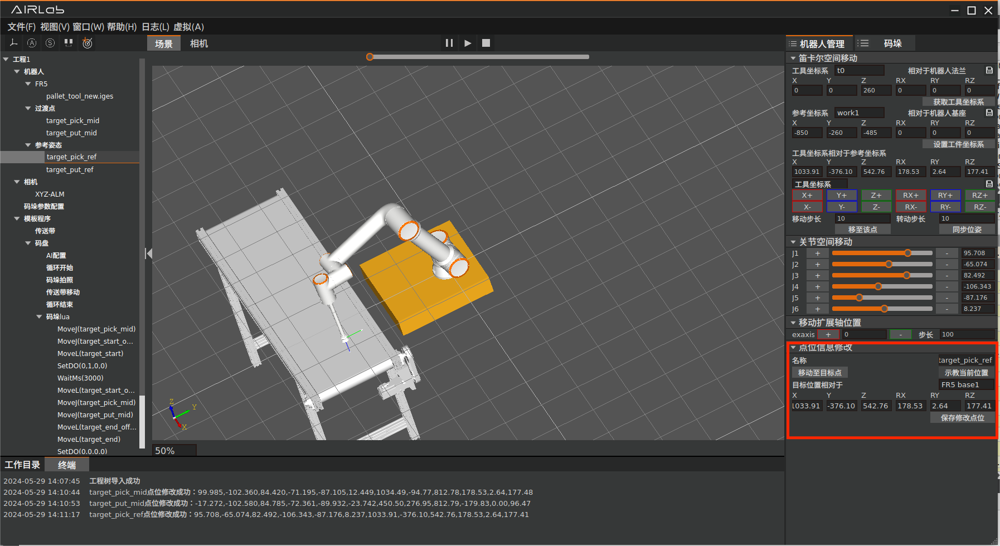

.. centered:: Figure 5-3-12 Reference Pose for the Box Pick-up Point

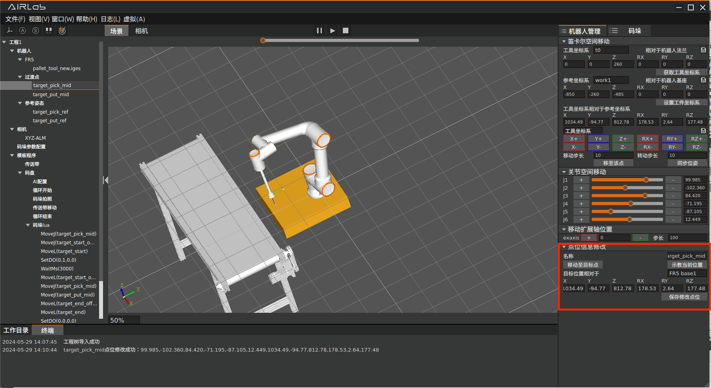

.. centered:: Figure 5-3-13 Box Pick-up Point

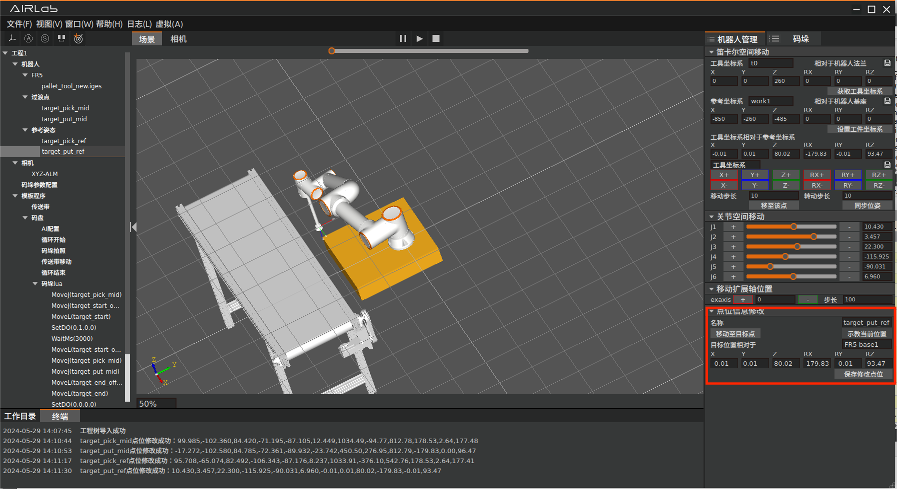

.. centered:: Figure 5-3-14 Reference Pose for the Box Placement Point

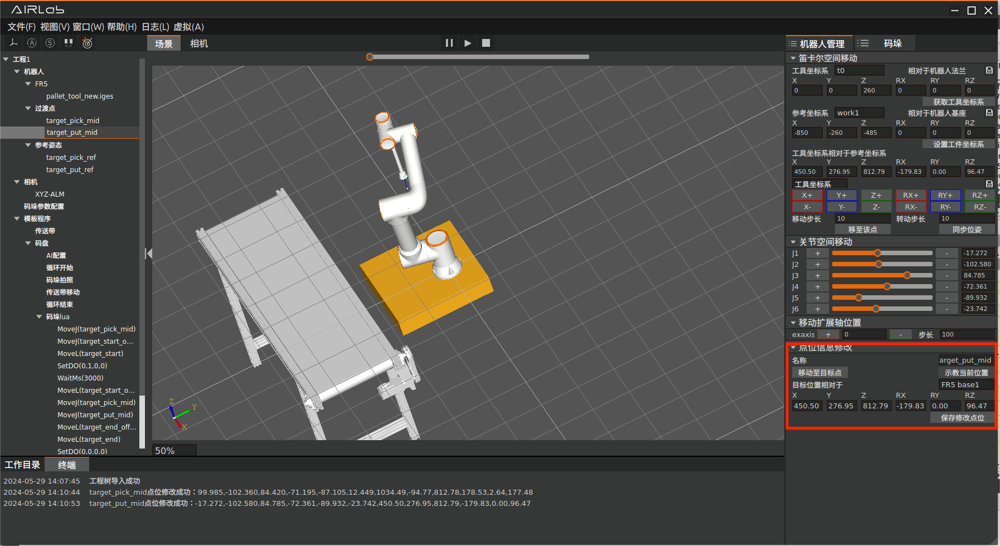

.. centered:: Figure 5-3-15 Box Placement Point

Conveyor belt-related parameters are configured in the Conveyor Belt Configuration section.

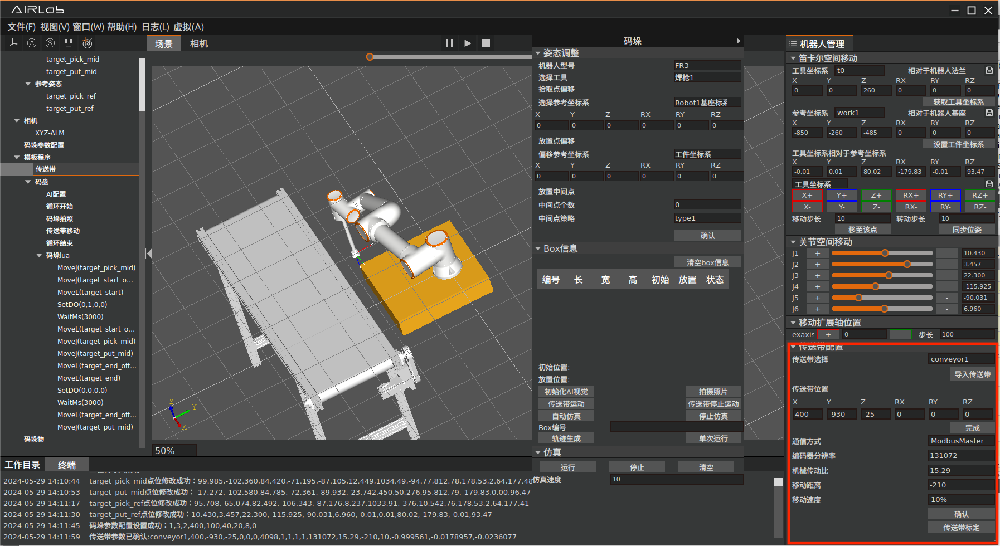

.. centered:: Figure 5-3-16 Conveyor Belt Configuration

Palletizing Parameters Configuration
++++++++++++++++++++++++++++++++++++++++++++++

Configure mixed palletizing parameters in the palletizing panel on the right side. Clicking on the icon to the left of the "Palletizing" text allows you to toggle the panel to float.

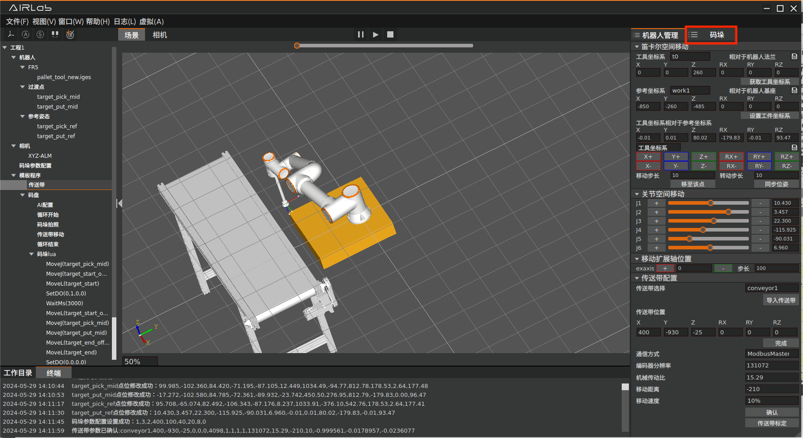

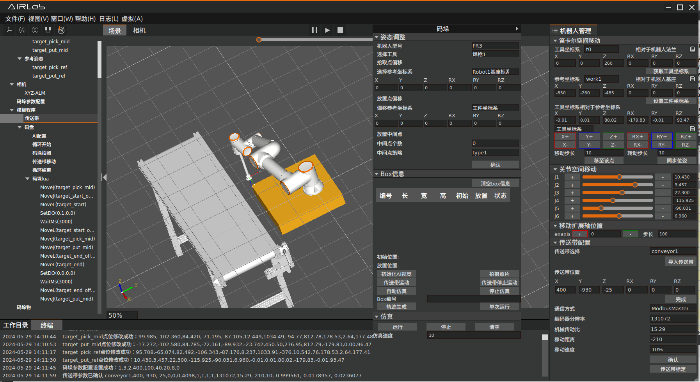

.. centered:: Figure 5-3-17 Mixed Palletizing Panel and its Floating Effect

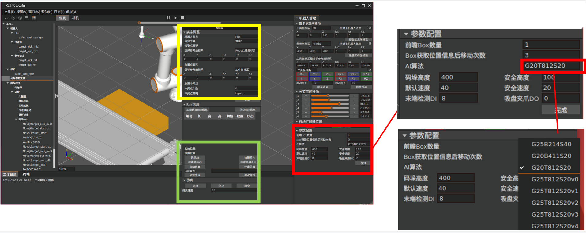

.. centered:: Figure 5-3-18 Mixed Palletizing Parameters Configuration

Execution of Palletizing Task
--------------------------------

After completing the initialization configuration, if you need to debug and run step by step, you need to click the Initialize AI & Vision button in the execution control area (highlighted in green in Figure 5.6) on the palletizing panel.

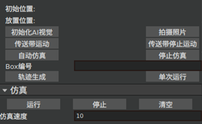

.. centered:: Figure 5-4-1 Mixed Palletizing Execution Control Area

At this point, the AI node terminal window will display the following content, indicating that the AI node has been initialized successfully:

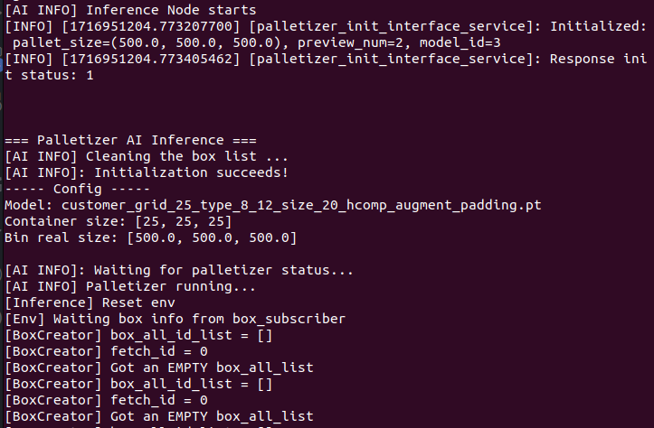

.. centered:: Figure 5-4-2 AI Node Initialization Succeeded

Place the boxes to be palletized onto the conveyor belt. Click the start button on the top left corner of the interface to switch the robot mode to automatic mode. Then, click the button  on the top of the 3D robot and function area. The software will start the automatic operation process of "Capture -> Conveyor Belt Movement -> Robot Palletizing".

During the palletizing process, in the Box Information section on the palletizing panel, you can query in real-time the size of each box, its initial position on the conveyor belt, and its estimated placement position on the pallet. In the 3D scene interface, you can see the simulation model of each box. Clicking on a box number in the Box Information table will highlight the corresponding box in the 3D scene interface in red.

.. note:: 
    - 1-Start button
    - 2-Stop button

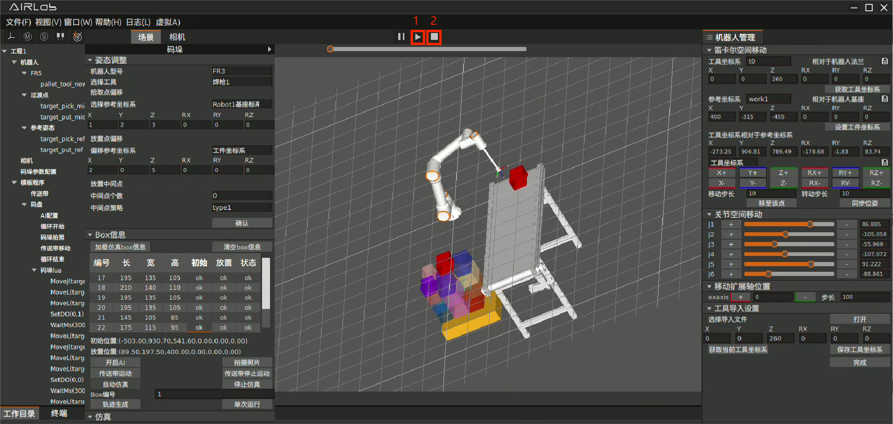

.. centered:: Figure 5-4-3 3D Scene Interface during Palletizing Execution

Stopping and Restarting the Palletizing Task
----------------------------------------------------

When the inference of the AI node completes normally, the AI node terminal window will display the following content:

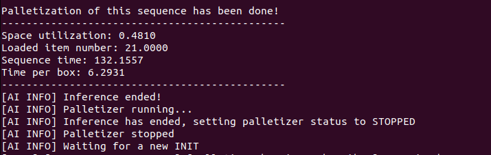

.. centered:: Figure 5-5-1 AI Node Inference Ended

This indicates that the current execution has been successfully completed. After organizing the palletized boxes and the remaining boxes on the conveyor belt, click the Start AI button to restart a new round of palletizing.

If you need to manually stop during the execution, click the stop button at the top of the 3D robot and function area.

