User Interface
====================

.. toctree:: 
   :maxdepth: 6

Main Interface
----------------

As shown below, the AIRLab software mainly includes the following six modules: 1--menu bar, 2--toolbar, 3--project tree, 4--3D robo and functional area, 5--command feedback area, and 6--operation area. The 3D robot and functional area mainly displays the robot, tool, workpiece model, and scene elements. The command feedback area provides feedback on command execution results.

.. note::
    Clicking the working directory or terminal toggles between displaying the working directory and command feedback results.

For an introduction to the menu bar, toolbar, operation area, and project tree, see the following chapters.

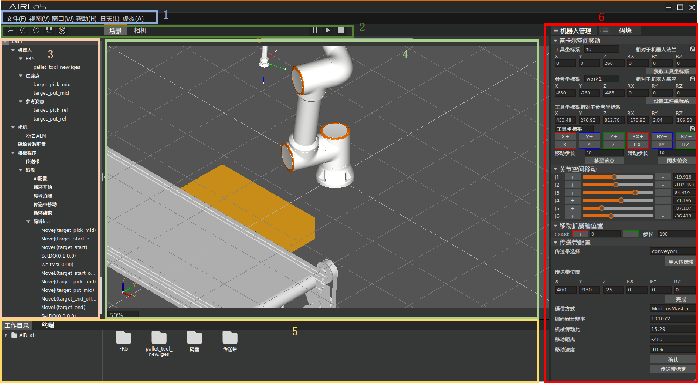

.. centered:: Figure 3-1-1 Main Interface

Menu Bar
----------------

The menu bar includes the following six modules: File, View, Window, Help, Log, and Virtual. The Window and Help functions are currently not available. After clicking the Virtual function, the button will change to Real Machine, which synchronizes the current robot position in real-time to the 3D scene. In real machine mode, clicking the button switches back to virtual mode and does not synchronize the robot position in real-time to the 3D scene.

File
+++++++++

Clicking on File will bring up the dialog box shown below.

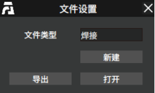

.. centered:: Figure 3-2-1 File Dialog Box

To create a new configuration file, select the type of file to be created.

.. note::
    Currently only welding and palletizing are supported.

After selecting, click New to create a new configuration file. The following figure shows a created palletizing configuration file.

.. figure:: airlab_pictures/007.png
    :width: 6in
    :align: center

.. centered:: Figure 3-2-2 Creating A New Configuration File

To import an already saved configuration file, click Open, select the file to be imported from the dialog box shown below, and then click Confirm to import the saved configuration file.

.. figure:: airlab_pictures/008.png
    :width: 6in
    :align: center

.. centered:: Figure 3-2-3 Importing A Configuration File

To export the current scene, click Export, enter the name of the configuration file to be saved, and then click Save to save the current scene as a configuration file.

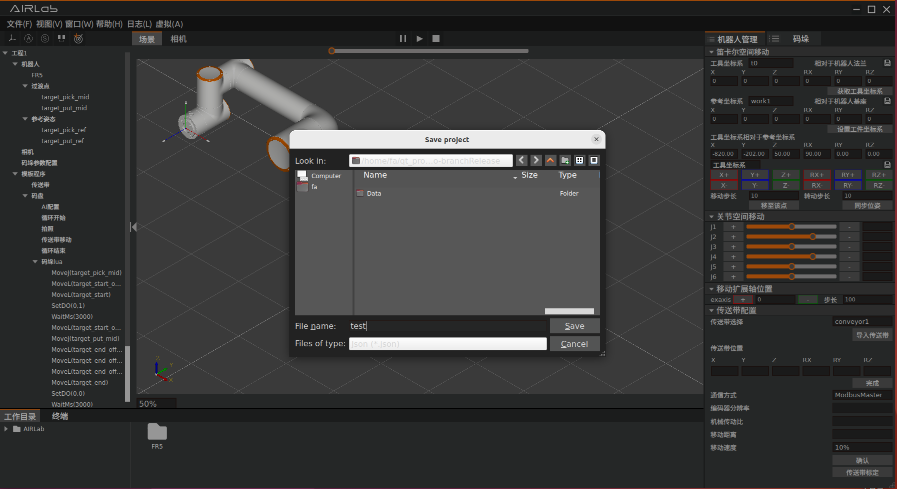

.. centered:: Figure 3-2-4 Exporting the Current Scene

View
++++++

The functions of the View menu are shown in the table below.

.. centered:: Table 3.1 Functions of the View Menu

.. csv-table::
    :widths: 10 30

    "Zoom","Use the mouse wheel to zoom in or out of the 3D scene"
    "Pan","Hold down the mouse wheel to move and pan the 3D scene"
    "Rotate","Hold down the mouse wheel to rotate the 3D scene"
    "Reset","Restore the 3D scene to its initial state"
    "Fit all","Automatically adjust the size and position of the visible area"
    "Front View","Switch to the front view"
    "Back View","Switch to the back view"
    "Top View","Switch to the top view"
    "Bottom View","Switch to the bottom view"
    "Left View","Switch to the left view"
    "Right View","Switch to the right view"
    "Overall View","Switch to the overall view"

Log
++++++

Clicking Log will bring up the dialog box shown below.

The log levels are: DEBUG, INFO, WARNING, and ERROR.

- **DEBUG**: it will automatically record DEBUG, INFO, WARNING, and ERROR level logs.

- **INFO**: it will automatically record INFO, WARNING, and ERROR level logs.

- **WARNING**: it will automatically record WARNING and ERROR level logs.

- **ERROR**: it will automatically record ERROR level logs. The default log level is INFO.

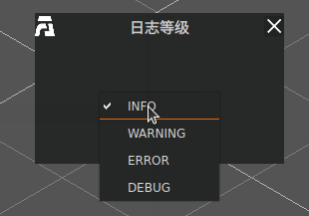

.. centered:: Figure 3-2-5 Log Levels Setup

Toolbar
--------------

Click Scene to display the current 3D scene. Click Camera to display the camera view. Other toolbar functions are as follows.

Operation Area
-----------------
As shown in the figure, the operation area includes two modules: the robot module and the palletizing module.

.. note::
    The palletizing module appears only after importing the palletizing project file.

Clicking the yellow highlighted area switches the operation area to the robot module, clicking the red highlighted area displays the palletizing module in a popup window (which can be moved), and clicking the green module switches the operation area to the palletizing module (which cannot be moved).

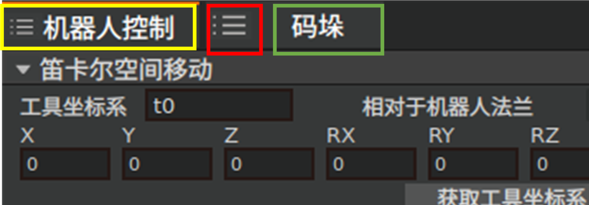
    
.. centered:: Figure 3-4-1 Operation Area Switching 1

When the palletizing module is displayed as a popup window, clicking the red highlighted area in the figure below will switch the operation area to the palletizing module, and it cannot be moved.

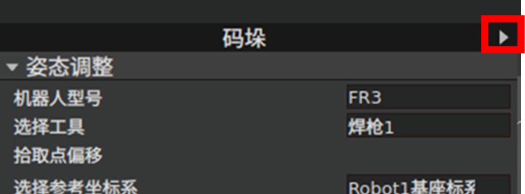
    
.. centered:: Figure 3-4-2 Operation Area Switching 2

The robot module consists of two parts: robot management and other controls.

Robot Management
++++++++++++++++++

As shown in the figure below, robot management is divided into four parts: Cartesian space movement, joint space movement, moving the extended axis position, and custom modules.

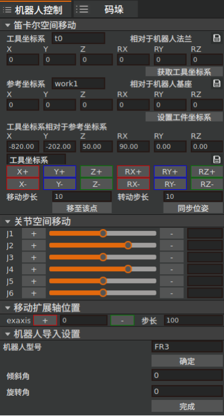
    
.. centered:: Figure 3-4-3 Robot Management

Cartesian Space Movement
~~~~~~~~~~~~~~~~~~~~~~~~~~~~~~~~~~~~~~~~

The Cartesian space movement includes the following functions: tool and workpiece coordinate system settings, Cartesian coordinate display, and jogging.

**Tool Coordinate System Settings**: The red rectangle area allows selection of the current AIRLab tool coordinate system number. The blue rectangle area allows setting the AIRLab tool coordinate system. Clicking "Get Tool Coordinate System" retrieves the current robot's tool coordinate system value and applies it to AIRLab. The save function is currently not available.

.. figure:: airlab_pictures/022.png
    :width: 3in
    :align: center
    
.. centered:: Figure 3-4-4 Obtaining Tool Coordinate System

**Workpiece Coordinate System Settings**: The red rectangle area allows selection of the current AIRLab workpiece coordinate system number. The blue rectangle area allows setting the AIRLab workpiece coordinate system. Clicking "Set Workpiece Coordinate System" retrieves the current AIRLab workpiece coordinate system and sets it as the current robot workpiece coordinate system (the workpiece number is the selected workpiece number). The save function is currently not available.

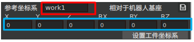
    
.. centered:: Figure 3-4-5 Setting Workpiece Coordinate System

When in virtual state, clicking “+” or “-” or setting the Cartesian space pose achieves Cartesian space movement of the 3D model of the robot. After pressing and holding for 0.6 seconds, the movement is triggered, releasing or reaching the position stops the movement. When in real state, clicking “+” or “-” or setting the Cartesian space pose achieves actual robot Cartesian space movement. The yellow rectangle area displays the current AIRLab robot Cartesian coordinates.

.. note::
    You can set the step length by modifying the move step length and rotate step length.

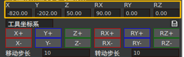
    
.. centered:: Figure 3-4-6 Cartesian Space Jogging

Joint Space Movement
~~~~~~~~~~~~~~~~~~~~~~~~~~~~~~~~~

Joint space motion allows for the manipulation of the robot's joint angles within the 3D scene. You can either drag the sliders for J1-J6 or manually set the joint values for J1-J6 to achieve the desired movement of the robot model in joint space.

When the current state is virtual, clicking the “+” or “-” buttons or setting the joint space pose will move the robot model in joint space. Press and hold for 0.6 seconds to trigger the movement, release to stop the movement or it will stop when reaching the position.

When the current state is real, clicking the “+” or “-” buttons will move the actual robot in joint space.

.. note::
    You can set the step length by modifying the move step length and rotate step length.

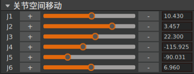
    
.. centered:: Figure 3-4-7 Joint Space Jogging

Extended Axis Movement
~~~~~~~~~~~~~~~~~~~~~~~~~~~~~~~~~

Extended Axis Move (need to import extended axes), display the current position of extended axes in the 3D scene. Drag the slide or set the value to realize the spatial movement of the 3D model of the extended axis.

Click “+” “-” or set the joint space position to realize the joint space movement of the robot 3D model, press and hold for 0.6s to trigger the movement, and release or Press and hold 0.6s to trigger the movement, and release or stop the movement in place.

.. note::
    You can set the step length by modifying the moving step length and rotating step length

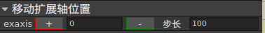
    
.. centered:: Figure 3-4-8 Extended Axis Movement

Custom Modules
~~~~~~~~~~~~~~~~~~~~~~~~~~~~~~~~~

Custom modules include the following components: robot import settings, tool import settings, camera configuration (hand-eye calibration), conveyor belt configuration, pallet configuration, palletizing parameter configuration, and point modification.

**Robot Import Settings**: Select the actual robot model and click import to load the robot into the 3D scene. If ROS is connected, the robot's DH parameters will be automatically retrieved and compensated. You can set the robot's inclination and rotation angles here. Click confirm to apply other installation methods.

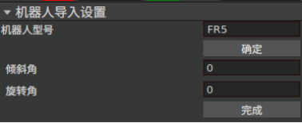
    
.. centered:: Figure 3-4-9 Robot Import Settings

**Tool Import Settings**: Click to open and select the tool model to be imported. The corresponding tool model will be loaded into the current 3D scene. Click "Get current tool coordinate system" to obtain the current robot's tool coordinate system. Click finish to save the settings to the buffer (to save the project, export the file).

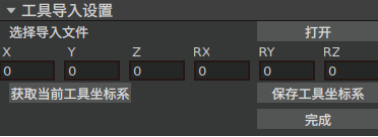
    
.. centered:: Figure 3-4-10 Tool Import Settings

**Camera Configuration**: Includes camera selection and settings (hand-eye calibration). Select the camera model and click confirm to set the current camera. For camera settings (hand-eye calibration), see section 'Camera Hand-Eye Calibration'.

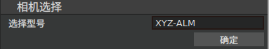
    
.. centered:: Figure 3-4-11 Camera Configuration

**Conveyor Belt Configuration**: Includes conveyor belt parameter configuration and hand-eye calibration. After selecting the conveyor belt, click import to load the conveyor belt model into the 3D scene. Input the conveyor belt position and click finish to set its position in the 3D scene (any position error will only affect the visual effect in the 3D scene, not the actual use). Set the communication method, output resolution, mechanical transmission ratio, single movement distance, and speed. Click confirm to save the parameters to the buffer. Click conveyor belt calibration to enter the calibration page, see section 'Conveyor Belt Configuration'.

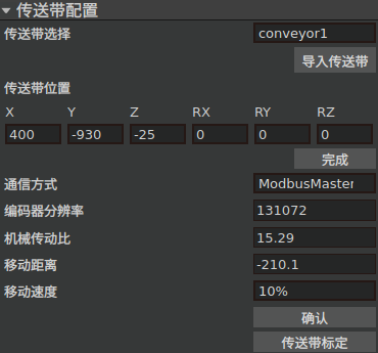
    
.. centered:: Figure 3-4-12 Conveyor Belt Configuration

**Pallet Configuration**: Input the length, width, and height of the pallet to be generated and select the pallet coordinate origin (suggested to choose the origin at the top surface endpoint 1). Click generate to create the pallet in the 3D scene. Input the pallet coordinate system and click set to reset the pallet position in the 3D scene.

.. figure:: airlab_pictures/031.png
    :width: 3in
    :align: center
    
.. centered:: Figure 3-4-13 Pallet Configuration

**Palletizing Parameter Configuration**: Set the preview box number k, number of movements after obtaining box position information, chosen AI algorithm, maximum palletizing height, safety height (transition position above the pickup point), default speed, safety speed (speed when approaching pickup and placement points), DO signals for controlling suction cups and grippers, and end detection DI (not yet open). Click complete to finalize the settings. Please refer to 4.2 for more explanation of the preview number k, number of movements after obtaining box position information, and the AI algorithm.

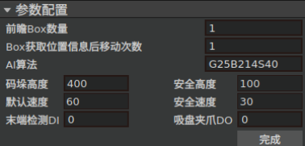
    
.. centered:: Figure 3-4-14 Palletizing Parameter Configuration

**Point Modification**: Teaching the current position is generally used in the actual situation (virtual and actual robot positions are synchronized in real-time). Move the robot to the appropriate position and click "teach current position" to save it as the current position. Saving and modifying points is generally used in virtual situations, using the robot's position in the 3D scene as the initial pose and the target Cartesian position as parameters to solve the inverse kinematics and save the target position.

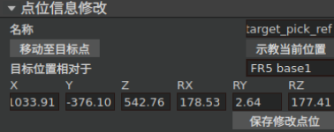
    
.. centered:: Figure 3-4-15 Point Modification

Other Controls
+++++++++++++++++++++++

The control includes two modules: IO control and external axis control.

As shown below, the IO control interface allows for the manual control of digital and analog outputs of the robot controller, end tool, and extended IOs. This includes digital outputs (DO) and analog outputs (AO) with a range of 0-10V.

**DO Operation**: Select the port number, click "Open" to set the corresponding DO to high level, click "Close" to set it to low level.

**AO Operation**: Select the port number, enter the desired value (0-100) in the input box, where the value represents a percentage (100 means the maximum output). Click "Set" to apply the value to the selected AO port.

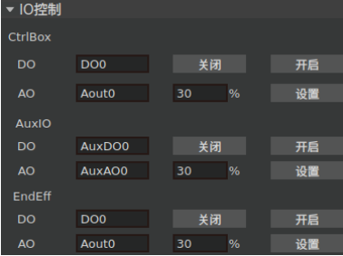
    
.. centered:: Figure 3-4-16 IO Control

As shown below, the external axis control interface allows for the control and management of the robot's external axis.

**Load**: Load the external axis protocol based on the selected extended axis number.

**Remove Enable**: Disable the external axis.

**Servo Enable**: Enable the external axis servo.

**Forward Jog**: Perform a forward jog movement of the external axis based on the set speed, acceleration, and distance.

**Reverse Jog**: Perform a reverse jog movement of the external axis based on the set speed, acceleration, and distance.

**Stop Jog**: Stop the jog movement of the external axis.

**Zero Setting**: Perform a zero setting of the external axis according to the current homing method, homing speed, and clamp speed.

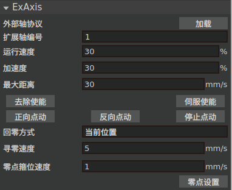
    
.. centered:: Figure 3-4-17 External Axis Control

Palletizing Module
++++++++++++++++++++++++

The palletizing module includes three parts: pose adjustment, box information, and simulation.

Pose Adjustment
~~~~~~~~~~~~~~~~~~~~~~

The pose adjustment module allows for compensation of pick and place points. Currently, the pick point compensation is only available with the robot base coordinate as the reference coordinate system, and the place point compensation is only available with the robot workpiece coordinate system as the reference coordinate system.

The intermediate place point is the midpoint for palletizing placement. Users can select the number of intermediate points and the intermediate point strategy (currently, there is only one strategy available). For example, if the placement position is z1, the palletizing height is h, and the safety height is safe_h, then Zmax = h + safe_h and Zmin = z1 + h. Intermediate points are set between Zmax and Zmin. Click "Complete" to finalize the settings and save them to the buffer.

.. figure:: airlab_pictures/036.png
    :width: 3in
    :align: center
    
.. centered:: Figure 3-4-18 Pose Adjustment

Box Information
~~~~~~~~~~~~~~~~~~~~~~

**Clear Box Information**: clear the current received.

**Initialize AI Vision**: clear the cache information of AI and vision to prepare for the next stacking operation.

**Capture Photo**: issue commands to control the camera to take photos.

**Conveyor Belt Movement**: issue commands to control the camera to take photos, once successfully captured, control the conveyor belt to move once.

**Conveyor belt stoppage**: not yet enabled.

**Automatic Simulation**: when enabled, simulates operations in a three-dimensional scene according to the received Box Information (simulation requires setting the mode to virtual).

**Stop Simulation**: click to stop automatic simulation.

**Trajectory Generation**:generate simulation trajectory for the nth box based on the selected Box number.

**Single Movement**:issue commands to perform single stacking for the nth box.

Initialization of AI vision,Conveyor Belt Movement, and Single Movement are used for manual debugging to confirm whether pose compensation is needed.

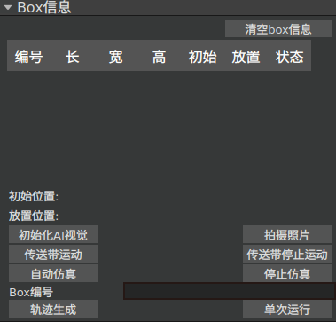
    
.. centered:: Figure 3-4-19 Box Information

Simulation
~~~~~~~~~~~~~~~~~~~~~~

After setting the simulation speed, click "Simulate". The robot will perform a single simulation stacking.

.. important::
    Can only be used after trajectory generation.

Click Stop to halt the movement.

Click Clear to clear the simulation trajectory.

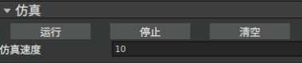
    
.. centered:: Figure 3-4-20 Simulation

Project Tree
--------------------

The custom interface accessed by clicking on the project tree is shown in the following table:

.. centered:: Table 3.2 Custom Interface Accessed via Project Tree Jump

.. csv-table:: 
    :header: "Current Node","Jump Target"
    :widths: 40 60

    "Robot","Robot Import Settings"
    "FR3、FR5、FR10、FR16、FR20","Tool Import Settings"
    "target_pick_mid","Point Modification"
    "target_put_mid","Point Modification"
    "target_pick_ref","Point Modification"
    "target_put_ref","Point Modification"
    "Camera","Camera Settings"
    "XYZ-ALM","Camera Properties (Hand-Eye Calibration)"
    "Palletizing Parameter Configuration","Palletizing Parameter Configuration"
    "Conveyor Belt","Conveyor Belt Configuration"
    "Pallet","Pallet Configuration"
