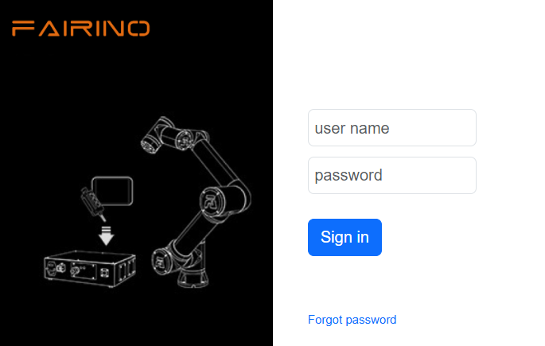
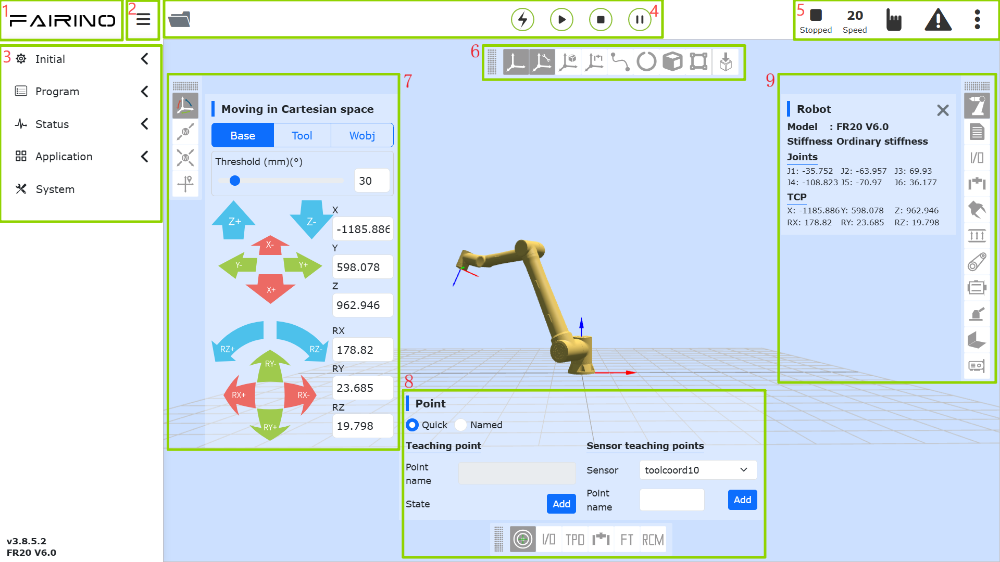

WebApp access login
=====================

.. toctree:: 
   :maxdepth: 6

Access and log in to the WebApp interface
-------------------------------------------

1. Turn on the control box and connect the network cable to the PC;
2. Open the chrome browser on the PC and access the target URL 192.168.58.2;
3. Enter the user name and password and click Login to log in to the WebApp.

The initial user name is admin and the password is 123.

.. centered:: Figure 2.1-1 Login interface

Simple understanding of WebApp interface
------------------------------------------

After the login is successful, the system enters the "Initial". Mainly include:

1. FAIRINO LOGO;
2. Menu bar zoom button;
3. Menu bar;
4. Robot control area;
5. Robot status area;
6. 3D simulation robot - 3D scene operation;
7. 3D simulation robot - robot body operation;
8. Robot supporting functions;
9. Robot and supporting function status.

The initial interface of the system is shown in the figure below:

.. centered:: Figure 2.2-1 Schematic diagram of the initial interface of the system

Control area
~~~~~~~~~~~~~~~

.. note:: 
   .. image:: teaching_pendant_software/064.png
      :width: 0.75in
      :height: 0.75in
      :align: left

   name: **"Press the teach program button"**
   
   effect: Open the teaching programs for coding programming, graphical programming, and Node Graph programming.

.. note:: 
   .. image:: teaching_pendant_software/003.png
      :width: 0.75in
      :height: 0.75in
      :align: left

   name: **Enable button**
   
   effect: Enable the robot

.. note:: 
   .. image:: teaching_pendant_software/004.png
      :width: 0.75in
      :height: 0.75in
      :align: left

   name: **Start button**
   
   effect: Upload and start running the teaching program

.. note:: 
   .. image:: teaching_pendant_software/005.png
      :width: 0.75in
      :height: 0.75in
      :align: left

   name: **Stop button**
   
   effect: Stop the current teaching program running

.. note:: 
   .. image:: teaching_pendant_software/006.png
      :width: 0.75in
      :height: 0.75in
      :align: left

   name: **Pause/Resume button**
   
   effect: Pause and resume the current teaching program

.. important::
   The pause instruction is at the end of the program and cannot be judged.

Status Bar
~~~~~~~~~~~~

.. note:: 
   .. image:: teaching_pendant_software/011.png
      :width: 0.75in
      :height: 0.75in
      :align: left

   name: **Error state**
   
   effect: There is an error in the current robot operation, hide when no error.

.. note:: 
   .. image:: teaching_pendant_software/007.png
      :width: 0.75in
      :height: 0.75in
      :align: left

   name: **robot status**
   
   effect: Stopped-stop，Running-run，Pause-pause，Drag-drag

.. note:: 
   .. image:: teaching_pendant_software/010.png
      :width: 0.75in
      :height: 0.75in
      :align: left

   name: **Robot Tool Coordinate System, Workpiece Coordinate System, Extended Axis Coordinate System, and Load Number**
   
   effect: Top Left – Current Tool Coordinate System Number, Top Right – Current Workpiece Coordinate System Number, Bottom Left – Current Extended Axis Coordinate System Number, Bottom Right – Current Load Number

.. note:: 
   .. image:: teaching_pendant_software/009.png
      :width: 0.75in
      :height: 0.75in
      :align: left

   name: **Running speed percentage**
   
   effect: The speed of the robot when it is running in the current mode

.. note:: 
   .. image:: teaching_pendant_software/012.png
      :width: 0.75in
      :height: 0.75in
      :align: left

   name: **Automatic mode**
   
   effect: Robot automatic operation mode.When the global speed adjustment in manual mode and automatic mode is turned on and the speed is specified, the global speed will be automatically adjusted to the specified speed

.. note:: 
   .. image:: teaching_pendant_software/013.png
      :width: 0.75in
      :height: 0.75in
      :align: left

   name: **Manual mode**
   
   effect: Robot manual mode for robot teaching operations.

.. note:: 
   .. image:: teaching_pendant_software/065.png
      :width: 0.75in
      :height: 0.75in
      :align: left

   name: **Robot State Fold/Unfold Button**
   
   effect: Fold/Unfold Tool Coordinate System, Workpiece Coordinate System, Extended Axis Coordinate System, Load, Robot Drag Status, Local/Remote Mode, Robot Connection Status, BOOT Mode, and Account Information Content

Click the collapse/expand button to view the following status information.

.. note:: 
   .. image:: teaching_pendant_software/008.png
      :width: 0.75in
      :height: 0.75in
      :align: left

   name: **Tool coordinate system number**
   
   effect: Display the tool coordinate system number of the current application

.. note:: 
   .. image:: teaching_pendant_software/027.png
      :width: 0.75in
      :height: 0.75in
      :align: left

   name: **Workpiece coordinate system number**
   
   effect: Display the workpiece coordinate system number currently applied

.. note:: 
   .. image:: teaching_pendant_software/028.png
      :width: 0.75in
      :height: 0.75in
      :align: left

   name: **Extended axis coordinate system number**
   
   effect: Displays the currently applied extended axis coordinate system number

.. note:: 
   .. image:: teaching_pendant_software/066.png
      :width: 0.75in
      :height: 0.75in
      :align: left

   name: **Payload**
   
   effect: Display the load weight and center of gravity coordinates X, Y, Z of the current application.

.. note:: 
   .. image:: teaching_pendant_software/014.png
      :width: 0.75in
      :height: 0.75in
      :align: left

   name: **Drag state**
   
   effect: The current robot can drag

.. note:: 
   .. image:: teaching_pendant_software/015.png
      :width: 0.75in
      :height: 0.75in
      :align: left

   name: **Drag state**
   
   effect: The current robot is not draggable

.. note:: 
   .. image:: teaching_pendant_software/068.png
      :width: 0.75in
      :height: 0.75in
      :align: left

   name: **Robot Local Mode**
   
   effect: The current robot is controlled via the control box.

.. note:: 
   .. image:: teaching_pendant_software/067.png
      :width: 0.75in
      :height: 0.75in
      :align: left

   name: **Robot Remote Mode**
   
   effect: Currently, robots can only be controlled through PLC.

.. note:: 
   .. image:: teaching_pendant_software/017.png
      :width: 0.75in
      :height: 0.75in
      :align: left

   name: **Connection status**
   
   effect: Robot connected

.. note:: 
   .. image:: teaching_pendant_software/016.png
      :width: 0.75in
      :height: 0.75in
      :align: left

   name: **Not connected status**
   
   effect: Robot not connected

.. note:: 
   .. image:: teaching_pendant_software/018.png
      :width: 0.75in
      :height: 0.75in
      :align: left

   name: **Account information**
   
   effect: Display username and permissions and logout user
