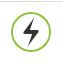

WebApp access login
=====================

.. toctree:: 
   :maxdepth: 6

Access and log in to the WebApp interface
-------------------------------------------

1. Turn on the control box and connect the network cable to the PC;
2. Open the chrome browser on the PC and access the target URL 192.168.58.2;
3. Enter the user name and password and click Login to log in to the WebApp.

Refer to the user manual for the initial user name and password—analysis of the teaching pendant software\ `4.1.3. User login and permission update <teaching_pendant_software.html#id5>`__\ 

.. figure:: teaching_pendant_software/002.png
   :width: 6in
   :align: center

.. centered:: Figure 2.1‑1 Login interface

Simple understanding of WebApp interface
------------------------------------------

After the login is successful, the system enters the "initial interface". The initial interface shows that the teach pendant mainly includes the FAO LOGO and the button to return to the initial page, the menu bar, the menu bar zoom button, the robot operation area, the control area, the status area, the 3D simulation robot and Pose and IO information area, a total of eight areas. The initial interface of the system is shown in the figure below:

.. centered:: Figure 2.2‑1 Schematic diagram of the initial interface of the system

For the control area, status bar and menu bar, please refer to the user manual - software analysis of the teaching pendant\ `4.2.1. Control area <teaching_pendant_software.html#id7>`__\ 、\ `4.2.2. Status Bar <teaching_pendant_software.html#id8>`__\ and \ `4.2.3. Menu Bar <teaching_pendant_software.html#id9>`__\ 。
