Applications
==============================

.. toctree::
   :maxdepth: 6

Robot Packing
-----------------

Under the "Applications" -> "Tool App" menu bar, click the "Robot Packing" button to enter the one-click robot packing interface.

.. important::
   Before operating the packing function, please confirm the robot's surrounding environment and status to prevent collisions.

   If leaving the factory, first go to System Settings -> General Settings and perform a factory reset before packing.

**Step1**: Before moving to the packing point, first move the robot to the zero point.

**Step2**: Click the "Move to Zero Point" button, confirm the robot's mechanical zero point is correct, and ensure the gaps in each joint are aligned as shown in the orange circles in the figure.

**Step3**: Click the "Move to Packing Point" button, the robot will move to the packing point according to the axis angles specified in the packaging process.

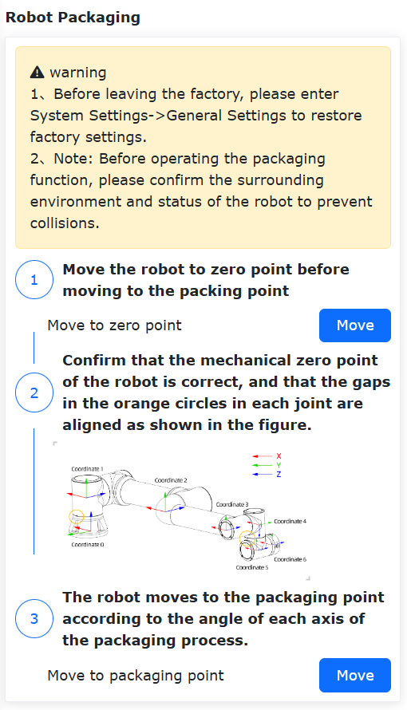

.. centered:: Figure 14.1‑1 One-Click Robot Packing

Data Backup
-----------

1. Under the menu bar of "Auxiliary Applications" -> "Tool Applications", click "Data Backup" to enter the data backup interface, as shown in the figure below.

.. image:: application/002.png
   :width: 4in
   :align: center

.. centered:: Figure 14.2‑1 Data Backup Interface

2. The backup package data includes tool coordinate system data, system configuration files, teaching point data, user programs, template programs, and user configuration files. When users need to transfer data from this robot to another robot for use, this function can be used to achieve it quickly.

Backup Package Integrity Verification Function
~~~~~~~~~~~~~~~~~~~~~~~~~~~~~~~~~~~~~~~~~~~~~~~~~~~~~~~~~~~~~~~~~

To avoid potential security risks caused by inconsistent configurations such as installation methods during the import of backup packages, an MD5 verification function for backup packages and a verification function for key parameters have been added during backup package import.

Backup Package MD5 Verification Function
++++++++++++++++++++++++++++++++++++++++++++++++++++
To ensure the integrity of the imported backup package, an MD5 verification will be performed on the backup package after upload. If the backup package is corrupted or abnormally modified, the MD5 verification will fail, and the following prompt will be displayed:

.. image:: application/048.png
   :width: 6in
   :align: center

.. centered:: Figure 14.2‑2 MD5 Verification Failed

Backup Package Key Parameter Verification Function
++++++++++++++++++++++++++++++++++++++++++++++++++++

A verification function has been added during backup package import. The backup package must be compared with the target robot for key parameters, as detailed in the table below. Inaccurate settings of these parameters may pose certain security risks. Only when they are completely identical can the backup package be imported normally.

Table of 5 Key Parameters for Comparison:

.. list-table::
   :widths: 15 40 100
   :header-rows: 0
   :class: sheet-center

   * - **No.**
     - **Key Parameter**
     - **Specific Meaning**

   * - 1
     - ROBOT_TYPE
     - Robot Model

   * - 2
     - INSTALL_POS
     - Installation Method

   * - 3
     - INSTALL_YANGLE
     - Base Tilt Angle

   * - 4
     - INSTALL_ZANGLE
     - Base Rotation Angle

   * - 5
     - NEW_TEACH_ENABLE
     - Dynamic Configuration

If they are inconsistent, an error will be prompted. At this point, it is necessary to check whether the key parameters in the robot to be imported are consistent with those in the backup package.

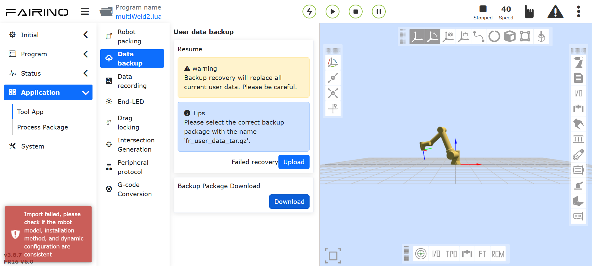

.. centered:: Figure 14.2‑3 When Key Parameters Are Inconsistent, the Interface Will Prompt an Error

Failure/Power Failure Exception Rollback Function
+++++++++++++++++++++++++++++++++++++++++++++++++++++++++++++++

If an exception occurs during the import of the backup package, or if there is an abnormal power failure during data recovery, causing the data recovery to fail to complete normally, to ensure the normal operation of the equipment, the system will automatically revert to the state before the operation after power is restored.

After power is restored, the interface will prompt, "Previous data recovery was not completed and has been automatically reverted. Please restart the control box and try again."

.. image:: application/049.png
   :width: 4in
   :align: center

.. centered:: Figure 14.2‑4 Power Failure Restart Restore Warning Prompt

10s Data Recording
------------------------

Under the "Applications" -> "Tool App" menu bar, click "10s Data Recording" to enter the 10s data recording function interface.

First, select the recording type, which is divided into default parameter recording and self-selected parameter recording. Default parameter recording uses system-automated settings for the recorded data. For self-selected parameter recording, users can choose the parameters to record, with a maximum of 15 parameters. After selecting the parameter list, choose the parameters to record and click the "Move Right" button to add the parameters to the parameter list. Click "Start Recording" for the robot to begin recording data, click "Stop Recording" for the robot to stop recording data, and click "Download Data" to download the last 10 seconds of data.

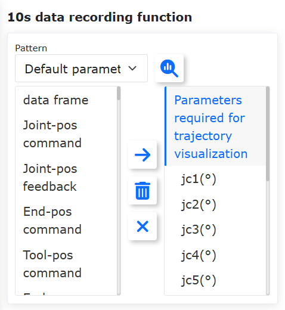

.. centered:: Figure 14.3‑1 10s Data Recording

End-Effector LED
----------------------------

Under the "Applications" -> "Tool App" menu bar, click "End-Effector LED" to enter the end-effector LED color configuration function interface.

The LED color can be configured to green, blue, or white-cyan. Users can configure the LED color for Auto mode, Manual mode, and Drag mode according to their needs. Different modes cannot be configured with the same color.

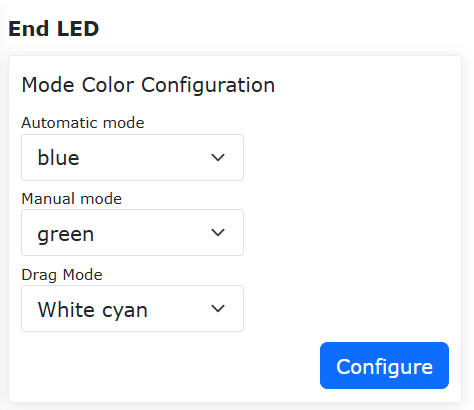

.. centered:: Figure 14.4‑1 End-Effector LED Configuration

Drag Locking
----------------------------

Under the "Applications" -> "Tool App" menu bar, click "Drag Locking" to enter the drag teaching lock configuration function interface.

A degree-of-freedom locking function has been added for drag teaching. When the drag teaching function switch is set to enable, the degree-of-freedom parameters take effect when the user drags the robot. For example, when the parameters are set to X:10, Y:0, Z:10, RX:10, RY:10, RZ:10, dragging the robot in drag mode restricts movement to only the Y direction. If you need to keep the robot's posture unchanged during dragging and only move in the X, Y, Z directions, set X, Y, Z to 0 and RX, RY, RZ to 10.

.. image:: application/006.png
   :width: 4in
   :align: center

.. centered:: Figure 14.5‑1 Drag Teaching Lock Configuration

Normal Collision Protection Triggering Under Force Sensor Assisted Dragging
~~~~~~~~~~~~~~~~~~~~~~~~~~~~~~~~~~~~~~~~~~~~~~~~~~~~~~~~~~~~~~~~~~~~~~~~~~~~~~~~~~~~~~~~~~~~~~~~~~~~~~~~~~~~~~~~

Overview
++++++++++++++++++++++

Currently, FR robots cannot trigger collision protection under force sensor assisted dragging. This enhancement adds the capability to trigger collision protection during force sensor assisted dragging, increasing robot safety and reducing operational risks.

Collision Protection
++++++++++++++++++++++++++++++++++++++++++++

**Step1**: Click "Applications" -> "Tool App" -> "Drag Locking" to enter the Force Sensor Assisted Locking configuration interface. Set the "Status Switch" and "Collision Detection" to ON, as shown below.

.. image:: application/007.png
   :width: 4in
   :align: center

.. image:: application/008.png
   :width: 4in
   :align: center

.. centered:: Figure 14.5‑2 Configuring Force Sensor Assisted Locking

**Step2**: Drag the robot. During robot movement, apply external force to the joints to trigger collision protection. The web interface will report the error "Force Sensor Assisted Dragging Collision Fault", and you can quickly resume/disable force sensor assisted dragging via the web interface, as shown. Click "Resume" to clear the error and resume force sensor assisted dragging; click "Disable" to clear the error and keep force sensor assisted dragging disabled.

.. image:: application/009.png
   :width: 3in
   :align: center

.. centered:: Figure 14.5‑3 Collision Triggered Under Force Sensor Assisted Dragging

.. note::
   Under force sensor assisted dragging, the robot itself is in a stopped state. During dragging, there is a difference between the joint torque command and feedback. It is recommended to set the collision level to level 7 or higher. Setting the collision level too low may cause false collision errors during dragging.

Parameters Calibration of Joint Torque Sensor on the Whole Machine
++++++++++++++++++++++++++++++++++++++++++++++++++++++++++++++++++++++++++++++

Overview
************************

Joint torque sensor sensitivity refers to the sensor's responsiveness to torque changes, describing the proportional relationship between the sensor's output voltage and the actual joint torque being measured. Linearity measures how well a regression model fits the observed data. Hysteresis error is the maximum difference between measurements during forward stroke (from small to large) and reverse stroke (from large to small) under the same test conditions for the joint torque sensor's raw data. Repeatability is the ratio of the current test result to the previous test result, used to determine the repeatability accuracy of the joint torque sensor.

The parameter calibration method involves running the robot through a predetermined trajectory, and calculating the joint torque sensor's sensitivity, linearity, hysteresis error, and repeatability accuracy by acquiring joint gravity torque and joint torque sensor raw data under different postures.

Parameter Calibration
********************************

**Step1**: Set the tool coordinate system to "Tool0". Click "Auxiliary Applications" -> "Tool Applications" -> "Drag Lock". In the joint torque sensor whole-machine drag module, click "Function Enable".

.. image:: application/037.png
   :width: 4in
   :align: center

.. centered:: Figure 14.5‑4 Function Enable

**Step2**: After clicking "Function Enable", proceed with sensitivity calibration. Click "Generate Program" to deploy the internal controller Lua script. Switch the robot to automatic mode and set the run speed to "10". Click "Run" and wait for the robot to move.

.. image:: application/038.png
   :width: 4in
   :align: center

.. centered:: Figure 14.5‑5 Sensitivity Calibration

.. note:: If the joint torque sensor sensitivity calibration is already completed, you can proceed directly to drag function parameter settings.

**Step3**: After the robot completes running the predetermined trajectory, the sensitivity, linearity, hysteresis error, and repeatability calibration results are automatically displayed on the web interface. Click "Set" to apply.

.. image:: application/039.png
   :width: 4in
   :align: center

.. centered:: Figure 14.5‑6 Parameter Calibration Results

Torque Sensing and Compensation Using Dual Encoder Position Difference
+++++++++++++++++++++++++++++++++++++++++++++++++++++++++++++++++++++++++++++++++++++++

Overview
*****************************************

Torque is estimated by utilizing the position difference between dual encoders (motor side and link side). This estimated torque is then used for feedforward compensation, reducing the startup torque when the robot is performing current loop dragging.

Operation Process
*****************************************

**Step1**: Set the dynamics configuration to "Dynamics 2.0". Click "Auxiliary Applications" -> "Tool Applications" -> "Drag Lock". In the dual encoder torque compensation module, click the function switch to enable it.

.. image:: application/040.png
   :width: 4in
   :align: center

.. centered:: Chart 14.5‑7 Enable Function

**Step2**: Set the "Function Switch" to "ON", and set the drag gain for each axis to 0.5. Click "Set" to apply, as shown in the figure.

.. image:: application/041.png
   :width: 4in
   :align: center

.. centered:: Chart 14.5‑8 Gain Setting

.. note:: Drag gain setting range: 0-1. A higher gain results in greater compensated torque and smaller startup torque for the current loop.

Assisted Drag Optimization Function Based on Joint Torque Sensor
+++++++++++++++++++++++++++++++++++++++++++++++++++++++++++++++++++++++++++++++++++++++

Overview
*********************************

This user manual describes the usage of the assisted drag optimization function based on the joint torque sensor. It involves three drag modes and, compared to traditional drag teaching methods, can improve drag compliance and reduce the drag force required by each joint.

Assisted Drag Optimization Function Based on Joint Torque Sensor
**************************************************************************************

Zero Point Calibration and Sensitivity Calibration
""""""""""""""""""""""""""""""""""""""""""""""""""""""""""""""""""""""""

**Step1**: If the zero point calibration and sensitivity calibration have already been completed (the indicator light before calibration is green), there is no need to perform them again. Recalibrate the zero point only when there is a floating sensation during dragging. The calibration process is described below.

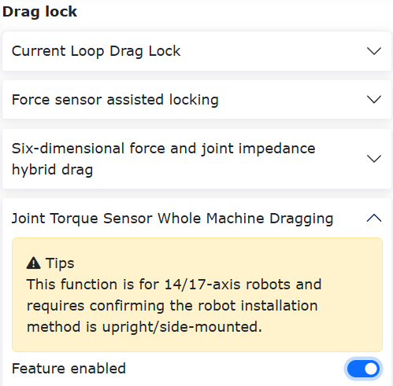

.. centered:: Figure 14.5‑9 Indicator Light Status After Zero Point and Sensitivity Calibration of Joint Torque Sensor

**Step2**: Zero point calibration. Click "Auxiliary Applications" → "Tool Applications" → "Drag Lock" to enter the "Joint Torque Sensor Whole Body Drag" module. Click the "Calibrate" button for zero point calibration to calibrate the zero point data of the joint torque sensor. When the calibration is complete, a "√" will appear, and the zero point calibration result will be updated.

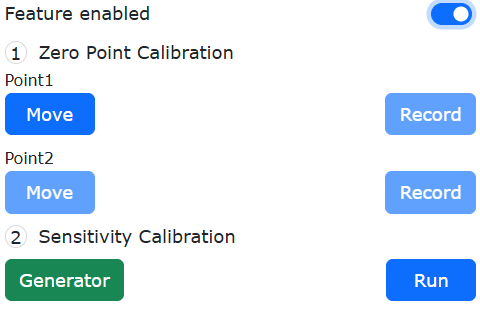

.. centered:: Figure 14.5‑10 Zero Point Calibration of Joint Torque Sensor

**Step3**: Sensitivity calibration (Note: It is recommended to use only the robot body without any load during calibration). Switch the robot motion mode to "Automatic Mode" and set the operation speed to "10%". Click the "Calibrate" button for sensitivity calibration and wait for the robot to complete its motion. After the robot completes the predetermined trajectory, the sensitivity coefficient, linearity, hysteresis error, and repeatability calibration results are automatically displayed on the web interface.

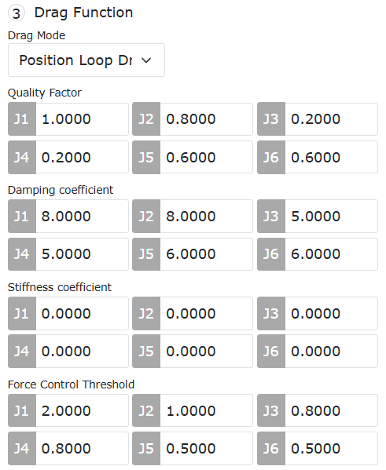

.. centered:: Figure 14.5‑11 Sensitivity Calibration of Joint Torque Sensor

**Step4**: Set the assisted drag function. There are three drag modes, which can be set after completing "Zero Point Calibration" and "Sensitivity Calibration". If not set, the default is "Mode Three", meaning that drag teaching can be performed directly in drag mode after calibration.

Assisted Drag Function - Mode One
******************************************************************
**Step1**: Select the drag mode as "Mode One". When the robot motion mode is "Manual Mode", set the sliding window size, gain coefficient, and joint speed, then click "Apply". At this point, holding down the end "Drag Button" or in drag mode enables drag teaching.

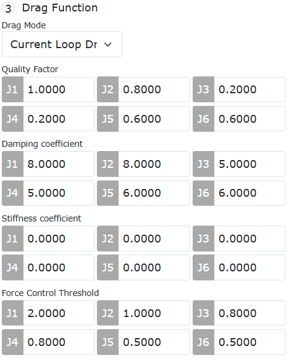

.. centered:: Figure 14.5‑12 Mode One: Parameter Setting

.. note:: 
   (1) The recommended setting for the sliding window size is 30, with a maximum value of 100;
   (2) The gain coefficient affects the feel during dragging. A larger coefficient makes dragging more sensitive but can easily cause instability. The recommended setting for J1-J6 is 0.5;
   (3) The recommended joint speed is 6°/s, which can alleviate overshoot during point alignment.

Assisted Drag Function - Mode Two
******************************************************************

**Step1**: Select the drag mode as "Mode Two". When the robot motion mode is "Manual Mode", set the mass coefficient, damping coefficient, stiffness coefficient, and force control threshold, then click "Apply". At this point, drag teaching can be performed in position mode.

.. image:: application/046.png
   :width: 4in
   :align: center

.. centered:: Figure 14.5‑13 Mode Two: Parameter Setting

.. note:: 
   (1) The mass coefficient affects the joint inertial force during dragging. The recommended settings are: J1-J3: 1.0, J4-J5: 0.5, J6: 0.1;
   (2) The damping coefficient affects the feel during dragging. Higher damping results in a heavier feel. The recommended settings are: J1-J3: 10.0, J4-J5: 5.0, J6: 1.0;
   (3) The stiffness coefficient should be set to 0 for all;
   (4) The force control threshold is the activation torque during dragging. The recommended settings are: J1-J3: 0.3, J4-J5: 0.2, J6: 0.1.

Assisted Drag Function - Mode Three
******************************************************************

**Step1**: Select the drag mode as "Mode Three". When the robot motion mode is "Manual Mode", set the gain coefficient for each joint, then click "Apply". At this point, holding down the end "Drag Button" or in drag mode enables drag teaching.

.. image:: application/047.png
   :width: 4in
   :align: center

.. centered:: Figure 14.5‑14 Mode Three: Parameter Setting

.. note:: 
   (1) The gain coefficient affects the joint drag force during low-speed dragging. When the coefficient ranges from 0.1 to 1.0, the resistance during low-speed dragging increases as the coefficient increases. For precise point alignment tasks, it is recommended to set the J1-J6 gain coefficient to 1.0. When considering overall ease of dragging and compliance, it is recommended to set the J1-J6 gain coefficient to 0.3.

Intersection Point Generation (Laser Point Capture Motion)
----------------------------------------------------------------------------------

During welding, the laser point capture motion can be configured with posture, enabling the robot to achieve the expected posture when reaching the position point. This easily handles special scenarios such as fillet welds and groove welds.

Laser Point Capture Motion Function Operation Process
~~~~~~~~~~~~~~~~~~~~~~~~~~~~~~~~~~~~~~~~~~~~~~~~~~~~~~~~~~~~~~~~~~~~~~~~~~~

**Step1**: Before using the laser sensor, first apply the "Welding Torch" tool coordinate system to the current tool coordinate system. Open the Teach Page, click "Initial Setup", "Basic", "Tool Coordinates" in sequence, select "Welding Torch" as the coordinate system name and apply it. The tool coordinate system in the system status bar will display as Tool1.

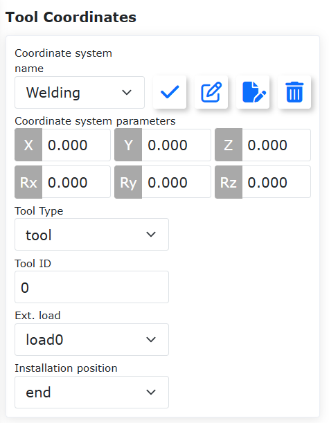

.. centered:: Figure 14.6‑1 Apply Welding Torch Coordinate System

**Step2**: Write the laser point capture motion Lua program. Click "Teach Program" -> "Program Programming" -> "New Button" in sequence, and create a new user program "testPointRecord.lua".

.. figure:: application/011.png
   :align: center
   :width: 4in

.. centered:: Figure 14.6‑2 New Laser Point Capture Motion Program

**Step3**: Configure the reference posture teach point (Optional). In manual mode, drag the robot to the desired welding posture. On the Teach Page, click "Teach Point Record", "Name Point" in sequence, and save the posture teach point as "referencePoint".

.. figure:: application/012.png
   :align: center
   :width: 4in

.. centered:: Figure 14.6‑3 Save Posture Reference Teach Point

**Step4**: Generate the laser point capture motion program. Click "Teach Program" -> "Program Programming" -> "Welding Instructions", "Laser Tracking" in sequence, scroll down to the Sensor Point Capture Motion section, select the required "Motion Mode", "Debug Speed", and posture reference point to generate the corresponding laser point capture LUA program.

If no posture reference point is selected, the posture at the point of capture is maintained by default during motion. If a posture reference point is selected, the robot moves to the laser-captured point using the reference posture.

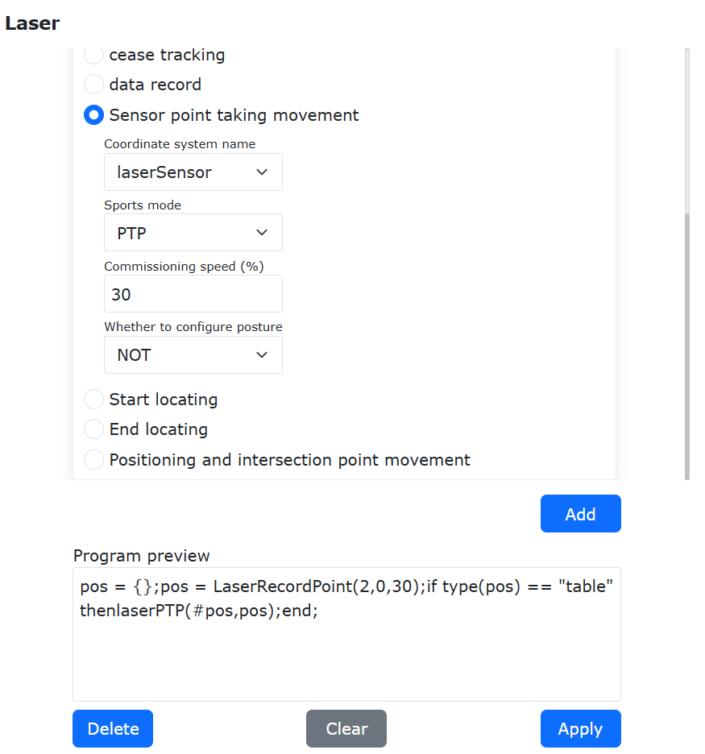

.. centered:: Figure 14.6‑4 Select Posture Reference Teach Point

Execute the laser point capture motion. Drag the robot so that the laser sensor beam points to the desired weld seam point. The laser sensor will acquire the weld seam position and capture the point. After executing the laser point capture motion, the welding torch will move to the point scanned by the laser sensor using the reference posture.

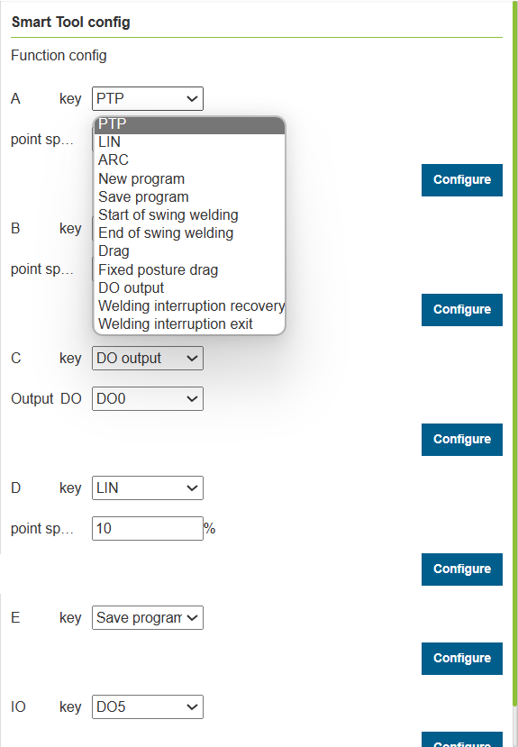

.. centered:: Figure 14.6‑5 Laser Acquires Weld Seam Position

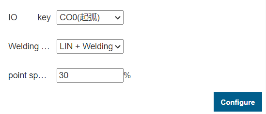

.. centered:: Figure 14.6‑6 Welding Torch Points to Weld Seam Position with Reference Posture

Finding Intersection Coordinates Using Three-Point and Four-Point Seam Finding
~~~~~~~~~~~~~~~~~~~~~~~~~~~~~~~~~~~~~~~~~~~~~~~~~~~~~~~~~~~~~~~~~~~~~~~~~~~~~~~~~~~~~~~~~~~~~~~~~~~~~~~~~~~~~~~~

When it is inconvenient to directly teach the position of a fillet weld, the collaborative robot can calculate the intersection point of the two plate planes by manually teaching or finding the positions on both sides of the fillet weld, thereby generating the location of the fillet weld.

For right-angle fillet welds, the three-point seam finding method can be used to calculate the intersection coordinates; for non-right-angle fillet welds, the four-point seam finding method is used.

Both command and Lua script methods are provided to obtain the intersection coordinates for seam finding motion, and a reference posture can be configured, allowing the robot carrying the welding torch to move to the intersection point with the posture of the reference teach point.

Command-based Intersection Calculation
++++++++++++++++++++++++++++++++++++++++++++++++++++++

Three-Point Intersection Calculation
***************************************************************

**Step1**: Collect three plane contact points and save them as teach points; configure a reference teach point.

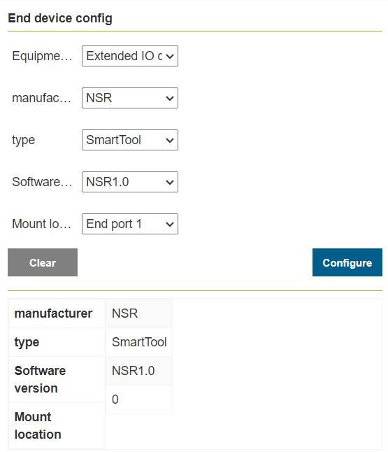

.. centered:: Figure 14.6‑7 Select Three Seam Finding Points

The collected contact points include three points, where two points lie on the same plane and the other point lies on the perpendicular plane.

.. note:: If no posture reference point is selected, the generated intersection point's posture is consistent with point P3 by default. If a posture reference point is selected, it matches the posture of the reference teach point.

**Step2**: On the Teach Page, click "Applications" -> "Tool App" -> "Intersection Generation", and find the Three-Point and Four-Point Intersection Calculation function module.

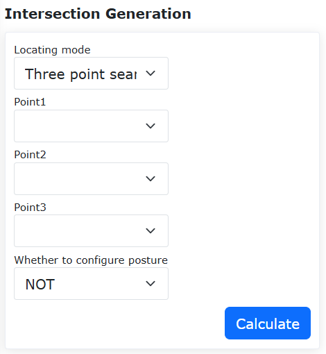

.. centered:: Figure 14.6‑8 Select Seam Finding Points for Intersection Calculation

**Step3**: Select "Three-Point Seam Finding" from the dropdown, sequentially select the three collected contact points, click Calculate, check if the displayed intersection point in the 3D model is correct, name the intersection point, and save it.

.. figure:: application/018.png
   :align: center
   :width: 4in

.. centered:: Figure 14.6‑9 Calculate Intersection Coordinates and Save

**Step4**: Save the teach point, and teach motion can be performed.

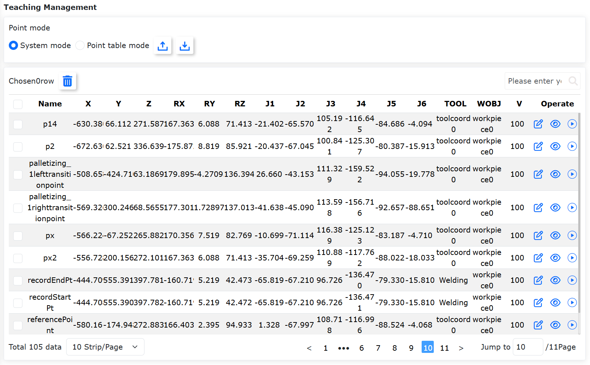

.. centered:: Figure 14.6‑10 Save Intersection Coordinates as a Teach Point

Four-Point Intersection Calculation
***************************************************************

**Step1**: Collect four plane contact points and save them as teach points; configure a reference teach point.

.. figure:: application/020.png
   :align: center
   :width: 4in

.. centered:: Figure 14.6‑11 Select Four Seam Finding Points

The collected contact points include four points, where the first two points lie on the same plane and the last two points lie on the perpendicular plane.

.. note:: If no posture reference point is selected, the generated intersection point's posture is consistent with point P4 by default. If a posture reference point is selected, it matches the posture of the reference teach point.

**Step2**: On the Teach Page, click "Initial Setup", "Peripherals", "Tracking", "Sensors" in sequence, and find the Three-Point and Four-Point Intersection Calculation function module.

.. figure:: application/021.png
   :align: center
   :width: 4in

.. centered:: Figure 14.6‑12 Select Seam Finding Points and Reference Point for Intersection Calculation

**Step3**: Select "Four-Point Seam Finding" from the dropdown, sequentially select the four collected contact points, click Calculate, check if the displayed intersection point in the 3D model is correct, name the intersection point, and save it.

.. figure:: application/022.png
   :align: center
   :width: 4in

.. centered:: Figure 14.6‑13 Calculate Intersection Coordinates and Save

**Step4**: Save the teach point, and teach motion can be performed.

.. figure:: application/023.png
   :align: center
   :width: 6in

.. centered:: Figure 14.6‑14 Save Intersection Coordinates as a Teach Point

Lua Script for Intersection Seam Finding Motion
++++++++++++++++++++++++++++++++++++++++++++++++++++++++++++++++

Three-Point Intersection Calculation
***************************************************************

**Step1**: Collect three plane contact points and save them as teach points; configure a reference teach point.

.. centered:: Figure 14.6‑15 Select Three Seam Finding Points

The collected contact points include three points, where two points lie on the same plane and the other point lies on the perpendicular plane.

.. note:: If no posture reference point is selected, the generated intersection point's posture is consistent with point P3 by default. If a posture reference point is selected, it matches the posture of the reference teach point.

**Step2**: Write the three-point intersection seam finding motion Lua program. Click "Teach Program" -> "Program Programming" -> "New Button" in sequence, and create a new user program "test3point.lua".

.. centered:: Figure 14.6‑16 New Three-Point Intersection Seam Finding Motion Program

**Step3**: Generate the three-point intersection seam finding motion program. Click "Teach Program" -> "Program Programming" -> "Welding Instructions" -> "Laser Tracking" in sequence, scroll down to the Seam Finding Intersection Motion section, select the "Three-Point Seam Finding" method, use the dropdowns to sequentially select the collected contact points "Point 1", "Point 2", "Point 3", and the posture reference point, select the required "Motion Mode" and "Debug Speed", then click the "Add" and "Apply" buttons to generate the corresponding three-point intersection seam finding motion program.

.. figure:: application/025.png
   :align: center
   :width: 4in

.. centered:: Figure 14.6‑17 Three-Point Intersection Seam Finding Motion

**Step4**: In Auto mode, click the Run button to automatically perform the three-point intersection calculation. The robot will drag the welding torch and move to the intersection position using the reference posture.

Four-Point Intersection Calculation
***************************************************************

**Step1**: Collect four plane contact points and save them as teach points; configure a reference teach point.

.. figure:: application/020.png
   :align: center
   :width: 4in

.. centered:: Figure 14.6‑18 Select Four Seam Finding Points

The collected contact points include four points, where the first two points lie on one plane and the last two points lie on another plane.

.. note:: If no posture reference point is selected, the generated intersection point's posture is consistent with point P4 by default. If a posture reference point is selected, it matches the posture of the reference teach point.

**Step2**: Write the four-point intersection seam finding motion Lua program. Click "Teach Program" -> "Program Programming" -> "New Button" in sequence, and create a new user program "test4point.lua".

.. figure:: application/026.png
   :align: center
   :width: 4in

.. centered:: Figure 14.6‑19 New Four-Point Intersection Seam Finding Motion Program

**Step3**: Generate the four-point intersection seam finding motion program. Click "Teach Program" -> "Program Programming" -> "Welding Instructions" -> "Laser Tracking" -> scroll down to the Seam Finding Intersection Motion section, select the "Four-Point Seam Finding" method, use the dropdowns to sequentially select the collected contact points "Point 1", "Point 2", "Point 3", "Point 4", and the posture reference point, select the required "Motion Mode" and "Debug Speed", then click the "Add" and "Apply" buttons to generate the corresponding four-point intersection seam finding motion program.

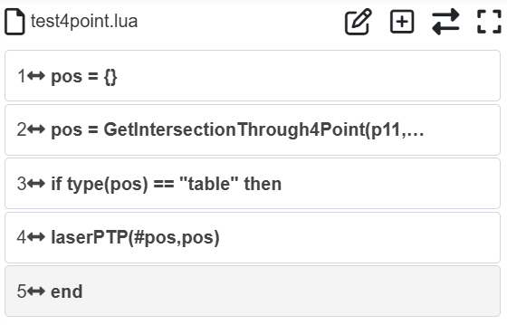

.. centered:: Figure 14.6‑20 Four-Point Intersection Seam Finding Motion

**Step4**: In Auto mode, click the Run button to automatically perform the four-point intersection calculation. The robot will drag the welding torch and move to the intersection position using the reference posture.

Peripheral Protocol
---------------------------------

Under the "Applications" -> "Tool App" menu bar, click "Peripheral Protocol" to enter the peripheral protocol configuration function interface.

This page is for configuring peripheral protocols. Users can configure the protocol based on the currently used peripheral device.

.. centered:: Figure 14.7‑1 Peripheral Protocol Configuration

Lua interfaces for reading and writing registers based on Modbus-RTU communication have been added in program teaching. The input register address is 0x1000 with 50 registers, totaling 100 bytes of data content; the holding register address is 0x2000 with 50 registers, totaling 100 bytes of data content.

::

   ModbusRegRead(fun_code, reg_add, reg_num): Read Registers;

   fun_code: Function code, 0x03 - Holding Register, 0x04 - Input Register

   reg_add: Register Address

   reg_num: Number of Registers

::

   ModbusRegWrite(fun_code, reg_add, reg_num, reg_value): Write Registers;

   fun_code: Function code, 0x06 - Single Register, 0x10 - Multiple Registers

   reg_add: Register Address

   reg_num: Number of Registers

   reg_value: Byte Array

::

   ModbusRegGetData(reg_num): Get Register Data;

   reg_num: Number of Registers

   Return value description:

   reg_value: Array variable

Example program screenshot:

.. image:: application/029.png
   :width: 4in
   :align: center

.. centered:: Figure 14.7‑2 Modbus-RTU Communication Lua Program Example

G-code to Robot Trajectory Planning Function
-----------------------------------------------------------------------------------

Function Overview
~~~~~~~~~~~~~~~~~~~~~~~~~~~~~~

The G-code to Robot Trajectory Planning function uses CAD software to convert paths (lines, arcs, full circles, splines) into G-code files with the ".gcode" extension. The G-code for spline paths consists of many small line segments. Importing the generated G-code file on the Web端 converts it and generates a LUA file.

G-code to Robot Trajectory Planning function description:

(1) The Web can only import G-code files with the ".gcode" extension. Upon successful conversion, a LUA file with the same name as the G-code file is generated. If a LUA file with the same name already exists before conversion, the conversion will fail.

(2) Currently, it can convert rapid move G0, linear interpolation G1, clockwise arc interpolation G2, and counterclockwise arc interpolation G3 commands in G-code. G0 corresponds to the MoveJ instruction, G1 corresponds to MoveL, arcs (G2/G3) correspond to MoveC, and full circles (G2/G3) correspond to the Circle instruction.

(3) Currently, only G-code for arcs and circles in the XY plane can be converted.

(4) The spindle speed S set in G-code instructions corresponds to the speed in the MoveJ instruction. The unit of spindle speed is revolutions per minute (RPM), corresponding to millimeters per minute (mm/min) for move speed. The feedrate F corresponds to the speed in MoveL, MoveC, and Circle. The unit of feedrate is millimeters per minute (mm/min), consistent with the move speed unit. The speed settings in G-code must not exceed the robot's maximum moving speed.

(5) When executing the converted LUA file, the robot needs to have the speed percentage in the upper right corner of the Web interface changed to 100.

Operation Process
~~~~~~~~~~~~~~~~~~~~~~~~~~~~~~

The calculation of the robot's posture along the working path is shown in the figure below.

.. image:: application/030.png
   :width: 6in
   :align: center

.. centered:: Figure 14.8-1 Robot Posture Calculation Schematic

Where P-xyz is the posture of the recorded reference posture teach point, and O-xy is the coordinate system of the CAD drawing. The robot's posture at the starting point A is the reference posture. Based on the angle between the Z-axis of the reference posture and the CAD drawing plane, and the angle between the projection of the Z-axis on the CAD drawing plane and the tangent at the path's starting point, the robot's posture at intermediate point B and endpoint C of the path is calculated.

The functional operation process is as follows:

**Step 1**: Use CAD software with CAM functionality to convert the machining path into a G-code file, and use a G-code simulator, such as NC Viewer, to verify the correctness of the tool path.

**Step 2**: Before converting G-code to robot trajectory, first calibrate the tool coordinate system and the workpiece coordinate system. Note that the workpiece coordinate system needs to coincide with the machine coordinate system in the CAD software.

.. image:: application/031.png
   :width: 4in
   :align: center

.. image:: application/032.png
   :width: 4in
   :align: center

.. centered:: Figure 14.8-2 Tool and Workpiece Coordinate System Calibration Interface

**Step 3**: Under the calibrated tool coordinate system and workpiece coordinate system, record a reference posture teach point. The robot's posture along the working path will be calculated using the posture of this reference point.

**Step 4**: Click "Applications", "Tool App", "G-code Conversion" button in sequence to enter the G-code file to robot motion LUA file interface.

.. image:: application/033.png
   :width: 6in
   :align: center

.. centered:: Figure 14.8-3 G-code Conversion Interface

**Step 5**: Click the "Select File" button to find the G-code file that needs conversion. Note that the file extension of the G-code file must be ".gcode". Select the reference posture point recorded in Step 2. Upon successful selection, the tool coordinate system and workpiece coordinate system of the currently selected teach point will be displayed below. Finally, click the "Convert" button. Upon successful conversion, a "G-code Conversion Successful" message will appear. Additionally, if a LUA file with the same name as the G-code file already exists, clicking the "Convert" button will prompt that the filename already exists.

.. image:: application/034.png
   :width: 6in
   :align: center

.. centered:: Figure 14.8-4 G-code Conversion Success Interface

.. image:: application/035.png
   :width: 6in
   :align: center

.. centered:: Figure 14.8-5 G-code Conversion Failure Interface

**Step 6**: Click "Teach Programming" -> "Program Programming" button, open the LUA file generated after G-code conversion, switch the robot to Auto mode, and click the Start button. The robot will then replicate the path from the G-code file.

.. image:: application/036.png
   :width: 6in
   :align: center

.. centered:: Figure 14.8-6 Open the Converted LUA File
