Application
===============

.. toctree:: 
   :maxdepth: 6

Robot packaging
------------------------

In the menu bar of "Application - Tool App", click the "Robot packing" button to enter the robot's one-click packaging interface.

.. important:: 
   Before operating the packaging function, please confirm the surrounding environment and status of the robot to prevent collisions.
   
   If it is shipped from the factory, go to System Settings - General Settings and restore the factory settings before leaving the factory.

**Step1**:Move the robot to zero point before moving to the packing point.

**Step2**:Click the "Move to Zero" button to confirm that the robot's mechanical zero point is correct and that the gaps in the orange circles in the figure are aligned with each joint.

**Step3**:Click the "Move to Packing Point" button, and the robot will move to the packaging point according to the angles of each axis of the packaging process.

.. centered:: Figure 14.1‑1 Robot one-click packaging

System Upgrade
------------------------

In the menu bar of "Application - Tool App", click the "System upgrade" button to enter the system upgrade interface. System upgrade is divided into software upgrade, driver upgrade and system shutdown.

**Software upgrade**:Click "Upload File" under Software Upgrade, select the ``software.tar.gz`` upgrade package in the U disk, click Upload Upgrade Package, and "Uploading...Upload Percentage" is displayed next to the upgrade button.
After the download of the background file is completed, the interface displays "uploading completed, upgrading in progress", check the MD5 and version number of the file, after passing, decrypt and decompress the upgrade file, and prompt "Upgrade is successful, please restart the control box!", if detected , unzip or other errors occur, and "upgrade failed" is displayed next to the upgrade button.

.. centered:: Figure 14.2‑1 System Upgrade

.. important:: 
   The name of the software upgrade package is determined ``software.tar.gz``. If the name of the upgrade package is inconsistent with it, the upgrade will fail. Just change it to the determined name of the upgrade package.

**Firmware upgrade**:After the robot enters the BOOT mode, upload the upgrade compressed package, select the slaves that need to be upgraded (control box slaves, main body drive slaves 1~6, and end slaves), perform the upgrade operation, and display the upgrade status.

.. image:: application/003.png
   :width: 3in
   :align: center

.. centered:: Figure 14.2‑2 Firmware upgrade

**Slave configuration file upgrade**:After the robot is disabled, upload the upgrade file, select the slaves that need to be upgraded (control box slaves, main body drive slaves 1~6, and end slaves), perform the upgrade operation, and display the upgrade status.

.. centered:: Figure 14.2‑3 Slave configuration file upgrade

Data backup
------------------------

In the menu bar of "Application - Tool App", click "Data backup" to enter the data backup interface, as shown in 3.9-5.

The backup package data includes tool coordinate system data, system configuration files, teaching point data, user programs, template programs and user configuration files. When the user needs to move the relevant data of this robot to another robot, he can use this The function is realized quickly.

.. centered:: Figure 14.3‑1 Data backup interface

10s data record
------------------------

In the menu bar of "Application - Tool App", click "Data Recording" to enter the 10s data recording function interface.

First, select the record type, which is divided into default parameter record and optional parameter record. The default parameter record is the data automatically set and recorded by the system, and the optional parameter record user can choose the parameter data to be recorded. The maximum number of parameters is 15. After selecting the parameter list, select the record parameter and click the "Move Right" button to configure the parameter into the parameter list. Click "Start Recording" to start recording data, click "Stop Recording" to stop recording data, and click "Download Data" to download the data of the last 10 seconds.

.. image:: application/006.png
   :width: 3in
   :align: center

.. centered:: Figure 14.4‑1 10s data record

Teach point configuration
------------------------------------

In the menu bar of "Application - Tool App", click "Points Config." to enter the teaching point configuration interface.

Before using the button box or other IO signals to record the teaching point function, the user first configures the teaching point name prefix, the upper limit of the number and the teaching method. The name prefix supports two modes: custom prefix and current program name as the prefix. For example, customize the name prefix "P", number upper limit "3", teaching method "robot teaching", record the current end (tool) points of the robot in sequence: P1, P2, P3, and record again will overwrite the previous record points.

.. image:: application/007.png
   :width: 3in
   :align: center

.. centered:: Figure 14.5‑1 Teach point configuration

Work origin
------------------------

In the menu bar of "Application - Tool App", click "Home point" to enter the working origin configuration function interface.

This page displays the name and joint position information of the work origin. The work origin is named pHome. Click "Set" to use the current robot pose as the work origin. Click "Move to this point" to move the robot to the work origin. In addition, the configurable option of moving to the origin of the work is added in the DI configuration, and the configurable option of reaching the origin of the work is added in the DO configuration.

.. centered:: Figure 14.6‑1 Work origin

Terminal LED configuration
--------------------------------------

In the menu bar of "Application - Tool App", click "End-LED" to enter the end LED color configuration function interface.

The configurable LED colors are green, blue and white cyan. Users can configure the LED colors of automatic mode, manual mode and drag mode according to their needs. Different modes cannot be configured with the same color.

.. image:: application/009.png
   :width: 3in
   :align: center

.. centered:: Figure 14.7‑1 Terminal LED configuration

Peripheral protocol
------------------------

In the menu bar of "Application - Tool App", click "Peripheral protocol" to enter the peripheral protocol configuration function interface.

This page is the configuration page for the peripheral protocol, and the user can configure the protocol according to the currently used peripheral.

.. centered:: Figure 14.8‑1 Peripheral Protocol Configuration

Add a lua interface for reading and writing registers based on Modbus-rtu communication in the program teaching, input register address 0x1000, the number of registers is 50, a total of 100 bytes of data content; hold the register address 0x2000, the number of registers is 50, a total of 100 bytes data content.

::

   ModbusRegRead(fun_code, reg_add, reg_num): read register;

   fun_code: function code, 0x03-holding register, 0x04-input register

   reg_add: register address

   reg_num: number of registers

::

   ModbusRegWrite(fun_code, reg_add, reg_num, reg_value): write register;

   fun_code function code, 0x06-single register, 0x10-multiple registers

   reg_add: register address

   reg_num: number of registers

   reg_value: byte array

::

   ModbusRegGetData (reg_num): Get register data;

   reg_num: number of registers

   Return value description:

   reg_value: array variable

Program sample screenshot:

.. centered:: Figure 14.8‑2 Modbus-rtu communication lua program example

Main program configuration
------------------------------------------------

In the menu bar of "Application - Tool App", click "Main program" to enter the main program configuration function interface.

The configuration of the main program can be used in conjunction with the DI configuration of the main program startup. The configured main program needs to be trial run first to ensure safety. After configuring the corresponding DI in the robot settings to start the main program signal function, the user can control the DI signal to run the main program. .

.. image:: application/012.png
   :width: 3in
   :align: center

.. centered:: Figure 14.9‑1 Main program configuration

Drag lock
------------------------

In the menu bar of "Application - Tool App", click "Drag locking" to enter the drag teaching lock configuration function interface.

For drag teaching, the function of locking degrees of freedom is added. When the drag teaching function switch is set to the enabled state, the parameters of each degree of freedom will take effect when the user drags the robot. For example, when the parameter is set to X:10, Y:0, Z:10, RX:10, RY:10, RZ:10, dragging the robot in the drag mode can restrict the robot to move only in the Y direction, if necessary Keep the posture of the robot unchanged while dragging, and only move in the X, Y, and Z directions. You can set X, Y, and Z to 0, and RX, RY, and RZ to 10.

.. centered:: Figure 14.10‑1 Drag teach lock configuration

Smart Tool
------------------------

In the menu bar of "Application - Tool App", click "Smart Tool" to enter the Smart Tool configuration function interface.

Configure the A-E keys and IO keys in sequence. After the Smart Tool configuration is completed, the task manager internally maintains the function corresponding to each button. When a button is detected to be pressed, the function corresponding to the button is automatically executed.

A~E key function:

-  **Movement instructions**:When selecting PTP, LIN, or ARC motion instructions, you need to enter the corresponding point speed. After the configuration is successful, a new relevant motion instruction is added to the teaching program. When configuring the ARC motion instruction, you need to configure the PTP/LIN instruction first.
  
-  **DO output**:When "DO Output" is selected, a drop-down box is displayed to select output DO0 - DO7 options.
  

.. centered:: Figure 14.11‑5 Smart Tool Configuration (A~E key)

IO key function:

-  **IO signal configuration**: The drop-down box can select DO0⁓DO7 options, CO0⁓CO7 options, End-DO0, End-DO1 and extended IO (Aux-DO0⁓Aux-DO127);

-  **Combined instructions**: After selecting "IO Signal", the "Welding options" and "Point Speed" configuration items are displayed under specific conditions, and different program instructions are generated.

.. important::
   -  When the IO signal is configured as DO0~DO7 or CO0~CO7 ("Arcing" is not configured), the program adds 'SetDO'; at this time, "Welding options" and "Point speed" are hidden.
   -  When the IO signal is configured as End-DO0, End-DO1, the program adds 'SetToolDO';at this time, "Welding options" and "Point speed" are hidden.
   -  When the IO signal is configured as extended IO ("Welder starting arc" is not configured) , the program adds 'SetAuxDO'; at this time, "Welding options" and "Point speed" are hidden.
   -  When the IO signal is configured as CO0~CO7 (configuration "Arcing"), when "Welder starting arc" is "None", the program adds 'SetDO'; at this time, "Welding options" and "Point speed" are hidden.
   -  When the IO signal is configured as extended IO (configuration "Welder starting arc"), " When the welding machine selection is "None", the program adds 'SetAuxDO'; at this time, the "Welding options" and "Point Speed" are hidden.
   -  When the IO signal is configured as CO0~CO7 (configuration "Arcing") or extended IO (configuration "Welder starting arc"), when "welding machine selection" is "welding", press the program for the first time to add 'ARCStart', and the second time The program adds 'ARCEnd', the third time the program adds 'ARCStart', the fourth time the program adds 'ARCEnd', and the above operations are repeated alternately; at this time, the "Welding options" and "Point Speed" are hidden.
   -  When the IO signal is configured as CO0~CO7 (configuration "Arcing") or expanded IO (configured "Welder starting arc"), and the "welding machine selection" is "LIN + Welding", press the program for the first time to add 'LIN' and 'ARCStart'. The second program adds 'LIN' and 'ARCEnd', the third program adds 'LIN' and 'ARCStart', the fourth program adds 'LIN' and 'ARCEnd', and the above operations are repeated alternately; at this time, "Welding options" and "Point Speed" are displayed.
   -  When the IO signal is configured as CO0~CO7 (configuration "Arcing") or extended IO (configuration "Welder starting arc"), and the "welding machine selection" is "LIN + Welding + Swing", press the program for the first time to add 'LIN', 'ARCStart' and 'WeaveStart', the second program adds 'LIN', 'ARCEnd' and 'WeaveEnd', the third program adds 'LIN', 'ARCStart' and 'WeaveStart', the fourth program adds 'LIN', 'ARCEnd' and 'WeaveEnd', and the above operations are repeated alternately; at this time, the "Welding options" and "Point Speed".

.. centered:: Figure 14.11‑6 Smart Tool Configuration (IO key)

.. Force sensor assisted drag function settings
.. ~~~~~~~~~~~~~~~~~~~~~~~~~~~~~~~~~~~~~~~~~~~~~~~

.. Under "DI Configuration" in "Robot Settings", click on the different DI drop-down boxes to configure auxiliary drag on, auxiliary off and auxiliary drag on/off

.. - The control box DI function is configured with a force sensor drag function, and the force sensor can be dragged directly through the control box DI input.
.. - The DI function at the end of the robot is equipped with a force sensor drag function, and the force sensor can be dragged through the end DI input.
.. - Based on TPD trajectory recording in robot drag mode, TPD trajectory recording in force sensor-assisted drag mode is added to achieve smoother TPD trajectory dragging.

.. .. image:: application/271.png
..    :width: 4in
..    :align: center

.. .. centered:: Figure 4.9-35 Force sensor assisted drag function settings

.. .. important:: When the force sensor drag-on state is detected, the robot switches to the force sensor drag state; when the force sensor drag-off DI state is detected, the force sensor drag state is turned off;

SmartTool + Force Sensor Combination
------------------------------------------------

In the "Initial - Peripherals - End Tool" menu bar, click "Adapted device" to enter the terminal peripheral configuration interface.

Select "Extended IO Device" as the device type, and the extended IO device configuration information is divided into manufacturer, type, software version and mounting location. Different manufacturers correspond to different types.The current manufacturers are NSR and FR.

Users can configure corresponding device information according to specific production needs. After successful configuration, the device information table is displayed. If the user needs to change the configuration, he can first select the corresponding number, click the "Clear" button to clear the corresponding information, and reconfigure the device information according to needs. 

.. important:: Before clicking Clear Configuration, the corresponding device should be in an inactive state.

.. centered:: Figure 14.12‑1 NSR interface

.. centered:: Figure 14.12‑2 FR interface

NSR
~~~~~~~~~

The corresponding type of NSR are: SmartTool.

1. Hardware installation

1)Disassemble the SmartTool handle, take out the middle tooling, and install it at the end of the robot.

.. image:: application/018.png
   :width: 3in
   :align: center

.. centered:: Figure 14.12‑3 Install the tooling in the middle of the SmartTool handle

2)After the tooling is installed, splice the SmartTool handle. After the splicing is successful, connect the connecting cable to the end of the robot.

.. image:: application/019.png
   :width: 3in
   :align: center

.. centered:: Figure 14.12‑4 SmartTool handle installed successfully

2. Device information configuration

.. important:: Please ensure that your SmartTool handle has been fixedly installed on the end of the robot and properly connected to the end of the robot.

1)Click the Smart Tool function menu in the auxiliary application to enter this function configuration page. Customize the functions of each button on the end handle according to your needs, including (New Program, Save Program, PTP, Lin, ARC, Weaving Start, Weaving end and IO port);

.. image:: application/020.png
   :width: 4in
   :align: center

.. centered:: Figure 14.12‑5 SmartTool handle button function configuration interface

2)After the SmartTool handle button function configuration is completed, configure the manufacturer of the extended IO device as "NSR", select the "Type", "Software Version" and "Hang Position" information, and click the "Configure" button.

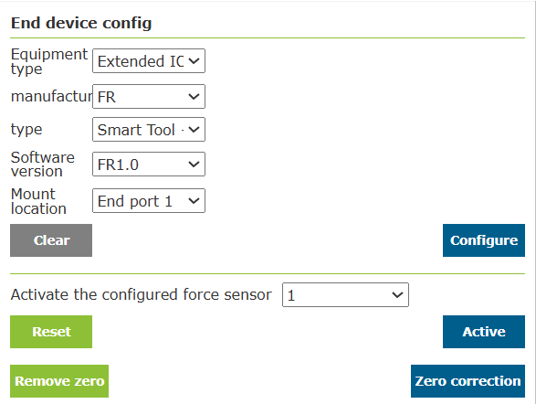

.. centered:: Figure 14.12‑6 NSR device information configuration interface

3)After successfully configuring the device information, view the table data.

3. Application

After the device information is configured successfully, open the "Teaching Simulation - Program Teaching" interface and create a new "testSmartTool.lua" program. Press the SmartTool handle buttons as needed (key function configuration example: A button - PTP, B button - LIN, C button - ARC, D button - create a new program, E button - save the program, IO button - CO0 ), at this time the robot receives feedback and performs corresponding operations on the program. The teaching program is as shown below:

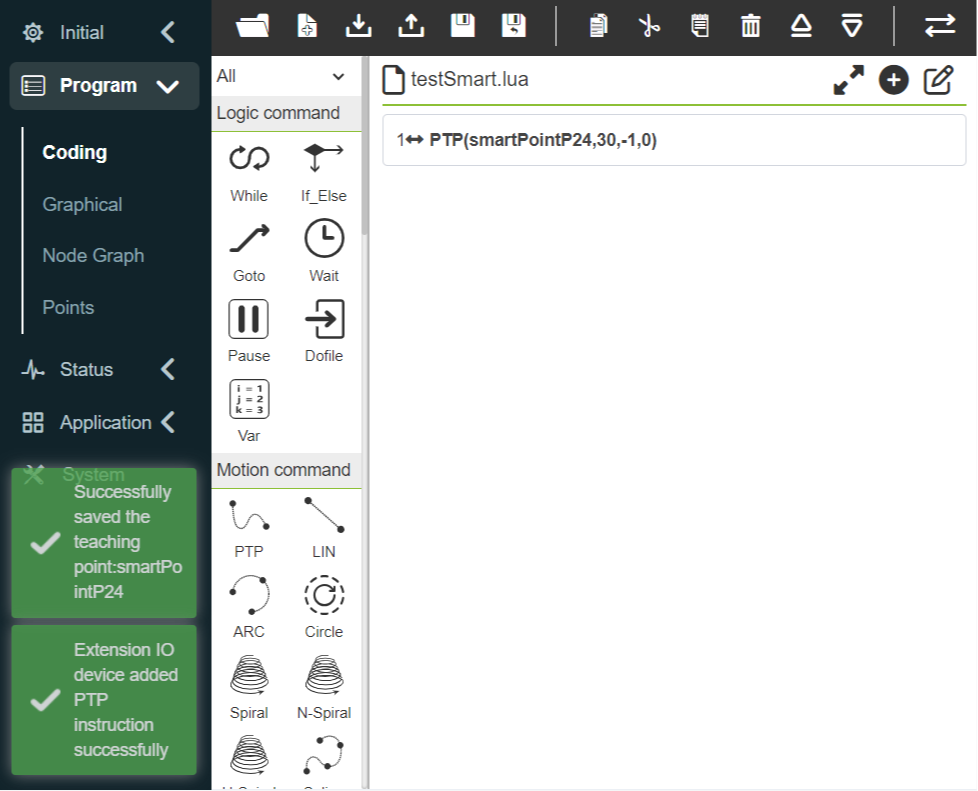

.. centered:: Figure 14.12‑7 testSmartTool.lua program that presses the A key

.. centered:: Figure 14.12‑8 testSmartTool.lua program that presses the B key

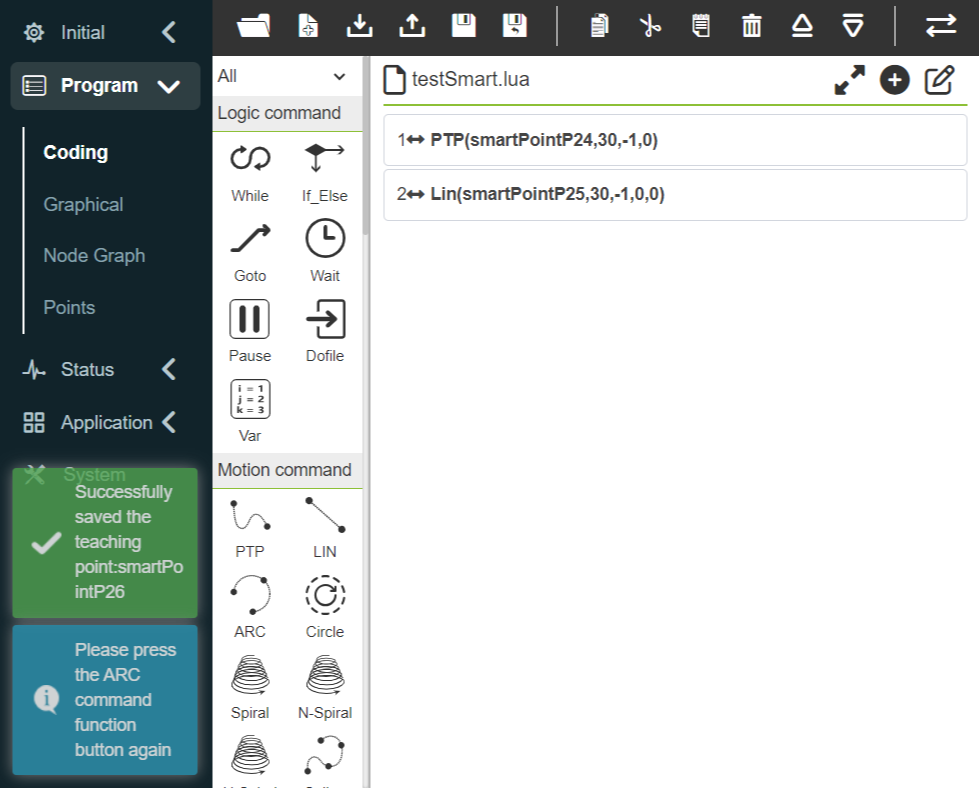

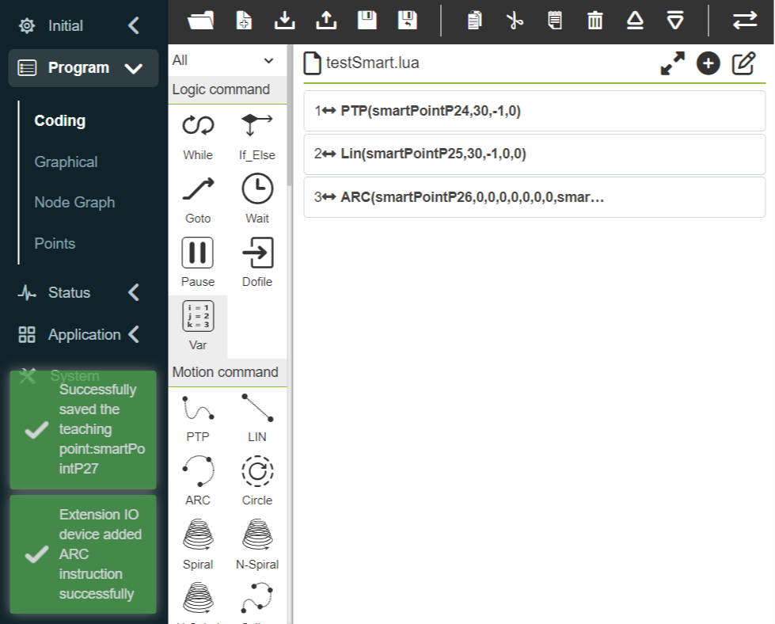

.. centered:: Figure 14.12‑9 testSmartTool.lua program that presses the C key

.. centered:: Figure 14.12‑10 testSmartTool.lua program that presses the D key

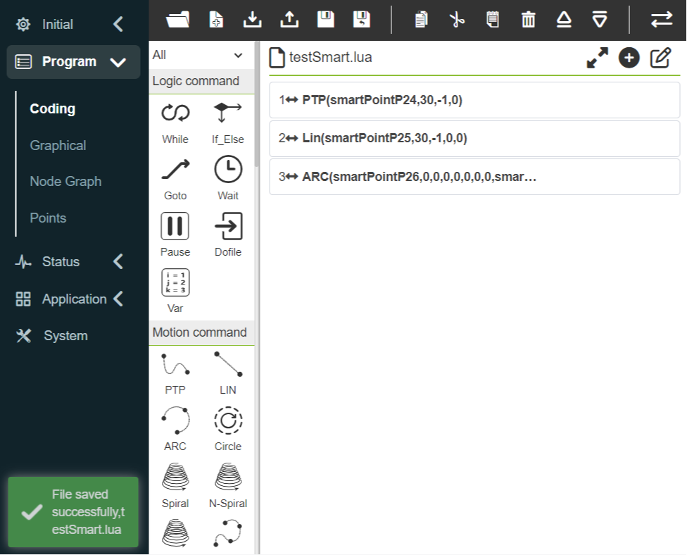

.. centered:: Figure 14.12‑11 testSmartTool.lua program that presses the E key

.. centered:: Figure 14.12‑12 testSmartTool.lua program that presses the IO key

FR
~~~~~~~~~

The corresponding type of FR is "SmartTool" and is used in combination with force sensors. The collaborative robot can be adapted to three force sensors of XJC, NSR and GZCX. When using different sensors, you only need to load the corresponding communication protocol, as follows :

- SmartTool + XJC-6F-D82(XJC).
- SmartTool + NSR-FT Sensor A(NSR).
- SmartTool + GZCX-6F-75A(GZCX).

1. Hardware installation

1)Install the SmartTool handle on the end of the robot and connect it correctly to the end of the robot (refer to NSR's hardware installation for detailed installation).

2)After the SmartTool handle is installed, install the force sensor (taking Hong Kong Zhichuangxin as an example) at the end of the SmartTool handle, and connect the connecting cable to the SmartTool handle.

.. image:: application/029.png
   :width: 3in
   :align: center

.. centered:: Figure 14.12‑13 GZCX force sensor is installed at the end of SmartTool handle

2. Device Configuration

.. important:: Please make sure that your SmartTool handle has been fixedly installed on the end of the robot and is correctly connected to the end of the robot, and that the force sensor has been fixedly installed on the end of the SmartTool handle and is correctly connected to the SmartTool handle.

1) Configure the SmartTool handle (refer to NSR's SmartTool button function configuration);

2) After the SmartTool handle button function configuration is completed, configure the manufacturer of the extended IO device as "FR", select the "Type", "Software Version" and "Hang Position" information, and click the "Configure" button;

.. image:: application/030.png
   :width: 4in
   :align: center

.. centered:: Figure 14.12‑14 FR device information configuration interface

3) After successfully configuring the device information, select the configured force sensor and click the "Activate" button to activate the force sensor. After successful activation, click the "Zero Point Correction" button to clear the force sensor and view the table data;

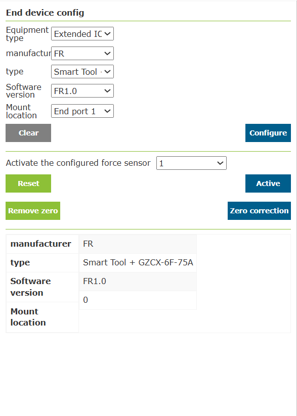

.. centered:: Figure 14.12‑15 Force sensor zero calibration

4) According to the current end installation, configure the load data on the "End Load" interface, and configure the tool coordinate data, tool type and installation location on the "Tool Coordinates" interface.

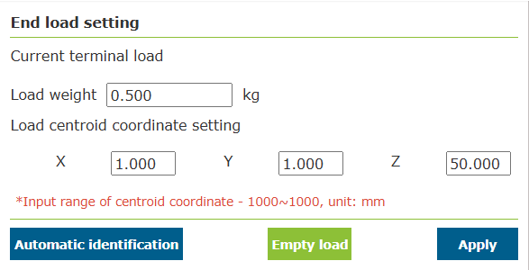

.. centered:: Figure 14.12‑16 "End load" configuration

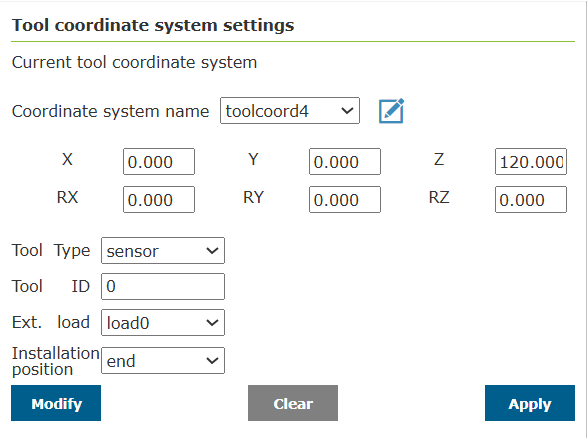

.. centered:: Figure 14.12‑17 "Tool coordinates" configuration

3. Application

After the device information is successfully configured, the SmartTool button function and the force sensor function can be independently implemented, such as measuring the size and force direction of the force and auxiliary drag locking based on the force sensor.

.. image:: application/034.png
   :width: 6in
   :align: center

.. centered:: Figure 14.12‑18 Measure the magnitude and direction of force

Interference zone configuration
------------------------------------------------

In the menu bar of "Application - Tool App", click "Interference Area Configuration" to enter the interference area configuration function interface.

First of all, we need to configure the interference mode and the operation of entering the interference area. The interference mode is divided into "axis interference" and "cube interference". When enabled, the activation sign will be displayed. First, enter the interference zone motion configuration "continue motion" or "stop".

.. image:: application/035.png
   :width: 3in
   :align: center

.. centered:: Figure 14.13‑1 Interference zone configuration

Next, set the configuration of dragging into the interference area. Users can set the strategy after entering the interference area in drag mode according to their needs, without restricting dragging, impedance callback and switching back to manual mode.

.. centered:: Figure 14.13‑2 Interference area drag configuration

To select axis interference, you need to configure the parameters of axis interference. The detection method is divided into two types: "command position" and "feedback position". The interference area mode is divided into two types: "interference within the range" and "interference outside the range". Next Set the range of each joint and whether each joint range is enabled, you can enter the value, or you can record the current position of the robot through the "Robot Teaching" button, and finally click Apply.

.. centered:: Figure 14.13‑3 Axis interference configuration

To choose cube interference, you need to configure the parameters of cube interference. The detection method is divided into two types: "command position" and "feedback position". The interference area mode is divided into "interference within range" and "interference outside range". The system is divided into "base coordinates" and "workpiece coordinates", which can be selected and set according to actual use. Next, set the range setting. The range setting is divided into two methods. First, look at the first method "two-point method", which is composed of two diagonal vertices of the cube. We can record the position through input or robot teaching. Finally click Apply.

.. centered:: Figure 14.13‑4 Cube Interferometric Configuration

Next, look at the second method "center point + side length", that is, the center point of the cube and the side length of the cube form an interference area, and we can record the position through input or robot teaching. Finally click Apply.

.. centered:: Figure 14.13‑5 Cube Interferometric Configuration

Welding Expert
------------------------

Click the menu bar of "Welding expert" in "Application" to enter the function interface of welding expert library.

Linear Welding
~~~~~~~~~~~~~~~~~~

Click "Linear Welding" under "Weldment Shape" to enter the direct welding guidance interface. On the basis of the configuration of the basic settings of the robot, we can quickly generate a welding teaching program through a few simple steps. It mainly includes the following five steps. Due to the mutual exclusion between functions, the actual steps to generate a welding teaching program are less than five steps.

Step 1, whether to use the extended axis, if the extended axis is used, the related coordinate system of the extended axis needs to be configured and the extended axis should be enabled.

.. centered:: Figure 14.14‑1 Extended axis configuration

Step 2: Calibrate the starting point, the starting point safety point, the end point, and the ending point safety point. If the extended axis is selected in the first step, the extended axis movement function will be loaded to cooperate with the calibration of relevant points.

.. image:: application/041.png
   :width: 3in
   :align: center

.. centered:: Figure 14.14‑2 Calibration related points

Step 3, choose whether laser is needed, if yes, edit the parameters of the laser positioning command.

.. centered:: Figure 14.14‑3 Laser positioning configuration

Step 4: Select whether weaving welding is required, and if weaving welding is required, you need to edit the relevant parameters of weaving welding.

.. image:: application/043.png
   :width: 3in
   :align: center

.. centered:: Figure 14.14‑4 Weaving configuration

Step 5, name the program, and automatically open the program in the program teaching interface.

.. image:: application/044.png
   :width: 3in
   :align: center

.. centered:: Figure 14.14‑5 Save program

Arc Welding
~~~~~~~~~~~~~~~~~~

Click "Arc Welding" under "Weldment Shape" to enter the arc welding guidance interface. On the basis of the configuration of the basic settings of the robot, we can quickly generate a welding teaching program through two simple steps. It mainly includes the following two steps.

Step 1: Calibrate the starting point, the starting point safety point, the arc transition point, the end point and the end point safety point.

.. centered:: Figure 14.14‑6 Calibration point

Step 2: Name the program and automatically open the program in the program teaching interface.

.. centered:: Figure 14.14‑7 Save program

Multi-layer welding
~~~~~~~~~~~~~~~~~~~~~~~~~~~~~~~~~~

When the weld leg size is greater than 10mm, the multi-layer multi-pass welding function is usually adopted. This function can configure the welding program templated, add the arc tracking function to the first welding process of multi-layer multi-pass welding, and correct the weld deviation in the subsequent multi-pass linear welding process, so as to improve the weld quality.

The operation process of arc tracking multi-layer and multi-pass welding function is as follows:

1) Set the tool coordinate system and fill in the tool size and attitude of the welding gun.

.. note::
   The values on the interface are examples only, and the actual tool status shall prevail.

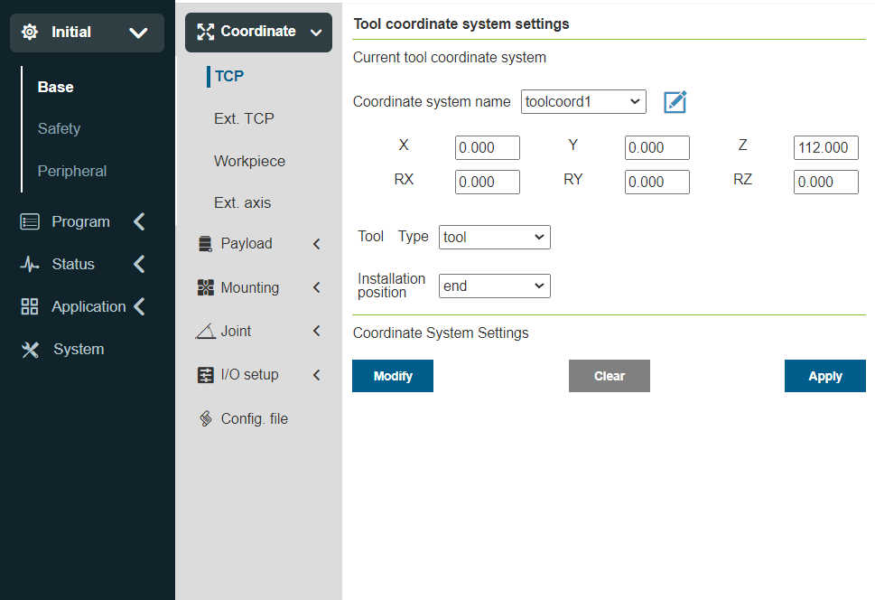

.. centered:: Figure 14.14-8 Sets the tool coordinate system

2) Click on "Application", select "Welding Expert", and select "Multi-layer welding" in the "Weldment Shape" category.

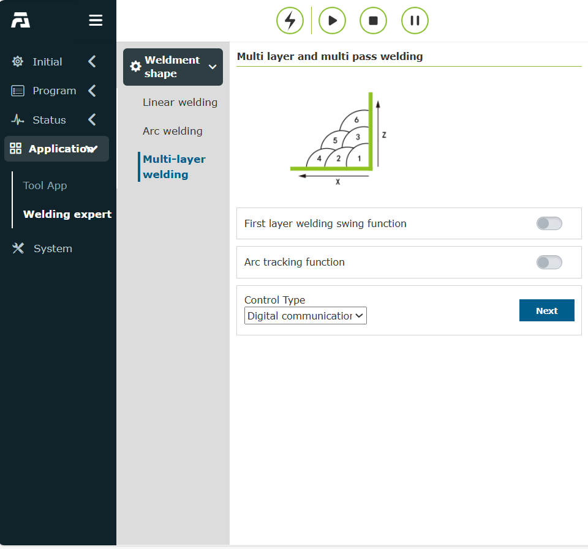

.. centered:: Figure 14.14-9 Open the multi-layer welding interface

3) To use the arc tracing function, be sure to turn on the "First Layer Weld Swing Function" switch and configure the corresponding swing parameters.

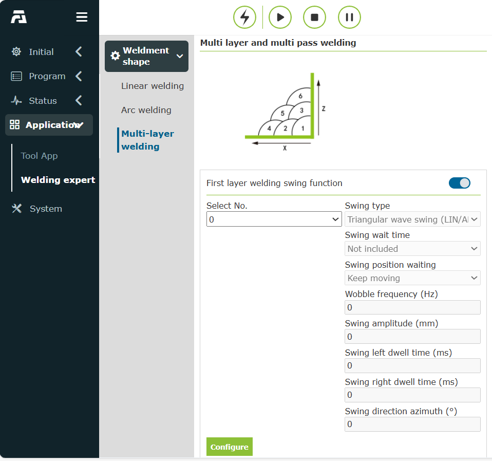

.. centered:: Figure 14.14-10 Turn on the first layer welding swing function

4) Click the "Configure" button to edit the swing parameters.

.. note::
   If arc tracking is required to compensate left and right, only the "triangle wave swing" and "sine wave swing" types can be selected, the swing frequency shall not be less than 0.5Hz, the swing amplitude shall not be less than 3mm, the waiting time for the swing left and right shall be consistent, and the swing azimuth angle shall be 0.

.. centered:: Figure 14.14-11 Configure the swing parameters

5) Turn on the "Arc Tracking Function" switch, edit the corresponding up-down and left-right compensation parameters, and then click "Next" to enter the multi-layer multi-pass welding setting page.

.. note::
   The arc tracking parameters are configured according to the actual welding situation, refer to the "Arc Tracking Function Operation Manual" or contact relevant technicians.

.. centered:: Figure 14.14-12  Configure arc tracing parameters

6) Here the "welds" is the welding start position; "X+ point" is a point in the X+ direction of the welding point relative to the custom offset coordinate system; "Z+point" is a point in the Z+ direction of the welding point relative to the custom offset coordinate system; The "Safety Point" is the transition point from the completion of the previous weld to the start of the next weld. After the teaching and setting is complete, click "Next" to select the relevant location of the weld end point.

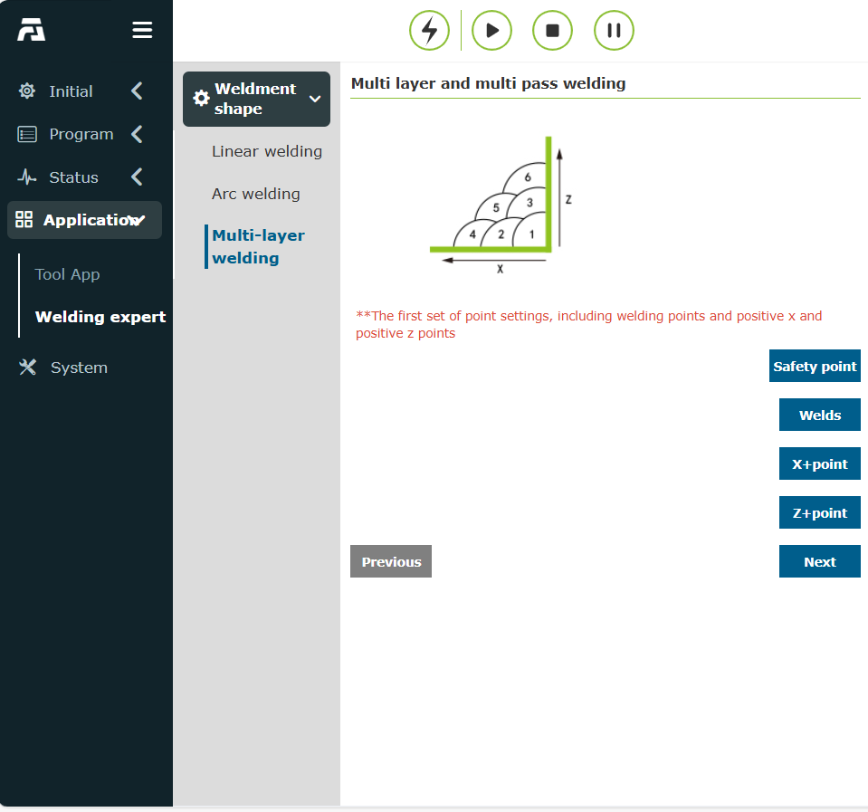

.. centered:: Figure 14.14-13 Multi-layer welding line start point position setting

7) 6.Select "Straight Point", where "Weld Point" is the end position of the weld; "X+ point" is a point in the X+ direction of the custom offset coordinate system relative to the "weld point"; The Z+ point is a point in the Z+ direction of the custom offset coordinate system relative to the Weld Point. After the teaching and setting is completed, click "Next" to set the multi-layer and multi-pass welding parameters.

.. centered:: Figure 14.14-14 Multi-layer weld line end point position setting

8) On this page, you can set the number of multi-layer welds and their distribution locations. Click the "On/Off" box in the parameter table to select the corresponding value of the active multi-layer multi-pass weld, and fill in the "X", "Z" and "B" columns with the desired corresponding offset position and angle in the custom coordinate system. After the setup is complete, click the "Compelete" button to go to the next step.

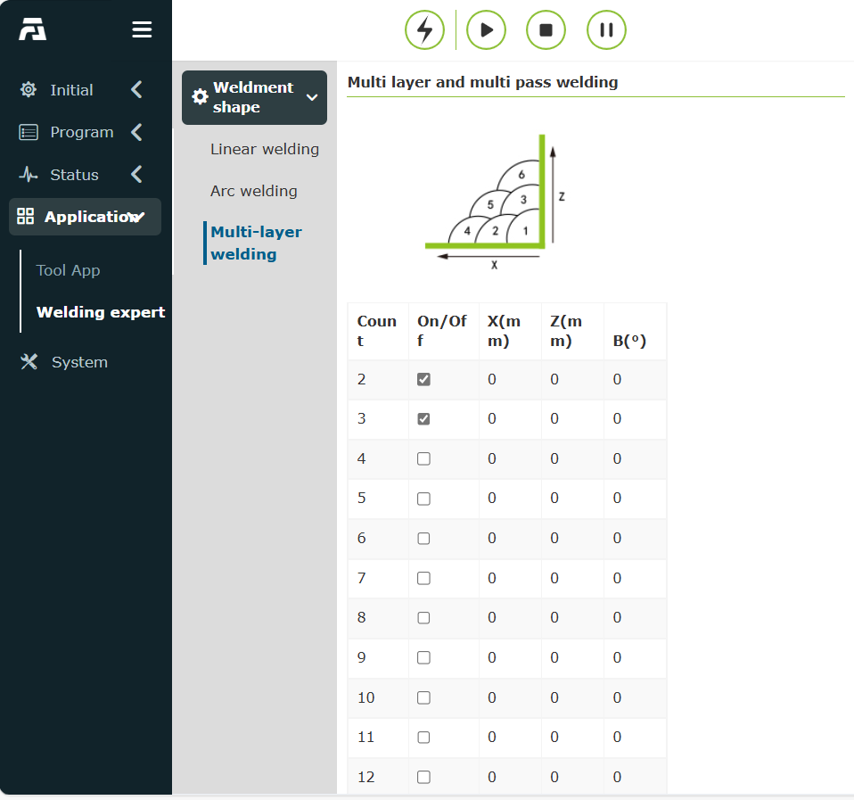

.. centered:: Figure 14.14-15 Multi-layer welding parameter setting

9) At this point, all parameters have been configured, enter the name of the program you want to save, and click the "Save" button to automatically produce the corresponding multi-layer multi-pass welding program.

.. image:: application/055.png
   :width: 6in
   :align: center

.. centered:: Figure 14.14-16 Multi-layer welding program generation

10) Click the "Open Program" button to read the LUA program saved in the previous step, as shown in the following figure.

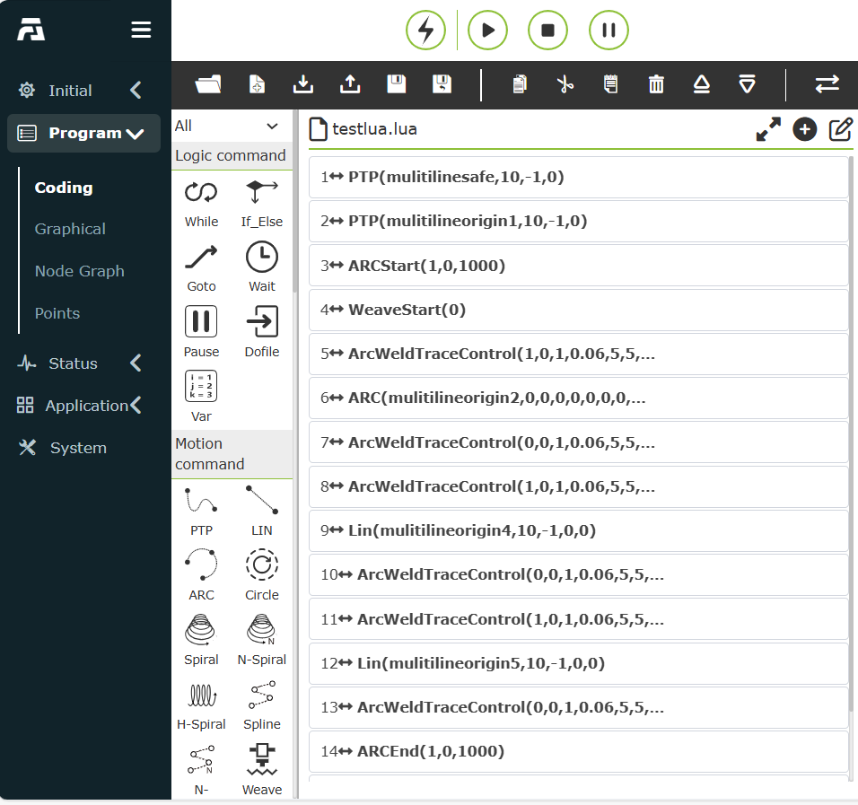

.. centered:: Figure 14.14-17 Example of an arc tracing multi-layer welding procedure
