Base
===============

.. toctree:: 
   :maxdepth: 6

Coordinate
----------------

TCP
~~~~~~~~~~~~~~~~~~~

In the menu bar of "Initial - Base - Coordinate", click "TCP" to enter the tool coordinate page.

Tool coordinates can be modified, cleared and applied. In the drop-down list of tool coordinate systems, after selecting the corresponding coordinate system(the coordinate system name can be customized), the corresponding coordinate value, tool type and installation location (only displayed under sensor type tools) will be displayed below. After selecting a coordinate system, click the "Apply" button, and the currently used tool coordinate system will become the selected coordinate, as shown below.

.. image:: base/001.png
   :width: 3in
   :align: center
   
.. centered:: Figure 6.1-1 Set tool coordinates

Under QNX:

- There are 15 tool coordinate systems.

Under Linux:

- There are 20 tool coordinate systems.

Click "Modify" to reset the tool coordinate system of the number according to the prompt. Tool calibration methods are divided into four-point method and six-point method. The four-point method only calibrates the tool TCP, that is, the position of the center point of the tool. Its posture defaults to be consistent with the end posture. The six-point method adds two points to the four-point method. , used to calibrate the attitude of the tool, here we take the six-point method as an example to explain.

.. centered:: Figure 6.1-2 Set tool coordinates

Select a fixed point in the robot space, move the tool to the fixed point in three different postures, and set 1-3 points in sequence. As shown in the upper left of figure. Move the tool vertically to the fixed point setting point 4, as shown in the upper right of figure. Keep the posture unchanged, use the base coordinates to move, move a certain distance in the horizontal direction, and set point 5, which is the positive direction of the X-axis of the set tool coordinate system. Return to the fixed point, move vertically for a certain distance, and set point 6. This direction is the positive direction of the Z-axis of the tool coordinate system, and the positive direction of the Y-axis of the tool coordinate system is determined by the right-hand rule. Click the Calculate button to calculate the tool pose. If you need to reset it, click Cancel and press the Modify button to re-create the tool coordinate system.

.. centered:: Figure 6.1-3 Schematic diagram of the six-point method

After completing the last step, click "Finish" to return to the tool coordinate interface, and click "Save" to store the tool coordinate system just created.

.. important:: 
   1. After the tool is installed at the end, the tool coordinate system must be calibrated and applied, otherwise the position and attitude of the tool center point will not meet the expected values when the robot executes the motion command.
   2. The tool coordinate system generally uses toolcoord1~toolcoord14, and toolcoord0 is used to indicate that the position center of the tool TCP is at the center of the end flange. When calibrating the tool coordinate system, it is first necessary to apply the tool coordinate system to toolcoord0, and then select other tool coordinate systems for calibration and application.

Ext. TCP
~~~~~~~~~~~~~~~~~~~~~~~~~~

Under the menu bar of "Initial - Base - Coordinate", click "Ext. TCP" to enter the external tool coordinate system interface.

The modification, clearing and application of external tool coordinates can be realized in the external tool coordinate system setting interface.

There are 15 numbers in the drop-down list of the external tool coordinate system, from etoolcoord0~etoolcoord14, after selecting the corresponding coordinate system, the corresponding coordinate value will be displayed below, after selecting a coordinate system, click the "Apply" button, the currently used tool coordinate system Change to the selected coordinates, as shown in figure below.

.. centered:: Figure 6.1-4 External tool coordinates

Click "Modify" to reset the tool coordinate system of the number according to the prompt, as shown in figure below.

.. centered:: Figure 6.1-5 Schematic diagram of the six-point method

**1. Three-point method to determine the external TCP**

- **Set point 1**:The TCP of the measured tool is moved to the external TCP, click the Setpoint 1 button;

- **Set point 2**:Move a certain distance from point 1 along the X axis of the external TCF coordinate system, and click the button to set point 2;

- **Set point 3**:Go back to point 1, move from point 1 along the Z axis of the external TCF coordinate system for a certain distance, and click the button to set point 3;

- **Calculate**:Click the calculate button to get the external TCF;

**2.Six-point method to determine the tool TCF**

- **Set points 1-4**:Select a fixed point in the robot space, move the tool to the selected point from four different angles, and set points 1-4 in sequence;

- **Set point 5**:Go back to the fixed point and move a certain distance along the X axis of the tool TCF coordinate system, and click the Set Point 5 button;

- **Set point 6**:Go back to the fixed point and move a certain distance along the Y axis of the tool TCF coordinate system, and click the set point 6 button;

- **Calculate**:Click the calculate button to get the tool TCF;

If you need to reset, click the Cancel button to go back to the step of creating a new tool coordinate system.

After completing the last step, click "Finish" to return to the tool coordinate interface, and click "Save" to store the tool coordinate system just created.

.. important:: 
   1. The use of external tools must be calibrated and applied to the external tool coordinate system, otherwise the position and attitude of the tool center point when the robot executes motion commands will not meet the expected values.
   2. The external tool coordinate system generally uses etoolcoord1~etoolcoord14, and the application of etoolcoord0 means that the center position of the external tool TCP is at the center of the end flange. When calibrating the tool coordinate system, the tool coordinate system must first be applied to etoolcoord0, and then other tool coordinate systems should be selected calibration.

Workpiece
~~~~~~~~~~~~~~~~~~~~~~~

Under the menu bar of "Initial - Base - Coordinate", click "Workpiece" to enter the workpiece coordinates interface. Workpiece coordinates can realize the modification, clearing and application of workpiece coordinates. There are 15 numbers in the drop-down list of the workpiece coordinate system, select the corresponding coordinate system (wobjcoord0~
wobjcoord14), and then the corresponding coordinate value will be displayed in the "Coordinate System Coordinates" below. After selecting a certain coordinate system, click the "Apply" button, and the currently used workpiece coordinate system will change to the selected coordinates, as shown in figure below.

.. centered:: Figure 6.1-6 Set workpiece coordinates

The workpiece coordinate system is generally calibrated based on the tool, and the workpiece coordinate system needs to be established on the basis of the established tool coordinate system. Click "Modify" to reset the workpiece coordinate system of the number according to the prompt. Fix the workpiece and select the calibration method "origin-X-axis-Z-axis" or "origin-X-axis-XY+plane". The selection of the first two points of the two calibration methods is the same, and the third point is different. One method is to calibrate the Z direction of the workpiece coordinate system, and the second method is to calibrate a point on the XY+ plane, just calibrate according to the diagram. Click the Calculate button to calculate the workpiece pose. If you need to reset it, click Cancel and press the Modify button to re-create the workpiece coordinate system.

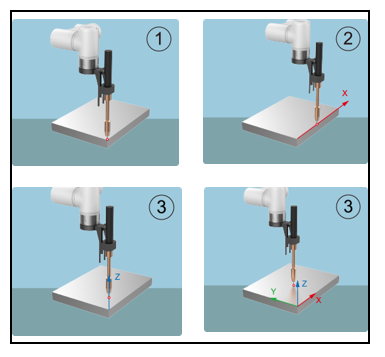

.. centered:: Figure 6.1-7 Schematic diagram of the three-point method

After completing the last step, click "Finish" to return to the workpiece coordinate interface, and click "Save" to store the workpiece coordinate system just created.

.. important:: 
   1. The workpiece coordinate system is calibrated based on the tool, and the workpiece coordinate system needs to be established on the basis of the established tool coordinate system.
   2. The workpiece coordinate system generally uses wobjcoord1~wobjcoord14, and wobjcoord0 is used to indicate that the origin of the workpiece coordinate system is at the origin of the base coordinates. When calibrating the workpiece coordinate system, it is first necessary to apply the workpiece coordinate system to wobjcoord0, and then select other workpiece coordinate systems for calibration and application.

Ext. Axis
~~~~~~~~~~~~~~~~~~~~~~~~~~~

Under the menu bar of "Initial - Base - Coordinate", click "Ext. Axis" to enter the extended axis coordinate system interface. In the extended axis coordinate system setting interface, the modification, clearing and application of the extended axis coordinates can be realized.

There are 5 numbers in the drop-down list of the extended axis coordinate system, from eaxis0~eaxis4, after selecting the corresponding coordinate system, the corresponding coordinate value will be displayed below, after selecting a coordinate system, click the "Apply" button, the currently used extended axis coordinates The system becomes the selected coordinates, as shown in figure below.

.. centered:: Figure 6.1-8 Extended Axis Coordinates

Click "Modify" to reset the extended axis coordinate system of the number according to the prompt, as shown in figure below. Before calibration, clear the extended axis coordinate system that needs to be calibrated, and apply this extended axis coordinate system. 

Let's first look at the first expansion axis scheme - the calibration method of the linear guide. Select the number of the extension axis, get information to get the driver information of the corresponding extension axis, and we can configure parameters based on this information. 

Set the DH parameters after configuration, and the linear guide rail scheme defaults to 0. Set the position of the robot relative to the expansion axis, and the linear guide is on the expansion axis. If you don't want to calibrate, just click Save. At this time, the expansion axis can only move asynchronously.

.. centered:: Figure 6.1-9 Linear guide configuration

If you need to move synchronously with the robot, click Calibrate to enter the calibration interface. At the zero point of the extended axis, click the Eaxis in the operation area to enable the extended axis, and align the end center of the robot (using the tool end point in the application tool coordinate system) with two different postures. Fix a point on the quasi-expansion axis, set point 1 and point 2 respectively. 

Remove the enable, and move the extension axis for a certain distance. After enabling, also align the center point of the end of the robot with the previous fixed point, and set point 3. Remove the enable, move the expansion axis to the zero point, and enable the expansion axis. Move the center point of the end of the robot to the fixed point and vertically upward space, set point 4, calculate the coordinate system and save it.

.. centered:: Figure 6.1-10 Linear guide calibration

Next, let's look at the second expansion axis scheme - the calibration method of the positioner. The positioner is composed of two extension axes. Select the number of the extension axis and get the information to get the driver information of the corresponding extension axis. 

We can configure parameters according to this information. After configuration, set the DH parameters, measure the DH parameters of the positioner according to the diagram, and input them into the input box. Set the position of the robot relative to the extension axis, and the positioner is outside the extension axis. If you don't want to calibrate, just click Save. At this time, the expansion axis can only move asynchronously.

.. image:: base/011.png
   :width: 3in
   :align: center

.. centered:: Figure 6.1-11 Positioner configuration

If you need to move synchronously with the robot, click Calibrate to enter the calibration interface. At the zero point of the extended axis, click the Eaxis in the operation area to enable the extended axis, establish a coordinate system on the positioner, select a point, and input the value of the point under the coordinate system. 

Carl pose, for example, select a point in the positive direction of Y, and measure Y to be 100mm, then input the value as shown in the figure, click the reference point, and the reference point can be set. The following four calibration points need to align the center of the end of the robot (the end point of the tool in the application tool coordinate system) with this reference point.

.. centered:: Figure 6.1-12 Positioner reference point configuration

Align the center of the end of the robot (using the end point of the tool in the application tool coordinate system) to the reference point, set point 1, click the Eaxis in the operation area to jog the two axes for a short distance, align the center of the end of the robot to the reference point, and set Point 2, continue to jog the two axes, the center of the robot end is aligned with the reference point, set point 3, and finally continue to jog the two axes, align the center of the robot end with the reference point, set point 4, click Calculate, and get the coordinates Click the save button to apply the result.

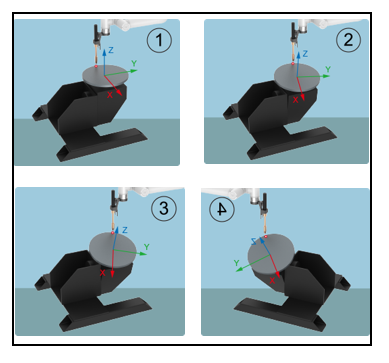

.. centered:: Figure 6.1-13 Positioner calibration

Next, let's look at the third extended axis solution - the calibration method of the single-axis positioner. The positioner is composed of a rotating extension shaft. Select the number of the extension shaft and get the information to get the driver information of the corresponding extension shaft. 

We can configure parameters according to this information. The DH parameter is set to 0. Set the position of the robot relative to the extension axis, and the positioner is outside the extension axis. If you don't want to calibrate, just click Save. At this time, the expansion axis can only move asynchronously.

.. centered:: Figure 6.1-14 Single axis positioner configuration

If you need to move synchronously with the robot, click Calibrate to enter the calibration interface. At the zero point of the extended axis, click the Eaxis in the operation area to enable the extended axis, establish a coordinate system on the positioner, select a point, and input the value of the point under the coordinate system. Carl pose, click "Reference Point" to set the reference point. 

The following four calibration points need to align the center of the end of the robot (the end point of the tool in the application tool coordinate system) with this reference point. Align the center of the end of the robot (using the end point of the tool in the application tool coordinate system) to the reference point, set point 1, click the Eaxis in the operation area to jog the rotation axis for a short distance, align the center of the end of the robot to the reference point, and set the point 2. Continue to jog the rotation axis, align the center of the end of the robot with the reference point, set point 3, and finally continue to jog the rotation axis, align the center of the end of the robot with the reference point, set point 4, click Calculate, and get the result of the coordinate system, Click Save to apply.

.. centered:: Figure 6.1-15 Single axis positioner calibration

.. important:: 
   1. The extended axis coordinate system is calibrated on the basis of the tool, and the extended axis coordinate system needs to be established on the basis of the established tool coordinate system.
   2. The extended axis system generally uses exaxis1~exaxis4, and exaxis0 is used to represent the non-extended axis coordinate system. When calibrating the extended axis coordinate system, the extended axis coordinate system must first be applied to exaxis0, and then other extended axis coordinate systems should be selected for calibration and application.

Payload
-------------

End payload
~~~~~~~~~~~~~~

Under the menu bar of "Initial - Base - Payload", click "End payload" to enter the end load interface.

When configuring the end load, please enter the mass of the end tool used and the corresponding center of mass coordinates into the "Load mass" and "Load mass center coordinates X, Y and Z" input boxes and apply.

.. important:: 
    The load mass cannot exceed the maximum load range of the robot. For the load range corresponding to the specific robot model, please refer to 2.1. Basic parameters.The center of mass coordinate setting range is 0-1000, unit mm.

.. centered:: Figure 6.2-1 Schematic diagram of load setting

.. important:: 
   After the load is installed at the end of the robot, the weight of the end load and the coordinates of the center of mass must be set correctly, otherwise it will affect the drag function of the robot and the use of the collision detection function.

If the user is unsure about the tool mass or center of mass, he can click "Automatic Identification" to enter the load identification function to measure the tool data.

Before taking measurements, make sure the load is installed and then select the version. Click the "Tool Data Measurement" button to enter the load motion test interface.

.. centered:: Figure 6.2-2 Load Identification Joint Setup

Click "Load Identification Start" to test. In case of emergency, please stop the movement in time.

.. centered:: Figure 6.2-3 load identification start

After the exercise is over, click the "Get Identification Result" button to obtain the calculated tool data and display it on the page. If you want to apply it to the load data, click Apply.

.. centered:: Figure 6.2-4 Load Identification Results

Joint
--------------

Soft limit
~~~~~~~~~~~

Under the menu bar of "Initial - Base - Joint", click "Soft limit" to enter the soft limit interface.

There may be other equipment in the robot's stroke, and the limit angle can softly limit the robot so that the robot's movement does not exceed a certain coordinate value and prevent the robot from colliding. Triggering the soft limit to stop the robot is automatically triggered by the robot, and there is no stopping distance.

Administrators can use the default values or enter angle values. Input the angle value to limit the positive and negative angles of the robot joints respectively. When the input value exceeds the robot joint soft limit angle value listed in the robot basic parameter table in 2.1-Basic Parameters, the limit angle will be adjusted to the maximum value that can be set. When the robot reports that the command exceeds the limit, it needs to enter the drag mode and drag the robot joints to within the limit angle. The interface is shown in figure below.

.. centered:: Figure 6.3-1 Schematic diagram of robot limit

Collision level
~~~~~~~~~~~~~~~~~~

Under the menu bar of "Initial - Base - Joint", click "Collision Level" to enter the collision level interface.

The collision level is divided into one to ten levels, and the detection of one to three levels is more sensitive, and the robot needs to run at the recommended speed. At the same time, you can choose to customize the percentage setting, and 100% corresponds to the tenth level. The collision strategy can set the processing method of the robot after the collision, which is divided into error stop and continuous movement, and the user can set it according to the specific use requirements. Such as Figure 6.1-16.

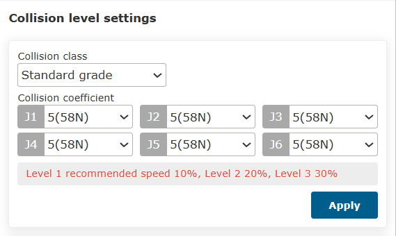

.. centered:: Figure 6.3-2 Schematic diagram of collision level

Post-collision response strategy function
~~~~~~~~~~~~~~~~~~~~~~~~~~~~~~~~~~~~~~~~~~~~~~

.. important:: Note: This post-collision response strategy function is only used in the Linux version.

On the basis of the original collision strategy in motion, " Gravitational moment mode " and " Vibration response mode " are added to ensure the safety of man-machine cooperation. 

When the two strategies are triggered, they will switch from automatic mode or manual mode to drag mode. The Gravitational moment mode will move away from the collision point according to the magnitude and direction of the collision force, while the Vibration response mode will return to the collision position after moving away from the collision point. At the same time, collision detection at rest is added.

Collision strategy
+++++++++++++++++++++

Gravitational moment mode
*****************************

The Gravitational moment mode in collision strategy is set as follows.

**Step1**:Click "Collision Level" under the menu bar of "Initial - Base - Joint" to enter the corresponding interface.

**Step2**:In the column of "Collision Strategy", click the drop-down box to select " Gravitational moment mode ", and the interface is shown below; Then, click the "Apply" button to enable the function. 

.. note:: In the operation of the robot, if the load mass changes greatly, this strategy is not recommended; This strategy is not recommended if the running speed is too fast.

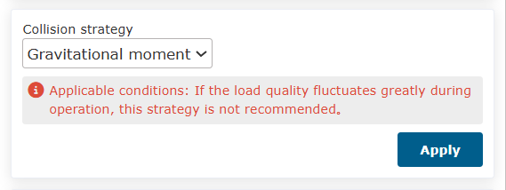

.. centered:: Figure 6.3-3 Gravitational moment mode of Collision Strategy

Vibration response mode
*************************

The setting steps of oscillation response mode in collision strategy are as follows.

**Step1**:Click "Collision Level" under the menu bar of "Initial - Base - Joint" to enter the corresponding interface.

**Step2**:In the column of "Collision Strategy", click the drop-down box to select " Vibration response mode", and the interface is shown below; Then, click the "Apply" button to enable the function.

.. note:: It is not recommended to use this strategy if the robot runs too fast.

.. centered:: Figure 6.3-4 Vibration response mode of Collision Strategy

Static collision detection
+++++++++++++++++++++++++++++++

The setup steps of static collision detection are as follows.

**Step1**:Click "Collision Level" under the menu bar of "Initial - Base - Joint" to enter the corresponding interface.

**Step2**:Turn on the switch for static collision detection, as shown below. When it is detected that the gap between the joint torque command and the torque feedback is too large, the robot will enter the drag mode to avoid continuous extrusion force.

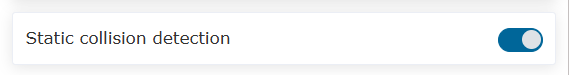

.. centered:: Figure 6.3-5 Static collision detection

Friction compensation
~~~~~~~~~~~~~~~~~~~~~~~~~

Under the menu bar of "Initial - Base - Joint", click "Friction comp." to enter the friction compensation setting interface.

**Friction compensation coefficient**:The usage scenario for friction compensation is only in the dragging mode. The friction compensation coefficient can be set from 0 to 1. The higher the value, the greater the compensation force when dragging. The friction compensation coefficient needs to be set separately for each axis according to the different installation methods.

**Friction compensation switch**:Users can turn on or off friction compensation according to the actual robot and usage habits.

.. centered:: Figure 6.3-6 Friction Compensation Settings

.. important:: 
   The friction compensation function of the robot needs to be used with caution. According to the actual situation, a reasonable compensation coefficient should be set. Generally, the recommended median value is about 0.5.

I/O setup
--------------------

I/O configuration
~~~~~~~~~~~~~~~~~~

Click "Initial - Base - I/O setup" on the menu bar, and click the "DI Configuration" and "DO Configuration" submenus respectively to enter the DI and DO configuration interface. Among them, the control box CI0-CI7 and CO0-CO7 are configurable, and the terminal DI0 and DI1 are configurable. 

In production, when the collaborative robot needs to connect peripherals or stops suddenly due to failure or other factors, it needs to output DO signal to realize sound and light alarm prompt. The input configurable functions are shown in table below.

.. centered:: Table 6.4-1 Control box input configurable functions

.. list-table:: 
   :widths: 15 80
   :header-rows: 1
   :align: center

   * - Fuction No
     - Fuction name
   * - 0
     - nothing
   * - 1
     - Arcing success signal
   * - 2
     - Welding machine preparation signal
   * - 3
     - Belt detection
   * - 4
     - suspend
   * - 5
     - recovery
   * - 6
     - start-up 
   * - 7
     - stop it  
   * - 8
     - Pause/Resume 
   * - 9
     - Start/Stop
   * - 10
     - Pedal drag switch 
   * - 11
     - Move to job origin
   * - 12
     - Manual automatic switching
   * - 13
     - Welding wire position finding succeeded
   * - 14
     - Motion interruption 
   * - 15
     - Start main program
   * - 16
     - Start rewind
   * - 17
     - Start up confirmation
   * - 18
     - Laser detection signal X
   * - 19
     - Laser detection signal Y
   * - 20
     - External emergency stop input signal 1 (Configurable only under QNX)
   * - 21
     - External emergency stop input signal 2(Configurable only under QNX)
   * - 22
     - Level 1 reduction mode (Configurable only under QNX)
   * - 23
     - Level 2 reduction mode (Configurable only under QNX)
   * - 24
     - Level 3 reduction mode (stop) (Configurable only under QNX)
   * - 25
     - Resume welding
   * - 26
     - Terinate welding
   * - 27
     - Assisted drag on
   * - 28
     - Assisted drag off
   * - 29
     - Assisted drag on/off
   

The output configurable functions are shown in table below.

.. centered:: Table 6.4-2 Control box output configurable function

.. list-table:: 
   :widths: 15 80
   :header-rows: 1
   :align: center

   * - Fuction No
     - Fuction name
   * - 0
     - nothing
   * - 1
     - report errors
   * - 2
     - motion
   * - 3
     - Spraying start and stop
   * - 4
     - Spraying gun cleaning
   * - 5
     - Arcing
   * - 6
     - aspiration
   * - 7
     - Forward wire feeding
   * - 8
     - Reverse wire feeding
   * - 9
     - JOB input port 1
   * - 10
     - JOB input port 2
   * - 11
     - JOB input port 3
   * - 12
     - Start and stop of conveyor belt
   * - 13
     - suspend
   * - 14
     - Reaching the job origin
   * - 15
     - Enter the interference zone
   * - 16
     - Start stop control of welding wire positioning
   * - 17
     - Robot startup completed
   * - 18
     - Program start and stop
   * - 19
     - Automatic manual mode
   * - 20
     - Emergency stop output singal 1 (Configurable only under QNX)
   * - 21
     - Emergency stop output singal 2 (Configurable only under QNX)
   * - 22
     - Lua script program stop or running
   * - 23
     - Safe status output (Configurable only under QNX)
   * - 24
     - Protective stop status output (Configurable only under QNX)
   * - 25
     - Robot in motion (Configurable only under QNX)
   * - 26
     - Robot reduced mode (Configurable only under QNX)
   * - 27
     - Robot non-reduced mode (Configurable only under QNX)
   * - 28
     - Reserved
   * - 29
     - Command point error
   * - 30
     - Drive error
   * - 31
     - Soft limit exceeded error
   * - 32
     - Collision error
   * - 33
     - Wrong number of active slaves
   * - 34
     - Slave error
   * - 35
     - IO error
   * - 36
     - Gripper error
   * - 37
     - File error
   * - 38
     - Strange pose error
   * - 39
     - Driver communication error
   * - 40
     - Parameter error
   * - 41
     - External axis exceeds software limit error

.. centered:: Table 6.4-3 Terminal input configurable function

.. list-table:: 
   :widths: 15 80
   :header-rows: 1
   :align: center

   * - Fuction No
     - Fuction name
   * - 0
     - nothing
   * - 1
     - Drag Mode
   * - 2
     - Teaching point record
   * - 3
     - Manual automatic switching
   * - 4
     - TPD track recording start/stop
   * - 5
     - suspend
   * - 6
     - recovery
   * - 7
     - start-up
   * - 8
     - stop it
   * - 9
     - Pause/Resume
   * - 10
     - Start/Stop
   * - 11
     - Assisted drag on
   * - 12
     - Assisted drag off
   * - 13
     - Assisted drag on/off

Among them, the default configuration of the control box: CO0 is 1-the robot is reporting an error, and CO1 is 2-the robot is in motion.

.. centered:: Figure 6.4-1 Control box DI and DO configuration

**The default configuration of terminal DI**: DI0 drag teaching, DI1 teaching point recording.

.. centered:: Figure 6.4-2 Terminal DI configuration

After the configuration is complete, you can view the corresponding output DO status on the I/O page of the control box under the corresponding status.

.. important:: 
   Configured DI and DO are forbidden to be used in coding.

**Reduction mode configuration (level 1, level 2, level 3)**: The joint speed and terminal TCP speed can be configured in the first-level and second-level reduction modes, and the third-level reduction mode is to stop without configuring the speed.

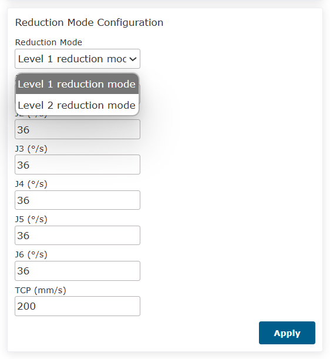

.. centered:: Figure 6.4-3 Safe speed setting

Alias
~~~~~~~~~~~~~~~~~~~~~~~~~~~~~~~

Click "Initial - Base - I/O setup" on the menu bar, click on the "Alias"  submenu to enter the configuration interface, and configure the given meaning names of the control box and end IO signals according to the actual usage scenario. After successful configuration, the modules related to IO signal content will display corresponding aliases, as follows:

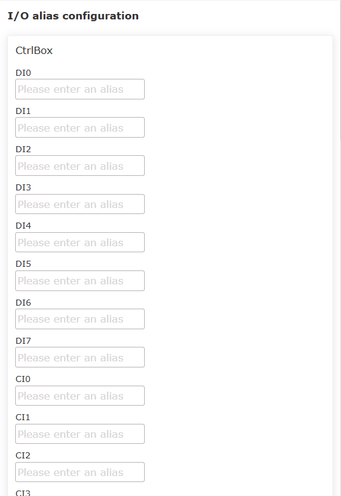

.. centered:: Figure 6.4-4 I/O alias configuration

Filter
~~~~~~~~~~~~~~~~

Click "Initial - Base - I/O setup" on the menu bar, and click the "Filter" submenu to enter the IO filter time setting interface. The filter time setting interface includes: 

- control box DI filter time
- end board DI filter time
- control box AI0 Filtering time
- AI1 filtering time of the control box
- AI0 filtering time of the end board
- Button box DI filter time
- Extended DI filter time
- Extended AI0 filter time
- Extended AI1 filter time
- Extended AI2 filter time
- Extended AI3 filter time
- Smart DI filter time

Users can set the corresponding parameters according to their needs, just click the corresponding setting button. As shown in figure below.

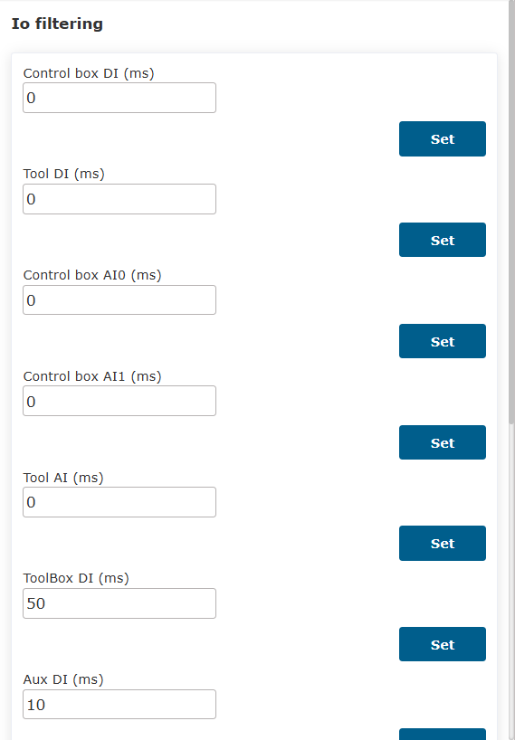

.. centered:: Figure 6.4-5 Filter interface

.. important:: 
   The I/O filter time range is [0~200], the unit is ms.

Output reset
~~~~~~~~~~~~~~~~~~~~~~~~~~~~~~~~~~~~

Click "Initial - Base - I/O setup" on the left menu bar, click the "Output reset" submenu to enter the configuration interface, and configure whether different outputs need to be reset after stopping/pausing according to the actual need for reset during use. The current output includes:

- control box DO
- control box AO
- End plate DO
- End plate AO
- Expand DO
- Expand AO
- SmartTool DO

.. centered:: Figure 6.4-6 Output reset configuration

.. Configuration import and export
.. ~~~~~~~~~~~~~~~~~~~~~~~~~~~~~~~~~

.. Under the menu bar of "Robot Settings" in "Initial Settings", click "Configuration Import and Export" to enter the configuration import and export interface.

.. **Import robot configuration files**:The user imports a robot configuration file named user.config, which contains various parameters in the robot setting function. Click the "Select File" button, select the configuration file that has been modified and the content meets the specifications, and click the "Import" button. When the prompt of import completion appears, the parameters in the file are successfully set.

.. **Export robot configuration file**:Click the "Export" button to export the robot configuration file user.config to the local.

.. **Import controller database**:The user imports the controller database file named fr_controller_data.db. Click the "Select File" button, select the database file that has been modified and the content meets the specifications, and click the "Import" button. When the prompt of import completion appears, the parameters in the file are successfully set.

.. **Controller database**:Click the "Export" button to export the robot controller database file to the local.

.. .. image:: base/031.png
..    :width: 3in
..    :align: center

.. .. centered:: Figure 6.5-1 Configuration import and export

Tool Tcp Automatic Calibration
-------------------------------------------

Overview
~~~~~~~~~~~~~

Robot tool TCP (Tool Center Position, TCP) automatic calibration uses photoelectric sensor equipment (double tube cross type) to quickly calibrate the robot tool TCP. By counting the time when the tool triggers I/O signals in the photoelectric sensor device during robot movement, the conversion relationship between the robot end flange and the tool coordinate system is established, thereby accurately calibrating the robot tool coordinate system and improving the accuracy of the robot system.

Calibration process of coordinate system for sensor equipment
~~~~~~~~~~~~~~~~~~~~~~~~~~~~~~~~~~~~~~~~~~~~~~~~~~~~~~~~~~~~~~~~~~~~~~~

Installing robots
++++++++++++++++++++++++++

Install a robot with an absolute positioning accuracy of 1.2 mm on the work platform, and install a specialized tool for calibrating the coordinate system of the photoelectric sensor on the end flange of the robot.

.. image:: base/034.png
   :width: 2in
   :align: center

.. centered:: Figure 6.5‑1 Example of robot installation

Installing sensor device
+++++++++++++++++++++++++++++++++

Connect the two sets of brown, blue, and black signal wires of the photoelectric sensor device to the two sets of 24V, 0V, CI0, and CI1 ports (any available configurable digital signal input port is sufficient) of the robot control box. Power on the control box to start the robot and light up the X and Y axis beams of the photoelectric sensor device.

.. image:: base/035.png
   :width: 2in
   :align: center

.. centered:: Figure 6.5‑2 Example of photoelectric sensor equipment

Setting up the TCP automatic calibration system coordinate system
++++++++++++++++++++++++++++++++++++++++++++++++++++++++++++++++++++++

According to the TCP automatic calibration system for robot tools, firstly, place the coarse positioning photoelectric sensor device in the flexible workspace of the robot, and ensure that the coordinate system of the photoelectric sensor device is roughly aligned with the robot base coordinate system.

As shown above, where {b} is the robot base coordinate system, {e} is the end flange coordinate system, and {s} is the sensor coordinate system.

.. centered:: Figure 6.5‑3 Coordinate system setting for TCP automatic calibration system of robot tool

(1) adjust the posture of the robot's end flange to Rx, Ry, and Rz at 180 °, 0 °, and 0 °, respectively, and ensure that this posture remains unchanged throughout the entire calibration sensor device coordinate system movement process after adjustment；

(2) Then make the robot tool TCP perform MoveL motion together in the X and Y axis directions of the robot base coordinate system and the sensor coordinate system；

(3) During the movement of the robot, once the X and Y axis beams of the photoelectric sensor device always maintain the triggering I/O signal state, the installation position of the photoelectric sensor device can be accurately positioned as its current position.

Calibrate the sensor coordinate system based on the web interface
+++++++++++++++++++++++++++++++++++++++++++++++++++++++++++++++++++++++++++++++++++++++++++++++

In the robot web control interface, click on "Initial" - "Base" - "Coordinate" - "TCP" to enter the "Tool coordinate system settings" interface；

Select the reference coordinate system from the drop-down menu of "Coordinate system name", and choose the corresponding "Tool Type" and "Installation position", then click "Modify" to enter the "Modify Wizard" interface；

Select "Laser automatic calibration", enter the laser automatic calibration interface, click "Configuration", enter the "Laser calibration device configuration" interface, if there are previous settings, click "Modify".

.. centered:: Figure 6.5‑4  Example of entering the photoelectric automatic calibration interface

Set I/O
***********************

Select the input port numbers for the control box of the X-axis laser beam and Y-axis laser beam, then click "Set". After successful settings, a green check mark will appear before the "Setup I/O" indicator.

.. centered:: Figure 6.5‑5 Example of setting the X and Y axis laser beam I/O ports of the laser sensor

Teaching center point
******************************

Drag the robot to trigger the X and Y axis beam I/O signals of the photoelectric sensor device using the TCP tool, and then move it along the Z+ axis direction of the base coordinate system to a position 5 mm above the measurement plane of the sensor device (where the X and Y axis beams intersect). 

.. warning:: Note that during this process, the end flange posture of the robot remains unchanged at Rx, Ry, and Rz, which are 180 °, 0 °, and 0 °, respectively. Then click "Record". After successful setting, a green check mark will appear before the "Setup center Point" marker.

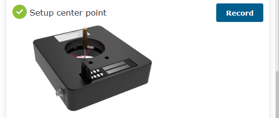

.. centered:: Figure 6.5‑6  The teaching TCP is located at the center of the sensor measurement plane

Set parameters
****************************

Set three custom parameters: "Movement radius", "Angular velocity", and "Depth of movement".

(1) The "Movement radius" parameter is the radius at which the robot tool performs circular motion. Referring to the effective measurement radius of the laser sensor used, which is 35 mm, it is recommended to set it to "10-15 mm". If it is too large, it may cause interference between the tool and the sensor, and if it is too small, it may cause interference between the X and Y axis laser I/O signals of the sensor;

(2) The "Angular velocity" parameter is the uniform angular velocity at which the robot tool moves in a circular motion. It is recommended to set it to "10-40 deg/s". If it is too large, it may cause impact vibration at the end of the tool and result in frame dropping of sensor I/O signals;

(3) The "Depth of movement" parameter is the Euclidean distance between the centers of the robot's two circular motions. The effective measurement height of the laser sensor used is 25 mm, and it is recommended to set it to "5-15mm". If it is too large, it may cause interference between the tool and the sensor.

Then click on "Set", and after successful settings, a green check mark will appear before the "Set Parameters" icon.

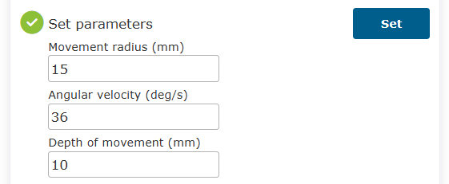

.. centered:: Figure 6.5‑7 Example of custom parameter setting

Run
*********************

In automatic mode, click "Run" to initiate the calibration operation of the sensor coordinate system. After the operation is completed, the interface displays the x, y, and z coordinate values of the calibrated sensor coordinate system and the attitude angles of Rx, Ry, and Rz. Then click "complete" to save the current data and exit the current interface.

.. image:: base/041.png
   :width: 4in
   :align: center

.. centered:: Figure 6.5‑8 Example of calibration results for laser sensor coordinate system

.. warning:: Pay attention to the current operation. It is recommended that the robot perform this operation during the lifecycle of each production task (robot power off start operation) to prevent small displacement of sensor installation position caused by high-frequency vibration during operation and calculation errors caused by incorrect operation resulting in the release of sensor coordinate system calibration data in the controller.

Calibration process of tool coordinate system
~~~~~~~~~~~~~~~~~~~~~~~~~~~~~~~~~~~~~~~~~~~~~~

After completing the "Laser device configured", if a green check mark appears in front of the label, it indicates that the laser sensor coordinate system has been successfully set. Remove the specialized tool for the end flange of the robot and install the unknown tool to be calibrated. Click "Calibrate" to start the TCP automatic calibration tool. After the operation is completed, the interface will display the calibration results.

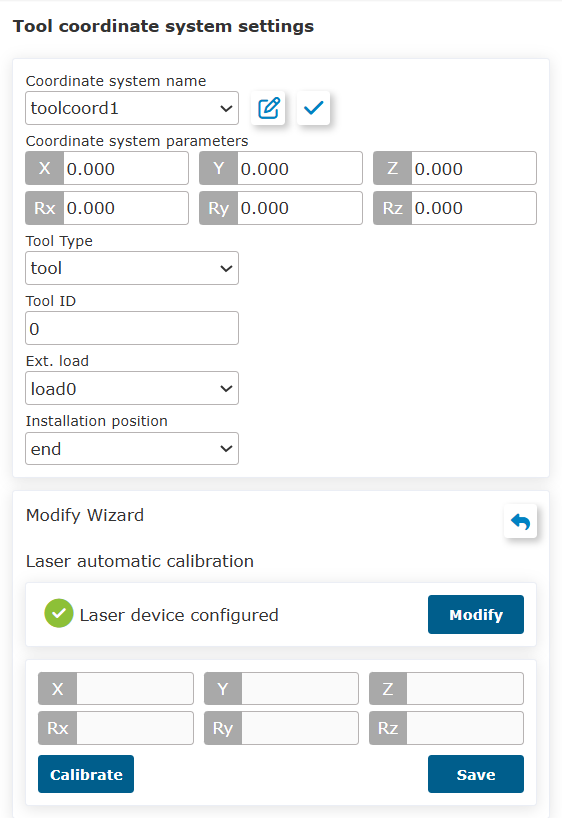

.. centered:: Figure 6.5‑9 Example of TCP calibration results for tool

Click "Save" to update the calibration result of the current tool TCP in the selected reference coordinate system from the drop-down menu of "Coordinate system name" in the "Current tool coordinate system" interface.

In the "Current tool coordinate system" interface, click "Apply" to apply the current tool TCP calibration result in the current reference tool coordinate system.

.. important:: 
  It should be noted that:

  （1）Note that before clicking "calibrate", you can avoid errors during the calibration tool coordinate system process by observing whether the x, y, and z coordinate results of the calibrated sensor coordinate system have significant errors compared to the actual sensor installation position. If the situation occurs, the reason may be that the robot tool TCP automatic calibration system coordinate system is set incorrectly, and the installation position of the laser sensor equipment needs to be adjusted before recalibrating the sensor coordinate system;

  （2）At the same time, after clicking "Calibrate", you can avoid errors in the process of calibrating the tool coordinate system by observing whether the robot adjusts the end flange attitude significantly (>90 °) after performing two circular movements. If the situation occurs, the reason may be that the "movement radius" parameter is set too small, causing interference in the sensor I/O signal. In this case, it is necessary to modify the "movement radius" parameter and click "calibrate" again;

  （3）In addition, it is recommended to calibrate the tool type with a cylindrical end, a spindle direction roughly parallel to the end flange spindle direction, and a radius within 10 mm. The measurable length of the tool end should be within 5-15 mm (not the overall length of the tool) to avoid interference with the sensor device.