Robot Slave Mode
===============================================================

.. toctree:: 
   :maxdepth: 6

Overview
-------------------

To facilitate PLC control of robot motion through different industrial bus protocols (CC-Link, Profinet, Ethernet/IP, EtherCAT), FRJ-PCIeN-EIP/CC/PN-RJ-V10 board and FRJ-PCIeN-EC/PN/EIP/CC-RJ-V20 board devices are added to the integrated mini control box. The robot slave mode is developed to achieve the following functions:

- 1. The master device sends input signals to the robot slave to control the robot to perform corresponding actions, for example: controlling the output of the robot control box DO, controlling robot motion, etc.;

- 2. The master device reads the value of the corresponding address to obtain the corresponding robot real-time status data, for example: robot joint data, TCP position, whether the robot has moved to the target position, etc.

Environment Configuration
--------------------------

The board model and software version are described as follows:

.. list-table:: 
   :widths: 20 50 30
   :header-rows: 1
   :align: center

   * - **Protocol Type**
     - **Board Model**
     - **Robot Software Version**

   * - CC-Link IEF Basic
     - FRJ-PCIeN-EIP/CC/PN-RJ-V10 Board
     - V3.8.4 and above

   * - CC-Link IEF Basic
     - FRJ-PCIeN-EC/PN/EIP/CC-RJ-V20 Board
     - V3.9.6 and above

   * - Profinet
     - FRJ-PCIeN-EIP/CC/PN-RJ-V10 Board
     - V3.8.4 and above

   * - Profinet
     - FRJ-PCIeN-EC/PN/EIP/CC-RJ-V20 Board
     - V3.9.6 and above

   * - Ethernet/IP
     - FRJ-PCIeN-EIP/CC/PN-RJ-V10 Board
     - V3.8.4 and above

   * - Ethernet/IP
     - FRJ-PCIeN-EC/PN/EIP/CC-RJ-V20 Board
     - V3.9.6 and above

   * - EtherCAT
     - FRJ-PCIeN-EC/PN/EIP/CC-RJ-V20 Board
     - V3.9.6 and above

Board Installation
~~~~~~~~~~~~~~~~~~~~~~~~~~~~~~~~~~~~~~~~~~~~~~~~~~~~~~

(1) Check materials: The appearance of the FRJ-PCIeN board and the accompanying sheet metal parts is shown below.

.. image:: remote_mode/001.png
   :width: 4in
   :align: center

.. centered:: Figure 19.2-1 Installation Sheet Metal (Front)

.. image:: remote_mode/002.png
   :width: 4in
   :align: center

.. centered:: Figure 19.2-2 Installation Sheet Metal (Back)

.. image:: remote_mode/003.png
   :width: 4in
   :align: center

.. centered:: Figure 19.2-3 FRH-PCIeN-EC/EIP/CC/PN-RJ-V10 Board

.. image:: remote_mode/004.png
   :width: 4in
   :align: center

.. centered:: Figure 19.2-4 FRJ-PCIeN-EIP/CC/PN-RJ-V10 Board

(2) Install the board into the integrated mini control box as shown in the figure.

.. image:: remote_mode/005.png
   :width: 4in
   :align: center

.. centered:: Figure 19.2-5 Sheet Metal Installation Diagram

.. image:: remote_mode/008.png
   :width: 4in
   :align: center

.. centered:: Figure 19.2-6 Core Motherboard Installation Diagram

.. image:: remote_mode/009.png
   :width: 4in
   :align: center

.. centered:: Figure 19.2-7 RJ45 Network Port Expansion Card Installation Diagram

.. note:: Note: All screws must be tightened.

(3) The wiring between the robot control box and the PLC is shown in the figure below.

.. image:: remote_mode/010.png
   :width: 4in
   :align: center

.. centered:: Figure 19.2-8 Control Box & Mitsubishi PLC Wiring Diagram    

.. image:: remote_mode/011.png
   :width: 4in
   :align: center

.. centered:: Figure 19.2-9 Control Box & Siemens PLC Wiring Diagram

.. image:: remote_mode/012.png
   :width: 4in
   :align: center

.. centered:: Figure 19.2-10 Control Box & Inovance PLC Wiring Diagram

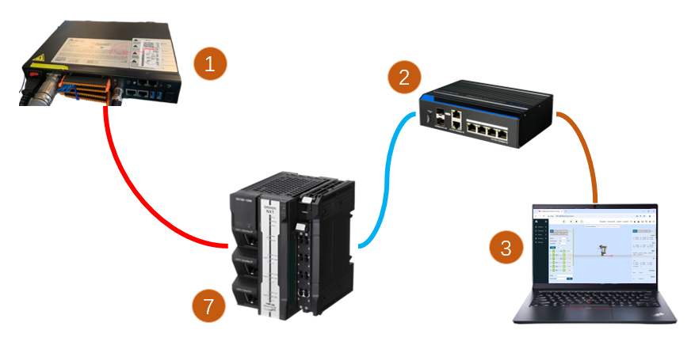

.. centered:: Figure 19.2-11 Control Box & Inovance PLC Wiring Diagram

.. note:: 
    1: Robot control box (board network port);
    2: Switch;
    3: Laptop PC;
    4: Mitsubishi PLC (CC-Link IEF Basic network port);
    5: Siemens PLC (Profinet network port);
    6: Inovance PLC (Ethernet/IP);
    7: Inovance PLC (EtherCAT network port);
        
PLC Environment Setup
~~~~~~~~~~~~~~~~~~~~~~~~~~~~~~~~~~~~~~~~~~~~~~~~~~~~~~~~

The test environment built to implement the slave commands of each protocol is shown in the following table, including the PLC model, firmware version and test software used in each protocol.

.. centered:: Table 2-1 Test Environment

.. list-table:: 
   :widths: 20 40 40
   :header-rows: 1
   :align: center

   * - Protocol
     - Profinet
     - CC-link

   * - Brand
     - Siemens
     - Mitsubishi

   * - Model
     - CPU 1515-2 PN
     - FX5S-30TR/DS

   * - Firmware
     - 6ES75152AM020AB0
     - 30MR/ES V1.3

   * - Software
     - TIA Portal V17
     - GXWorks3V1.097B

   * - Board IP Address
     - Configurable
     - Configurable

   * - PLC IP Address
     - No need to be on the same subnet
     - Same subnet
		
.. list-table:: 
   :widths: 20 40 40
   :header-rows: 1
   :align: center

   * - Protocol
     - Ethernet/IP
     - EtherCAT

   * - Brand
     - Inovance
     - Inovance

   * - Model
     - Easy521-0808TN
     - Easy521-0808TN

   * - Firmware
     - /
     - /

   * - Software
     - AutoShop 4.11.0.1
     - AutoShop 4.11.0.1

   * - Board IP Address
     - Configurable
     - Configurable

   * - PLC IP Address
     - Same subnet
     - Same subnet
		
Inovance Ethernet/IP
+++++++++++++++++++++++++++++++++++++++++++++++++++++

(1) Import EDS File

Open Inovance programming software AutoShop, create a new PLC project, and select "EtherNet/IP Devices" in the toolbox on the right.

Left-click "EtherNet/IP", then right-click to pop up the "Import EDS" dialog box. Left-click to confirm and find the folder containing the board EDS file. After successful import, the board name will appear under the "EtherNet/IP Devices" directory. Close the project and reopen it to complete the EDS file import.

.. image:: custom_protocol_slave/001.png
   :width: 6in
   :align: center

.. image:: custom_protocol_slave/002.png
   :width: 6in
   :align: center

(2) EtherNet/IP Parameter Settings

Double-click the slave under "EtherNet/IP" in the left toolbar to pop up the parameter setting window:

.. image:: custom_protocol_slave/003.png
   :width: 6in
   :align: center

Fill in the board IP address:

.. image:: custom_protocol_slave/004.png
   :width: 6in
   :align: center

Click to select "Connection" to set the data input and output byte size:

.. image:: custom_protocol_slave/005.png
   :width: 6in
   :align: center

Click "Edit Connection" to enter the pop-up window, change both input and output bytes to 256:

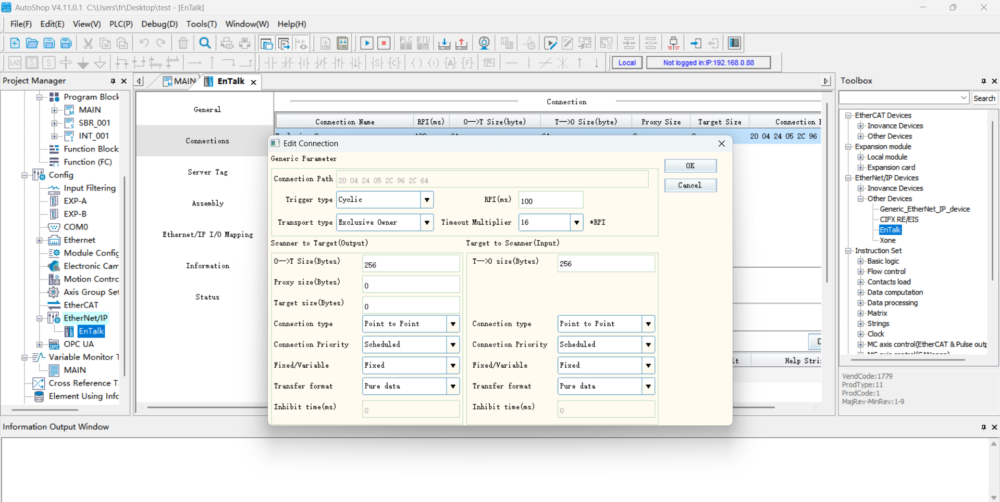

Click to select "Data Set", set the input and output data type to "INT", and the bit length to "2048":

.. image:: custom_protocol_slave/007.png
   :width: 6in
   :align: center

.. image:: custom_protocol_slave/008.png
   :width: 6in
   :align: center

.. image:: custom_protocol_slave/009.png
   :width: 6in
   :align: center

After successfully setting the "Data Set" parameters, click to select "EtherNet/IP I/O Mapping" and enter D0 and D200 respectively. D0 and D200 correspond to the start addresses of the receive and send arrays on the PLC side.

.. image:: custom_protocol_slave/010.png
   :width: 6in
   :align: center

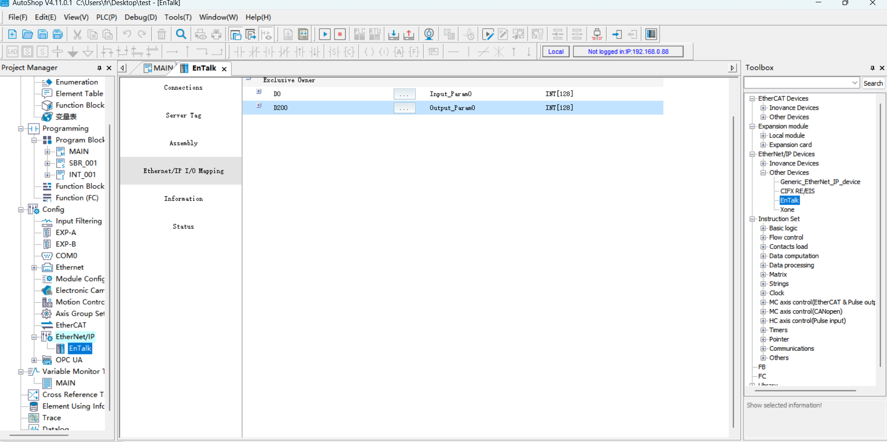

(3) Program Download

Open the test program, modify the PLC IP address to be on the same subnet as the board, and run the program after downloading.

Siemens Profinet
++++++++++++++++++++++++++++++++++++++++++++++++++++++++

(1) Import GSD File (XML File)

Open Siemens programming software TIA Portal V17, create a new PLC project, select "Devices & Networks", and double-click 6ES7 515-2AM02-0AB0 in the "Hardware Catalog" on the right to add the PLC module.

.. image:: custom_protocol_slave/012.png
   :width: 6in
   :align: center

In the TIA PORTAL software menu bar, select "Options" -> "Manage general station description files (GSD)" to install or delete installed GSD files.

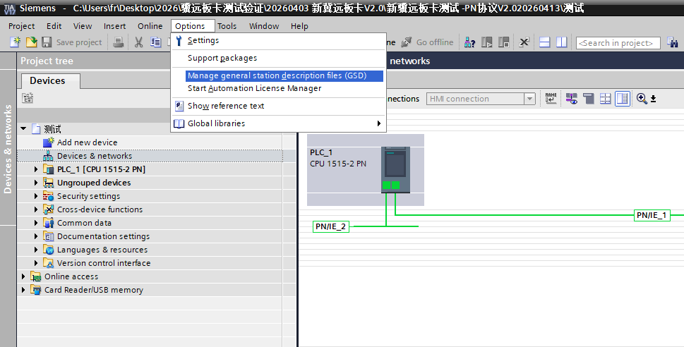

To install GSD files, select "Manage general station description files (GSD)" as above, and the "Manage general station description files" window appears.

Select the folder containing the GSD files to be installed from the "Source path", select one or more files to install from the displayed list of GSD files, and click the "Install" button. As shown in the figure below.

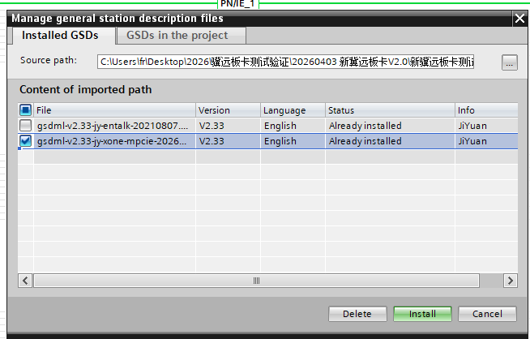

After successful installation, the device with the installed GSD file can be found under "Other field devices" in the hardware catalog, as shown in the figure below.

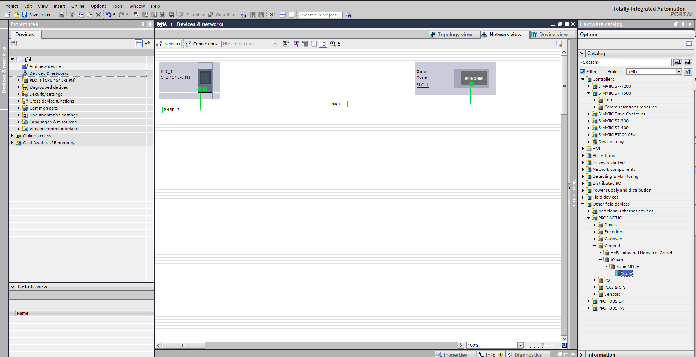

Assign IO: Look for modules in the directory and drag Input and Output.

.. image:: custom_protocol_slave/016.png
   :width: 6in
   :align: center

Compile the program: Double-click to enter "Devices & Networks" in the left project tree, right-click the "PLC_1" module, select "Compile" from the drop-down menu, and click "Hardware and software (only changes)". After compilation is complete, "Compilation completed" will be displayed at the bottom of the software view:

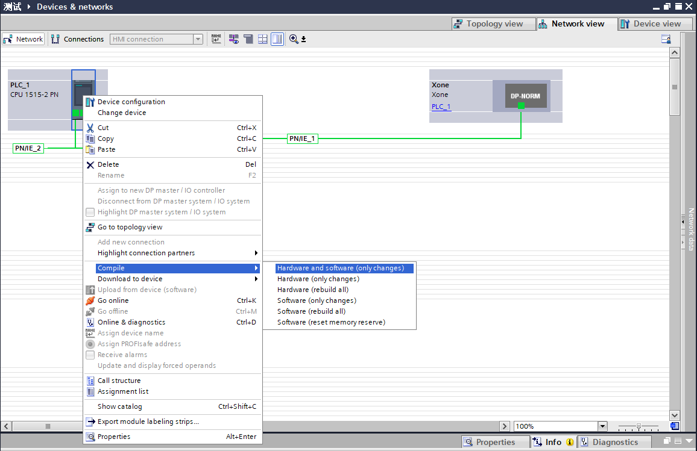

.. image:: custom_protocol_slave/018.png
   :width: 6in
   :align: center

Download the program to the device: Double-click to enter "Devices & Networks" in the left project tree, right-click the "PLC_1" module, select "Download to device" from the drop-down menu, and click "Hardware and software (only changes)":

.. image:: custom_protocol_slave/019.png
   :width: 6in
   :align: center

Search and download the device: After the pop-up window, configure the PG/PC interface type as shown below, click "Start search", select the device to which the program needs to be downloaded, and click "Download":

.. image:: custom_protocol_slave/020.png
   :width: 6in
   :align: center

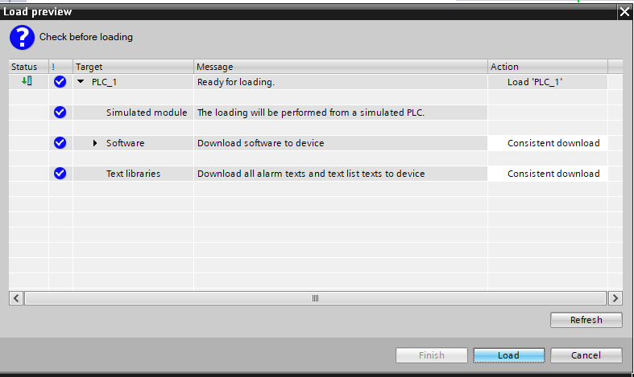

Mitsubishi CC-link
+++++++++++++++++++++++++++++++++++++++++++++++++

(1) CC-Link IEF Basic Settings

Enable CC-link: Select "Ethernet Port" in the left navigation menu bar, set the PLC IP address to ensure it is on the same subnet as the Jiyuan board address. Click "Use CC-link IEF Basic" and select "Use":

.. image:: custom_protocol_slave/022.png
   :width: 6in
   :align: center

CC-Link Network Configuration Settings: Also in CC-Link IEF Basic settings, select "Network Configuration Settings" and choose the CC-Link IEF Basic general module. Drag it to the lower left of the view to complete the hardware configuration:

.. image:: custom_protocol_slave/023.png
   :width: 6in
   :align: center
   
.. image:: custom_protocol_slave/024.png
   :width: 6in
   :align: center

Set the slave station points and IP address:

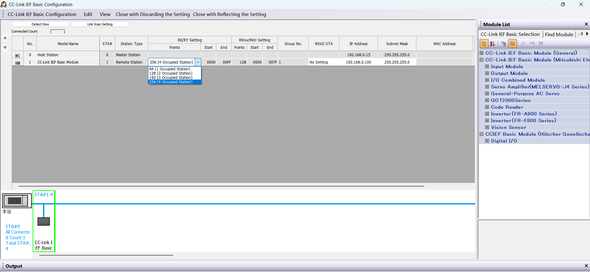
   
.. image:: custom_protocol_slave/026.png
   :width: 6in
   :align: center

CC-Link Refresh Settings: Also in CC-Link IEF Basic settings, click "Refresh Settings" and customize the transmission settings: 256 bytes receive, 256 bytes send.
   
.. image:: custom_protocol_slave/027.png
   :width: 6in
   :align: center

(2) Program Download

After opening the test program, click "Online" -> "Write to Programmable Controller" to enter the download interface.
   
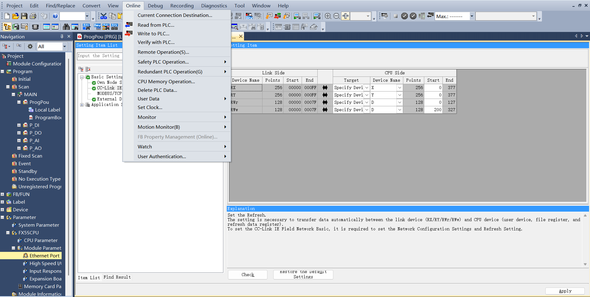

After opening the download interface, click "Parameter + Program" in the upper left, then click "Execute" in the lower right to download, and wait for the download to complete.
   
.. image:: custom_protocol_slave/029.png
   :width: 6in
   :align: center

Inovance EtherCAT
++++++++++++++++++++++++++++++++++++++++++++++

(1) Import XML File

Open Inovance programming software AutoShop, create a new PLC project, and select "EtherCATDevices" in the toolbox on the right:
   
.. image:: custom_protocol_slave/030.png
   :width: 6in
   :align: center

Left-click "EtherCATDevices", then right-click to pop up the "Import Device XML" dialog box. Left-click to confirm and find the folder containing the board XML file.

After successful import, the board name will appear under the "EtherCAT Devices" directory. Close the project and reopen it to complete the XML file import process.
   
.. image:: custom_protocol_slave/031.png
   :width: 6in
   :align: center

(2) Add EtherCAT Slave

Right toolbar → "EtherCAT Devices" → "Other Devices" → "JIYuan" → "Xone-PCIe-ECATs". Double-click "Xone-PCIe-ECATs" to add the EtherCAT slave. You can now see that the slave has been successfully added under the EtherCAT master in the left project tree.
   
.. image:: custom_protocol_slave/032.png
   :width: 6in
   :align: center
   
.. image:: custom_protocol_slave/033.png
   :width: 6in
   :align: center

(3) Add PDO
   
.. image:: custom_protocol_slave/034.png
   :width: 6in
   :align: center
   
.. image:: custom_protocol_slave/035.png
   :width: 6in
   :align: center

(4) EtherCAT Address Mapping

Double-click the variable table in the left toolbar to create a new input array of 256 bytes with soft element address D0. Create a new output array of 256 bytes with soft element address D200.
   
.. image:: custom_protocol_slave/036.png
   :width: 6in
   :align: center

Under "EtherCAT" in the left toolbar, double-click "Xone-PCIe-ECATs". In the pop-up dialog box, click "I/O Function Mapping", click the box to bind the variable address. In the pop-up dialog box, click "Variable Table", select the corresponding input/output, click "OK". Bind other addresses in order using the same procedure.
   
.. image:: custom_protocol_slave/037.png
   :width: 6in
   :align: center

(5) Program Download

Open the test program, change the PLC IP address to be on the same subnet as the board, and run the program after downloading.

Robot Slave Mode Related Operation Instructions
--------------------------------------------------------------------------------------

Load Slave Mode
~~~~~~~~~~~~~~~~~~~~~~~~~~~~~~~~~~~~~~~~~~

(1) Open WebApp, go to Initial Settings -> Peripherals -> Board Communication -> Manual Configuration.
   
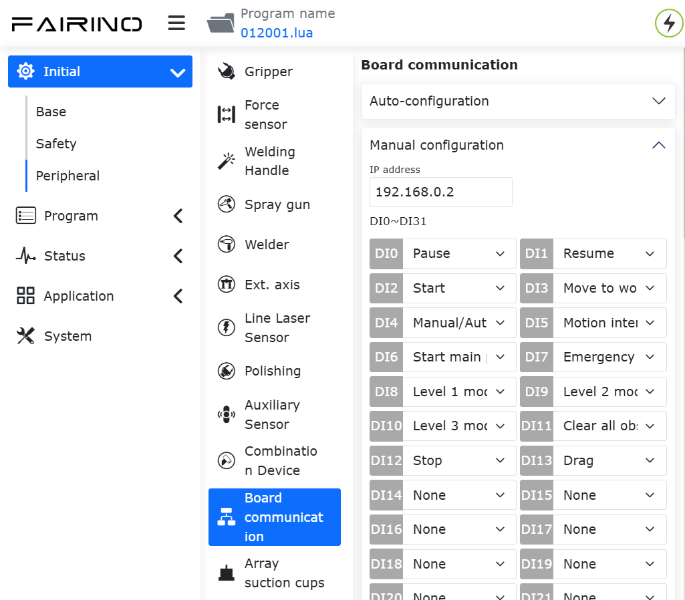

First, configure the board IP address. If left blank, the board will start with the default IP: 192.168.0.100. Currently, IP configuration is only applicable to EIP and CC-link protocols; for the PN protocol, the IP is assigned by the PLC master scanning the slave device.

.. note:: After changing the IP address on the page, you need to load the slave mode for it to take effect.
   
Next, select the required mapping functions for DI, DO, and AO (see appendix). The meaning of each parameter is as follows:

- DI is for robot control: The robot slave receives external signal input and executes the mapped function;
- DO is for robot status output: The robot slave feeds back status signals to the master;
- AO is for robot status feedback: The robot slave feeds back status data to the master. AO0~AO15 are signed integers (int16), and AO16~AO31 are single-precision floating-point numbers (float).

(2) Click the "Configure" button to generate the open protocol lua file.
   
.. image:: custom_protocol_slave/039.png
   :width: 6in
   :align: center

.. note:: The open protocol lua file supports downloading and can be imported on the automatic configuration interface.

An example of the generated program is as follows:

.. code-block:: console
   :linenos:

   local id = 3 
   local ctrlDI = {0, 0, 0, 0, 0, 0}
   local funcDI = {0, 0, 0, 0, 0, 0, 0, 0, 0, 0, 0, 0, 0, 0, 0, 0}
   local DOState = {0, 0, 0, 0, 0, 0, 0, 0}
   local AOState = {0, 0, 0, 0, 0, 0, 0, 0, 0, 0, 0, 0, 0, 0, 0, 0, 0, 0, 0, 0, 0, 0, 0, 0, 0, 0, 0, 0, 0, 0, 0, 0}
   -- Launch the board communication process
   SetFieldBusIP("192.168.0.99")
   LoadFieldBusSlave()
   sleep_ms(8000)
   while(1) do
      -- Set the DO status
      CtrlBoxDO, CtrlBoxCO, CtrlBoxDI, CtrlBoxCI, errState, motionState, moveToOriginState, robotStartDoneState, modeChangeState, programStartStopState, emergencyState, reduceState, collision, enablestate, safetyStop0, safetyStop1, pauseState, interfereState = GetRobotFuncDOState()
      DOState[1] = CtrlBoxDO
      DOState[2] = CtrlBoxCO
      DOState[3] = CtrlBoxDI
      DOState[4] = CtrlBoxCI
      local ctrlWord0 = 0
      ctrlWord0 = SetBitWithIndex(ctrlWord0, 0, errState)
      ctrlWord0 = SetBitWithIndex(ctrlWord0, 1, motionState)
      ctrlWord0 = SetBitWithIndex(ctrlWord0, 2, moveToOriginState)
      ctrlWord0 = SetBitWithIndex(ctrlWord0, 3, robotStartDoneState)
      ctrlWord0 = SetBitWithIndex(ctrlWord0, 4, modeChangeState)
      ctrlWord0 = SetBitWithIndex(ctrlWord0, 5, programStartStopState)
      ctrlWord0 = SetBitWithIndex(ctrlWord0, 6, emergencyState)
      ctrlWord0 = SetBitWithIndex(ctrlWord0, 7, reduceState)
      DOState[5] = ctrlWord0
      local ctrlWord1 = 0
      ctrlWord1 = SetBitWithIndex(ctrlWord1, 0, collision)
      ctrlWord1 = SetBitWithIndex(ctrlWord1, 1, enablestate)
      ctrlWord1 = SetBitWithIndex(ctrlWord1, 2, safetyStop0)
      ctrlWord1 = SetBitWithIndex(ctrlWord1, 3, safetyStop1)
      ctrlWord1 = SetBitWithIndex(ctrlWord1, 4, pauseState)
      ctrlWord1 = SetBitWithIndex(ctrlWord1, 5, interfereState)
      DOState[6] = ctrlWord1
      SetFieldBusDOState(DOState)

      -- Set the AO status
      mainErrCode, subErrCode, TCPSpeed, axisPos1, axisPos2, axisPos3, axisPos4, axisPos5, axisPos6, jointVelFeedback1, jointVelFeedback2, jointVelFeedback3, jointVelFeedback4, jointVelFeedback5, jointVelFeedback6, jointCurFeedback1, jointCurFeedback2, jointCurFeedback3,jointCurFeedback4,jointCurFeedback5,jointCurFeedback6, jointTorqueFeedback1, jointTorqueFeedback2,jointTorqueFeedback3,jointTorqueFeedback4, jointTorqueFeedback5, jointTorqueFeedback6, cartPosx, cartPosy, cartPosz, cartPosrx, cartPosry, cartPosrz = GetRobotFuncAOState()
      AOState[1] = mainErrCode
      AOState[2] = subErrCode
      AOState[17] = axisPos1
      AOState[18] = axisPos2
      AOState[19] = axisPos3
      AOState[20] = axisPos4
      AOState[21] = axisPos5
      AOState[22] = axisPos6
      AOState[23] = cartPosx
      AOState[24] = cartPosy
      AOState[25] = cartPosz
      AOState[26] = cartPosrx
      AOState[27] = cartPosry
      AOState[28] = cartPosrz
      SetFieldBusAOState(AOState)
      sleep_ms(10) 

      -- Set the DI status
      -- Configue the DI function and update it in real-time
      ctrlDI[1],ctrlDI[2],ctrlDI[3],ctrlDI[4],ctrlDI[5],ctrlDI[6] = GetFieldBusDIState()
      funcDI[1] = ctrlDI[1] 
      funcDI[2] = ctrlDI[2] 
      funcDI[3] = GetBitWithIndex(ctrlDI[3], 0)
      funcDI[4] = GetBitWithIndex(ctrlDI[3], 1)
      funcDI[5] = GetBitWithIndex(ctrlDI[3], 2)
      funcDI[6] = GetBitWithIndex(ctrlDI[3], 3)
      funcDI[7] = GetBitWithIndex(ctrlDI[3], 4)
      funcDI[8] = GetBitWithIndex(ctrlDI[3], 5)
      funcDI[9] = GetBitWithIndex(ctrlDI[3], 6)
      funcDI[10] = GetBitWithIndex(ctrlDI[3], 7)
      funcDI[11] = GetBitWithIndex(ctrlDI[4], 0)
      funcDI[12] = GetBitWithIndex(ctrlDI[4], 1)
      funcDI[13] = GetBitWithIndex(ctrlDI[4], 2)
      funcDI[14] = GetBitWithIndex(ctrlDI[4], 3)
      funcDI[15] = GetBitWithIndex(ctrlDI[4], 4)
      funcDI[16] = GetBitWithIndex(ctrlDI[4], 5)
      SetRobotFuncDIState(funcDI)
      local stopFlag = GetOpenLUAStopFlag(id)
      if(stopFlag ~= 0) then 
         UnloadFieldBusSlave()
         break
      end
      sleep_ms(10)
   end

(3) Click the "Load" button to load the robot slave mode.
   
.. image:: custom_protocol_slave/040.png
   :width: 6in
   :align: center

.. note:: After the robot slave mode is successfully loaded, it supports automatic startup when powered on. If you need to use the remote mode, please unload the slave mode first.

(4) Click the board status bar button on the right to monitor DI, DO, AI, and AO interaction information. The parameters are introduced as follows:

- CtrlDO: Control box DO/CO signal input value sent by the external master;
- DI: External master control signal input value;
- Aux_DI: Communication board extended DI;
- DO: Robot slave feedback signal output value;
- Aux_DO: Communication board extended DO;
- AI: External master input value;
- AI0~AI15: int16 type;
- AI16~AI31: float type;
- AO: Robot slave output value;
- AO0~AO15: int16 type;
- AO16~AO31: float type.

.. note:: For detailed information on DI, DO, AI, and AO parameters, please refer to "RD36-Robot Slave Mode Address Comparison Table-V1.0-20260605".
   
.. image:: custom_protocol_slave/041.png
   :width: 4in
   :align: center

(5) After loading is complete, you can generate board lua instructions through Teach Program -> Communication Instructions -> Board to set slave DO, AO, get slave DI, AI, and wait for slave DI, AI.
   
.. image:: custom_protocol_slave/042.png
   :width: 6in
   :align: center

Board Firmware Upgrade and Communication Cycle Configuration
--------------------------------------------------------------------------

FRJ-PCIeN-EIP/CC/PN-RJ-V10 Board
~~~~~~~~~~~~~~~~~~~~~~~~~~~~~~~~~~~~~~~~~~~~~~~~~~~~~~~~~~~~~~~~~~~~~~~~~~~~~~~~~~
When switching protocols, the board requires a firmware upgrade. Use the host computer to upgrade the FRJ-PCIeN-EIP/CC/PN-RJ-V10 board firmware. The steps are as follows:

(1) Open WinPcap_4_1_3.exe and install the network card driver package.

(2) Directly connect the PC (Win11 system) network port to the board network port. Open Device Assistant v1.1.0.exe, double-click "Ethernet", and click the "Refresh" button in the upper left corner to scan the currently connected board device.
   
.. image:: custom_protocol_slave/043.png
   :width: 6in
   :align: center
      
.. image:: custom_protocol_slave/044.png
   :width: 6in
   :align: center

(3) Double-click the scanned board device to enter the firmware update interface. Configure the PC and the obtained board IP to be on the same subnet. Click the "..." button on the right side of the "Firmware Update" menu bar to upload the firmware to be upgraded. Click the "Update" button, and a "Upgrade successful" message will appear in the text box in the lower left corner.
      
.. image:: custom_protocol_slave/045.png
   :width: 6in
   :align: center

(4) After a successful board upgrade, a reset operation will be performed. Wait for the board reset to complete (5s), enter the required communication cycle (supports 1~100ms), click the "Set" button, and after the "Cycle setting successful" message appears in the lower left corner, restart the control box.
      
.. image:: custom_protocol_slave/046.png
   :width: 6in
   :align: center

FRJ-PCIeN-EC/PN/EIP/CC-RJ-V20 Board
~~~~~~~~~~~~~~~~~~~~~~~~~~~~~~~~~~~~~~~~~~~~~~~~~~~~~~~~~~~~~~~~~~~~~~~~~~~~~~~~~~

When switching protocols, the board requires a firmware upgrade. Log in to the robot interface to upgrade the FRJ-PCIeN-EC/PN/EIP/CC-RJ-V20 board firmware. The steps are as follows:

(1) Enter the URL 192.168.58.2 to access the robot interface. Click the "Initial Settings" -> "Peripherals" -> "Board Communication" interface to obtain the FRJ-PCIeN-EC/PN/EIP/CC-RJ-V20 board firmware version number. Select the bin file to be upgraded, click "Upload", wait for the firmware upgrade to succeed, and then restart the control box.
      
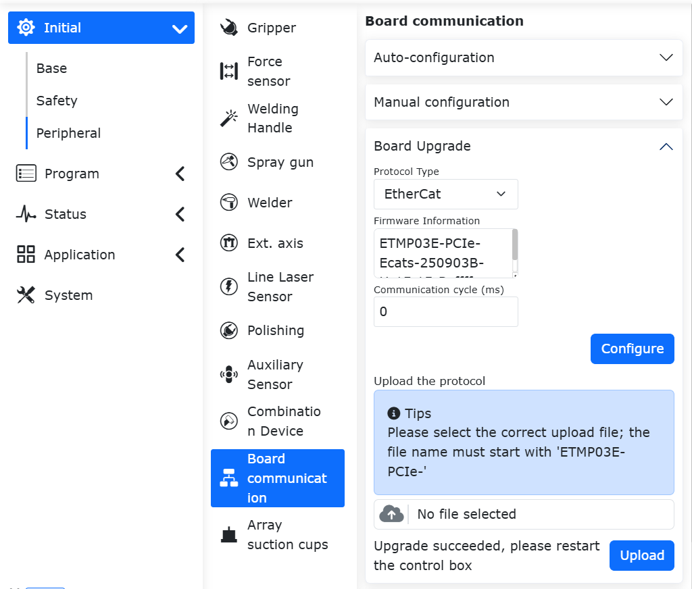

.. note:: To upgrade the firmware of the FRJ-PCIeN-EC/PN/EIP/CC-RJ-V20 board, you need to unload the running open protocol.

(2) Enter the URL 192.168.58.2 to access the robot interface. Click the "Initial Settings" -> "Peripherals" -> "Board Communication" interface to obtain the board communication cycle. Enter the required communication cycle (1~100ms), click the "Configure" button, wait for the configuration to succeed, and then restart the control box.
      
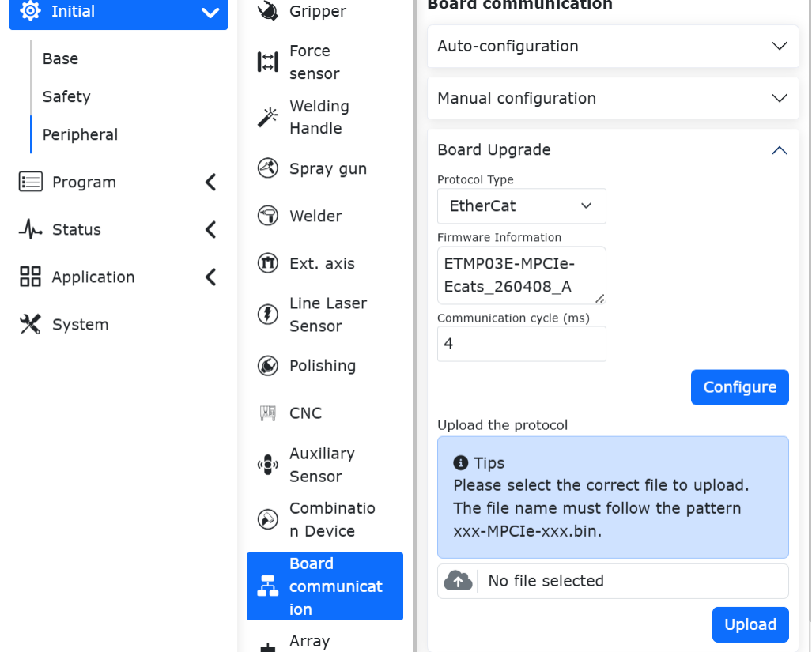

.. note:: To configure the communication cycle for the FRJ-PCIeN-EC/PN/EIP/CC-RJ-V20 board, you need to unload the running open protocol.
   
:download:`Board communication firmware and configuration files <../_static/_doc/Board communication firmware and configuration files.zip>`

:download:`Summary of PLC test programs for each protocol <../_static/_doc/Summary of PLC Test Programs for Each Protocol.zip>`   