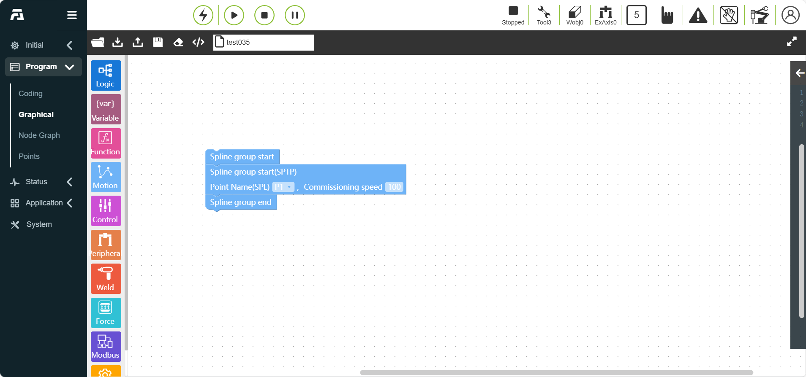
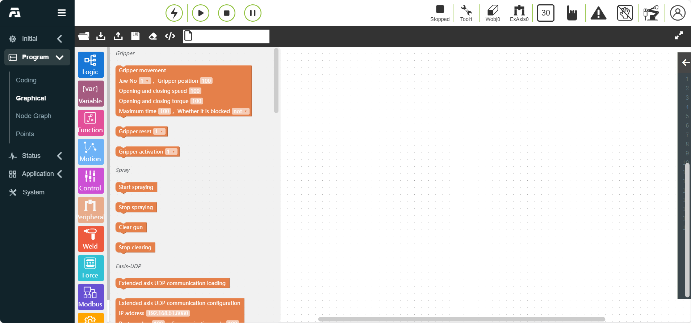
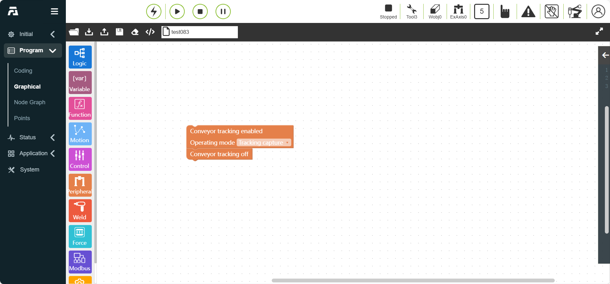
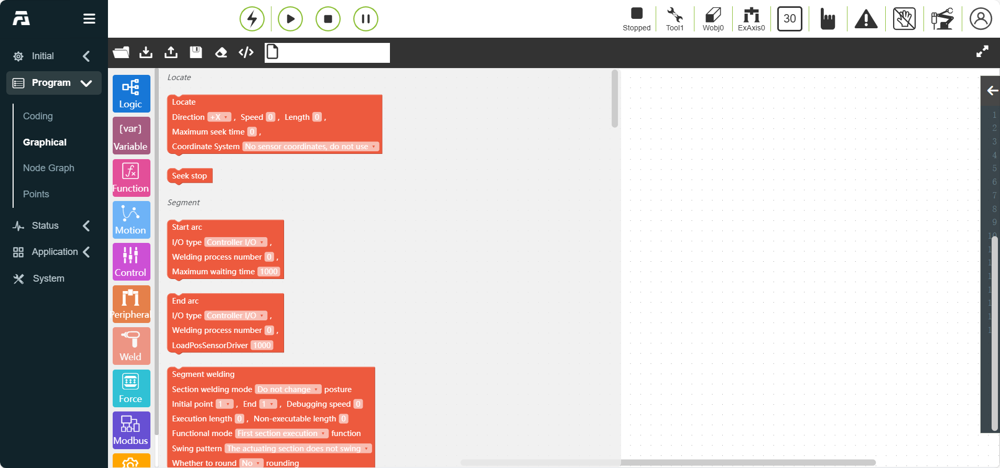
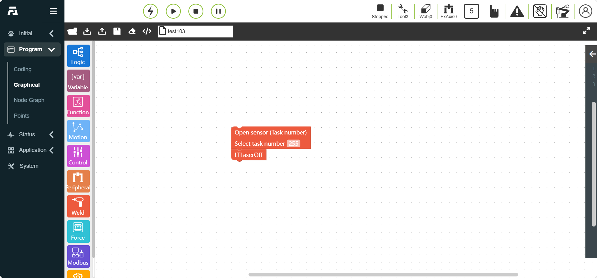
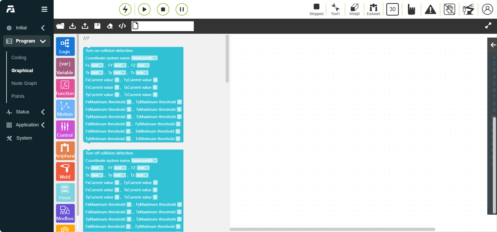
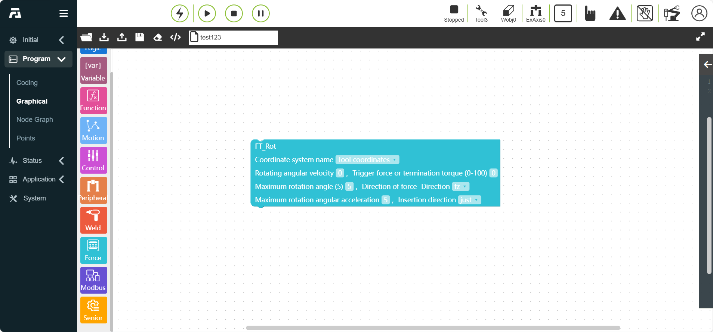
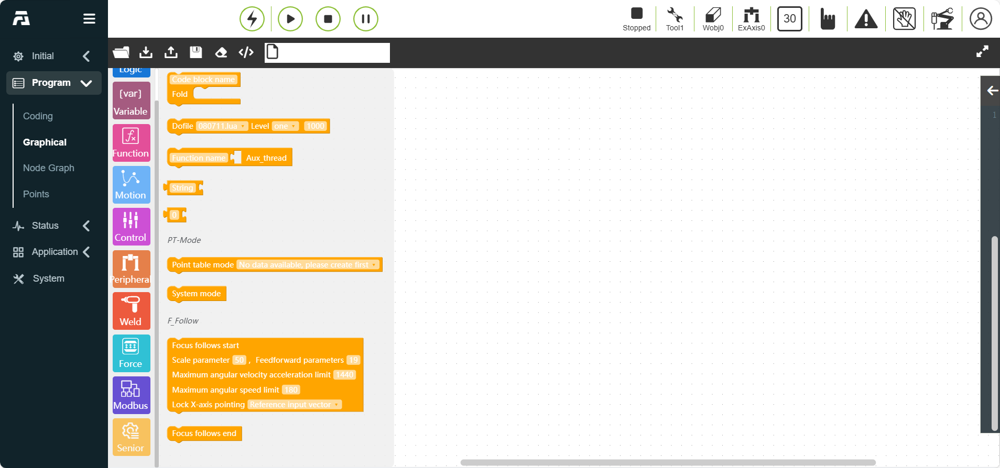

Graphical programming
=========================

.. toctree::
   :maxdepth: 6

Introduction
--------------------

Since the teaching pendant is generally not connected to external peripherals such as keyboard and mouse, when accessing the robot WebAPP on the teaching pendant side, users can edit the robot teaching program through the graphical programming function. Functional standardization functions are implemented using the Blockly library, which can be integrated into the WebAPP system, and custom code blocks can be implemented as needed. After dragging and dropping programming, it is converted into a LUA program and sent and run through the existing instruction protocol.

By using graphical programming, it can be simple and easy to understand, easy to operate, and Chinese language operation.

The page is divided into three areas: "operation bar", "toolbox toolbar" and "workspace code editing area". The overall layout design is as follows

.. centered:: Figure 10.1 Graphical programming interface

**Operation bar**

1) **Load**: responsible for reloading the workspace

2) **Import**: responsible for importing related graphical programming programs

3) **Export**: responsible for exporting the saved graphical programming programs in the workspace. The "Save" button function is to save the code block as the corresponding teaching program after editing is completed

4) **Save**: responsible for saving the edited graphical code block

5) **Clear**: responsible for quickly clearing the code editing area

6) **Code**: responsible for translating code blocks into Lua code

**Toolbox**

1) Code blocks containing all instructions and logic codes can be dragged to the workspace to create code blocks and edit them

2) The Toolbox toolbar section will be further classified according to the instruction type

3) Logic instructions: if-else, while, etc.

4) Basic motion instructions: PTP, LIN, ARC, etc. Instructions are classified according to application scenarios: gluing, welding, conveyor belts, etc. You can easily find the required code blocks during use.

**Workspace**: Graphical code blocks can be edited and displayed in the code editing area.

Logic Graphical Programming Commands
----------------------------------------
Logic Graphical Programming Commands include loops, numbers and other logic commands.

.. centered:: Figure 10.2 Logic Graphical Programming

If/Else Judgment Instruction
~~~~~~~~~~~~~~~~~~~~~~~~~~~~~~~~~~~
Drag the "If/Else Judgment Instruction" code block to enter the graphical editing interface workspace. (This instruction requires a certain programming foundation. If you need help, please contact us)

.. centered:: Figure 10.2-1 If/Else Judgment Instruction Code Block

While Instruction
~~~~~~~~~~~~~~~~~~~~~
Drag the "While Instruction" code block to enter the graphical editing interface workspace. (This instruction requires a certain programming foundation. If you need help, please contact us)

Add the input waiting condition after While, add the motion instruction code block inside while, and click Save. (For ease of operation, you can enter any do content and edit other instructions in the program to insert instead)

.. centered:: Chart 10.2-2 While instruction code block

Jump instruction
~~~~~~~~~~~~~~~~~~~~~
Drag the "Jump instruction" code block to enter the graphical editing interface workspace. (This instruction requires a certain programming foundation. If you need help, please contact us)

- Jump name: Enter the jump name to determine the jump position

.. centered:: Figure 10.2-3 Jump instruction code block

.. important:: Jump name cannot start with a number

Variable class graphical programming command
----------------------------------------------------------
Variable class graphical programming commands include create variable commands.

.. centered:: Figure 10.3 Variable class graphical programming

Variable instruction
~~~~~~~~~~~~~~~~~~~~~
Click the "Create" button to enter the variable name to be defined.

Drag the "Variable instruction" code block to enter the graphical editing interface workspace.

"Variable" instruction node, parameters:

.. centered:: Figure 10.3-1 Variable instruction code block

Function class graphical programming command
--------------------------------------------------------
Function class graphical programming command includes create function command.

.. centered:: Figure 10.4 Function class graphical programming

Function method instruction
~~~~~~~~~~~~~~~~~~~~~~~~~~~~~~~~~
Drag the "Function method instruction" code block to enter the graphical editing interface workspace.

"Function method" instruction node, parameters:

- Function name: the name of the function to be run

.. centered:: Figure 10.4-1 Function method instruction code block

Motion graphic programming commands
----------------------------------------
Motion graphic programming commands include PTP, Lin, ARC and other motion commands.

.. image:: graphical/006.png
   :width: 6in
   :align: center

.. centered:: Figure 10.5 Motion graphic programming

Point-to-point instruction
~~~~~~~~~~~~~~~~~~~~~~~~~~~~~~~~~~~~~
Drag the "point-to-point instruction" code block to enter the graphical editing interface workspace.

You can select the point you want to reach. The smooth transition time setting can make the movement from this point to the next point continuous. For the offset setting, you can choose to offset based on the base coordinate system and offset based on the tool coordinate system, and pop up the x, y, z, rx, ry, rz offset settings. The specific PTP path is the optimal path automatically planned by the motion controller.

"Point to point" instruction node, parameters:

- Point name: teaching point

- Debug speed (%): 0 ~ 100

- Stop: false/true

- Smooth transition (ms): Smooth transition time 0 ~ 500

- Whether to offset No/base coordinate offset/tool ​​coordinate offset When No is selected, the dx~drz parameter values ​​are not effective

- dx~drz: offset

.. centered:: Chart 10.5-1 Point-to-point instruction code block

Straight line instruction
~~~~~~~~~~~~~~~~~~~~~~~~~~~~~~~~~
Drag the "Straight line instruction" code block to enter the graphical editing interface workspace.

This instruction function is similar to the "point to point" instruction, but the path to the point reached by this instruction is a straight line

"Straight line" instruction node, parameters:

- Point name: teaching point

- Debug speed (%): 0 ~ 100

- Stop: false/true, when true is selected, the smooth transition parameter value is not effective

- Smooth transition (mm): smooth transition radius 0 ~ 1000

- Whether to seek: false/true

- Seek point variable: REF0~99/RES0~99, when false is selected for whether to seek, the parameter is not effective;

- Whether to offset: No

- Joint overspeed protection: No/Yes

- Processing strategy: Standard/Stop with error when overspeeding/Adaptive deceleration

- Allowed deceleration threshold: 0~100

.. centered:: Chart 10.5-2 Straight line instruction code block

Straight line (adjustable angular velocity at transition point) instruction
~~~~~~~~~~~~~~~~~~~~~~~~~~~~~~~~~~~~~~~~~~~~~~~~~~~~~~~~~~~~~~~~~~~~~~~~~~~~~~~~~~~~~~~~
Drag the "Straight line (adjustable angular velocity at transition point) instruction" code block to enter the graphical editing interface workspace.

The function of this instruction is similar to the "point to point" instruction, but this instruction includes adjustable angular velocity at transition point.

"Straight line (adjustable angular velocity at transition point)" command node, parameters:

- Point name: Teaching point

- Debug speed (%): 0 ~ 100

- Stop: false/true, when true is selected, the smooth transition parameter value is not effective

- Smooth transition (mm): Smooth transition radius 0 ~ 1000

- Whether to seek: false/true

- Seek point variable: REF0~99/RES0~99, when false is selected for whether to seek, the parameter is not effective;

- Whether to offset: No

- Adjustable angular velocity at transition point: No/Yes

- Maximum angular velocity: 0~300

.. centered:: Chart 10.5-3 Straight line (adjustable angular velocity at transition point) command code block

Straight line (seamPos) command
~~~~~~~~~~~~~~~~~~~~~~~~~~~~~~~~
Drag the "Straight line (seamPos) command" code block to enter the graphical editing interface workspace.

This command function is used to use laser sensors in welding scenarios.

"Straight line (seamPos)" command node, parameters:

- Point name: teaching point

- Debug speed (%): 0 ~ 100

- Stop: false/true, when true is selected, the smooth transition parameter value is not effective

- Smooth transition (mm): smooth transition radius 0 ~ 1000

- Weld cache data selection: execution planning data/execution record data;

- Plate type: corrugated plate/corrugated plate/fence plate/oil drum/corrugated shell steel;

- Whether to offset: No/base coordinate offset/tool ​​coordinate offset/laser raw data offset When no is selected, the dx~drz parameter value is not effective

- dx~drz: offset

.. centered:: Chart 10.5-4 Straight line (seamPos) command code block

Arc command
~~~~~~~~~~~~~~~~~~~~
Drag the "Arc command" code block to enter the graphical editing interface workspace.

Arc motion contains two points, the first point is the transition point in the middle of the arc, and the second point is the end point. Both the transition point and the end point can be set to offset or not. You can choose to offset based on the base coordinate system and offset based on the tool coordinate system, set the x, y, z, rx, ry, rz offset, and the end point can set the smooth transition radius to achieve a continuous motion effect

"Arc" instruction node, parameters:

- Arc middle point: teaching point

- Whether to offset: No/base coordinate offset/tool ​​coordinate offset When no is selected, the dx~drz parameter value is not effective

- dx~drz: offset

- Arc end point: teaching point

- Whether to offset: No/base coordinate offset/tool ​​coordinate offset When no is selected, the dx~drz parameter value is not effective

- dx~drz: offset

- Debug speed (%): 0 ~ 100

- Stop: false/true, when true is selected, the smooth transition parameter value is not effective

- Smooth transition (mm): smooth transition radius 0 ~ 1000

.. centered:: Figure 10.5-5 Arc instruction code block

Full circle command
~~~~~~~~~~~~~~~~~~~~~
Drag the "full circle command" code block to enter the graphical editing interface workspace.

Click the "full circle" command node to enter the node diagram editing interface

- Full circle motion includes two points, the first point is the full circle middle transition point 1, the second point is the full circle middle transition point 2, transition point 2 can be set whether to offset, the offset is effective for both transition point 1 and transition point 2

- "Full circle" command node, parameters:

- Full circle middle point 1: teaching point

- Full circle middle point 2: teaching point

- Debug speed (%): 0 ~ 100

- Whether to offset: No/base coordinate offset/tool ​​coordinate offset When No is selected, the dx~drz parameter value is not effective

- dx~drz: offset

.. centered:: Chart 10.5-6 Full circle instruction code block

Spiral instruction
~~~~~~~~~~~~~~~~~~~~~
Drag the "Spiral instruction" code block to enter the graphical editing interface workspace.

The spiral motion includes three points, which form a circle. In the third point setting page, there are several parameter settings, including the number of spiral turns, attitude correction angle, radius increment and axis direction increment. The number of spiral turns is the number of spiral motion turns. The attitude correction angle corrects the attitude at the end of the spiral and the attitude of the first point of the spiral. The radius increment is the increment of each circle radius, and the axis direction increment is the increment of the spiral axis direction. Set whether to offset. The offset is effective for the entire spiral trajectory.

"Spiral" command node, parameters:

- Spiral middle point 1: teaching point

- Spiral middle point 2: teaching point

- Spiral middle point 3: teaching point

- Debug speed (%): 0 ~ 100

- Offset: No/base coordinate offset/tool ​​coordinate offset When No is selected, the dx~drz parameter values ​​are not effective

- dx~drz: offset

- Spiral turns: 0 ~ 100

- Posture angle correction rx (°): -1000 ~ 1000

- Posture angle correction ry (°): -1000 ~ 1000

- Posture angle correction rz (°): -1000 ~ 1000

- Radius increment (mm): -100 ~ 100

- Rotation axis direction increment (mm): -100 ~ 100

.. centered:: Figure 10.5-7 Spiral instruction code block

New spiral instruction
~~~~~~~~~~~~~~~~~~~~~~~~~~~~~~~~
Drag the "New Spiral Instruction" code block to enter the graphical editing interface workspace.

Click the "New Spiral" instruction node to enter the node graph editing interface

The new spiral motion is an optimized version of the spiral motion. This instruction only requires one point plus the configuration of various parameters to realize the spiral motion. The robot takes the current position as the starting point. The user sets the debugging speed, whether to offset, the number of spiral turns, spiral inclination, initial radius, radius increment, axis direction increment and rotation direction. The number of spiral turns refers to the number of spiral turns of the spiral line. The spiral inclination refers to the angle between the tool Z axis and the horizontal direction. The posture correction angle corrects the posture at the end of the spiral line and the posture of the first point of the spiral line. The initial radius refers to the radius of the first circle. The radius increment refers to the increment of each circle radius. The axis direction increment refers to the increment of the spiral axis direction. The rotation direction is clockwise and counterclockwise.

"New spiral" command node, parameters:

- Spiral start point: teaching point

- Debug speed (%): 0 ~ 100

- Offset: No/base coordinate offset/tool ​​coordinate offset When No is selected, the dx~drz parameter values ​​are not effective

- dx~drz: offset

- Spiral turns: 0 ~ 100

- Spiral inclination (°): -100 ~ 100

- Initial radius: 0 ~ 100

- Radius increment (mm): -100 ~ 100

- Rotation axis direction increment (mm): -100 ~ 100

- Rotation direction: clockwise/counterclockwise

.. centered:: Chart 10.5-8 New spiral instruction code block

Horizontal spiral instruction
~~~~~~~~~~~~~~~~~~~~~~~~~~~~~~~~
Drag the "Horizontal spiral instruction" code block to enter the graphical editing interface workspace.

The "H-Spiral" instruction is a horizontal space spiral motion. This instruction is set after the single-segment motion (straight line) instruction.

"Horizontal spiral" instruction node, parameters:

- Spiral radius: 0~100mm

- Spiral angular velocity: 0~2rev/s

- Rotation direction: spiral clockwise/counterclockwise

- Spiral inclination: 0~40°

.. centered:: Figure 10.5-9 Horizontal spiral instruction code block

Spline instruction
~~~~~~~~~~~~~~~~~~~~~
Drag the "Spline instruction" code block to enter the graphical editing interface workspace.

This instruction is divided into three parts: spline group start, spline segment and spline group end. The spline group start is the start mark of the spline motion. The spline segment currently only contains the SPL segment in the node diagram. The spline group end is the end mark of the spline motion.

"Spline-SPTP" instruction node, parameters:

- Point name: teaching point

- Debug speed (%): 0 ~ 100

.. centered:: Figure 10.5-10 Spline instruction code block

New spline instruction
~~~~~~~~~~~~~~~~~~~~~~~~~~~~~
Drag the "New spline instruction" code block to enter the graphical editing interface workspace.

This instruction is a spline instruction algorithm optimization instruction, which will replace the existing spline instruction in the future. This instruction is divided into three parts: multi-point trajectory start, multi-point trajectory segment and multi-point trajectory end. Multi-point trajectory start is the starting mark of multi-point trajectory movement. Multi-point trajectory segment is to set each trajectory point. Click the icon to enter the point adding interface. Multi-point trajectory end is the end mark of multi-point trajectory movement. Here you can set the control mode and debugging speed. The control mode is divided into given control point and given path point.

"New Spline" instruction node, parameters:

- Control mode: teach point

- Global average connection time: integer type, greater than 10, default value is 2000ms

"New Spline-SPL" instruction node, parameters:

- Point name: teach point

- Debug speed (%): 0 ~ 100

- Smooth transition radius: 0 ~ 1000

- Is it the last point: No/Yes

.. centered:: Chart 10.5-11 New Spline Instruction Code Block

Swing Instruction
~~~~~~~~~~~~~~~~~~~~~
Drag the "Swing Instruction" code block to enter the graphical editing interface workspace.

This instruction consists of two parts. The first part selects the welding number with configured parameters. The program connecting the Body represents the connection node and is executed between "Start welding" and "Stop welding".

"Swing" instruction node, parameters:

- Number: 0~7

.. centered:: Figure 10.5-12 Swing instruction code block

Point offset instruction
~~~~~~~~~~~~~~~~~~~~~~~~~~~~~~~
Drag the "point offset instruction" code block to enter the graphical editing interface workspace.

This instruction is an overall offset instruction. Enter each offset. The program connecting the Body represents the connection node and is executed between the start and the end. The intermediate motion instructions will be offset based on the base coordinates (or workpiece coordinates).

"Point offset" command node, parameters:

- ∆x: offset, -300~300

- ∆y: offset, -300~300

- ∆z: offset, -300~300

- ∆rx: offset, -300~300

- ∆ry: offset, -300~300

- ∆rz: offset, -300~300

.. image:: graphical/038.png
   :width: 6in
   :align: center

.. centered:: Figure 10.5-13 Point offset command code block

Servo command
~~~~~~~~~~~~~~~~~~~~~
Drag the "Servo command" code block to enter the graphical editing interface workspace.

Servo control (Cartesian space motion) instructions, which can control the robot motion through absolute posture control or based on the current posture offset.

"Servo" command node, parameters:

- Movement mode: absolute position/base coordinate offset/tool ​​coordinate offset

- x: offset, -300~300

- y: offset, -300~300

- z: offset, -300~300

- rx: offset, -300~300

- ry: offset, -300~300

- rz: offset, -300~300

- Proportional coefficient x: 0~1

- Proportional coefficient y: 0~1

- Proportional coefficient z: 0~1

- Proportional coefficient rx: 0~1

- Proportional coefficient ry: 0~1

- Proportional coefficient rz: 0~1

- Acceleration (%): 0~100

- Speed ​​(%): 0~100

- Command cycle (s): 0.001~0.016

- Filter time (s): 0~1

- Scale up: 0~100

.. centered:: Chart 10.5-14 Servo command code block

Trajectory command
~~~~~~~~~~~~~~~~~~~~~
Drag the "Trajectory command" code block to enter the graphical editing interface workspace.

In this command, the user first needs to have a recorded trajectory.

"Trajectory" command node, parameters:

- Select trajectory file: recorded trajectory

- Debug speed (%): 0 ~ 100, default value is 25

.. centered:: Chart 10.5-15 Trajectory command code block

TrajectoryJ command
~~~~~~~~~~~~~~~~~~~~~
Drag the "TrajectoryJ command" code block to enter the graphical editing interface workspace.

In this command, the user first needs to have a recorded trajectory, and the trajectory file can be pre-imported in the teaching program interface. The trajectory command and trajectoryJ command are suitable for the general interface of the camera directly giving the trajectory. When there is a discrete trajectory point file in a fixed format, it can be imported into the system to make the robot move according to the trajectory of the imported file.

"Track J" command node, parameters:

- Select track file: recorded track

- Debug speed (%): 0 ~ 100, default value is 25

- Track mode: path point/control point

.. centered:: Chart 10.5-16 Track J command code block

Track reproduction command
~~~~~~~~~~~~~~~~~~~~~~~~~~~~~~~~~
Drag the "Track reproduction command" code block to enter the graphical editing interface workspace.

In this command, the user first needs to have a recorded track.

When programming, first use the point-to-point command to reach the corresponding track starting point, then select the track in the track reproduction command, select the smooth track, and set the debugging speed. The track loading command is mainly used to pre-read the track file and extract it into a track command for better application in conveyor belt tracking scenarios.

"Trajectory Reproduction" command node, parameters:

- Trajectory name: recorded trajectory

- Smooth trajectory: No/Yes

- Debug speed (%): 0 ~ 100, default value is 25

.. centered:: Chart 10.5-17 Trajectory Reproduction Command Code Block

DMP Command
~~~~~~~~~~~~~~~~~~~~~
Drag the "DMP Command" code block to enter the graphical editing interface workspace.

DMP is a method of trajectory imitation learning, which requires planning the reference trajectory in advance. In the command editing interface, select the teaching point as the new starting point, click "Add" and "Apply" to save the command. The specific path of DMP is a new trajectory that imitates the reference trajectory with a new starting point.

"DMP" command node, parameters:

- Point name: teaching point

- Debug speed (%): 0 ~ 100, default value is 100

.. centered:: Chart 10.5-18 DMP command code block

Tool conversion instruction
~~~~~~~~~~~~~~~~~~~~~~~~~~~~~~~
Drag the "Tool conversion instruction" code block to enter the graphical editing interface workspace.

Select the tool coordinate system to be automatically converted, click "Add" and "Apply" to save the instruction. When adding PTP and LIN instructions, connecting them with Body can be executed inside the instruction, and the points in the tool coordinate system are automatically converted.

"Tool conversion" instruction node, parameters:

- Tool coordinate system: Tool coordinate system table

.. centered:: Figure 10.5-19 Tool conversion instruction code block

Workpiece conversion instruction
~~~~~~~~~~~~~~~~~~~~~~~~~~~~~~~~~~~~~~~~~~~
Drag the "Workpiece conversion instruction" code block to enter the graphical editing interface workspace.

Select the workpiece coordinate system to be automatically converted, click "Add" and "Apply" to save the instruction. When adding PTP and LIN instructions, connect them to Body to realize the execution inside the instruction, and the points in the workpiece coordinate system are automatically converted.

"Workpiece conversion" instruction node, parameters:

- Workpiece coordinate system: Workpiece coordinate system table

.. image:: graphical/045.png
   :width: 6in
   :align: center

.. centered:: Chart 10.5-20 Workpiece conversion instruction code block

Control class graphical programming commands
---------------------------------------------
Control class graphical programming commands include Wait, IO and other control commands.

.. image:: graphical/007.png
   :width: 6in
   :align: center

.. centered:: Figure 10.6 Control Class Graphical Programming Commands

Wait Command
~~~~~~~~~~~~~~~~~~~~~
Drag the "Wait Command" code block to enter the graphical editing interface workspace.

This command is a delay command, which is divided into four parts: "WaitMs", "WaitDI", "WaitMultiDI" and "WaitAI".

1. "Wait" command node, parameters:

- Wait time (ms): The delay waiting time unit is milliseconds, enter the number of milliseconds to wait

.. centered:: Figure 10.6-1 Wait command code block

2. "Wait DI" command node, parameters:

- DI port number: Ctrl-DI0 ~ Ctrl-CI7(WaitDI,[0~15]), End-DI0 ~ End-DI1(WaitToolDI,[0~1])

- Status: false/true

- Maximum time (ms): 0 ~ 10000

- Wait timeout processing: stop error/continue execution/keep waiting

.. centered:: Figure 10.6-2 Wait for DI instruction code block

3. "Wait for multiple DI" instruction node, parameters:

- Condition: and/or

- Condition selection: select the port number of the bit state to be turned on, separated by commas, such as DI0, DI1

- True value corresponding port: select the port number of the true value, separated by commas, such as DI0, DI1

- Maximum time (ms): 0 ~ 10000, maximum waiting time

- Waiting timeout processing: stop error/continue execution/wait forever

.. centered:: Figure 10.6-3 Wait for multiple DI instruction code block

4. "Wait for AI" instruction node, parameters:

- Condition: and/or

- AI port number: Ctrl-AI0 ~ Ctrl-AI1(WaitAI,[0~1]), End-AI0(WaitToolAI,[0])

- Condition: greater than/less than

- Value (%): 1 ~ 100

- Maximum time (ms): 0 ~ 10000

- Waiting timeout processing: stop reporting errors/continue execution/keep waiting. When waiting for timeout processing, the maximum time defaults to 0

.. centered:: Figure 10.6-4 Waiting for AI command code block

Mode switching command
~~~~~~~~~~~~~~~~~~~~~~~~~~~~~~
Drag the "mode switching command" code block to enter the graphical editing interface workspace.

This command can switch the robot to manual mode. It is usually added at the end of a program so that the user can automatically switch the robot to manual mode and drag the robot after the program ends.

"Mode switch" instruction node, parameters:

- Mode switch: manual mode

.. centered:: Figure 10.6-5 Mode switch instruction code block

Pause instruction
~~~~~~~~~~~~~~~~~~~~~
Drag the "Pause instruction" code block to enter the graphical editing interface workspace.

This instruction is a pause instruction. Insert this instruction in the program. When the program executes this instruction, the robot will be in a paused state. If you want to continue running, click the "Pause/Resume" button in the control area.

"Pause" command node, parameters:

- Pause type: no function, cylinder not in place, etc.

.. image:: graphical/051.png
   :width: 6in
   :align: center

.. centered:: Figure 10.6-6 Pause command code block

Coordinate system command
~~~~~~~~~~~~~~~~~~~~~~~~~~~~~
Drag the "Set tool coordinate system"/"Set workpiece coordinate system" code block to enter the graphical editing interface workspace.

1. "Set tool coordinate system" command node, parameters:

- Tool coordinate system name: toolcoord1 ~ toolcoord14(SetToolList,[0~14]), etoolcoord0 ~ etoolcoord14(SetExToolList, [0~14])

.. centered:: Figure 10.6-7 Set tool coordinate system command code block

2. "Set workpiece coordinate system" command node, parameters:

- Workpiece coordinate system name: wobjcoord1 ~ wobjcoord14

.. centered:: Figure 10.6-8 Set workpiece coordinate system instruction code block

Simulation AI instruction
~~~~~~~~~~~~~~~~~~~~~~~~~~~~
Drag the "Set AO"/"Get AI" code block to enter the graphical editing interface workspace.

In this instruction, there are two functions: setting analog output (SetAO/SPLCSetAO) and getting analog input (GetAI/SPLCGetAI).

1. "Set AO" instruction node, parameters:

- Port: Ctrl-AO0 ~ Ctrl-AO1 (blocking: SetAO, non-blocking: SPLCSetAO, [0~1]), End-AO0 (blocking: SetToolAO, non-blocking: SPLCSetToolAO, [0])

- Value (%): 0 ~ 100

- Whether to block: blocking/non-blocking

- Whether to apply thread: no/yes

.. centered:: Figure 10.6-9 Set AO instruction code block

2. "Get AI" instruction node, parameters:

- Port: Ctrl-AI0 ~ Ctrl-DI1 (blocking: GetAI, non-blocking: SPLCGetAI, [0~1]), End-AI0 (blocking: GetToolAI, non-blocking: SPLCGetToolAI, [0])

- Condition: greater than/less than

- Value (%): 0 ~ 100

- Maximum time (ms): 0 ~ 10000

- Blocking: Blocking/Non-blocking

- Apply thread: No/Yes

.. centered:: Figure 10.6-10 Get AI instruction code block

Digital IO Instructions
~~~~~~~~~~~~~~~~~~~~~~~~~~~~~~~~
Drag the "Set DO"/"Get DI" code block to enter the graphical editing interface workspace.

The instructions are IO instructions, which are divided into two parts: Set IO (SetDO/SPLCSetDO) and Get IO (GetDI/SPLCGetDI).

1. "Set DO" instruction node, parameters:

- Port: Ctrl-DO0 ~ Ctrl-CO7 (blocking: SetDO, non-blocking: SPLCSetDO, [0~15]), End-DO0 ~ End-DO1 (blocking: SetToolDO, non-blocking: SPLCSetToolDO, [0~1])

- Status: false/true

- Blocking: blocking/non-blocking

- Smooth trajectory: Break/Serious

- Apply thread: No/Yes

.. centered:: Figure 10.6-11 Set DO instruction code block

2. "Get DI" instruction node, parameters:

- Port: Ctrl-DI0 ~ Ctrl-CI7 (blocking: GetDI, non-blocking: SPLCGetDI, [0~15]), End-DI0 ~ End-DI1(Blocking: GetToolDI, Non-blocking: SPLCGetToolDI, [0~1])

- Blocking: Blocking/Non-blocking

- Status: false/true

- Maximum waiting time (ms): 0 ~ 10000

- Apply thread: No/Yes

.. centered:: Chart 10.6-12 Get DI instruction code block

Motion DO instruction
~~~~~~~~~~~~~~~~~~~~~~
Drag the "Motion DO instruction" code block to enter the graphical editing interface work area.

This instruction implements the function of continuously outputting DO signals according to the set interval during linear motion.

1. "Motion DO continuous output" instruction node, parameters:

- Port: Ctrl-DO0 ~ Ctrl-DO0(MoveDOStart,[0~15]), End-DO1(MoveDOStart,[0~1])

- Setting interval (mm): 0 ~ 500

- Output pulse duty cycle (%): 0 ~ 99

2. "Motion DO single output" instruction node, parameters:

- Port: Ctrl-DO0 ~ Ctrl-DO0(MoveDOOnceStart,[0~15]), End-DO1(MoveDOOnceStart,[0~1])

- Output mode: uniform speed output/free configuration

- Set time (ms): 0 ~ 1000 (the uniform speed output mode defaults to -1)

- Reset time (ms): 0 ~ 1000 (the uniform speed output mode defaults to -1)

.. centered:: Figure 10.6-13 "Motion DO single/continuous output" instruction code block

Motion AO instruction
~~~~~~~~~~~~~~~~~~~~~
Drag the "Motion AO instruction" code block to enter the graphical editing interface workspace.

When this instruction is used with the motion instruction, it can output the AO signal in proportion to the real-time TCP speed during the motion process.

"Move AO" command node, parameters:

- Control box AO number: Ctrl-AO0 ~ Ctrl-AO1 (MoveAOStart, [0~1]), End-AO0 (MoveToolAOStart, 0)

- Maximum TCP speed: 0 ~ 100

- Maximum TCP speed AO percentage: 0 ~ 100

- Dead zone compensation value AO percentage: 0 ~ 100

.. centered:: Figure 10.6-14 "Move AO" command code block

Collision level command
~~~~~~~~~~~~~~~~~~~~~~~~~~~~~~~
Drag the "Collision level command" code block to enter the graphical editing interface workspace.

This command sets the collision level. Through this command, the collision level of each axis can be adjusted in real time during program operation, and the application scenario can be deployed more flexibly.

"Collision level" command node, parameters:

- Standard level: standard level/custom percentage

- joint1-joint6(N): 0 ~ 100, collision threshold, array type

.. centered:: Figure 10.6-15 Collision level command code block

Acceleration command
~~~~~~~~~~~~~~~~~~~~~
Drag the "acceleration command" code block to enter the graphical editing interface workspace.

The "acceleration" command is to realize the function of setting the robot acceleration separately. By adjusting the motion command acceleration scaling factor, the acceleration and deceleration time can be increased or decreased, and the robot action beat time can be adjusted.

"Acceleration" command node, parameters:

- Acceleration percentage (%): 0 ~ 100

.. centered:: Figure 10.6-16 Acceleration command code block

Peripheral graphical programming commands
------------------------------------------------------
Peripheral graphical programming commands include peripheral commands such as grippers, spray guns, and extended axes.

.. centered:: Figure 10.7 Peripheral graphical programming commands

Gripper commands
~~~~~~~~~~~~~~~~~~~~~
Drag the "gripper movement", "gripper activation" and "gripper reset" code blocks to enter the graphical editing interface workspace.

In the command, the number of the configured and activated gripper is displayed, the settings of the gripper opening and closing, opening and closing speed, and opening and closing torque are displayed in percentages, and the blocking function option is displayed. If blocking is selected, the gripper movement needs to wait for the previous motion instruction to be executed before execution. If non-blocking is selected, the gripper movement is parallel to the previous motion instruction.

1. "Gripper Movement" node, parameters:

- Gripper number: the number of the activated gripper

- Gripper position: 0~100

- Opening and closing speed: 0~100

- Opening and closing torque: 0~100

- Maximum time (ms): 0~30000

- Blocking: false/true

.. centered:: Figure 10.7-1 Gripper Movement Instruction Code Block

Gripper reset instruction, display the configured gripper number, and you can add the gripper reset instruction to the program.

2. "Gripper reset" node, parameters:

- Gripper number: the number of the activated gripper

.. centered:: Figure 10.7-2 Gripper reset instruction code block

Gripper activation instruction, display the configured gripper number, you can add the gripper activation instruction to the program.

3. "Gripper activation" node, parameters:

- Gripper number: the number of the activated gripper

.. centered:: Figure 10.7-3 Gripper activation instruction code block

Spray gun instruction
~~~~~~~~~~~~~~~~~~~~~~
Drag the "Spray gun instruction" code block to enter the graphical editing interface workspace.

This command is related to spraying, controlling the spray gun to "start spraying", "stop spraying", "start cleaning gun" and "stop cleaning gun". When editing the relevant nodes of this program, you need to confirm that the spray gun peripherals have been configured, otherwise it cannot be saved. See the robot peripherals section for details.

.. centered:: Figure 10.7-4 Start spraying instruction code block

.. centered:: Figure 10.7-5 Stop spraying instruction code block

.. centered:: Figure 10.7-6 Start gun cleaning instruction code block

.. centered:: Figure 10.7-7 Stop gun cleaning instruction code block

Extended axis instruction (controller-PLC)
~~~~~~~~~~~~~~~~~~~~~~~~~~~~~~~~~~~~~~~~~~~~~~~~~~~~
Drag the "Extended axis instruction" code block to enter the graphical editing interface workspace.

This instruction is used in combination with the PTP instruction for scenarios using external axes. It can decompose the movement of a point in the X-axis direction in space into external axis movement. Select the external axis number, select synchronous movement mode, and select the point to be reached.

It is divided into UDP communication loading/configuration, asynchronous movement, synchronous PTP/LIN movement, synchronous ARC movement, return to zero instruction and enable instruction.

"UDP communication configuration" command node, enter the IP address, port number and communication cycle;

.. centered:: Figure 10.7-8 UDP communication configuration command code block

"Asynchronous motion" command node, parameters:

- Point name: teaching point

- Debug speed (%): 0~100

.. centered:: Figure 10.7-9 Asynchronous motion command code block

"Synchronous PTP/LIN motion" command node, parameters:

- Motion selection: PTP/LIN

- Point name: teaching point

- Debug speed (%): 0~100

.. centered:: Figure 10.7-10 "Synchronous PTP/LIN motion" instruction code block

"Synchronous ARC motion" instruction node, default motion mode is ARC, parameters:

Point name: teaching point

Debug speed (%): 0~100

.. centered:: Chart 10.7-11 "Synchronous ARC motion" instruction code block

"Extended axis return to zero" instruction node,, parameters:

- Extended axis number: 1~4

- Return to zero mode: current position return to zero/negative limit return to zero/positive limit return to zero

- Home speed: 0~2000, default position 5

- Zero point clamp speed: 0~2000, default is 1

.. centered:: Chart 10.7-12 Extended axis return to zero instruction code block

"Extended axis enable" instruction node,, parameters:

- Extended axis number: 1~4

.. centered:: Figure 10.7-13 Extended axis enable instruction code block

Extended axis instruction (controller-servo drive)
~~~~~~~~~~~~~~~~~~~~~~~~~~~~~~~~~~~~~~~~~~~~~~~~~~~~~~~~
Drag the "Extended axis instruction" code block to enter the graphical editing interface workspace.

This instruction can configure the extended axis parameters. Set different parameters according to different control modes. The configured extended axis can set its zero point.

It is divided into servo ID, control mode, servo enable and servo return to zero; the control mode is further divided into position mode and speed mode. These two nodes need to be used in conjunction with the control mode, otherwise they cannot take effect if added separately.

"Servo ID" command node, parameters:

- Servo ID: 1~15

.. centered:: Figure 10.7-14 Servo ID command code block

"Control mode" command node, parameters:

- Servo ID: 1~15

- Control mode: Position mode/Speed ​​mode

.. centered:: Figure 10.7-15 Control mode command code block

"Servo enable" command node, parameters:

- Servo ID: 1~15

- Servo enable: Servo enable/disable

.. centered:: Figure 10.7-16 Servo enable command code block

"Servo return to zero" command node, parameters:

- Servo ID: 1~15

- Return to zero mode: current position return to zero/negative limit return to zero/positive limit return to zero

- Homing speed: 0~2000, default position 5

- Zero point clamp speed: 0~2000, default is 1

- Acceleration percentage: 1~100, default is 100

.. centered:: Chart 10.7-17 Servo return to zero command code block

"Position mode" command node, parameters:

- Servo ID: 1~15

- Target position: unlimited

- Homing speed: unlimited

- Acceleration percentage: 1~100, default is 100

.. centered:: Chart 10.7-18 Position mode command code block

"Speed ​​mode" command node, parameters:

- Servo ID: 1~15

- Target speed: unlimited

- Acceleration percentage: 1~100, default is 100

.. centered:: Chart 10.7-19 Speed ​​mode command code block

Conveyor belt command
~~~~~~~~~~~~~~~~~~~~~~
This command contains four commands: IO real-time detection, position real-time detection, tracking on and tracking off. See the robot peripherals chapter for details

"IO real-time detection" instruction node, parameters:

Maximum waiting time: 0~10000

.. centered:: Figure 10.7-20 IO real-time detection instruction code block

"Position real-time detection" instruction node, parameters:

- Working mode: Tracking grabbing/Tracking motion/TPD tracking

.. centered:: Figure 10.7-21 Position real-time detection instruction code block

"Tracking on", "Tracking off" instruction nodes, parameters:

Working mode: Tracking grabbing/Tracking motion/TPD tracking

.. centered:: Figure 10.7-22 Tracking on/off instruction code block

Polishing instruction
~~~~~~~~~~~~~~~~~~~~~
Drag the "Polishing instruction" code block to enter the graphical editing interface workspace.

This instruction is used for polishing scenes. When using it, you need to unload the driver first and then load the driver, and then set the polishing device to enable.

Then set the speed, contact force, extension distance and control mode of the polishing device. At the same time, you can clear the polishing device errors and clear the device force sensor.

.. centered:: Figure 10.7-23 Communication driver load/unload instruction code block

"Device enable" instruction node, parameters:

- Device enable: up enable/down enable

.. centered:: Figure 10.7-24 Device enable instruction code block

.. centered:: Figure 10.7-25 Device error clear instruction code block

.. centered:: Figure 10.7-26 Device force sensor clear command code block

"Speed" command node, parameters:

- Speed: 0~5500

.. centered:: Figure 10.7-27 Device speed command code block

"Set force" command node, parameters:

- Set force: 0~200

.. centered:: Figure 10.7-28 Set force command code block

"Extend distance" command node, parameters:

- Extend distance: 0~12

.. centered:: Figure 10.7-29 Extension distance instruction code block

"Polishing contact force" instruction node, parameters:

- Contact force: 0~10000

.. centered:: Figure 10.7-30 Polishing contact force instruction code block

"Set force transition time" instruction node, parameters:

- Set force transition time: 0~10000

.. centered:: Figure 10.7-31 Set force transition time instruction code block

"Workpiece weight" instruction node, parameters:

- Workpiece weight: 0~10000

.. centered:: Figure 10.7-32 Workpiece weight instruction code block

"Control mode" instruction node, parameters:

- Control mode: return to zero mode/position mode/torque mode

.. centered:: Figure 10.7-33 Control mode instruction code block

Welding Graphical Programming Commands
----------------------------------------------
Welding Graphical Programming Commands include positioning, segment welding, welding, laser tracking and other welding commands.

.. centered:: Figure 10.8 Welding Graphical Programming Commands

Segment welding instructions
~~~~~~~~~~~~~~~~~~~~~~~~~~~~~~~~~~~~
Drag the "Segment welding instruction" code block to enter the graphical editing interface work area.

This instruction is a special welding instruction, mainly used for cyclic intermittent welding scenarios with one section of welding and one section of non-welding. 

Between the starting point and the end point, use this instruction, select the segment welding mode, select the starting point and end point, set the debugging speed, set the DO port for arc starting, execution length, non-execution length, set the function mode according to the actual application scenario, and the swing selection and rounding rules can realize the segment welding function. 

For detailed operations, see the program teaching page segment welding instruction.

1. "Arc off/arc on" command node, parameters:

- I/O type: controller IO/extension IO

- Welding process number: 0 ~ 7

- Maximum waiting time (ms): 0 ~ 10000

.. centered:: Figure 10.8-1 "Arc off/arc on" command code block

2. "Segment welding" command node, parameters:

- Segment welding mode: no change of posture/change of posture

- Starting point: teaching point

- End point: teaching point

- Debug speed (%): 0~100, default is 100

- Execution length: 0~1000

- Non-execution length: 0~1000

- Function mode: 0~100, default is 100

- Swing selection: execute segment without swing/execute segment swing

- Rounding rules: no rounding/loop rounding/single-segment rounding

.. centered:: Figure 10.8-2 Segment welding instruction code block

Welding instruction
~~~~~~~~~~~~~~~~~~~~~
Drag the "welding instruction" code block to enter the graphical editing interface workspace.

This instruction is mainly used for welding machine peripherals. Before adding this instruction, please confirm whether the welding machine configuration in the user peripherals is complete. For details, see the robot peripherals chapter.

1. "Welding machine voltage" command node, parameters:

Welding machine voltage: minimum value is 0

.. centered:: Figure 10.8-3 Welding machine voltage command code block

2. "Welding machine current" command node, parameters:

Welding machine current: minimum value is 0

.. centered:: Figure 10.8-4 Welding machine current command code block

3. "Gas supply/gas off" command node, parameters:

- I/O type: controller IO/extension IO

.. centered:: Figure 10.8-5 "Gas supply/gas off" command code block

4. "Forward wire feeding/stop forward wire feeding" command node, parameters:

- I/O type: controller IO/extension IO

.. centered:: Figure 10.8-6 "Forward wire feeding/stop forward wire feeding" command code block

5. "Reverse wire feeding/stop reverse wire feeding" command node, parameters:

- I/O type: controller IO/extension IO

.. centered:: Figure 10.8-7 "Reverse wire feeding/stop reverse wire feeding" command code block

Laser tracking command
~~~~~~~~~~~~~~~~~~~~~~~~~~~~~~~
Drag the "Laser tracking command" code block to enter the graphical editing interface workspace.

This command contains three parts: laser command, tracking command and positioning command. Before adding this command, please confirm whether the laser tracking sensor in the user's peripherals has been successfully configured. See the robot peripherals section for details.

1. "Turn sensor on/off" command node, parameters

- Select weld type: 0 ~ 49

.. centered:: Figure 10.8-8 "Turn sensor on/off—weld type" command code block

- Select task number: 0 ~ 255

.. centered:: Figure 10.8-9 "Turn sensor on/off—task number" command code block

- Solution: 0 ~ 5

.. centered:: Figure 10.8-10 "Turn sensor on/off—solution" command code block

2. "Load/unload sensor" command node, parameters

- Function selection: Ruiniu RRT-SV2-BP/Chuangxiang CXZK-RBTA4L

.. image:: graphical/105.png
   :width: 6in
   :align: center

.. centered:: Figure 10.8-11 "Load/unload sensor" instruction code block

3. "Start/stop laser tracking" instruction node, parameters

- Coordinate system name: custom configuration coordinate system

.. centered:: Figure 10.8-12 "Start/stop laser tracking" instruction code block

4. "Data recording" instruction node, parameters

- Function selection: stop recording/real-time tracking/start recording/track reproduction

- Waiting time (ms): 0 ~ 10000

.. centered:: Figure 10.8-13 "Data Record" instruction code block

5. "Sensor Point Movement" instruction node, parameters

- Coordinate system name: Custom configuration coordinate system

- Movement mode: PTP/Lin

- Debug speed (%): 0 ~ 100

.. centered:: Figure 10.8-14 "Sensor Point Movement" instruction code block

6. "Laser Tracking Reappearance" instruction node, parameters

.. centered:: Figure 10.8-15 "Laser Tracking Reappearance" instruction code block

7. "Positioning Start/End" instruction node, parameters

- Coordinate system name: Custom configuration coordinate system

- Direction: -x/-x/-y/-y/-z/-z/Specify direction

- Direction point: If "Specify direction" is not selected, the parameter is invalid

- Speed ​​(%): 0 ~ 100

- Length (mm): 0 ~ 1000

- Maximum position seeking time (ms): 0 ~ 10000

.. centered:: Figure 10.8-16 "Position seeking start/end" instruction code block

Laser recording instruction
~~~~~~~~~~~~~~~~~~~~~~~~~~~~~~~
Drag the "Laser recording instruction" code block to enter the graphical editing interface work area.

This instruction realizes the laser tracking and recording start and end point extraction function, so that the robot can automatically move to the starting position. It is suitable for occasions where the movement starts from the outside of the workpiece and the laser tracking and recording is performed. At the same time, the host computer can obtain the information of the start and end points in the recorded data for subsequent movement.

The adjustable laser tracking repetition speed function enables the robot to record at a very fast speed and then reproduce at the normal welding speed, which can improve work efficiency.

1. "Weld data record" command node, parameters:

- Function selection: stop recording/real-time tracking/start recording/track reproduction

- Waiting time (ms): 0~10000, default is 10

- Speed ​​(%): 0~100, default is 30, this parameter takes effect when track reproduction is selected

.. centered:: Figure 10.8-17 Weld data record command code block

2. "Get weld start/end point" command node, parameters:

- Movement mode: PTP/LIN

- Speed ​​(%): 0~100, default is 30

.. centered:: Figure 10.8-18 "Get weld start/end point" command code block

Welding wire positioning instruction
~~~~~~~~~~~~~~~~~~~~~~~~~~~~~~~~~~~~~
Drag the "Welding wire positioning instruction" code block to enter the graphical editing interface workspace.

This instruction is generally used in welding scenarios and requires the welding machine to be used in combination with the robot IO and motion instructions. It is divided into positioning start, positioning end, positioning point setting, offset calculation and contact point data writing.

"Wire position finding start/end" command node, parameters:

- Reference position: do not update/update

- Position finding speed: 0~100

- Position finding distance: 0~1000

- Automatic return mark: do not automatically return/automatically return

- Automatic return speed: 0~100

- Automatic return distance: 0~1000

- Position finding method: teaching point positioning/position finding with offset

.. centered:: Figure 10.8-19 "Wire position finding start/end" command code block

The position finding point setting adds points according to the weld type and calculation method.

- When the type is fillet weld and the calculation method is 1D (one of xyz), the point to be added is selected from point a and point b;

- When the type is fillet weld and the calculation method is 2D (two of xyz), the point to be added is selected from point a, point b, point e, and point f;

- When the type is fillet weld and the calculation method is 3D (xyz), the point to be added is selected from point a, point b, point c, point d, point e, and point f;

- When the type is fillet weld and the calculation method is 2D- (two of xyz, one of rxryrz), the point to be added is selected from point a, point b, point c, point d, point e, and point f;

- When the type is inner and outer diameter and the calculation method is 2D2D (two of xyz), the point to be added is selected from point a and point b;

- When the type is point and the calculation method is 3D (xyz), the point to be added is selected from point a, point b, point c, point d, point e, and point f;

- When the type is camera and the calculation method is 3D-(xyzrxryrz), the point to be added is selected from point a and point b;

- When the type is surface and the calculation method is 3D-(xyzrxryrz), the point to be added is selected from point a and point b;

.. centered:: Figure 10.8-20 "Point Finding Setting Guide" instruction code block

Calculate the offset and set the reference point and contact point according to the weld type and calculation method.

- When the type is fillet weld and the calculation method is 1D (one of xyz), set reference point 1 and contact point 1;

- When the type is fillet weld and the calculation method is 2D (two of xyz), set reference point 1, reference point 2, contact point 1, and contact point 2;

- When the type is fillet weld and the calculation method is 3D (xyz), set reference point 1, reference point 2, reference point 3, contact point 1, contact point 2, and contact point 3;

- When the type is fillet weld and the calculation method is 2D- (two of xyz, one of rxryrz), set reference point 1, reference point 2, reference point 3, contact point 1, contact point 2, and contact point 3;

- When the type is inner and outer diameter and the calculation method is 2D2D (two of xyz), set reference point 1, reference point 2, reference point 3, contact point 1, contact point 2, and contact point 3;

- When the type is point and the calculation method is 3D (xyz), set contact point 1 and contact point 2;

- When the type is camera and the calculation method is 3D-(xyzrxryrz), set contact point 1 and contact point 2;

- When the type is surface and the calculation method is 3D-(xyzrxryrz), set contact point 1, contact point 2, contact point 3, contact point 4, contact point 5, and contact point 6;

.. centered:: Figure 10.8-21 "Calculate offset" instruction code block

"Write contact point data" instruction node, parameters:

- Contact point name: RES0~99

- Contact point name: data format is {0,0,0,0,0,0};

.. centered:: Figure 10.8-22 "Contact point data write" instruction code block

Arc tracking instruction
~~~~~~~~~~~~~~~~~~~~~~~~~~~~~~
Drag the "Arc tracking instruction" code block to enter the graphical editing interface workspace.

This instruction implements robot weld tracking and uses weld deviation detection to compensate the trajectory. Arc sensors can be used to detect weld deviation.

"Arc tracking on/off" command node, parameters:

- Arc tracking lag time (ms): reference value 50

- Deviation compensation: off/on

- Adjustment coefficient: 0 ~ 300

- Compensation time (cyc): 0 ~ 300

- Maximum compensation amount per time (mm): 0 ~ 300

- Total maximum compensation amount (mm): 0 ~ 300

- Upper and lower coordinate system selection: swing

- Upper and lower reference current setting method: feedback/constant

- Upper and lower reference current (A): 0 ~ 300

.. centered:: Chart 10.8-23 Arc tracking instruction code block

Posture adjustment instruction
~~~~~~~~~~~~~~~~~~~~~~~~~~~~~~~~~
Drag the "Posture Adjustment Instruction" code block to enter the graphical editing interface workspace.

This instruction is for the welding tracking adaptive adjustment of the welding gun posture scene. You need to teach the three points PosA, PosB, and PosC first, otherwise you cannot add nodes.

After recording the three corresponding posture points, add the posture adaptive adjustment instruction according to the actual movement direction of the robot. See the robot peripherals chapter for details.

"Start posture adjustment" command node, parameters:

- Plate type: Corrugated board/Corrugated board/Fence board/Corrugated carapace steel

- Movement direction: From left to right/From right to left

- Posture adjustment time (ms): 0 ~ 1000

- First segment length (mm):

- Inflection point type: From top to bottom/From bottom to top

- Second segment length (mm):

- Third segment length (mm):

- Fourth segment length (mm):

- Fifth segment length (mm):

.. centered:: Figure 10.8-24 Posture adjustment command code block

Force control graphical programming commands
------------------------------------------------------
Force control graphical programming commands include force control set, torque recording and other force control commands.

.. centered:: Figure 10.9 Force control graphical programming commands

Force control commands
~~~~~~~~~~~~~~~~~~~~~~~~~~~~~~
Drag the "force control command" code block to enter the graphical editing interface workspace.

The command includes nine commands: FT_Guard (collision detection), FT_Control (constant force control), FT_Compliance (compliance control), FT_Spiral (spiral insertion), FT_Rot ​​(rotation insertion), FT_Lin (linear insertion), FT_FindSurface (surface positioning), FT_CalCenter (center positioning), FT_Click (click force detection), see the robot peripherals chapter for details.

1. "Open/Close Collision Detection" command node, parameters:

- Coordinate system name: Custom configured coordinate system

- Fx-Tx true value: true/false

- Fx-Tx current value: Enter according to actual situation

- Fx-Tx maximum threshold: Enter according to actual situation

- Fx-Tx minimum threshold: Enter according to actual situation

.. centered:: Figure 10.9-1 Open/Close Collision Detection Command Code Block

2. "Open/Close Control" command node, parameters:

- Coordinate system name: Custom configured coordinate system

- Fx-Tx true value: true/false

- Fx-Tx current value: Adjust according to actual situation

- F_P_gain - F_D_gain: Adjust according to actual situation, cannot be 0

- Adaptive start/stop state: Stop/Open

- ILC control start/stop status: stop/training/practical operation

- Maximum adjustment distance (mm): 0 ~ 1000

- Maximum adjustment angle (°): 0 ~ 1000

.. centered:: Figure 10.9-2 Open/close control instruction code block

3. "Open/close smooth control" instruction node, parameters:

- Send position adjustment coefficient: 0 ~ 1

- Smooth opening force threshold (N): 0 ~ 100

.. centered:: Figure 10.9-3 Open/close smooth control instruction code block

4. "Spiral insertion" instruction node, parameters:

- Coordinate system name: tool coordinate system/base coordinate system

- Radius feed per revolution (mm): 0 ~ 100, reference value: 0.7

- Force or torque threshold (N/Nm): 0 ~ 100, reference value: 50

- Maximum exploration time (ms): 0 ~ 60000, reference value: 60000

- Maximum linear velocity (mm/s): 0 ~ 100, reference value: 5

.. centered:: Figure 10.9-4 Helical insertion instruction code block

5. "Rotation insertion" instruction node, parameters:

- Coordinate system name: tool coordinate system/base coordinate system

- Rotation angular velocity (°/s): 0 ~ 100, reference value: 0.7

- Trigger force or end torque (N/Nm): 0 ~ 100, reference value: 50

- Maximum rotation angle (°): 0 ~ 100, reference value: 5

- Direction of force: direction z/direction mz

- Maximum rotation angular acceleration (°/s^2): 0 ~ 100

- Insertion direction: positive/negative

.. centered:: Figure 10.9-5 Rotational insertion instruction code block

6. "Linear insertion" instruction node, parameters:

- Coordinate system name: tool coordinate system/base coordinate system

- Action termination force threshold (N): 0 ~ 100

- Linear speed (mm/s): 0 ~ 100, reference value: 1

- Linear acceleration (°/s^2): 0 ~ 100

- Maximum insertion distance (mm): 0 ~ 100

- Insertion direction: positive/negative

.. centered:: Figure 10.9-6 Linear insertion instruction code block

7. "Surface positioning" instruction node, parameters:

- Coordinate system name: tool coordinate system/base coordinate

- Moving direction: positive/negative

- Moving axis: X/Y/Z

- Exploration linear speed (mm/s): 0 ~ 100

- Exploration acceleration (mm/s^2): 0 ~ 100

- Maximum exploration distance (mm): 0 ~ 100

- Action termination force threshold (N): 0 ~ 100

.. centered:: Figure 10.9-7 Surface positioning instruction code block

8. "Middle plane start/end calculation" instruction node

.. centered:: Figure 10.9-8 Middle plane start/end calculation instruction code block

Torque recording instruction
~~~~~~~~~~~~~~~~~~~~~~~~~~~~~~~~~~~~~
Drag the "Torque recording instruction" code block to enter the graphical editing interface workspace.

This instruction is a torque recording instruction, which includes three instructions: "Torque Recording Start/"Torque Recording Stop" and "Torque Recording Reset".

Realize the torque real-time recording collision detection function.

Click the "Torque Recording Start" button to continuously record the collision situation during the operation of the motion instruction. The recorded real-time torque is used as the theoretical value of the collision detection judgment to reduce the probability of false alarms.

When the set threshold range is exceeded, the duration of the collision detection is recorded.

Click the "Torque Recording Stop" button to stop recording. Click "Torque Recording Reset" to restore the status to the default state.

1. "Torque Recording Start" instruction node, parameters:

- Smoothing selection: unsmoothed (original data)/smoothed (smoothed data)

- Joint negative threshold (Nm): -100 ~ 0

- Joint positive threshold (Nm): 0 ~ 100

- Joint continuous collision detection time (ms): 0 ~ 1000

.. centered:: Chart 10.9-9 Torque record start instruction code block

2. "Torque record end" instruction node

.. centered:: Figure 10.9-10 Torque record end instruction code block

3. "Torque record reset" instruction node

.. centered:: Figure 10.9-11 Torque record reset instruction code block

Communication graphic programming commands
--------------------------------------------------
Communication graphic programming commands include modbus master station settings (client), modbus slave station settings, register reading and other communication commands.

.. centered:: Figure 10.10 Communication Graphical Programming Commands

Modbus Commands
~~~~~~~~~~~~~~~~~~~~~
Drag the "Modbus Command" code block to enter the graphical editing interface workspace.

This command function is a bus function based on the ModbusTCP protocol. Users can control the robot to communicate with the ModbusTCP client or server (master and slave communication) through relevant commands, and read and write coils, discrete quantities, and registers. For more ModbusTCP operation functions, please contact us for consultation.

Before using the modbus node function, you need to configure the master station, slave station, and DI, DO, AI, and AO names in the teaching program ModbusTCP configuration.

1. Master digital output settings, parameters:

- Modbus master station name: Configure according to actual conditions

- DO name: Configure according to actual conditions

- Number of registers: Integer type 0 ~ 128

- Register value: Determined according to the number of registers, multiple values ​​can be entered. For example, if the quantity is 3, the values ​​are 1, 0, 1

.. centered:: Figure 10.10-1 Master station "read/write digital output" instruction code block

2. Master station digital input settings, parameters:

- Modbus master station name: configure according to actual situation

- DI name: configure according to actual situation

- Number of registers: integer type 0 ~ 128

.. centered:: Figure 10.10-2 Master station "read digital input" instruction code block

3. Master station analog output settings, parameters:

- Modbus master station name: configure according to actual situation

- AO name: configure according to actual situation

- Number of registers: integer type 0 ~ 128

- Register value: Determined by the number of registers, multiple values ​​can be entered. For example, if the quantity is 3, the values ​​are 1, 0, 1

.. centered:: Figure 10.10-3 Master station "read/write analog output" instruction code block

4. Master station analog input setting, parameters:

- Modbus master station name: configure according to actual situation

- AI name: configure according to actual situation

- Number of registers: integer type 0 ~ 128

.. centered:: Figure 10.10-4 Master station "read analog input" instruction code block

5. Master station wait digital input setting, parameters:

- Modbus master station name: configure according to actual situation

- DI name: configure according to actual situation

- Waiting state: true/false

- Timeout time (ms): integer type 0 ~ 128

.. centered:: Figure 10.10-5 Master station "wait for digital input" instruction code block

6. Master station wait analog word input setting, parameters:

- Modbus master station name: Configure according to actual situation

- AI name: Configure according to actual situation

- Waiting state: greater than/less than

- Number of registers: Integer type 0 ~ 128

- Register value: Determined by the number of registers, multiple values ​​can be entered.

.. centered:: Figure 10.10-6 Master station "Wait for analog input instruction code block"

7. Slave station digital output settings, parameters:

- DO name: Configure according to actual situation

- Number of registers: Integer type 0 ~ 128

- Register value: Determined by the number of registers, multiple values ​​can be entered. For example, the number is 3, the value is 1,0,1

.. centered:: Figure 10.10-7 Slave station "Read/write digital output" instruction code block

8. Slave station digital input settings, parameters:

- DI name: Configure according to actual situation

- Number of registers: Integer type 0 ~ 128

.. centered:: Figure 10.10-8 Slave "Read Digital Input" Instruction Code Block

9. Slave Analog Output Settings, Parameters:

- AO Name: Configure according to actual situation

- Number of Registers: Integer 0 ~ 128

- Register Value: Determined by the number of registers, multiple values ​​can be entered. For example, if the number is 3, the values ​​are 1, 0, 1

.. centered:: Figure 10.10-9 Slave "Read/Write Analog Output" Instruction Code Block

10. Slave Analog Input Settings, Parameters:

- AI Name: Configure according to actual situation

- Number of Registers: Integer 0 ~ 128

.. centered:: Figure 10.10-10 Slave station "read analog input" instruction code block

11. Slave station wait digital input setting, parameters:

- DI name: configure according to actual situation

- Waiting state: true/false

- Timeout (ms): integer type

.. centered:: Chart 10.10-11 Slave station "wait digital input" instruction code block

12. Slave station wait analog input setting, parameters:

- AI name: configure according to actual situation

- Waiting state: greater than/less than

- Number of registers: integer type 0 ~ 128

- Register value: determined according to the number of registers, multiple values ​​can be entered.

.. centered:: Figure 10.10-12 Slave "Wait for analog input" instruction code block

13. Read register instruction, parameters:

- Function code: 0x01-coil/0x02-discrete/0x03-holding register/0x04-input register

- Register, coil, discrete address: enter according to actual situation

- Register, coil, discrete quantity number: 0 ~ 255

- Address: enter according to actual situation

- Whether to apply thread: No/Yes

.. centered:: Figure 10.10-13 "Read register" instruction code block

14. Read register data instruction, parameters:

- Register, coil, discrete quantity number: 0 ~ 255

- Whether to apply thread: No/Yes

.. centered:: Figure 10.10-14 "Read register data" instruction code block

15. Write register instruction, parameters:

- Function code: 0x01-coil/0x02-discrete/0x03-holding register/0x04-input register

- Register, coil address: enter according to actual situation

- Number of registers, coils: 0 ~ 255

- Byte array: enter according to actual situation

- Address: enter according to actual situation

- Whether to apply thread: No/Yes

.. centered:: Figure 10.10-15 "Write register instruction" instruction code block

Advanced Graphical Programming Commands
------------------------------------------------
Advanced graphical programming commands include advanced commands such as dofile calling subroutines, auxiliary threads, and folding instructions.

.. centered:: Figure 10.11 Advanced Graphical Programming Commands

Folding Instructions
~~~~~~~~~~~~~~~~~~~~~
Drag the "Folding Instructions" code block to enter the graphical editing interface workspace.

This instruction provides multi-line code block folding display, which is convenient for users to read code blocks.

"Fold" instruction node, parameters:

- Code block name: name the fold code block

.. centered:: Figure 10.11-1 Fold instruction code block

Call subroutine instruction
~~~~~~~~~~~~~~~~~~~~~~~~~~~~~~~~
Drag the "Call subroutine instruction" code block to enter the graphical editing interface workspace.

This instruction is the call subroutine instruction. Insert this instruction in the program. When the program executes this instruction, the robot will be in a paused state. If you want to continue running, click the "Pause/Resume" button in the control area.

"Call subroutine" instruction node, parameters:

- dofile file: create the generated file name

- Which layer to call: first layer/second layer

- id number: corresponding position id of the layer

.. centered:: Figure 10.11-2 Call subroutine instruction code block

Auxiliary thread instruction
~~~~~~~~~~~~~~~~~~~~~~~~~~~~~~
Drag the "auxiliary thread" code block to enter the graphical editing interface workspace.

The Thread command is an auxiliary thread function. Users can define an auxiliary thread to run simultaneously with the main thread. The auxiliary thread mainly interacts with external devices for data, supports socket communication, robot DI status acquisition, robot DO status setting, robot status information acquisition, and data interaction with the main thread. The data obtained by the main thread through the auxiliary thread is used to control the judgment of the robot's motion logic.

"Auxiliary thread" instruction node, parameters:

- Method name: auxiliary thread name

- Call function: auxiliary thread call function value

.. centered:: Figure 10.11-3 Auxiliary thread code block

Point table instruction
~~~~~~~~~~~~~~~~~~~~~~~~~~~~
Drag the "point table" code block to enter the graphical editing interface workspace.

This instruction is mainly used to switch between system mode and point table mode. By switching the point table, the teaching points in different point tables are applied. For details, see Chapter 12 - Teaching Points.

"Point table" instruction node, parameters:

- Point table mode: switch different point table names

.. centered:: Figure 10.11-4 Point table code block

Focus follow instruction
~~~~~~~~~~~~~~~~~~~~~~~~~~~~~~
Drag the "focus follow" code block to enter the graphical editing interface workspace.

This instruction is mainly used to focus on one point and follow the movement during the robot movement.

"Focus follow" command node, parameters:

- Parameter ratio: 0~100, default value 50

- Feedforward parameter: 0~1000, default value 19

- Maximum angular velocity acceleration limit: 0~10000, default value 1440

- Maximum angular velocity limit: 0~1000, default value 180

- Lock X-axis direction: reference input vector/horizontal/vertical

.. centered:: Figure 10.11-5 Focus follow code block

Graphical programming command usage example
-----------------------------------------------------
After selecting the graphical programming type, click the graphical code block to be used, and you can drag and splice it in the workspace.

For example, select PTP and Lin motion instructions and control instruction Waitms for splicing. The outer layer can nest a folding advanced instruction and enter the comment name to achieve code block folding operation.

Click the drop-down box to select the instruction parameter type, and the input box can be filled in with instruction parameter data. The following are examples of graphical programming commands:

.. image:: graphical/013.png
   :width: 6in
   :align: center

.. centered:: Figure 10.12-1 Example of graphical programming commands

After completing the splicing of graphical programming instructions and filling in parameters, fill in the workspace name and click the "Save" icon to save this program. Select the "workspace" that has been written, click Start Run, and you can execute this program.

Modularization of graphical programming code blocks
~~~~~~~~~~~~~~~~~~~~~~~~~~~~~~~~~~~~~~~~~~~~~~~~~~~~~~~~~~
In order to improve the readability of graphical programming codes, the modularization function of graphical programming code blocks has been added, namely, advanced instructions: folding instruction code blocks.

.. centered:: Figure 10.12-2 Folding instruction code block

1. Write a code block instruction, add a folding instruction code block in the outer layer, and write the remarks of the instruction in the input box.

.. centered:: Figure 10.12-3 Folding instruction effect diagram

2. Right-click "Fold Block" in the right-click operation bar, and the instruction code block will be folded. The code block is folded into a line and the program can be executed correctly when folded.

.. centered:: Figure 10.12-4 Folded effect diagram

3. Scroll the mouse to realize the page zoom function, the specific effect is as follows:

.. centered:: Figure 10.12-5 Page zoom function effect diagram

Graphical programming same name overwrite
~~~~~~~~~~~~~~~~~~~~~~~~~~~~~~~~~~~~~~~~~~~~~~~~~~~~~~~~~
On the graphical programming page, after creating/loading a file, change the workspace name and click Save. If the changed workspace name file already exists, the "Teaching point already exists" pop-up box will be triggered, as shown below.

.. centered:: Figure 10.12-6 Graphical programming program overwriting

**Step1**: Click the "Cancel" button to continue the previous operation.

**Step2**: Click the "Synchronize and update teaching program" checkbox, and then click the "Overwrite" button, the lua program on the current graphical programming page will overwrite the lua program of the changed workspace file name.

Graphical programming program not saved verification
~~~~~~~~~~~~~~~~~~~~~~~~~~~~~~~~~~~~~~~~~~~~~~~~~~~~~~~~~~~~~~~~

On the graphical programming page, after opening/creating a new program, if the graphical programming program is changed but not saved.

If you click the "Open" file operation, the "Save this program" pop-up box will be triggered, prompting "The current program has changed, do you want to save the changes to this program?", as shown in the figure below.

.. centered:: Figure 10.12-7 Current page program is not saved verification

**Step1**: Click the "Don't Save" button to continue the previous "Open" file operation.

**Step2**: Click the "Save" button, the unsaved Lua program is saved successfully, and the previous "Open" file operation is continued.

If you leave the graphical programming page and switch to other pages, the "Do you want to save this program" prompt will also be triggered, and you will still stay on the current graphical programming page, as shown below.

.. centered:: Figure 10.12-8 Switch page program is not saved verification

**Step1**: Click the "Don't Save" button to jump to the previously selected page.

**Step2**: Click the "Save" button, the unsaved Lua program is saved successfully, and jumps to the previously selected page. If the saved program name already exists, it prompts that the teaching point already exists, whether to overwrite. After canceling/overwriting, jump to the previously selected page.