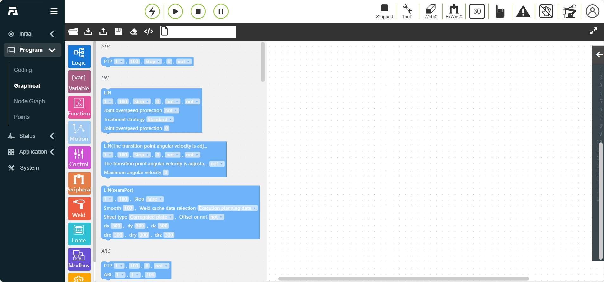
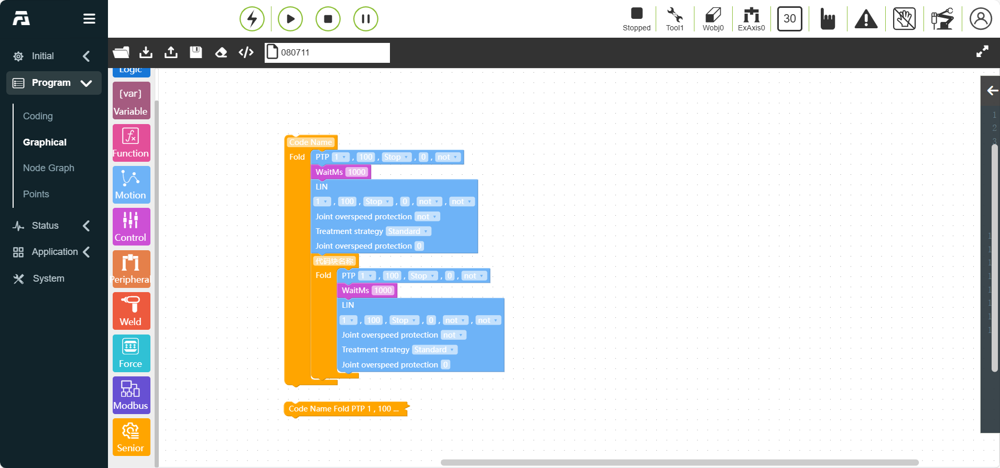

Graphical
===============

.. toctree:: 
   :maxdepth: 6

Graphical programming
------------------------------
Since the teaching pendant is generally not connected with peripherals such as a keyboard and mouse, when accessing the robot WebAPP on the teaching pendant side, the user can edit the robot teaching program through the graphical programming function. Functional standardization functions are implemented using the Blockly library, which can be integrated in the WebAPP system, and custom code blocks can be implemented as needed, and after the drag-and-drop programming is completed, it is converted into a LUA program and issued and run through the existing instruction protocol. 

Through the use of graphic programming, it can be simple, easy to understand, easy to operate, and the language can be operated in Chinese.

.. image:: graphical/001.png
   :width: 6in
   :align: center

.. centered:: Figure 10.1-1 Graphical programming interface

The page is divided into three areas: "operation bar", "toolbox toolbar" and "workspace code editing area". The overall layout design is as follows

.. centered:: Figure 10.1-2 Graphical programming page layout overall design

**Option Bar**

1) The "Load" button is responsible for reloading the workspace
2) The "Import" button is responsible for importing related graphical programming programs
3) The "Export" button is responsible for exporting the graphical programming program in the saved workspace. The "Save" button function is to save the code block as the corresponding teaching program after editing.
4) The "Clear Button" is responsible for quickly clearing the code editing area

**Toolbox**

1) A code block containing all instructions and logic codes can be dragged to the workspace to create a code block and edit it
2) The Toolbox toolbar section will be further classified according to command type
3) Logic instructions: if-else, while, etc.
4) Basic motion instructions: PTP, LIN, ARC, etc. Instructions are classified according to application scenarios: gluing, welding, conveyor belts, etc. You can easily find the required code blocks during use.

**Workspace**:Graphical code blocks can be edited and displayed in the code editing area.

Motion Graphical Programming Commands
~~~~~~~~~~~~~~~~~~~~~~~~~~~~~~~~~~~~~~~~~~~~~~
Motion graphic programming commands include PTP、Lin 、ARC and other motion commands.

.. image:: graphical/003.png
   :width: 3in
   :align: center

.. centered:: Figure 10.1-3 Motion Graphical Programming

Control graphical programming commands
~~~~~~~~~~~~~~~~~~~~~~~~~~~~~~~~~~~~~~~~~~~~~~
Control graphical programming commands include Wait、IO and other commands.

.. image:: graphical/004.png
   :width: 3in
   :align: center

.. centered:: Figure 10.1-4 Control graphical programming commands

Advanced graphical programming commands
~~~~~~~~~~~~~~~~~~~~~~~~~~~~~~~~~~~~~~~~~~~~~~
Advanced graphical programming commands include dofile 、thread 、fold command and other advanced commands.

.. image:: graphical/005.png
   :width: 3in
   :align: center

.. centered:: Figure 10.1-5 Advanced graphical programming commands

Example of using graphical programming commands
-------------------------------------------------------
After selecting the graphical programming type, click the graphic code block you want to use, you can drag and drop and stitch in the workspace.

For example, if you select PTP and Lin motion instructions and control commands Waitms for stitching, you can also nest a folding advanced instruction on the outer layer and enter the comment name, which can realize the code block folding operation. Click the drop-down box to select the command parameter type, and the input box can fill in the command parameter data. Examples of graphical programming commands are as follows:

.. centered:: Figure 10.2-1 Example of using graphical programming commands

After the graphical programming instruction splicing and parameter filling is completed, fill in the name of the workspace, and click the "Save" icon to save the program. Select the "Workspace" that has been written, click Start Run, and you can execute this program.

Modularization of graphical programming code blocks
~~~~~~~~~~~~~~~~~~~~~~~~~~~~~~~~~~~~~~~~~~~~~~~~~~~~~~~~~~

In order to improve the readability of graphical programming codes, the modularization function of graphical programming code blocks is added, that is, advanced instructions: folding instruction code blocks

.. centered:: Figure 10.2-2 Fold instruction code block

- 1.Write a code block instruction, add a folding instruction code block in the outer layer, and write the remarks of the instruction in the input box.

.. image:: graphical/008.png
   :width: 3in
   :align: center

.. centered:: Figure 10.2-3 Folding instruction rendering

- 2.Right-click "Collapse Block" in the right-click operation bar, this section of instruction code block is folded, the code block is folded into one line and displayed, and the program can be executed correctly when folded.

.. image:: graphical/009.png
   :width: 3in
   :align: center

.. centered:: Figure 10.2-4 Effect picture after folding

3.Roll the mouse to realize the page zoom function, the specific effect is as follows:

.. image:: graphical/010.png
   :width: 6in
   :align: center

.. centered:: Figure 10.2-5 Fold page zoom function effect diagram

Graphical programming coverage of the same name
~~~~~~~~~~~~~~~~~~~~~~~~~~~~~~~~~~~~~~~~~~~~~~~~~~~~~~
On the graphical programming page, click "Save" after changing the workspace name, change the workspace name. If the changed workspace name file already exists, the "Teaching Point Already Exists" pop-up box will be triggered, as shown in the figure below.

.. image:: graphical/011.png
   :width: 6in
   :align: center

.. centered:: Figure 10.2-6 Graphical programming program coverage

**Step1**:Click the "Cancel" button to continue with the previous operation.

**Step2**:Click the "Synchronize Update Teaching Program" check box, and then click the "Overwrite" button, then the Lua program on the current graphical programming page will overwrite the Lua program with the changed workspace file name.

Verification when graphical programming program is not saved
~~~~~~~~~~~~~~~~~~~~~~~~~~~~~~~~~~~~~~~~~~~~~~~~~~~~~~~~~~~~~~~~~~~~~

On the graphical programming page, after opening/creating a new program, if the graphical programming program is modified, the program is not saved.

If you click the "Open" file operation, the "Do you want to save this program" pop-up box will be triggered, prompting "The current program has changed. Do you want to save the changes to this program?", as shown below.

.. image:: graphical/012.png
   :width: 6in
   :align: center

.. centered:: Figure 10.2-7 The current page program does not save verification

**Step1**:Click the "Not Save" button to continue the previous "Open" file operation.

**Step2**:Click the "Save" button, the unsaved Lua program is saved successfully, and the previous "open" file operation continues.

If you leave the graphical programming page and switch to other pages, the prompt "Do you want to save this program" will also be triggered, and you will still stay on the current graphical programming page, as shown below.

.. centered:: Figure 10.2-8 Switch page program does not save verification

**Step1**:Click the "Not Save" button to jump to the previously selected page.

**Step2**:Click the "Save" button to save the unsusnted LUA program and jump to the previously selected page. If the preserved program name already exists, it is prompted to show that the teaching point exists and whether it is covered. After the cancellation/cover operation, jump to the page you chose before.