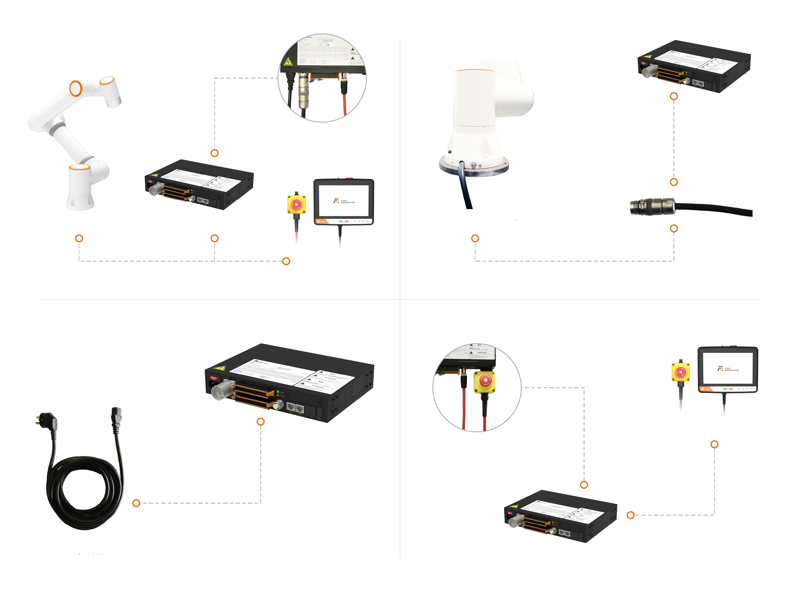
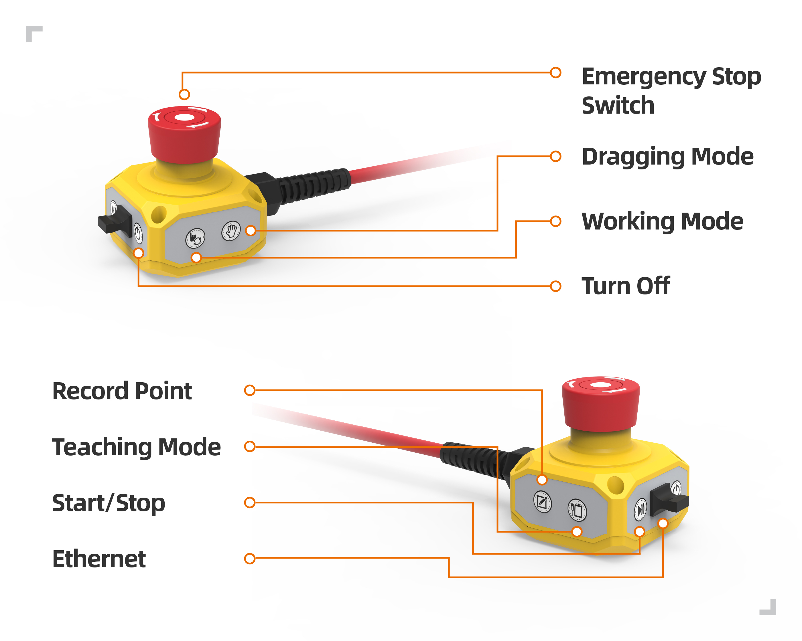

Install and power on the robot
=================================

.. toctree:: 
   :maxdepth: 6

Install the robot arm
------------------------

When the collaborative robot is installed on the mounting base, use a compliant number of bolts (strength not less than 8.8) to tighten and fix the robot on the mounting base;
it is recommended to use two compliant pin holes and pins on the mounting base for robot positioning to improve the installation accuracy of the robot and prevent the robot from moving due to collisions.
When the robot has high running precision requirements, be sure to add pins to position the robot.

.. centered:: Table 1.1-1 Robot mounting parts standard

.. list-table::
   :widths: 80 50 50 50
   :header-rows: 0
   :align: center

   * - **Collaborative robot model**
     - **M6 bolt**
     - **M6 bolt torque**
     - **Pin Hole Specifications**

   * - FR3
     - 4 pieces
     - ≥10Nm
     - φ5mm

   * - FR5
     - 4 pieces
     - ≥20Nm
     - φ8mm

   * - FR10
     - 4 pieces
     - ≥25Nm
     - φ8mm

   * - FR16
     - 6 pieces
     - ≥25Nm
     - φ8mm

   * - FR20
     - 8 pieces
     - ≥45Nm
     - φ8mm

.. important:: 
   It is recommended that the robot mounting base meet the following requirements to ensure that the robot is installed firmly and stably:

   
    (1) The robot mount needs to be strong enough and have sufficient load-bearing capacity. It should be able to carry at least 5 times the weight of the robot and at least 10 times the 1-axis torque.

    (2) The surface of the robot mounting seat should be flat to ensure close contact with the contact surface of the robot;

    (3) The robot mounting base should be strong enough, fixed firmly, and will not resonate with the robot;

    (4) When the robot and other parts move at the same time, the mounting base should be isolated from other moving parts, and should not be fixed together to avoid vibration interference during the movement;

    (5) If the robot is installed on a mobile platform or an external axis, the acceleration of the mobile platform or external axis should be as low as possible;

Connect the control box
-------------------------

This series of robots are powered by TN-S single-phase 220V AC power supply. The equipment comes with a 5-meter power cord. The three-pin plug end is inserted into the AC 220V socket provided on site, and the robot is electrically grounded. The external connections of the manipulator control system are all connected by pluggable plugs that can be quickly installed. The wiring panel of the collaborative robot is as follows:

.. centered:: Figure 1.2-1 Control box wiring panel

The button box interface is the control port of the teach pendant by default, and the IP address is 192.168.58.2. Use a network cable to connect the button box interface and the computer. The computer IP address is set to 192.168.58.10 or the same network segment. Open the Google browser and enter 192.168.58.2 You can access the teach pendant page.

Know the button box and end LED
---------------------------------

The button box
~~~~~~~~~~~~~~~~

.. centered:: Figure 1.3-1 The second version of the button box

.. centered:: Table 1.3-1 Control box wiring panel button description

.. list-table::
   :widths: 80 200
   :header-rows: 0
   :align: center

   * - **Name**
     - **Function**

   * - Emergency stop switch
     - When pressing the emergency stop switch, the robot enters the state of emergency stop.

   * - Start/Stop
     - Start/stop running program.

   * - Ethernet
     - Connect to the web oscilloscope.

   * - Turn off
     - No enabled.

   * - Record point
     - Record the teaching point.

   * - Teaching mode
     - Enter/exit with the teaching pendant state.

   * - Working mode
     - Automatic/manual mode switch.

   * - Dragging mode
     - Enter/exit drag mode.

The end LED
~~~~~~~~~~~~~~~~

.. centered:: Table 1.3-2 The end LED definition table

.. list-table::
   :widths: 50 50
   :header-rows: 0

   * - **Function**
     - **LED color**

   * - When communication is not established
     - "Off", "Red", "Green" and "Blue" alternately

   * - Automatic mode
     - Blue long bright

   * - Manual mode
     - Green long bright

   * - Drag Mode
     - White cyan long bright

   * - Button box record point (only when using button box)
     - Purple blinks twice

   * - Start running (only when using the button box)
     - Cyan blue flashes twice

   * - Enter the state of unmatched button box (only when using the button box)
     - Blue flashes twice

   * - Stop operation (only when using the button box)
     - Red flashes twice

   * - Error reporting (only when using the button box)
     - Red long bright

   * - Zero calibration completed
     - White cyan flashes three times

   * - Enable
     - Yellow flashes twice

Power on enable
----------------

Before powering on, please confirm that the emergency stop button of the button box is released, press the red switch button of the control box to power on, and the LED light at the end will be in a steady green state after enabling successfully.
