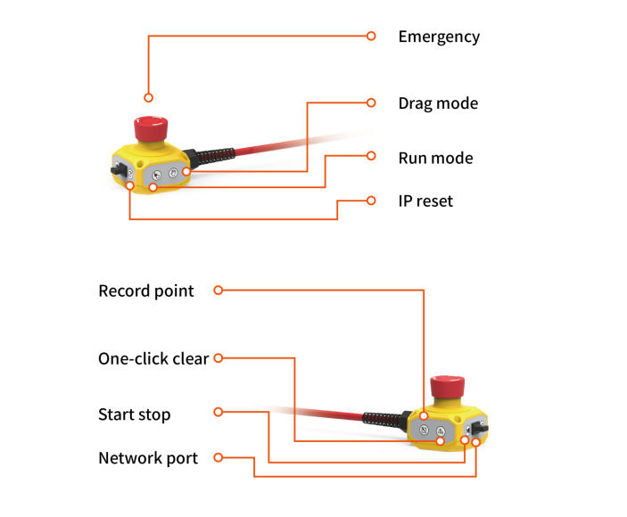
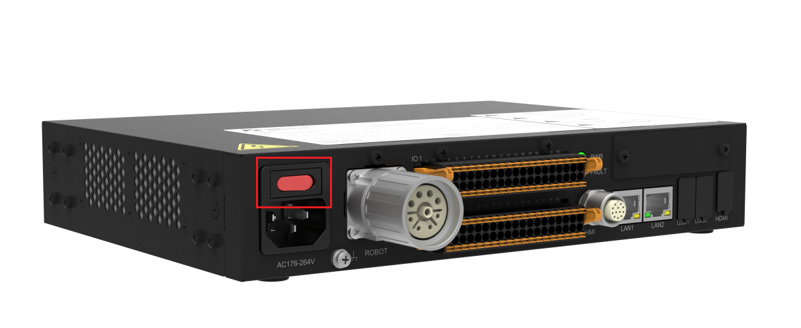

Install and power on the robot
=================================

.. toctree:: 
   :maxdepth: 6

Install the robot arm
------------------------

When the collaborative robot is installed on the mounting base, use a compliant number of bolts (strength not less than 8.8) to tighten and fix the robot on the mounting base;
it is recommended to use two compliant pin holes and pins on the mounting base for robot positioning to improve the installation accuracy of the robot and prevent the robot from moving due to collisions.
When the robot has high running precision requirements, be sure to add pins to position the robot.

.. centered:: Table 1.1-1 Robot mounting parts standard

.. list-table::
   :widths: 80 50 50 50
   :header-rows: 0
   :align: center

   * - **Collaborative robot model**
     - **Bolt**
     - **Bolt torque**
     - **Pin Hole Specifications**

   * - FR3
     - 4 pieces of M6
     - ≥10Nm
     - φ5mm

   * - FR3-WMS
     - 4 pieces of M6
     - ≥10Nm
     - φ5mm

   * - FR3-WML
     - 4 pieces of M6
     - ≥10Nm
     - φ5mm

   * - FR3-C
     - 4 pieces of M6
     - ≥10Nm
     - φ5mm

   * - FR5-C
     - 4 pieces of M6
     - ≥10Nm
     - φ5mm
   
   * - FR5
     - 4 pieces of M8
     - ≥20Nm
     - φ8mm

   * - FR10
     - 4 pieces of M8
     - ≥25Nm
     - φ8mm

   * - FR16
     - 4 pieces of M8
     - ≥25Nm
     - φ8mm

   * - FR20
     - 6 pieces of M10
     - ≥45Nm
     - φ8mm

   * - FR30
     - 6 pieces of M10
     - ≥45Nm
     - φ8mm

.. important:: 
   It is recommended that the robot mounting base meet the following requirements to ensure that the robot is installed firmly and stably:
   
    (1)The robot mount needs to be strong enough and have sufficient load-bearing capacity. It should be able to carry at least 5 times the weight of the robot and at least 10 times the 1-axis torque.

    (2)The surface of the robot mounting seat should be flat to ensure close contact with the contact surface of the robot;

    (3)The robot mounting base should be strong enough, fixed firmly, and will not resonate with the robot;

    (4)When the robot and other parts move at the same time, the mounting base should be isolated from other moving parts, and should not be fixed together to avoid vibration interference during the movement;

    (5)If the robot is installed on a mobile platform or an external axis, the acceleration of the mobile platform or external axis should be as low as possible;

Connect the control box
-------------------------

This series of robots can be configured with three control boxes with different power inputs. For details on the control box power input, see the control box nameplate information.
The robot needs to be electrically grounded. The external wiring of the manipulator control system is connected using pluggable and quickly installed plugs.

A. 30-60VDC
B. 176-264VAC~50-60Hz
C. 100-240VAC~50-60HZ

.. note:: The AC input control box has two versions: narrow voltage and wide voltage. The control box wiring terminals and appearance are consistent, and cannot be distinguished by appearance alone. Please confirm by the control box nameplate and power on after confirmation.

The wiring panel of the collaborative robot is shown in the following figure:

.. image:: installation/037.png
   :width: 6in
   :align: center

.. centered:: Figure 1.2-1 Control box wiring panel

The button box interface is the control port of the teach pendant by default, and the IP address is 192.168.58.2. Use a network cable to connect the button box interface and the computer. The computer IP address is set to 192.168.58.10 or the same network segment. Open the Google browser and enter 192.168.58.2 You can access the teach pendant page.

Control Box Mounting Screw Hole Information
~~~~~~~~~~~~~~~~~~~~~~~~~~~~~~~~~~~~~~~~~~~~~~~~~~~~~~~~~~~~~~~~~~~~~~~~~~~~~~~~~~~~~~~~~~~~~~~~~~~~~~~~~~~~~~~~~~

.. image:: installation/149.png
   :width: 6in
   :align: center

.. centered:: Figure 1.2-2 Control Box External Dimensions - Mounting Hole Dimensions 1

.. image:: installation/150.png
   :width: 6in
   :align: center

.. centered:: Figure 1.2-3 Control Box External Dimensions - Mounting Hole Dimensions 2

.. note:: 
  1. The marked holes are available mounting holes;
  2. There are 16 mounting holes in total, distributed on the left and right sides of the control box, 8 on each side;
  3. The screw specification for the mounting holes is M3, with a pitch of 0.5mm;
  4. The depth to which the screws are inserted into the sheet metal shell of the control box is ≤5mm;
  5. Recommended mounting torque is 0.6Nm, maximum mounting torque is 0.84Nm.

:download:`Control Box External Dimensions - Mounting Hole Dimensions <../_static/_doc/Control box outer dimensions - mounting hole dimensions.zip>`

Know the button box and end LED
---------------------------------

The button box
~~~~~~~~~~~~~~~~

60 Button Box (POE) (BX01)
+++++++++++++++++++++++++++++++++++

.. figure:: installation/058.png
	:align: center
	:width: 6in

.. centered:: Figure 1.3-1 60 Button Box (POE) (BX01)

60 Button Box (POE) (BX02)-V1.0
+++++++++++++++++++++++++++++++++++

.. figure:: installation/059.png
	:align: center
	:width: 6in

.. centered:: Figure 1.3-2 60 Button Box (POE) (BX02)-V1.0

.. centered:: Table 1.3-1 Control box wiring panel button description

.. list-table::
   :widths: 80 200
   :header-rows: 0
   :align: center

   * - **Name**
     - **Function**

   * - Emergency stop switch
     - When pressing the emergency stop switch, the robot enters the state of emergency stop.

   * - Start/Stop
     - Start/stop running program.

   * - Ethernet
     - Connect to the teaching pendant.

   * - Turn off
     - No enabled.

   * - Record point
     - Record the teaching point.

   * - Teaching mode
     - Enter/exit with the teaching pendant state.

   * - Working mode
     - Automatic/manual mode switch.

   * - Dragging mode
     - Enter/exit drag mode.

60 Button Box (POE) (BX02)-V2.0
+++++++++++++++++++++++++++++++++++

.. centered:: Figure 1.3-3 60 Button Box (POE) (BX02)-V2.0

.. centered:: Table 1.3-2 Control box wiring panel button description

.. list-table::
  :widths: 50 200
  :header-rows: 0
  :align: center

  * - **Button name**
    - **Function**

  * - Emergency stop switch
    - When the emergency stop switch is pressed, the robot enters the emergency stop state

  * - Start stop
    - Start/stop running the program

  * - Network port
    - Connect to web teach pendant

  * - IP reset
    - Reset network port IP

  * - Record point
    - Record teaching point

  * - One-click clear
    - Clear all recoverable errors

  * - Running mode
    - Automatic/manual mode switching

  * - Drag mode
    - Enter/exit drag mode

The end LED
~~~~~~~~~~~~~~~~

.. centered:: Table 1.3-4 The end LED definition table

.. list-table::
   :widths: 50 50
   :header-rows: 0
   :align: center

   * - **Function**
     - **LED color**

   * - When communication is not established
     - "Off", "Red", "Green" and "Blue" alternately

   * - Automatic mode
     - Blue long bright

   * - Manual mode
     - Green long bright

   * - Drag Mode
     - White cyan long bright

   * - Button box record point (only when using button box)
     - Purple blinks twice

   * - Start running (only when using the button box)
     - Cyan blue flashes twice

   * - Enter the state of unmatched button box (only when using the button box)
     - Blue flashes twice

   * - Stop operation (only when using the button box)
     - Red flashes twice

   * - Error reporting (only when using the button box)
     - Red long bright

   * - Zero calibration completed
     - White cyan flashes three times

   * - Enable
     - Yellow flashes twice

Power on enable
----------------

Before powering on, please confirm that the emergency stop button of the button box is released, press the red switch button of the control box to power on, and the LED light at the end will be in a steady green state after enabling successfully.

Power Off
----------------

.. important:: 
  When using this device, please make sure to stop all running programs, disable the status query function, and confirm that the operating status is "Stopped" before turning off the power. This operation is to protect the safety of the device and stored data and avoid data loss or system damage caused by sudden power outages.

.. centered:: Figure 1.5-1 Turn off the power button

Control Box Button Battery
----------------------------------------------------------------

Common Causes of Time Loss
~~~~~~~~~~~~~~~~~~~~~~~~~~~~~~~~~~~~~~~~~~~~~~~~~~~~~~~~~~~~~~~~~~~~~~~~

This device uses an external button battery as a backup power source for the real-time clock (RTC), used to maintain time counting when the main power is disconnected.

If time loss occurs (i.e., incorrect date displayed after powering on again), it is usually caused by one or more of the following reasons:

.. list-table::
   :widths: 40 40 60
   :header-rows: 0
   :align: center

   * - **Cause Category**
     - **Specific Description**
     - **Troubleshooting Suggestions**

   * - Button battery depleted
     - The device has not been powered on for more than 3 months, causing the battery energy to be naturally consumed.
     - Measure the battery voltage with a multimeter (remove it for measurement). If the voltage is below 2.5V, it needs to be recharged.

   * - Battery damaged
     - The battery has reached the end of its service life.
     - Check if the battery shows signs of leakage or bulging. If so, replace the battery. Battery model: MS621FE-FL11E, 3V/5.5mAH, rechargeable.

   * - Poor battery terminal contact
     - Battery terminals are oxidized, deformed, or the device has been shaken causing the battery to momentarily detach from the contacts.
     - Check if the battery is securely inserted into the terminals, clean the contacts, reinstall the battery and ensure it is firmly clamped.

   * - Battery not installed or installed backwards
     - The user has not installed the backup battery, or the positive and negative terminals are reversed during installation.
     - | Confirm that the battery is installed with the correct polarity (positive terminal facing up).
       
       .. image:: installation/131.png
          :width: 2in
          :align: center

   * - Battery charging circuit failure
     - The rechargeable button battery is unable to store charge properly.
     - Requires inspection of the charging circuit by professional maintenance personnel.

.. warning:: The button battery used in this device is model [MS621FE-FL11E, 3V/5.5mAH, rechargeable]. Please ensure the correct handling method according to the model. Do not install non-rechargeable batteries.

Time Anomaly Identification and Manual Calibration
~~~~~~~~~~~~~~~~~~~~~~~~~~~~~~~~~~~~~~~~~~~~~~~~~~~~~~~~~~~~~~~~~~~~~~~~~~~

1) Anomaly Identification Method
   
After re-energizing the robot, first check the current time displayed on the device page. Compare it with the computer's system time:

- If they are consistent, the time is normal and no further action is required.

.. image:: installation/132.png
   :width: 4in
   :align: center

.. centered:: Figure 1.6-1 System Time Anomaly

- If they are inconsistent (e.g., incorrect date, significant deviation in hour/minute/second), it is determined as a time anomaly. Please continue with the calibration steps below.
  
2) Calibration Steps

If a time anomaly has been confirmed, follow the steps below to synchronize the system time:

- Open the browser to enter the WebApp, and navigate to: "System Settings -> General Settings -> Time" interface.

.. image:: installation/133.png
   :width: 6in
   :align: center

.. centered:: Figure 1.6-2 System Time Update Interface

- Click the "Update" button on the interface, and the system will automatically complete the time synchronization. After synchronization, return to the robot page, and the time should be restored to normal.

Button Battery Charging and Maintenance Precautions
~~~~~~~~~~~~~~~~~~~~~~~~~~~~~~~~~~~~~~~~~~~~~~~~~~~~~~~~~~~~~~~~~~~~~~~~~~~~~~~~~~~~~

1) Charging Conditions

- After the device main power is connected (220V AC), the charging circuit is automatically activated.
- The ambient temperature should be within the range of 0℃ to 45℃. High temperatures will reduce charging efficiency and shorten battery life.

2) Charging Time

- A fully discharged battery takes approximately [5 hours] to fully charge. Time-keeping function works normally during this period.

3) Prohibited Actions

- Do not use an external charger to directly charge the button battery inside the device.
- Do not install a non-rechargeable battery into the device, as this may cause danger.

Battery Replacement and Disposal
~~~~~~~~~~~~~~~~~~~~~~~~~~~~~~~~~~~~~~~~~~~~~~~~~~~~~~~~~~~~~~~~~~~
1) Replacement Cycle

- Typically can be used for more than [5 years]. Replace if time is frequently lost.

2) Replacement Steps

- Disconnect the device main power.
- Open the top cover.
- Remove the old battery, noting the polarity direction.
- Solder a new qualified battery of the same model (positive terminal facing up).
- Close the cover, re-energize, and calibrate the current time.

3) Disposal

- Do not throw the battery into fire or expose it to water.
- Recycle waste batteries according to local regulations (button batteries typically contain lithium or heavy metals).

Technical Support
~~~~~~~~~~~~~~~~~~~~~~~~~~~~~~~~~~~~~~~~~~~~~~~~~~~~~~~~~~~

If the problem persists after following the above steps, please contact our technical support team and provide the following information:

- Device model and serial number.
- The battery model used (please check the markings on the battery surface).
- Fault phenomenon (e.g., time lost immediately after power failure / lost after sitting overnight).