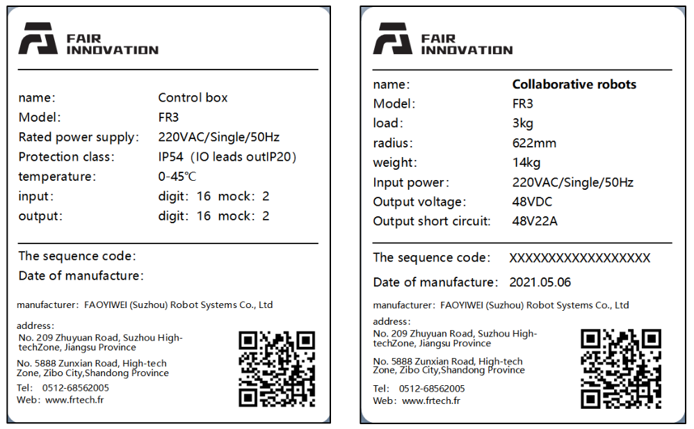
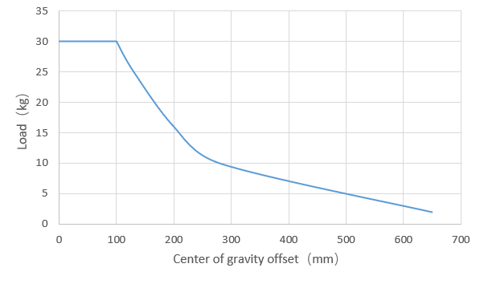
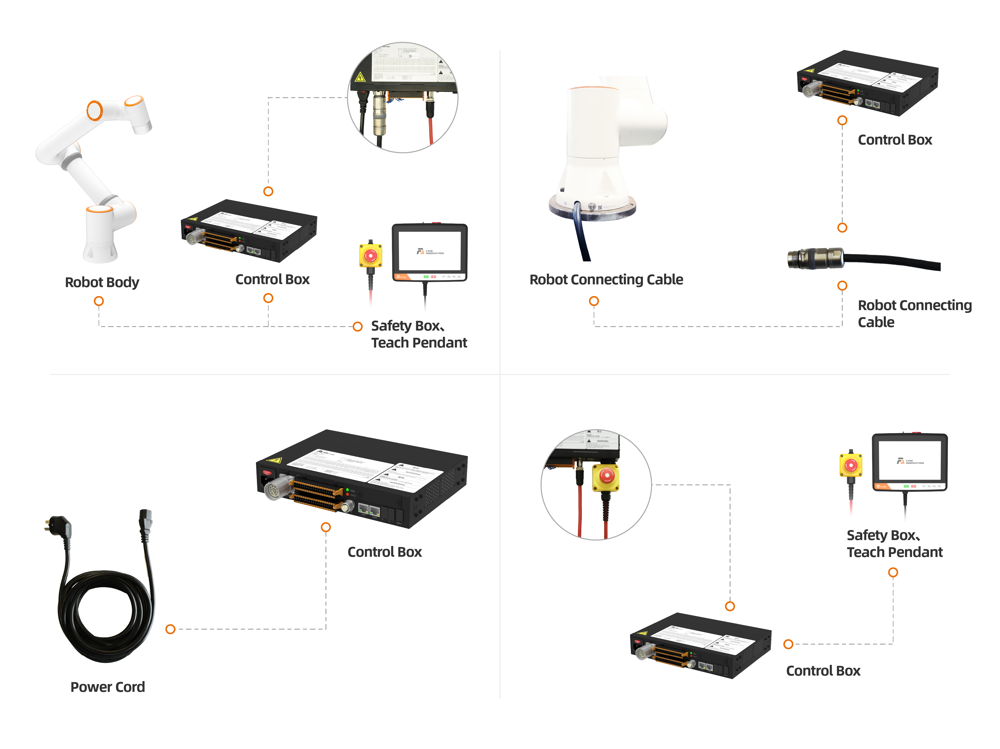
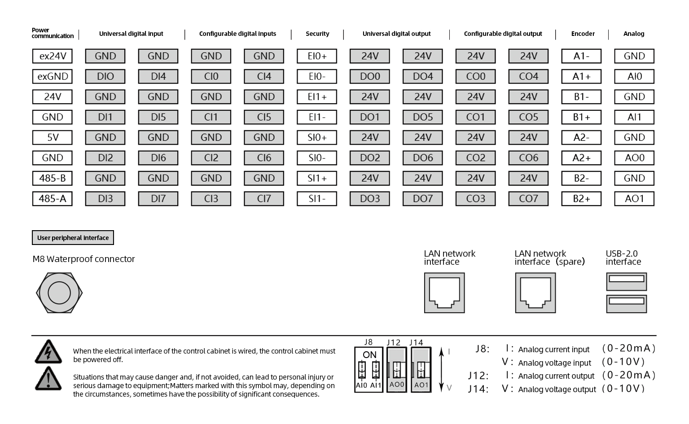
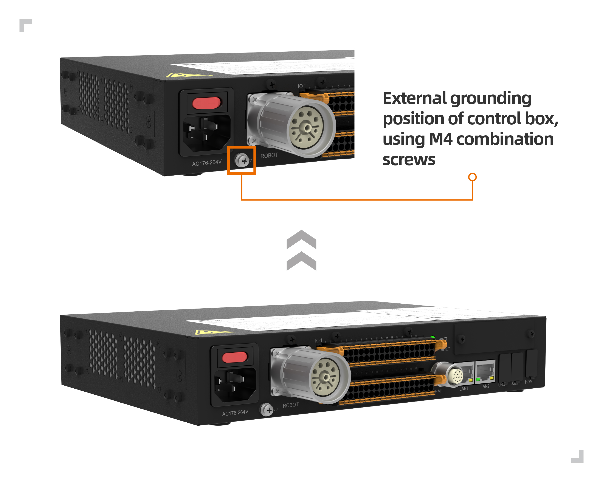
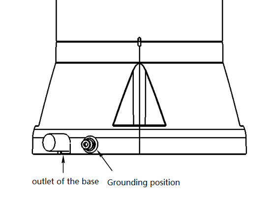
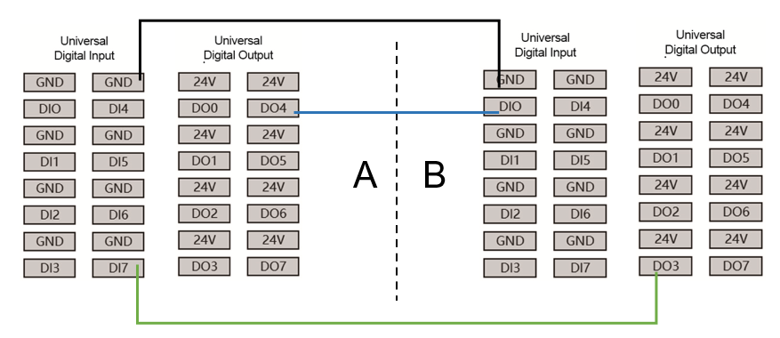
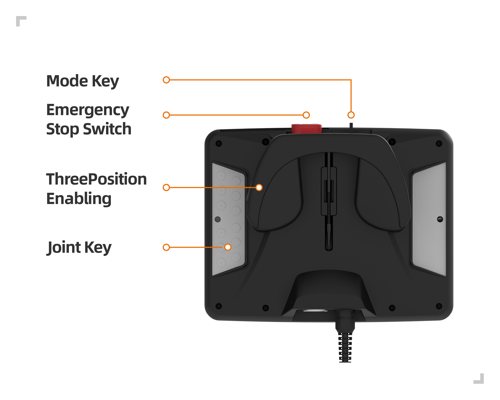

Installation
========================

.. toctree:: 
	:maxdepth: 5

Instructions for security
----------------------------

Brief introduction
~~~~~~~~~~~~~~~~~~~~~

This manual will use the following warnings. The role of these warnings is to ensure the safety of personal and equipment. When you read this manual, you must comply with and execute all the assembly instructions and guidelines in other chapters in this manual. This is very important. Pay special attention to text related to warning signs.

.. important:: 
    - If the robot (robot body, control box, oscilloscope, or button box) is damaged, changed or modified due to anthropogenic causes, FAIR INNOVATION refuses to bear all responsibilities；
    - FAIR INNOVATION is not responsible for any damage caused by the robot or any other device due to errors written by customers or any other device.

Personnel safety
~~~~~~~~~~~~~~~~~~~~~~~~~~~~~

When running the robot system, we must first ensure the safety of the operators. The general precautions are listed below. Please take corresponding measures to ensure the safety of the operator.

1. All operators who use the robot system should be trained through training courses sponsored by the FAIR INNOVATION (Suzhou) ROBOTIC SYSTEM COMPANY. Users need to ensure that they fully grasp the safe and standardized operating processes and have the qualifications for robotic operations. For training details, please check with our company, the mailbox is jiling@frtech.fr。

2. All operators who use the robot system, please do not wear loose clothes or jewelry. Make sure the long hair beam is behind the head when operating the robot.

3. During the operation of the device, even if the robot seems to have stopped, it may be because the robot is waiting to start the signal and is in a state of motion. Even in such a state, the robot should be regarded as in action.

4. The lines should be drawn on the floor to mark the scope of the robot, so that the operator understands the action range of the robot includes holding tools (robotics, tools, etc.).

5. Ensure safety measures (such as guardrails, ropes, or protective screens) near the robotic operation area to protect operators and surrounding people. Locks should be set up as needed, so that those who are responsible for operations cannot reach the power supply of the robot.

6. When using the operating panel and oscilloscope, because you may have an operational error in wearing gloves, you must work after taking off the gloves.

7. Under the emergency and abnormalities of people being pinched or wrapped inside by a robot, pushing or pulling the robot arm by force (at least 700 N) to force joint movements. With a power-free driver, the arm of the manual mobile robot is limited to emergency and may damage the joint.

Security settings
~~~~~~~~~~~~~~~~~~~~~~~~~~~~~

Under the "Safety Settings" menu bar in "Auxiliary Application", click "Safety stop mode" to enter the safe stop setting function interface.

Enable the security stop mode. When the robot is reported or warned, the robot will automatically enable and play a role in safe protection.

.. figure:: installation/001.png
	:align: center
	:class: figure-border

.. centered::  Figure 2.1-1 Safety stop setting

-  **Speed reduction**:After this mode is activated, the speed of the robotic arm in the joint space will be limited. The value in the corresponding text box is the limit value of the speed of the joints of each joint, the setting range of 1, 2, and 3 joints is 15 ~ 150 °/s, 4, 5, and 6 joints is 15 ~ 180 °/s; the motion speed limit of the robotic arm in the Descartes space is the TCP speed limit value, and the set range is 0 ~ 80mm/s.

Danger recognition
~~~~~~~~~~~~~~~~~~~~~~~~~~~~~~~

Risk assessment should consider all potential contact between operators and robots during normal use and foreseeable misunderstandings. The operator's neck, face, and head should not be exposed to avoid touch. Using robots without using peripheral safety protection devices requires the first risk assessment to determine whether the relevant hazards will constitute an unacceptable risk, such as

-  There may be danger of using a sharp end actuator or tool connector;

-  There may be danger of treatment of toxicity or other harmful substances;

-  The operator's finger has the danger of being clamped by a robot base or joint;

-  The danger of collision by robots;

-  The danger of robots or tools connected to the end not being fixed in place;

-  The risk of the impact between the effective load and the strong surface of the robot.

Integrates must measure such dangers and related risk levels through risk assessment, and determine and implement corresponding measures to reduce the risk to acceptable levels. Please note that there may be other major dangers in specific robots.

By combining the inherent security design measures used by FR robots with the safety specifications or risk assessment implemented by integrated and end users, the risks related to FR collaborative operations will be reduced to a reasonable and feasible level. Through this document, any remaining risk of the robot can be conveyed to the integrated and end users before installation. If the risk assessment of the integrator determines that the existence of a specific application that may have unacceptable risks that may constitute unacceptable risks, integrators must
appropriate risk reduction measures must be taken to eliminate or minimize these dangers until the risk is reduced to acceptable levels. It is not safe to use before taking appropriate risk reduction measures (if necessary).

If the robot is installed in non-synergistic installation (for example, when using a hazardous tool), risk assessment may infer the integrated provider to connect additional safety equipment (such as safety startup equipment) to ensure personnel and equipment safety when programming.

Nameplate information
~~~~~~~~~~~~~~~~~~~~~~~~

.. centered:: Figure 2.1-2 FR3 model collaborative robot

.. centered:: Figure 2.1-3 FR5 model collaborative robot

.. centered:: Figure 2.1-4 FR10 model collaborative robot

.. centered:: Figure 2.1-5 FR16 model collaborative robot

.. centered:: Figure 2.1-6 FR20 model collaborative robot

Effectiveness and responsibility
~~~~~~~~~~~~~~~~~~~~~~~~~~~~~~~~~~~~~

The information in this manual does not include a complete robot application in design, installation and operation, nor does it contain all peripheral equipment that may affect the security of this complete system. The design and installation of this complete system must meet the safety requirements established in the standards and specifications of the country's installation.

The integrated integrator of FAIR INNOVATION is responsible for ensuring that it follows the laws and regulations of relevant countries, and there is no major danger in the complete robotic application. This includes but not limited to the following:

-  Do a risk assessment of the complete robot system

-  Connect other machinery and additional safety equipment defined by risk assessment and definition

-  Establish appropriate security settings in software

-  Make sure that users will not modify any security measures

-  Confirm that the design and installation of the entire robot system is accurate

-  Clear instructions for use

-  Kark the relevant signs and contact information of integrators on the robot

-  Collect all the documents in the technical file, including this manual

Limited responsibility
~~~~~~~~~~~~~~~~~~~~~~~~

Any security information contained in this manual shall not be regarded as a general robot safety guarantee. Even if you comply with all security descriptions, it may still cause personnel damage or equipment damage.

The warning signs in this manual
~~~~~~~~~~~~~~~~~~~~~~~~~~~~~~~~~~~~~~

The following flag defines the explanation of the danger level provisions contained in this manual. The product also uses the same warning signs.

.. important:: 
	.. figure:: installation/008.png
		:width: 60
		:height: 50
		:align: left

	Danger: This refers to the power consumption that is about to cause danger. If it is not avoided, it can lead to death or severe damage.

.. important:: 
	.. figure:: installation/009.png
		:width: 60
		:height: 50
		:align: left

	Electric shock danger: This refers to the upcoming electric shock situation that is about to cause danger.

.. important:: 
	.. figure:: installation/010.png
		:width: 60
		:height: 50
		:align: left

	Dangerous burns: This refers to the hot surface that may cause danger. If you do not avoid contact, it can cause personnel to hurt.
	

Pre-use evaluation
~~~~~~~~~~~~~~~~~~~~~~~

After using a robot or any modification for the first time, the robot's default speed is less than 250mm/s. Do not log in to the administrator to modify the speed to enter the high-speed mode. After that, the following test must be performed. It is confirmed that all security input and output are correct and the connection is correct. Test whether all connected security input and output (including multiple machines or robots shared equipments) are normal. So you must:

-  Test whether the emergency stop button and input can stop the robot and start the brake.

-  Test whether the protection input can stop the robot movement. If the protection reset is configured, check if you need activation before recovery.

-  The test operation mode can switch the operation mode, see the icon in the upper right corner of the user interface.

-  Test whether the 3rd gear actuation device must be pressed to activate in manual mode, and the robot is under deceleration control (the robot software version V3.0 does not support this function).

-  Test whether the system emergency stop output can bring the entire system to a safe state.

Emergency stop
~~~~~~~~~~~~~~

The emergency stop button is type 0 stop. Press the emergency stop button to stop all the movements of the robot immediately.

The following table shows the stop distance and stop time of the type 0 stop. These measurement results correspond to the following configuration of the robot:

-  Extension: 100%(the robotic arm is fully expanded)

-  Speed: 100%(Robot general speed is set to 100%, moved at a joint speed of 180 °/s)

-  Effective load: Maximum effective load

Joint 1, joint 6 testing robot levels, the rotating shaft is perpendicular to the ground. Joint 2, joint 3, joint 4, joint 5 testing robots follow the vertical trajectory, the rotating shaft is parallel to the ground, and stops when the robot moves down.

.. centered:: Table 2.1-1 Category 0 stop distance(rad)
.. list-table::
   :widths: 10 15 15 15 15 15 15
   :header-rows: 0
   :class: sheet-center

   * - 
     - **Joint 1**
     - **Joint 2**
     - **Joint 3**
     - **Joint 4**
     - **Joint 5**
     - **Joint 6**

   * - **FR3**
     - 0.47
     - 0.60
     - 0.56
     - 0.29
     - 0.10
     - 0.06

   * - **FR5**
     - 0.51
     - 0.63
     - 0.60
     - 0.33
     - 0.16
     - 0.10

   * - **FR10**
     - 0.64
     - 0.70
     - 0.69
     - 0.42
     - 0.25
     - 0.13

   * - **FR16**
     - 0.60
     - 0.67
     - 0.65
     - 0.39
     - 0.22
     - 0.12

   * - **FR20**
     - 0.69
     - 0.75
     - 0.80
     - 0.48
     - 0.31
     - 0.22

.. centered:: Table 2.1-2 Category 0 stop time (ms)
.. list-table::
   :widths: 10 15 15 15 15 15 15
   :header-rows: 0
   :class: sheet-center

   * - 
     - **Joint 1**
     - **Joint 2**
     - **Joint 3**
     - **Joint 4**
     - **Joint 5**
     - **Joint 6**

   * - **FR3**
     - 400
     - 470
     - 450
     - 280
     - 120
     - 90

   * - **FR5**
     - 420
     - 500
     - 480
     - 310
     - 150
     - 120

   * - **FR10**
     - 460
     - 540
     - 510
     - 330
     - 170
     - 140

   * - **FR16**
     - 440
     - 530
     - 490
     - 320
     - 160
     - 130

   * - **FR20**
     - 540
     - 600
     - 700
     - 400
     - 260
     - 170

After the emergency stop, turn off the power, rotate the emergency stop button, and turn on the power to restart the robot.

At the same time, the stop time and stop distance of the robot safety stop and soft limit stop are shown in the table below. These measurement results correspond to the following configuration of the robot:

-  Extension: 100%(the robotic arm is fully expanded)

-  Speed: 100%(Robot general speed is set to 100%, moved at a joint speed of 180 °/s)

-  Effective load: Maximum effective load

Joint 1, joint 6 testing robot levels, the rotating shaft is perpendicular to the ground. Joint 2, joint 3, joint 4, joint 5 testing robots follow the vertical trajectory, the rotating shaft is parallel to the ground, and stops when the robot moves down.

.. centered:: Table 2.1-3 Safety stop distance(rad)
.. list-table::
   :widths: 10 15 15 15 15 15 15
   :header-rows: 0
   :class: sheet-center

   * - 
     - **Joint 1**
     - **Joint 2**
     - **Joint 3**
     - **Joint 4**
     - **Joint 5**
     - **Joint 6**

   * - **FR3**
     - 0.49
     - 0.63
     - 0.58
     - 0.32
     - 0.12
     - 0.09

   * - **FR5**
     - 0.54
     - 0.65
     - 0.63
     - 0.35
     - 0.19
     - 0.12

   * - **FR10**
     - 0.66
     - 0.73
     - 0.71
     - 0.45
     - 0.27
     - 0.14

   * - **FR16**
     - 0.63
     - 0.69
     - 0.68
     - 0.41
     - 0.25
     - 0.14

   * - **FR20**
     - 0.71
     - 0.78
     - 0.82
     - 0.51
     - 0.33
     - 0.25

.. centered:: Table 2.1-4 Safety stop time(ms)
.. list-table::
   :widths: 10 15 15 15 15 15 15
   :header-rows: 0
   :class: sheet-center

   * - 
     - **Joint 1**
     - **Joint 2**
     - **Joint 3**
     - **Joint 4**
     - **Joint 5**
     - **Joint 6**

   * - **FR3**
     - 410
     - 490
     - 410
     - 300
     - 130
     - 110

   * - **FR5**
     - 450
     - 520
     - 510
     - 330
     - 180
     - 140

   * - **FR10**
     - 480
     - 570
     - 530
     - 360
     - 190
     - 170

   * - **FR16**
     - 470
     - 550
     - 520
     - 340
     - 190
     - 150

   * - **FR20**
     - 560
     - 630
     - 720
     - 430
     - 280
     - 200

.. centered:: Table 2.1-5 Soft limit stop distance(rad)
.. list-table::
   :widths: 10 15 15 15 15 15 15
   :header-rows: 0
   :class: sheet-center

   * - 
     - **Joint 1**
     - **Joint 2**
     - **Joint 3**
     - **Joint 4**
     - **Joint 5**
     - **Joint 6**

   * - **FR3**
     - 0.52
     - 0.65
     - 0.61
     - 0.34
     - 0.15
     - 0.11

   * - **FR5**
     - 0.56
     - 0.68
     - 0.65
     - 0.38
     - 0.21
     - 0.15

   * - **FR10**
     - 0.69
     - 0.75
     - 0.74
     - 0.47
     - 0.30
     - 0.18

   * - **FR16**
     - 0.65
     - 0.72
     - 0.70
     - 0.44
     - 0.27
     - 0.17

   * - **FR20**
     - 0.74
     - 0.80
     - 0.85
     - 0.53
     - 0.36
     - 0.27

.. centered:: Table 2.1-6 Soft limit stop time(ms)
.. list-table::
   :widths: 10 15 15 15 15 15 15
   :header-rows: 0
   :class: sheet-center

   * - 
     - **Joint 1**
     - **Joint 2**
     - **Joint 3**
     - **Joint 4**
     - **Joint 5**
     - **Joint 6**

   * - **FR3**
     - 430
     - 500
     - 430
     - 310
     - 150
     - 120

   * - **FR5**
     - 460
     - 540
     - 520
     - 350
     - 190
     - 160

   * - **FR10**
     - 500
     - 580
     - 550
     - 370
     - 210
     - 180

   * - **FR16**
     - 480
     - 570
     - 530
     - 360
     - 200
     - 170

   * - **FR20**
     - 580
     - 640
     - 740
     - 440
     - 300
     - 210

.. important:: 
	According to IEC 60204-1 and ISO 13850, emergency stop device is not a safe protection device. They are supplementary protection measures and do not need to prevent damage.

Power-free movement
~~~~~~~~~~~~~~~~~~~~~~~~~~~~

If you must move the robot joint but cannot power the robot or other emergencies, please contact the robot dealer. If necessary, you can use violent means to force mobile robots to rescue the trapped persons.

Equipment transportation
----------------------------

Transportation
~~~~~~~~~~~~~~~~~~

Robot and control boxes have been calibrated as complete equipment. Do not separate them, that would require recalibration.

You can only transport the robot in the original packaging. If you want to move the robot in the future, save the packaging material in a dry place.

When the robot moves from the packaging to the installation space, the two arms of the robot are held at the same time. Hold the robot until all the installation bolts of the robot seat are tight.

Carry
~~~~~~

According to different models, the total quality (including packaging) is 15kg-80 kg depending on the model. When manpower transports or transfers the collaborative robot, multiple people need to help lift it, don’t recommend single-person handling, it must be stable during transportation. Avoid equipment tilt or slipping.

.. warning:: 
	- If you use professional equipment for handling, be sure to use a crane or forklift to transport or carry the collaborative robot by using a crane or forklift, otherwise it may cause personnel damage or other accidents;
	- If you use manual handling, please pay attention to the personal safety on the way to handle;
	- The collaborative robot contains precision components, which should avoid severe vibration or shaking during transportation or transportation, otherwise it may reduce the performance of the equipment.

Storage
~~~~~~~~~

The collaborative robot should be stored in -25 ~ 60 ° C, and there is no frost-free environment.

Maintenance and scrap treatment
---------------------------------

Maintenance disposal
~~~~~~~~~~~~~~~~~~~~~~~~

Please check the emergency stop and protection stop for 1 month. Determine whether the security function is effective.

Please refer to the wiring chapter for emergency stop and protective stop wiring.

Robot waste disposal
~~~~~~~~~~~~~~~~~~~~~~

FR robots need to be disposed of according to the applicable national laws and regulations and national standards. For details, you can contact manufacturers.

Installation specifications
---------------------------------

Robot arm installation
~~~~~~~~~~~~~~~~~~~~~~~~~

.. important::
  The recommended robot installation base meets the following requirements to ensure a secure and stable installation of the robot:
  
  (1)The robot mounting base needs to be strong enough and have sufficient load-bearing capacity, which should be able to bear at least 5 times the weight of the robot and at least 10 times the 1-axis torque.

  (2)The surface of the robot mounting base should be flat to ensure close contact with the robot contact surface.

  (3)The robot mounting base should have sufficient stiffness, be firmly fixed, and not resonate with the robot.

  (4)When the robot and other components are moving simultaneously, the mounting base should be separated from other moving components and not fixed together to avoid vibration interference during the movement process.

  (5)If the robot is installed on a mobile platform or external axis, the acceleration of the mobile platform or external axis should be as low as possible.

.. warning:: 
  The following installation methods should be avoided:

  (I)Avoid fixing the robot to other moving devices.

  .. figure:: installation/064.png
    :align: center
    :width: 3in
    :class: figure-border

  .. centered:: Figure 2.4-1 Avoid installing on other sports equipment

  Make sure the robot arm is installed correctly and safely. Unstable installation will cause accidents.

.. note:: 
	You can purchase accurate bases as attachments. Figure 2.4-2、1.5-5、1.5-8、1.5-11 show the position of the sales hole and the location of the screw.

Installation requirements for FR3 robot
++++++++++++++++++++++++++++++++++++++++++++++

When installing the robot on the mounting base, use four M6 bolts with a strength of not less than 8.8 to fix the robot on the mounting base. The bolts must be tightened with a torque of not less than 10Nm.Suggest using two on the mounting base φ 5mm pin hole matched with pins for robot positioning to improve robot installation accuracy and prevent robot movement due to collisions and other factors.When the robot has high operating accuracy requirements, please be sure to add pins to position the robot.

.. centered:: Figure 2.4-2 FR3 model collaborative robot installation size

.. important:: 
  According to different application scenarios, we recommend several robot installation bases as follows

  (I)For situations where the motion speed is not too fast, the running speed is not too large, the accuracy requirements are average, and it is not convenient to fix the robot on the ground, the recommended installation base for the robot is as follows.

  .. figure:: installation/062.png
    :align: center
    :width: 3in
    :class: figure-border

  .. centered:: Figure 2.4-3 FR3 model collaborative robot low requirement mounting base
  
  (II)For situations where the motion speed is fast, the running speed is high, and the accuracy requirements are high, it is recommended to install the robot on the following base and fix it on a solid ground.

  .. figure:: installation/067.png
    :align: center
    :width: 3in
    :class: figure-border

  .. centered:: Figure 2.4-4 FR3 Model Collaborative Robot High Demand Mounting Base

Installation requirements for FR5 robot
++++++++++++++++++++++++++++++++++++++++++++

When installing the robot on the mounting base, use four M8 bolts with a strength of not less than 8.8 to fix the robot on the mounting base. The bolts must be tightened with a torque of not less than 20Nm.Suggest using two on the mounting base φ 8mm pin hole matched with pins for robot positioning to improve robot installation accuracy and prevent robot movement due to collisions and other factors.When the robot has high operating accuracy requirements, please be sure to add pins to position the robot.

.. centered:: Figure 2.4-5 FR5 model collaborative robot installation size

.. important:: 
  According to different application scenarios, we recommend several robot installation bases as follows

  (I)For situations where the motion speed is not too fast, the running speed is not too large, the accuracy requirements are average, and it is not convenient to fix the robot on the ground, the recommended installation base for the robot is as follows.

  .. figure:: installation/062.png
    :align: center
    :width: 3in
    :class: figure-border

  .. centered:: Figure 2.4-6 FR5 Model Collaborative Robot High Demand Mounting Base
  
  (II)For situations where the motion speed is fast, the running speed is high, and the accuracy requirements are high, it is recommended to install the robot on the following base and fix it on a solid ground.

  .. figure:: installation/067.png
    :align: center
    :width: 3in
    :class: figure-border
  
  .. centered:: Figure 2.4-7 FR5 model collaborative robot low requirement mounting base

Installation requirements for FR10&FR16 robot
++++++++++++++++++++++++++++++++++++++++++++++++

When installing the robot on the mounting base, use four M8 bolts with a strength of not less than 8.8 to fix the robot on the mounting base. The bolts must be tightened with a torque of not less than 25Nm.Suggest using two on the mounting base φ 8mm pin hole matched with pins for robot positioning to improve robot installation accuracy and prevent robot movement due to collisions and other factors.When the robot has high operating accuracy requirements, please be sure to add pins to position the robot.

.. centered:: Figure 2.4-8 FR10&FR16 model collaborative robot installation size

.. important:: 
  According to different application scenarios, we recommend several robot installation bases as follows

  (I)For situations where the motion speed is not too fast, the running speed is not too large, the accuracy requirements are average, and it is not convenient to fix the robot on the ground, the recommended installation base for the robot is as follows.

  .. figure:: installation/065.png
    :align: center
    :width: 3in
    :class: figure-border

  .. centered:: Figure 2.4-9 FR10&FR16 model collaborative robot low requirement mounting base
  
  (II)For situations where the motion speed is fast, the running speed is high, and the accuracy requirements are high, it is recommended to install the robot on the following base and fix it on a solid ground.

  .. figure:: installation/067.png
    :align: center
    :width: 3in
    :class: figure-border

  .. centered:: Figure 2.4-10 FR10&FR16 Model Collaborative Robot High Demand Mounting Base

Installation requirements for FR20&FR30 robot
++++++++++++++++++++++++++++++++++++++++++++++

When installing the robot on the mounting base, use six M10 bolts with a strength of not less than 8.8 to fix the robot on the mounting base. The bolts must be tightened with a torque of not less than 45Nm.Suggest using two on the mounting base φ 8mm pin hole matched with pins for robot positioning to improve robot installation accuracy and prevent robot movement due to collisions and other factors.When the robot has high operating accuracy requirements, please be sure to add pins to position the robot.

.. centered:: Figure 2.4-11 FR20&FR30 model collaborative robot installation size

.. important:: 
  Because the FR20 and FR30 robots have a large weight and running inertia, it is recommended to be directly fixed on the ground. The recommended base is as follows.

  .. figure:: installation/066.png
    :align: center
    :width: 4in
    :class: figure-border

  .. centered:: Figure 2.4-12 FR20&FR30 model collaborative robot low requirement mounting base

Tool end installation
~~~~~~~~~~~~~~~~~~~~~~~

There are four M6 thread holes in the robot tool, which can be used to connect the tool to the robot. The M6 bolt must be tightened with 8nm torque, and its strength level is not less than 8.8. In order to accurately regain the tools, please use the nails in the reserved ø6 sales holes.

.. centered:: Figure 2.4-13 FR3/FR5/FR10/FR16 model robot end flange drawing

.. figure:: installation/031.png
	:align: center
	:width: 6in
	:class: figure-border

.. centered:: Figure 2.4-14 FR20&FR30 model robot end flange drawing

.. important:: 
	- Make sure the tools are installed correctly and safely.
	- Ensure the safety architecture of the tools, and no parts of parts fall into danger.
	- Installing M6 bolts with a length of more than 8mm on the robot flange may destroy tool flanges and cause damage that cannot be repaired, causing a tool to change tools.

Installation environment
~~~~~~~~~~~~~~~~~~~~~~~~~~~

When installing and using a collaborative robot, make sure to meet the following requirements:

-  Environmental temperature 0-45 ℃

-  Humidity 20-80RH is not exposed

-  No mechanical impact and shock

-  Altitude requires less than 2000M

-  No corrosive gases, no liquid, no explosive gases, no oil pollution, no salt fog, no dust or metal powder, no radioactive material, no electromagnetic noise, non-flammable items

-  Avoid the device from working under the unstable conditions of the current

-  Users need to increase the air switch with a capability of not less than 10A/250V in front of the robot power.

.. note:: 
	If you want to hang or install the collaborative robot, please contact us.

Floor carrier capacity
~~~~~~~~~~~~~~~~~~~~~~~~~~

Installing the robot on a strong surface, the surface should be sufficient to withstand the weight of the robotic arm at least 5 times, and the surface cannot be vibrated.

Maximum valid load
~~~~~~~~~~~~~~~~~~~~~~

The maximum allowable valid load of the robotic arm depends on the center of gravity. When the center of gravity of the load becomes farther, the load that the robot will suffer will become smaller.

.. centered:: Figure 2.4-15 FR3 model collaborative robot load curve

.. centered:: Figure 2.4-16 FR5 model collaborative robot load curve

.. centered:: Figure 2.4-17 FR10 model collaborative robot load curve

.. centered:: Figure 2.4-18 FR16 model collaborative robot load curve

.. centered:: Figure 2.4-19 FR20 model collaborative robot load curve

.. centered:: Figure 2.4-20 FR30 model collaborative robot load curve

Control connection
------------------------

Controller interface
~~~~~~~~~~~~~~~~~~~~~~~~

This series of robots adopts TN-S single-phase 220V AC power supply, and the equipment comes with a 5-meter power cord. The three pin plug end is inserted into the on-site AC 220V socket, and the robot is electrically grounded

-  Rating input voltage: 6A/220VAC

-  Rated output voltage: 48V/21A

-  Number of phase: single phase

-  Frequency: 50Hz

-  Output short-circuit rating: 48V/22A

.. warning:: 
	Before wiring, please ensure that the power supply is turned off and hang a safety warning sign next to it.

The external wiring of this series of robotic arm control systems is connected using pluggable and quickly installable plugs. The wiring panel of the collaborative robot is shown in Figure 2.5-1.

-  Ensure that the 220V power cord is connected to the power socket with the control box power button turned off (button turned to 0) (full load input voltage is 6A/220VAC~7A/210VAC)

-  Connect the robot body overload cable to the control box overload interface

-  Insert the button box aviation plug into the control box teaching device interface

-  The heat dissipation ports on both sides of the control box should be spaced at least 15CM apart

-  At the front of the control box (user Table metal, switch power button, heavy load and teaching pendant wiring harness), the spacing distance should not be less than 25CM

-  The control box is 0.6-1.5m above the ground

-  Do not allow users to replace power cables on their own

.. centered:: Figure 2.5-1 Robot wiring schematic diagram

Controller I/O panel
~~~~~~~~~~~~~~~~~~~~~~~~~~~~

You can use the I/O in the control box to control various devices, including the stop button of pneumatic relay, PLC, and tight limit device. Figure 2.5-2 shows the electrical interface group of the control box. Figure 2.5-3 shows the electrical interface group that is easy to manufacture control box.

.. centered:: Figure 2.5-2 Control box electrical interface schematic diagram

.. centered:: Figure 2.5-3 Easy to manufacture control box electrical interface schematic diagram

RJ45 network interface group
~~~~~~~~~~~~~~~~~~~~~~~~~~~~~

The network interface group address in the control box is shown in Figure 2.5-3. Note that the graph corresponds to the sequence of the address order of the internal network port of the control box, and the default port of the robot is prohibited from insertion. The user's network port can be used to communicate with the camera and other devices. The IP address is 192.168.57.2. The button box interface is default to the faculty control port, and the IP address is 192.168.58.2. Use the network cable connection button box interface and computer. The computer IP address is set to 192.168.58.10 or the same network segment as it. You can access the oscilloscope page. Easy to manufacture control boxes to access the pages of the oscillator through the network port of the connection button box.

.. centered:: Figure 2.5-4 Significant diagram of network interface group

End plate
~~~~~~~~~~~~~

You can use the end -panel's I/O and 485 communication interfaces to control various devices, including pneumatic relay, PLC and emergency stop buttons. The PIN foot distribution and its PIN foot explanation is shown in Figure 2.5-4. The I/O connector model is M12 connector 8 cores.

.. centered:: Figure 2.5-5 The schematic diagram of the end version of the electrical interface

Ground
~~~~~~~~~~~~~~

1. The control box is located at the M4 combination screw in the upper left of the power switch, as shown in Figure 2.5-5.

.. centered:: Figure 2.5-6 Demonstration diagram of the control box

2. The body is located on the right side of the base of the base, as shown in Figure 2.5-6.

.. centered:: Figure 2.5-7 Dragon schematic diagram of the body

The protective wire used alone, the cross -sectional area should not be less than:

- 2.5mm\ :sup:`2` copper or 16mm\ :sup:`2` aluminum，if mechanical injury protection is provided (wire pipe, pipeline, etc.)
- 4mm\ :sup:`2` copper or 16mm\ :sup:`2` aluminum，if no mechanical damage protection is provided

The common specifications of all digital I/O
~~~~~~~~~~~~~~~~~~~~~~~~~~~~~~~~~~~~~~~~~~~~~~~~~

This section stipulates the electrical specifications of the following control box 24 volt digital input/output:

-  Safety I/O

-  Universal digital amount I/O

Robots must be installed in accordance with electrical specifications.

By configured the "Power Communication" interface, you can use the internal or external 24V power supply to power the digital I/O. The above two terminals (EX24V and EXON) in the interface are 24V and ground with external power supply, and the two terminals (24V and GND) below are 24V and land of internal power supply. The default configuration uses internal power, as shown in Figure 2.5-7.

.. centered:: Figure 2.5-8 Power communication schematic diagram 01

If the load power is large, you can connect the external power supply as shown in Figure 2.5-8.

.. centered:: Figure 2.5-9 Power communication schematic diagram 02

The electrical specifications of internal and external power are shown in Table 2.5-1 Internal and external electrical specifications:

.. centered:: Table 2.5‑1 Internal and external power supply electrical specifications
.. list-table::
   :widths: 50 20 6 4 6 4
   :header-rows: 0

   * - **Terminal**
     - **Parameter**
     - **Mininum**
     - **Typical**
     - **Maximum**
     - **Unit**

   * - | Internal 24V power supply
       | [ex24V -exGND]
       | [ex24V -exGND]
     - | 
       | Voltage
       | Current
     - | 
       | 23
       | 0
     - | 
       | 24
       | -
     - | 
       | 25
       | 2
     - | 
       | V
       | A

   * - | Internal 24V power supply
       | [24V- GND]
       | [24V- GND]
     - | 
       | Voltage
       | Current
     - | 
       | 23
       | 0
     - | 
       | 24
       | -
     - | 
       | 25
       | 1.5
     - | 
       | V
       | A

The electrical specifications of digital I/O are shown in Table 2.5-2 Digital I/O Electric Specifications:

.. centered:: Table 2.5‑2 Digital I/O Electric Specification
.. list-table::
   :widths: 30 40 6 4 6 4
   :header-rows: 0

   * - **Terminal**
     - **Parameter**
     - **Mininum**
     - **Typical**
     - **Maximum**
     - **Unit**

   * - | Digital output
       | [COx/DOx]
       | [COx/DOx]
       | [COx/DOx]
     - | 
       | Current
       | Pressure drop
       | Leakage current
     - | 
       | 0
       | 0
       | 0
     - | 
       | -
       | -
       | -
     - | 
       | 1
       | 0.5
       | 0.1
     - | 
       | A
       | V
       | mA

   * - [COx/DOx]
     - function
     - | -
     - NPN
     - | -
     - Type

   * - | Digital output
       | [EIx/SIx/CIx/DIx]
       | [EIx/SIx/CIx/DIx]
       | [EIx/SIx/CIx/DIx]
     - | 
       | OFF
       | ON
       | Current(11~30)
     - | 
       | -3
       | 11
       | 2
     - | 
       | -
       | -
       | -
     - | 
       | 5
       | 30
       | 15
     - | 
       | V
       | V
       | mA

   * - [EIx/SIx/CIx/DIx]
     - function
     - | -
     - NPN
     - | -
     - Type

Safety I/O
~~~~~~~~~~~~~~~

This section describes the electrical specifications of security I/O, and must abide by the general electrical specifications in Section 1.6.6.

Safety devices and equipment must be installed in accordance with the safety description and risk assessment, see section 1.1. All security I/O is paired (redundant) and must be stored as two independent branches. Single failures should not cause loss of security function.

Safety I/O includes emergency stop and security stop. Urgent stop input is only used for emergency stop equipment, and safely stops input for various security -related protection equipment. Functional differences are shown in Table 2.5-3:

.. centered:: Table 2.5-3 Functional difference
.. list-table::
   :widths: 100 60 60
   :header-rows: 0

   * - 
     - **Emergency stop**
     - **Safe stop**

   * - **Robot stops moving**
     - Yes
     - Yes

   * - **Stop Category**
     - Category 0
     - Category 1

   * - **Program execution**
     - Stop
     - Pause

   * - **Robot power supply**
     - Close
     - Open

   * - **Restart**
     - Manual
     - Automatic or manual

   * - **Frequency of use**
     - Infrequent
     - Often

   * - **Reinitialization required**
     - Need
     - Needless

.. warning:: 
	- Do not connect the security signal to a PLC that does not have the correct and safe level. If this warning does not follow, it may cause serious damage or death because one of the security stop function may be covered. Security interface signals must be separated from normal I/O interface signals.
	- All I/O is a redundant -related I/O built (two independent channels). Two channels must be kept separately so that a single failure will not cause security function.
	- Before the robot is put into operation, it is necessary to verify the emergency stop safety function (the robot is powered on, press the emergency stop button, the robot is disconnected, the power is turned off, the rotating emergency stop button, the power is turned on, and the robot is re -power to enable it). Safety functions must be tested regularly.
	- Robot installation should comply with these specifications. Otherwise, it may lead to severe damage or death, because the safety stop function may be over.

The following sections are given some examples of how to use security I/O.

**Default safety configuration**
When the robot leaves the factory, it has the default configuration. It can be operated without any additional safety devices. Please refer to Figure 2.5-9.

.. centered:: Figure 2.5-10 Safety protection schematic diagram 01

**Connect the emergency stop button**
In most applications, one or more additional emergency stop buttons need to be used. See Figure 2.5-10.

.. centered:: Figure 2.5-11 Safety protection schematic diagram 02

**Connect the security stop button**
An example of a safe stop device is the door switch that the robot stops when the door is turned on. See Figure 2.5-11.

.. centered:: Figure 2.5-12 Safety protection schematic diagram 03

Universal digital amount I/O
~~~~~~~~~~~~~~~~~~~~~~~~~~~~~~~~

This section describes the electrical specifications of the general digital I/O, and must abide by the general electrical specifications in Section 1.6.6.

The general digital amount I/O can be used to drive relays, solenoid valves and other devices or interact with other PLCs.

**Digital quantity output control load**

This example demonstrates how to connect the digital quantity output to control the load, see Figure 2.5-12.

.. centered:: Figure 2.5-13 Great digital quantity output schematic diagram 01

Digital input from the button
~~~~~~~~~~~~~~~~~~~~~~~~~~~~~~

The following example demonstrates how to connect the simple button to the digital quantity input.

.. centered:: Figure 2.5-14 Great digital quantity output schematic diagram 02

Interact with other devices or PLC
~~~~~~~~~~~~~~~~~~~~~~~~~~~~~~~~~~~~~

The following example demonstrates how to interact with other devices or PLC digital input output.

.. centered:: Figure 2.5-15 Interactive diagram with other devices or PLC

Simulation I/O
~~~~~~~~~~~~~~~~

.. centered:: Table 2.5-4 Simulation current voltage
.. list-table::
   :widths: 50 20 6 4 6 4
   :header-rows: 0

   * - **Terminal**
     - **Parameter**
     - **Mininum**
     - **Typical**
     - **Maximum**
     - **Unit**

   * - | Analog current input
       | [AIx-END]
       | [AIx-END]
       | [AIx-END]
     - | 
       | Current
       | Impedance
       | Resolution
     - | 
       | 0
       | -
       | -
     - | 
       | -
       | 500
       | 12
     - | 
       | 20
       | -
       | -
     - | 
       | mA
       | ohm
       | bit

   * - | Analog voltage input
       | [AIx-END]
       | [AIx-END]
       | [AIx-END]
     - | 
       | Voltage
       | Impedance
       | Resolution
     - | 
       | 0
       | -
       | -
     - | 
       | -
       | 510
       | 12
     - | 
       | 10
       | -
       | -
     - | 
       | V
       | Kohm
       | bit

   * - | Analog current input
       | [AOx-END]
       | [AOx-END]
       | [AOx-END]
     - | 
       | Current
       | Voltage
       | Resolution
     - | 
       | 0
       | 0
       | -
     - | 
       | -
       | -
       | 12
     - | 
       | 20
       | 10
       | -
     - | 
       | mA
       | V
       | bit

   * - | Analog voltage input
       | [AOx-END]
       | [AOx-END]
       | [AOx-END]
       | [AOx-END]
     - | 
       | Voltage
       | Current
       | Impedance
       | Resolution
     - | 
       | 0
       | 0
       | -
       | -
     - | 
       | -
       | -
       | 100
       | 12
     - | 
       | 10
       | 20
       | -
       | -
     - | 
       | V
       | mA
       | ohm
       | bit

The simulation I/O is used to set or measure the voltage (0-10V) or current (0-20mA) of other devices.

In order to achieve high precision, the following methods are recommended.

-  The equipment and control box use the same ground (GND).

-  Use shielding cables or twisted wires.

The following example demonstrates how to use analog I/O.

**Use analog output**

The following example is to demonstrate the use of analog output control conveyor belt.

.. centered:: Figure 2.5-16 Simulation output schematic diagram

**Use analog input**

The following example is to demonstrate the simulation input connection simulation sensor.

.. centered:: Figure 2.5-17 Simulation input schematic diagram

Demonstrate and end LED
---------------------------

The robotic oscilloscope can use a computer or tablet to access and control the robot. The connection method can refer to Section 1.6.3 to explain. In addition, users can also use our FR-HMI osteter.

Introduction to the button box
~~~~~~~~~~~~~~~~~~~~~~~~~~~~~~~~~~

The first version of the button box

.. centered:: Figure 2.6-1 The first version of the button box

**Emergency stop switch:**\  When pressing the emergency stop switch, the robot enters the state of emergency stop.

**Type-c:**\ Connect the port of the web oscilloscope.

**Button 1:**\ Short press automatic/manual mode switch, long press and enter/exit the drag mode.

**Button 2:**\ Short press the record to show the teaching point, long press and enter/exit the state of no demonstrator.

**Button 3:**\ Start/stop running program.

The second version of the button box

.. figure:: installation/059.png
	:align: center
	:width: 6in
	:class: figure-border

.. centered:: Figure 2.6-2 The second version of the button box

**Emergency stop switch:**\ When pressing the emergency stop switch, the robot enters the state of emergency stop.

**Start/Stop:**\ Start/stop running program.

**Ethernet:**\ Connect to the web oscilloscope.

**Turn off:**\ No enabled.

**Record point:**\ Record the teaching point.

**Teaching mode:**\ Enter/exit with the teaching pendant state.

**Working mode:**\ Automatic/manual mode switch.

**Drag mode:**\ Enter/exit drag mode.

FR-HMI Teach pendant introduction
~~~~~~~~~~~~~~~~~~~~~~~~~~~~~~~~~~~

.. centered:: Figure 2.6-3 FR-HMI teaching pendant front

.. centered:: Figure 2.6-4 FR-HMI teaching pendant back

**Display:**\ Touch operation and display interface of the teaching pendant.

**Start key:**\ Start the program.

**Stop key:**\ Stop the currently running program.

**F4 button:**\ Enter the keyboard to call the keys.

**Joint button:**\ The joint node of the robot.

**Three -bit enable:**\ Manual mode enable robots

**Emergency stop switch:**\ When pressing the emergency stop switch, the robot enters the state of emergency stop.

**Mode key:**\ Rotate the button to switch the automatic mode.

End LED definition
~~~~~~~~~~~~~~~~~~~~~

.. centered:: Table 2.6‑1 The end LED definition table
.. list-table::
   :widths: 50 50
   :header-rows: 0

   * - **Function**
     - **LED color**

   * - When communication is not established
     - "Off", "Red", "Green" and "Blue" alternately

   * - Automatic mode
     - Blue long bright

   * - Manual mode
     - Green long bright

   * - Drag Mode
     - White cyan long bright

   * - Button box record point (only when using button box)
     - Purple blinks twice

   * - Start running (only when using the button box)
     - Cyan blue flashes twice

   * - Enter the state of unmatched button box (only when using the button box)
     - Blue flashes twice

   * - Stop operation (only when using the button box)
     - Red flashes twice

   * - Error reporting (only when using the button box)
     - Red long bright

   * - Zero calibration completed
     - White cyan flashes three times

   * - Enable
     - Yellow flashes twice