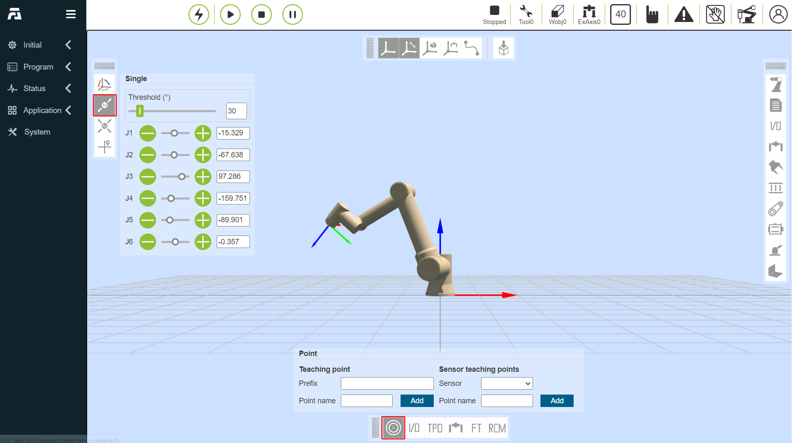

Robot manual teaching
========================

Manual teaching and recording of teaching points
-----------------------------------------------------

Manual teaching includes two methods, one is to press and hold the end drag button to drag and teach, and the other is to jog in the operation area. After teaching to the target position, the teaching point can be saved. When saving a teaching point, the coordinate system of the teaching point is the coordinate system of the current robot application. The speed and acceleration of the teaching point can be set above the operation area. The set value is the percentage of the standard speed of the robot. If it is set to 100, it is 100% of the standard speed.

.. centered:: Figure 4.1-1 Manual teaching

View teaching point information
----------------------------------

Click “Teaching Management” to display all saved teaching point information. In this interface, you can import and export teaching point files. After selecting a teaching point, click the “Delete” button to delete the point information. The values of teaching points x, y, z, rx, ry, rz and v can be modified. Enter the modified value, check the blue box on the left, and click the upper modification to modify the teaching point information. Click the “Start Run” button to perform a single-point operation of the local teaching point, and move the robot to the position of this point. In addition, users can search for teaching points by name.

.. image:: teaching_pendant_software/140.png
   :width: 6in
   :align: center

.. centered:: Figure 4.2-1 Teaching management interface

.. important:: 
   The modified values of the teaching points x, y, z, rx, ry, rz should not exceed the working range of the robot.

