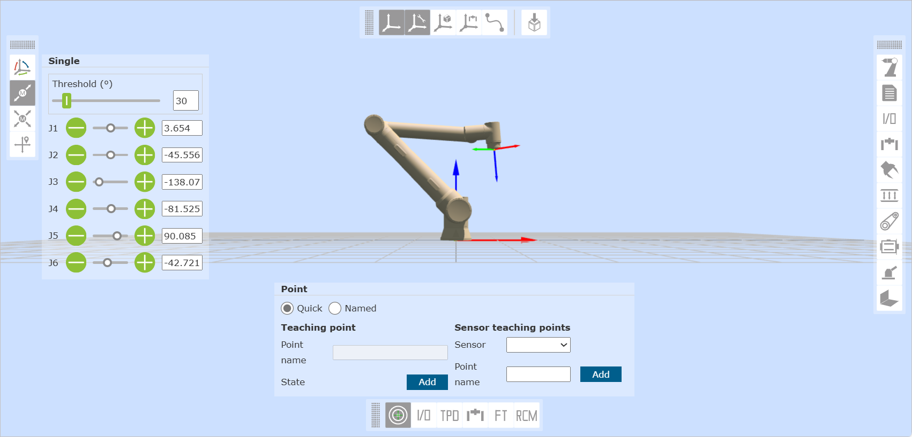

Robot manual teaching
========================

Manual teaching and recording of teaching points
-----------------------------------------------------

Manual teaching includes two methods:

- 1. Press and hold the end drag button to perform drag teaching;
- 2. Perform jog in 3D simulated robot - 3D object operation.

After teaching to the target position, you can save the teaching point in "Robot supporting functions - Point Name". When saving the teaching point, the coordinate system of the teaching point is the coordinate system of the current robot application.

.. centered:: Figure 4.1-1 Manual teaching

View teaching point information
----------------------------------

Click "Program - Points" to display all saved teaching point information. The current point mode is divided into "System mode" and "Point table mode".

In this interface, you can import and export teaching point files. After selecting a teaching point, click the "Delete" button to delete the point information. The teaching point x, y, z, rx, ry, rz and v values ​​can be modified. Enter the modified value, check the blue checkbox on the left, and click Modify above to modify the teaching point information.

Click the "Start Run" button to perform a single-point operation of the local teaching point and move the robot to the position of the point. In addition, users can search for teaching points by name.

.. image:: points/001.png
   :width: 6in
   :align: center

.. centered:: Figure 4.2-1 Teaching management interface

.. important:: 
   The modified values of the teaching points x, y, z, rx, ry, rz should not exceed the working range of the robot.
