Node graph programming
============================

.. toctree:: 
   :maxdepth: 6

Basic information
---------------------

Introduction
~~~~~~~~~~~~~~~

Node graph programming is programming software developed for robots. Its main functions and technical features are as follows:

- The connections between nodes better present the contextual logic of the program;
- Through operations such as creating nodes, connecting nodes, and editing node parameters, robot programming can be completed with just dragging operations and a small amount of parameter input;
- Helps to better visualize code and script complex and repetitive tasks faster;

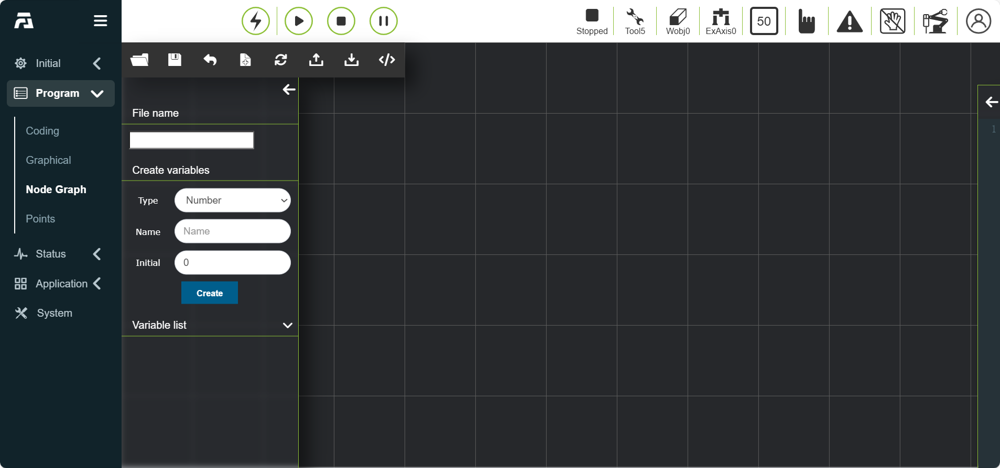

.. centered:: Figure 6.1-1 Node graph programming interface

Toolbar
~~~~~~~~~~

Use the toolbar at the top left of the Node Graph Programming page.

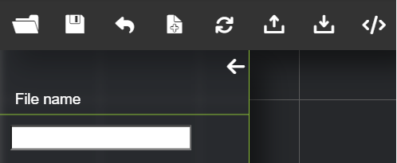

.. centered:: Figure 6.1-2 Toolbar

.. note:: 
   name：**Open**
   
   effect：Open user program file

.. note:: 

   name：**Save**
   
   effect：Save node graph edits

.. note:: 

   name：**Overload**
   
   effect：Reload the node graph content of the last operation to the local.

.. note:: 

   name：**New**
   
   effect：Create a new node graph programming file

.. note:: 

   name：**Initial**
   
   effect：Load the node graph content of the initial settings.

.. note:: 

   name：**Export**
   
   effect：After creating/opening the node graph programming file, click the "Export" button to generate an export file (json format).

.. note:: 

   name：**Import**
   
   effect：Click the "Import" button to pop up the import prompt box. Select the file to be imported and click Import. The file content will be displayed in the node graph programming workspace.

.. note:: 

   name：**Code**
   
   effect：After the node graph is connected, Lua code is generated.

Node graph operations
-------------------------

Node program
~~~~~~~~~~~~~~

For node programs, you need to right-click the mouse in a blank space to open the node program selection bar. Program instructions are mainly divided into logic instructions, motion instructions, force control instructions, control instructions, Modbus instructions, expansion axis and other instructions.

The input box above the node program selection bar allows fuzzy search to quickly locate the required node instructions.

The specific node program operation process is as follows:

- Click "Begin" to start the node and create the starting node programming location;
- Click on the selected program instruction node, the corresponding node diagram is displayed in the workspace, and the instruction parameters can be selected and entered in the drop-down box;
- The functions of the arrows on the right side of the command node: 1. A single arrow icon connects to the next node; 2. Multiple arrow icons, the first "Body" arrow icon connects to the content node, and the second "Completed" icon connects to the next node;
- Connect the "Begin" start node to the completed node program to end the node programming operation;
  
logical instruction node
~~~~~~~~~~~~~~~~~~~~~~~~~~

Goto instruction
++++++++++++++++++

Click "Goto" on the relevant command node to enter the node graph editing interface.

"Goto" command, the first "Body" arrow icon connects to the body content node, and the second arrow icon connects to the subsequent jump position goto instruction node. (This command requires a certain programming foundation. If you need help, please contact us)

- Jump name: Enter the jump name to determine the jump location

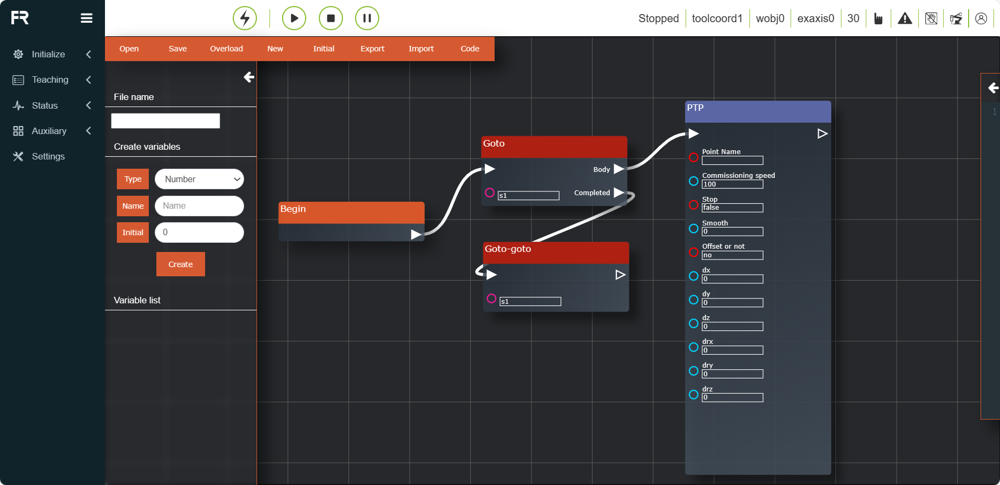

.. centered:: Figure 6.2.1 "Goto" command node interface

Wait instruction
+++++++++++++++++++++++++++

Click the "Wait" related command node to enter the node diagram editing interface.

This instruction is a delay instruction, divided into four parts: "WaitMs", "WaitDI", "WaitMultiDI" and "WaitAI".

1. "Wait" command node, parameters:

- Waiting time (ms): The unit of delay waiting time is milliseconds. Enter the number of milliseconds to wait.

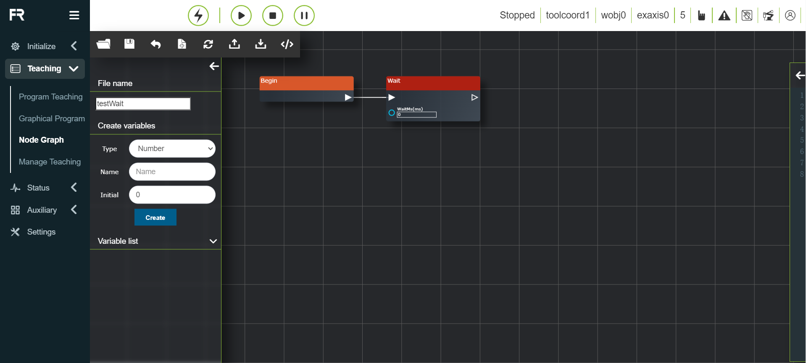

.. centered:: Figure 6.2.2 "Wait" command node interface

1. "WaitDI" command node, parameters:

- DI port number: Ctrl-DI0 ~ Ctrl-CI7(WaitDI,[0~15]), End-DI0 ~ End-DI1(WaitToolDI,[0~1])
- Status: false/true
- Maximum time (ms): 0 ~ 10000
- Waiting for timeout processing: stop reporting errors/continue execution/wait forever

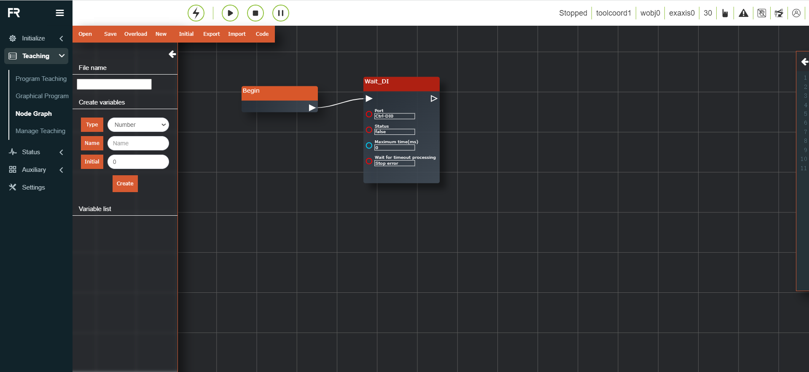

.. centered:: Figure 6.2.3 "WaitMultiDI" command node interface

1. "WaitMultiDI" command node, parameters:

- Condition: and/or
- Conditional selection: Select the port number that the bit status is enabled, separated by commas, for example DI0, DI1
- True value corresponding port: Select the port number of the true value, separated by commas, for example DI0, DI1
- Maximum time (ms): 0 ~ 10000, maximum waiting time
- Waiting for timeout processing: stop reporting errors/continue execution/wait forever

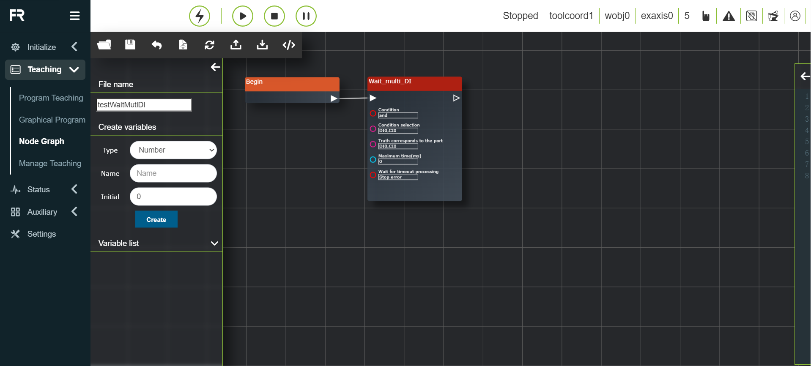

.. centered:: Figure 6.2.4 "WaitMultiDI" command node interface

4."WaitAI" command node, parameters:

- Condition: and/or
- AI port number: Ctrl-AI0 ~ Ctrl-AI1(WaitAI,[0~1]), End-AI0(WaitToolAI,[0])
- Condition: greater than/less than
- Value (%): 1 ~ 100
- Maximum time (ms): 0 ~ 10000
- Waiting for timeout processing: Stop error reporting/continue execution/keep waiting. When waiting for timeout processing and keep waiting, the maximum time defaults to 0.

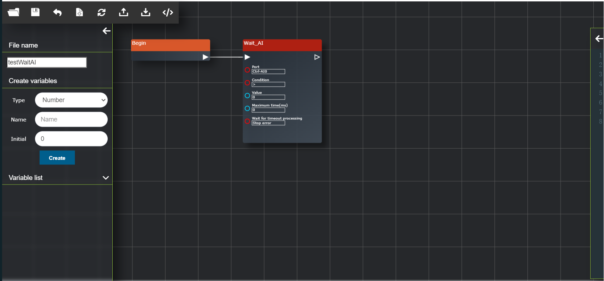

.. centered:: Figure 6.2.5 "WaitAI" command node interface

Pause instruction
++++++++++++++++++++

Click the "Pause" command node to enter the node graph editing interface.

This command is a pause command. Insert this command in the program. When the program executes this command, the robot will be in a paused state. If you want to continue running, click the "Pause/Resume" button in the control area.

"Pause" command node, parameters:

- Pause type: no function, cylinder not in place, etc.

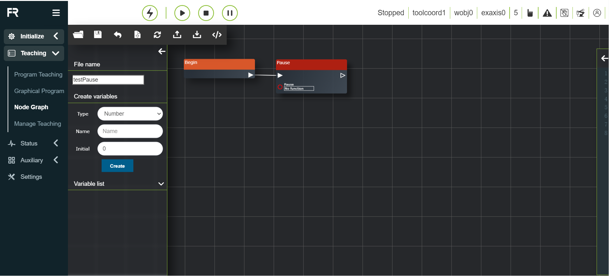

.. centered:: Figure 6.2.6 "Pause" command node interface

Dofile instruction
++++++++++++++++++++

Click the "Dofile" command node to enter the node graph editing interface

This command is a pause command. Insert this command in the program. When the program executes this command, the robot will be in a paused state. If you want to continue running, click the "Pause/Resume" button in the control area.

"Dofile" command node, parameters:

- dofile: create the generated file name
- Which layer to call: first layer/second layer
- ID number: the corresponding position id of the level to which it belongs

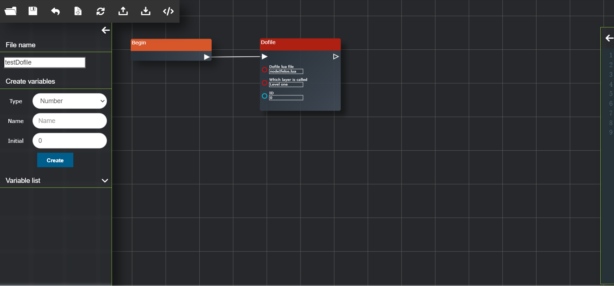

.. centered:: Figure 6.2.7 “Dofile” command node interface

Motion command node
~~~~~~~~~~~~~~~~~~~~~~

PTP instruction
+++++++++++++++++

Click the "PTP" command node to enter the node graph editing interface

You can select the point you need to reach. The smooth transition time setting can realize the continuous movement from this point to the next point. Whether to set the offset, you can choose the offset based on the base coordinate system and the offset based on the tool coordinate, and x, y will pop up. z, rx, ry, rz offset settings, the specific PTP path is the optimal path automatically planned by the motion controller

"PTP" command node, parameters:

- Point name: Teaching point
- Debugging speed (%): 0 ~ 100
- Stop: false/true
- Smooth transition (ms): smooth transition time 0 ~ 500
- Whether to offset No/base coordinate offset/tool ​​coordinate offset. When No is selected, the dx~drz parameter values ​​will not take effect.
- dx~drz: offset

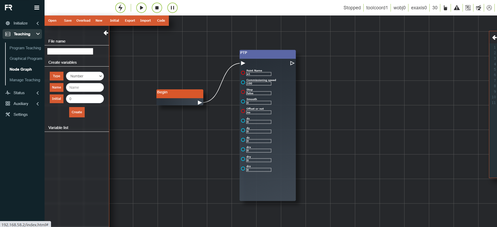

.. centered:: Figure 6.2.8 "PTP" command node interface

LIN instruction
+++++++++++++++++

Click the "LIN" command node to enter the node graph editing interface

The function of this command is similar to the "point to point" command, but the path to the point reached by this command is a straight line.

"LIN" command node, parameters:

- Point name: Teaching point
- Debugging speed (%): 0 ~ 100
- Stop: false/true. When true is selected, the smooth transition parameter value does not take effect.
- Smooth transition (mm): Smooth transition radius 0 ~ 1000
- Whether to offset: No/base coordinate offset/tool ​​coordinate offset. When No is selected, the dx~drz parameter values ​​will not take effect.
- Whether to seek position: false/true
- Position search point variables: REF0~99/RES0~99. When false is selected for position search, the parameters will not take effect;
- Weld cache data selection: execution planning data/execution record data. When the selected point name is "seamPos", the parameters will take effect, otherwise they will not take effect;
- Board type: corrugated board/corrugated board/fence board/oil drum/corrugated shell steel. When the selected point name is "seamPos", the parameters will take effect, otherwise they will not take effect;

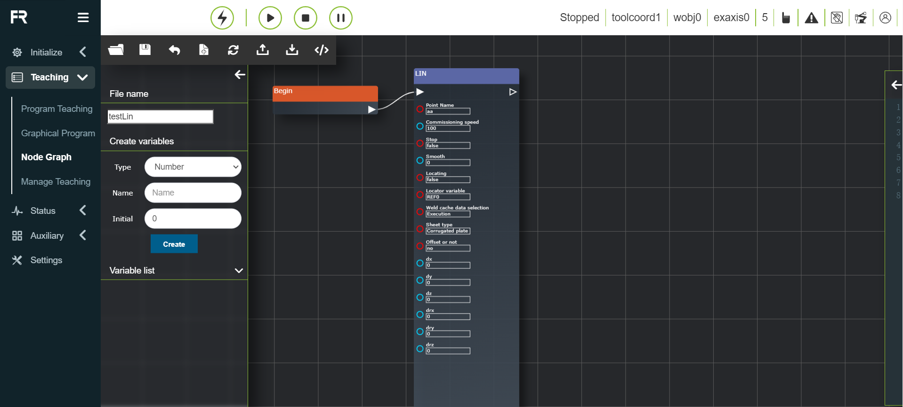

.. centered:: Figure 6.2.9 “LIN” command node interface

ARC instruction 
+++++++++++++++++

Click the "ARC" command node to enter the node graph editing interface

The arc motion contains two points. The first point is the transition point in the middle of the arc, and the second point is the end point. Both the transition point and the end point can be offset or not. You can choose to offset based on the base coordinate system or offset based on the tool coordinate. Shift, set x, y, z, rx, ry, rz offset, the end point can set a smooth transition radius to achieve continuous motion effect

"ARC" command node, parameters:

- Arc middle point: teaching point
- Whether to offset: No/base coordinate offset/tool ​​coordinate offset. When No is selected, the dx~drz parameter values ​​will not take effect.
- dx~drz: offset
- Arc end point: teaching point
- Whether to offset: No/base coordinate offset/tool ​​coordinate offset. When No is selected, the dx~drz parameter values ​​will not take effect.
- dx~drz: offset
- Debugging speed (%): 0 ~ 100
- Stop: false/true. When true is selected, the smooth transition parameter value does not take effect.
- Smooth transition (mm): Smooth transition radius 0 ~ 1000

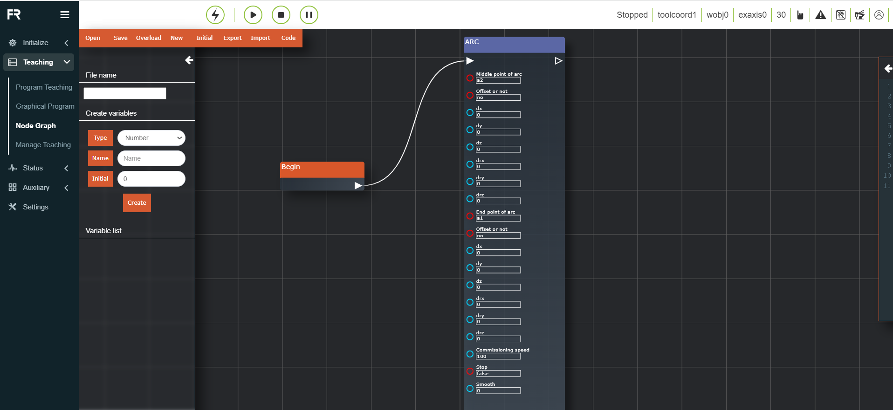

.. centered:: Figure 6.2.10 "ARC" command node interface

Circle instruction
++++++++++++++++++++

Click the "Circle" command node to enter the node graph editing interface

The full circle motion includes two points. The first point is the middle transition point 1 of the full circle, and the second point is the middle transition point 2 of the full circle. Transition point 2 can be set to be offset. This offset takes effect on both transition point 1 and Transition point 2

"Circle" command node, parameters:

- Middle point 1 of the whole circle: teaching point
- Middle point 2 of the whole circle: teaching point
- Debugging speed (%): 0 ~ 100
- Whether to offset: No/base coordinate offset/tool ​​coordinate offset. When No is selected, the dx~drz parameter values ​​will not take effect.
- dx~drz: offset

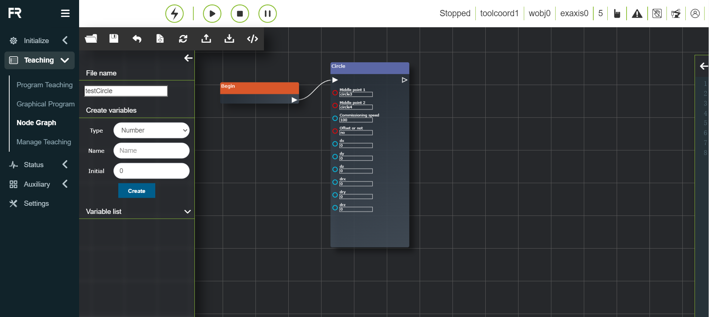

.. centered:: Figure 6.2.11 "Circle" command node interface

Spiral instruction
+++++++++++++++++++++

Click the "Spiral" command node to enter the node graph editing interface

The spiral motion contains three points, which form a circle. On the third point setting page, the parameter settings include the number of spiral turns, attitude correction angle, radius increment and rotation axis direction increment. The number of spiral turns is The number of movement circles of the spiral. The attitude correction angle corrects the attitude at the end of the spiral and the attitude of the first point of the spiral. The radius increment is the increment of the radius of each circle. The rotation axis direction increment is the direction of the spiral axis. Increment. Set whether to offset, the offset takes effect on the entire spiral trajectory.

"Spiral" command node, parameters:

- Spiral middle point 1: Teaching point
- Spiral middle point 2: teaching point
- Spiral middle point 3: teaching point
- Debugging speed (%): 0 ~ 100
- Whether to offset: No/base coordinate offset/tool coordinate offset. When No is selected, the dx~drz parameter values will not take effect.
- dx~drz: offset
- Number of spiral turns: 0 ~ 100
- Attitude angle correction rx(°): -1000 ~ 1000
- Attitude angle correction (°): -1000 ~ 1000
- Attitude angle correction rz(°): -1000 ~ 1000
- Radius increment (mm): -100 ~ 100
- Increment in rotation axis direction (mm): -100 ~ 100

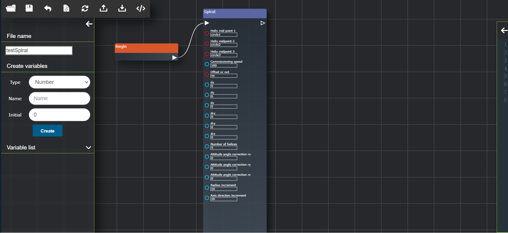

.. centered:: Figure 6.2.12 "Spiral" command node interface

N-Spiral instruction
++++++++++++++++++++++++

Click the "N-Spiral" command node to enter the node graph editing interface

The new spiral motion is an optimized version of spiral motion. This instruction only requires one point and the configuration of each parameter to achieve spiral motion. The robot takes the current position as the starting point, and the user sets the debugging speed, offset or not, the number of spiral turns, the spiral inclination angle, the initial radius, the radius increment, the rotation axis direction increment and the rotation direction. The number of spiral turns is the length of the spiral. The number of movement circles, the spiral inclination angle is the angle between the Z axis of the tool and the horizontal direction, the attitude correction angle corrects the attitude at the end of the spiral and the attitude of the first point of the spiral, the initial radius is the radius of the first circle, and the radius increment That is, the increment of the radius of each circle, the increment of the rotation axis direction is the increment of the spiral axis direction, and the rotation direction is clockwise and counterclockwise.

"N-Spiral" command node, parameters:

- Starting point of spiral: teaching point
- Debugging speed (%): 0 ~ 100
- Whether to offset: No/base coordinate offset/tool coordinate offset. When No is selected, the dx~drz parameter values will not take effect.
- dx~drz: offset
- Number of spiral turns: 0 ~ 100
- Helix inclination angle (°): -100 ~ 100
- Initial radius: 0 ~ 100
- Radius increment (mm): -100 ~ 100
- Increment in rotation axis direction (mm): -100 ~ 100
- Direction of rotation: clockwise/counterclockwise

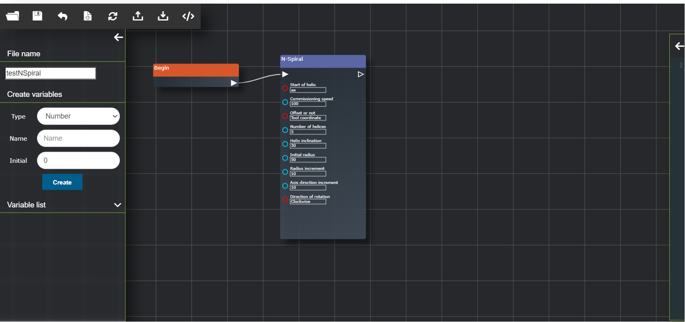

.. centered:: Figure 6.2.13 “N-Spiral” command node interface

Spline instruction
++++++++++++++++++++

Click the "Spline" command node to enter the node graph editing interface

This command is divided into three parts: the start of the spline group, the spline segment and the end of the spline group. The start of the spline group is the starting mark of the spline movement. The current node graph of the spline segment only contains the SPL segment. The end of the spline group is The end mark of the spline movement.

"Spline" command node, parameters:

- Point name: Teaching point
- Debugging speed (%): 0 ~ 100

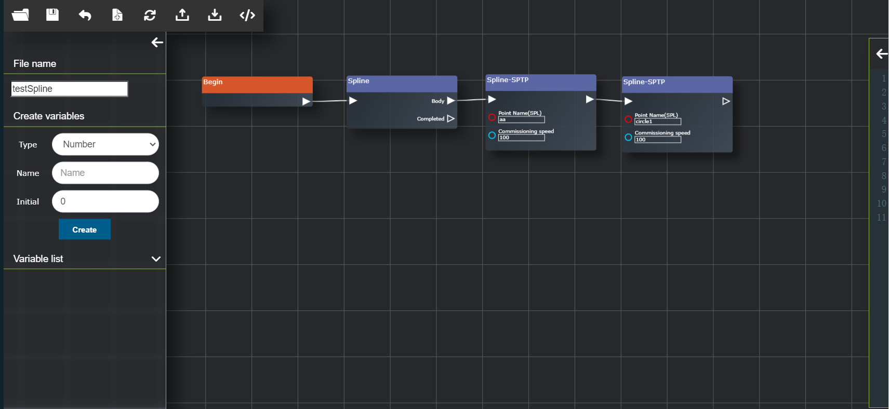

.. centered:: Figure 6.2.14 "Spline" command node interface

N-Spline instruction
++++++++++++++++++++++

Click the "N-Spline" command node to enter the node graph editing interface

This instruction is a spline instruction algorithm optimization instruction. It will replace the existing spline instruction later. This instruction is divided into three parts: multi-point trajectory start, multi-point trajectory segment and multi-point trajectory end. The multi-point trajectory starts with multi-point trajectory. The starting mark of the movement. The multi-point track segment means setting each track point. Click the icon to enter the point adding interface. The end of the multi-point track is the end mark of the multi-point track movement. Here you can set the control mode and debugging speed. The control mode is divided into for a given control point and a given path point.

"N-Spline" command node, parameters:

- Control mode: teaching point
- Point name: Teaching point
- Debugging speed (%): 0 ~ 100
- Smooth transition radius: 0 ~ 1000
- whether last point: no/yes

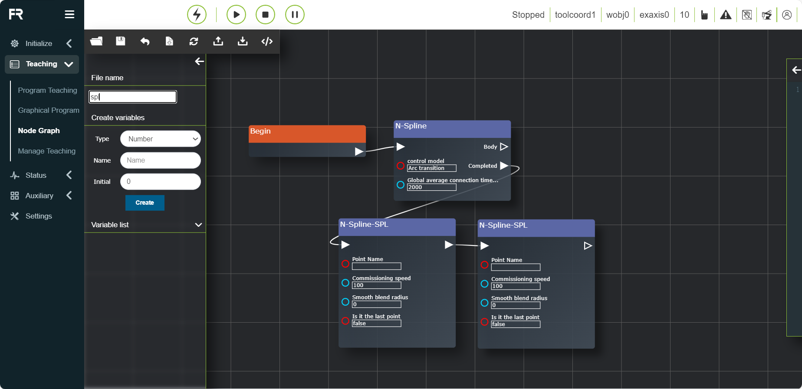

.. centered:: Figure 6.2.15 “N-Spline” command node interface

Weave instruction
++++++++++++++++++++

Click the "Weave" command node to enter the node graph editing interface

This command consists of two parts. The first part selects the weaving number of the configured parameters. The program for connecting the Body to represent the connection node is executed between "Start Weaving" and "Stop Weaving".

"Weave" command node, parameters:

- Number: 0~7

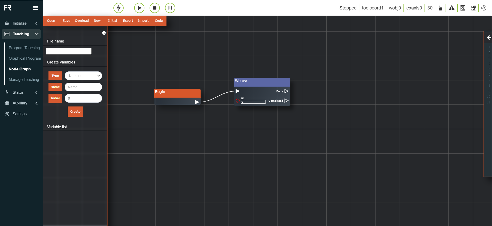

.. centered:: Figure 6.2.16 “Weave” command node interface

TPD instruction
+++++++++++++++++

Click the "TPD" command node to enter the node graph editing interface

In this command, the user first needs to have a recorded trajectory.

When programming, first use the point-to-point command to reach the starting point of the corresponding trajectory, then select the trajectory in the trajectory recurrence command, select the smooth trajectory, and set the debugging speed. The trajectory loading command is mainly used to read the trajectory file in advance and extract it into trajectory instructions, which can be better applied to conveyor belt tracking scenarios.

"TPD" command node, parameters:

- Track name: recorded track
- Smooth trajectory: No/Yes
- Debugging speed (%): 0 ~ 100, default value is 25

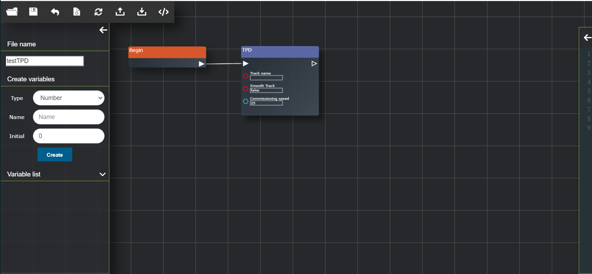

.. centered:: Figure 6.2.17 "TPD" command node interface

Offset instruction
+++++++++++++++++++++

Click the "Offset" command node to enter the node graph editing interface

This command is an overall offset command. Enter each offset. The program connecting the Body to represent the connection node is executed between start and close. The motion command in the middle will be offset based on the base coordinates (or workpiece coordinates).

"Offset" command node, parameters:

- Δx: offset, -300~300
- Δy: offset, -300~300
- Δz: offset, -300~300
- Δrx: offset, -300~300
- Δry: offset, -300~300
- Δrz: offset, -300~300

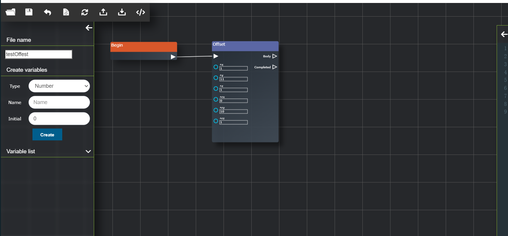

.. centered:: Figure 6.2.18 "Offset" command node interface

ServoCart instruction
+++++++++++++++++++++++++++

Click the "ServoCart" command node to enter the node diagram editing interface

Servo control (Cartesian space motion) instruction, which can control robot movement through absolute pose control or based on the current pose offset.

"ServoCart" command node, parameters:

- Movement mode: absolute position/base coordinate offset/tool coordinate offset
- x: offset, -300~300
- y: offset, -300~300
- z: offset, -300~300
- rx: offset, -300~300
- ry: offset, -300~300
- rz: offset, -300~300
- Proportional coefficient x: 0~1
- Proportional coefficient y: 0~1
- Proportional coefficient z: 0~1
- Proportional coefficient rx: 0~1
- Proportional coefficient ry: 0~1
- Proportional coefficient rz: 0~1
- Acceleration (%): 0~100
- Speed (%): 0~100
- Instruction cycle (s): 0.001~0.016
- Filter time (s): 0~1
- Scale up: 0~100

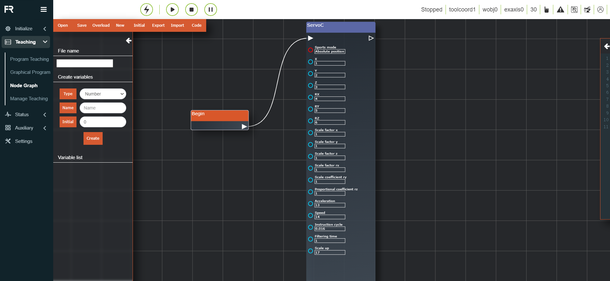

.. centered:: Figure 6.2.19 “ServoCart” command node interface

Trajectory instruction
+++++++++++++++++++++++++++

Click the "Trajectory" command node to enter the node graph editing interface

In this command, the user first needs to have a recorded trajectory.

"Trajectory" command node, parameters:

- Select track file: recorded track
- Debugging speed (%): 0 ~ 100, default value is 25

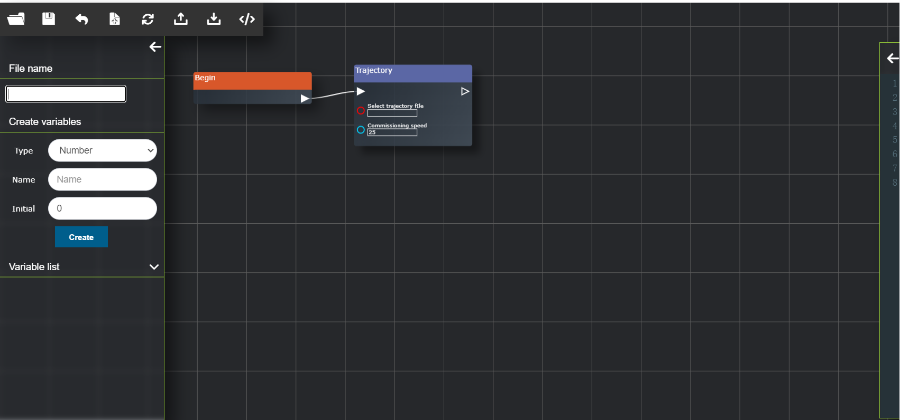

.. centered:: Figure 6.2.20 “Trajectory” command node interface

TrajectoryJ instruction
+++++++++++++++++++++++++

Click the "TrajectoryJ" command node to enter the node graph editing interface

In this command, the user first needs to have a recorded trajectory, and the trajectory file can be imported in advance in the teaching program interface. The trajectory command and trajectory J command are suitable for the general interface of the camera directly giving the trajectory. When there is a discrete trajectory point file in a fixed format, it can be imported into the system to make the robot move according to the trajectory of the imported file.

"TrajectoryJ" command node, parameters:

- Select track file: recorded track
- Debugging speed (%): 0 ~ 100, default value is 25
- Track mode: path points/control points

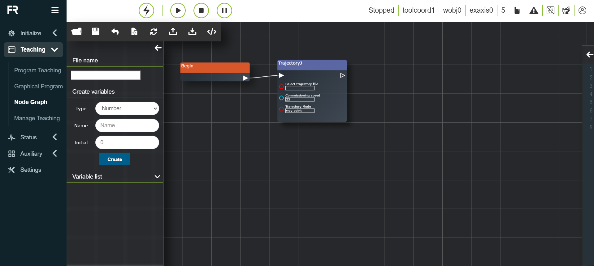

.. centered:: Figure 6.2.21 "TrajectoryJ" command node interface

DMP instruction
+++++++++++++++++

Click the "DMP" command node to enter the node graph editing interface

DMP is a trajectory imitation learning method that requires planning a reference trajectory in advance. In the command editing interface, select the teaching point as the new starting point, click "Add" and "Apply" to save the command. The specific path of DMP is a new trajectory that imitates the reference trajectory with a new starting point.

"DMP" command node, parameters:

- Point name: teaching point
- Debugging speed (%): 0 ~ 100, default value is 100

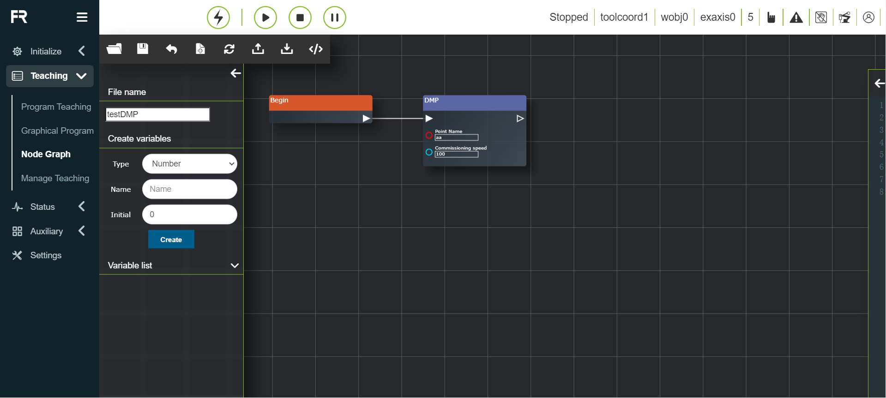

.. centered:: Figure 6.2.22 "DMP" command node interface

WPSTrsf instruction
+++++++++++++++++++++++++++++++++

Click the "WPSTrsf" command node to enter the node graph editing interface

Select the workpiece coordinate system to be automatically converted, click "Add" and "Apply" to save the instruction. When adding PTP and LIN instructions, connect them to the Body to implement execution within the instruction, and the points in the workpiece coordinate system are automatically converted.

"WPSTrsf" command node, parameters:

- Workpiece coordinate system: workpiece coordinate series list

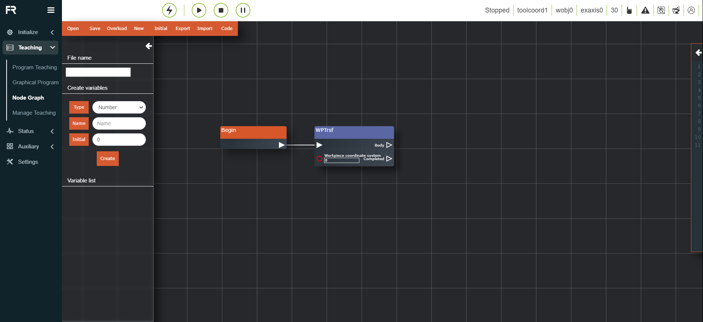

.. centered:: Figure 6.2.23 "WPSTrsf" command node interface

ToolTrst instruction
+++++++++++++++++++++++

Click the "ToolTrst" command node to enter the node graph editing interface

Select the tool coordinate system to be automatically converted, click "Add" and "Apply" to save the instruction. When adding PTP and LIN instructions, connect them to the Body to implement execution within the instruction, and the points in the tool coordinate system are automatically converted.

"ToolTrst" command node, parameters:

- Tool coordinate system: tool coordinate series list

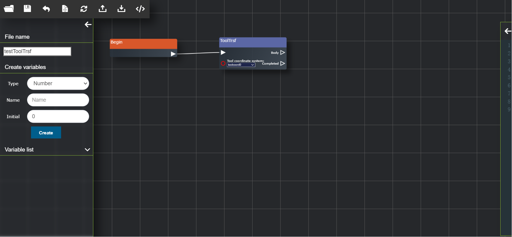

.. centered:: Figure 6.2.24 “ToolTrst” command node interface

Control command interface
~~~~~~~~~~~~~~~~~~~~~~~~~~~~~

Digital IO instruction node
++++++++++++++++++++++++++++++

Click the "Set DO"/"Get DI" command node to enter the node diagram editing interface

This instruction is an IO instruction, which is divided into two parts: setting IO (SetDO/SPLCSetDO) and getting IO (GetDI/SPLCGetDI).

1. "SetDO" command node, parameters:

- Port: Ctrl-DO0 ~ Ctrl-CO7 (blocking: SetDO, non-blocking: SPLCSetDO, [0~15]), End-DO0 ~ End-DO1 (blocking: SetToolDO, non-blocking: SPLCSetToolDO, [0~1])
- Status: false/true
- Whether to block: blocking/non-blocking
- Smooth trajectory: Break/Serious
- Whether to apply threads: No/Yes
  
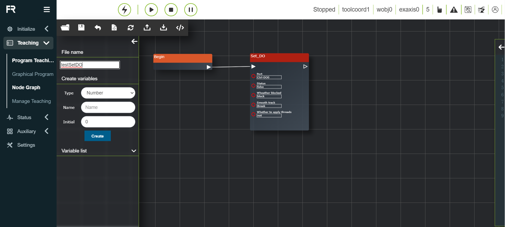

.. centered:: Figure 6.2.25 “SetDO” command node interface

2. "GetDI" command node, parameters:

- Port: Ctrl-DI0 ~ Ctrl-CI7 (blocking: GetDI, non-blocking: SPLCGetDI, [0~15]), End-DI0 ~ End-DI1 (blocking: GetToolDI, non-blocking: SPLCGetToolDI, [0~1])
- Whether to block: blocking/non-blocking
- Status: false/true
- Maximum waiting time (ms): 0 ~ 10000
- Whether to apply threads: No/Yes
  
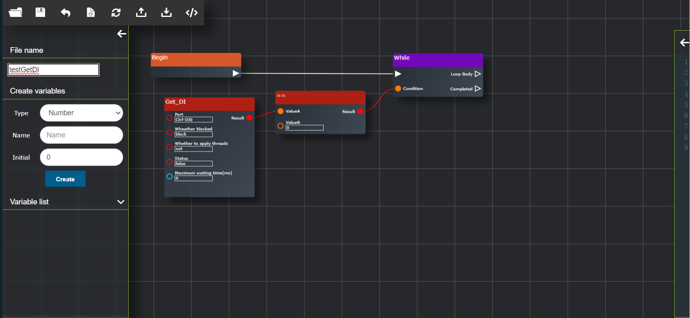

.. centered:: Figure 6.2.26 "GetDI" command node interface

Simulate AI commands
++++++++++++++++++++++

Click the "Set AO"/"Get AI" command node to enter the node graph editing interface.

In this command, it is divided into two functions: setting analog output (SetAO/SPLCSetAO) and getting analog input (GetAI/SPLCGetAI).

1. "SetAO" command node, parameters:

- Port: Ctrl-AO0 ~ Ctrl-AO1 (blocking: SetAO, non-blocking: SPLCSetAO, [0~1]), End-AO0 (blocking: SetToolAO, non-blocking: SPLCSetToolAO, [0])
- Value (%): 0 ~ 100
- Whether to block: blocking/non-blocking
- Whether to apply threads: No/Yes
  
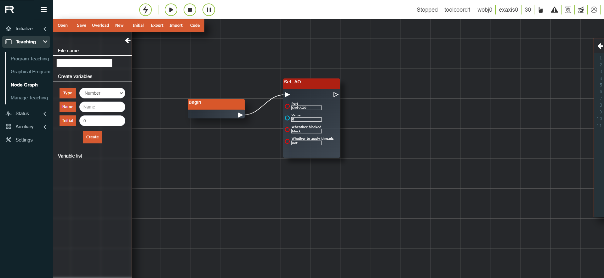

.. centered:: Figure 6.2.27 “SetAO” command node interface
   
2. "GetAI" command node, parameters:

- Port: Ctrl-AI0 ~ Ctrl-DI1 (blocking: GetAI, non-blocking: SPLCGetAI, [0~1]), End-AI0 (blocking: GetToolAI, non-blocking: SPLCGetToolAI, [0])
- Condition: greater than/less than
- Value (%): 0 ~ 100
- Maximum time (ms): 0 ~ 10000
- Whether to block: blocking/non-blocking
- Whether to apply threads: No/Yes
  
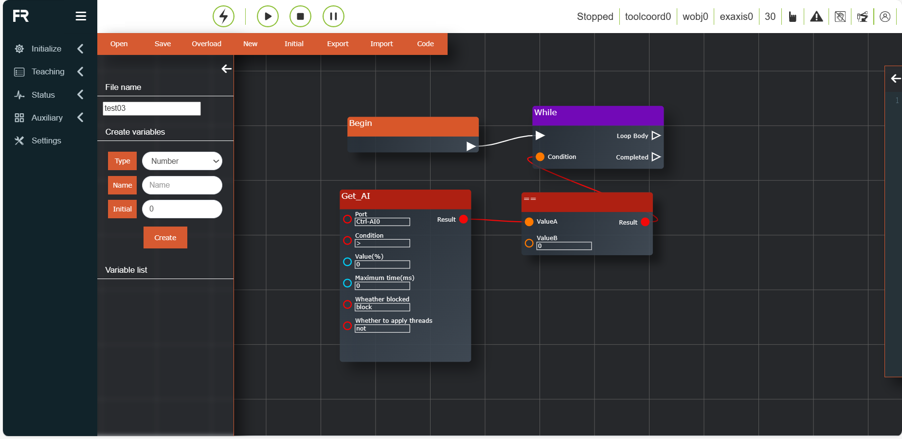

.. centered:: Figure 6.2.28 "GetAI" command node interface

Virtual IO command node
+++++++++++++++++++++++++

Click the "Set Simulated External DI"/"Set Simulated External AI" command node to enter the node diagram editing interface.

This instruction is a virtual IO control instruction that can set the simulated external DI and AI status and obtain the simulated DI and AI status.

1. "Set simulated external DI" command node, parameters:

- Port: Vir-Ctrl-DI0 ~ Vir-Ctrl-DI15(SetVirtualDI,[0~15]), Vir-End-DI0 ~ Vir-End-DI1(SetVirtualToolDI,[1~2])
- Status: false/true
  
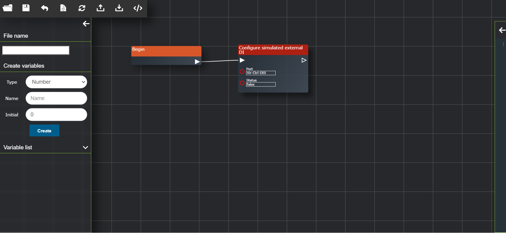

.. centered:: Figure 6.2.29 "Set up simulated external DI" command node interface
   
2. "Set simulated external AI" command node, parameters:

- Port: Vir-Ctrl-AI0 ~ Vir-Ctrl-AI0(SetVirtualAI,[0~1]), Vir-End-AI0(SetVirtualToolAI,[0])
- Value (v/ma): 0 ~ 20

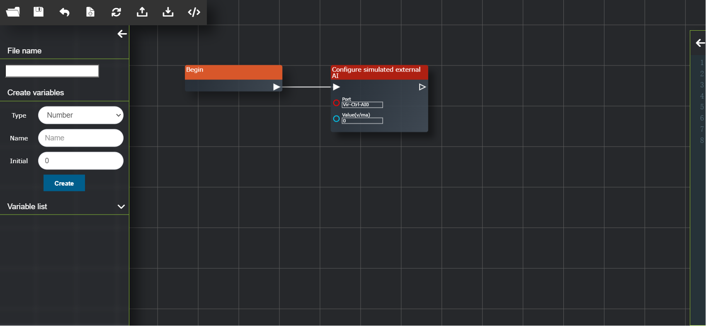

.. centered:: Figure 6.2.30 "Set up simulated external AI" command node interface

Extended IO command node
+++++++++++++++++++++++++++++

Click the "Get simulated external DI"/"Get simulated external AI" command node to enter the node diagram editing interface.

Aux-IO is a command function used by the robot to communicate with the PLC to control external expansion IO. It requires the robot to establish UDP communication with the PLC.

1. "Get simulated external DI" command node, parameters:

- Port: Vir-Ctrl-DI0 ~ Vir-Ctrl-DI15(GetVirtualDI,[0~15]), Vir-End-DI0 ~ Vir-End-DI1(GetVirtualToolDI,[1~2])
  
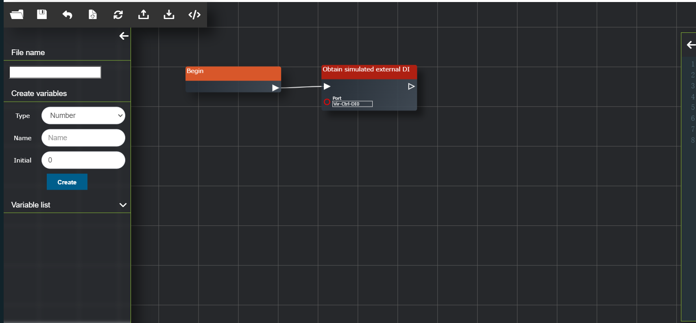

.. centered:: Figure 6.2.31 "Get simulated external DI" command node interface
   
2. "Set simulated external AI" command node, parameters:

- Port: Vir-Ctrl-AI0 ~ Vir-Ctrl-AI0(GetVirtualAI,[0~1]), Vir-End-AI0(GetVirtualToolAI,[0])

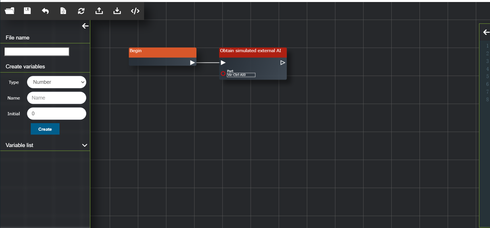

.. centered:: Figure 6.2.32 "Set up simulated external AI" command node interface

3. "Configure UDP communication" command node, parameters:

- ip: ip address
- port: port number
- Communication cycle (ms): 0 ~ 10000

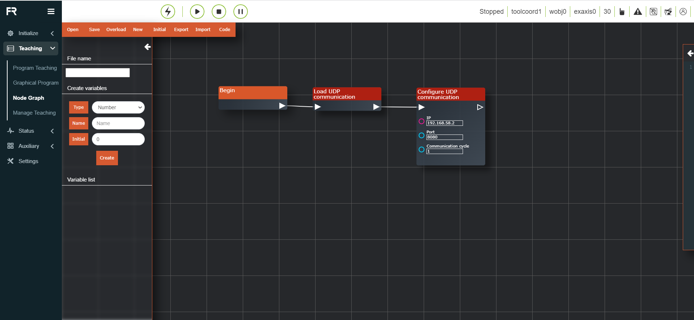

.. centered:: Figure 6.2.33 "Configure UDP Communication" command node interface

MoveDO instruction
+++++++++++++++++++++

Click the "MoveDO" command node to enter the node graph editing interface

This instruction implements the function of continuously outputting DO signals according to the set interval during linear motion.

"MoveDO" command node, parameters:

- Port: Ctrl-DO0 ~ Ctrl-DO0(MoveDOStart,[0~15]), End-DO1(MoveDOStart,[0~1])
- Setting interval (mm): 0 ~ 500
- Output pulse duty cycle (%): 0 ~ 99
  
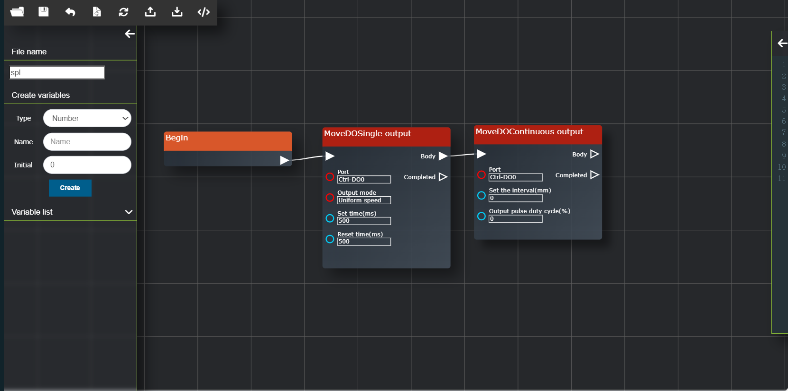

.. centered:: Figure 6.2.34 "MoveDO" command node interface

ToolList instruction
+++++++++++++++++++++++++++++

Click the "SetToolList"/"SetWobToolList" related command node to enter the node diagram editing interface.

In this command, it is divided into two functions: "SetToolList" and "SetWobToolList".

Select the tool coordinate system name and click "Apply" to add this instruction to the program. When the program runs this statement, the tool coordinate system of the robot will be set.

1. "SetToolList" command node, parameters:

- Tool coordinate system name: toolcoord1 ~ toolcoord14(SetToolList, [0~14]), etoolcoord0 ~ etoolcoord14(SetExToolList, [0~14])
  
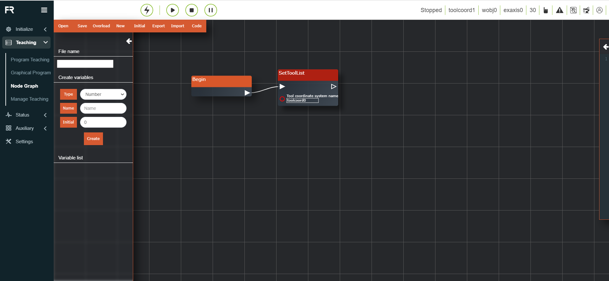

.. centered:: Figure 6.2.35"SetToolList" command node interface

2. "SetWobToolList" command node, parameters:

- Workpiece coordinate system name: wobjcoord1 ~ wobjcoord14
  
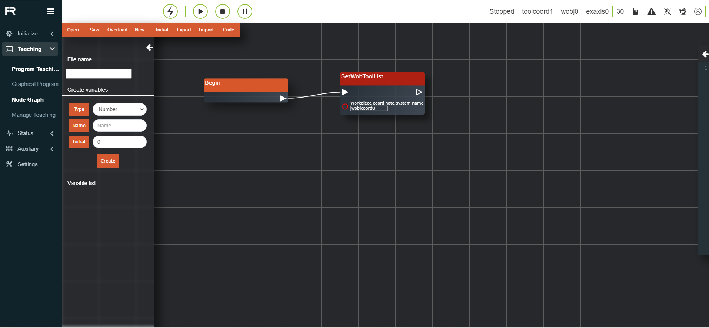

.. centered:: Figure 6.2.36 "SetWobToolList" command node interface

Mode instruction
++++++++++++++++++

Click the "Mode" command node to enter the node graph programming interface

This instruction can switch the robot to manual mode. It is usually added at the end of a program so that the user can automatically switch the robot to manual mode and drag the robot after the program is finished.

"Mode" command node, parameters:

- Mode switch: manual mode

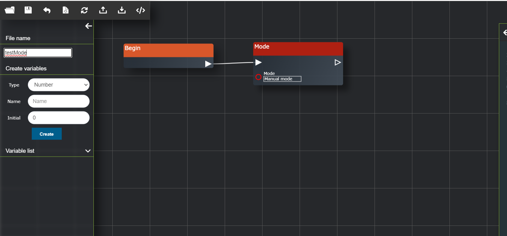

.. centered:: Figure 6.2.37 “Mode” command node interface

Collision instruction
++++++++++++++++++++++++++

Click the "Collision" command node to enter the node graph programming interface

This command sets the collision level. Through this command, the collision level of each axis can be adjusted in real time while the program is running, allowing for more flexible deployment of application scenarios.

"Collision" command node, parameters:

- Standard Level: Standard Level/Customized Percentage
- joint1-joint6(N): 0 ~ 100, collision threshold, array type

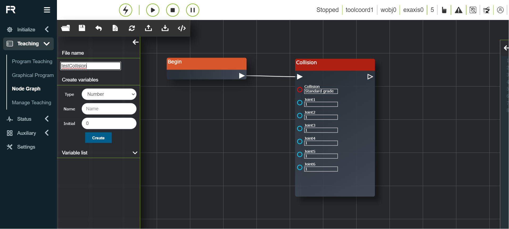

.. centered:: Figure 6.2.38 “Collision” command node interface

Acc instruction
++++++++++++++++

Click the "Acc" command node to enter the node graph programming interface

The "Acc" command is a function that allows the robot's acceleration to be set independently. By adjusting the motion command acceleration scaling factor, the acceleration and deceleration time can be increased or decreased, and the robot's action beat time can be adjusted.

"Acc" command node, parameters:

- Acceleration percentage (%): 0 ~ 100

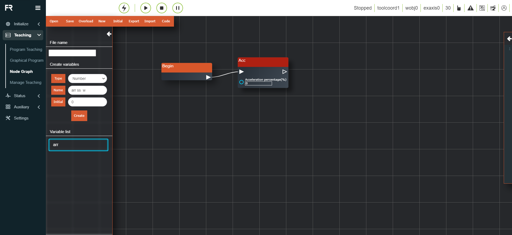

.. centered:: Figure 6.2.39 "Acc" command node interface
   
"Peripherals" command interface
~~~~~~~~~~~~~~~~~~~~~~~~~~~~~~~~~~

Gripper instruction
++++++++++++++++++++++

The command is divided into "gripper movement", "gripper activation" and "gripper reset".

In the command, the number of the gripper that has been configured and activated is displayed. The settings for the opening and closing, opening and closing speed and opening and closing torque of the gripper. The value is a percentage. Whether to block the function option. If blocking is selected, the gripper movement needs to wait for the previous one. The motion command is executed only after it is executed. Select non-blocking, that is, the gripper motion is parallel to the previous motion command.

"Gripper Movement" node, parameters:

- Gripper number: The number of the activated gripper
- Clamp position: 0~100
- Opening and closing speed: 0~100
- Opening and closing torque: 0~100
- Maximum time (ms): 0~30000
- Whether to block: false/true

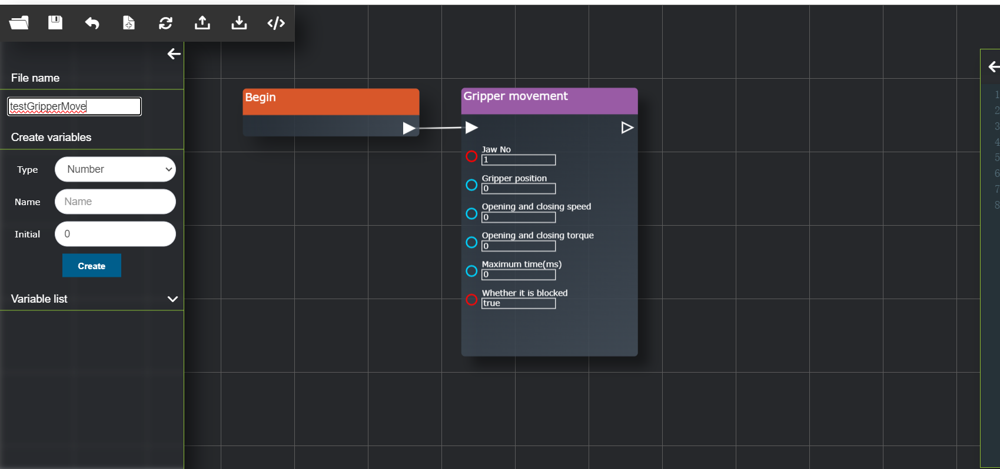

.. centered:: Figure 6.2.40 "Gripper Movement" node interface

The gripper reset command displays the configured gripper number. You can add the gripper reset command to the program.

"Gripper reset" node, parameters:

- Gripper number: The number of the activated gripper

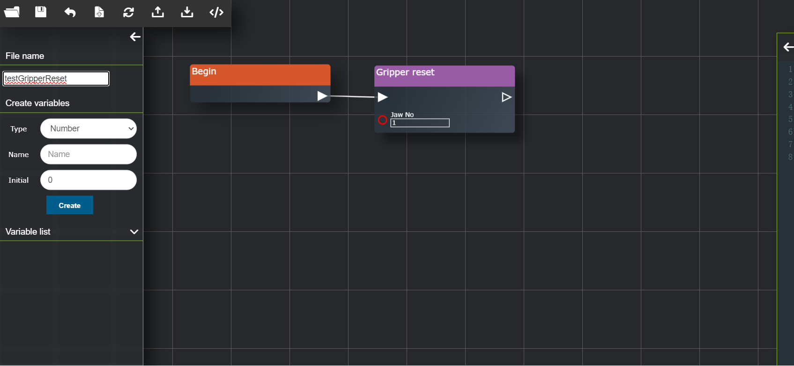

.. centered:: Figure 6.2.41 "Gripper reset" node interface

The gripper activation command displays the configured gripper number. You can add the gripper activation command to the program.

"Gripper activation" node, parameters:

- Gripper number: The number of the activated gripper

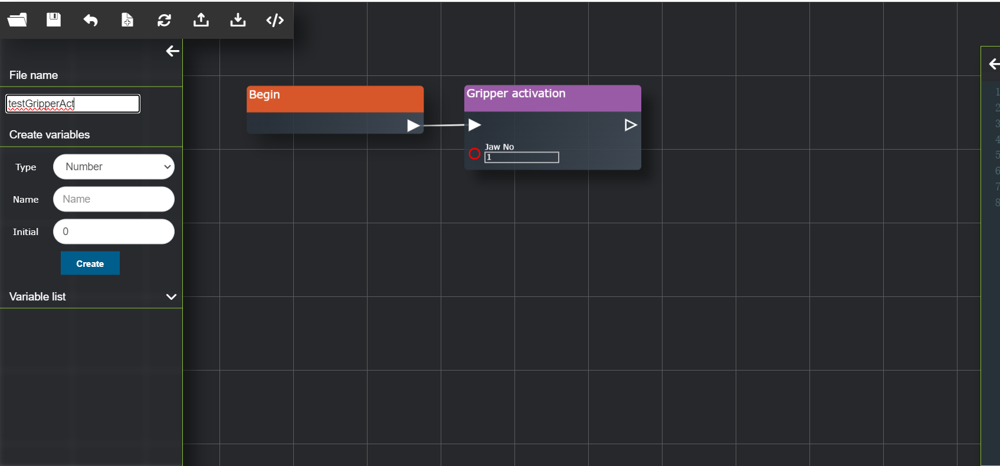

.. centered:: Figure 6.2.42 "Gripper activation" node interface

Spray instruction
++++++++++++++++++++

This command is a spray-related command that controls the spray gun to "start spraying", "stop spraying", "start clearing the gun" and "stop clearing the gun". When editing the relevant nodes of this program, you need to confirm that the spray gun peripherals have been configured, otherwise it cannot be saved. See the Robot Peripherals chapter for details.

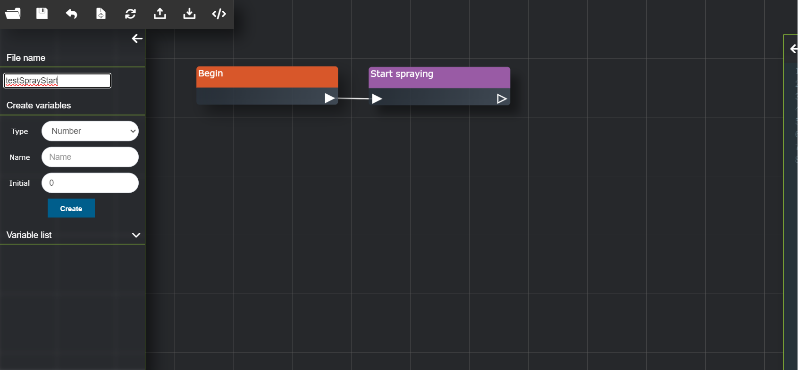

.. centered:: Figure 6.2.43 "Start spraying" command node interface

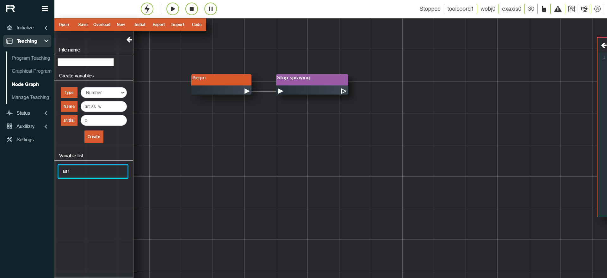

.. centered:: Figure 6.2.44 "Stop spraying" command node interface

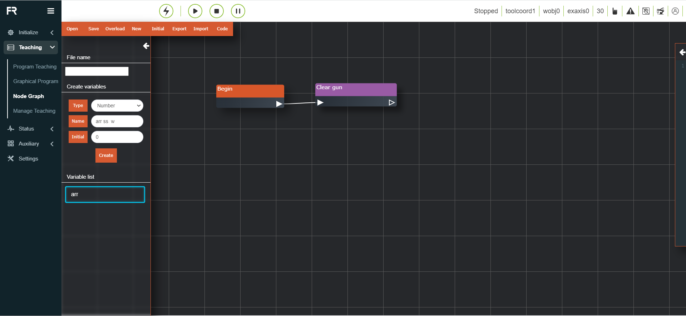

.. centered:: Figure 6.2.45 "Clearing gun" command node interface

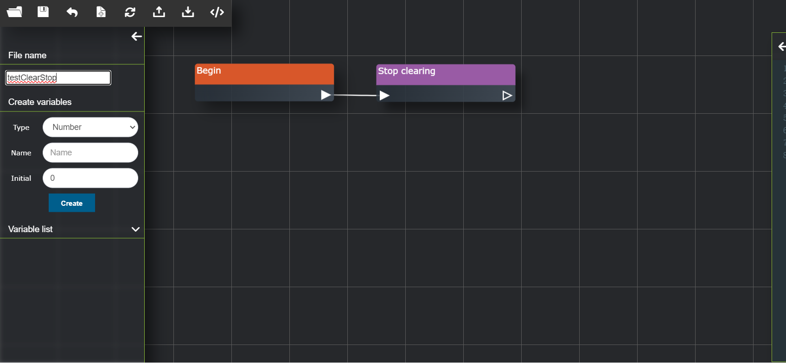

.. centered:: Figure 6.2.46 "Stop clearing" command node interface

Extended axis instructions (controller + PLC)
+++++++++++++++++++++++++++++++++++++++++++++++++

This instruction is aimed at scenarios where external axes are used. Used in combination with the PTP instruction, it can decompose the movement of a point in space in the X-axis direction into external axis motion. Select the external axis number, select synchronization as the motion mode, and select the point you want to reach.

It is divided into UDP communication loading/configuration, asynchronous movement, synchronous PTP/LIN movement, synchronous ARC movement, zero return command and enable command.

"Extended axis UDP communication configuration" command node, enter the IP address, port number and communication cycle;

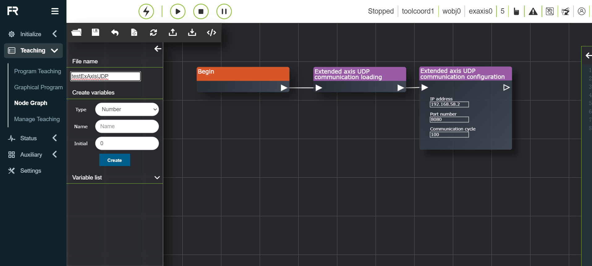

.. centered:: Figure 6.2.47 "Extended axis UDP communication configuration" command node interface

"Extended axis asynchronous motion" command node, parameters:

- Point name: Teaching point
- Debugging speed (%): 0~100

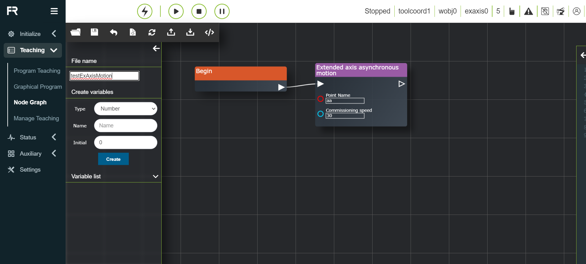

.. centered:: Figure 6.2.48 "Extended axis asynchronous motion" command node interface

"Synchronized PTP/LIN motion" command node, parameters:

-Sport selection: PTP/LIN
- Point name: Teaching point
- Debugging speed (%): 0~100

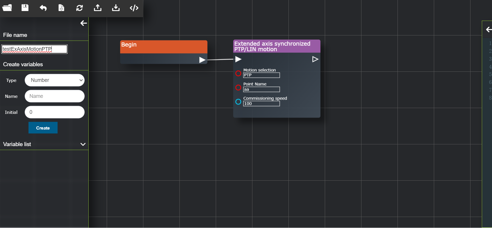

.. centered:: Figure 6.2.49 "Synchronized PTP/LIN motion" command node interface

"Synchronized ARC motion" command node, the default motion mode is ARC, parameters:

- Point name: Teaching point
- Debugging speed (%): 0~100

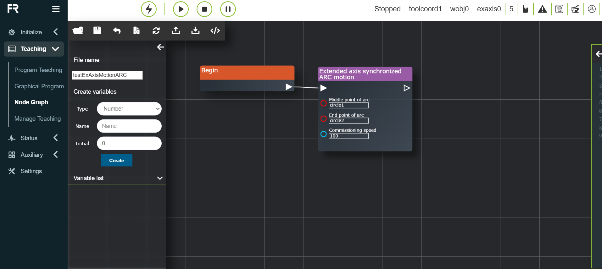

.. centered:: Figure 6.2.50 "Synchronized ARC motion" command node interface

"Return to zero" command node, parameters:

- Expansion axis number: 1~4
- Zero return method: current position zero return/negative limit zero return/positive limit zero return
- Homing speed: 0~2000, default bit 5
- Zero point hoop speed: 0~2000, default is 1

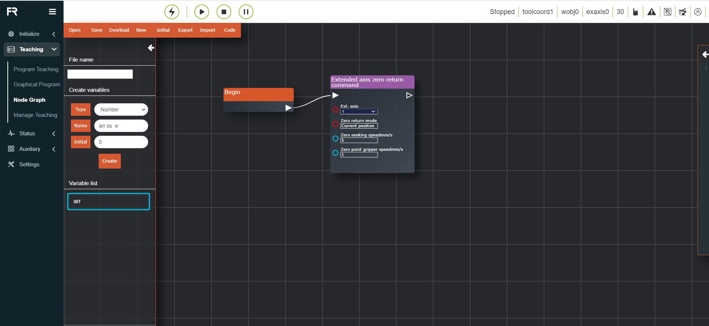

.. centered:: Figure 6.2.51 "Return to zero" command node interface

"Enable" command node,,parameters:

- Expansion axis number: 1~4

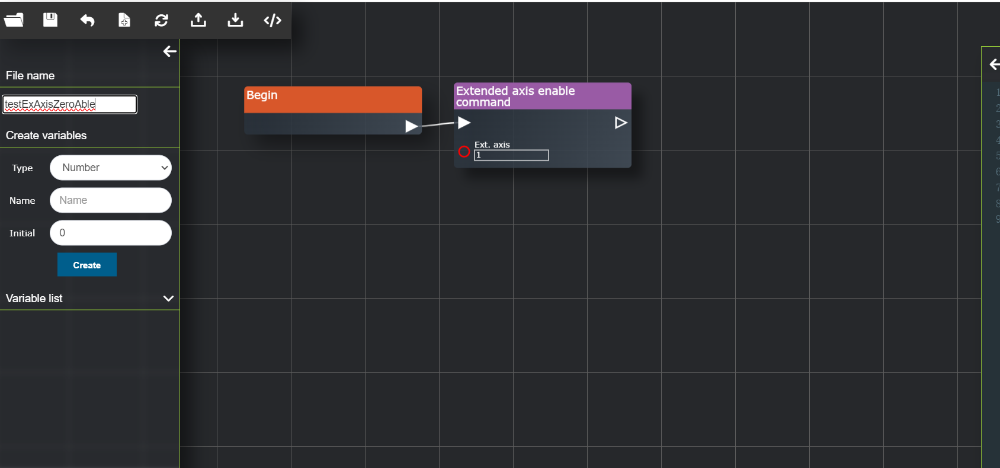

.. centered:: Figure 6.2.52 "Enable" command node interface

Extended axis instructions (controller + servo drive)
+++++++++++++++++++++++++++++++++++++++++++++++++++++++

This command can configure extended axis parameters. Set different parameters according to different control modes. The configured expansion axis can be set to its zero point.

It is divided into servo ID, control mode, servo enable and servo zero return; the control mode is further divided into position mode and speed mode. These two nodes need to be used in conjunction with the control mode, otherwise adding them separately will not take effect.

"Servo ID" command node, parameters:

-Servo ID: 1~15

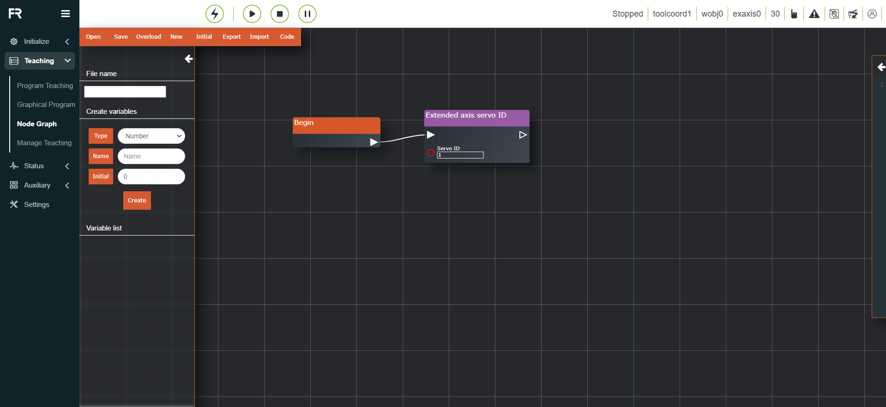

.. centered:: Figure 6.2.53 "Servo ID" command node interface

"Control mode" command node,, parameters:

-Servo ID: 1~15
- Control mode: position mode/speed mode

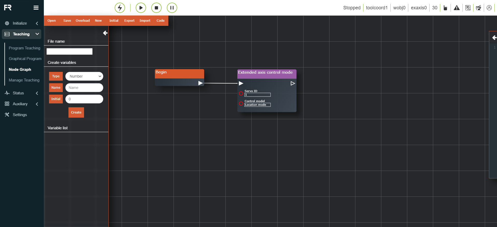

.. centered:: Figure 6.2.54 "Control Mode" command node interface

"Servo enable" command node, parameters:

-Servo ID: 1~15
- Servo enable: servo enable/remove enable

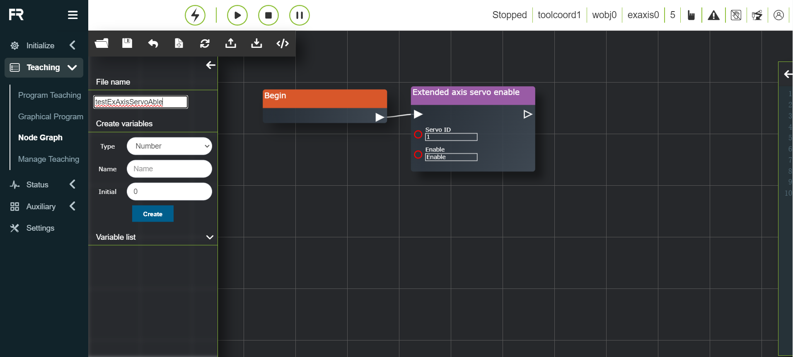

.. centered:: Figure 6.2.55 "Servo enable" command node interface

"Servo return to zero" command node, parameters:

-Servo ID: 1~15
- Zero return method: current position zero return/negative limit zero return/positive limit zero return
- Homing speed: 0~2000, default bit 5
- Zero point hoop speed: 0~2000, default is 1

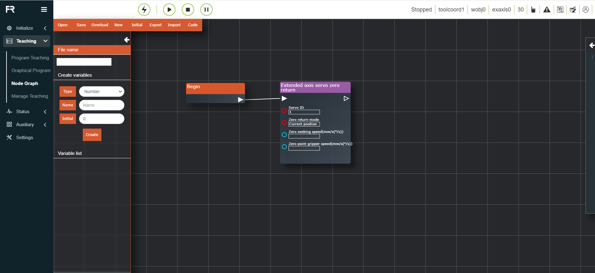

.. centered:: Figure 6.2.56 "Servo return to zero" command node interface

"Position mode" command node, parameters:

-Servo ID: 1~15
- Target location: unlimited
- Homing speed: unlimited

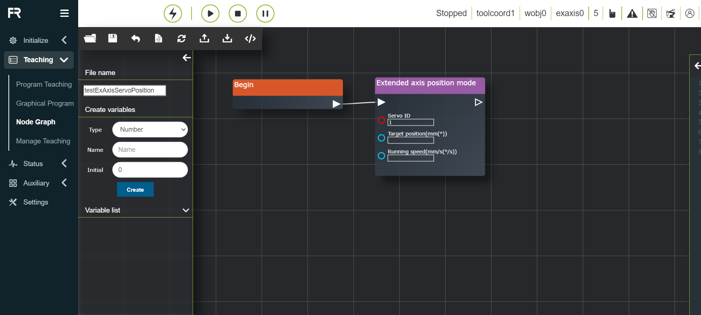

.. centered:: Figure 6.2.57 "Position Mode" command node interface

"Speed mode" command node, parameters:

-Servo ID: 1~15
- Target speed: unlimited

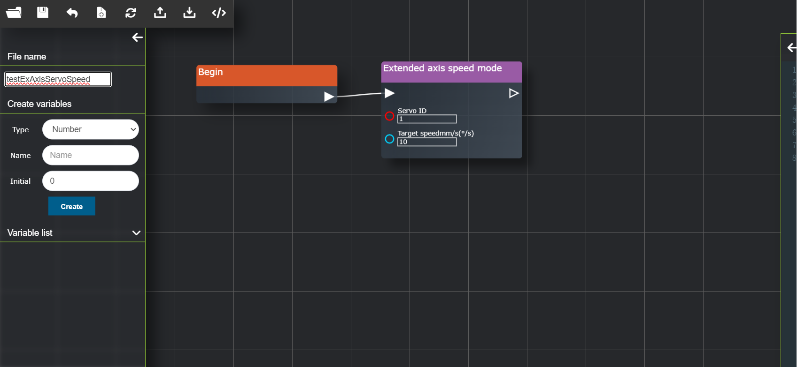

.. centered:: Figure 6.2.58 "Speed Mode" command node interface

Conveyor belt instruction
++++++++++++++++++++++++++++++++++

This instruction includes four commands: Conveyor belt IO real-time detection, position real-time detection, tracking on and tracking off. See the Robot Peripherals chapter for details.

"Conveyor belt IO real-time detection" command node, parameters:

- Maximum waiting time: 0~10000

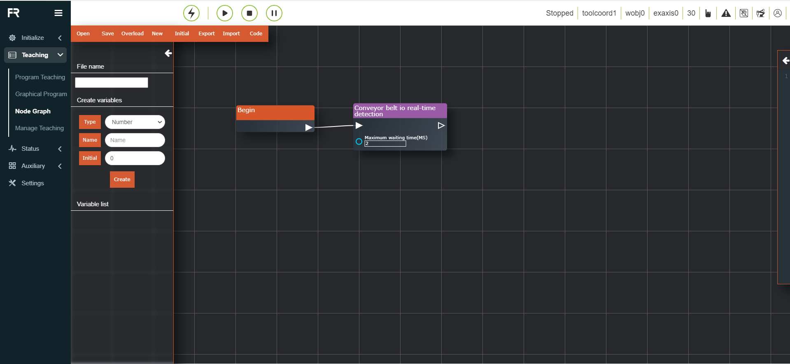

.. centered:: Figure 6.2.59 "Conveyor belt IO real-time detection" command node interface

"Real-time detection of conveyor belt position" command node, parameters:

- Operating mode: Tracking capture/Tracking motion/TPD tracking

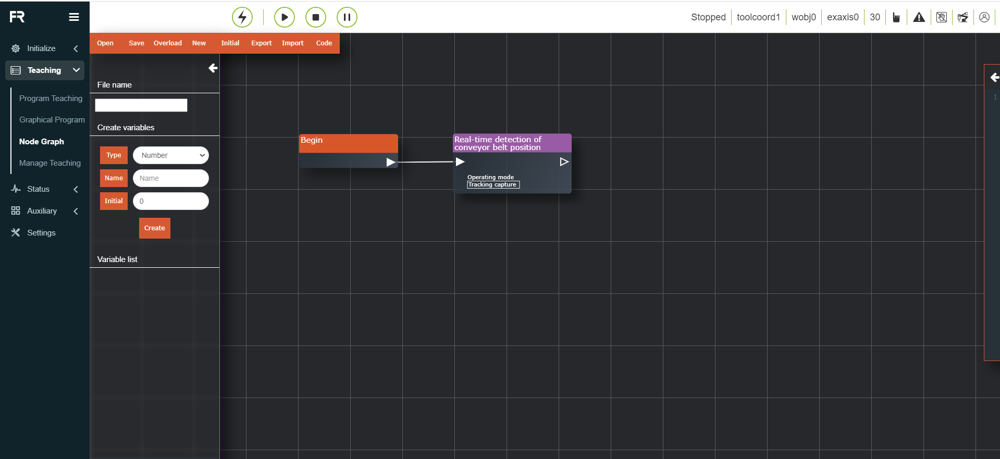

.. centered:: Figure 6.2.60 "Real-time detection of conveyor belt position" command node interface

"Conveyor tracking enabled" command node, parameters:

- Operating mode: Tracking capture/Tracking movement/TPD tracking

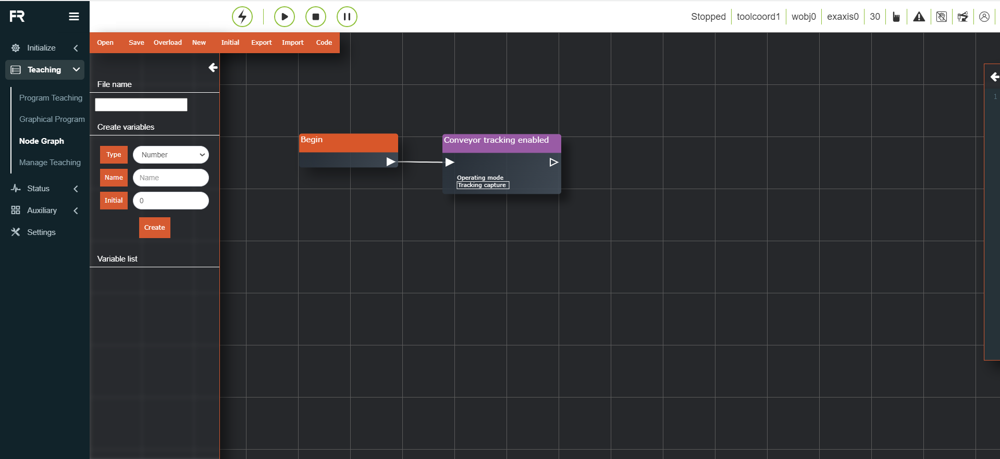

.. centered:: Figure 6.2.61 "Conveyor tracking enabled" command node interface

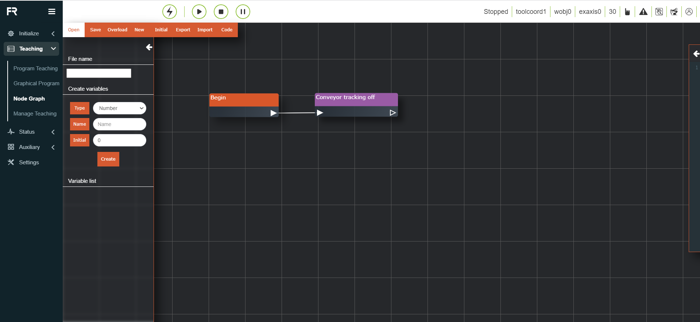

.. centered:: Figure 6.2.62 "Conveyor tracking off" command node interface

Polish instruction
++++++++++++++++++++++++++++++++++

This command is used for polishing scenes. When using it, you need to uninstall and then load the driver, and then set the polishing device to be enabled. Then set the rotation speed, contact force, extension distance and control mode of the grinding equipment. At the same time, you can clear the grinding equipment errors and clear the equipment force sensor.

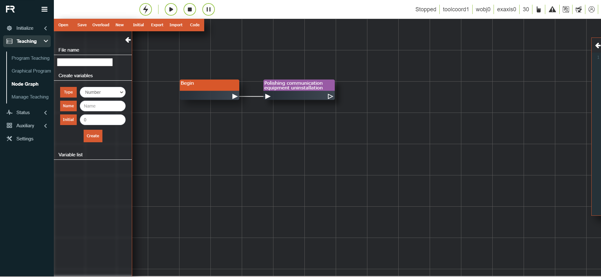

.. centered:: Figure 6.2.63 "Polishing communication equipment uninstallation" command node interface

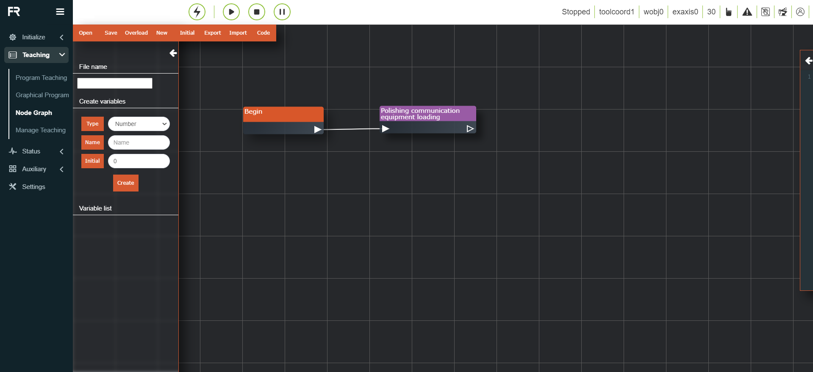

.. centered:: Figure 6.2.64 "Polishing communication equipment loading" command node interface

"Polishing equipment enable" command node, parameters:

- Device enable: Present/Descend

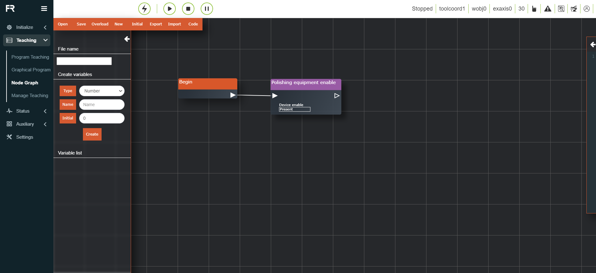

.. centered:: Figure 6.2.65 "Polishing equipment enable" command node interface

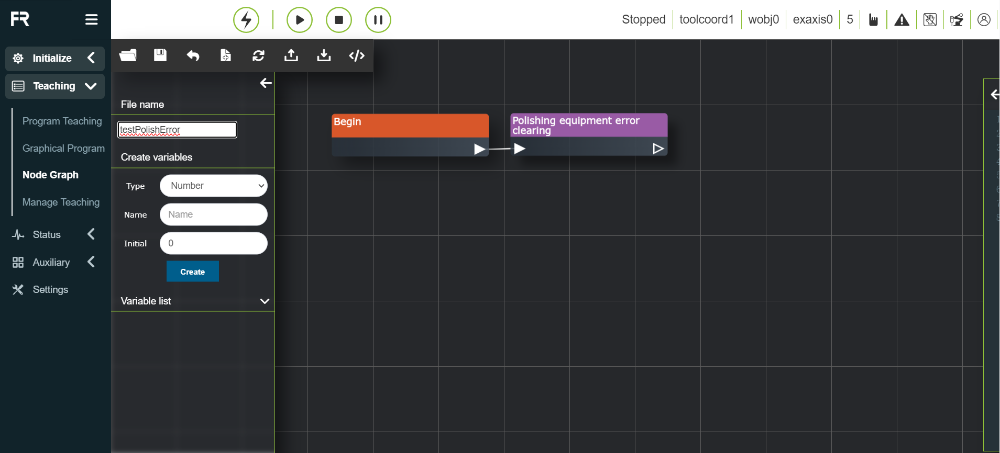

.. centered:: Figure 6.2.66 "Polishing equipment error clearing" command node interface

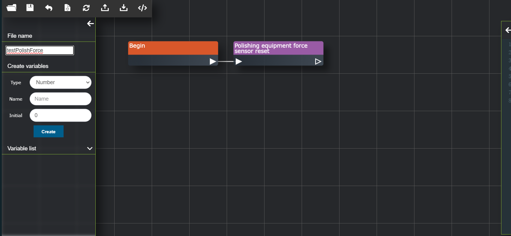

.. centered:: Figure 6.2.67 "Polishing equipment force sensor clear" command node interface

"Polishing speed" command node, parameters:

- Polishing speed: 0~5500

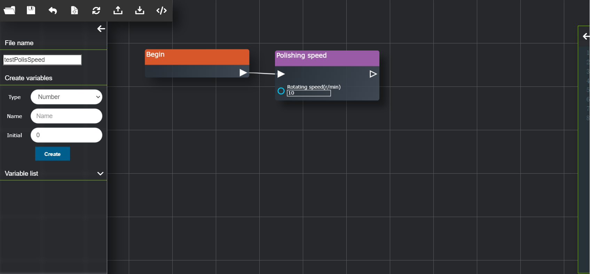

.. centered:: Figure 6.2.68 "Speed" command node interface

"Polishing contact force" command node, parameters:

- Contact force: 0~200

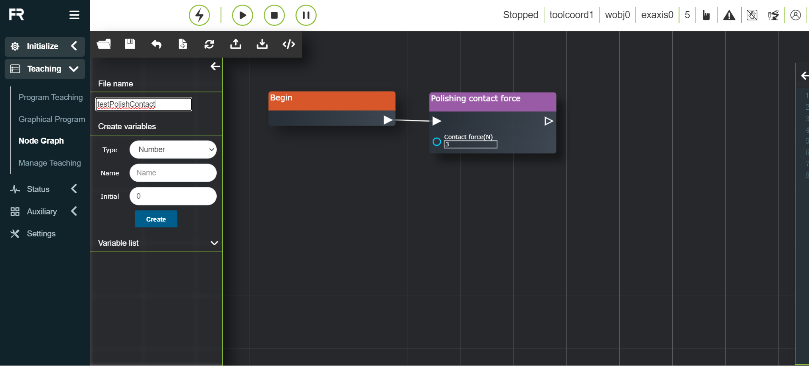

.. centered:: Figure 6.2.69 "Polishing contact force" command node interface

"Polishing protrusion distance" command node, parameters:

-Polishing protrusion distance: 0~12

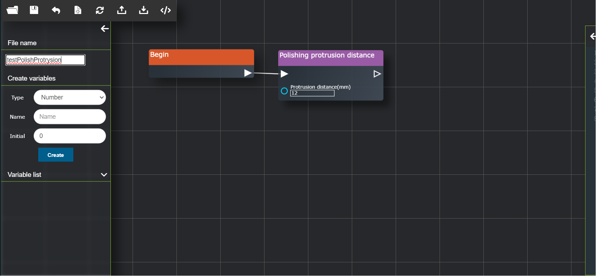

.. centered:: Figure 6.2.70 "Polishing protrusion distance" command node interface

"Polishing control mode" command node, parameters:

- Control mode: zero return mode/position mode/torque mode

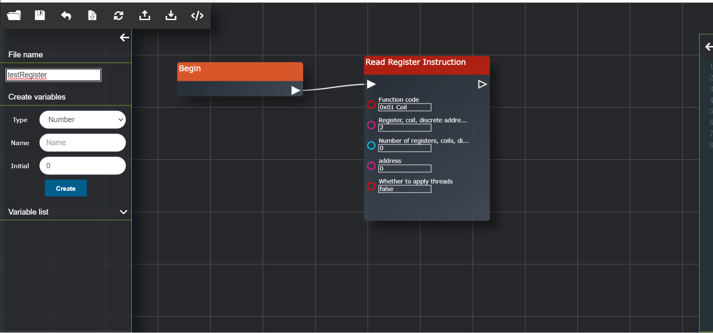

.. centered:: Figure 6.2.71 "Polishing control mode" command node interface

"Welding" command interface
~~~~~~~~~~~~~~~~~~~~~~~~~~~~~~~~~~~

Weld command
++++++++++++++++++++++

Click "Welding related command node" to enter the node graph programming interface.

This command is mainly used for welding machine peripherals. Before adding this command, please confirm whether the welding machine configuration is completed in the user peripherals. For details, see the Robot Peripherals chapter.

1. "Welding machine voltage" command node, parameters:

- Welding machine voltage: minimum value is 0

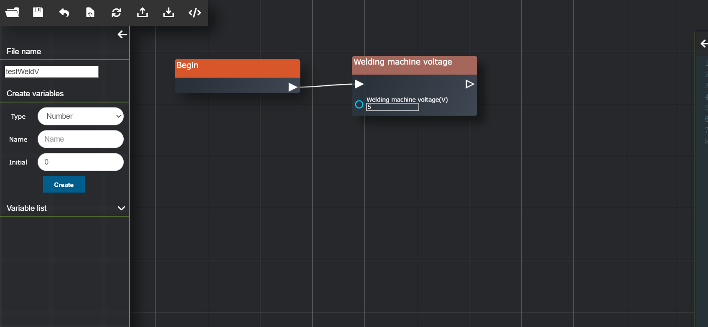

.. centered:: Figure 6.2.72 "Welding machine voltage" command node interface

2. "Welding machine current" command node, parameters:

- Welding machine current: minimum value is 0

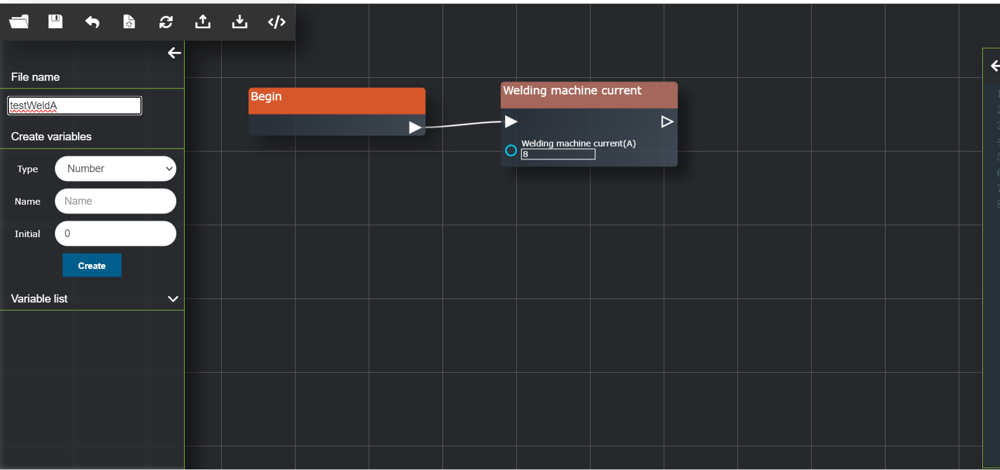

.. centered:: Figure 6.2.73 "Welding machine current" command node interface

3. "Arc closing/arc starting" command node, parameters:

- I/O type: controller IO/expansion IO
- Welding process number: 0 ~ 7
- Maximum waiting time (ms): 0 ~ 10000

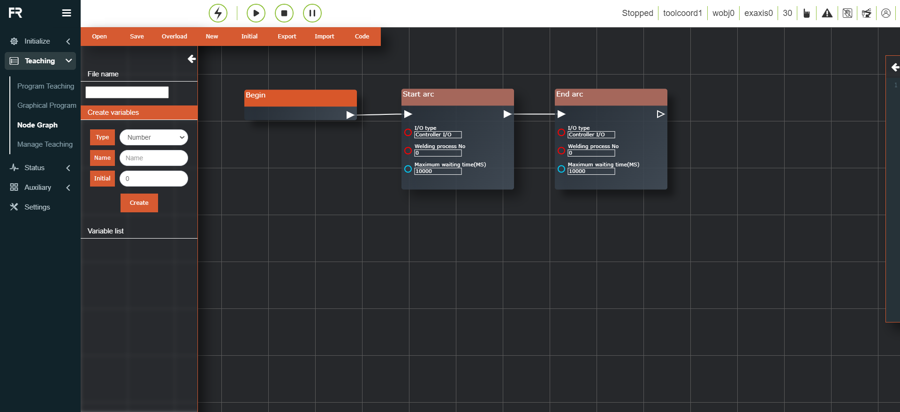

.. centered:: Figure 6.2.74 "Arc closing/arc starting" command node interface

4. "Gas ON/OFF" command node, parameters:

- I/O type: controller IO/expansion IO

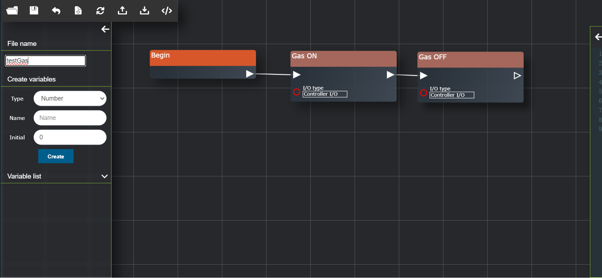

.. centered:: Figure 6.2.75 "Gas on/off" command node interface

1. "Forward/Stop forward" command node, parameters:

- I/O type: controller IO/expansion IO

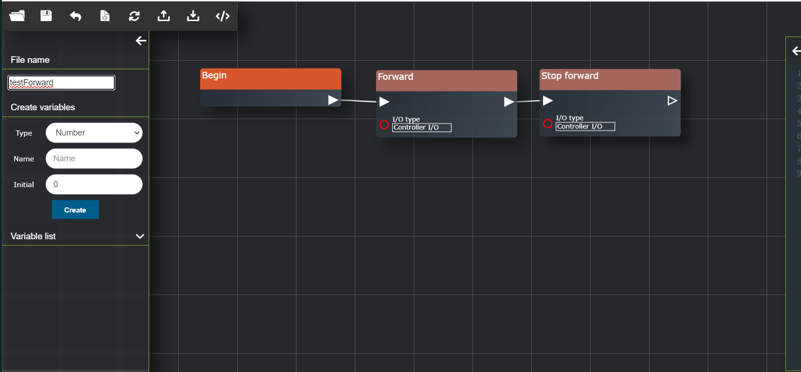

.. centered:: Figure 6.2.76 "Forward/Stop forward" command node interface

5. "Reverse wire feed/Stop reverse" command node, parameters:

- I/O type: controller IO/expansion IO

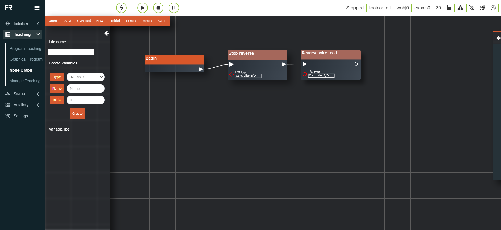

.. centered:: Figure 6.2.77 "Reverse wire feed/Stop reverse" command node interface

Segment instruction
+++++++++++++++++++++

This command is a special command for welding, mainly used in intermittent welding scenarios where one period of welding and one period of non-welding are cycled. Between the starting point and the end point, use this command to select the starting point and the end point, set the debugging speed, set the DO port of arc starting, execution length, non-execution length, set the function mode, swing selection and rounding rules according to the actual application scenario. Realize the segment welding function.

"Segment welding" command node, parameters:

- Starting point: teaching point
- End point: teaching point
- Debugging speed (%): 0~100, default is 100
- Arc starting do port: Ctrl-DO0~7, Ctrl-CO0~7
- Execution length: 0~1000
- Non-executable length: 0~1000
- Function mode: 0~100, default is 100
- Swing selection: execution section does not swing/execution section swings
- Rounding rules: no rounding/circular rounding/single segment rounding

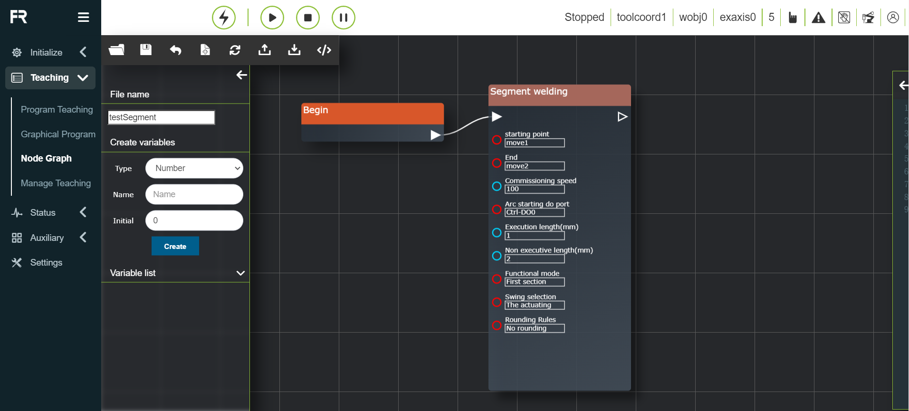

.. centered:: Figure 6.2.78 "Segment welding" command node interface

Laser instruction
++++++++++++++++++++

Click the "Laser" command node to enter the node graph programming interface

This command contains three parts: laser command, tracking command and positioning command. Before adding this command, please confirm whether the laser tracking sensor in the user peripheral has been configured successfully. See the Robot Peripherals chapter for details.

1. "Open/Close sensor" command node, parameters

- Select weld type: 0 ~ 49
  
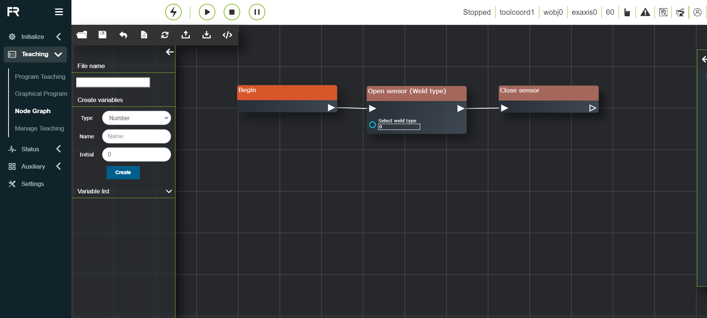

.. centered:: Figure 6.2.79 "Open/Close sensor" command node interface

2. "Load/unload sensor" command node, parameters

- Function selection: Ruiniu RRT-SV2-BP/CXZK-RBTA4L
  
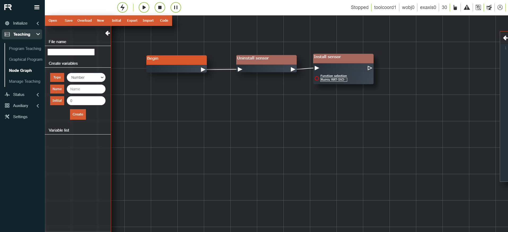

.. centered:: Figure 6.2.80 "Load/unload sensor" command node interface

3. "Start/Stop Tracking" command node, parameters

- Coordinate system name: Customized configuration coordinate system
  
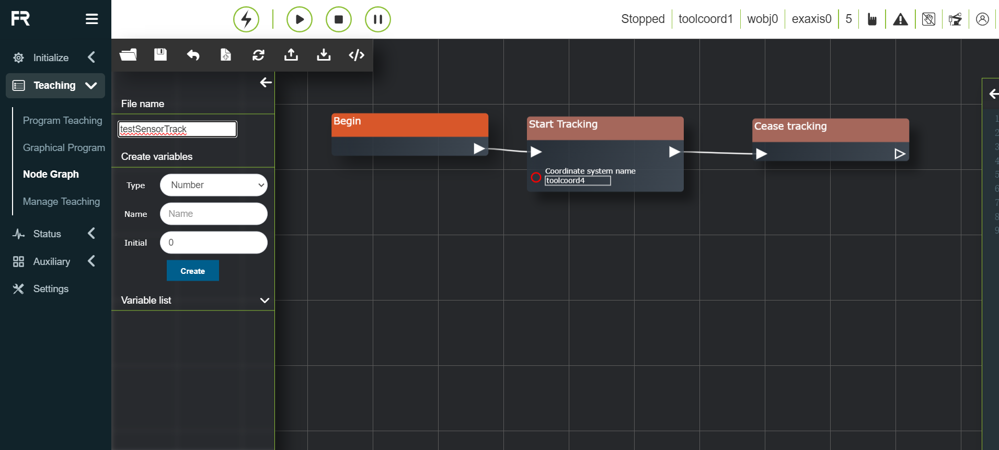

.. centered:: Figure 6.2.81 "Start/stop tracking" command node interface

4. "Data Record" command node, parameters

- Function selection: stop recording/real-time tracking/start recording/track recurrence
- Waiting time (ms): 0 ~ 10000
  
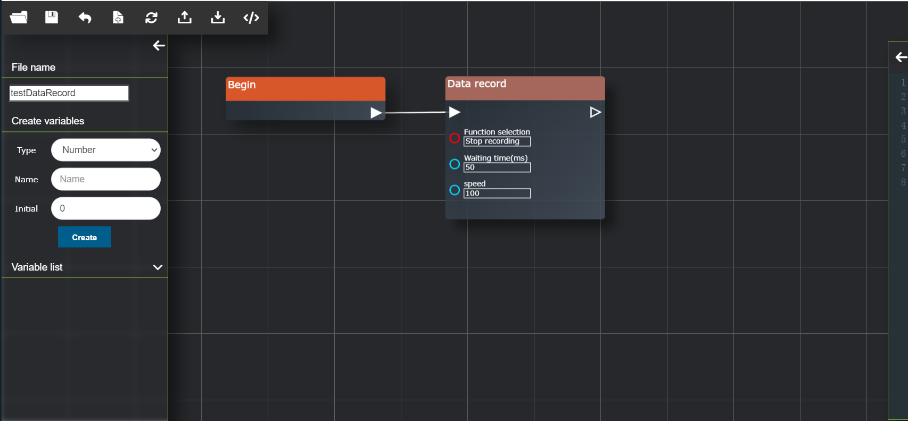

.. centered:: Figure 6.2.82 "Data Logging" command node interface

5. "Laser tracking recurrence" command node, parameters
  
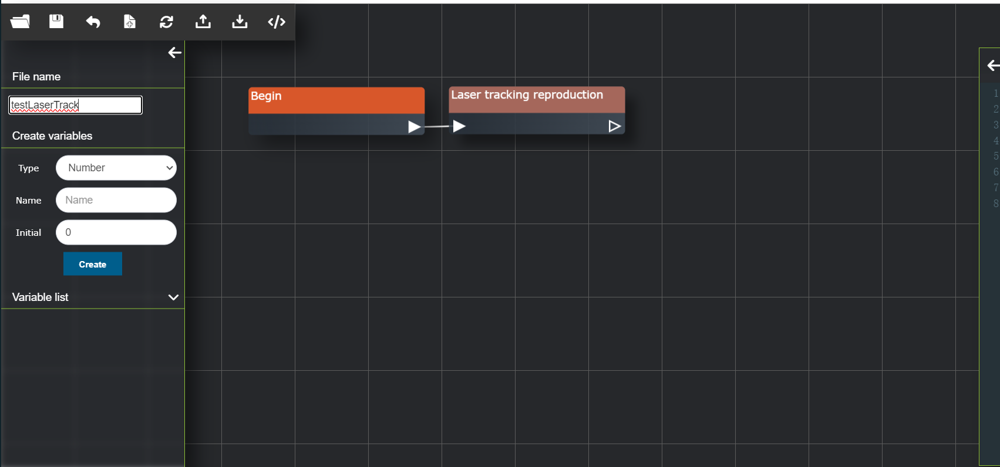

.. centered:: Figure 6.2.83 "Laser Tracking Reappearance" command node interface

6. "Sensor point acquisition movement" command node, parameters

- Coordinate system name: Customized configuration coordinate system
- Sports mode: PTP/Lin
- Debugging speed (%): 0 ~ 100
  
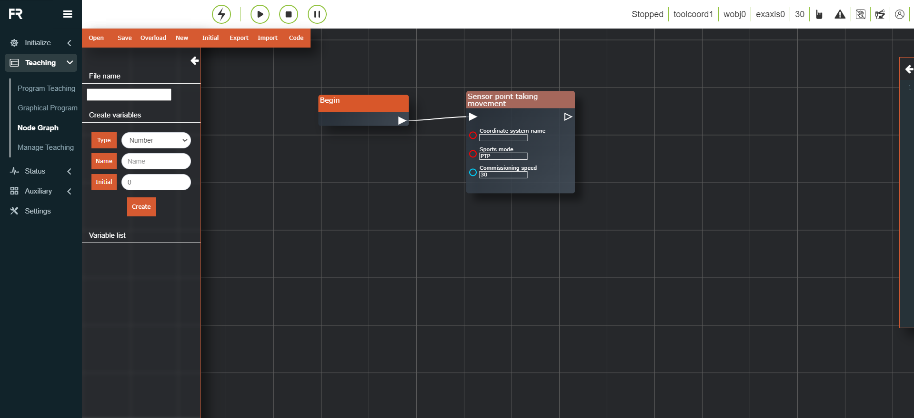

.. centered:: Figure 6.2.84 "Data Logging" command node interface

1. "Start/End locating" command node, parameters

- Coordinate system name: Customized configuration coordinate system
- Direction: +x/-x/+y/-y/+z/-z/specifies the direction
- Direction point: When "Specify direction" is not selected, the parameter is invalid
- Speed (%): 0 ~ 100
- Length (mm): 0 ~ 1000
- Maximum search time (ms): 0 ~ 10000
  
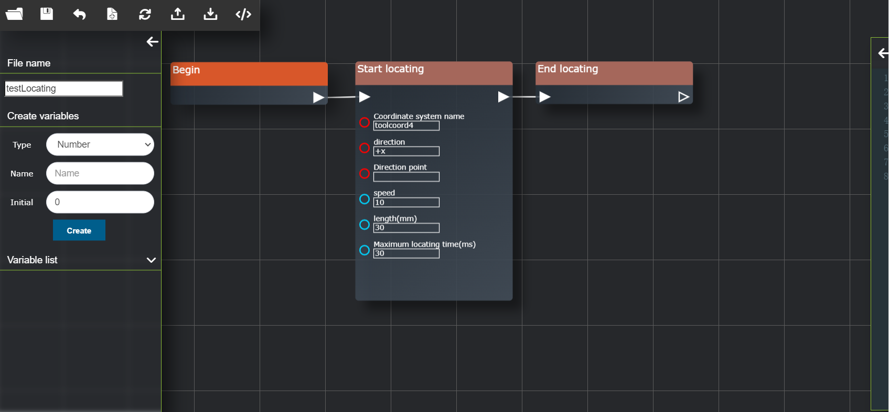

.. centered:: Figure 6.2.85 "Start/End locating" command node interface

laser recording instructions
++++++++++++++++++++++++++++++++++

This command implements the function of taking out the starting point and end point of laser tracking and recording, so that the robot can automatically move to the starting point. It is suitable for situations where the movement starts from outside the workpiece and laser tracking and recording is performed. At the same time, the host computer can obtain the information of the starting point and end point in the recorded data. for subsequent exercise.

Implementing the adjustable laser tracking reproduction speed function allows the robot to record at a very fast speed and then reproduce at the normal welding speed, which can improve operating efficiency.

"Weld data record" command node, parameters:

- Function selection: stop recording/real-time tracking/start recording/track recurrence
- Waiting time (ms): 0~10000, default is 10
- Speed (%): 0~100, default is 30, this parameter takes effect when selecting trajectory recurrence

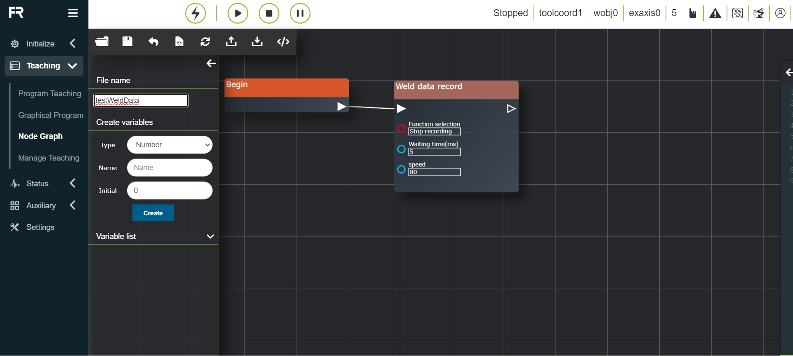

.. centered:: Figure 6.2.86 "Weld data record" command node interface

"Get weld starting point/end point" command node, parameters:

- Sports mode: PTP/LIN
- Speed (%): 0~100, default is 30

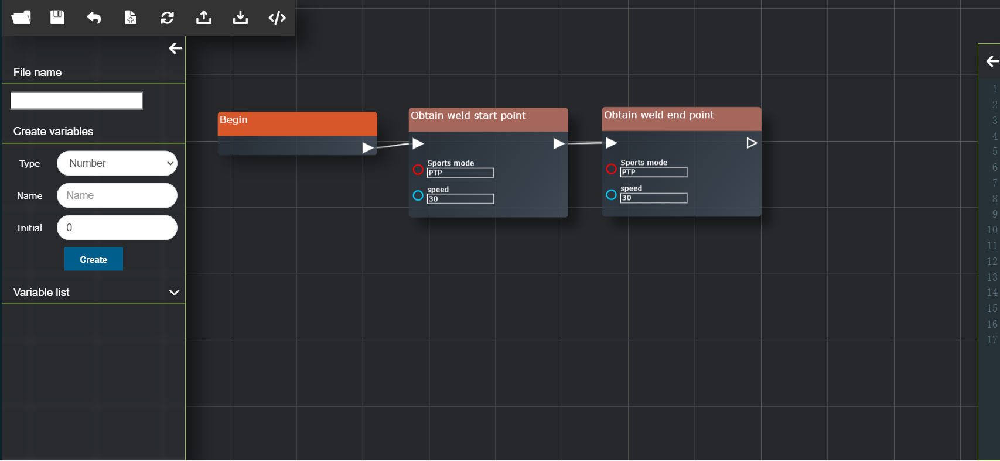

.. centered:: Figure 6.2.87 "Get weld starting point/end point" command node interface

W-Search instruction
+++++++++++++++++++++++

This command is generally used in welding scenarios and requires the welding machine to be used in combination with robot IO and motion commands. It is divided into search start, search end, search point setting, offset calculation and contact point data writing.

"Welding wire positioning start/end" command node, parameters:

- Base position: do not update/update
- Position search speed: 0~100
- Search distance: 0~1000
- Automatic return flag: no automatic return/automatic return
- Automatic return speed: 0~100
- Automatic return distance: 0~1000
- Positioning method: teaching point positioning/positioning with offset

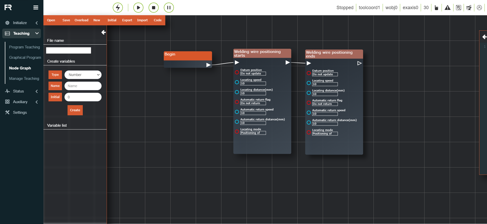

.. centered:: Figure 6.2.88 "Welding wire positioning start/end" command node interface

The search point setting adds points based on the weld type and calculation method.

- When the type is fillet weld and the calculation method is 1D (one of xyz), the point addition is selected from point a and point b;
- When the type is fillet weld and the calculation method is 2D (two in xyz), the point addition is selected from point a, point b, point e, and point f;
- When the type is fillet weld and the calculation method is 3D (xyz), the point addition is selected from point a, point b, point c, point d, point e, and point f;
- When the type is fillet weld and the calculation method is 2D+ (two in xyz, one in rxryrz), the point addition is selected from point a, point b, point c, point d, point e, and point f;
- When the type is inner and outer diameter and the calculation method is 2D2D (two in xyz), the point addition is selected from point a and point b;
- When the type is point and the calculation method is 3D (xyz), the point addition is selected from point a, point b, point c, point d, point e, and point f;
- When the type is camera and the calculation method is 3D+ (xyzrxryrz), the point addition is selected from point a and point b;
- When the type is surface and the calculation method is 3D+ (xyzrxryrz), the point addition is selected from point a and point b;

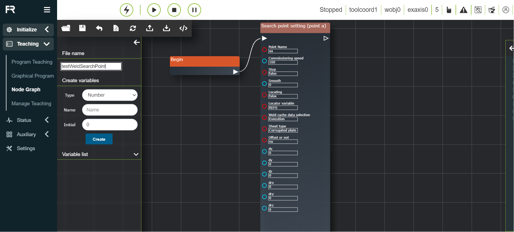

.. centered:: Figure 6.2.89 "Search point setting" command node interface

Calculate the offset to set the datum and contact points based on the weld type and calculation method.

- When the type is fillet weld and the calculation method is 1D (one of xyz), set reference point 1 and contact point 1;
- When the type is fillet weld and the calculation method is 2D (two in xyz), set datum point 1, datum point 2, contact point 1, and contact point 2;
- When the type is fillet weld and the calculation method is 3D (xyz), set datum point 1, datum point 2, datum point 3, contact point 1, contact point 2, and contact point 3;
- When the type is fillet weld and the calculation method is 2D+ (two in xyz, one in rxryrz), set reference point 1, reference point 2, reference point 3, contact point 1, contact point 2, contact point 3 ;
- When the type is inner and outer diameter and the calculation method is 2D2D (two in xyz), set datum point 1, datum point 2, datum point 3, contact point 1, contact point 2, and contact point 3;
- When the type is point and the calculation method is 3D (xyz), set contact point 1 and contact point 2;
- When the type is camera and the calculation method is 3D+ (xyzrxryrz), set contact point 1 and contact point 2;
- When the type is face and the calculation method is 3D+ (xyzrxryrz), set contact point 1, contact point 2, contact point 3, contact point 4, contact point 5, and contact point 6;

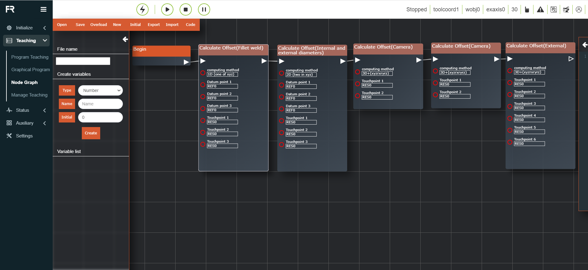

.. centered:: Figure 6.2.90 "Calculate offset" command node interface

"Contact point data write" command node, parameters:

- Contact point name: RES0~99
- Contact point name: The data format is {0,0,0,0,0,0};

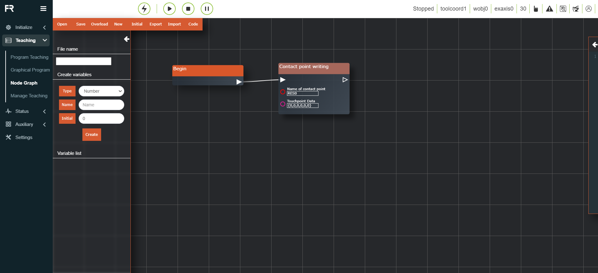

.. centered:: Figure 6.2.91 "Contact Point Data Write" command node interface

Weld-Trc instruction
+++++++++++++++++++++++++

Click the "Weld-Trc" command node to enter the node graph programming interface

This instruction implements robot welding seam tracking using welding seam deviation detection to compensate for the trajectory. Arc sensors can be used to detect welding seam deviations.

"Arc tracking on/off" command node, parameters:

- Arc tracking lag time (ms): reference value 50
- Deviation compensation: off/on
- Adjustment coefficient: 0 ~ 300
- Compensation time (cyc): 0 ~ 300
- Maximum compensation amount each time (mm): 0 ~ 300
- Total maximum compensation amount (mm): 0 ~ 300
- Up and down coordinate system selection: swing
- Upper and lower reference current setting method: feedback/constant
- Upper and lower reference current (A): 0 ~ 300

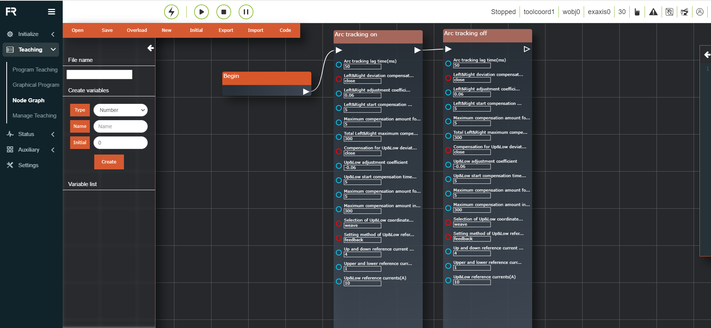

.. centered:: Figure 6.2.92 "Arc tracking on/off" command node interface

Attitude adjustment instructions
++++++++++++++++++++++++++++++++++

Click on the "Attitude Adjustment" related command node to enter the node graph programming interface.

This command adaptively adjusts the welding gun posture for welding tracking scenarios. It is necessary to teach the three points PosA, PosB, and PosC first, otherwise nodes cannot be added.

After recording the three corresponding posture points, add posture adaptive adjustment instructions according to the actual movement direction of the robot. See the Robot Peripherals chapter for details.

"Turn on attitude adjustment" command node, parameters:

- Board type: corrugated board/corrugated board/fence board/corrugated shell steel
- Direction of movement: left to right/right to left
- Attitude adjustment time (ms): 0 ~ 1000
- Length of first section (mm):
- Inflection point type: top to bottom/bottom to top
- Length of second section (mm):
- Length of third section (mm):
- Length of the fourth section (mm):
- Length of the fifth section (mm):

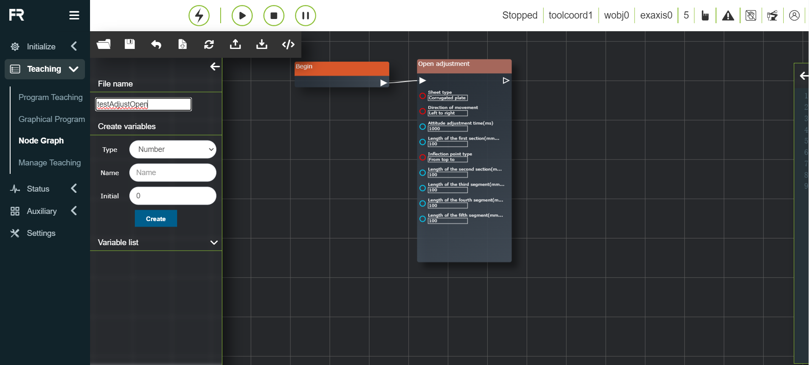

.. centered:: Figure 6.2.93 "Turn on attitude adjustment" command node interface

"Turn off attitude adjustment" command node, parameters:

- Board type: corrugated board/corrugated board/fence board/corrugated shell steel

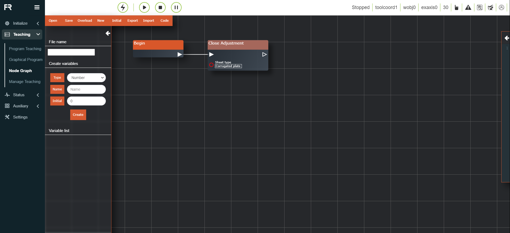

.. centered:: Figure 6.2.94 "Turn off attitude adjustment" command node interface

"Force Control" command interface
~~~~~~~~~~~~~~~~~~~~~~~~~~~~~~~~~~~~~

F/T Instruction
++++++++++++++++

Click on the command node related to the "F/T" command to enter the node graph programming interface.

This command includes FT_Guard (collision detection), FT_Control (constant force control), FT_Compliance (compliance control), FT_Spiral (spiral insertion), FT_Rot (rotation insertion), FT_Lin (linear insertion), FT_FindSurface (surface positioning), FT_CalCenter (center positioning) ), FT_Click (click force detection) nine instructions, see the robot peripherals chapter for details.

1. "Turn on/off collision detection" command node, parameters:

- Coordinate system name: Custom configured coordinate system
- Fx-Tx truth value: true/false
- Fx-Tx current value: input according to actual situation
- Fx-Tx maximum threshold: input according to actual situation
- Fx-Tx minimum threshold: input according to actual situation

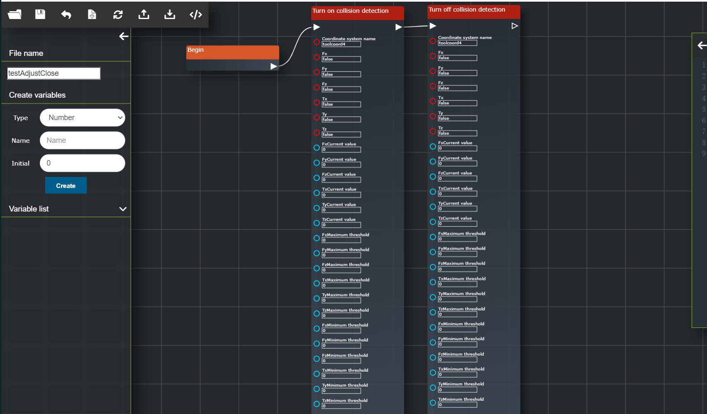

.. centered:: Figure 6.2.95 "Turn on/off collision detection" command node interface

2. "Turn on/off control" command node, parameters:

- Coordinate system name: Custom configured coordinate system
- Fx-Tx truth value: true/false
- Current value of Fx-Tx: adjusted according to actual situation
- F_P_gain - F_D_gain: adjusted according to actual situation, cannot be 0
- Adaptive start and stop status: stop/start
- ILC control start and stop status: stop/training/practical operation
- Maximum adjustment distance (mm): 0 ~ 1000
- Maximum adjustment angle (°): 0 ~ 1000

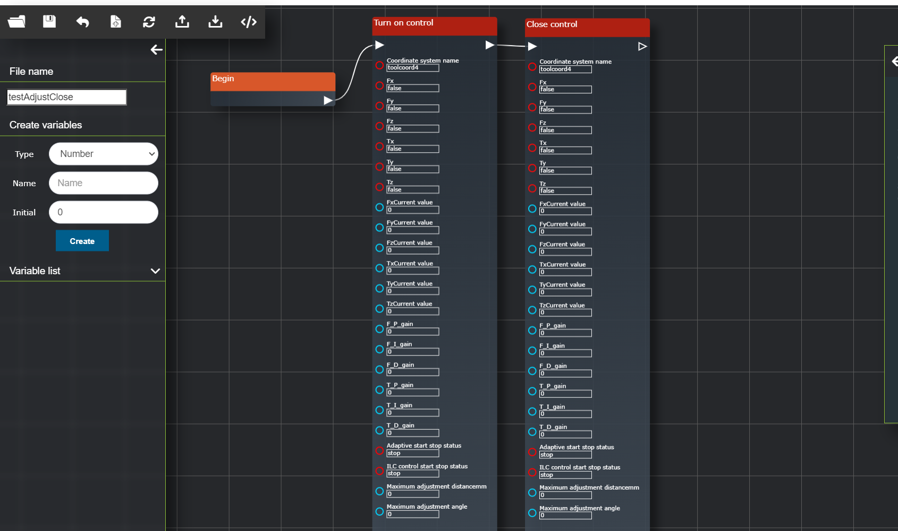

.. centered:: Figure 6.2.96 "Turn on/off control" command node interface

3. "FT_Compliance Start/End" command node, parameters:

- Delivery position adjustment coefficient: 0 ~ 1
- Compliant opening force threshold (N): 0 ~ 100

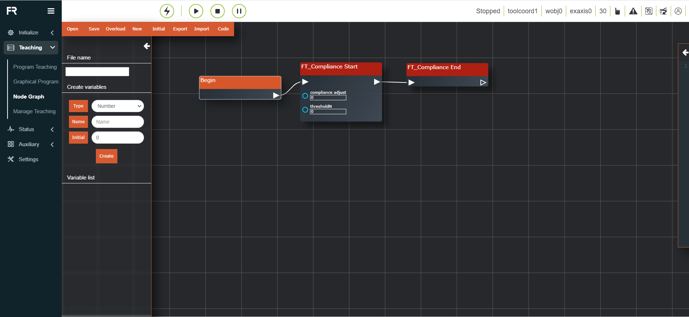

.. centered:: Figure 6.2.97 "FT_Compliance Start/End" command node interface

4. "FT_Spiral" command node, parameters:

- Coordinate system name: tool coordinate system/base coordinate
- Radius feed per revolution (mm): 0 ~ 100, reference value: 0.7
- Force or torque threshold (N/Nm): 0 ~ 100, reference value: 50
- Maximum exploration time (ms): 0 ~ 60000, reference value: 60000
- Maximum linear speed (mm/s): 0 ~ 100, reference value: 5

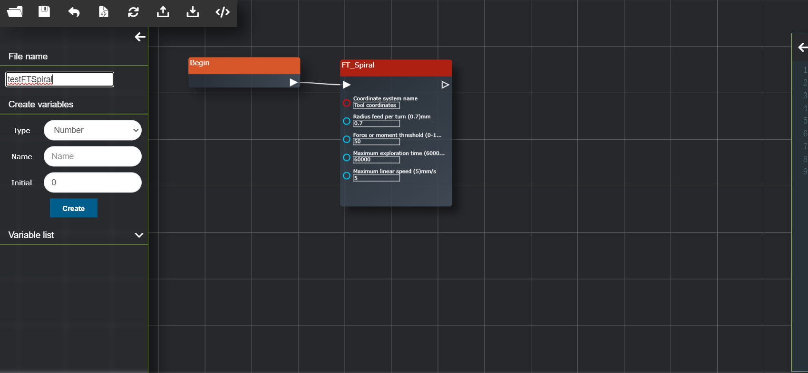

.. centered:: Figure 6.2.98 "FT_Spiral" command node interface

5. "FT_Rot" command node, parameters:

- Coordinate system name: tool coordinate system/base coordinate
- Rotation angular speed (°/s): 0 ~ 100, reference value: 0.7
- Trigger force or final torque (N/Nm): 0 ~ 100, reference value: 50
- Maximum rotation angle (°): 0 ~ 100, reference value: 5
- Direction of force: direction z/direction mz
- Maximum rotation angle acceleration (°/s^2): 0 ~ 100
- Insertion direction: positive/negative

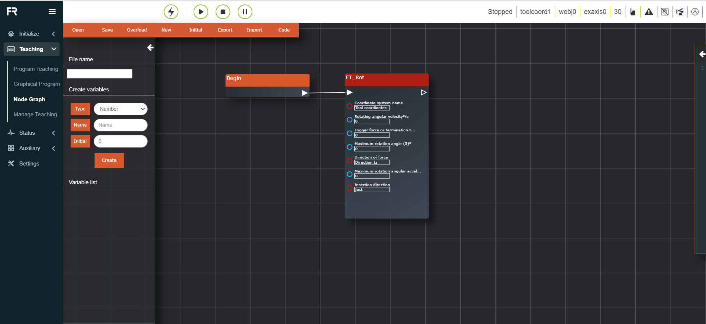

.. centered:: Figure 6.2.99 "FT_Rot" command node interface

6. "FT_Lin" command node, parameters:

- Coordinate system name: tool coordinate system/base coordinate
- Action termination force threshold (N): 0 ~ 100
- Linear speed (mm/s): 0 ~ 100, reference value: 1
- Linear acceleration (°/s^2): 0 ~ 100
- Maximum insertion distance (mm): 0 ~ 100
- Insertion direction: positive/negative

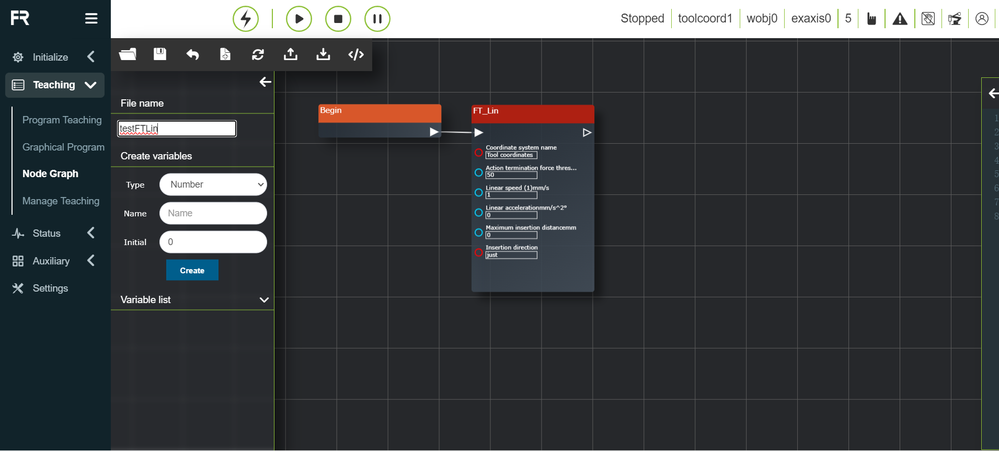

.. centered:: Figure 6.2.100 "FT_Lin" command node interface

7. "FT_FindSurface" command node, parameters:

- Coordinate system name: tool coordinate system/base coordinate
- Movement direction: positive/negative
- Moving axis: X/Y/Z
- Explore linear speed (mm/s): 0 ~ 100
- Exploration acceleration (mm/s^2): 0 ~ 100
- Maximum exploration distance (mm): 0 ~ 100
- Action termination force threshold (N): 0 ~ 100

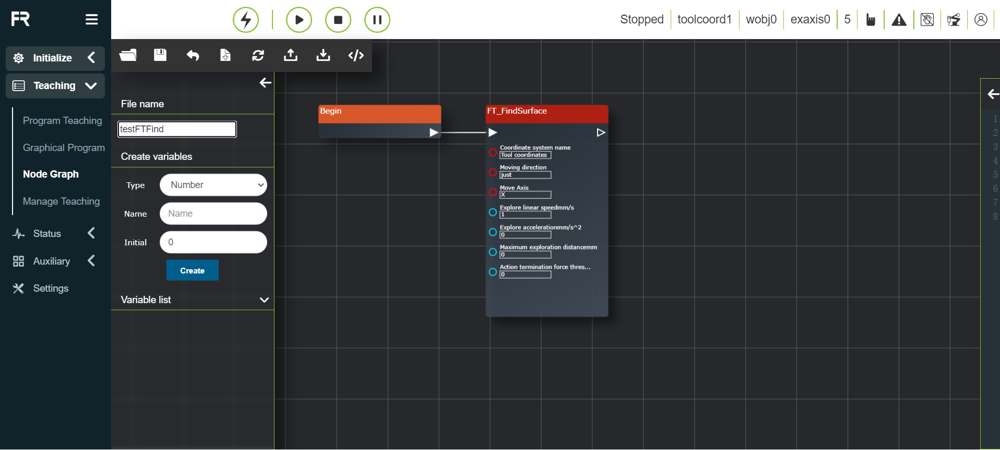

.. centered:: Figure 6.2.101 "FT_FindSurface" command node interface

8. "FT_CalCenter Start/End" command node

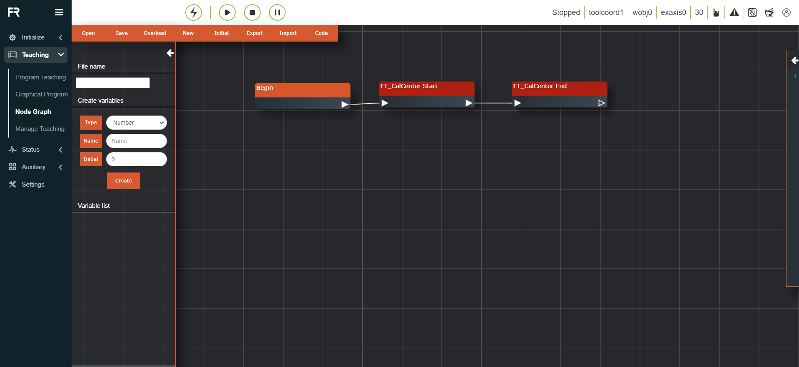

.. centered:: Figure 6.2.102 "FT_CalCenter Start/End" command node interface
   
1. "FT_Click" command node, parameters:

- Action termination force threshold (N): 0 ~ 100
- Linear speed (mm/s): 0 ~ 100
- Linear acceleration (mm/s^2): 0 ~ 100
- Maximum insertion distance (mm): 0 ~ 100

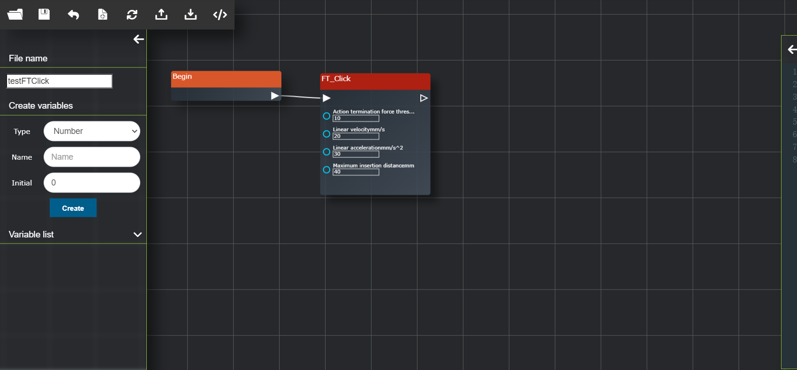

.. centered:: Figure 6.2.103 "FT_Click" command node interface

Torque recording command
++++++++++++++++++++++++++++++

Click on the "Torque Record" related command node to enter the node graph programming interface.

This command is a torque recording command, which includes three commands: "Start Torque Recording/"Stop Torque Recording" and "Reset Torque Recording".

Real-time torque recording and collision detection function.

Click the "Torque Record Start" button to continuously record the collision situation during the operation of the motion command. The recorded real-time torque is used as the theoretical value for collision detection judgment to reduce the probability of false alarms.

When the set threshold range is exceeded, the collision detection duration is recorded.

Click the "Torque Record Stop" button to stop recording. Click "Torque Record Reset" to restore the status to the default state.

1. "Torque recording start" command node, parameters:

- Smoothing selection: unsmoothed (original data)/smoothed (smoothed data)
- Joint negative threshold (Nm): -100 ~ 0
- Joint positive threshold (Nm): 0 ~ 100
- Joint continuous detection collision time (ms): 0 ~ 1000

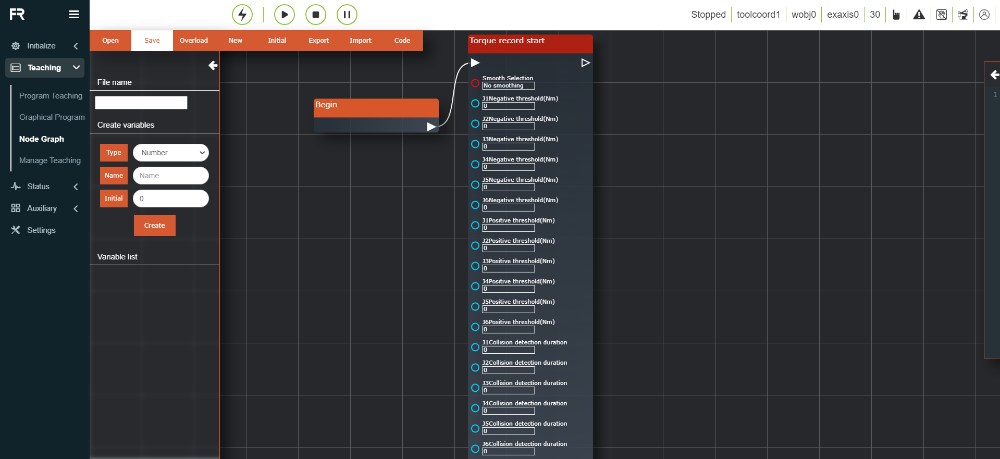

.. centered:: Figure 6.2.104 "Torque recording start" command node interface

2. "Torque recording end" command node

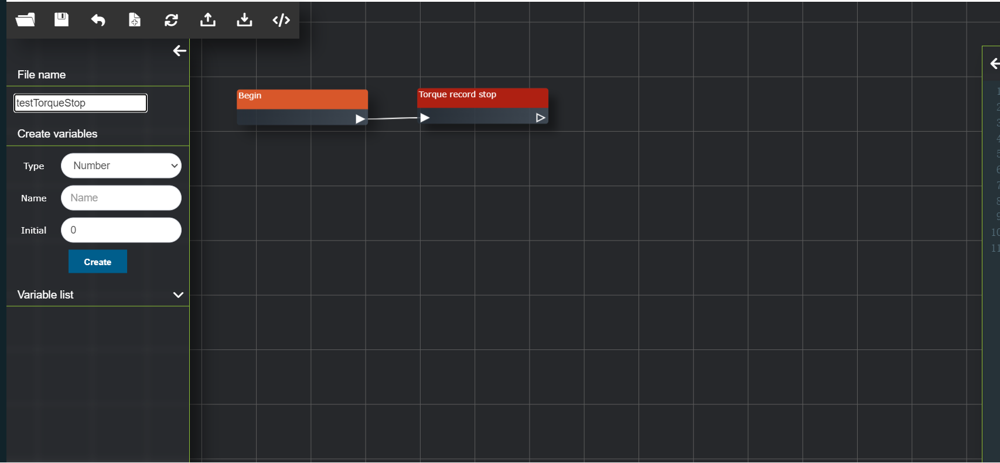

.. centered:: Figure 6.2.105 "Torque recording end" command node interface

3. "Torque record reset" command node

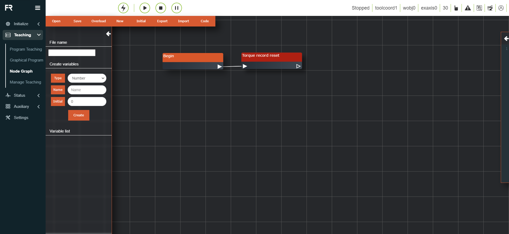

.. centered:: Figure 6.2.106 "Torque record reset" command node interface

Modbus instruction
++++++++++++++++++++

点Click the "Mobus" related command node to enter the node graph programming interface.

This instruction function is a bus function based on the ModbusTCP protocol. Users can control the robot to communicate with the ModbusTCP client or server (master station and slave station communication) through relevant instructions, and read and write coils, discrete quantities, and registers. For more operating functions of ModbusTCP, please contact us for consultation.

1. "Modbus Master Create/Close Master" command node, create/close modbus-tcp communication, the robot serves as the master (client), parameters:

- Slave ip: ip address
- Slave port: Enter according to the actual situation, the default is 502;
- Slave ID: 0 ~ 4

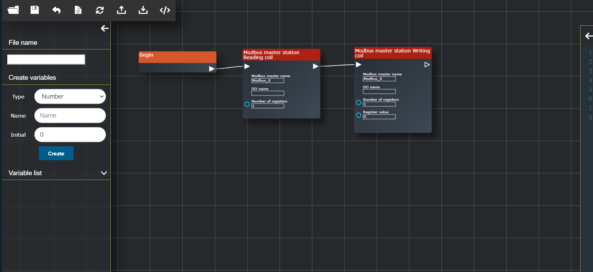

.. centered:: Figure 6.2.107 "Modbus Master Create/Close Master Station" command node interface

2. Master station coil settings, parameters:

- Slave ID: 0 ~ 4
- Register address: Enter according to actual situation
- Number of registers: integer type
- Register value: Determined according to the number of registers, multiple values can be entered. For example, the quantity is 3 and the value is {1,0,1}

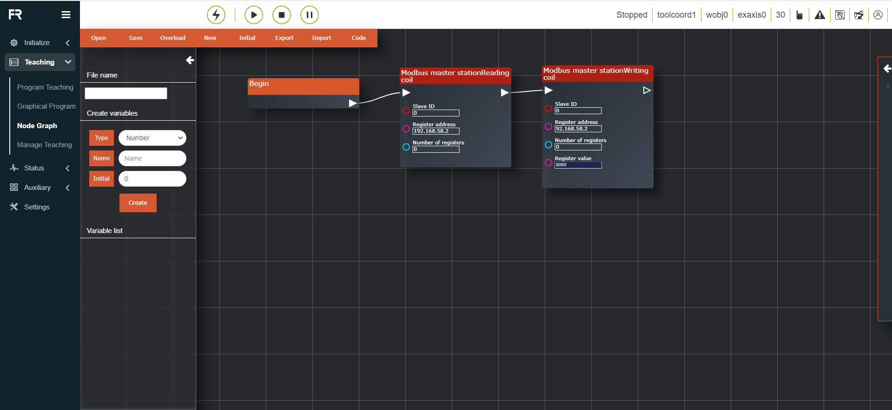

.. centered:: Figure 6.2.108 Master station "Modbus Master ReadING/Writing coil" command node interface

3. Master station discrete setting, parameters:

- Slave ID: 0 ~ 4
- Register address: Enter according to actual situation
- Number of registers: integer type
- Type: U16/U32/F32/F64, -16-bit unsigned integer (occupies 1 register), "U32" - 32-bit unsigned integer (occupies 2 registers), "F32" - 32-bit single-precision floating point number (occupies 2 registers), "F64" - 64-bit double precision floating point number (occupies 4 registers)

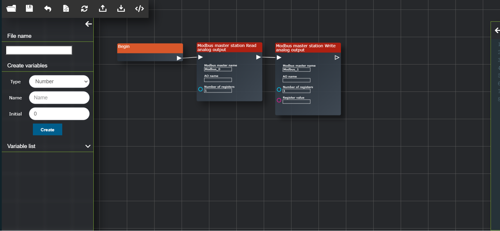

.. centered:: Figure 6.2.109 Master station "Modbus Master reading inbits" command node interface

1. Master station input register settings, parameters:

- Slave ID: 0 ~ 4
- Register address: Enter according to actual situation
- Type: U16/U32/F32/F64, -16-bit unsigned integer (occupies 1 register), "U32" - 32-bit unsigned integer (occupies 2 registers), "F32" - 32-bit single-precision floating point number (occupies 2 registers), "F64" - 64-bit double precision floating point number (occupies 4 registers)

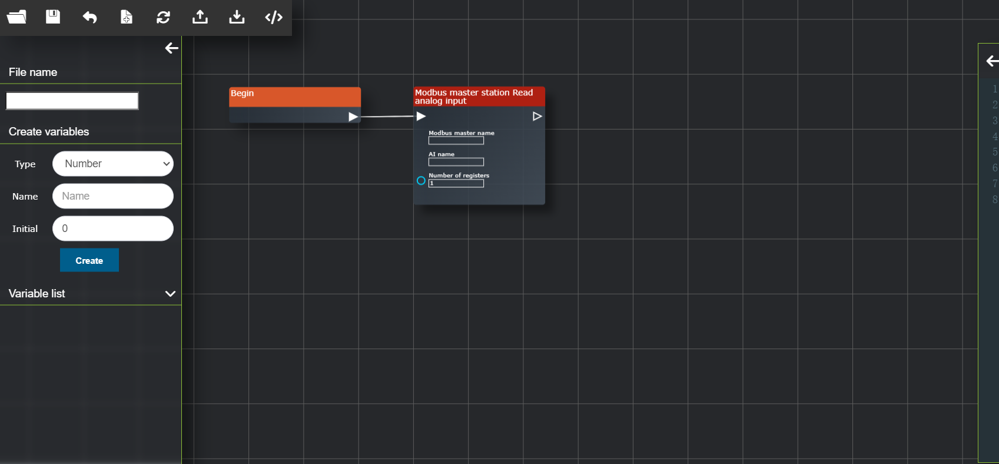

.. centered:: Figure 6.2.110 Master station "Modbus Master read input register" command node interface

5. Master station holding register settings, parameters:

- Slave ID: 0 ~ 4
- Register address: Enter according to actual situation
- Number of registers: integer type
- Register value: Determined according to the number of registers, multiple values can be entered. For example, the quantity is 3 and the value is {1,0,1}
- Type: U16/U32/F32/F64, -16-bit unsigned integer (occupies 1 register), "U32" - 32-bit unsigned integer (occupies 2 registers), "F32" - 32-bit single-precision floating point number (occupies 2 registers), "F64" - 64-bit double precision floating point number (occupies 4 registers)

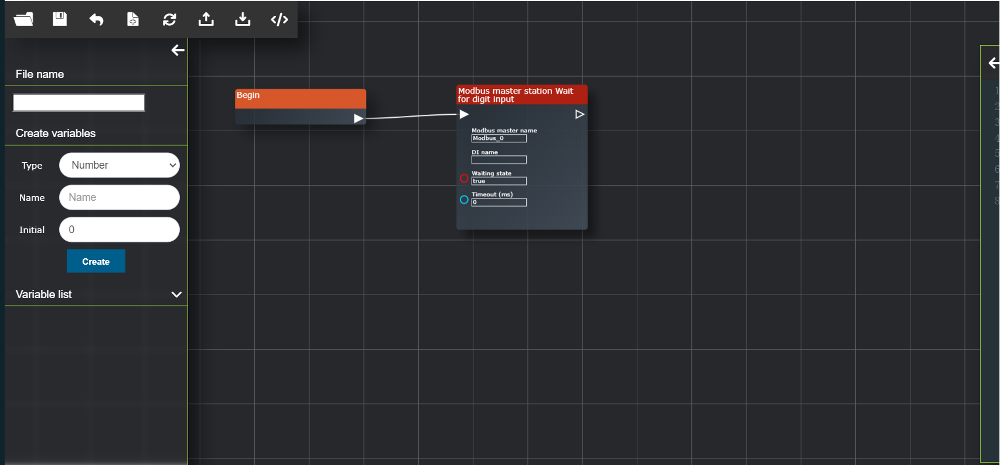

.. centered:: Figure 6.2.111 Master station "Modbus Master read/write holding register" command node interface

6. Slave coil settings, parameters:

- Slave ID: 0 ~ 4
- Register address: Enter according to actual situation
- Number of registers: integer type

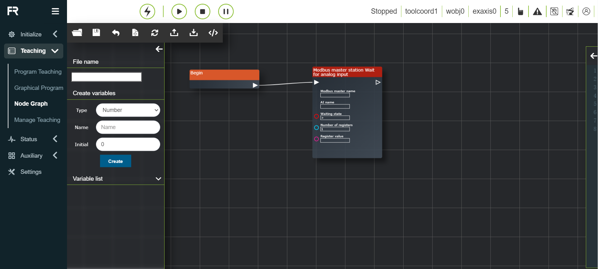

.. centered:: Figure 6.2.112 Slave "Modbus Slave Read/Write coil" command node interface

7. Slave station discrete setting, parameters:

- Slave ID: 0 ~ 4
- Register address: Enter according to actual situation
- Number of registers: integer type
- Register value: Determined according to the number of registers, multiple values can be entered. For example, the quantity is 3 and the value is {1,0,1}

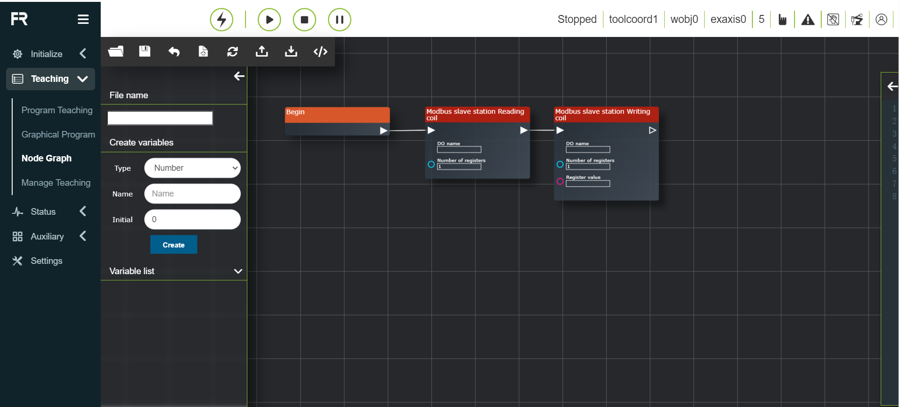

.. centered:: Figure 6.2.113 Slave "Modbus Slave Read/Write inbits" command node interface

8. Slave input register setting, parameters:

- Slave ID: 0 ~ 4
- Register address: Enter according to actual situation
- Number of registers: integer type
- Register value: Determined according to the number of registers, multiple values can be entered. For example, the quantity is 3 and the value is {1,0,1}
- Type: U16/U32/F32/F64, -16-bit unsigned integer (occupies 1 register), "U32" - 32-bit unsigned integer (occupies 2 registers), "F32" - 32-bit single-precision floating point number (occupies 2 registers), "F64" - 64-bit double precision floating point number (occupies 4 registers)

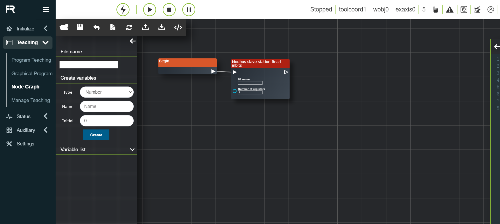

.. centered:: Figure 6.2.114 Slave "Modbus Slave Read/Write input register" command node interface

9. Slave station holding register settings, parameters:

- Slave ID: 0 ~ 4
- Register address: Enter according to actual situation
- Number of registers: integer type
- Register value: Determined according to the number of registers, multiple values can be entered. For example, the quantity is 3 and the value is {1,0,1}
- Type: U16/U32/F32/F64, -16-bit unsigned integer (occupies 1 register), "U32" - 32-bit unsigned integer (occupies 2 registers), "F32" - 32-bit single-precision floating point number (occupies 2 registers), "F64" - 64-bit double precision floating point number (occupies 4 registers)

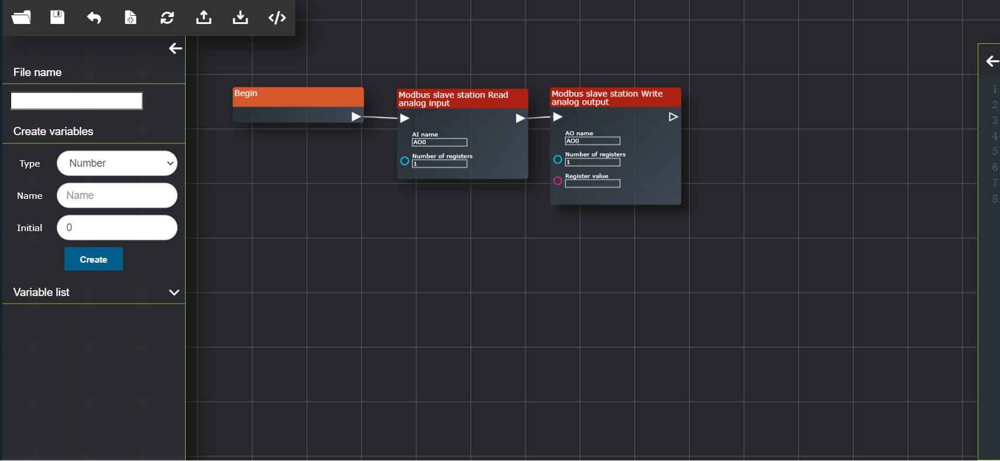

.. centered:: Figure 6.2.115 Slave "Modbus Slave Read/Write holding register" command node interface

10. Read register instruction, parameters:

- Function code: 0x01-coil/0x02-discrete quantity/0x03-holding register/0x04-input register
- Register, coil, discrete address: input according to actual situation
- Number of registers, coils, and discrete quantities: 0 ~ 255
- Address: Enter according to actual situation
- Whether to apply threads: No/Yes

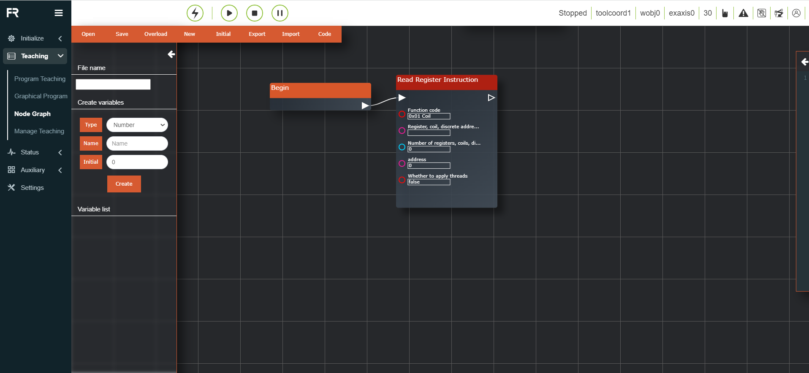

.. centered:: Figure 6.2.116 "Modbus Slave Read register instruction" node interface

11. Read register data command, parameters:

- Number of registers, coils, and discrete quantities: 0 ~ 255
- Whether to apply threads: No/Yes
  
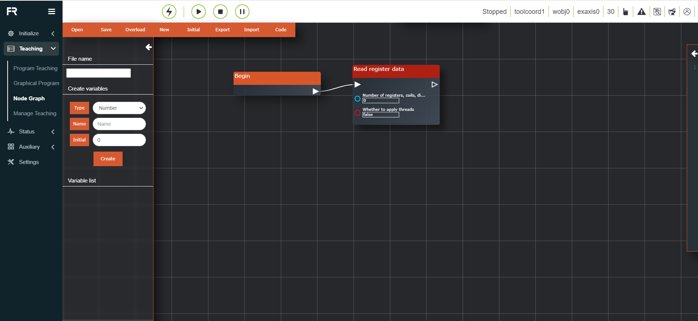

.. centered:: Figure 6.2.117 "Read register data" node interface

12. Write register command, parameters:

- Function code: 0x01-coil/0x02-discrete quantity/0x03-holding register/0x04-input register
- Register and coil address: input according to actual situation
- Number of registers and coils: 0 ~ 255
- Byte array: input according to actual situation
- Address: Enter according to actual situation
- Whether to apply threads: No/Yes
  
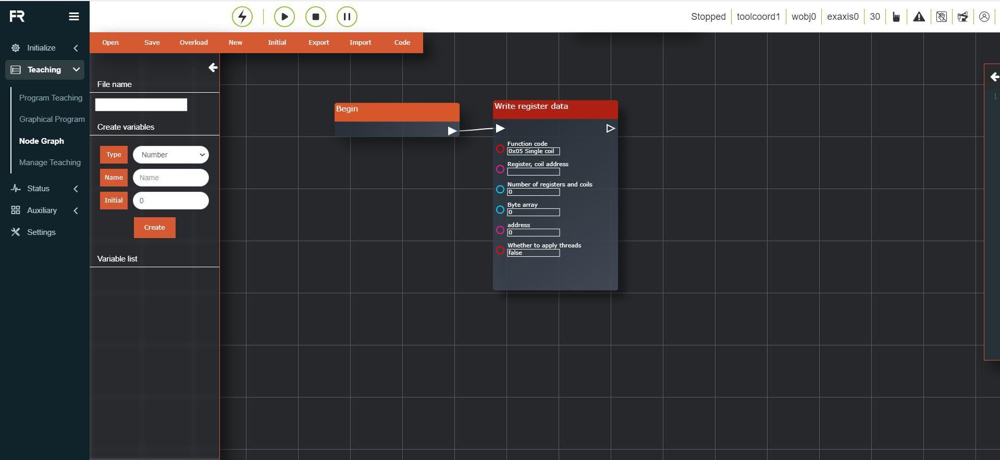

.. centered:: Figure 6.2.118 "Write Register" node interface

Application scenario usage examples
------------------------------------

For example, install a tip on the end of the robot and drag it to a position near the hole of the pallet. You want to perform spiral, rotational and linear insertion operations of the force sensor.

- First, right-click the mouse button and select the "Begin", "Start/End Control", "Spiral Insertion", "Rotation Insertion", and "Linear Insertion" command nodes;
- Connect as follows and configure relevant parameters.

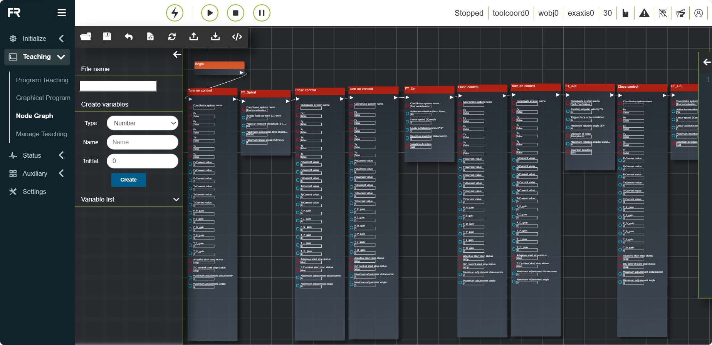

.. centered:: Figure 6.3.1 "Force Control" command node application configuration interface

- Enter the file name. If the correct parameters are not entered, the save will fail and a prompt will appear indicating that the command node parameter configuration is incorrect.

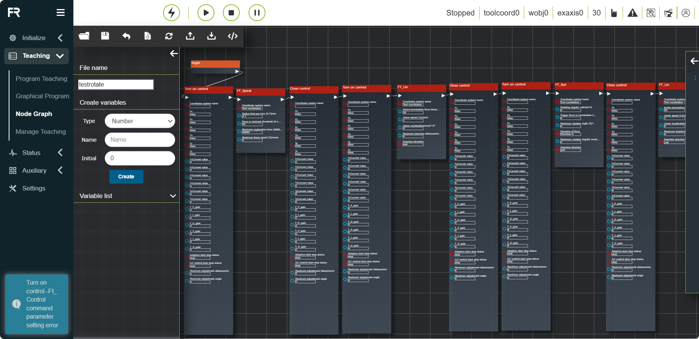

.. centered:: Figure 6.3.2 Command node parameter configuration error interface
  
- After clicking Run, the robot will explore in a spiral plus straight line motion. After exploring the correct hole position, use linear and rotational insertion movements until the hole is correctly inserted.

