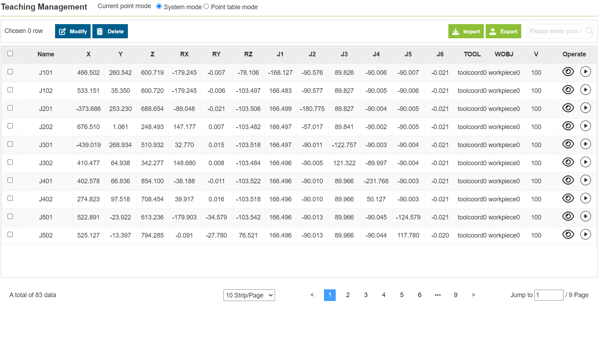

Points
===============

.. toctree:: 
   :maxdepth: 6

Click "Teaching Management" to display all saved teaching point information. In this interface, you can import and export teaching point files. After selecting a teaching point, click the "Delete" button to delete the point information. The values of teaching points x, y, z, rx, ry, rz and v can be modified. Enter the modified value, check the blue box on the left, and click the upper modification to modify the teaching point information. In addition, users can search for teaching points by name.

.. important:: 
   The modified values of the teaching points x, y, z, rx, ry, rz should not exceed the working range of the robot.

Teaching management is divided into two modes: "system mode" and "point table mode". When calling the robot program, different detection schemes can be implemented by calling different point tables to complete the formula requirements. Each time a device or product is added in the future, the point table data package can be downloaded to the robot through the host computer, and the new point table data package created by the robot can also be uploaded to the host computer.

**System mode**:Supports "modifiy, delete, import, and export" of teaching point content.

.. centered:: Figure 12.1-1 Teaching management interface-system mode

**Point table mode**:Supports "adding, applying, renaming, deleting, importing, and exporting" the point table, and "modifying and deleting" the point content in the point table.

.. centered:: Figure 12.1-2 Teaching management interface-point table mode

**Details**: Click the "Details" button to view the details of the teaching point.

.. centered:: Figure 12.1-3 Teach point details

**Run**: Click the "Start Run" button to perform a single-point operation of the local teaching point, and move the robot to the position of this point.

.. image:: points/004.png
   :width: 6in
   :align: center

.. centered:: Figure 12.1-4 Run teach point