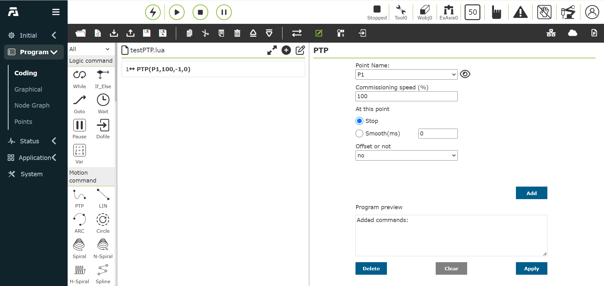
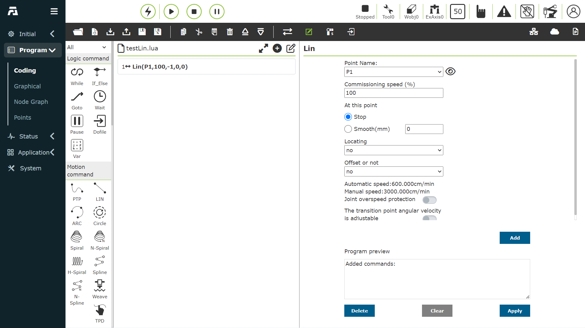

Robot Quick Programming
=========================

Introduction to Simple Motion Instructions
---------------------------------------------

**PTP command**: Click the “PTP” icon to enter the PTP command editing interface.

You can choose the point to be reached, and the smooth transition time setting can realize that the movement from this point to the next point is continuous. Whether to set the offset, you can choose to offset based on the base coordinate system and based on the tool coordinates, and pop up x, y, z, rx, ry, rz offset settings, PTP specific path is the optimal path automatically planned by the motion controller, click “Add” and “Apply” to save this command.

.. centered:: Figure 5.1-1 PTP command interface

**Lin command**: Click the “Lin” icon to enter the Lin command editing interface.

The function of this command is similar to the “PTP” command, but the path of the point reached by this command is a straight line.

.. centered:: Figure 5.1-2 Lin command interface

Operate on program files
--------------------------

Use the toolbar at the top of the program tree to modify the program tree.

.. note:: 
   .. image:: coding/006.png
      :height: 0.75in
      :align: left

   name: **Open**
   
   effect: Open user program file

.. note:: 
   .. image:: coding/007.png
      :height: 0.75in
      :align: left

   name: **New build**
   
   effect: Select a template to create a new program file
   
.. note:: 
   .. image:: coding/008.png
      :height: 0.75in
      :align: left

   name: **Import**
   
   effect: Import the file into the user program folder

.. note:: 
   .. image:: coding/009.png
      :height: 0.75in
      :align: left

   name: **Export**
   
   effect: Export user program files to a local point.

.. note:: 
   .. image:: coding/010.png
      :height: 0.75in
      :align: left

   name: **Save**
   
   effect: Save file edits

.. note:: 
   .. image:: coding/011.png
      :height: 0.75in
      :align: left

   name: **Save as**
   
   effect: Rename the file and store it in the user program or template program folder.

.. note:: 
   .. image:: coding/012.png
      :height: 0.75in
      :align: left

   name: **Copy**
   
   effect: Duplicates a node and allows it to be used for other operations (eg: paste it elsewhere in the program tree).

.. note:: 
   .. image:: coding/013.png
      :height: 0.75in
      :align: left

   name: **Paste**
   
   effect: Allows you to paste previously cut or copied nodes.

.. note:: 
   .. image:: coding/014.png
      :height: 0.75in
      :align: left

   name: **To cut**
   
   effect: Cuts a node and allows it to be used for other operations (eg: paste it elsewhere in the program tree).

.. note:: 
   .. image:: coding/015.png
      :height: 0.75in
      :align: left

   name: **Delete**
   
   effect: Deletes a node from the program tree.

.. note:: 
   .. image:: coding/016.png
      :height: 0.75in
      :align: left

   name: **Move up**
   
   effect: Move the node up.

.. note:: 
   .. image:: coding/017.png
      :height: 0.75in
      :align: left

   name: **Move down**
   
   effect: Move the node down.

.. note:: 
   .. image:: coding/018.png
      :height: 0.75in
      :align: left

   name: **Toggle edit mode**
   
   effect: The program tree mode and lua editing mode switch each other.

Write and run a program
-------------------------

The left side is mainly for adding program commands. Click the icon above each keyword to enter the detailed interface. There are two main operations for adding program commands to files:

- 1. Open the relevant command and click the Apply button to add the command to the program;

- 2. Click the "Add" button first. At this time, the command is not saved in the program file. You need to click "Apply" to save the command to the file.

The second method often appears when multiple commands of the same type are issued. We add the Add button and display the added command content function for this type of command. Click the Add button to add an instruction. The Added Instructions display all added instructions. Click "Apply" to save the added instructions to the opened file on the right.

Click the Start button to run the program; click the Stop button to stop the program; click the Pause/Resume button to pause/resume the program; when the program is running, the currently executed program node is highlighted in gray.

In manual mode, click the first icon on the right side of the node to make the robot execute the instruction alone, and the second icon is to edit the node content.

.. centered:: Figure 5.3-1 Program tree interface
