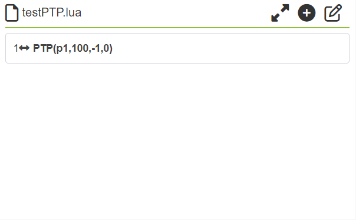
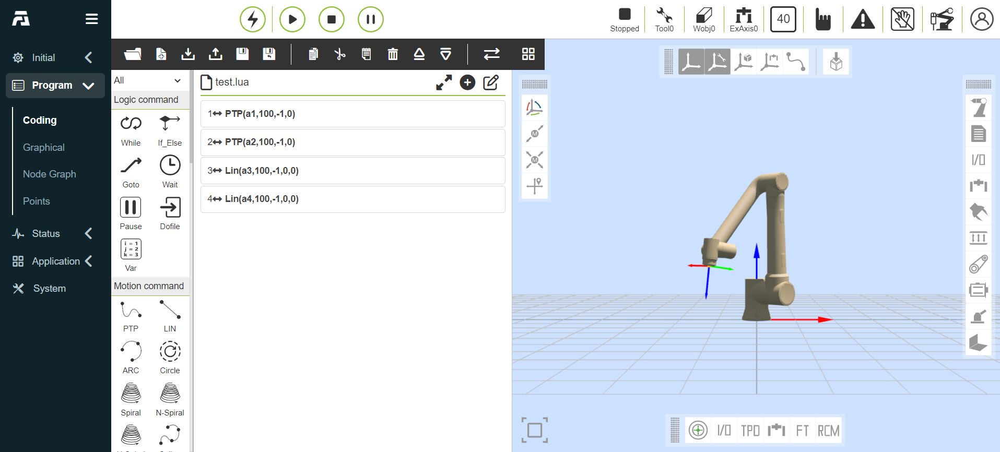

Quick start
============================

.. toctree:: 
   :maxdepth: 5

Install the robot arm and control box
------------------------------------------

Install the robot arm and control box according to the 2.5 and 2.6 in the hardware installation of Chapter 2.

-  Take out the robotic arm and use 4 M8 bolts with a strength of not less than 8.8 levels to install the robot arm. Install the robot arm on a strong and shock -proof surface. If it is fixed with aluminum plate, the thickness of the aluminum plate is not less than 16mm. If the iron plate is fixed, the thickness of the iron plate is not less than 8mm;

-  Place the control box on its feet;

-  Connect the robot arm ontology to the heavy load interface of the control box;

-  Plug the button box aviation plug into the control box exemporary instrument interface. If you are equipped with a touch-screen version of the teenter, you also need to use the data cable of both ends as the Type-C interface, insert the Type of the button box and the instructor, respectively. -c interface;

-  Make sure that the control box power button is closed (the button is hit to 0) to receive the 220V power cord to the power socket;

-  Plug in the power control box plug.

.. warning:: 
   If the robot is placed on a strong surface, the robot may dump and cause damage.

Demonstrate startup control robot
-------------------------------------

The control box is connected to the robot arm, the teaching box, and the physical electrical input/output terminal of any peripheral equipment. You must open the control box to power the robot's arm.

-  Press the power button of the control box to open the control box;

-  After starting the robot, at this time the robot is manual mode and has not enabled. If the robot needs to be operated in the manual mode, you need to press the three bits on the oscilloscopy to switch off (let go) ⇒ OFF (press) as the switch as a switch Drag or control the robot movement when you are on your state.

-  If you do not need to operate the robot in the manual mode, you can use the key switch to switch the robot working mode on the key to switch the button: automatic, manual, custom;

-  When switching the robot's manual state, check whether there is abnormal abnormality inside and outside the safety space and to operate the machine's operation carefully;

-  When switching the robot's automatic state, check the safety measures and return to the normal state and operate the machine operation carefully;

-  When the oscilloscope cannot be opened normally, please check whether the device connection is normal.

Button box control robot movement
---------------------------------------

Refer to the 2.7.3 of the hardware installation of Chapter 2. The end LED definition of the end to control the robot

Not paired with teaching pendant
~~~~~~~~~~~~~~~~~~~~~~~~~~~~~~~~~~~~

-  **Step1**:Turn on the power switch of the robot control box, start the robot, wait for the end LED to display green for a long time before operating the robot, as shown in Figure 3.3-1.

.. centered:: Figure 3.3-1 Green Schematic Diagram of End LED

-  **Step2**:Long press the button box "button 2" to enter the mode without teaching pendant, and the end LED flashes blue three times, as shown in Figure 3.3-2.

.. figure:: quick_start_robot/002.png
   :align: center
   :width: 4in

.. centered:: Figure 3.3-2 end LED blue blue schematic diagram

-  **Step3**:Long press button "button 1" Switch the robot to the drag mode. At this time, the end LED is white and blue, as shown in Figure 3.3-3. To any position of the mobile robot, long press the "button 1" to exit the drag mode, the short-press button box "button 2" records P1 point, the end LED purple flashes three times, as shown in Figure 3.3-4.

-  **Step4**:Mobile robot, short press button box "button 2" record P2 point, the end LED purple flashes three times, as shown in Figure 3.3-4.

.. centered:: Figure 3.3-3 end LED white green schematic diagram

.. centered:: Figure 3.3-4 end LED purple schematic diagram

-  **Step5**:The long press button "button 1" exit the drag mode. At this time, it is a manual mode. The end LED is green, as shown in Figure 3.3-5. Short press "Key 1" to switch the robot to the automatic mode. At this time, the end LED is blue, as shown in Figure 3.3-6.

-  **Step6**:The short press button "button 3" runs the program, the end LED blue flashes twice, as shown in Figure 3.3-6.

.. figure:: quick_start_robot/005.png
   :align: center
   :width: 4in

.. centered:: Figure 3.3-5 end LED green schematic diagram

.. figure:: quick_start_robot/006.png
   :align: center
   :width: 4in

.. centered:: Figure 3.3-6 end LED blue schematic diagram

-  **Step7**:Short press the button box "button 3" to stop running the program, and the red LED at the end flashes three times, as shown in Figure 3.3-7.

.. centered:: Figure 3.3-7 end LED red schematic diagram

Matching the oscilloscopy
~~~~~~~~~~~~~~~~~~~~~~~~~~~~

-  **Step1**:Start the robot and wait for the end LED green to stop flashing before operating the robot.

-  **Step2**:Open the oscilloscope and enter the program editing interface.

-  **Step3**:Select the blank template to create a new program file.

-  **Step4**:Short -press button box button 1 Switch the robot to the manual mode. At this time, the end LED is green.

-  **Step5**:Long press the button box button 1 to switch the robot to the drag mode. At this time, the end LED is white and green, the mobile robot to any position, the short press button box button 2 records P1, the end LED purple flashes three times, manually add "PTP: P1 "The instructions to the program file.

.. centered:: Figure 3.3-8 record and add some P1

-  **Step6**:Mobile robot, short -press button box button 2 records P2 point, end LED purple flashes three times, and manually add the "PTP: P2" instruction to the program.

.. figure:: quick_start_robot/009.png
   :align: center
   :width: 4in
   :class: figure-border

.. centered:: Figure 3.3-9 record and add some P2

-  **Step7**:Save the program file content.

-  **Step8**:Long press the button box button 1 to exit the drag mode. At this time, it is a manual mode. The end LED is green. The short press button box button 1 switch the robot to the automatic mode. At this time, the end LED is blue.

-  **Step9**:Short pressing button box button 3 Run the program, the end LED blue flashes twice.

Dempermaster control robot movement
--------------------------------------

Click the "Promotional Simulation" button in the first -level menu on the left side of the oscilloscopy, and click the sub -menu "Program Demonstration" to enter the program demonstration interface. The interface mainly implements the writing and modification of the robot teaching program.

After clicking the "New" icon button, the user names the file and selects a template as the content of the new file. Click the newly created to create a successful and open the program file.

   
.. centered:: Figure 3.4-1 Demonstration of teaching program running schematic diagram

.. warning:: 
   Your head and trunk cannot be located in the range (work area) that the robot can reach. Please do not put your fingers in the place where the robot can grasp.

.. important:: 
   - Don't let the robot move to yourself or other objects, because it will cause damage to the robot.
   - This is just a quick start guide to teach you how to easily use FR collaborative robots. The premise of this guide is that the environment is safe and harmless, and users are cautious. Do not increase the speed or acceleration to the default value. Before the robot enters the operation, risk assessment is always carried out.
