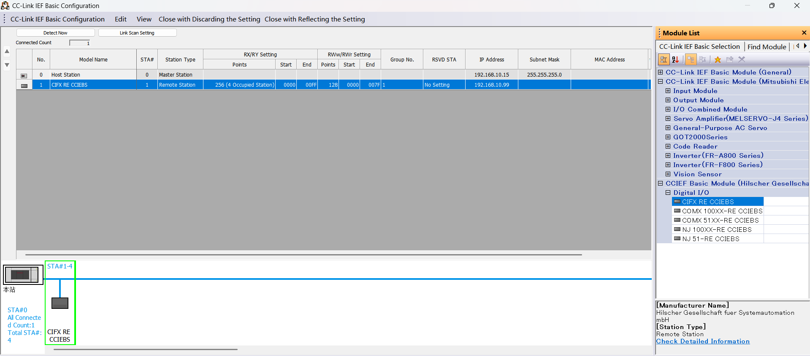
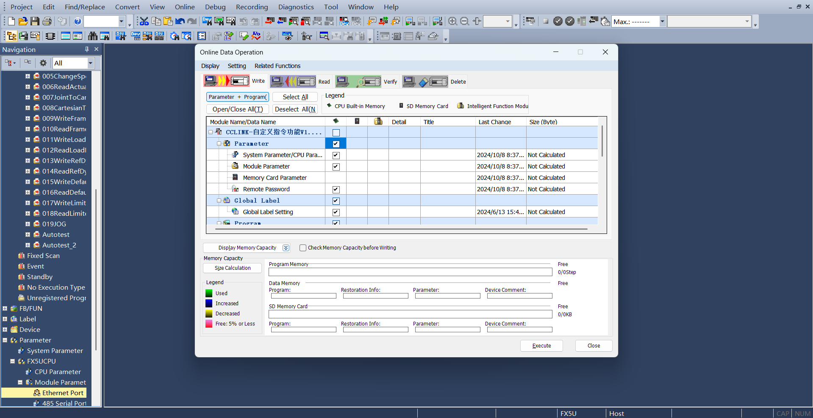
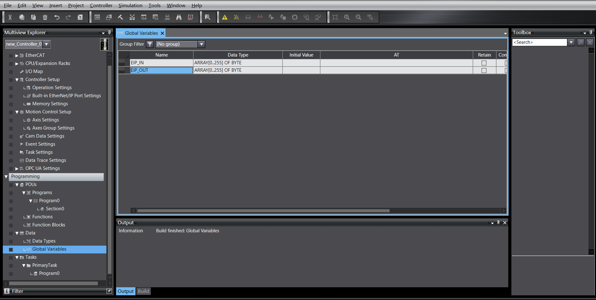
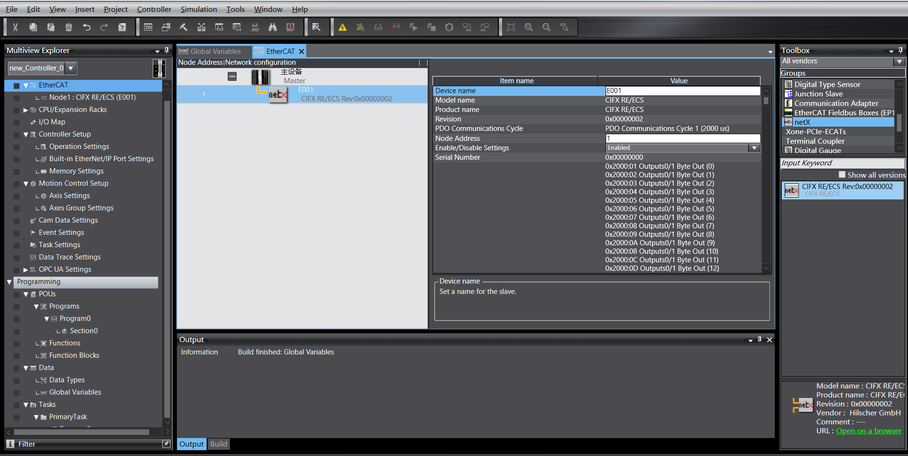

Robot Remote Mode
=============================================================

.. toctree::
   :maxdepth: 6

Overview
-------------------------

To facilitate PLC control of the robot via various industrial bus protocols (CC-Link, Profinet, Ethernet/IP, and EtherCAT), the FRH-PCIeN-EC/EIP/CC/PN-RJ-V10 and FRJ-PCIeN-EIP/CC/PN-RJ-V10 board modules are added to the integrated mini control box to achieve the following functions:

1) CC-Link slave protocol support;
2) Profinet slave protocol support;
3) Ethernet/IP slave protocol support;
4) EtherCAT slave protocol support (not supported by the FRJ-PCIeN-EIP/CC/PN-RJ-V10 board).

Environment Setup
--------------------------------------------

Board Installation
~~~~~~~~~~~~~~~~~~~~~~~~~~~~~~~~~~~~~~~~~~~~~

(1) Check materials: The FRH-PCIeN board, FRJ-PCIeN board, and matching sheet metal parts are shown below.

.. image:: remote_mode/001.png
   :width: 4in
   :align: center

.. centered:: Figure 18.2-1 Mounting Sheet Metal (Front)

.. image:: remote_mode/002.png
   :width: 4in
   :align: center

.. centered:: Figure 18.2-2 Mounting Sheet Metal (Back)

.. image:: remote_mode/003.png
   :width: 4in
   :align: center

.. centered:: Figure 18.2-3 FRH-PCIeN-EC/EIP/CC/PN-RJ-V10 Board

.. image:: remote_mode/004.png
   :width: 4in
   :align: center

.. centered:: Figure 18.2-4 FRJ-PCIeN-EIP/CC/PN-RJ-V10 Board

(2) Install the board into the integrated mini control box as shown.

.. image:: remote_mode/005.png
   :width: 4in
   :align: center

.. centered:: Figure 18.2-5 Sheet Metal Installation Diagram

.. image:: remote_mode/006.png
   :width: 4in
   :align: center

.. centered:: Figure 18.2-6 FRH-PCIeN Core Board Installation Diagram

.. image:: remote_mode/007.png
   :width: 4in
   :align: center

.. centered:: Figure 18.2-7 FRH-PCIeN Network Port (RJ45) Expansion Card Installation Diagram

.. image:: remote_mode/008.png
   :width: 4in
   :align: center

.. centered:: Figure 18.2-8 FRJ-PCIeN Core Board Installation Diagram

.. image:: remote_mode/009.png
   :width: 4in
   :align: center

.. centered:: Figure 18.2-9 FRJ-PCIeN Network Port (RJ45) Expansion Card Installation Diagram

.. note:: Note: All screws must be tightened.

(3) Wiring between the robot control box and the PLC is shown below.

.. image:: remote_mode/010.png
   :width: 4in
   :align: center

.. centered:: Figure 18.2-10 Control Box & Mitsubishi PLC Wiring Diagram

.. image:: remote_mode/011.png
   :width: 4in
   :align: center

.. centered:: Figure 18.2-11 Control Box & Siemens PLC Wiring Diagram

.. image:: remote_mode/012.png
   :width: 4in
   :align: center

.. centered:: Figure 18.2-12 Control Box & Omron PLC Wiring Diagram

.. image:: remote_mode/013.png
   :width: 4in
   :align: center

.. centered:: Figure 18.2-13 Control Box & Omron PLC Wiring Diagram

.. note::
    1: Robot control box (board network port);
    2: Switch;
    3: Laptop PC;
    4: Mitsubishi PLC (CC-Link IEF Basic port);
    5: Siemens PLC (Profinet port);
    6: Omron PLC (Ethernet/IP port);
    7: Omron PLC (EtherCAT port);

When the protocol is switched to EtherCAT bus, the board's network ports need to be distinguished as EtherCAT_IN and EtherCAT_OUT. In this case, the EtherCAT port of the Omron PLC must be directly connected to the board's EtherCAT_IN port via an Ethernet cable.

PLC Environment Setup
~~~~~~~~~~~~~~~~~~~~~~~~~~~~~~~~~~~~~~~~~~~~~~~~~~

The test environment set up to implement slave commands for each protocol is shown in the table below, including the PLC models, firmware versions, and test software used for each protocol.

.. centered:: Table 2-1 Test Environment

.. list-table::
   :widths: 20 40 40
   :header-rows: 1
   :align: center

   * - Protocol
     - Profinet
     - CC-link

   * - Brand
     - Siemens
     - Mitsubishi

   * - Model
     - CPU 1515-2 PN
     - FX5S-30TR/DS

   * - Firmware
     - 6ES75152AM020AB0
     - 30MR/ES V1.3

   * - Software
     - TIA Portal V17
     - GXWorks3V1.097B

   * - Board IP Address
     - "192.168.0.2"
     - "192.168.0.113"

   * - PLC IP Address
     - IP need not be on same subnet
     - "192.168.0.15" (IP on same subnet)

.. list-table::
   :widths: 20 40 40
   :header-rows: 1
   :align: center

   * - Protocol
     - Ethernet/IP
     - EtherCAT

   * - Brand
     - Omron
     - Omron

   * - Model
     - NX102-1100
     - NX102-1100

   * - Firmware
     - V1.3
     - V1.3

   * - Software
     - SysmacStudioV1.50
     - SysmacStudioV1.50

   * - Board IP Address
     - "192.168.0.112"
     - "192.168.0.2"

   * - PLC IP Address
     - "192.168.0.88" (IP on same subnet)
     - "192.168.0.88" (IP on same subnet)

Siemens Profinet
+++++++++++++++++++++++++++++++++++++++++++++++++++++++++++++

(1) Importing GSD file (XML file)

Open Siemens programming software TIA Portal V17, create a new PLC project, select "Devices & Networks", and double-click 6ES7 515-2AM02-0AB0 in the "Hardware Catalog" on the right to add the PLC module.

.. image:: remote_mode/014.png
   :width: 6in
   :align: center

In the TIA PORTAL software menu bar, select "Options" -> "Manage general station description files (GSD)" to install or delete already installed GSD files.

.. image:: remote_mode/015.png
   :width: 6in
   :align: center

To install the GSD file, select "Manage general station description files (GSD)" as above. The "Manage general station description files" window appears.

Select the folder containing the GSD file(s) to install from the "Source path", choose one or more files from the displayed list of GSD files, and click the "Install" button. As shown below.

.. image:: remote_mode/016.png
   :width: 6in
   :align: center

After successful installation, the device of the installed GSD file can be found under "Other field devices" in the hardware catalog, as shown below.

.. image:: remote_mode/017.png
   :width: 6in
   :align: center

Assign I/O: Drag Input and Output modules from the catalog.

.. image:: remote_mode/018.png
   :width: 6in
   :align: center

Download program to device: Double-click "Devices & Networks" in the left project tree, right-click the "PLC_1" module, select "Download to device" from the dropdown menu, click "Hardware and software (only changes)":

.. image:: remote_mode/019.png
   :width: 6in
   :align: center

Search and download device: After the popup, configure the PG/PC interface type as shown, click "Start search", select the device to download the program to, click "Download":

.. image:: remote_mode/020.png
   :width: 6in
   :align: center

.. image:: remote_mode/021.png
   :width: 6in
   :align: center

Mitsubishi CC-link
++++++++++++++++++++++++++++++++++++++++++++++++++++

(1) Import configuration file
Open GxWorks3, select "Tools" -> "Configuration File Management" -> "Login". After the popup, select the corresponding communication file, click "Login" to complete the configuration file import.

.. image:: remote_mode/022.png
   :width: 6in
   :align: center

.. image:: remote_mode/023.png
   :width: 6in
   :align: center

.. image:: remote_mode/024.png
   :width: 6in
   :align: center

(2) CC-Link IEF Basic Settings

Create a PLC project, enable CC-link: Select "Ethernet Port" in the left navigation menu, set the PLC IP address to ensure it is on the same subnet as the Hilscher board address. Click "CC-Link IEF Basic Use" and select "Use".

.. image:: remote_mode/025.png
   :width: 6in
   :align: center

CC-Link Network Configuration Settings: Still in CC-Link IEF Basic Settings, select "Network Configuration Settings". Select the Hilscher CIFX Digital I/O module for the module. Drag it to the bottom left of the view to complete the hardware configuration.

CC-Link Refresh Settings: Still in CC-Link IEF Basic Settings, click "Refresh Settings". Customize transfer settings: 256 bytes receive, 256 bytes send.

.. image:: remote_mode/027.png
   :width: 6in
   :align: center

(3) Program Download

After opening the test program, click "Online" -> "Write to PLC" to enter the download interface.

.. image:: remote_mode/028.png
   :width: 6in
   :align: center

After opening the download interface, click "Parameters + Program" at the top left, then click "Execute" at the bottom right to download. Wait for the download to complete.

Omron Ethernet/IP
++++++++++++++++++++++++++++++++++++++++++++++++++++++++

(1) Create a new PLC project (This example uses model: NX102-1100, 1.47 Omron PLC):

.. image:: remote_mode/030.png
   :width: 6in
   :align: center

Create new global variables:

(2) Import EDS file

Click "Tools" -> "EtherNet/IP Connection Settings":

.. image:: remote_mode/032.png
   :width: 6in
   :align: center

Enter the settings for the PLC to be connected:

.. image:: remote_mode/033.png
   :width: 6in
   :align: center

Right-click in the blank area of the tag group to create a new tag group:

.. image:: remote_mode/034.png
   :width: 6in
   :align: center

Right-click the newly created tag group, create tags. Same for input and output, both 256 bytes in length:

.. image:: remote_mode/035.png
   :width: 6in
   :align: center

.. image:: remote_mode/036.png
   :width: 6in
   :align: center

Enter connection settings, right-click in the blank area of the toolbox, right-click to display the EDS library:

.. image:: remote_mode/037.png
   :width: 6in
   :align: center

Install the EDS file:

.. image:: remote_mode/038.png
   :width: 6in
   :align: center

Click the "+" in the toolbox, add the target device, fill in the target device IP address:

.. image:: remote_mode/039.png
   :width: 6in
   :align: center

Click "Add" at the bottom right. After successful addition, the target device is displayed:

.. image:: remote_mode/040.png
   :width: 6in
   :align: center

(3) EtherNet/IP Parameter Settings

Right-click the added target device, click "Edit":

.. image:: remote_mode/041.png
   :width: 6in
   :align: center

The current device data mapping length is 256 bytes. Change 0001 and 0002 to 256, confirm:

.. image:: remote_mode/042.png
   :width: 6in
   :align: center

Double-click the target device, fill in the input and output, select the starting variable:

.. image:: remote_mode/043.png
   :width: 6in
   :align: center

(4) Program Download

Open the test program, modify the PLC IP address to the same subnet as the board, download the program and run it.

Omron EtherCAT
+++++++++++++++++++++++++++++++++++++++++++++++++

(1) Create a new PLC project (This example uses model: NX102-1100, 1.47 Omron PLC):

.. image:: remote_mode/044.png
   :width: 6in
   :align: center

Create new global variables:

.. image:: remote_mode/045.png
   :width: 6in
   :align: center

(2) Import XML file

Double-click "EtherCAT" to enter the master settings interface, right-click and select "Show ESI Library".

.. image:: remote_mode/046.png
   :width: 6in
   :align: center

.. image:: remote_mode/047.png
   :width: 6in
   :align: center

In the right toolbox, select the added target device, double-click to add the slave:

(3) EtherCAT Slave Settings

Set the slave's "Distributed Clock valid" to "Start DC":

.. image:: remote_mode/049.png
   :width: 6in
   :align: center

(4) I/O Mapping

Double-click "I/O Map" to bind variables to addresses:

.. image:: remote_mode/050.png
   :width: 6in
   :align: center

(5) Program Download

Open the test program, modify the PLC IP address to the same subnet as the board, download the program and run it.

Robot Remote Mode Operation Instructions
----------------------------------------------------------------------------

(1) Enter IP address 192.168.58.2 in the browser. Username is admin, password is 123. Click "Login" to access the robot control box web interface.

.. image:: remote_mode/051.png
   :width: 6in
   :align: center

.. centered:: Figure 18.2-14 Control Box Web Interface

(2) Click "System Settings" -> "About" -> Software Upgrade interface. Click the "Upgrade" button, upload the software package to be upgraded, click "Upgrade" to start the upgrade. Restart the control box after the upgrade is complete.

.. image:: remote_mode/052.png
   :width: 6in
   :align: center

.. centered:: Figure 18.2-15 Software Upgrade

(3) Click the expand button in the upper right corner to open the menu bar. Click "Local Mode" to switch to "Remote Mode".

.. image:: remote_mode/053.png
   :width: 4in
   :align: center

.. centered:: Figure 18.2-16 Switching to Remote Mode

(4) Select the controller slave protocol and whether the auto-start function is needed. Click the "Set" button.

.. image:: remote_mode/054.png
   :width: 6in
   :align: center

.. centered:: Figure 18.2-17 Configuring Communication Protocol

.. note:: To switch between different protocols, you must first click the "Uninstall" button before configuring another protocol.

Appendix
-------------------

Command List
~~~~~~~~~~~~~~~~~~~~~~~~~~~

.. list-table::
   :widths: 20 80
   :header-rows: 1
   :align: center

   * - Command Code
     - Command Description

   * - 0x1000
     - Robot Enable

   * - 0x1001
     - Reset All Errors

   * - 0x1002
     - Robot Stop Motion

   * - 0x1003
     - Read Actual Position

   * - 0x1004
     - Set Robot Speed

   * - 0x1005
     - Robot Continue Motion

   * - 0x1006
     - Robot Pause Motion

   * - 0x1007
     - Calculate Cartesian Position based on Joint Position

   * - 0x1008
     - Calculate Joint Position based on Cartesian Position

   * - 0x2000
     - Write Tool Information

   * - 0x2001
     - Read Tool Information

   * - 0x2002
     - Write Workpiece Information

   * - 0x2003
     - Read Workpiece Information

   * - 0x2004
     - Write Load Information

   * - 0x2005
     - Read Load Information

   * - 0x2006
     - Write Reference Dynamic Information

   * - 0x2007
     - Read Reference Dynamic Information

   * - 0x2008
     - Write Default Dynamic Information

   * - 0x2009
     - Read Default Dynamic Information

   * - 0x2010
     - Write Software Limit Information

   * - 0x2011
     - Read Software Limit Information

   * - 0x3000
     - MoveAxes (based on joint angles)

   * - 0x3001
     - MoveLinear

   * - 0x3002
     - MoveDirect (based on Cartesian coordinate system)

   * - 0x3003
     - Jog Motion

   * - 0x3004
     - Jog Stop