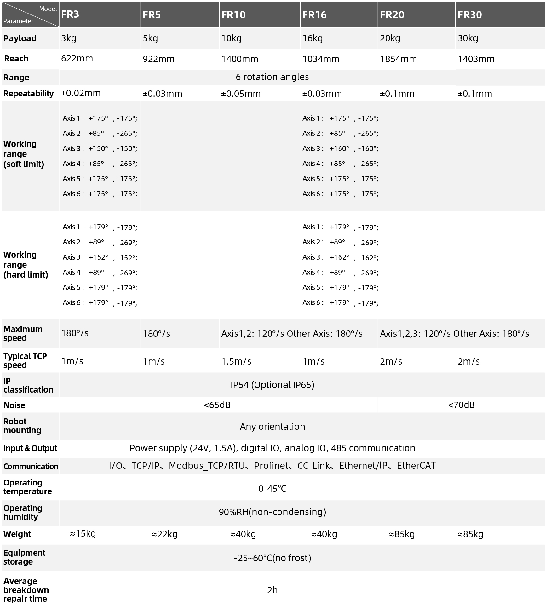
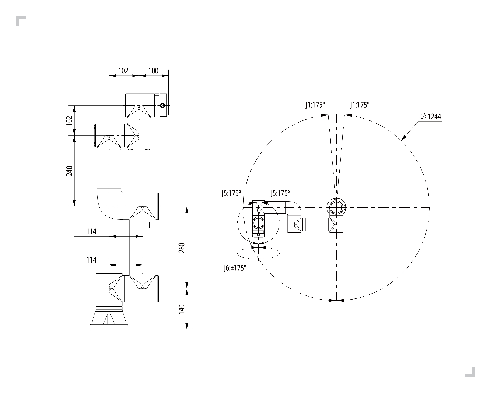
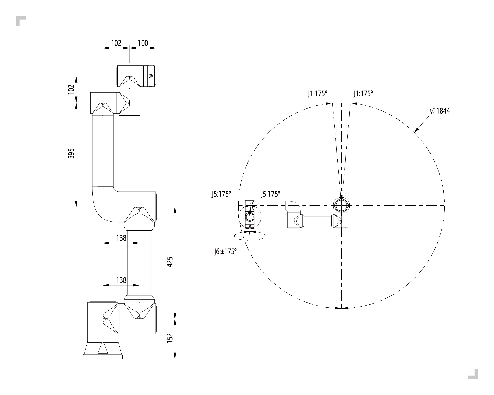
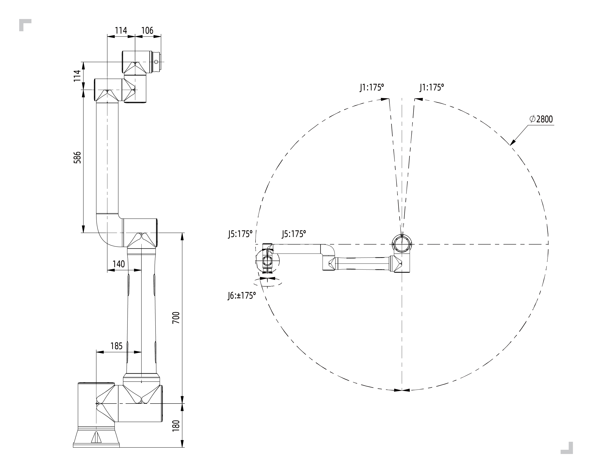
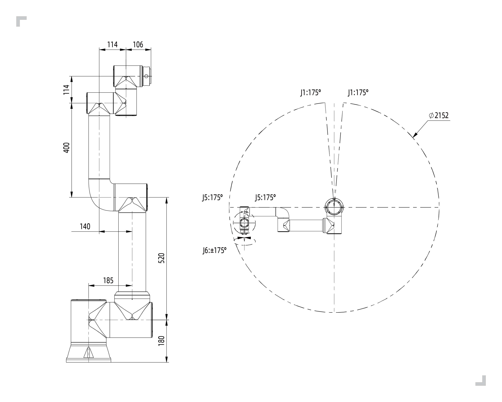
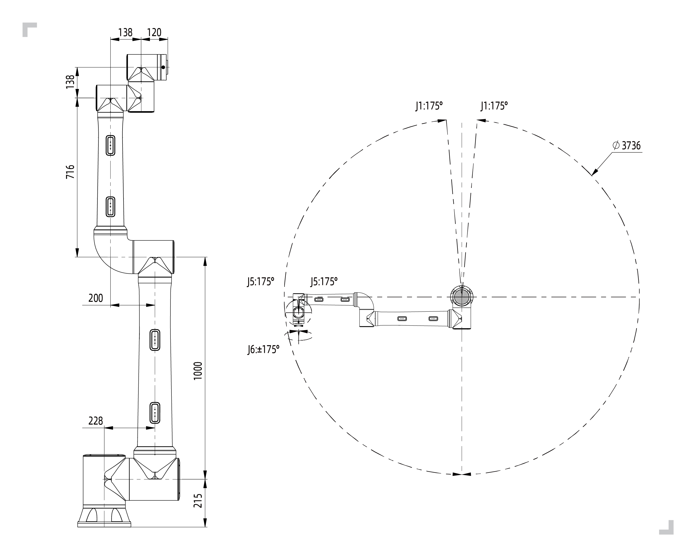
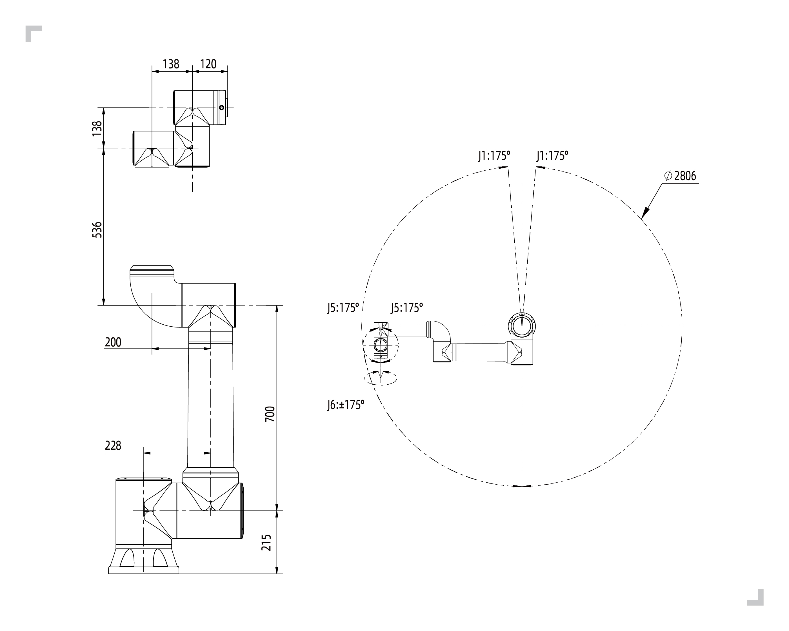
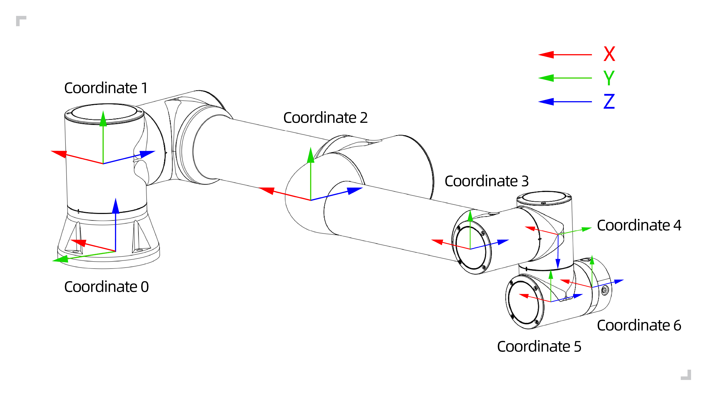
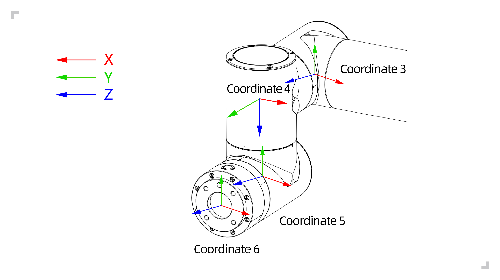
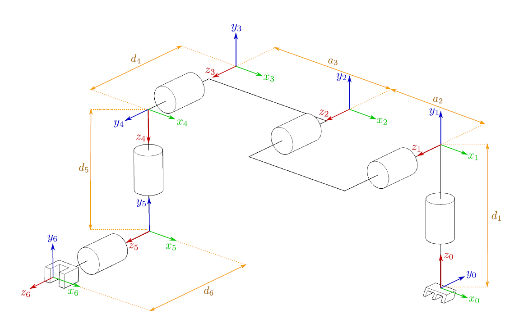

Robot brief introduction
===========================

.. toctree:: 
	:maxdepth: 5

Basic parameters
------------------

.. centered:: Table 2.1-1 Basic parameters of robotics

.. important::
  When the FR series robot performs attitude or coordinate system transformation, the angle rotation sequence calculated by the homogeneous transformation matrix is "ZYX" of the floating coordinate system.

Motion
------------------

Robotic arm installation space:

The installation of the robot body requires a space of 3m × 3m × 2m (length × width × height) to meet the motion under the maximum wingspan of the robot; if the user increases the end load by itself, make sure that there is a minimum 500mm gap in the installation space.

.. note:: 
	The height space is affected by the height of the installation base, where 2m refers to the distance above the installation reference plane

Control cabinet installation space:

1.The control box should be placed in easy operation to prevent water flooding, 0.6m-1.5m from the ground.

2.The cabinet must be far away from the heat source.

3.On one side of the control box's heavy load line, there should be no obstruction within 150mm, and the remaining side shall be not covered within 100mm, which is convenient for heat dissipation and extraction.

.. centered:: Figure 2.1-1 FR3 model collaboration robot movement range

.. centered:: Figure 2.1-2 FR5 model collaboration robot movement range

.. centered:: Figure 2.1-3 FR10 model collaboration robot movement range

.. centered:: Figure 2.1-4 FR16 model collaboration robot movement range

.. centered:: Figure 2.1-5 FR20 model collaboration robot movement range

.. centered:: Figure 2.1-6 FR30 model collaboration robot movement range

Robot coordinate system
------------------------------------

.. centered:: Figure 2.3-1 Robot DH parameter coordinate system

.. centered:: Figure 2.3-2 French -endframe coordinate system

Robot Denavit–Hartenberg parameters
------------------------------------

Denavit–Hartenberg parameters are used to calculate kinematics and dynamics of FR series collaborative robots.

.. centered:: Figure 2.4-1 FR series collaborative robots Denavit–Hartenberg parameters

The Denavit–Hartenberg parameters of FR series collaborative robots are shown as below.

.. centered:: Table 2.4-1 FR3 model collaboration robot Denavit–Hartenberg parameter

.. list-table::
    :widths: 70 50 50 50 50 70 50 120
    :header-rows: 0
    :class: no-padding sheet-center

    * - **Kinematics**
      - **theta[rad]**
      - **a[m]**
      - **d[m]**
      - **alpha[rad]**
      - **Dynamics**
      - **Mass[kg]**
      - **Center of Mass[m]**

    * - Joint1
      - 0
      - 0
      - 140
      - π/2
      - link1
      - 2.24
      - [-0.05, -15.92, 2.26]
    
    * - Joint2
      - 0
      - -280
      - 0
      - 0
      - link2
      - 4.94
      - [139.49, 0, 99.54]

    * - Joint3
      - 0
      - -240
      - 0
      - 0
      - link3
      - 2.29
      - [58.99, 0.08, 12.99]
    
    * - Joint4
      - 0
      - 0
      - 102
      - π/2
      - link4
      - 1.56
      - [0.05, -2.33, 14.67]
    
    * - Joint5
      - 0
      - 0
      - 102
      - -π/2
      - link5
      - 1.56
      - [-0.05, 2.33, 14.67]
    
    * - Joint6
      - 0
      - 0
      - 100
      - 0
      - link6
      - 0.36
      - [-0.55, -1.11, -20.05]

.. centered:: Table 2.4-2 FR5 model collaboration robot Denavit–Hartenberg parameter

.. list-table::
    :widths: 70 50 50 50 50 70 50 120
    :header-rows: 0
    :class: no-padding sheet-center

    * - **Kinematics**
      - **theta[rad]**
      - **a[m]**
      - **d[m]**
      - **alpha[rad]**
      - **Dynamics**
      - **Mass[kg]**
      - **Center of Mass[m]**

    * - Joint1
      - 0
      - 0
      - 152
      - π/2
      - link1
      - 4.64
      - [-0.19, -18.28, 2.26]
    
    * - Joint2
      - 0
      - -425
      - 0
      - 0
      - link2
      - 10.08
      - [212.47, 0, 121.2]

    * - Joint3
      - 0
      - -395
      - 0
      - 0
      - link3
      - 2.71
      - [122.62, 0.17, 12.59]
    
    * - Joint4
      - 0
      - 0
      - 102
      - π/2
      - link4
      - 1.56
      - [0.05, -2.33, 14.68]
    
    * - Joint5
      - 0
      - 0
      - 102
      - -π/2
      - link5
      - 1.56
      - [-0.05, 2.33, 14.68]
    
    * - Joint6
      - 0
      - 0
      - 100
      - 0
      - link6
      - 0.36
      - [0.93, 0.81, -20.05]

.. centered:: Table 2.4-3 FR10 model collaboration robot Denavit–Hartenberg parameter

.. list-table::
    :widths: 70 50 50 50 50 70 50 120
    :header-rows: 0
    :class: no-padding sheet-center

    * - **Kinematics**
      - **theta[rad]**
      - **a[m]**
      - **d[m]**
      - **alpha[rad]**
      - **Dynamics**
      - **Mass[kg]**
      - **Center of Mass[m]**

    * - Joint1
      - 0
      - 0
      - 180
      - π/2
      - link1
      - 11.97
      - [-0.10, -26.12, 4.04]
    
    * - Joint2
      - 0
      - -700
      - 0
      - 0
      - link2
      - 19.59
      - [480.27, 0.01, 164.68]

    * - Joint3
      - 0
      - -586
      - 0
      - 0
      - link3
      - 3.7
      - [211.22, 0.11, 54.21]
    
    * - Joint4
      - 0
      - 0
      - 159
      - π/2
      - link4
      - 1.69
      - [0.12, -3, 12.18]
    
    * - Joint5
      - 0
      - 0
      - 114
      - -π/2
      - link5
      - 1.69
      - [-0.12, 3, 12.18]
    
    * - Joint6
      - 0
      - 0
      - 106
      - 0
      - link6
      - 0.35
      - [1.24, 0.85, -20.34]

.. centered:: Table 2.4-4 FR16 model collaboration robot Denavit–Hartenberg parameter

.. list-table::
    :widths: 70 50 50 50 50 70 50 120
    :header-rows: 0
    :class: no-padding sheet-center

    * - **Kinematics**
      - **theta[rad]**
      - **a[m]**
      - **d[m]**
      - **alpha[rad]**
      - **Dynamics**
      - **Mass[kg]**
      - **Center of Mass[m]**

    * - Joint1
      - 0
      - 0
      - 180
      - π/2
      - link1
      - 11.97
      - [-0.10, -26.12, 4.04]
    
    * - Joint2
      - 0
      - -520
      - 0
      - 0
      - link2
      - 18.18
      - [364.4, 0.01, 163.09]

    * - Joint3
      - 0
      - -400
      - 0
      - 0
      - link3
      - 3.22
      - [135.03, 0.12, 55.58]
    
    * - Joint4
      - 0
      - 0
      - 159
      - π/2
      - link4
      - 1.69
      - [0.12, -3, 12.18]
    
    * - Joint5
      - 0
      - 0
      - 114
      - -π/2
      - link5
      - 1.69
      - [-0.12, 3, 12.18]
    
    * - Joint6
      - 0
      - 0
      - 106
      - 0
      - link6
      - 0.35
      - [1.24, 0.85, -20.34]

.. centered:: Table 2.4-5 FR20 model collaboration robot Denavit–Hartenberg parameter

.. list-table::
    :widths: 70 50 50 50 50 70 50 120
    :header-rows: 0
    :class: no-padding sheet-center

    * - **Kinematics**
      - **theta [rad]**
      - **a [m]**
      - **d [m]**
      - **alpha [rad]**
      - **Dynamics**
      - **Mass [kg]**
      - **Center of Mass [m]**

    * - Joint1
      - 0
      - 0
      - 215
      - π/2
      - link1
      - 20.79
      - [-0.19, -36.57, 5.68]
    
    * - Joint2
      - 0
      - -1000
      - 0
      - 0
      - link2
      - 42.84
      - [605.25, 0.06, 202.94]

    * - Joint3
      - 0
      - -716
      - 0
      - 0
      - link3
      - 9.88
      - [262.84, 0.22, 43.08]
    
    * - Joint4
      - 0
      - 0
      - 166
      - π/2
      - link4
      - 4.64
      - [0.23, -2.28, 18.42]
    
    * - Joint5
      - 0
      - 0
      - 138
      - -π/2
      - link5
      - 4.64
      - [-0.23, 2.28, 18.42]
    
    * - Joint6
      - 0
      - 0
      - 120
      - 0
      - link6
      - 0.6
      - [-2.11, -1.96, -20.38]

.. centered:: Table 2.4-6 FR30 model collaboration robot Denavit–Hartenberg parameter

.. list-table::
    :widths: 70 50 50 50 50 70 50 120
    :header-rows: 0
    :class: no-padding sheet-center

    * - **Kinematics**
      - **theta [rad]**
      - **a [m]**
      - **d [m]**
      - **alpha [rad]**
      - **Dynamics**
      - **Mass [kg]**
      - **Center of Mass [m]**

    * - Joint1
      - 0
      - 0
      - 215
      - π/2
      - link1
      - 20.64
      - [-0.22, -37.39, 5.59]
    
    * - Joint2
      - 0
      - -700
      - 0
      - 0
      - link2
      - 36.37
      - [440.73, 0.05, 198.7]

    * - Joint3
      - 0
      - -536
      - 0
      - 0
      - link3
      - 8.41
      - [185.64, 0.25, 45.82]
    
    * - Joint4
      - 0
      - 0
      - 166
      - π/2
      - link4
      - 4.64
      - [0.23, -2.29, 18.60]
    
    * - Joint5
      - 0
      - 0
      - 138
      - -π/2
      - link5
      - 4.64
      - [-0.23, 2.29, 18.60]
    
    * - Joint6
      - 0
      - 0
      - 120
      - 0
      - link6
      - 0.6
      - [-2.11, -1.96, -20.38]

DH parameter download
------------------------------------
    :download:`FR Robots DH Transformation <../_static/_doc/FR Robots DH Transformation.xlsx>`
