Peripheral
=============

.. toctree:: 
  :maxdepth: 5

Gripper Peripheral Configuration
------------------------------------

Gripper program teaching steps
~~~~~~~~~~~~~~~~~~~~~~~~~~~~~~~~~~~~

**Step1**: In the "Initial - Peripheral - End-tool" menu bar, click "Adapter device" to enter the terminal peripheral configuration interface.

Select "Gripper Device" for the device type. The configuration information of the gripper is divided into gripper manufacturer, gripper type, software version and mounting location. Specific production requirements to configure the corresponding jaw information. If the user needs to change the configuration, first select the corresponding gripper number, click the "Clear" button to clear the corresponding button, and reconfigure according to the needs;

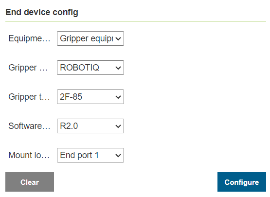

.. centered:: Figure 8.1-1 Gripper Jaw Configuration

.. important:: 
	The corresponding gripper should be inactive before clicking Clear Configuration.

**Step2**: After the gripper configuration is completed, the user can view the corresponding gripper information in the gripper information table at the bottom of the page. If configuration errors are found, click the "Reset" button to reconfigure the grippers;

.. figure:: robot_peripherals/002.png
   :align: center
   :width: 3in

.. centered:: Figure 8.1-2 Gripper configuration information

**Step3**: Select the configured gripper and click the "Reset" button. After the page pops up and the command is successfully sent, click the "Activate" button to check the activation status in the gripper information table to determine whether the activation is successful;

.. important::
	When the gripper is activated, the gripper must not have a gripping object

**Step4**: Select the "Gripper" command in the program teaching command interface. In the gripper command interface, the user can select the number of the gripper to be controlled (the gripper that has been configured and activated), and set the corresponding opening and closing state, opening and closing speed, and the maximum opening and closing torque that have been waiting for the gripper to move. time. After completing the settings, click Add Application. Additionally, gripper activation and reset commands can be added to deactivate/reset the gripper while running a program.

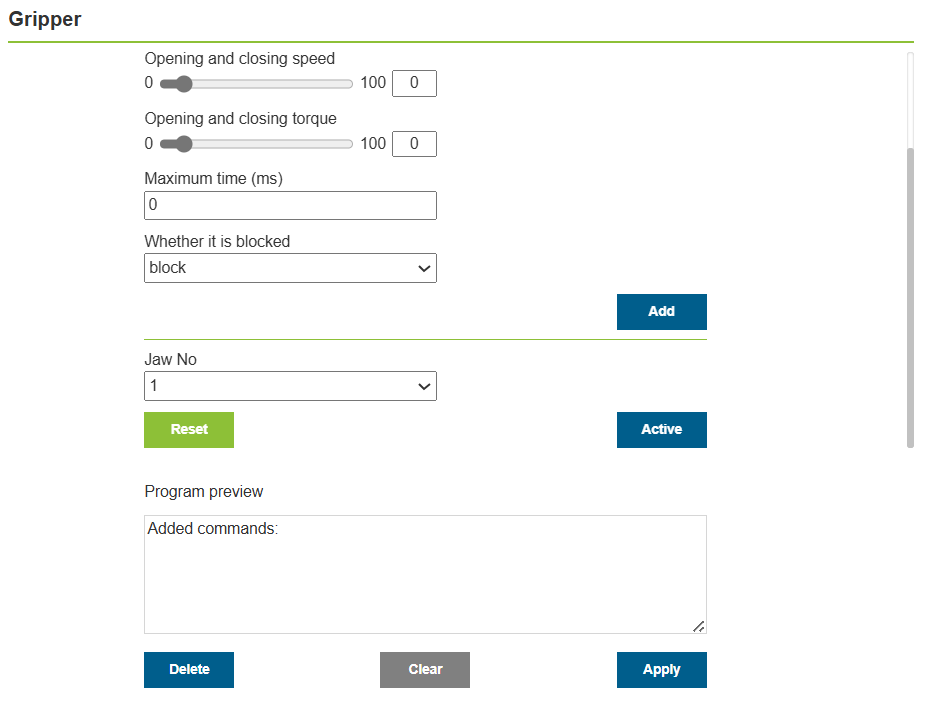

.. centered:: Figure 8.1-3 Gripper Command Edit

Gripper program teaching
~~~~~~~~~~~~~~~~~~~~~~~~~~~~

.. list-table:: 
   :widths: 15 40 100
   :header-rows: 1
   :align: center

   * - S/N
     - Instruction format
     - notes
   * - 1
     - PTP(template2,100,-1,0)
     - #Waiting for pinch point
   * - 2
     - PTP(template1,100,-1,0)
     - #Pinch point
   * - 3
     - MoveGripper(1,255,255,0,1000,0)
     - #Clamping jaws closed
   * - 4
     - PTP(template2,100, -1,0)
     - /
   * - 5
     - PTP(template3,100, -1,0)
     - #Waiting for placement point
   * - 6
     - PTP(template3,100, -1,0)
     - #Placement point
   * - 7
     - MoveGripper(1,0,255,0,1000,0)
     - #Clamping jaws open

Lua terminal open protocol configuration
---------------------------------------------

Overview
~~~~~~~~~~

Lua open protocol supports force sensor, single gripper, multiple grippers, force sensors and grippers in conjunction with each other.

Procedure
~~~~~~~~~~~

**Step1**:Enter the Tool App -> System upgrade, select the terminal firmware.bin file to upgrade the terminal firmware.

.. important:: 
   You need to first confirm whether the terminal firmware version FV2.010.06 and later software versions are compatible. If the version does not match, the corresponding software firmware is upgraded, otherwise there is no need to upgrade the firmware. 

   Before uploading the terminal firmware upgrade package, you need to enter the boot mode.

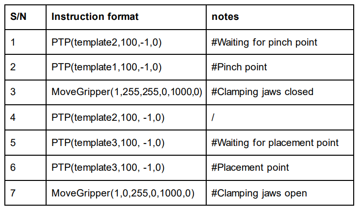

.. centered:: Figure 8.2-1 Upgrade terminal firmware

**Step2**:Go to Peripheral -> End-tool -> Open protocol -> Protocol configuration, select the Lua terminal open protocols to be uploaded, and perform the upload operation.

.. important:: Before uploading the terminal protocol, you need to enter the boot mode. At the same time, the file name needs to start with AXLE_LUA.

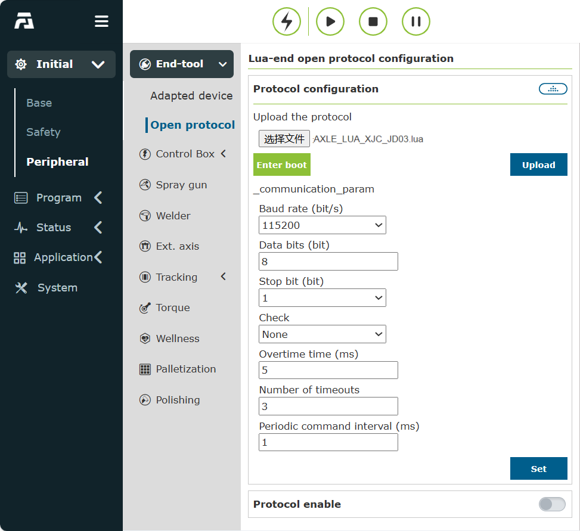

.. centered:: Figure 8.2-2 Upload Lua terminal open protocol

**Step3**:Configure the terminal communication parameters, including baud rate, data bit, stop bit, etc. After the configuration is completed, click the "Set" button.

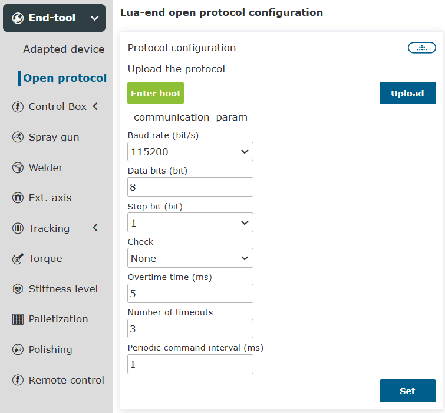

.. centered:: Figure 8.2-3 Configure terminal communication parameters

The detailed parameters of terminal communication are as follows:

- **Baud rate**: supports 1-9600, 2-14400, 3-19200, 4-38400, 5-56000, 6-67600, 7-115200, 8-128000; The terminal RS485 driver chip is a low-speed 485, and the baud rate cannot be >200k;
- **Data bits**:Data bits support (8,9), currently 8 is commonly used;
- **Stop bits**: 1-1, 2-0.5, 3-2, 4-1.5, currently commonly used =1;
- **Check bit**: 0-None, 1-Odd, 2-Even, currently commonly used as 0;
- **Timeout**: 1~1000ms, this value needs to be combined with the peripherals to set reasonable time parameters;
- **Number of timeouts**: 1~10, mainly for timeout retransmission, reducing occasional exceptions and improving user experience;
- **Periodic instruction time interval**: 1~1000ms, mainly used for the time interval between each issuance of periodic instructions;

**Step4**:To enable Lua at the end, click the "Enable" button.

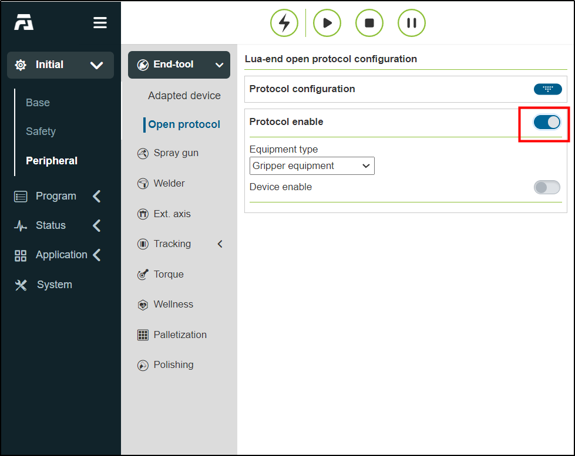

.. centered:: Figure 8.2-4 Terminal Lua enabled

When an exception occurs in a Lua file, a warning "Lua file exception at the end" is displayed, and you can choose to "not recover/recover". Turn off the Lua enable button and the warning prompt will be closed.

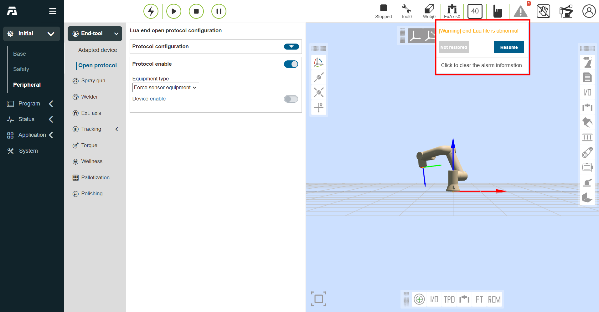

.. centered:: Figure 8.2-5  Lua file exception

Enter the Status Information->Status Query page to query the original data chart of the force/torque sensor. The correctness of the one-dimensional data (Fz) is successfully verified for 0kg 3kg 6kg. Data Fx, Fy, Mx, My, and Mz can also be collected in other dimensions, as shown below:

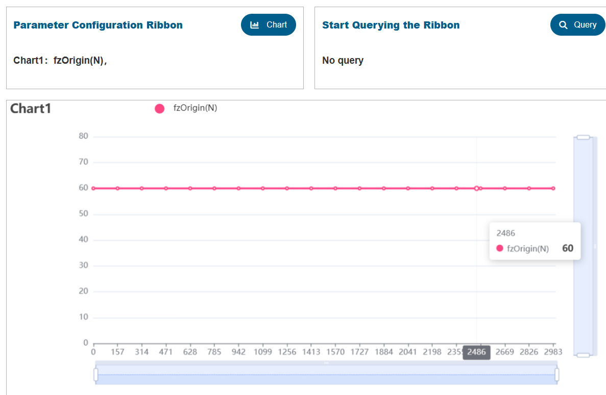

.. centered:: Figure 8.2-6 Force/Torque Sensor

Terminal peripheral configuration
--------------------------------------

Force sensor equipment
~~~~~~~~~~~~~~~~~~~~~~~~~~

Device type select Force sensor equipment -> Enable Force sensor equipment, the Force transducer is displayed in the configured device. Click to enter FT interface to query force sensor data.

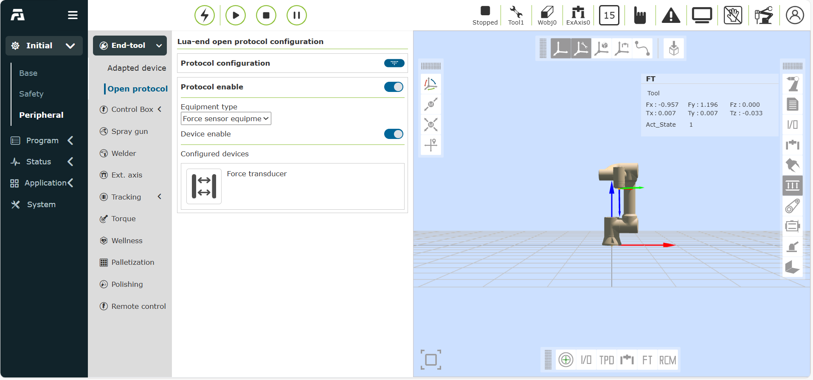

.. centered:: Figure 8.3-1 Enable force sensor

Gripper equipment
~~~~~~~~~~~~~~~~~~~~~

**Step1**: Device Type Select Gripper equipment -> Enable Gripper -> Select Gripper ID -> Check the function code that the gripper is adapted to -> Click Configure, and the ID and function code of the gripper will be displayed in the configured device.

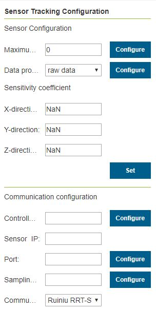

.. centered:: Figure 8.3-2 Configure gripper

.. note:: 
  As the end open function currently supports the gripper device address range of 1~8, the gripper device address should be adjusted through the gripper manufacturer's host computer before use.

  The ticked function code should be checked through the product manual provided by the gripper manufacturer to check the function of the gripper adapted, and it should keep corresponding with the terminal Lua function code, please consult 《Terminal Lua Adaptation Gripper Instruction Manual》for details.

**Step2**: Select Gripper ID -> Reset -> Active, the gripper is initialized once, please refer to the product manual provided by the gripper manufacturer for specific initialization.

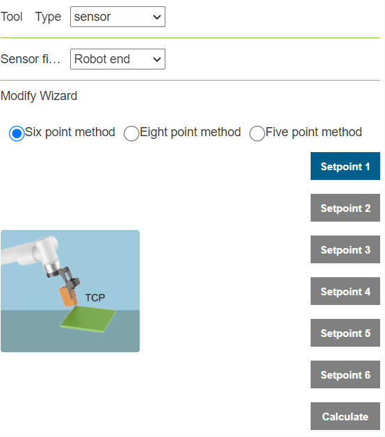

.. centered:: Figure 8.3-3 Activate the gripper

**Step3**: Go to Program -> coding -> Gripper -> Add gripper motion instruction.

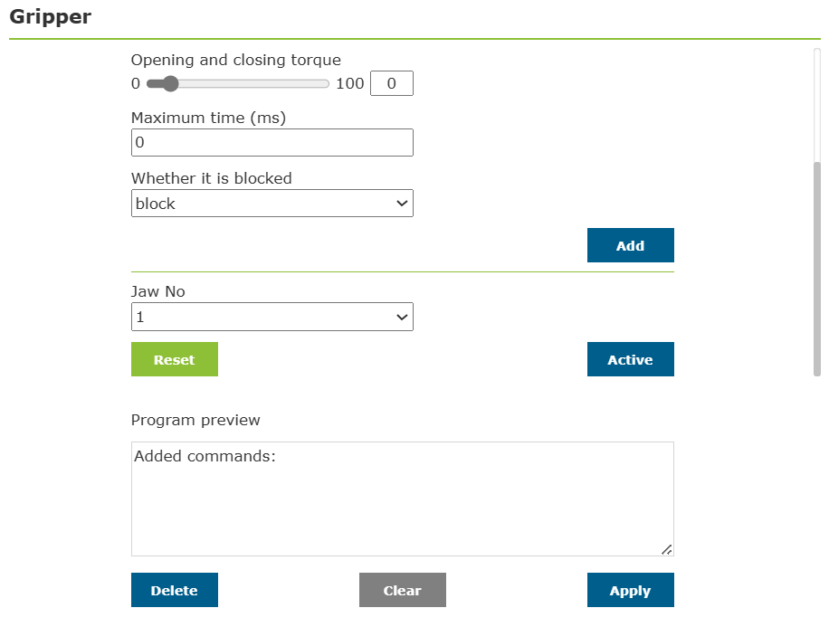

.. centered:: Figure 8.3-4 Add gripper motion command

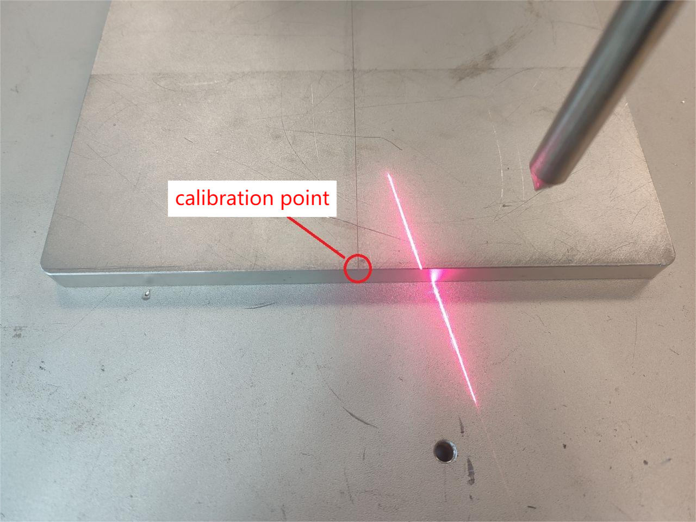

.. centered:: Figure 8.3-5 Example of gripper movement command

Multiple grippers
~~~~~~~~~~~~~~~~~~~~~~~

Refer to the Gripper step for activation and motion control.

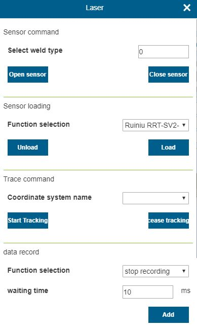

.. centered:: Figure 8.3-6 Configure Multiple Grippers

.. note:: As the end open function currently supports the gripper device address range of 1~8, the gripper device address should be adjusted through the gripper manufacturer's host computer before use.

Force sensors and grippers
~~~~~~~~~~~~~~~~~~~~~~~~~~~~~~~~~

Configure and enable the reference force sensor and gripper steps.

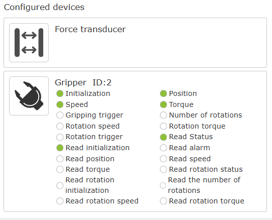

.. centered:: Figure 8.3-7 Configure force sensors and grippers

Spray gun peripheral configuration
-------------------------------------

Spray gun peripheral configuration steps
~~~~~~~~~~~~~~~~~~~~~~~~~~~~~~~~~~~~~~~~~~~

**Step1**: In the "Initial - Peripheral" menu bar, click "Spray" to enter the spray gun configuration interface.

User can quickly configure the DO required for spraying through the one-key configuration button of the spraying function (the default configuration DO10 is spraying start and stop, and DO11 is spraying cleaning gun). Users can also customize DO according to their own needs in the "IO Configuration" interface;

.. important:: 
	Before using the spraying function, it is necessary to establish the corresponding tool coordinate system first, and apply the established tool coordinate system during program teaching.

**Step2**: After the configuration is complete, click the four buttons "Start Spraying", "Stop Spraying", "Start Cleaning the Gun" and "Stop Cleaning the Gun" to debug the spray gun;

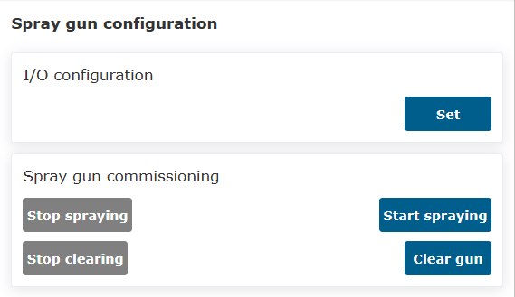

.. centered:: Figure 8.4-1 Gun Configuration

**Step3**: Select the "spray" command on the program teaching command interface. According to the specific program teaching requirements, add and apply four commands "start spraying", "stop spraying", "start cleaning the gun" and "stop cleaning the gun" in the corresponding places.

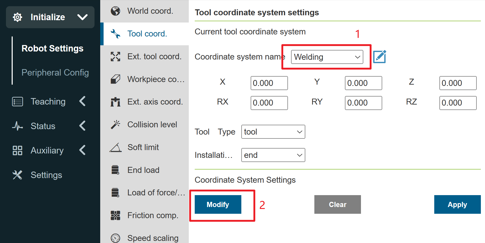

.. centered:: Figure 8.4-2 Spray Gun Command Editing

Spray program teaching
~~~~~~~~~~~~~~~~~~~~~~~~~

.. list-table:: 
   :widths: 15 40 100
   :header-rows: 1
   :align: center

   * - S/N
     - Instruction format
     - notes
   * - 1
     - Lin(template1,100,-1,0,0)
     - #Start spraying point
   * - 2
     - SprayStart()
     - #Start painting
   * - 3
     - Lin(template2,100,-1,0,0)
     - #Spray path
   * - 4
     - Lin(template3,100,-1,0,0)
     - #Stop spraying point
   * - 5
     - SprayStop()
     - #Stop spraying
   * - 6
     - Lin(template4,100,-1,0,0)
     - #Gun cleaning point
   * - 7
     - PowerCleanStart()
     - #Start to clean the gun
   * - 8
     - WaitTime(5000)
     - #Cleaning time ms
   * - 9
     - PowerCleanStop()
     - #Stop gun cleaning

Peripheral configuration of welding machine
---------------------------------------------

The welding efficiency and welding quality can be significantly improved when welding with the cooperative robot. FAIRINO cooperative robot can control welding through two methods: "Controller IO" or "Digital communication protocol":

**Controller IO**:The robot controls the welding current and welding voltage by setting the analog output (0-10V) of the control box, controls the welding arc starting, wire feeding and gas feeding through the digital output of the control box, and collects the signal inputs such as welding machine preparation and successful arc starting through the digital input of the control box.

**Digital communication protocol**:the robot communicates with PLC through UDP, and the PLC communicates with the welding machine through CANOpen bus or other protocols, so as to control the welding voltage and current, arc starting, wire feeding, gas feeding and other operations of the welding machine (see Annex 1 for the UDP communication protocol of the robot).

Welding control by cooperative robot mainly includes the following steps: ① welding gun installation and signal wiring;②parameter configuration of welding machine; ③Write welding control program.

Welding torch installation
~~~~~~~~~~~~~~~~~~~~~~~~~~~~~~~~~~

As shown in Figure 1, the welding torch is installed at the end of the robot through the adapter plate, and the welding torch cable needs to be fixed on the mechanical arm.

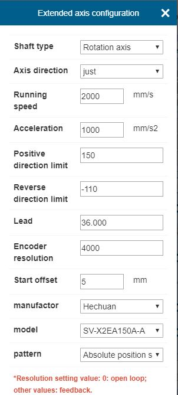

.. centered:: Figure 8.5-1 The welding gun is installed at the end of the robot

After the welding gun is fixed and installed, the tool coordinate system of the welding gun need to be calibrated by the six-point method and applied as the current tool coordinate system (Figure 2). The calibration accuracy of the tool coordinate system of the welding gun will affect the actual welding accuracy.

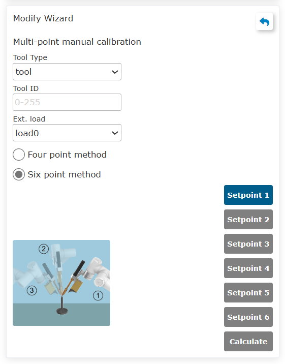

.. centered:: Figure 8.5-2 Calibration and application of robot tool coordinate system

Welding machine parameter configuration
~~~~~~~~~~~~~~~~~~~~~~~~~~~~~~~~~~~~~~~~~~~~~~~~~

The cooperative robot can control the welding process through "Controller IO" signal or "Digital communication protocol". There are two main differences between the two modes:

①When using "Controller IO", it is necessary to set the corresponding relationship between the actual control welding current(voltage) and the analog output value of the control box; 

②Communication parameters need to be configured when using Digital Communication Protocol.

"Controller IO" welding control configuration
+++++++++++++++++++++++++++++++++++++++++++++++++++++++++

In the "Initial - Peripheral" menu bar, click "Welder" to enter the welding machine configuration interface. As shown in figure below.

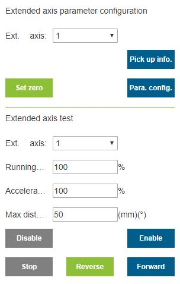

.. centered:: Figure 8.5-3 Open the welding machine configuration

As shown in Figure 4, select the control type as "Control I/O".

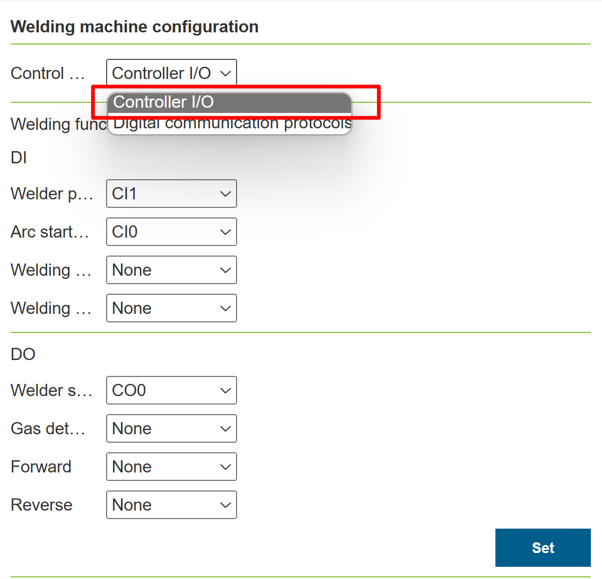

.. centered:: Figure 8.5-4 Selecting Control Type

Welding function I/O configuration
******************************************

As shown in Figure 5, select the welding machine status signal DI input port and the welding machine control signal DO output port, and click the "Set" button. The meanings of each signal are as follows:

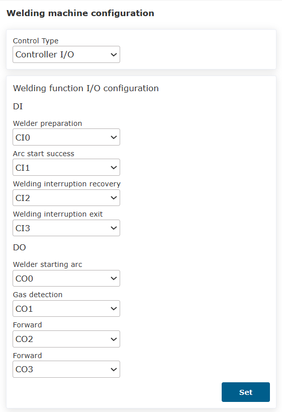

.. centered:: Figure 8.5-5 Setting welding machine signal port

**Welder preparation**:when the welding machine is ready for welding operation, the welding machine outputs the signal to the robot; 

When the welding machine is not ready for other reasons, the welding machine does not input the signal to the robot, and at this time, the upper right corner of the robot WebApp prompts "Welding machine is not ready" (Figure 6). If your welding machine does not have a ready signal, you can set this port to "None" (Figure 7).

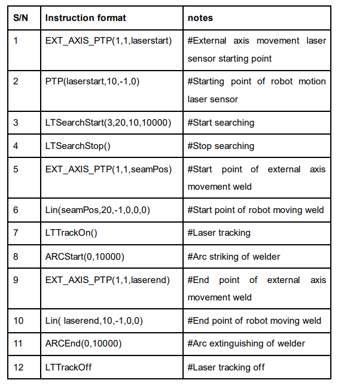

.. centered:: Figure 8.5-6 The welding machine is not ready to report an error

.. centered:: Figure 8.5-7 The welding machine preparation is set to "None"

**Arc start success**:the arc-starting of the welding machine has been successful. After the robot outputs the arc-starting signal to the welding machine, it waits for the arc-starting success signal from the welding machine to be fed back. If the robot fails to detect the arc-starting success signal within the set timeout, the robot reports an "Arc sticking timeout" error (Figure 8);

When using the robot welding function, welding can still be carried out if the arc starting success signal is not configured, but the robot will report the warning of "Arc successful DI not configured" (Figure 9); If your welding machine has a successful arc starting signal output, we suggest that you configure this signal for safer welding.

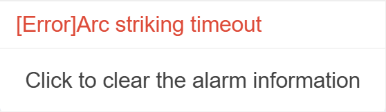

.. centered:: Figure 8.5-8 Error in Timeout of Arc Starting
   
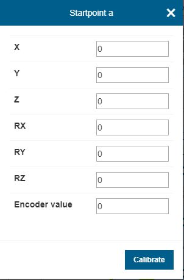

.. centered:: Figure 8.5-9 Successful arcing DI is not configured with warning

**Welding interruption recovery**:The welding interruption will be triggered when the arc is unexpectedly interrupted or the operator stops welding actively during the welding process of the robot. After the welding interruption, when the external input signal to the robot changes from invalid to effective, the robot will automatically resume welding from the original interrupted position.

**Welding Interruption Exit**:The welding interruption will be triggered when the arc is unexpectedly interrupted during the welding process of the robot or the operator suspends the welding actively. When the signal input from outside to the robot changes from invalid to effective after the welding interruption, the robot will stop the welding, and the welding cannot be resumed after the welding termination.

**Welding starting Arc**:the robot controls the DO output port of arc starting of welding machine. When the robot program executes the arc starting instruction, the DO output port corresponding to arc starting of welding machine is valid.

**Gas detection**:the robot controls the DO output port of the gas feeding of the welding machine. When the robot executes the welding gas feeding instruction, the DO output port corresponding to the gas feeding automatically outputs effectively.

**Forward wire feeding**: the robot controls the DO output port of the welding machine for forward wire feeding. When the robot executes the forward wire feeding instruction, the DO output port corresponding to the forward wire feeding is automatically output effectively.

**Reverse wire feeding**:the robot controls the DO output port of reverse wire feeding of the welding machine. When the robot executes the reverse wire feeding instruction, the corresponding DO output port automatically outputs effectively.

Configuration of welding process parameters
******************************************************

As shown in Figure 10, the column of "Welding process parameters" is found on the welding configuration page, and the cooperative robot provides 100 groups of welding process parameters from 0 to 99, in which process number 0 means that welding process curves are not used, and process numbers 1 to 99 use welding process curves.
   
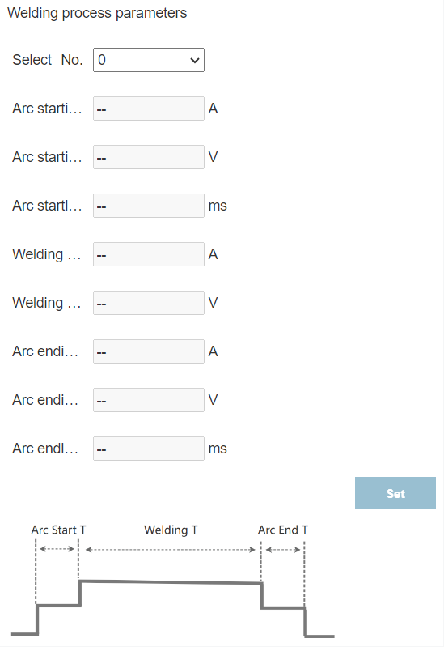

.. centered:: Figure 8.5-10 Configuration of welding process parameters 

When using the welding process curve, take welding process number 1 as an example, enter the parameters of "Arc starting current" to "Arc ending time" as shown in Figure 8, click the "Set" button, and the actual welding process represented by the process parameters is as follows:

①Set welding current 200A and voltage 23V;

②Arc starting and wait for arcing success;

③After successful arcing, the arc remains 500ms(arc starting time, the robot does not move);

④Set welding current 150A, welding voltage 21V, and then the robot starts to move and weld;

⑤After welding to the end point, set the welding current to 100A, welding voltage to 19V(arc ending current, arc ending voltage); 

⑥After the arc current and voltage are set, keep the arc burning for 500ms (the robot does not move), and finally extinguish the arc.

When the welding process curve is not used, that is, when the welding process parameter number is 0, as shown in Figure 11, the welding process is as follows: 

①Set the welding current and welding voltage;

②The robot controls the arc starting of the welding machine, and waits for the arc to succeed;

③ After the arc is successful, the robot begins to move and weld;

④The robot immediately extinguishes the arc after welding to the end point.
   
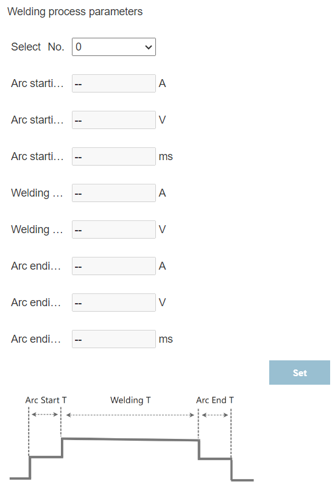

.. centered:: Figure 8.5-11 Do Not use welding process curve 

Set the relationship diagram between welding current and voltage and analog output
*********************************************************************************************************************

When the welding control type of the cooperative robot is set to Controller IO, the welding current and welding voltage are controlled by controlling the output of the analog output of the control box (the output voltage of the analog output of the control box ranges from 0 to 10V). In this case, the linear mapping between the output value of the analog output of the control box and the actual welding current and welding voltage needs to be configured.

As shown in Figure 12, find "Welding current voltage linear relationship with output analog" on the welding machine configuration page, where "A-V" indicates the correspondence between welding current and output analog voltage of control box, and "V-V" indicates the correspondence between welding voltage and output analog voltage of control box. 

Select "A-V", input welding current range 0-1000A, analog output voltage 0-10V, output AO as "Ctrl-AO0" (welding current control analog output port is AO0), click "Configure" button; Under this parameter, when the output analog voltage of the control box is 1.5V, the corresponding welding current is 150A.
   
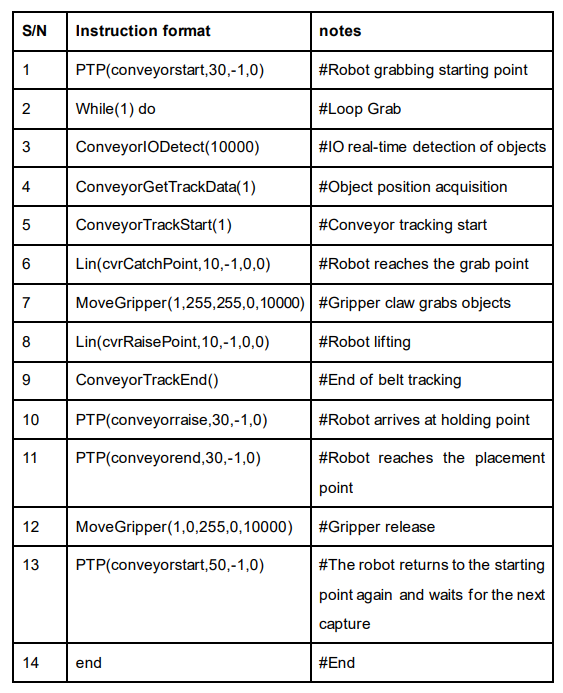

.. centered:: Figure 8.5-12 Welding current voltage linear relationship with output analog

As shown in Figure 13, click "V-V" to set the corresponding relationship between welding voltage and analog output voltage of the control box. The input welding voltage range is 0-60V, the output voltage value of analog is 0-10V, and the output AO is "Ctrl-AO1" (the output port of welding current control analog is AO0). Click "Configure" button. If the control box AO1 analog output 3.5V, the actual control welding voltage is 21V.
   
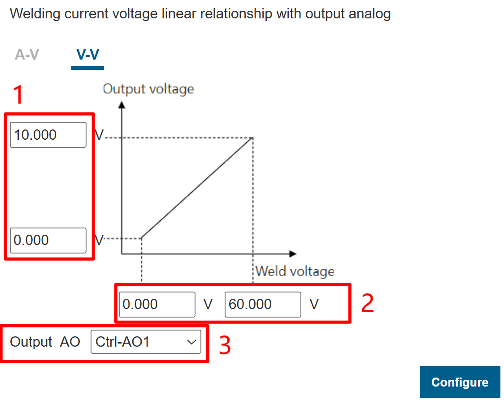

.. centered:: Figure 8.5-13 Welding voltage linear relationship with output analog

Welding machine commissioning
**************************************

As shown in Figure 14, find "Welding machine commissioning" in the configuration page of the welding machine, select process number 1, enter the timeout time as 1000ms, click "Gas on", the robot will control the welding machine to start conveying protective gas, click "Gas OFF" button, the robot will control the welding machine to stop conveying protective gas. Other buttons "Arc", "Forward", "Reverse" and other operation methods are the same, no more details.
   
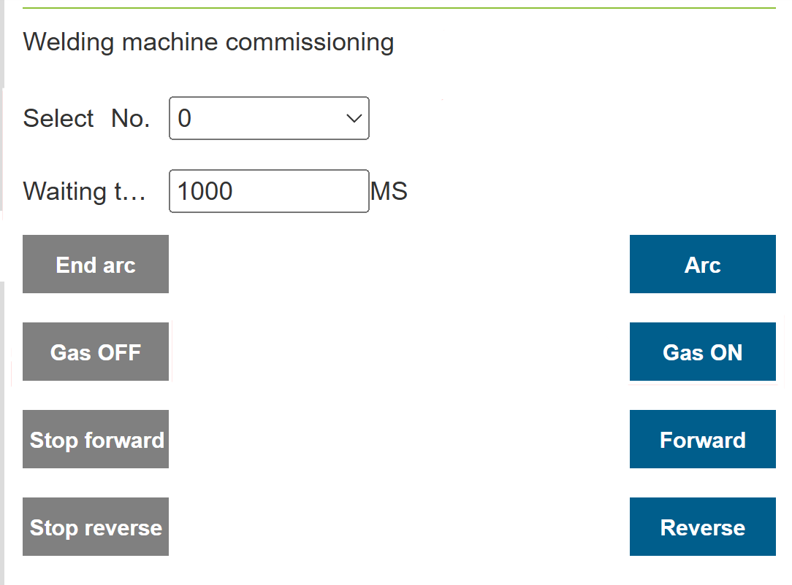

.. centered:: Figure 8.5-14 Welding machine commissioning

Digital Communication Protocol welding control configuration
+++++++++++++++++++++++++++++++++++++++++++++++++++++++++++++++++++++

Robot welding control through "Digital communication protocol", in essence, robot and PLC through UDP communication, the arc starting, wire feeding, gas feeding, current, voltage and other control data is transmitted to the PLC through UDP communication, and then the PLC side further through CANOpen bus (or other ways) to control the welding machine. At the same time, the PLC end collects the actual welding current and voltage, and feedbacks the arc success signal to the robot. (See Attachment 1 for the robot UDP communication protocol).

In the "Initial - Peripheral" menu bar, click "Welder" to enter the welding machine configuration interface. As shown in figure below.
   

.. centered:: Figure 8.5-15 Open welding config

As shown in Figure 16, the control type is selected as "Digital communication protocol". Since the robot communicates with PLC through UDP, UDP communication parameters need to be configured. The meanings of each parameter are as follows:

**IP address**:IP address of PLC for UDP communication;

**Port number**:PLC UDP communication port number;

**Communication cycle**:the cycle of UDP communication between the robot and the PLC, the default is 2ms;

**Packet loss detection cycle and Packet loss times**:When the number of lost packets in the packet loss detection period exceeds the specified value, the robot reports an error message indicating UDP Packet loss Exception and automatically cuts off the communication.

**Communication interruption confirmation time**:the robot does not receive a complete PLC feedback packet within this period of time, which will report "UDP communication interruption" error alarm, and cut off UDP communication.

**Automatic reconnection after communication interruption**:whether the robot automatically reconnects after detecting UDP communication interruption;

**Reconnection period and Num of reconnections**:After automatic reconnection of UDP communication interruption is enabled and UDP communication interruption is detected, the robot reconnects at the set period. When the reconnection times reach the maximum set value and the connection is not successful, the robot reports an error alarm of "UDP communication interruption" and disconnects the UDP communication at the same time.

After configuring the above parameters, click the "Configure" and "Load" buttons successively.
   
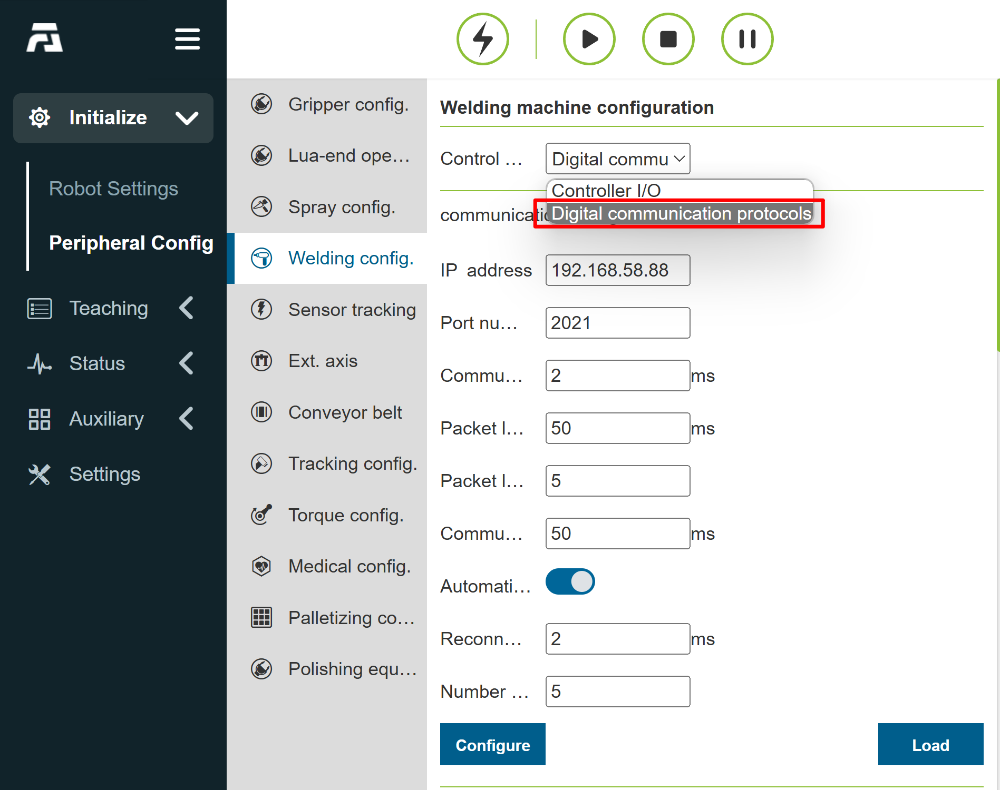

.. centered:: Figure 8.5-16 Select Digital communication protocol

Welding function I/O configuration
*********************************************

As shown in Figure 17, select the welding machine status signal DI input port and the welding machine control signal DO output port, and click the "Set" button. The meanings of each signal are as follows:
   
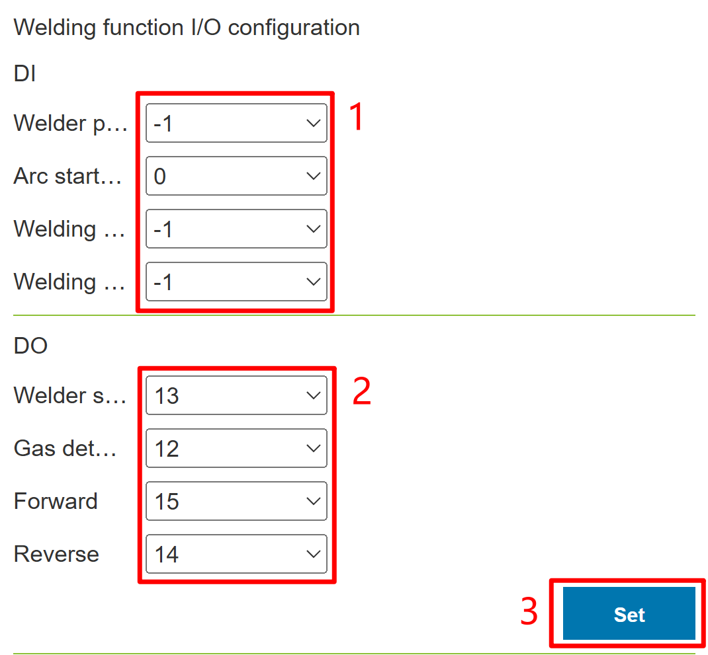

.. centered:: Figure 8.5-17 Welding function I/O configuration

**Welder preparation**:when the welding machine is ready for welding operation, the welding machine outputs the signal to the robot; When the welding machine is not ready for other reasons, the welding machine does not input the signal to the robot, and at this time, the upper right corner of the robot WebApp prompts "Welding machine is not ready" (Figure 6). If your welding machine does not have a ready signal, you can set this port to "None" (Figure 7).
   

.. centered:: Figure 8.5-18 The welding machine is not ready to report an error
   

.. centered:: Figure 8.5-19 The welding machine preparation is set to "None"

**Arc start success**:the arc-starting of the welding machine has been successful. After the robot outputs the arc-starting signal to the welding machine, it waits for the arc-starting success signal from the welding machine to be fed back. If the robot fails to detect the arc-starting success signal within the set timeout, the robot reports an "Arc sticking timeout" error (Figure 20);

When using the robot welding function, welding can still be carried out if the arc starting success signal is not configured, but the robot will report the warning of "Arc successful DI not configured" (Figure 9); If your welding machine has a successful arc starting signal output, we suggest that you configure this signal for safer welding.
   

.. centered:: Figure 8.5-20 Error in Timeout of Arc Starting	
      

.. centered:: Figure 8.5-21 Successful arcing DI is not configured with warning

**Welding interruption recovery**:The welding interruption will be triggered when the arc is unexpectedly interrupted or the operator stops welding actively during the welding process of the robot. After the welding interruption, when the external input signal to the robot changes from invalid to effective, the robot will automatically resume welding from the original interrupted position.

**Welding Interruption Exit**:The welding interruption will be triggered when the arc is unexpectedly interrupted during the welding process of the robot or the operator suspends the welding actively. When the signal input from outside to the robot changes from invalid to effective after the welding interruption, the robot will stop the welding, and the welding cannot be resumed after the welding termination.

**Welding starting Arc**:the robot controls the DO output port of arc starting of welding machine. When the robot program executes the arc starting instruction, the DO output port corresponding to arc starting of welding machine is valid.

**Gas detection**: the robot controls the DO output port of the gas feeding of the welding machine. When the robot executes the welding gas feeding instruction, the DO output port corresponding to the gas feeding automatically outputs effectively.

**Forward wire feeding**: the robot controls the DO output port of the welding machine for forward wire feeding. When the robot executes the forward wire feeding instruction, the DO output port corresponding to the forward wire feeding is automatically output effectively.

**Reverse wire feeding**:the robot controls the DO output port of reverse wire feeding of the welding machine. When the robot executes the reverse wire feeding instruction, the corresponding DO output port automatically outputs effectively.

Configuration of welding process parameters
**************************************************

As shown in Figure 10, the column of "Welding process parameters" is found on the welding configuration page, and the cooperative robot provides 100 groups of welding process parameters from 0 to 99, in which process number 0 means that welding process curves are not used, and process numbers 1 to 99 use welding process curves.
      
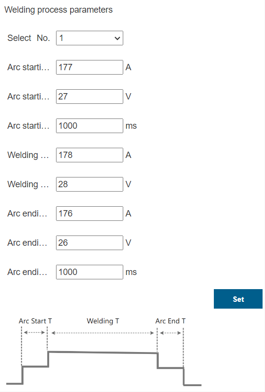

.. centered:: Figure 8.5-22 Configuration of welding process parameters

When using the welding process curve, take welding process number 1 as an example, enter the parameters of "Arc starting current" to "Arc ending time" as shown in Figure 8, click the "Set" button, and the actual welding process represented by the process parameters is as follows:

①Set welding current 200A and voltage 23V;

②Arc starting and wait for arcing success; 

③After successful arcing, the arc remains 500ms(arc starting time, the robot does not move);

④Set welding current 150A, welding voltage 21V, and then the robot starts to move and weld;

⑤After welding to the end point, set the welding current to 100A, welding voltage to 19V(arc ending current, arc ending voltage); 

⑥After the arc current and voltage are set, keep the arc burning for 500ms (the robot does not move), and finally extinguish the arc.

When the welding process curve is not used, that is, when the welding process parameter number is 0, as shown in Figure 11, the welding process is as follows:

①Set the welding current and welding voltage;

②The robot controls the arc starting of the welding machine, and waits for the arc to succeed;

③After the arc is successful, the robot begins to move and weld;

④The robot immediately extinguishes the arc after welding to the end point.
      

.. centered:: Figure 8.5-23 Do Not use welding process curve

Welding machine commissioning
******************************************

As shown in Figure 14, find "Welding machine commissioning" in the configuration page of the welding machine, select process number 1, enter the timeout time as 1000ms, click "Gas on", the robot will control the welding machine to start conveying protective gas, click "Gas OFF" button, the robot will control the welding machine to stop conveying protective gas. Other buttons "Arc", "Forward", "Reverse" and other operation methods are the same.

.. centered:: Figure 8.5-24 Welding machine commissioning

Welding programming
~~~~~~~~~~~~~~~~~~~~~~~~~~~

Programmed using welding process curves
+++++++++++++++++++++++++++++++++++++++++++++++

When selecting the welding process curve (selecting the welding process parameter number 1-99), the voltage and current control during the welding process follows the curve parameter set by a certain process parameter number, and there is no need to add commands to set the welding voltage and current. As shown in Figure 25, click "Teaching" and "Program teaching" to create a new user program "testWeld.lua".

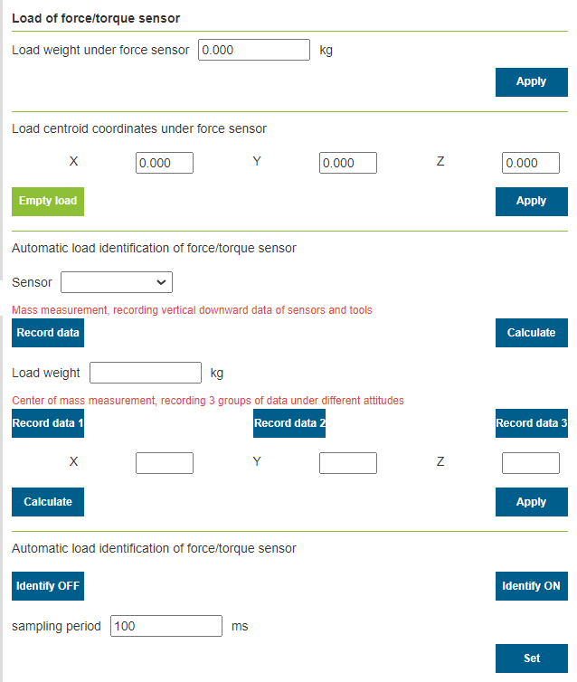

.. centered:: Figure 8.5-25 Create"testWeld.lua"program

As shown in Figure 26, select "Welding command".

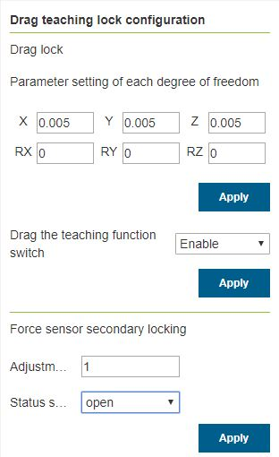

.. centered:: Figure 8.5-26 Select"Welding command"

As shown in Figure 27, click "Welding" to open the page for adding welding command.

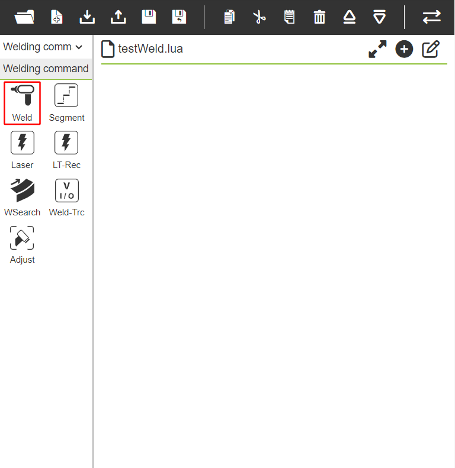

.. centered:: Figure 8.5-27 Click“Weld”

As shown in Figure 28, select the control type as "Controller I/O" (according to the actual configuration of the welding control mode) in the open welding instruction add page, select the welding process number as 1(process number 0 does not use the welding process curve, process number 1-99 uses the welding process curve), and the maximum waiting time is 10000ms. Click the "arc" button and the "arc" button in turn, and finally click "Apply".

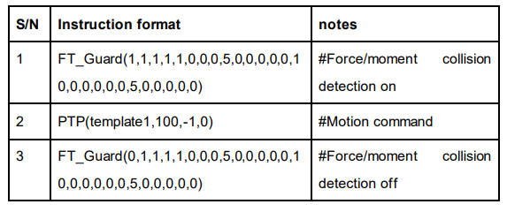

.. centered:: Figure 8.5-28 Add welding commands

As shown in Figure 29, at this time, arc starting and arc ending command for welding have been added in the "testWeld.lua" program. Since welding process curve number 1 is selected for arc starting and arc closing, the voltage and current control in the welding process follows the curve parameters set in process number 1, and there is no need to add commands for setting welding voltage and current.

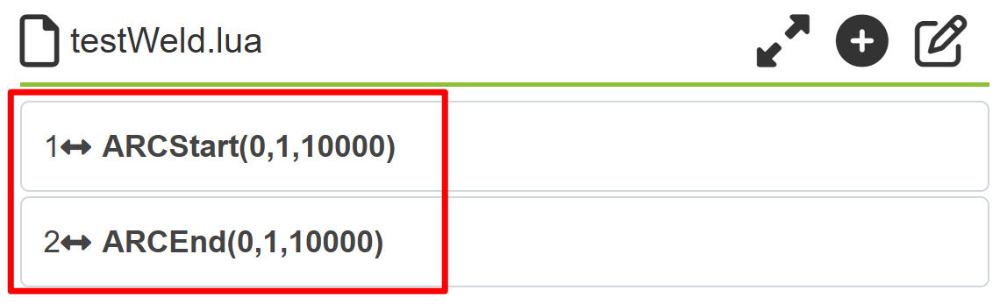

.. centered:: Figure 8.5-29 Arc start end program

As shown in Figure 30, two linear motion command are added, and the order of command is adjusted, so that the robot first moves to the "P1" point, performs arcing, and then moves to the "P2" point, performs arcing, and realizes the robot welding from the "P1" point to the "P2" point.

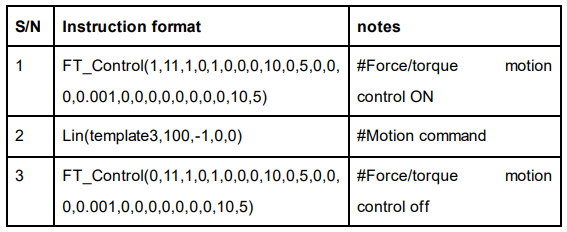

.. centered:: Figure 8.5-30 Robot welding from “P1” to “P2”

Welding program without the use of welding process curves
++++++++++++++++++++++++++++++++++++++++++++++++++++++++++++++++

If you choose not to use the welding process curve (that is, select the welding process parameter number 0), the welding program needs to add command to set welding voltage and current to control the actual welding parameters. As shown in Figure 31, click "Teaching" and "Program teaching" to create a new user program "testWeld.lua".

.. centered:: Figure 8.5-31 Create“testWeld.lua”program

As shown in Figure 32, select "Welding command".

.. centered:: Figure 8.5-32 Select“Welding command”

As shown in Figure 33, click "Welding" to open the page for adding welding command.

.. centered:: Figure 8.5-33 Click“Weld”

As shown in Figure 34, in the open welding instruction add page, select the control type as "Controller I/O" (according to the actual configuration of the welding control mode), select the welding process number as 0(process number 0 does not use the welding process curve, process number 1-99 uses the welding process curve), and set the welding current control AO to "Ctrl-AO0". The welding current is 150A, click "Add" button; Set welding voltage control AO to "Ctrl-AO1", welding voltage to 21V, click "Add" button; Set the maximum waiting time to 10000ms, click the "arc" button and "arc" button in turn, and finally click "Apply".

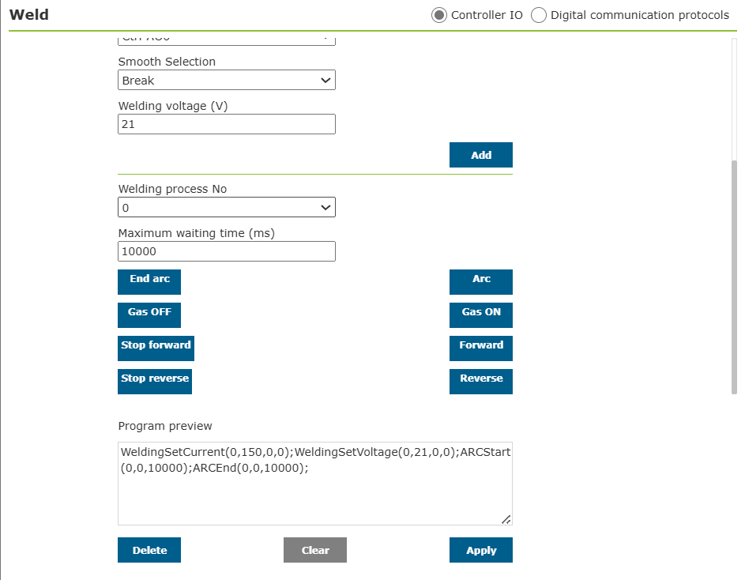

.. centered:: Figure 8.5-34 Add welding commands

As shown in Figure 35, at this time, welding arc starting and welding arc closing command have been added in the "testWeld.lua" program. Since welding process number 0 is selected for welding arc starting and closing command, when the program is executed to set welding voltage and current command, The robot will automatically output the corresponding analog quantity of the control box according to the set welding voltage and current values and the "corresponding relationship between welding voltage, current and output analog quantity" set in the welder configuration page.

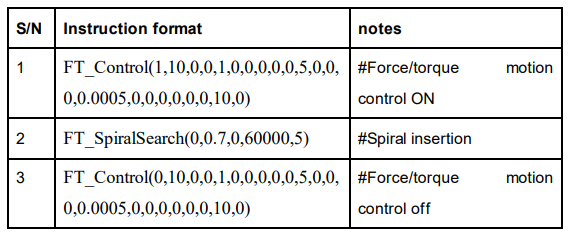

.. centered:: Figure 8.5-35 robot welding program set current and voltage

As shown in Figure 36, add two linear motion command, and adjust the order of command, so that the robot first moves to the "P1" point and arc starting, and then moves to the "P2" point and arc ending, so that the robot can weld from the "P1" point to the "P2" point.

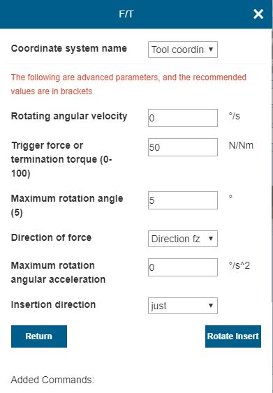

.. centered:: Figure 8.5-36 robot weld from the "P1" point to the "P2" point

Before running the program, please check:

① whether the welding gun has been correctly installed, whether the welding gun tool coordinate system has been calibrated, and applied to the current tool coordinate system; 

② Whether the welding power supply, gas and wire work normally; 

③ Whether the signal lines between the robot and the welding machine are connected.

Welding interruption and recovery
~~~~~~~~~~~~~~~~~~~~~~~~~~~~~~~~~~~~~~~~~

Interruptions may occur during robot welding under the following conditions:

①The operator actively suspends the welding to observe the actual welding situation or clean the nozzle and other operations;

②Accidental interruption of welding arc;

③The collision of the robot leads to the suspension of welding;

When an interruption occurs during the robot welding process, the operator can switch the robot to manual mode, drag the robot to a safe position, and deal with the cause of the interruption. 

After the problem is solved, the cobot can automatically move from the current position to the position where the welding interruption occurs to restart the arc and resume the welding. The specific operation process is as follows: 

①Configuration of welding interruption recovery parameters;

②Perform the welding procedure and suspend the welding during the welding process to interrupt the welding;

③Switch the robot to manual mode, and deal with related problems, and then switch the robot to automatic mode after the processing is completed;

④Click the "Resume welding" button, and the robot will automatically resume welding.

Welding interrupt and resume parameter configuration
+++++++++++++++++++++++++++++++++++++++++++++++++++++++++++

As shown in Figure 37, in the "Initial - Peripheral" menu bar, click "Welder" to enter the welding machine configuration interface, find the "Detection arc interruption parameter configuration" column, open "Enable", enter "Confirmation time" as 20ms, and click "Configuration" button, that is, when the invalid signal of arc starting success exceeds 20ms during the welding process, the robot will report "welding arc interruption" error; Find the "Welding interrupt and Resume parameter configuration" column, open "Enable", enter "Overlap distance" as 5mm, "Speed" as 10%, "Motion mode" as "PTP", and click "Configure" button. The above three parameters are explained as follows:

**Overlap distance**:In order to ensure the continuity of the weld after recovery and the weld before interruption, the arc point of the recovery welding needs to have a certain overlap distance with the original weld.

**Speed**:After welding interruption, it is often necessary to move the robot to a safe position and process the weld. When welding recovery is performed after processing is completed, the robot will move from the current position to the welding rearc point. The "speed" means the speed at which the robot moves to the rearc point.

**Motion mode**:After welding interruption, it is often necessary to move the robot to a safe position and process the weld. When welding recovery is performed after processing is completed, the robot will move from the current position to the welding rearc point. The "motion mode" means the movement mode of the robot to the rearc point, and there are two options: "LIN" and "PTP".

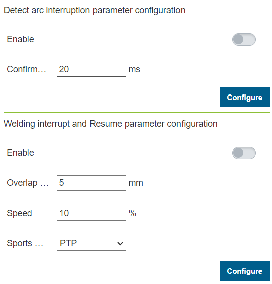

.. centered:: Figure 8.5-37 Welding interrupt and Resume parameter configuration

Usage of welding interrupt and resume parameter configuration
+++++++++++++++++++++++++++++++++++++++++++++++++++++++++++++++++++++++++

Take the program in Figure 38 as an example, switch the robot to the automatic mode, click the start button, and the robot will start welding. During the welding process, click the pause button, and the welding will be interrupted. A prompt box for resuming welding interruption will pop up in the upper right corner of the WebApp (Figure 39), and click the "Resume Welding" button, and the robot will automatically move to the arc restart point and perform the subsequent welding operation.

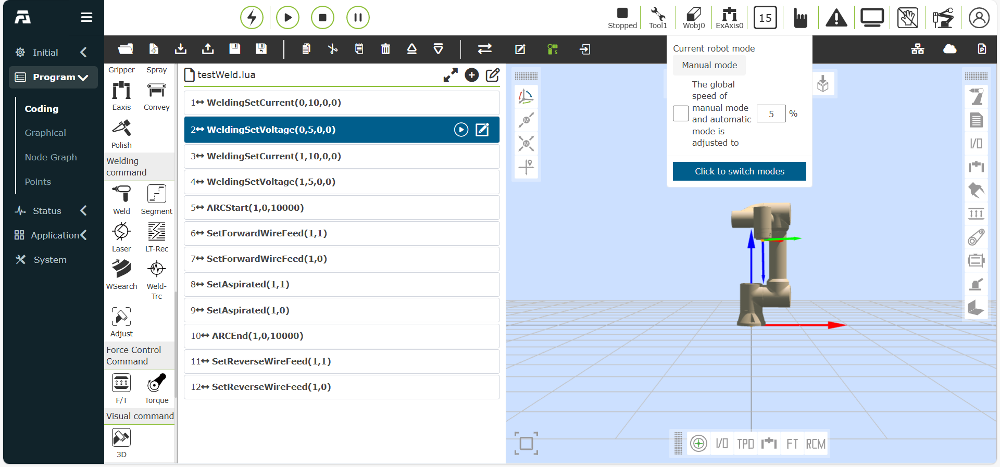

.. centered:: Figure 8.5-38 Performing the welding procedure

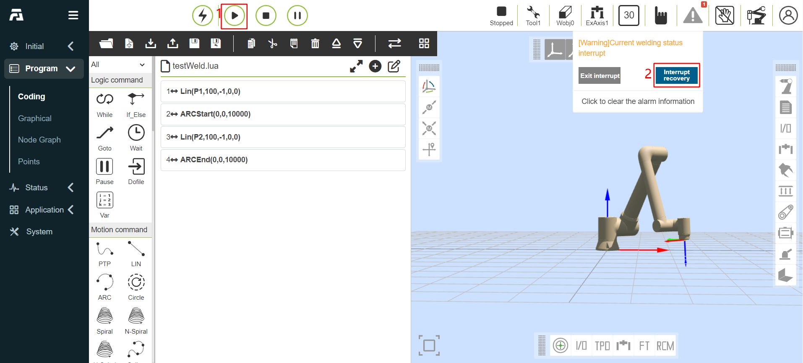

.. centered:: Figure 8.5-39 Welding recovery

The welding interruption recovery function of cooperative robot can only be used for line weld or arc weld, and there can be no logical programs such as "if" and "while" in lua program, otherwise welding cannot be resumed.

Appendix 1: UDP communication protocol for robots
~~~~~~~~~~~~~~~~~~~~~~~~~~~~~~~~~~~~~~~~~~~~~~~~~~~~~~~~~~~~

.. warning::
  1）CRC check method: Modbus 16 check is used, but only the lower 8 bits are taken for check. Check data area D100-D176,D200-D273.

  2）Arc tracking: The actual current feedback is to convert the actual current of the welding machine obtained by the PLC into an analog quantity of 0-4095 and transmit it to the analog quantity channel 0 of the UDP data protocol, namely D168.

  3）Speed ​​conversion logic: The robot sends the speed (unit mm/s) V÷lead×60=V';

  PLC converts the robot's speed to V'×encoder resolution÷60=V" unit (pulse/s).

Robot controller -> PLC
+++++++++++++++++++++++++++

.. list-table:: 
   :widths: 10 10 10 10 20
   :header-rows: 1
   :align: center

   * - Serial number
     - Register address
     - Data type
     - Data value
     - Variable name

   * - 1
     - D199
     - INT
     - 0x5A5A
     - Frame header

   * - 2
     - D200
     - INT
     - 
     - 1#Motor control word

   * - 3
     - D201
     - DINT
     - 
     - 1#Target position input

   * - 4
     - D202
     - DINT
     - 
     - 1#Target position input

   * - 5
     - D203
     - INT
     - 
     - 1#Return to Zero Control Word

   * - 6
     - D204
     - DINT
     - 
     - 1#Return to Zero High Speed Input

   * - 7
     - D205
     - DINT
     - 
     - 1#Return to Zero High Speed Input

   * - 8
     - D206
     - DINT
     - 
     - 1#Return to Zero Low Speed Input

   * - 9
     - D207
     - DINT
     - 
     - 1#Return to Zero Low Speed Input

   * - 10
     - D208
     - DINT
     - 
     - 1#Position offset (reserved)

   * - 11
     - D209
     - DINT
     - 
     - 1#Position offset (reserved)

   * - 12
     - D210
     - DINT
     - 
     - 1#Speed Offset (Reserved)

   * - 13
     - D211
     - DINT
     - 
     - 1#Speed Offset (Reserved)

   * - 14
     - D212
     - DINT
     - 
     - 1#Torque Offset (Reserved)

   * - 15
     - D213
     - DINT
     - 
     - 1#Torque Offset (Reserved)

   * - 16
     - D214
     - INT
     - 
     - 2#Motor control word

   * - 17
     - D215
     - DINT
     - 
     - 2#Target position input

   * - 18
     - D216
     - DINT
     - 
     - 2#Target position input

   * - 19
     - D217
     - INT
     - 
     - 2#Return to Zero Control Word

   * - 20
     - D218
     - DINT
     - 
     - 2#Return to Zero High Speed Input

   * - 21
     - D219
     - DINT
     - 
     - 2#Return to Zero High Speed Input

   * - 22
     - D220
     - DINT
     - 
     - 2#Return to Zero Low Speed Input

   * - 23
     - D221
     - DINT
     - 
     - 2#Return to Zero Low Speed Input

   * - 24
     - D222
     - DINT
     - 
     - 2#Position offset (reserved)

   * - 25
     - D223
     - DINT
     - 
     - 2#Position offset (reserved)

   * - 26
     - D224
     - DINT
     - 
     - 2#Speed Offset (Reserved)

   * - 27
     - D225
     - DINT
     - 
     - 2#Speed Offset (Reserved)

   * - 28
     - D226
     - DINT
     - 
     - 2#Torque Offset (Reserved)

   * - 29
     - D227
     - DINT
     - 
     - 2#Torque Offset (Reserved)

   * - 30
     - D228
     - INT
     - 
     - 3#Motor control word
  
   * - 31
     - D229
     - DINT
     - 
     - 3#Target position input

   * - 32
     - D230
     - DINT
     - 
     - 3#Target position input

   * - 33
     - D231
     - INT
     - 
     - 3#Return to Zero Control Word

   * - 34
     - D232
     - DINT
     - 
     - 3#Return to Zero High Speed Input

   * - 35
     - D233
     - DINT
     - 
     - 3#Return to Zero High Speed Input

   * - 36
     - D234
     - DINT
     - 
     - 3#Return to Zero Low Speed Input

   * - 37
     - D235
     - DINT
     - 
     - 3#Return to Zero Low Speed Input

   * - 38
     - D236
     - DINT
     - 
     - 3#Position offset (reserved)

   * - 39
     - D237
     - DINT
     - 
     - 3#Position offset (reserved)

   * - 40
     - D238
     - DINT
     - 
     - 3#Speed Offset (Reserved)

   * - 41
     - D239
     - DINT
     - 
     - 3#Speed Offset (Reserved)

   * - 42
     - D240
     - DINT
     - 
     - 3#Torque Offset (Reserved)

   * - 43
     - D241
     - DINT
     - 
     - 3#Torque Offset (Reserved)

   * - 44
     - D242
     - INT
     - 
     - 4#Motor control word
  
   * - 45
     - D243
     - DINT
     - 
     - 4#Target position input

   * - 46
     - D244
     - DINT
     - 
     - 4#Target position input

   * - 47
     - D245
     - INT
     - 
     - 4#Return to Zero Control Word

   * - 48
     - D246
     - DINT
     - 
     - 4#Return to Zero High Speed Input

   * - 49
     - D247
     - DINT
     - 
     - 4#Return to Zero High Speed Input

   * - 50
     - D248
     - DINT
     - 
     - 4#Return to Zero Low Speed Input

   * - 51
     - D249
     - DINT
     - 
     - 4#Return to Zero Low Speed Input

   * - 52
     - D250
     - DINT
     - 
     - 4#Position offset (reserved)

   * - 53
     - D251
     - DINT
     - 
     - 4#Position offset (reserved)

   * - 54
     - D252
     - DINT
     - 
     - 4#Speed Offset (Reserved)

   * - 55
     - D253
     - DINT
     - 
     - 4#Speed Offset (Reserved)

   * - 56
     - D254
     - DINT
     - 
     - 4#Torque Offset (Reserved)

   * - 57
     - D255
     - DINT
     - 
     - 4#Torque Offset (Reserved)

   * - 58
     - D256
     - INT
     - 
     - General output DO(0-15)

   * - 59
     - D257
     - INT
     - 
     - General output DO(16-31)

   * - 60
     - D258
     - INT
     - 
     - General output DO(32-47)

   * - 61
     - D259
     - INT
     - 
     - General output DO(48-63)

   * - 62
     - D260
     - INT
     - 
     - General output DO(64-79)

   * - 63
     - D261
     - INT
     - 
     - General output DO(80-95)

   * - 64
     - D262
     - INT
     - 
     - High speed output DO(96-111)

   * - 65
     - D263
     - INT
     - 
     - High speed output DO(112-127)

   * - 66
     - D264
     - INT
     - 
     - Analog output AO0

   * - 67
     - D265
     - INT
     - 
     - Analog output AO1

   * - 68
     - D266
     - INT
     - 
     - Analog output AO2

   * - 69
     - D267
     - INT
     - 
     - Analog output AO3

   * - 70
     - D268
     - REAL
     - 
     - Welding voltage

   * - 71
     - D269
     - REAL
     - 
     - Welding voltage

   * - 72
     - D270
     - REAL
     - 
     - Welding current

   * - 73
     - D271
     - REAL
     - 
     - Welding current

   * - 74
     - D272
     - REAL
     - 
     - Packet loss detection period

   * - 75
     - D273
     - INT
     - 
     - Number of packet loss

   * - 76
     - D274
     - INT
     - 
     - Frame Count (0-255)

   * - 77
     - D275
     - INT
     - 
     - CRC check code

PLC -> robot controller
++++++++++++++++++++++++++++++++++++++

.. list-table:: 
   :widths: 10 10 10 10 20
   :header-rows: 1
   :align: center

   * - Serial number
     - Register address
     - Data type
     - Data value
     - Variable name

   * - 1
     - D99
     - INT
     - 0x5A5A
     - Frame header

   * - 2
     - D100
     - INT
     - 
     - 1#Motor status word

   * - 3
     - D101
     - DINT
     - 
     - 1#Current position

   * - 4
     - D102
     - DINT
     - 
     - 1#Current position

   * - 5
     - D103
     - INT
     - 
     - 1#Return to zero status word

   * - 6
     - D104
     - DINT
     - 
     - 1#Return to Zero High Speed Feedback

   * - 7
     - D105
     - DINT
     - 
     - 1#Return to Zero High Speed Feedback

   * - 8
     - D106
     - DINT
     - 
     - 1#Return to Zero Low Speed Feedback

   * - 9
     - D107
     - DINT
     - 
     - 1#Return to Zero Low Speed Feedback

   * - 10
     - D108
     - INT
     - 
     - 1#Fault code

   * - 11
     - D109
     - DINT
     - 
     - 1#Servo deviation (reserved)

   * - 12
     - D110
     - DINT
     - 
     - 1#Servo deviation (reserved)

   * - 13
     - D111
     - DINT
     - 
     - 1#Speed feedback (reserved)

   * - 14
     - D112
     - DINT
     - 
     - 1#Speed feedback (reserved)

   * - 15
     - D113
     - DINT
     - 
     - 1#Real-time Torque (Reserved)

   * - 16
     - D114
     - DINT
     - 
     - 1#Real-time Torque (Reserved)

   * - 17
     - D115
     - INT
     - 
     - 2#Motor status word

   * - 18
     - D116
     - DINT
     - 
     - 2#Current position

   * - 19
     - D117
     - DINT
     - 
     - 2#Current position

   * - 20
     - D118
     - INT
     - 
     - 2#Return to zero status word

   * - 21
     - D119
     - DINT
     - 
     - 2#Return to Zero High Speed Feedback

   * - 22
     - D120
     - DINT
     - 
     - 2#Return to Zero High Speed Feedback

   * - 23
     - D121
     - DINT
     - 
     - 2#Return to Zero Low Speed Feedback

   * - 24
     - D122
     - DINT
     - 
     - 2#Return to Zero Low Speed Feedback

   * - 25
     - D123
     - INT
     - 
     - 2#Fault code

   * - 26
     - D124
     - DINT
     - 
     - 2#Servo deviation (reserved)

   * - 27
     - D125
     - DINT
     - 
     - 2#Servo deviation (reserved)

   * - 28
     - D126
     - DINT
     - 
     - 2#Speed feedback (reserved)

   * - 29
     - D127
     - DINT
     - 
     - 2#Speed feedback (reserved)

   * - 30
     - D128
     - DINT
     - 
     - 2#Real-time Torque (Reserved)
  
   * - 31
     - D129
     - DINT
     - 
     - 2#Real-time Torque (Reserved)

   * - 32
     - D130
     - INT
     - 
     - 3#Motor status word

   * - 33
     - D131
     - DINT
     - 
     - 3#Current position

   * - 34
     - D132
     - DINT
     - 
     - 3#Current position

   * - 35
     - D133
     - INT
     - 
     - 3#Return to zero status word

   * - 36
     - D134
     - DINT
     - 
     - 3#Return to Zero High Speed Feedback

   * - 37
     - D135
     - DINT
     - 
     - 3#Return to Zero High Speed Feedback

   * - 38
     - D136
     - DINT
     - 
     - 3#Return to Zero Low Speed Feedback

   * - 39
     - D137
     - DINT
     - 
     - 3#Return to Zero Low Speed Feedback

   * - 40
     - D138
     - DINT
     - 
     - 3#Fault code

   * - 41
     - D139
     - DINT
     - 
     - 3#Servo deviation (reserved)

   * - 42
     - D140
     - DINT
     - 
     - 3#Servo deviation (reserved)

   * - 43
     - D141
     - DINT
     - 
     - 3#Speed feedback (reserved)

   * - 44
     - D142
     - DINT
     - 
     - 3#Speed feedback (reserved)
  
   * - 45
     - D143
     - DINT
     - 
     - 3#Real-time Torque (Reserved)

   * - 46
     - D144
     - DINT
     - 
     - 3#Real-time Torque (Reserved)

   * - 47
     - D145
     - INT
     - 
     - 4#Motor status word

   * - 48
     - D146
     - DINT
     - 
     - 4#Current position

   * - 49
     - D147
     - DINT
     - 
     - 4#Current position

   * - 50
     - D148
     - INT
     - 
     - 4#Return to zero status word

   * - 51
     - D149
     - DINT
     - 
     - 4#Return to Zero High Speed Feedback

   * - 52
     - D150
     - DINT
     - 
     - 4#Return to Zero High Speed Feedback

   * - 53
     - D151
     - DINT
     - 
     - 4#Return to Zero Low Speed Feedback

   * - 54
     - D152
     - DINT
     - 
     - 4#Return to Zero Low Speed Feedback

   * - 55
     - D153
     - DINT
     - 
     - 4#Fault code

   * - 56
     - D154
     - DINT
     - 
     - 4#Servo deviation (reserved)

   * - 57
     - D155
     - DINT
     - 
     - 4#Servo deviation (reserved)

   * - 58
     - D156
     - DINT
     - 
     - 4#Speed feedback (reserved)

   * - 59
     - D157
     - DINT
     - 
     - 4#Speed feedback (reserved)

   * - 60
     - D158
     - DINT
     - 
     - Real-time Torque (Reserved)

   * - 61
     - D159
     - DINT
     - 
     - Real-time Torque (Reserved)

   * - 62
     - D160
     - INT
     - 
     - General input DI(0-15)

   * - 63
     - D161
     - INT
     - 
     - General input DI(16-31)

   * - 64
     - D162
     - INT
     - 
     - General input DI(32-47)

   * - 65
     - D163
     - INT
     - 
     - General input DI(48-63)

   * - 66
     - D164
     - INT
     - 
     - General input DI(64-79)

   * - 67
     - D165
     - INT
     - 
     - General input DI(80-95)

   * - 68
     - D166
     - INT
     - 
     - General input DI(96-111)

   * - 69
     - D167
     - INT
     - 
     - General input DI(112-127)

   * - 70
     - D168
     - INT
     - 
     - Analog AI0

   * - 71
     - D169
     - INT
     - 
     - Analog AI1

   * - 72
     - D170
     - INT
     - 
     - Analog AI2

   * - 73
     - D171
     - INT
     - 
     - Analog AI3

   * - 74
     - D172
     - REAL
     - 
     - Actual weld current feedback

   * - 75
     - D173
     - REAL
     - 
     - Actual weld current feedback

   * - 76
     - D174
     - REAL
     - 
     - Actual weld voltage feedback

   * - 77
     - D175
     - REAL
     - 
     - Actual weld voltage feedback

   * - 78
     - D176
     - INT
     - 
     - Fault code 0- no fault, 1- data packet loss

   * - 79
     - D177
     - INT
     - 
     - Frame count

   * - 80
     - D178
     - INT
     - 
     - CRC check code

Sensor Peripheral Configuration
---------------------------------

The FR cooperative robot is used in cooperation with the laser sensor, and the sensor can identify the characteristic positions such as welding seam to simplify programming and improve production efficiency. The cooperative robot can adapt to the laser sensors of Ruiniu, Chuangxiang and Quanshi, and only need to load the corresponding communication protocol when using different sensors.

Hardware wiring
~~~~~~~~~~~~~~~~~~~~~~~~~~~~~~~~~~~~~~~~~

Before using the laser sensor, it is necessary to install the laser sensor in a suitable position, and connect the network cable of the laser sensor directly or through a switch to any RJ45 interface of the robot control box.

Sensor configuration
~~~~~~~~~~~~~~~~~~~~~~~~~~~~~~~

Please make sure that your laser sensor and welding torch have been fixedly installed at the end of the robot, the laser sensor has been connected with the robot control box through a network cable, and the IP address of the laser sensor and the robot control box is in the same network segment. Turn on the power supply of the robot and the sensor. The figure below shows the installation of Ruiniu laser sensor.

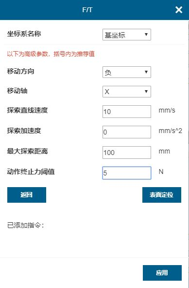

.. centered:: Figure 8.6-1 Installation of laser sensor

As shown in the figure, in "Initial - Peripheral - Tracking", click "Sensor", enter the IP address and port number of the sensor in the communication configuration column, click the Configure button, the default sampling period is 25, and the coordinate system is "LXLYLZ". Select the corresponding communication protocol according to your sensor model, and click the Load button.

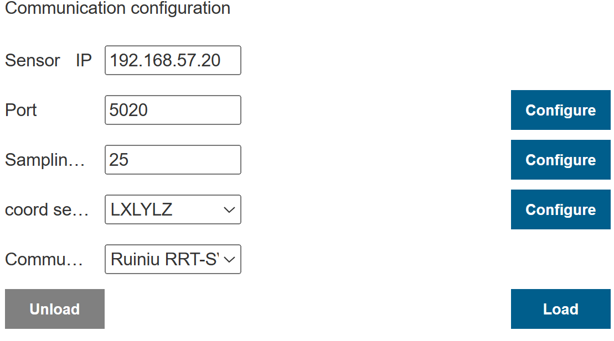

.. centered:: Figure 8.6-2 Laser sensor configuration

As shown in the figure, find the "Tracking Sensor Test" column in the "Sensor Tracking" page, and click "Open sensor" and "Close sensor" in turn to observe whether the laser of the sensor is turned on or off. If the laser is turned on or off normally, it means that the communication between the robot and the sensor has been established normally. Otherwise, please check whether the parameters such as IP address and port number are correct, and whether the sensor is connected to the robot network correctly.

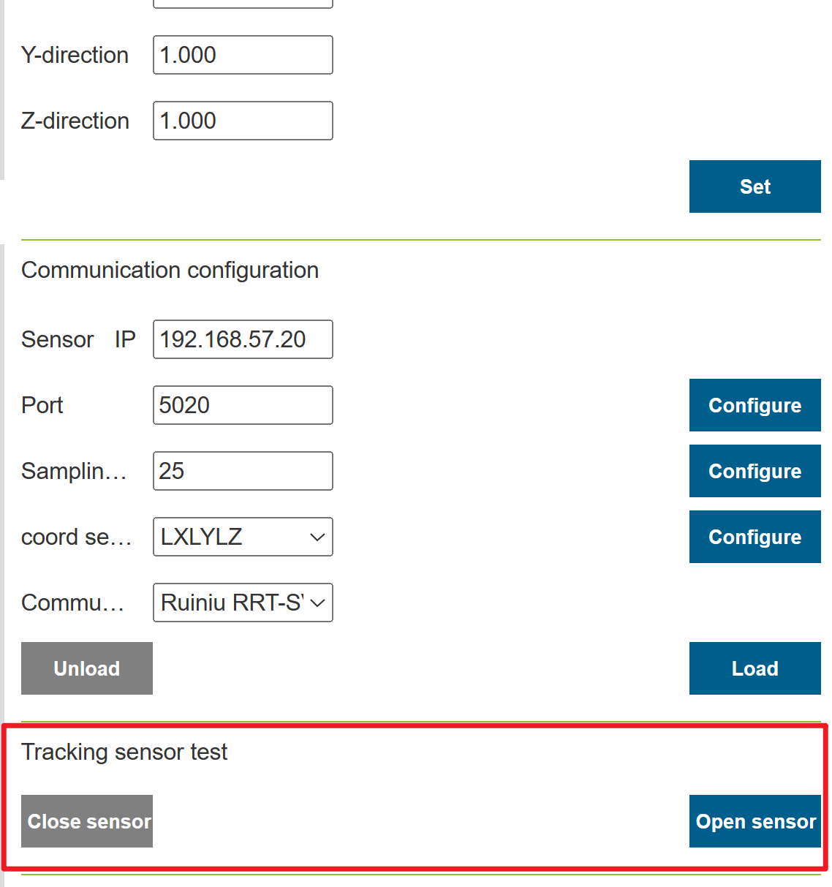

.. centered:: Figure 8.6-3 Communication test of laser sensor

Sensor calibration
~~~~~~~~~~~~~~~~~~~~~~~~~~~~~~~

It is necessary to calibrate the laser sensor before using it, and the calibration accuracy directly affects the tracking accuracy of the laser sensor. There are five-point method, six-point method and eight-point method for laser sensor calibration. Take the most commonly used five-point method in welding application scene as an example. Its calibration principle is to point to a fixed calibration point through a tool (welding torch), and then illuminate and identify the point from four different postures through the laser sensor.

.. note:: 
  Please note: the calibration point must be accurately identified by the laser sensor, otherwise it cannot be accurately calibrated.

And then calculate the coordinate posture of the sensor, as follows.

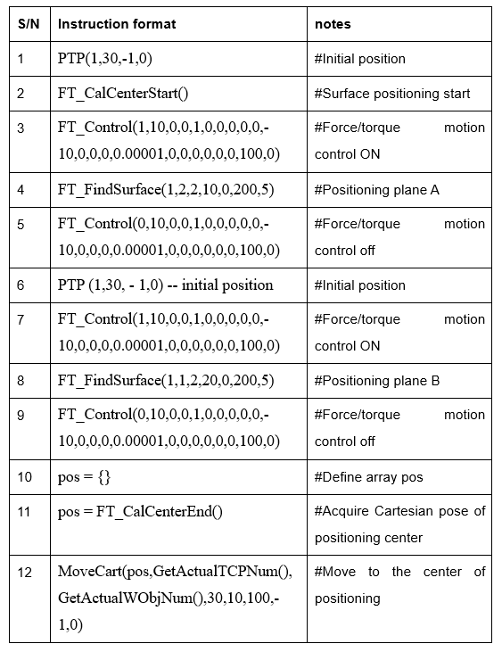

.. centered:: Figure 8.6-4 Calibration point of laser sensor

**Step1**: Open the robot WebApp, Click "Initial - Base - Coordinates" in sequence, and click "TCP" to enter the tool coordinate system interface, select an unused tool coordinate system, and clickto change its name to "Welding ", tool type to "tool" and installation location to "end", as shown in the figures.

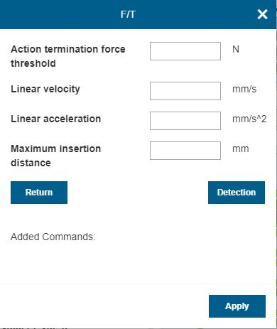

.. centered:: Figure 8.6-5 Setting "Welding Coordinate System"

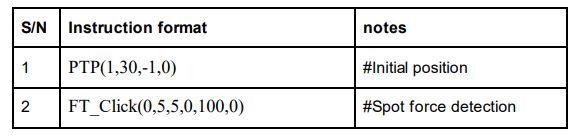

.. centered:: Figure 8.6-6 Setting the coordinate system of "Welding"

As shown in the figure, select an unused coordinate system again, change its name to "LaserSensor", select the tool type as "sensor" and the installation location as "end".

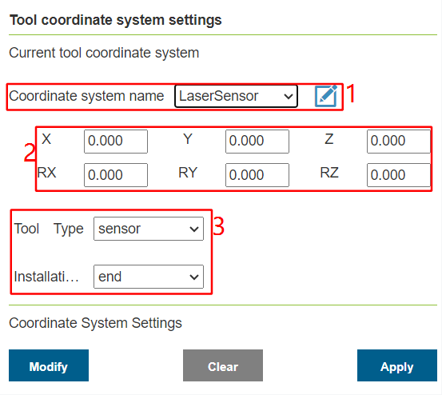

.. centered:: Figure 8.6-7 Setting the coordinate system of "laser sensor"

**Step2**: Calibrate the tool coordinate system of the welding torch by six-point method: select the "Welding" coordinate system, click the modify button, and calibrate the tool coordinate system of the welding torch by six-point method (refer to the FR document for the specific calibration method, which will not be repeated here).

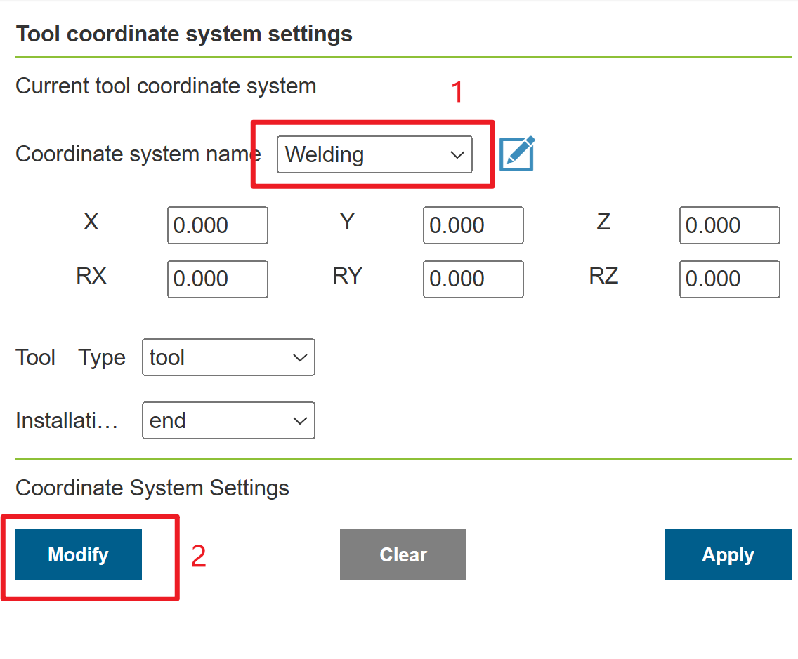

.. centered:: Figure 8.6-8 "Welding" coordinate system calibration 1

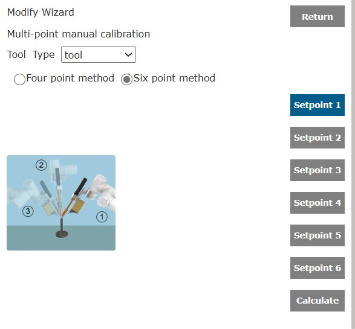

.. centered:: Figure 8.6-9 "Welding" coordinate system calibration 2

**Step3**: As shown in the figure, in Tool Coordinate System Settings, select No.0 coordinate system (base coordinate system), and the default name is "toolcoord0", and click "Apply" to switch the current coordinate system to the base coordinate system.

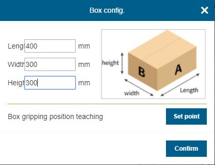

.. centered:: Figure 8.6-10  Sensor calibration step 1

**Step4**: As shown in the figure, select the previously set coordinate system of "LaserSensor" again (don't click "Apply"), click the "Modify" button, select the tool type as "Sensor", fix the sensor at the robot end, and select "Five Points Method" in the modification wizard.

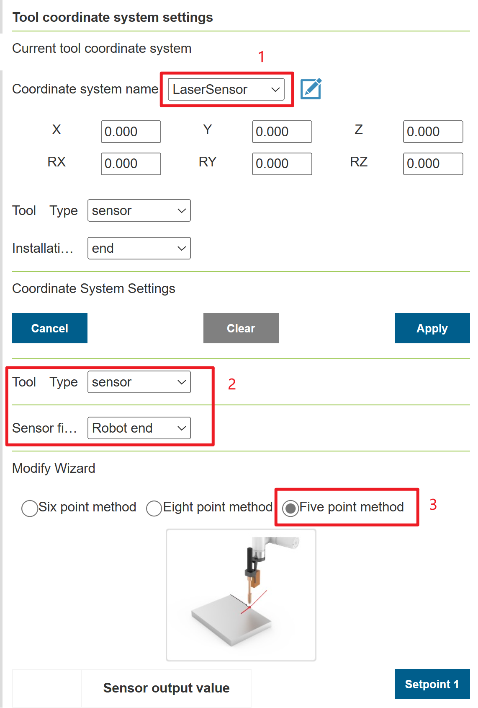

.. centered:: Figure 8.6-11 Sensor Calibration Step 2

**Step5**: Drag the robot to aim the tip of the welding torch at the calibration point, select the coordinate system of "Welding", click "Apply" and click "Set point 1", as shown in the figure.

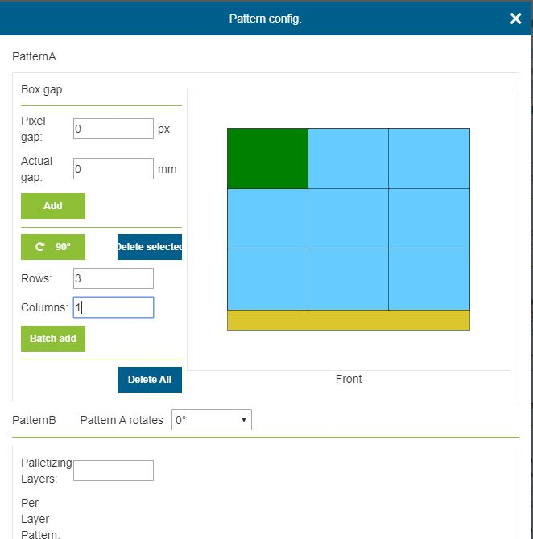

.. centered:: Figure 8.6-12 Sensor Calibration Step 3

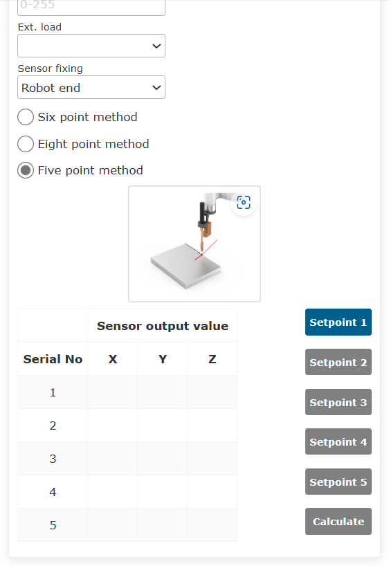

.. centered:: Figure 8.6-13 Sensor Calibration Step 4

**Step6**: Select coordinate system No.0 again ("toolcoord0") and click Apply; Then select the "Sensor" coordinate system (don't click "Apply") and click "Modify" to continue the calibration.

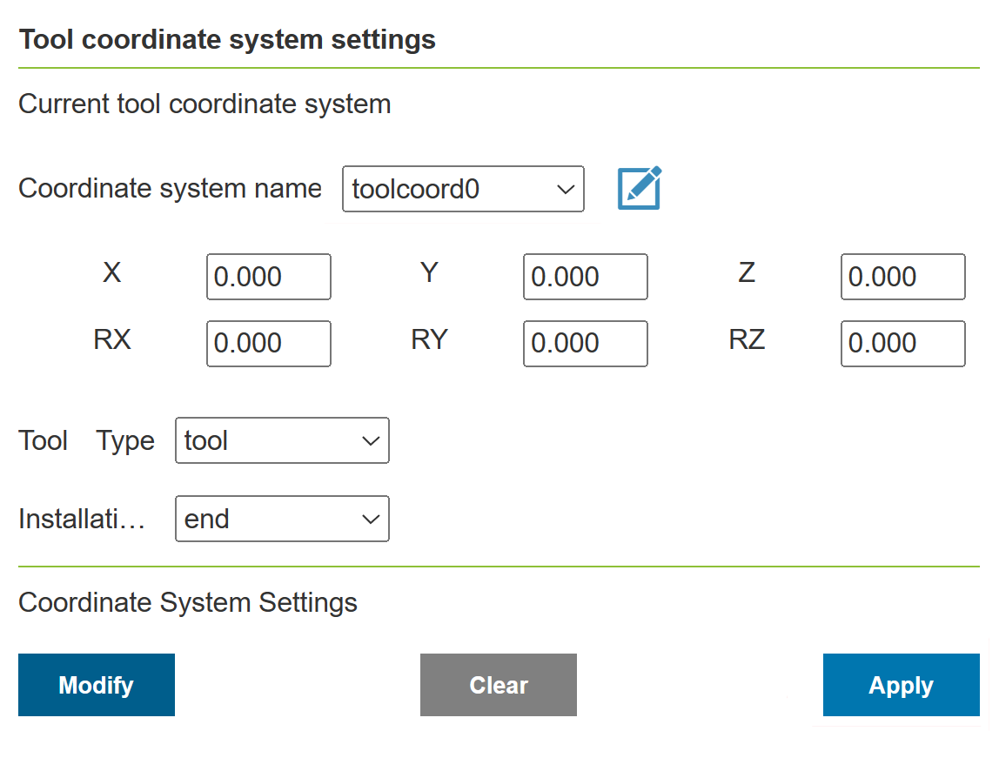

.. centered:: Figure 8.6-14 Sensor Calibration 5

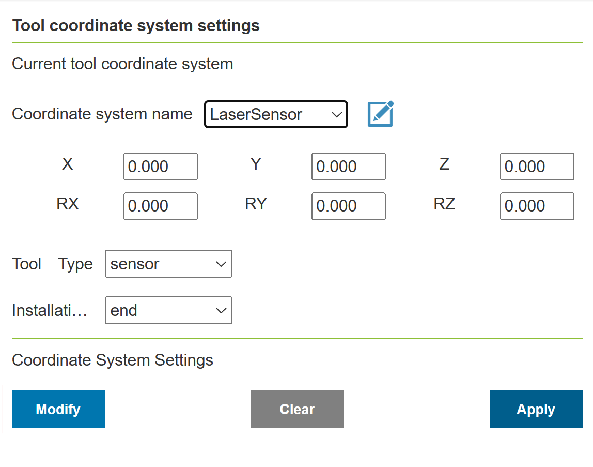

.. centered:: Figure 8.6-15 Sensor Calibration 6

**Step7**: Move the position of the laser sensor so that the laser just scans to the calibration point, and click "Set Point 2"; At this time, the current sensor data will be displayed at the position corresponding to the serial number of the sensor output value on the left. If the data is normal, it means that the current calibration point is successful, otherwise it needs to be calibrated again.

.. figure:: robot_peripherals/063.png
   :align: center
   :width: 4in

.. centered:: Figure 8.6-16 Sensor Calibration 7

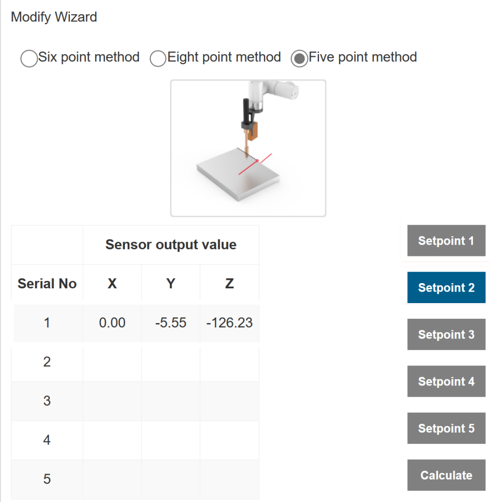

.. centered:: Figure 8.6-17 Sensor Calibration 8

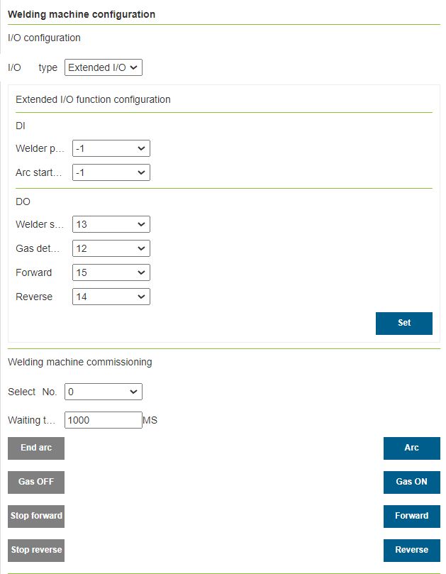

.. centered:: Figure 8.6-18 Sensor Calibration 9

**Step8**: Make the laser irradiate the calibration points from three different postures in turn, and click "Setpoint 3", "Setpoint 4" and "Setpoint 5" respectively, and finally click the "Calculate" button under the condition that the data of each point is normal.

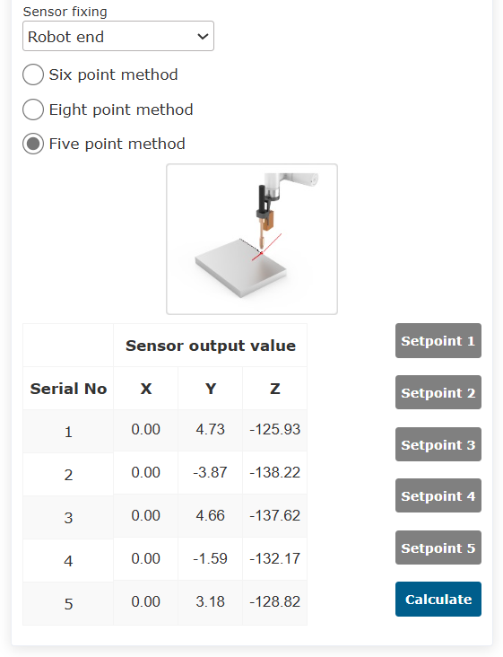

.. centered:: Figure 8.6-19 Sensor Calibration 10

**Step9**: At this time, the calibration result and precision of the sensor are displayed on the WebApp, and click the "Apply" button to complete the calibration of the laser sensor. If the calibration accuracy is too poor, you can choose to click the "Cancel" button and calibrate again.

.. figure:: robot_peripherals/067.png
   :align: center
   :width: 4in

.. centered:: Figure 8.6-20 sensor calibration accuracy

laser sensor application
~~~~~~~~~~~~~~~~~~~~~~~~~~~~~~~

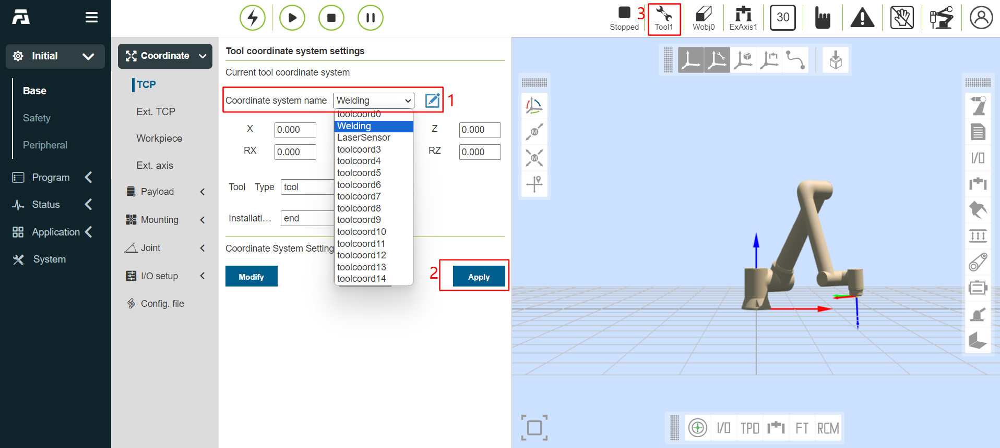

.. centered:: Figure 8.6-21 Application of welding coordinate system

Before using the laser sensor, apply the "Welding" tool coordinate system to the current tool coordinate system.

Laser sensor teaching point
+++++++++++++++++++++++++++++++

As shown in the figure, drag the robot to make the laser sensor light point to the weld point to be taught. As shown in the figure, select the sensor as "Laser Sensor" in the WebApp, enter the sensor name as "laserPt", and click the "Add" button. Create a new user program "testLaser.lua", create a motion command LIN, select "laserPt" as the target point, and execute the command in one step. At this time, the welding torch will move to the pointing point of the previous laser sensor.

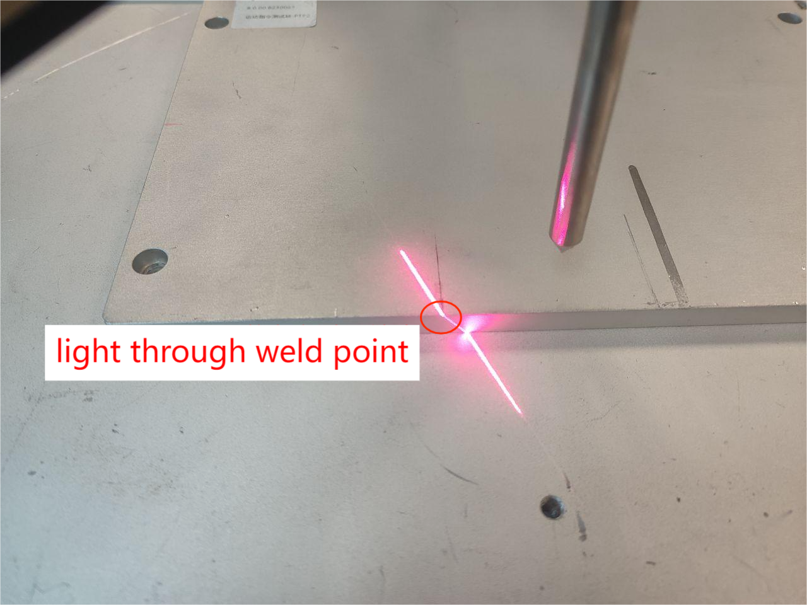

.. centered:: Figure 8.6-22  Laser Sensing Weld Point

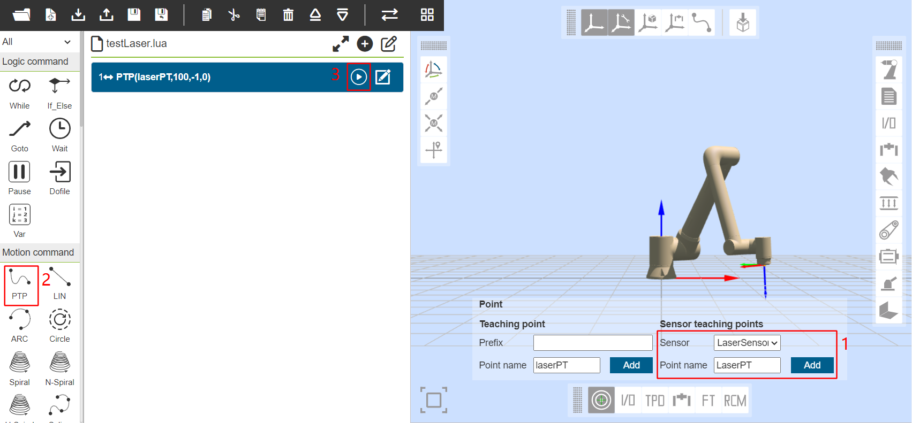

.. centered:: Figure 8.6-23 Teaching sensor points

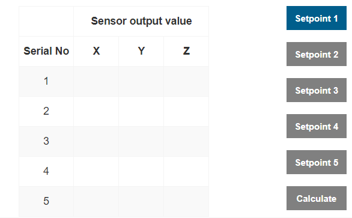

.. centered:: Figure 8.6-24 The welding points to the weld point

Laser Positioning+Tracking
+++++++++++++++++++++++++++++++

It takes several steps for the cooperative robot to cooperate with the laser sensor to complete the laser positioning+laser tracking function:

(1) The robot moves to a certain point outside the weld;
(2) Laser positioning is started, and the robot carries the laser sensor to move to the weld position;
(3) The laser sensor recognizes the weld, and the robot drives the welding torch to move to the weld recognition point;
(4) Laser tracking starts, and at the same time, the robot moves to the end of the weld, and the laser sensor records the position in real time during the movement;
(5) The welding torch moves along the position recorded by the laser sensor to realize the tracking effect.

Before positioning, tracking and debugging, please ensure that the sensor has been installed correctly, the coordinate system of the "welding" tool has been calibrated correctly, and the laser sensor has been calibrated correctly. As shown in the figure, assuming that the green straight line in the figure is the weld to be welded, the robot can automatically find the welding starting point A and weld to the point B, and the following commands need to be written:

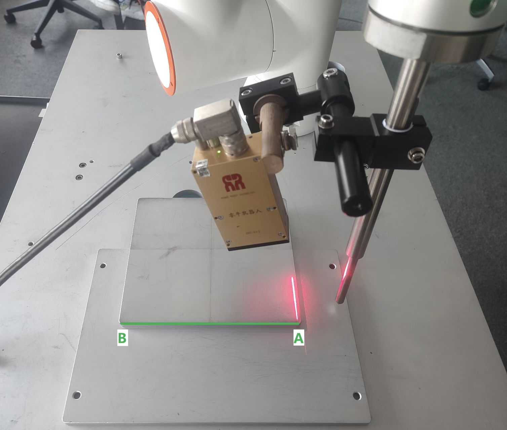

.. centered:: Figure 8.6-25 Sensor Installation

Write the positioning command
**********************************************

As shown in the figure, create a new user program "laserTrack.lua" and select "welding command".

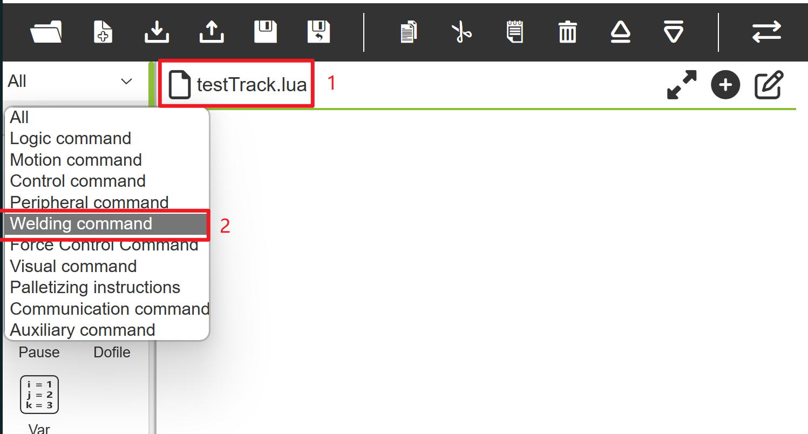

.. centered:: Figure 8.6-26 Add location command

As shown in the figure, click "Laser" to pop up the laser tracking command adding page.

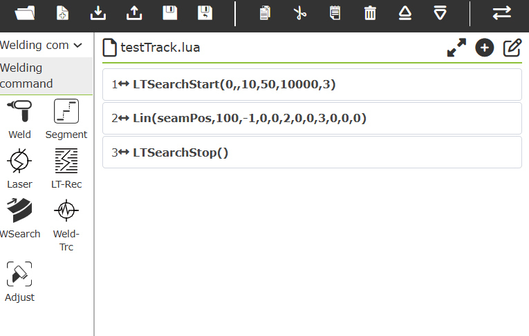

.. centered:: Figure 8.6-27 Laser tracking command

As shown in Figure  28, find the "Location command", select the coordinate system as "LaserSensor", and select "+x" as the direction to indicate that the robot is searching for the weld while moving with the laser sensor along the "+x" direction of the coordinate system of "Welding" from the current position, and "speed" is the moving speed of laser sensor seeking, and the length is the maximum seeking length of laser sensor, and the robot will report when the robot fails to find the weld when the seeking distance exceeds this length. Please enter the above parameters correctly according to the actual scene. Click the "Start locating" and "End locating" commands in turn, and click the "Apply" button.

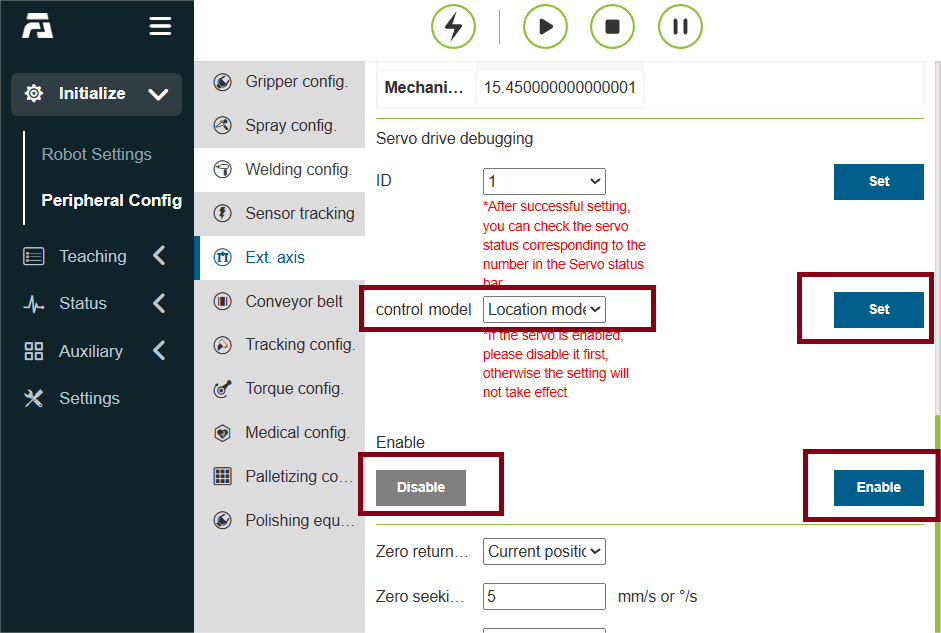

.. centered:: Figure 8.6-28 Add loaction command

At this time, the corresponding commands for the start and end of laser positioning will be added in "laserTrack.lua".

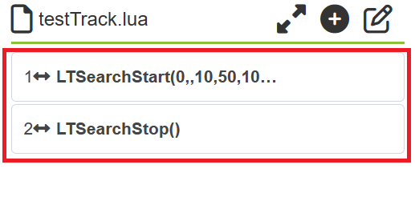

.. centered:: Figure 8.6-29 Locating procedure

Write the command of moving to seek position
**********************************************

Add LIN command of point-to-point motion, as shown in the figure, the target point is seamPos, that is, the laser sensor seeking point.

.. note:: 
  Please note: seamPos point is the name of the point in the robot system dedicated to laser sensor seeking, so it is not necessary to teach this point, and the laser sensor will automatically store the seeking point information in seamPos point after seeking.

And the seeking point can be set with offset, and the offset type can be selected from "Base coordinate offset" and "tool coordinate offset".

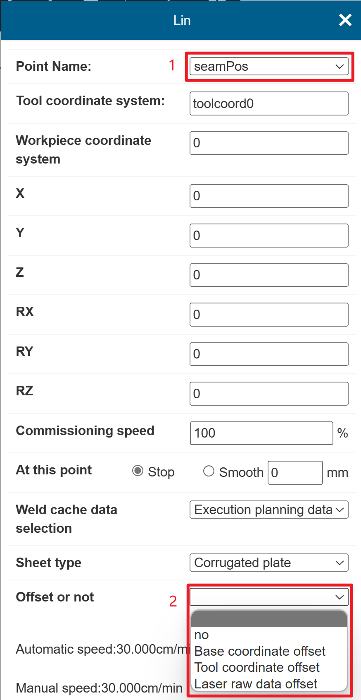

.. centered:: Figure 8.6-30 Locating Offset Option

As shown in the figure, when the seek offset function is enabled, the offset parameters can be set, where "dx" represents the offset distance along the X direction of the selected coordinate system and "drx" represents the rotation angle along the X axis of the selected coordinate system. Click the "Add" button and click the "Apply" button.

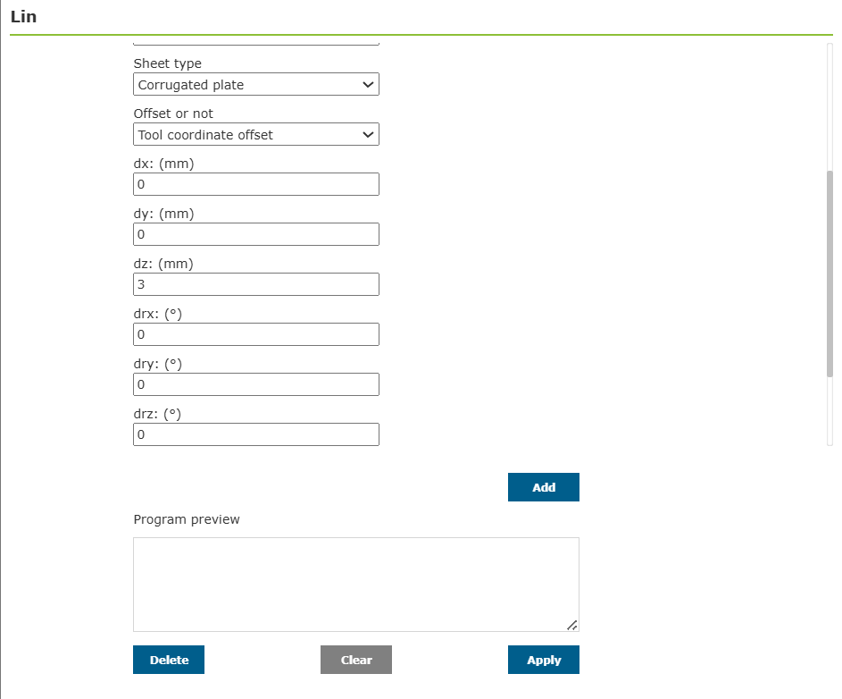

.. centered:: Figure 8.6-31 Setting of locating offset parameters

At this time, the command to move to the seeking point will be added in "testTrack.lua", as shown in the figure.

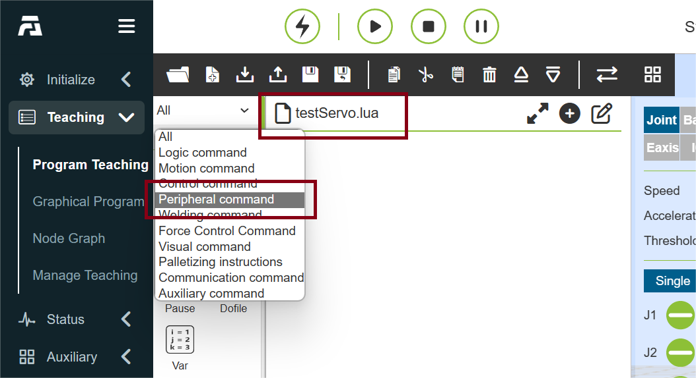

.. centered:: Figure 8.6-32 Locating offset procedure

Writing laser tracking commands
**********************************************

Open the "Laser" command adding page again, as shown in the figure.

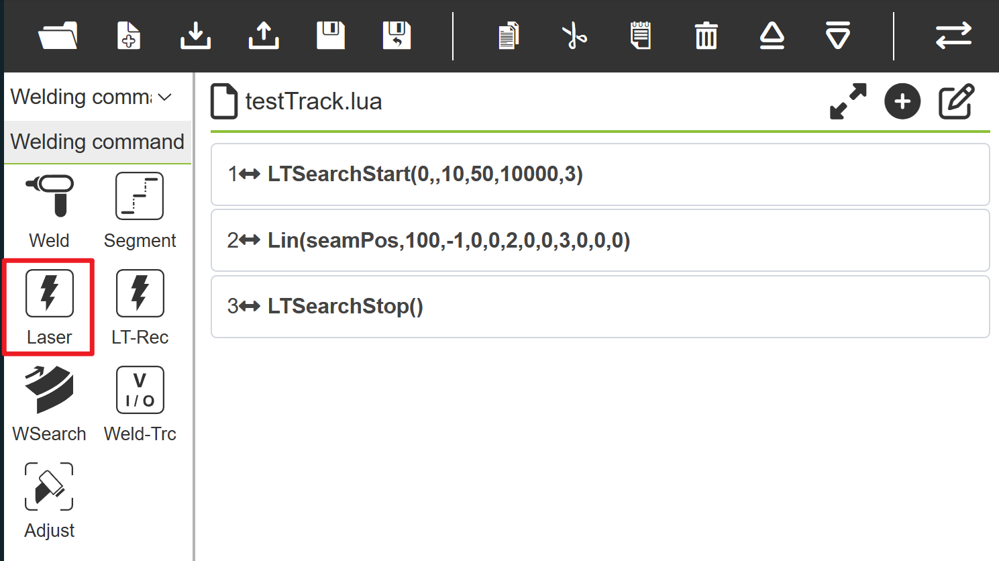

.. centered:: Figure 8.6-33 Laser Tracking

As shown in the figure, click the "Start Tracking" and "Stop Tracking" buttons in the "Laser Tracking" command addition page, and finally click the "Apply" button at the bottom of the page.

.. figure:: robot_peripherals/081.png
   :align: center
   :width: 6in

.. centered:: Figure 8.6-34 Start and Stop of Laser Tracking

The user program "testTrack.lua" at this time is shown in the figure:

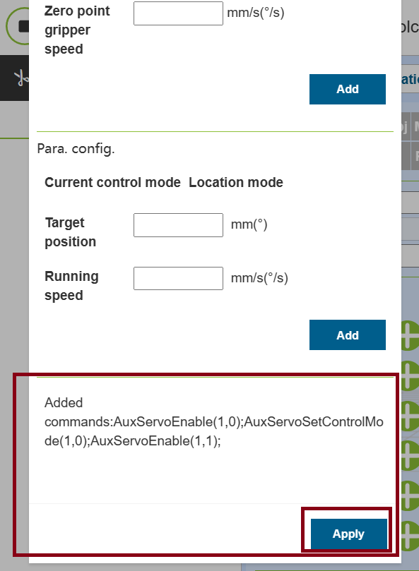

.. centered:: Figure 8.6-35 Laser tracking program

Write commands for finding the starting point and tracking the ending point
********************************************************************************************

Before laser positioning begins, it is necessary to specify a positioning starting point. The robot moves to the positioning starting point first, and then performs positioning along a certain direction and speed. As shown in the figure, the positioning starting point "seamStartPt" is taught near the point A where the laser sensor light is close to the starting point of the weld, and attention should be paid to matching the positioning starting point and the positioning direction to ensure that the robot can find the weld position within the set distance and the maximum positioning time.

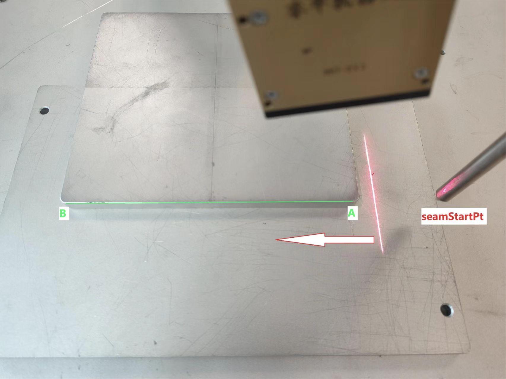

.. centered:: Figure 8.6-36 Locating starting point

As shown in the figure, the tracking end point "trackEndpt" is taught at the weld end.

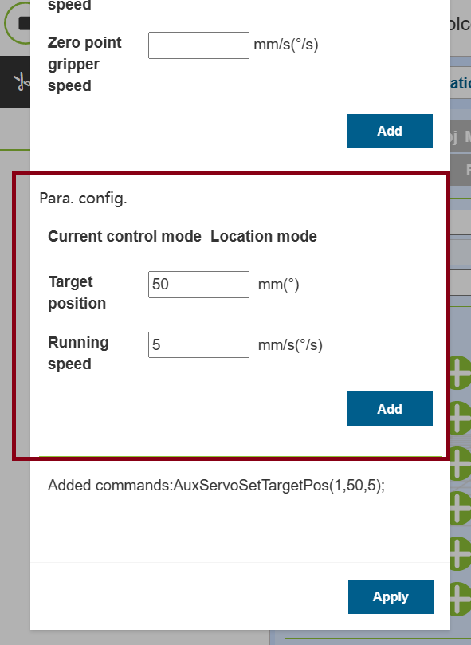

.. centered:: Figure 8.6-37 Finding the End Point

Add the above two points to the "testTrack.lua" user program, and the final user program is as follows:

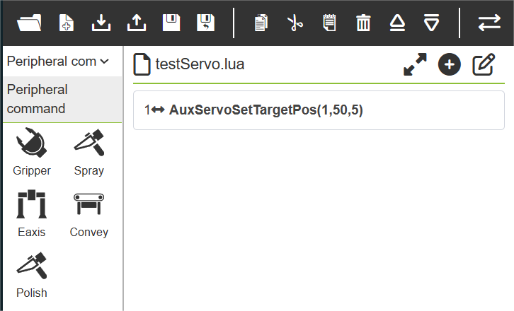

.. centered:: Figure 8.6-38 Location tracking program

Write welding related commands
**************************************************

Finally, add a welding command between "seampos" and "trackEndPt", and the final procedure is as follows:

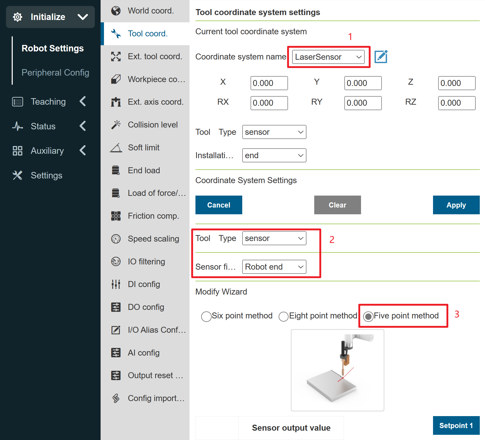

.. centered:: Figure 8.6-39 Locating and tracking welding procedure

By executing the above program, the robot will start the locating movement with the laser sensor from the locating starting point. After finding the weld, the robot will immediately move to the starting point of the weld, and perform the arc-starting operation. After the arc-starting is successful, the robot will move to the end point of the weld and track the weld trajectory during the movement. After the robot moves to the end point of the weld, it will stop welding.

Laser Track Recording+Track Reproduction
++++++++++++++++++++++++++++++++++++++++++++++++

The workflow of laser track recording+track reproduction is as follows:

(1) A robot carries a laser sensor to move along a welding seam for a section of trajectory, and the laser sensor records the welding seam position trajectory data in real time during the movement;
(2) After the trajectory recording is completed, the robot moves to the starting point of trajectory recording;
(3) The robot performs trajectory reproduction along the trajectory recorded by the laser sensor.

Programming of Robot Trajectory Recording commands
************************************************************************

Create a new user program "testRecord.lua", click "LT-Rec" to open the laser recording command addition page, and find the "weld data record", as shown in the figure. Select "Start recording", click "Add" button, and select "Stop recording", and click "Add" button again; Finally click the "Apply" button.

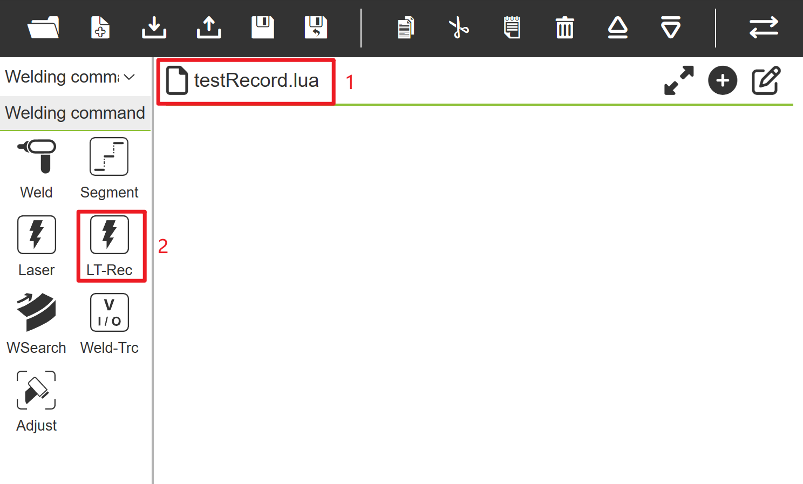

.. centered:: Figure 8.6-40 Laser recording

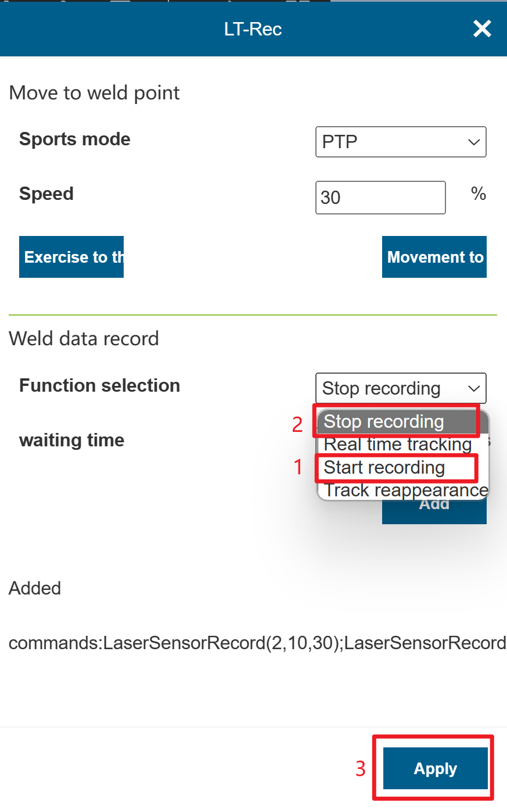

.. centered:: Figure 8.6-41 Start recording and stop recording

At this time, the track recording start and stop commands appear on the page.

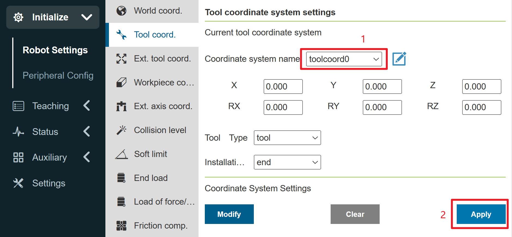

.. centered:: Figure 8.6-42 Trajectory recording program

As shown in the figure, assuming that the green line segment AB in the figure is a weld, the laser is irradiated to the weld starting point A and the weld interruption B respectively, and the starting point "recordStartPt" and the ending point "recordendpt" of trajectory recording are taught.

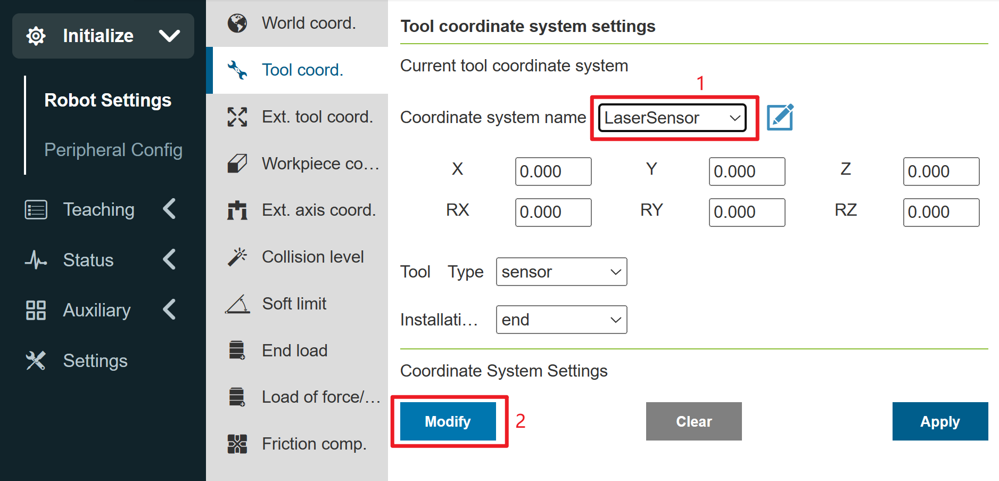

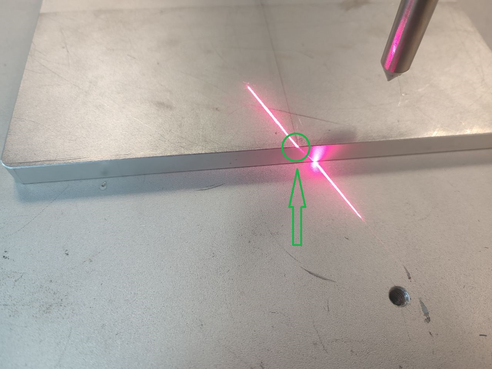

.. centered:: Figure 8.6-43 Starting point and ending point of trajectory recording

Add two linear movement commands to "testRecord.lua", namely, the starting point "recordStartPt" and the ending point "recordEndPt" when moving to the trajectory, and adjust the command positions to make the robot do the following operations: first move to the "recordStartPt" point, start the trajectory recording, and then move the robot to the "recordEndPt" point and stop the trajectory recording.

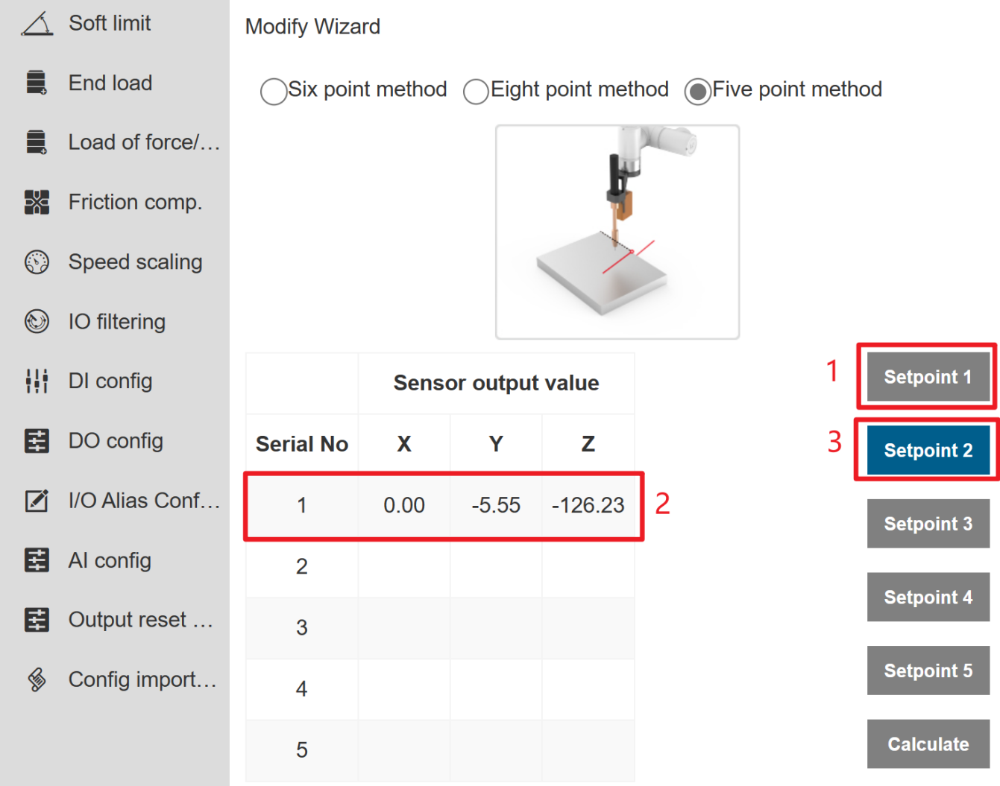

.. centered:: Figure 8.6-44 Trajectory recording program

Programming the command of the robot moving to the starting point of trajectory recording
***************************************************************************************************************

As shown in the figure, click "LT-Rec" to open the page for adding laser recording commands, find the column of "Move to Weld Point", select PTP as the motion mode, enter a certain motion speed, click "Movement to Starting Point" and click "Apply".

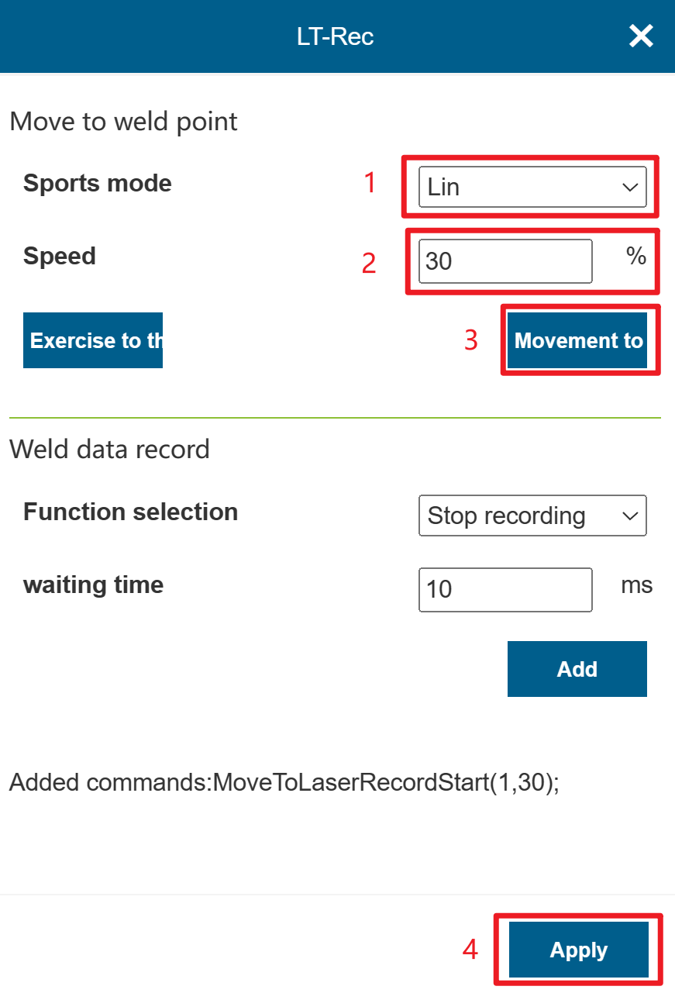

.. centered:: Figure 8.6-45 Movement to the starting point of trajectory

At this time, the user program of "testRecord.lua" is as follows:

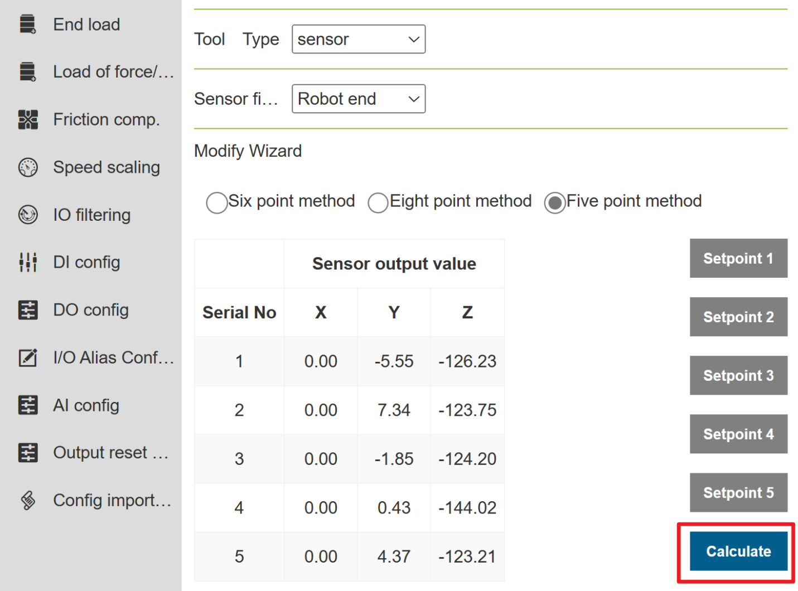

.. centered:: Figure 8.6-46 Program of Moving to the Starting Point of Trajectory

Compilation of Laser Sensor Track Reproduction command
********************************************************************************

Click "LT-Rec" to open the laser recording command addition page, and find "Weld Data Record", as shown in the figure, select "Track reappearan", click "Add" button, click "Laser Tracking" button, and finally click "Apply" button.

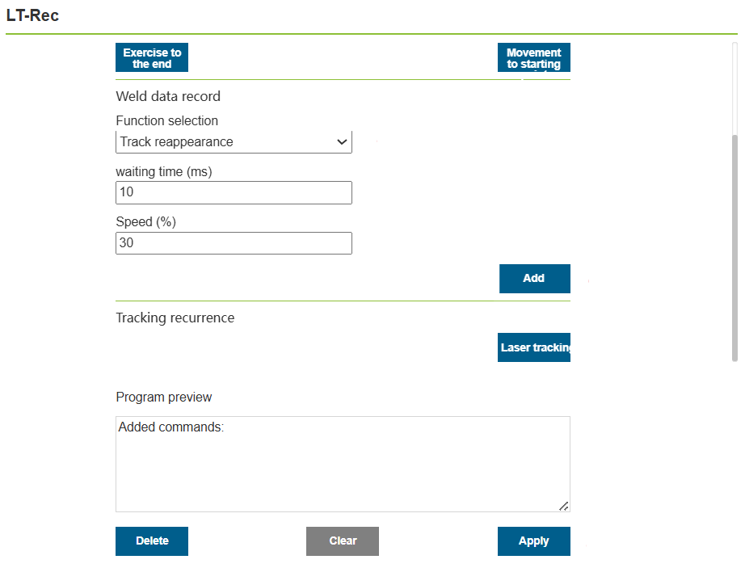

.. centered:: Figure 8.6-47 Trajectory Reproduction

The program after adding is as follows:

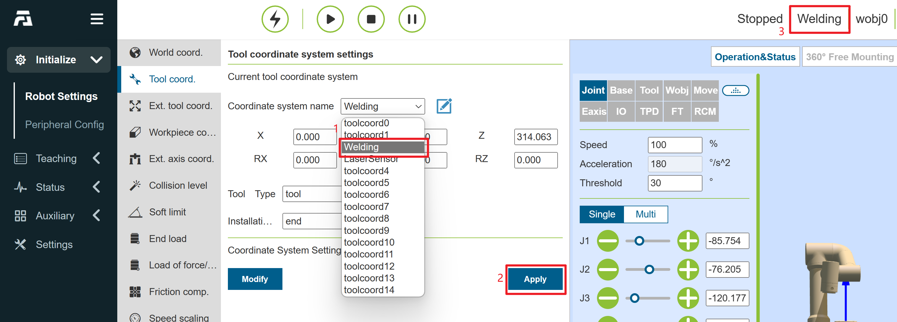

.. centered:: Figure 8.6-48 Trajectory Reproduction Program

Compilation of welding related commands
******************************************************

Finally, add welding start and welding end commands before and after the start and end of trajectory reproduction:

.. centered:: Figure 8.6-49 Reproducing welding procedure with track record

By executing the above program, the robot will carry the laser sensor to move along the weld trajectory and record the whole trajectory, then the robot will move to the starting point of the trajectory record, and the robot will start welding along the trajectory recorded by the laser sensor. When the robot trajectory reappears, the welding arc will be extinguished and the welding will be completed.

Find the intersection coordinates of three points and four points
~~~~~~~~~~~~~~~~~~~~~~~~~~~~~~~~~~~~~~~~~~~~~~~~~~~~~~~~~~~~~~~~~~~~~

When the position of the fillet weld is inconvenient to teach directly, the cobot can calculate the intersection coordinate between two planes by manually teaching or finding points on both sides of the fillet weld surface.

For right-angle welds, use three-point intersection coordinate method, and for non-right-angle welds, use four-point intersection coordinate method.

Three-point intersection coordinate calculate method
+++++++++++++++++++++++++++++++++++++++++++++++++++++++

**Step1**: Collect three planar contact points and save them as teach points;

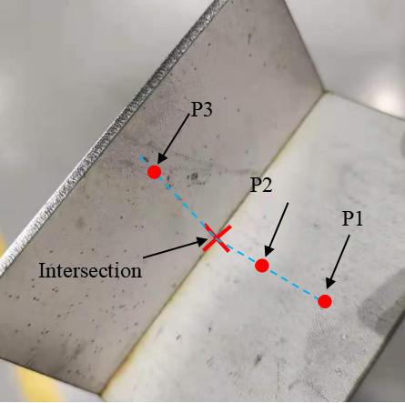

.. centered:: Figure 8.6-50 Select three contact points

The acquired touchpoint consists of three points, two of which are in the same plane and one in the vertical plane.

.. note:: The pose of the generated intersection point is the same as P3.

**Step2**: In "Initial Settings - Peripherals - Tracking", click "Sensor" to enter the sensor tracking configuration interface, and enter the function module of finding the coordinates of the intersection point of the three points and four points;

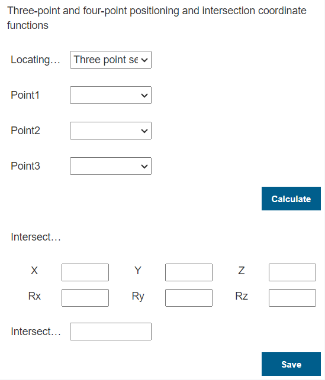

.. centered:: Figure 8.6-51 Select points

**Step3**: Select the three-point search in the drop-down box, select the three contact points collected in turn, click Calculate, check whether the display of the generated intersection in the 3D model is wrong, name and save the intersection point;

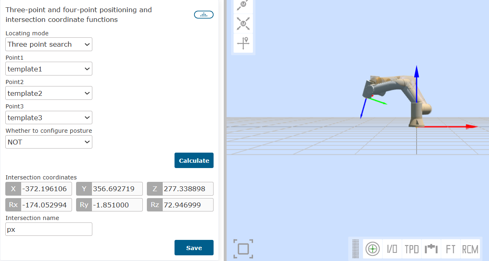

.. centered:: Figure 8.6-52 Calculate the intersection coordinates and save them

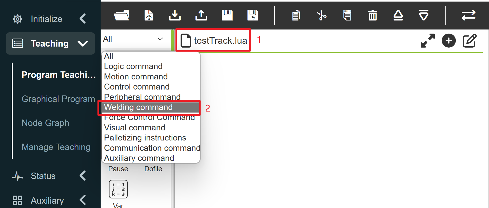

.. centered:: Figure 8.6-53 Save the intersection coordinates as teach points

Four-point intersection coordinate calculate method
+++++++++++++++++++++++++++++++++++++++++++++++++++++

**Step1**: Collect four planar contact points and save them as teach points;

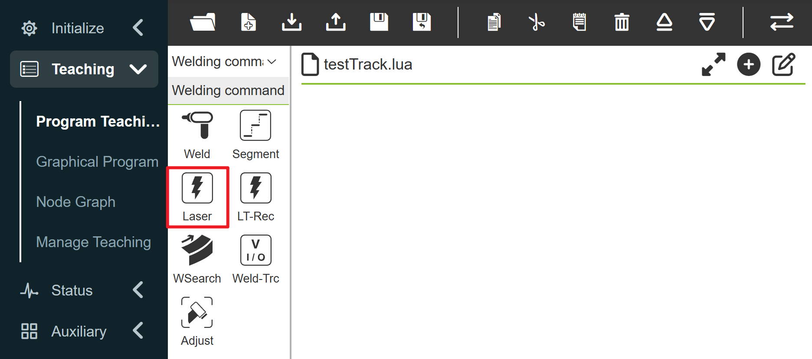

.. centered:: Figure 8.6-54 Select Four Points

The acquired contact point consists of four points, the first two of which are in the same plane and the last two in the vertical plane.

.. note::  The pose of the generated intersection point is the same as P4. 

**Step2**: In "Initial Settings - Peripherals - Tracking", click "Sensor" to enter the sensor tracking configuration interface, and enter the function module of finding the coordinates of the intersection point of the three points and four points;

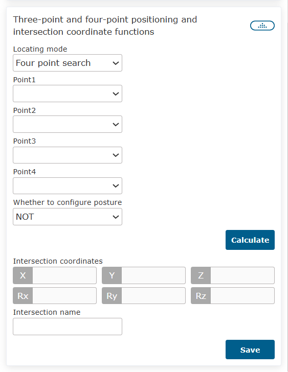

.. centered:: Figure 8.6-55 Select a locus to find the coordinates of the intersection point

**Step3**: Select the four points in the drop-down box, select the four contact points in turn, click Calculate, check whether the display of the generated intersection in the 3D model is incorrect, name the intersection coordinate and save it;

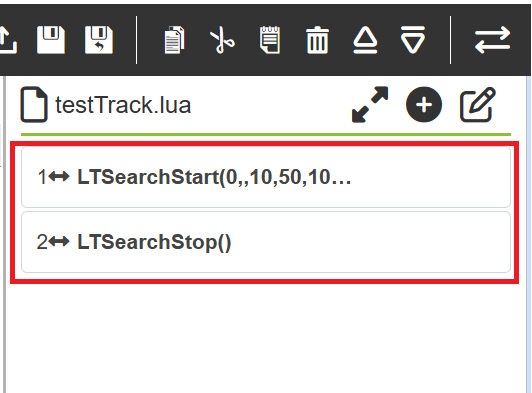

.. centered:: Figure 8.6-56 Calculate the intersection coordinates and save it

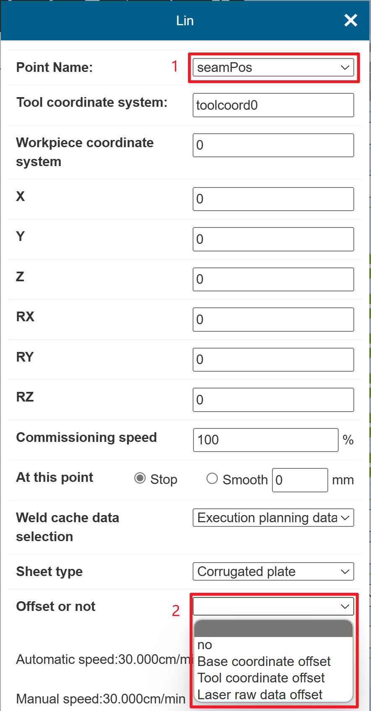

.. centered:: Figure 8.6-57 Saving the intersection coordinates as a teach point

Extended Axis Peripheral Configuration
-----------------------------------------

In "Initial Settings - Peripherals", click "Extended Axis" to enter the extended axis configuration interface, and select the combination method to configure the corresponding extended axis peripherals.

Combination methods are divided into:

- Controller + PLC (UDP)
- Controller + Servo drive (485)

Controller + PLC（UDP）
~~~~~~~~~~~~~~~~~~~~~~~~~~

Configuration steps
++++++++++++++++++++++++

**Step1**: First configure the expansion axis UDP communication. Set parameters such as IP address, port number, communication cycle, packet loss detection cycle, and number of packet losses. The reconnection cycle and the number of reconnections can only be configured after the automatic reconnection switch is turned on when communication is interrupted.

- IP address: Custom ip address
- Port number: defined according to actual situation
- Communication cycle: defined according to actual situation, unit ms
- Packet loss detection communication cycle: 10 ~ 1000 ms
- Number of packet losses: 1 ~ 100
- Communication interruption confirmation time: 0 ~ 500 ms
- Automatic reconnection after communication interruption: On/Off
- Reconnection period: 1 ~ 1000 ms
- Number of reconnections: 1 ~ 100

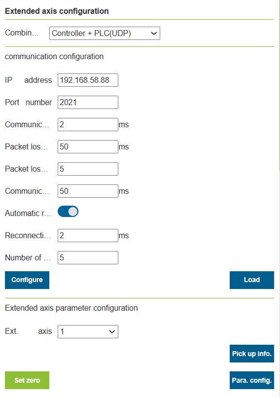

.. centered:: Figure 8.7-1 Extended axis communication configuration

.. important:: 
   1. After setting the communication disconnection confirmation time, when the communication abnormality exceeds this time period, the communication disconnection will be confirmed and an error will be reported.
   2. After the UDP communication is disconnected, a UDP disconnection error is triggered (can be reset). You can click the clear warning message button and the UDP communication is re-established.

**Step2**: Select the extended axis number 1, and click the "Parameter Configuration" button to enter the right interface. Set the axis type, axis direction, running speed, acceleration, forward limit, reverse limit, lead, encoder resolution, starting point offset, manufacturer, model and mode, and click Configure to complete the configuration.

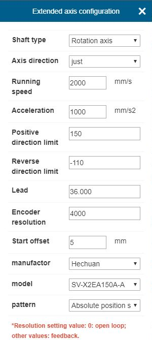

.. centered:: Figure 8.7-2 Extended axis parameter configuration
	
.. important:: 
	Before using the extended axis function, it is necessary to establish the corresponding extended axis coordinate system, and apply the established tool coordinate system during program teaching. The extended axis function is mainly used in conjunction with the welder function and the laser tracking sensor function.

**Step3**: Click the "Zero Setting" button to enter the zero setting pop-up window, as shown in the picture on the right. Set the zero return method, zero search speed, zero hoop speed and axis direction, click the "Setting" button, the extended axis will start to return to zero, the zero return status will be displayed in the blank space below the axis direction, when "zero return completed" appears The prompt indicates that the zero point of the extension axis is set successfully.

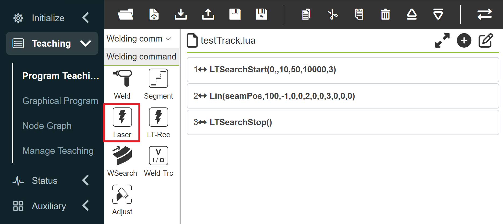

.. centered:: Figure 8.7-3 Extended axis zero point setting

**Step4**: Select the number of the extended axis whose parameters have been configured, click "Servo Enable", set the running speed, acceleration and the maximum distance of a single run, and test the extended axis for forward rotation and reverse rotation.

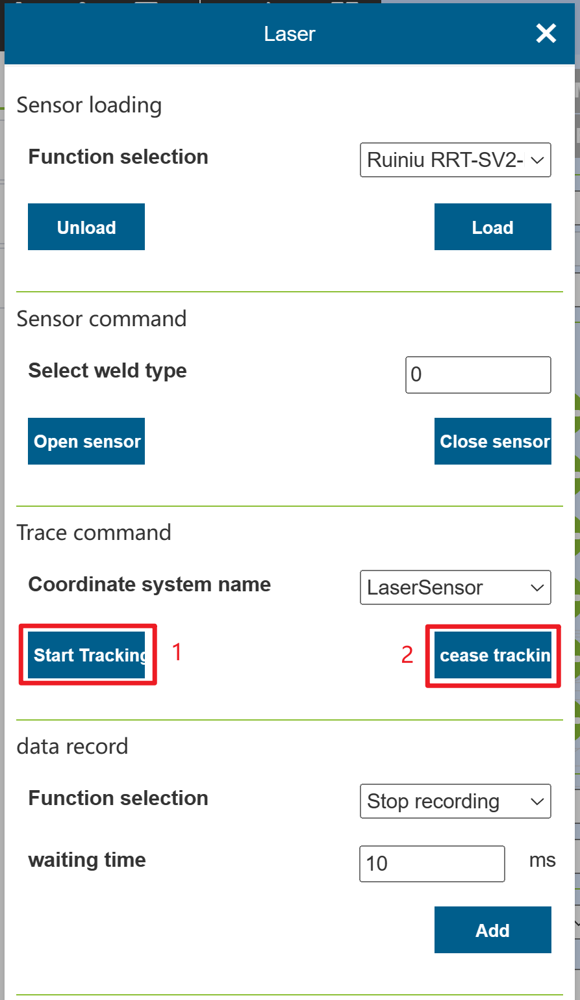

.. centered:: Figure 8.7-4 Extended Axis Test

**Step5**: The extension axis is usually used in conjunction with the laser sensor. At this time, the laser sensor is usually installed externally. The sensor reference point configuration needs to be calibrated by the three-point method instead of the six-point method used before. Align the center of the tool with the middle point of the bottom of the right cross-section (the side close to the camera), set point 1, align the center of the tool with the middle point of the bottom of the other cross-section, which is the middle point of the left cross-section, set point 2, and set the center of the tool with Move the point to the middle point of the upper edge of the cross-section on the right side of the sensor, set point 3, calculate and save, and click Apply to complete the three-point calibration.

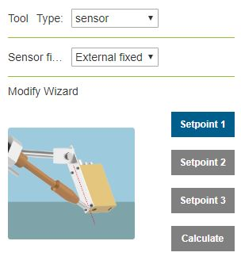

.. centered:: Figure 8.7-5 Three-point sensor calibration

**Step6**: Select the "EAxis" command on the program teaching command interface. According to the specific program teaching requirements, add instructions in the corresponding places.

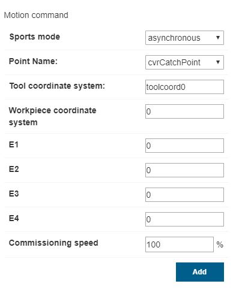

.. centered:: Figure 8.7-6 Extended axis command editing

Extended axis with laser tracking welding teaching program
++++++++++++++++++++++++++++++++++++++++++++++++++++++++++++++++++++++++

.. list-table:: 
   :widths: 15 40 100
   :header-rows: 1
   :align: center

   * - S/N
     - Instruction format
     - notes
   * - 1
     - EXT_AXIS_PTP(1,1,laserstart)
     - #External axis movement laser sensor starting point
   * - 2
     - PTP(laserstart,10,-1,0)
     - #Starting point of robot motion laser sensor
   * - 3
     - LTSearchStart(3,20,10,10000)
     - #Start searching
   * - 4
     - LTSearchStop()
     - #Stop searching
   * - 5
     - EXT_AXIS_PTP(1,1,seamPos)
     - #Start point of external axis movement weld
   * - 6
     - Lin(seamPos,20,-1,0,0,0)
     - #Start point of robot moving weld
   * - 7
     - LTTrackOn()
     - #Laser tracking
   * - 8
     - ARCStart(0,10000)
     - #Arc striking of welder
   * - 9
     - EXT_AXIS_PTP(1,1,laserend)
     - #End point of external axis movement weld
   * - 10
     - Lin( laserend,10,-1,0,0)
     - #End point of robot moving weld
   * - 11
     - ARCEnd(0,10000)
     - #Arc extinguishing of welder
   * - 12
     - LTTrackOff
     - #Laser tracking off

Controller + Servo drive (485)
~~~~~~~~~~~~~~~~~~~~~~~~~~~~~~~~~~~~~~

Hardware cable connection
++++++++++++++++++++++++++++++

Figure 8.7-7 shows the schematic diagram of the electrical interface of the control box of FR robot. Before using RS485 communication to control the servo extension shaft, please connect the RS485 communication interface of the servo driver to the RS485 communication interface on the robot control box.

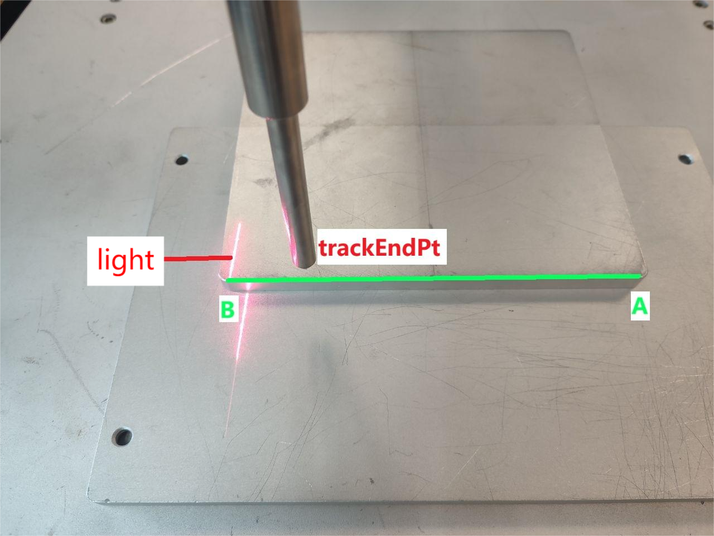

.. centered:: Figure 8.7-7 Schematic diagram of electrical interface of FR robot integrated mini control box

Take Dynatec servo driver FD100-750C as an example, Figure 8.7-8 is the schematic diagram of the driver panel terminal, Figure 8.7-9 is the definition of the X3A-IN terminal of FD100-750C, when the robot is configured to communicate with the FD100-750C servo extension shaft, Connect the 485-A0 and 485-B0 terminals on the control box to pins 4 and 5 of the X3A-IN terminal of the driver.

.. note:: 
  Please note: you can see a "485" mark on the servo driver panel, the terminal is not open for user use, do not connect your RS485 communication cable to this terminal. 

At the same time, if multiple servo drivers are connected and the driver is the last one in the link, turn on the DIP switch (DIP switch 2) of the RS485 communication interrupt resistance on the panel.

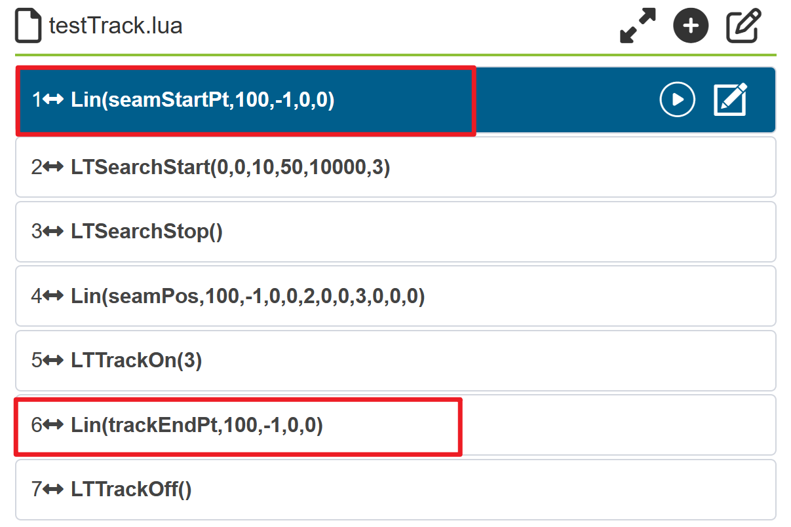

.. centered:: Figure 8.7-8 FD100-750C driver panel

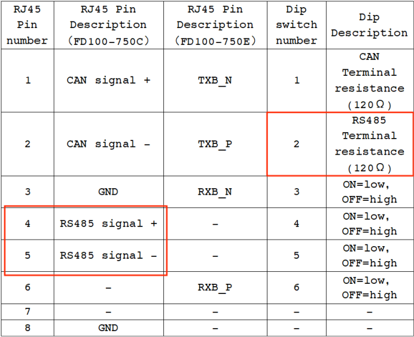

.. centered:: Figure 8.7-9 X3A-IN terminal definition of FD100-750C

Communication configuration
++++++++++++++++++++++++++++++

**Step1**: After ensuring that your RS485 communication cable is correctly connected, the robot and servo extension shaft are powered on, open the robot WebApp, click "Initialize", " Peripheral Config" and "Ext axis" successively to open the "Extension axis Configuration" page,as shown in Figure 8.7-10.

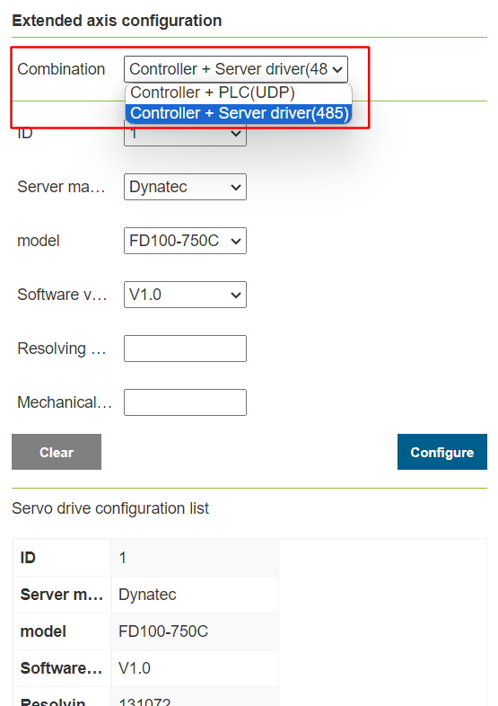

.. centered:: Figure 8.7-10 RS485 expansion axis configuration

**Step2**: On the "Expansion Axis Configuration" page, select the Combination as "Controller + Servo driver(485)" and ID as "1".

.. note:: 
  Please note: When connecting multiple servos, this ID is used to distinguish different servos, we will mention this ID many times later.

The Servo manufacturer is "Dynatec", select the model and the software version, fill in the corresponding Resolution of the servo drive, here is 131072, Fill in the mechanical transmission ratio according to your mechanism model, here is 15.45; Click the "Configure" button.

**Step3**: At this point, we have completed the 485 communication configuration between the robot and the servo drive. You can view the real-time status information of the servo in the "Servo status bar" on the right of the WebApp (Figure 8.7-11).

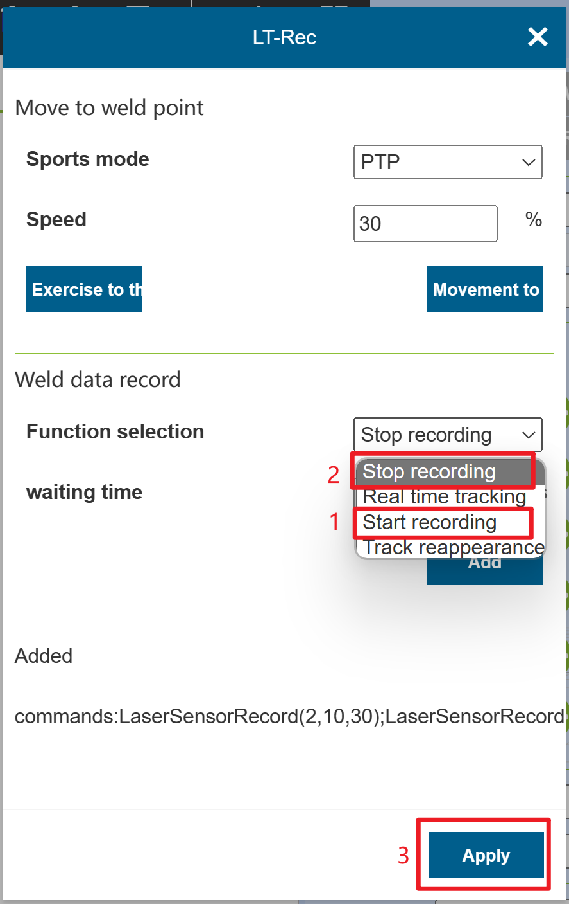

.. centered:: Figure 8.7-11 Servo status bar

Now you can perform a certain motion test on the expansion shaft equipment, please follow the following test operations under the premise of ensuring safety.

Servo control mode and enablement
**********************************************

As shown in Figure 8.7-12, in the "Servo drive debugging" bar, select the corresponding servo ID and click the "Set" button on the right; Select the control mode as "Location mode" and click the "Configure" button on the right.

.. note:: 
  Please note: After switching the control mode, the servo needs to be disabled and then enabled to make the servo control mode switch take effect.

**Location Mode** : You can enter a certain motion speed and target position parameters, the servo will move to the target position at the set speed, after moving to the target position, the servo will stop moving.

**Speed Mode** : You can enter a certain target speed, the servo will keep moving according to the target speed set by you until you set the target speed to 0 or enable the servo motor down.

- Click the "Enable" button. In the "Servo Status Bar" on the right of the WebApp, you can observe that the "Enable" status is on, indicating that the servo drive is enabled.
- Click the "Disable" button in the "Servo Drive Debugging" bar, the "Enable" status light in the "Servo status bar" is off, and the servo enable is turned off.

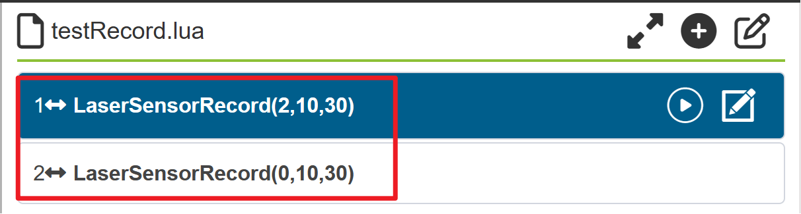

.. centered:: Figure 8.7-12 Servo driver debugging page

Servo homing
**********************************************

As shown in Figure 8.7-13, the Zero return mode is selected as "current position return to zero", the Zero seeking speed is 5mm/s, and the Zero point gripper speed is 1mm/s.

Click the "Set" button to complete the operation of the current position homing. In the "servo status bar", it can be observed that the current "servo position" is 0.

.. important::
  Please read this manual completely, and then select the homing mode as "negative limit homing" or "positive limit homing" for homing test.

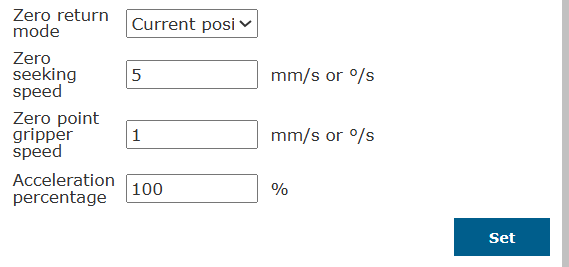

.. centered:: Figure 8.7-13 Servo homing debugging

Servo motion
**********************************************

Before the actual control of the servo motor movement, please first understand the servo motor "Location mode" and "speed mode", once again remind you:

**Location Mode** : You can enter a certain motion speed and target position parameters, the servo will move to the target position at the set speed, after moving to the target position, the servo will stop moving.

**Speed Mode** : You can enter a certain target speed, the servo will keep moving according to the target speed set by you until you set the target speed to 0 or enable the servo motor down.

As shown in Figure 8.7-14, when the control mode of the expansion axis is switched, the display of "Current control mode" will automatically switch.

.. note::
  Please note: After the control mode is switched, the servo must be unenabled and then enabled, so that the control mode switch of the servo will take effect.

If your servo is not currently in Location Mode, switch your servo to Location mode. Enter "target position" as 50mm, running speed as 5mm/s, under the condition of confirming safety, click "Set" button, then the servo motor will move according to the parameters set by you, you can observe the servo position and speed in real time in the "servo status bar".

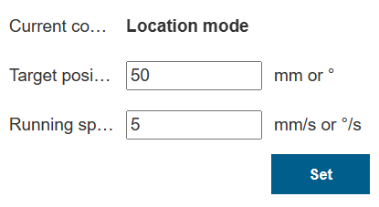

.. centered:: Figure 8.7-14 Servo motion debugging (Location mode)

Change the control mode of the servo to "Speed mode", click "Disable", then click "Enable", then the servo switches to speed mode.

.. note:: 
  Please note: when the servo motor is moving, the servo motor can only be stopped by setting the target speed to 0.

Enter the target speed of 5mm/s, click the "Set" button, the servo motor will keep moving at 5mm/s, you can also observe the servo position and speed in the "servo status bar" in real time.

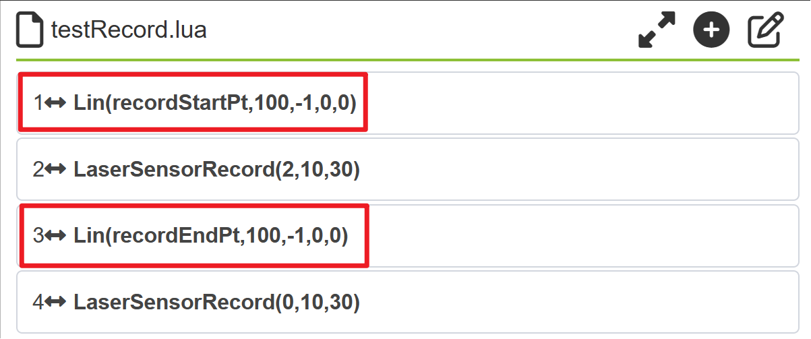

.. centered:: Figure 8.7-15 Servo motion debugging (speed mode)

If the robot encounters an emergency situation such as collision or pressing the emergency stop button, the extended axis can trigger an emergency stop and stop moving according to the set emergency stop deceleration. After the collision alarm is restored, instructions can continue to be issued to restore the operation of the extended axis.

In the advanced settings, it is necessary to set the servo acceleration/deceleration and servo emergency stop acceleration/deceleration as follows:

.. figure:: robot_peripherals/175.png
  :align: center
  :width: 4in

.. centered:: Figure 8.7-16 Advanced settings for servo motion

Click on "Pause" or "Stop" to stop the 485 extension axis according to the set deceleration.

Extended axis programming
++++++++++++++++++++++++++++++

**Step1**: Create a new user program "testServo.lua", and select "Peripheral Command".

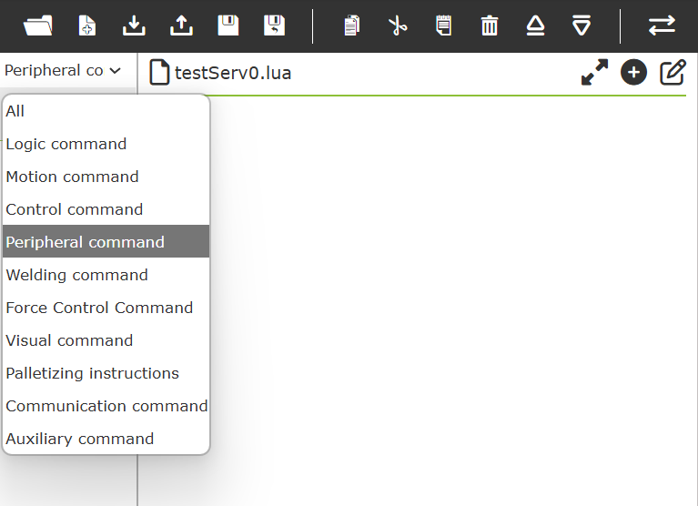

.. centered:: Figure 8.7-16 Open peripheral Commands

**Step2**: Click "Eaxis" to open the interface of adding extension axis commands.

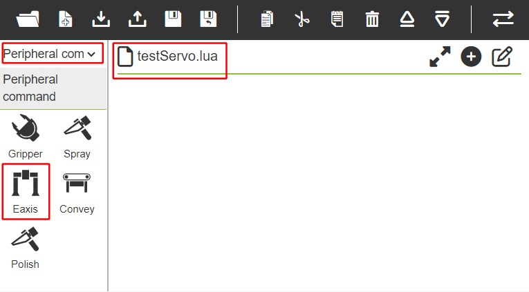

.. centered:: Figure 8.7-17 Opens the Add extension axis commands page

**Step3**: select the Combination s "Controller + servo drive (485)" on the Add extension axis commands page, set the control mode as "Location mode", and click the "Add" button on the right.

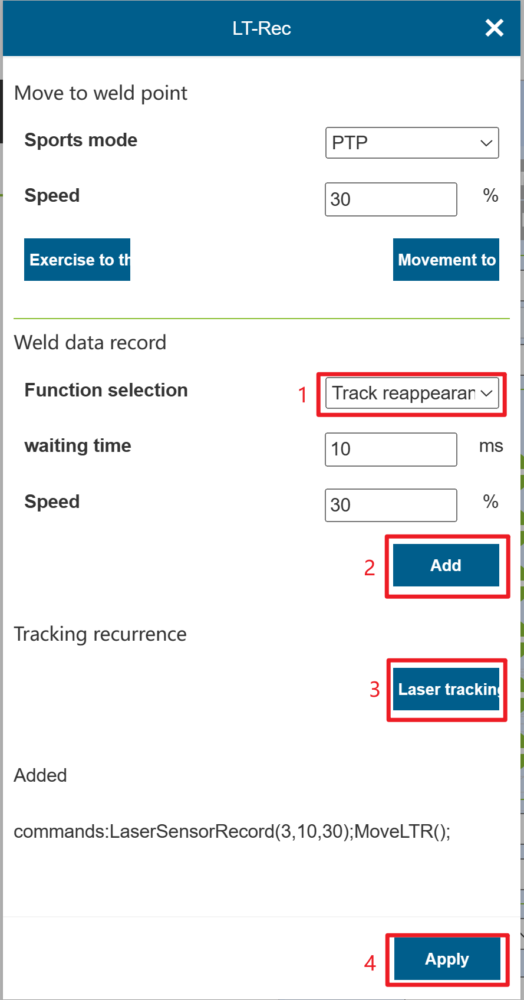

.. centered:: Figure 8.7-18 Sets the control mode for the extension axis

**Step4**: Flip the Add extension axis commands interface to the bottom, click the "Apply" button.

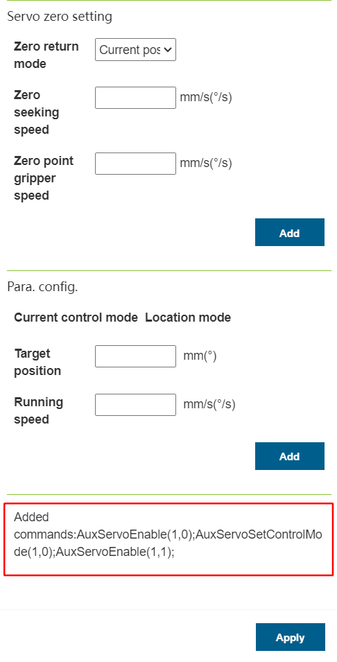

.. centered:: Figure 8.7-19 Apply the extension axis commands

**Step5**: At this time, a set of commands to switch the servo control mode will appear in the program "testServo.lua". You can switch the robot to the automatic mode and execute the program.

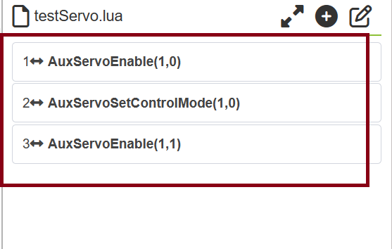

.. centered:: Figure 8.7-20 Setup servo control mode program

**Step6**: How to control servo motion through user program? Also open the interface of adding extension axis commands , find the parameter configuration bar, take the Location mode as an example, enter the target position and running speed, and click "Add" button; Flip to the bottom of the Add Extension Axis commands screen, click the "Apply" button.

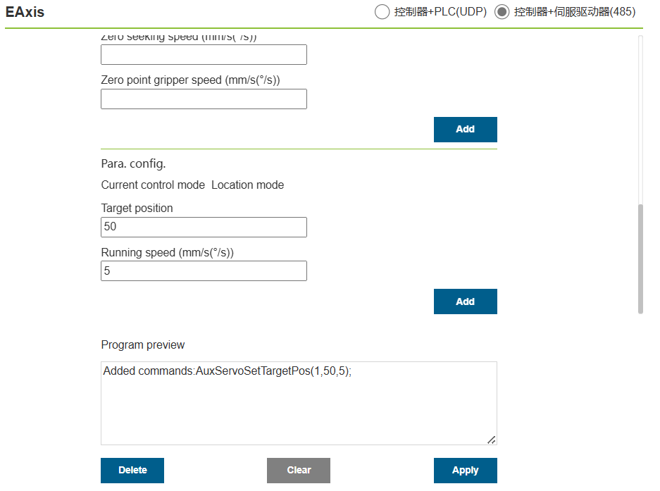

.. centered:: Figure 8.7-21 Add Location mode motion commands

**Step7**: Servo motion commands have been added to the "testServo.lua" program: "AuxServoSetTargetPos,50,5 (1)".

  The meanings of the three parameters in the commands function are:

  - 1: Servo number is 1.

  - 50: Target position.

  - 5: Target speed.

  - 10: Acceleration percentage.

.. figure:: robot_peripherals/127.png
   :align: center
   :width: 6in

.. centered:: Figure 8.7-22 Location mode servo motion program

**Step8**: Switch the robot to automatic mode and run the program, at which time your servo will move at a speed of 5mm/s to a position of 50mm.

At this point, we have completed the preliminary configuration and testing of the RS485 control servo extension shaft, and you can write the program of the combination of robot motion and servo motion according to the actual situation.

Example of cooperative motion program between extension axis and robot
********************************************************************************************

.. list-table:: 
   :widths: 15 40 100
   :header-rows: 1
   :align: center

   * - S/N
     - Instruction format
     - notes
   * - 1
     - AuxServoSetTargetPos(1,50,5)
     - #The extended axis moves to the reset point
   * - 2
     - if(GetDI(8,0) == 1) then
     - #If the CI0 input is valid
   * - 3
     - AuxServoSetTargetPos(1,50,5)
     - #Expansion shaft movement to 50mm
   * - 4
     - PTP(testptp1,100,-1,0)
     - #Robot moves to point testptp1
   * - 5
     - else if(GetDI(9,0) == 1) then
     - #If the CI1 input is valid
   * - 6
     - AuxServoSetTargetPos(1,150,5)
     - #Expansion shaft movement to 150mm
   * - 7
     - PTP(testptp2,100,-1,0)
     - #Robot moves to point testptp2
   * - 8
     - else
     - #If both CI0 and CI1 inputs are invalid
   * - 9
     - AuxServoSetTargetPos(1,300,5)
     - #The expansion shaft moves to 300mm
   * - 10
     - PTP(testptp3,100,-1,0)
     - #Robot moves to testptp3
   * - 11
     - end
     - 

Summary
++++++++++++++++++++++++++++++

In summary, there are the following points to note when configuring the RS485 communication between the cooperative robot and the servo expansion axis:
  
1. Correctly connect the RS485 communication cable between the cooperative robot and the servo driver;

2. Correctly select the control mode of the servo extension axis;

3. After switching the control mode, you must first disable, and then enable the servo, the control mode switch can take effect.

Conveyor Tracking Configuration
-----------------------------------

Conveyor Tracking Configuration Steps
~~~~~~~~~~~~~~~~~~~~~~~~~~~~~~~~~~~~~~~~~

**Step1**: Select the "Conveyor" menu item in "Initial - Peripheral - Tracking" to enter the conveyor tracking configuration interface, click the "Configure Conveyor Belt IO" button to quickly configure the IO required for the conveyor belt function, and then configure the corresponding parameters according to the actual use of the function. Here, there is no visual Take the tracking and grabbing function as an example, you need to configure the conveyor belt encoder channel, resolution, lead, visual matching, select No, and click Configure.

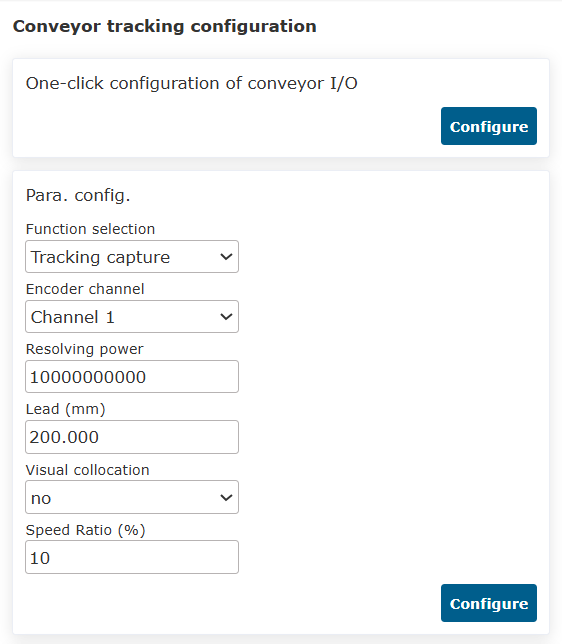

.. centered:: Figure 8.8-1 Conveyor configuration

**Step2**: Next, set the grab point compensation value, which is the compensation distance in the three directions of X, Y, and Z, which can be set according to the actual situation during the debugging process.

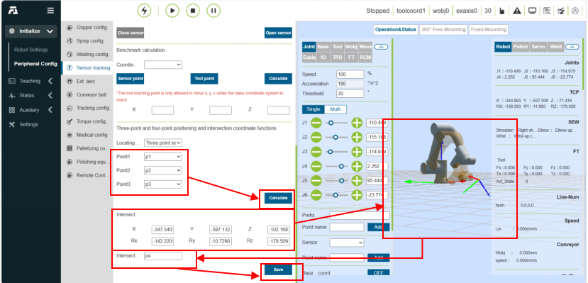

.. centered:: Figure 8.8-2 Conveyor Grab Point Compensation Configuration

**Step3**: Turn on the conveyor belt, move the calibrated object to the defined point A, and stop the conveyor belt. Move the robot, align the sharp point of the calibration rod at the end of the robot with the sharp point of the object to be calibrated, click the start point A button, a dialog box will pop up, displaying the current encoder value and robot pose, and click Calibrate to complete the start point A calibration.

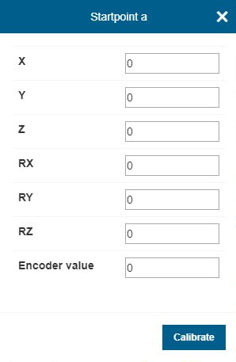

.. centered:: Figure 8.8-3 Starting Point A Configuration

**Step4**: Click the reference point button to enter the reference point calibration. When recording the reference point, record the height and attitude of the robot when it is grasping. Every time it tracks, it will track and grasp with the height and attitude area of the recorded reference point. It can be different from the AB point. Click Calibrate to complete the reference point calibration.

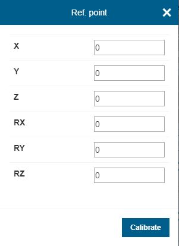

.. centered:: Figure 8.8-4 Reference point configuration

**Step5**: Turn on the conveyor belt, move the calibrated object to the defined point B, and stop the conveyor belt. Move the robot, align the sharp point of the calibration rod at the end of the robot with the sharp point of the object to be calibrated, click the end point B button, a dialog box will pop up, displaying the current encoder value and robot pose, click the calibration to complete the end point B calibration.

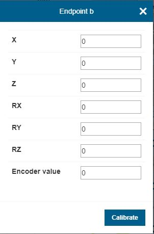

.. centered:: Figure 8.8-5 Terminal B configuration

Conveyor belt tracking teaching program
~~~~~~~~~~~~~~~~~~~~~~~~~~~~~~~~~~~~~~~~

.. list-table:: 
   :widths: 15 40 100
   :header-rows: 1
   :align: center

   * - S/N
     - Instruction format
     - notes
   * - 1
     - PTP(conveyorstart,30,-1,0)
     - #Robot grabbing starting point
   * - 2
     - While(1) do
     - #Loop Grab
   * - 3
     - ConveyorIODetect(10000)
     - #IO real-time detection of objects
   * - 4
     - ConveyorGetTrackData(1)
     - #Object position acquisition
   * - 5
     - ConveyorTrackStart(1)
     - #Conveyor tracking start
   * - 6
     - Lin(cvrCatchPoint,10,-1,0,0)
     - #Robot reaches the grab point
   * - 7
     - MoveGripper(1,255,255,0,10000)
     - #Gripper claw grabs objects
   * - 8
     - Lin(cvrRaisePoint,10,-1,0,0)
     - #Robot lifting
   * - 9
     - ConveyorTrackEnd()
     - #End of belt tracking
   * - 10
     - PTP(conveyorraise,30,-1,0)
     - #Robot arrives at holding point
   * - 11
     - PTP(conveyorend,30,-1,0)
     - #Robot reaches the placement point
   * - 12
     - MoveGripper(1,0,255,0,10000)
     - #Gripper release
   * - 13
     - PTP(conveyorstart,50,-1,0)
     - #The robot returns to the starting point again and waits for the next capture
   * - 14
     - end
     - #End
  
Attitude Adaptive Configuration
----------------------------------

Attitude adaptive configuration steps
~~~~~~~~~~~~~~~~~~~~~~~~~~~~~~~~~~~~~~~~~

**Step1**: Select the "Tracking attitude configuration" button in the user peripherals configuration interface to enter the attitude adjustment configuration interface, select the plate type and the actual working direction of the robot, adjust the robot attitude, and set the attitude point A, attitude point B and attitude point C respectively, usually A is the attitude point of the plane, B is the attitude point of the rising edge, and C is the attitude point of the falling edge.

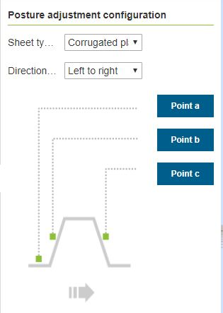

.. centered:: Figure 8.9-1 Attitude Adjustment Configuration

.. important:: 
	The attitude change between A posture and B posture, A posture and C posture is as small as possible under the condition that the application requirements are met. The posture adaptive function is an auxiliary application function, usually used in conjunction with seam tracking.

**Step2**: Select the "Adjust" command on the program teaching command interface. According to the specific program teaching requirements, add instructions in the corresponding places.

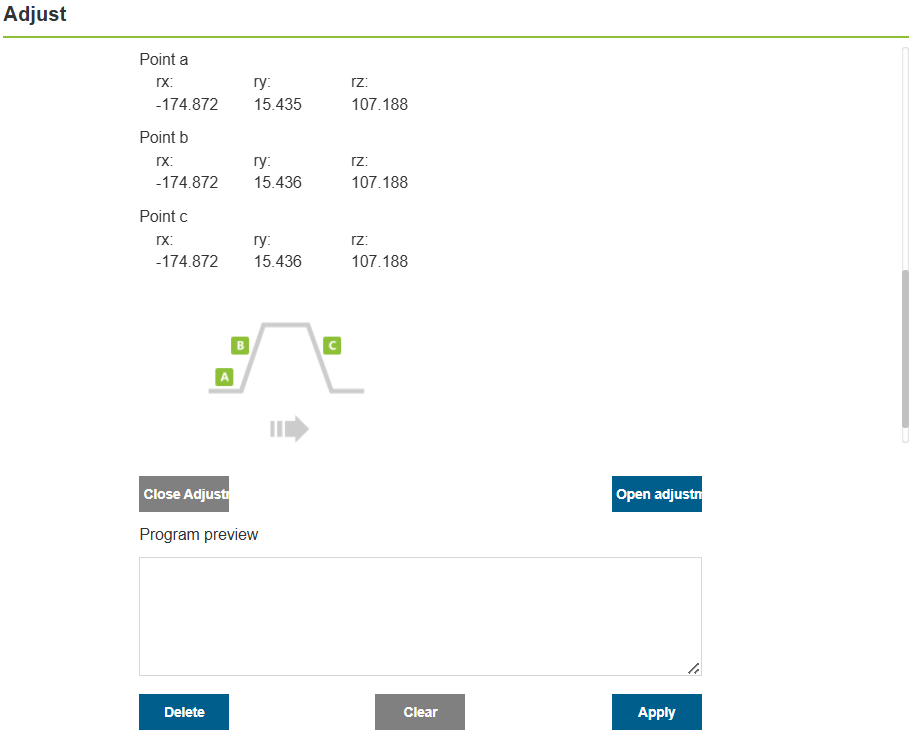

.. centered:: Figure 8.9-2 Attitude Adjustment Command Edit

Attitude self-adaptive with extended axis and laser tracking welding teaching program
~~~~~~~~~~~~~~~~~~~~~~~~~~~~~~~~~~~~~~~~~~~~~~~~~~~~~~~~~~~~~~~~~~~~~~~~~~~~~~~~~~~~~~~~~~~

.. list-table:: 
   :widths: 15 40 100
   :header-rows: 1
   :align: center

   * - S/N
     - Instruction format
     - notes
   * - 1
     - EXT_AXIS_PTP(1,1,laserstart)
     - #External axis movement laser sensor starting point
   * - 2
     - PTP(laserstart,10,-1,0)
     - #Starting point of robot motion laser sensor
   * - 3
     - LTSearchStart(3,20,10,10000)
     - #Start searching
   * - 4
     - LTSearchStop()
     - #Stop searching
   * - 5
     - EXT_AXIS_PTP(1,1,seamPos)
     - #Start point of external axis movement weld
   * - 6
     - Lin(seamPos,20,-1,0,0,0)
     - #Start point of robot moving weld
   * - 7
     - LTTrackOn()
     - #Laser tracking
   * - 8
     - ARCStart(0,10000)
     - #Arc striking of welder
   * - 9
     - PostureAdjustOn(0,PosA,PosC,PosB,1000)
     - #Attitude adaptive adjustment on
   * - 10
     - EXT_AXIS_PTP(1,1,laserend)
     - #End point of external axis movement weld
   * - 11
     - Lin( laserend,10,-1,0,0)
     - #End point of robot moving weld
   * - 12
     - ARCEnd(0,10000)
     - #Arc extinguishing of welder
   * - 13
     - PostureAdjustOff(0)
     - #Attitude adaptive adjustment off
   * - 14
     - LTTrackOff
     - #Laser tracking off

Force/Torque Sensor Peripheral Configuration
-----------------------------------------------

Force/Torque Sensor Configuration Steps
~~~~~~~~~~~~~~~~~~~~~~~~~~~~~~~~~~~~~~~~~~

**Step1**: In the menu bar of "Initial - Peripheral - End -tool", click "Adapter device" to enter the terminal peripheral configuration interface.

Select "Force Sensor Device" for the device type. The force sensor configuration information is divided into manufacturer, type, software version and mounting location. Configure the corresponding force sensor information. If the user needs to change the configuration, he can first select the corresponding number, click the "Clear" button to clear the corresponding information, and reconfigure according to the needs;

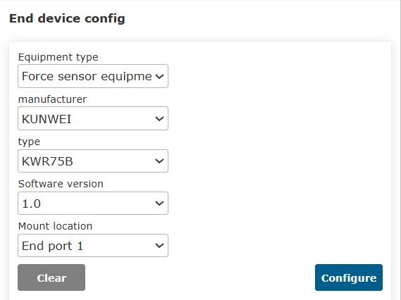

.. centered:: Figure 8.10-1 Force/Torque Sensor Configuration

.. important:: 
	The corresponding sensor should be inactive before clicking Clear Configuration.

**Step2**: After the configuration of the force sensor is completed, the user can view the corresponding force sensor information in the information table at the bottom of the page. If a configuration error is found, the user can click the "Reset" button to reconfigure.

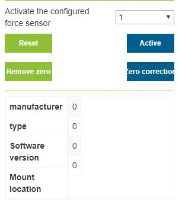

.. centered:: Figure 8.10-2 Force/Torque Sensor Configuration Information

**Step3**: Select the configured force sensor number and click the "Reset" button. After the page pops up and the command is sent successfully, click the "Activate" button to check the activation status in the force sensor information table to determine whether the activation is successful; in addition, the force sensor will There is an initial value, and the user can select "zero point correction" and "zero point removal" according to the usage requirements. The force sensor zero point correction needs to ensure that the force sensor is horizontal and vertical, and the robot is not equipped with a load.

**Step4**: After the configuration of the force sensor is completed, the sensor type tool coordinate system needs to be configured, and the value of the sensor tool coordinate system can be directly input and applied according to the distance between the sensor and the center of the end tool.

Force/Torque Sensor Load Identification
~~~~~~~~~~~~~~~~~~~~~~~~~~~~~~~~~~~~~~~~

Select "Force/Torque Sensor Load" in the robot configuration interface to configure.

Specific attitude recognition: clear the end load data, configure the force sensor, establish the sensor coordinate system, adjust the end attitude of the robot to be vertically downward, perform "zero point correction" and install the end load. First, select the corresponding sensor tool coordinate system, adjust the robot so that the sensor and tool are vertically downward, record data, and calculate the quality. Next, adjust the three different postures of the robot, record three sets of data respectively, calculate the center of mass, and click Apply after confirming that it is correct.

**Dynamic identification**: After clearing the end load data and configuring the force sensor, establish the sensor coordinate system, adjust the end posture of the robot to be vertically downward, perform "zero point correction" and install the end load. Click "Identification On", drag the robot to move, and then click "Identification Off", the load result can be automatically applied to the robot.

**Automatic Zero Calibration**: After the sensor records the initial position, it can be automatically zeroed.

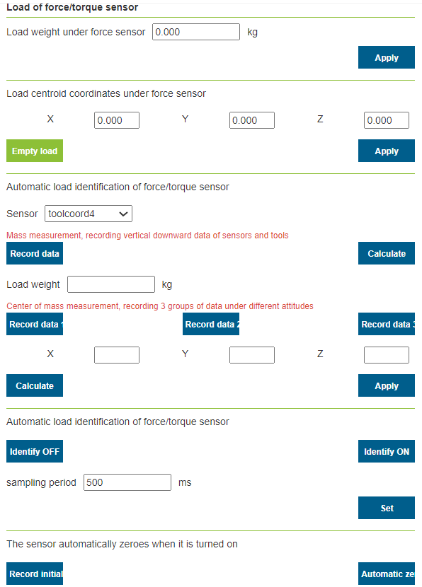

.. centered:: Figure 8.10-3 Force/Torque Sensor Load Identification

Force/Torque Sensor Assisted Drag
~~~~~~~~~~~~~~~~~~~~~~~~~~~~~~~~~~~

After the sensor is configured, it can be used with the sensor to better assist the dragging robot. When using it for the first time, you can configure it according to the data in the picture on the right. After the application is completed, you don’t need to enter the drag mode at this time, and you can directly drag the end force sensor to control the robot to move in a fixed posture. (The data in the figure below is a reference standard.)

.. figure:: robot_peripherals/138.png
   :align: center
   :width: 4in

.. centered:: Figure 8.10-4 Force/Torque Sensor Drag Lock

**Adaptive selection**: Turn it on when assembly is required. After turning it on, dragging becomes heavier;

**Inertia Parameter**: Adjust the feel during dragging. It needs to be operated with caution under the guidance of technical personnel.

**Damping parameters**:

-  Translation direction: It is recommended to set the parameter between [100-200];

-  Rotation direction: It is recommended to set the parameters between [3-10], among which the RZ direction setting range is [0.1-5];

-  Effect: When dragging with the help of a sensor, increasing the damping will make it difficult to drag, and reducing the damping will make it too easy to drag the robot (it is recommended not to be too small);

-  The overall range of damping parameters: translation XYZ: [100-1000]; rotation RX, RY: [3-50], RZ: [2-10];

-  The maximum drag force is 50 and the maximum drag speed is 180.

**Stiffness parameter**: All are set to 0;

**Drag force threshold**: Translation XYZ is [5-10]; rotation RX, RY, RZ is [0.5-5];

.. important:: 
  Locking is achieved by increasing the force threshold in the translation direction XYZ or rotation direction RX, RY, RZ.

Force/Torque Sensor Collision Detection
~~~~~~~~~~~~~~~~~~~~~~~~~~~~~~~~~~~~~~~~~~

Command description: "FT_Guard" command is a collision detection command. Select the corresponding sensor coordinate system, check the effective torque direction detection, set the current value, the maximum collision threshold and the minimum collision threshold. The normal range of the collision detection condition is (current value-minimum threshold, current value+maximum threshold), set "Open" and "Close" commands are added to the program.

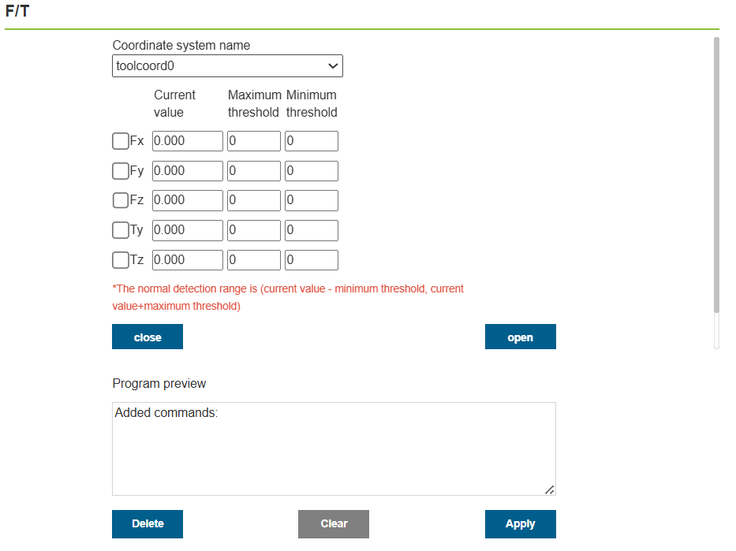

.. centered:: Figure 8.10-5 FT_Guard Command Edit

Program example:

.. list-table:: 
   :widths: 15 15 70
   :header-rows: 1
   :align: center

   * - S/N
     - Instruction format
     - notes
   * - 1
     - FT_Guard(1,1,1,1,1,0,0,0,5,0,0,0,0,0,10,0,0,0,0,0,5,0,0,0,0,0)
     - #Force/moment collision detection on                                  
   * - 2
     - PTP(template1,100,-1,0)
     - #Motion command
   * - 3
     - FT_Guard(0,1,1,1,1,0,0,0,5,0,0,0,0,0,10,0,0,0,0,0,5,0,0,0,0,0)
     - #Force/moment collision detection off

Force/Torque Sensor Force Control Motion
~~~~~~~~~~~~~~~~~~~~~~~~~~~~~~~~~~~~~~~~~

Instruction description: The "FT_Control" instruction is a force control motion instruction, which can make the robot move near the set force, and is often used in grinding scenes. Select the corresponding sensor coordinate system, check the effective torque direction detection, set the detection threshold, and the PID proportional coefficient in each direction (generally set p to 0.001), set the maximum adjustment distance (corresponding to X, Y, Z) and maximum adjustment angle (corresponding to RX, RY, RZ), add the "open" and "close" instructions to the program.

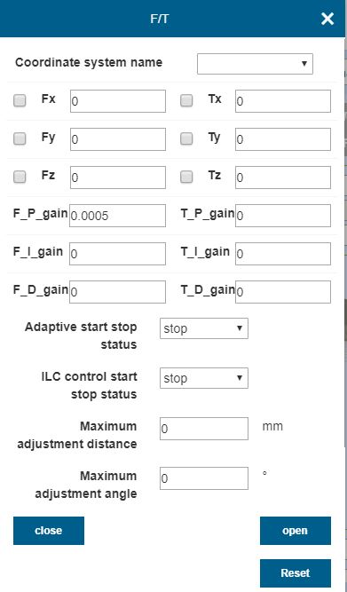

.. centered:: Figure 8.10-6 FT_Control Command Edit

Program example:

.. list-table:: 
   :widths: 15 40 100
   :header-rows: 1
   :align: center

   * - S/N
     - Instruction format
     - notes
   * - 1
     - FT_Control(1,11,1,0,1,0,0,0,10,0,5,0,0,0,0.001,0,0,0,0,0,0,0,0,10,5)
     - #Force/torque motion control ON
   * - 2
     - Lin(template3,100,-1,0,0)
     - #Motion command
   * - 3
     - FT_Control(0,11,1,0,1,0,0,0,10,0,5,0,0,0,0.001,0,0,0,0,0,0,0,10,5)
     - #Force/torque motion control off 

Force/Torque Transducer Screw Insertion
~~~~~~~~~~~~~~~~~~~~~~~~~~~~~~~~~~~~~~~~~~~~

Instruction description: The "FT_Spiral" instruction is a spiral line exploration and insertion, which is generally used for the shaft hole assembly action of a cylindrical shaft. Before running the action, you need to drag the end of the robot to the approximate position of the hole. According to the current scene, set the parameters of the command and add it to the program. After running, the robot will explore in a spiral motion.

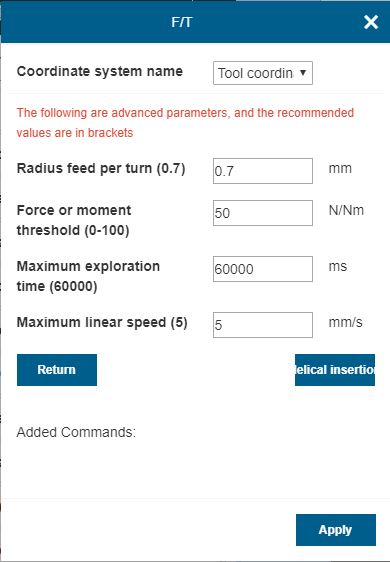

.. centered:: Figure 8.10-7 FT_Spiral Command Edit

Program example:

.. list-table:: 
   :widths: 15 40 100
   :header-rows: 1
   :align: center

   * - S/N
     - Instruction format
     - notes
   * - 1
     - FT_Control(1,10,0,0,1,0,0,0,0,0,5,0,0,0,0.0005,0,0,0,0,0,0,10,0)
     - #Force/torque motion control ON
   * - 2
     - FT_SpiralSearch(0,0.7,0,60000,5)
     - #Spiral insertion
   * - 3
     - FT_Control(0,10,0,0,1,0,0,0,0,0,5,0,0,0,0.0005,0,0,0,0,0,0,10,0)
     - #Force/torque motion control off 

Force/Torque Transducer Rotary Insertion
~~~~~~~~~~~~~~~~~~~~~~~~~~~~~~~~~~~~~~~~~~~~

Instruction description: The "FT_Rot" instruction is a rotation exploration insertion, which is generally used to undertake the helical insertion action, and is used for the shaft hole assembly of the key shaft. Before running the action, you need to move the end of the robot to the hole found by the helical exploration or the fully aligned teaching hole. According to the current scene, set the parameters of the command and add it to the program. After running, the robot will slowly Spin to explore.

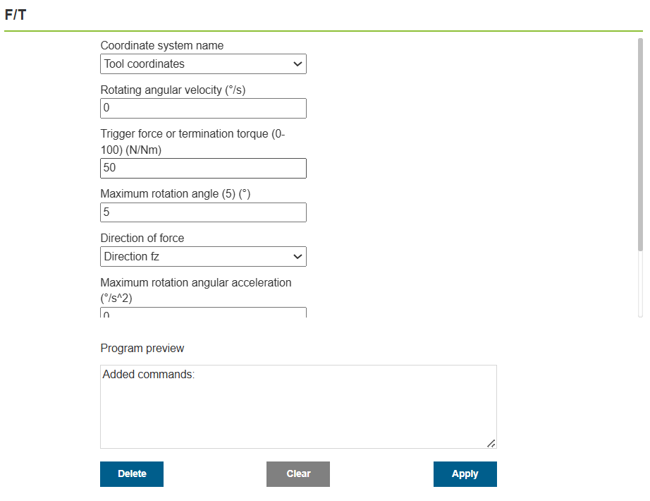

.. centered:: Figure 8.10-8 FT_Rot Command Edit

Program example:

.. list-table:: 
   :widths: 15 40 100
   :header-rows: 1
   :align: center

   * - S/N
     - Instruction format
     - notes
   * - 1
     - FT_Control(1,10,0,0,1,0,0,0,0,0,5,0,0,0,0.0005,0,0,0,0,0,0,10,0)
     - #Force/torque motion control ON
   * - 2
     - FT_RotInsertion(0,3,0,5,1,0,1)
     - #Rotate Insert
   * - 3
     - FT_Control(0,10,0,0,1,0,0,0,0,0,5,0,0,0,0.0005,0,0,0,0,0,0,10,0)
     - #Force/torque motion control off 

Force/Torque Transducer Straight Insertion
~~~~~~~~~~~~~~~~~~~~~~~~~~~~~~~~~~~~~~~~~~~~~

Instruction description: "FT_Lin" instruction is rotation exploration insertion, generally used to undertake helical insertion action or rotation insertion action, and is used for shaft hole assembly of key shaft. Before running the action, you need to move the end of the robot to the hole found by the helical exploration, rotate the end of the insertion action or the fully aligned teaching hole, set the parameters of the command according to the current scene, add it to the program, and run After that, the robot will move in a straight line in the set direction.

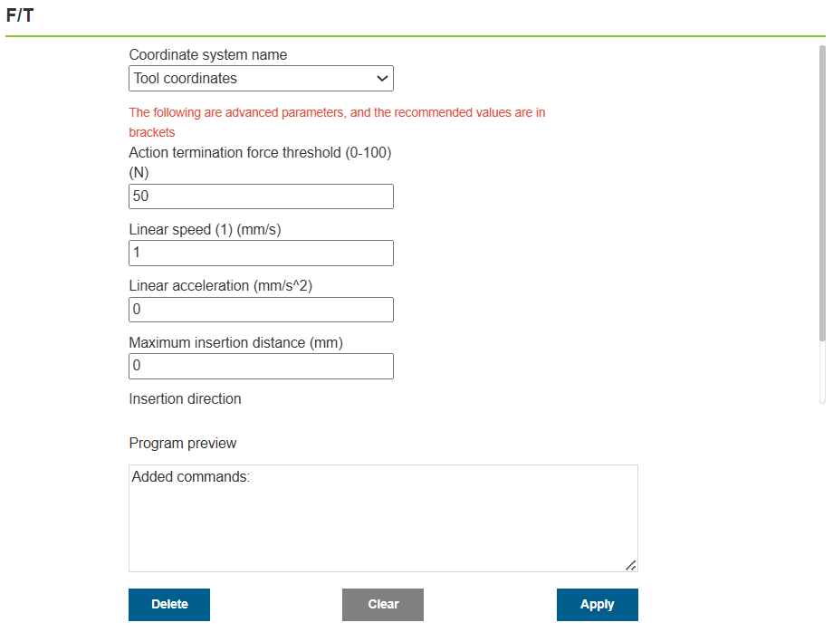

.. centered:: Figure 8.10-9 FT_Lin Command Edit

Program example:

.. list-table:: 
   :widths: 15 40 100
   :header-rows: 1
   :align: center

   * - S/N
     - Instruction format
     - notes
   * - 1
     - FT_Control(1,10,0,0,1,0,0,0,0,0,5,0,0,0,0.0005,0,0,0,0,0,0,10,0)
     - #Force/torque motion control ON
   * - 2
     - FT_LinInsertion(0,50,1,0,100,1)
     - #Line insertion
   * - 3
     - FT_Control(0,10,0,0,1,0,0,0,0,0,5,0,0,0,0.0005,0,0,0,0,0,0,10,0)
     - #Force/torque motion control off

Force/Torque Sensor Surface Orientation
~~~~~~~~~~~~~~~~~~~~~~~~~~~~~~~~~~~~~~~~~~

Instruction description: The "FT_FindSurface" instruction is for surface positioning, and is generally used to find the surface of an object. According to the current scene, set the corresponding coordinate system, moving direction, moving axis, exploring linear speed, exploring linear acceleration, maximum exploring distance, action termination force threshold and other parameters, add them to the program, run the program, the action starts to execute, and the end of the robot starts to slow down Move in the direction of the surface.

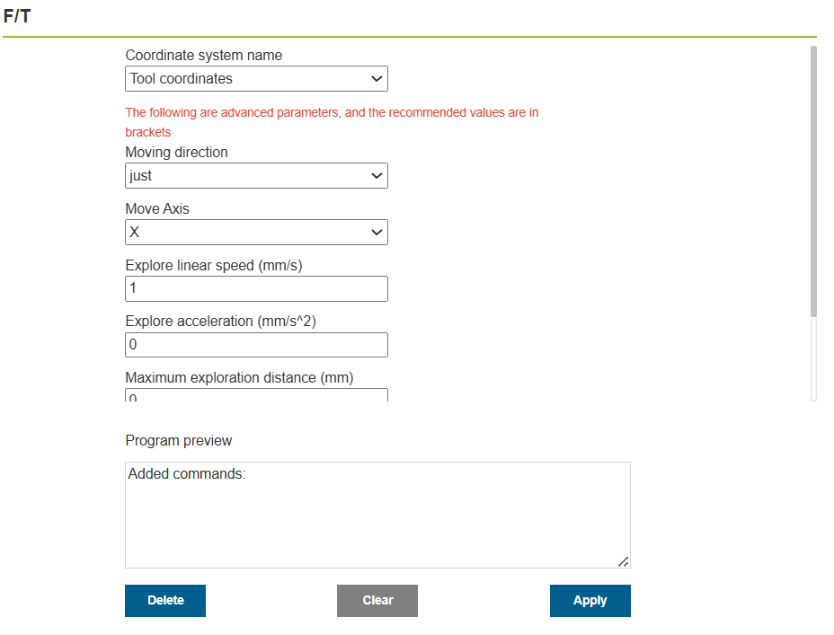

.. centered:: Figure 8.10-10 FT_FindSurface Command Edit

Program example:

.. list-table:: 
   :widths: 15 40 100
   :header-rows: 1
   :align: center

   * - S/N
     - Instruction format
     - notes
   * - 1
     - PTP(1,30,-1,0)
     - #Initial position
   * - 2
     - FT_FindSurface(0,1,3,1,0,100,5)
     - #Plane positioning

Force/Torque Transducer Centering
~~~~~~~~~~~~~~~~~~~~~~~~~~~~~~~~~~~

Instruction description: The "FT_CalCenter" instruction is for center positioning, and is generally used to find the middle plane surface of two surfaces. According to the current scene, set the corresponding coordinate system, moving direction, moving axis, exploring linear speed, exploring linear acceleration, maximum exploring distance, action termination force threshold and other parameters, find the A plane and B plane respectively, add them to the program, and run the program. The action starts to execute, and the robot slowly moves towards the direction of surface A. After positioning on surface A, the robot slowly moves towards the direction of surface B. After positioning on surface B, the position of the center plane can be calculated.

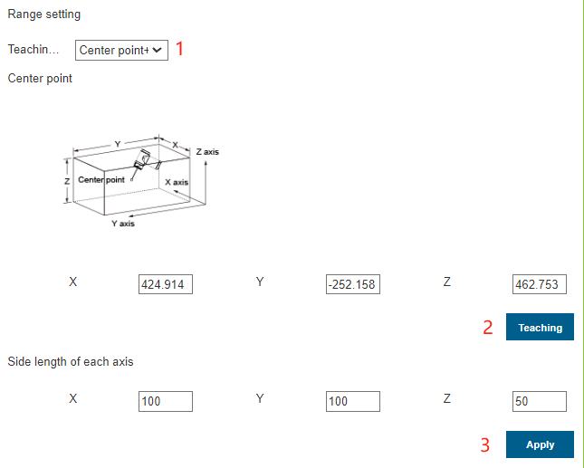

.. centered:: Figure 8.10-11 FT_CalCenter Command Edit

Program example:

.. list-table:: 
   :widths: 1 40 100
   :header-rows: 1
   :align: center

   * - S/N
     - Instruction format
     - notes
   * - 1
     - PTP(1,30,-1,0)
     - #Initial position
   * - 2
     - FT_CalCenterStart()
     - #Surface positioning start
   * - 3
     - FT_Control(1,10,0,0,1,0,0,0,0,0,-10,0,0,0,0.00001,0,0,0,0,0,0,100,0)
     - #Force/torque motion control ON
   * - 4
     - FT_FindSurface(1,2,2,10,0,200,5)
     - #Positioning plane A
   * - 5
     - FT_Control(0,10,0,0,1,0,0,0,0,0,-10,0,0,0,0.00001,0,0,0,0,0,0,100,0)
     - #Force/torque motion control off
   * - 6
     - PTP (1,30, - 1,0) -- initial position
     - #Initial position
   * - 7
     - FT_Control(1,10,0,0,1,0,0,0,0,0,-10,0,0,0,0.00001,0,0,0,0,0,0,100,0)
     - #Force/torque motion control ON
   * - 8
     - FT_FindSurface(1,1,2,20,0,200,5)
     - #Positioning plane B
   * - 9
     - FT_Control(0,10,0,0,1,0,0,0,0,0,-10,0,0,0,0.00001,0,0,0,0,0,0,100,0)
     - #Force/torque motion control off
   * - 10
     - pos = {}
     - #Acquire Cartesian pose of positioning center
   * - 11
     - pos = FT_CalCenterEnd()
     - #Acquire Cartesian pose of positioning center
   * - 12
     - MoveCart(pos,GetActualTCPNum(),GetActualWObjNum(),30,10,100,-1,0)
     - #Move to the center of positioning

Force/Torque Sensor Tap Force Detection
~~~~~~~~~~~~~~~~~~~~~~~~~~~~~~~~~~~~~~~~~

Instruction description: The "FT_Click" command is click force detection, which is used to detect a click force, and is usually used in conjunction with the surface positioning action. After setting the parameters, add it to the program, run the program, and the end starts to move toward the target along the Z direction of the tool coordinate system. When the force in the positive Z direction reaches the value of the click force, the click force detection is completed.

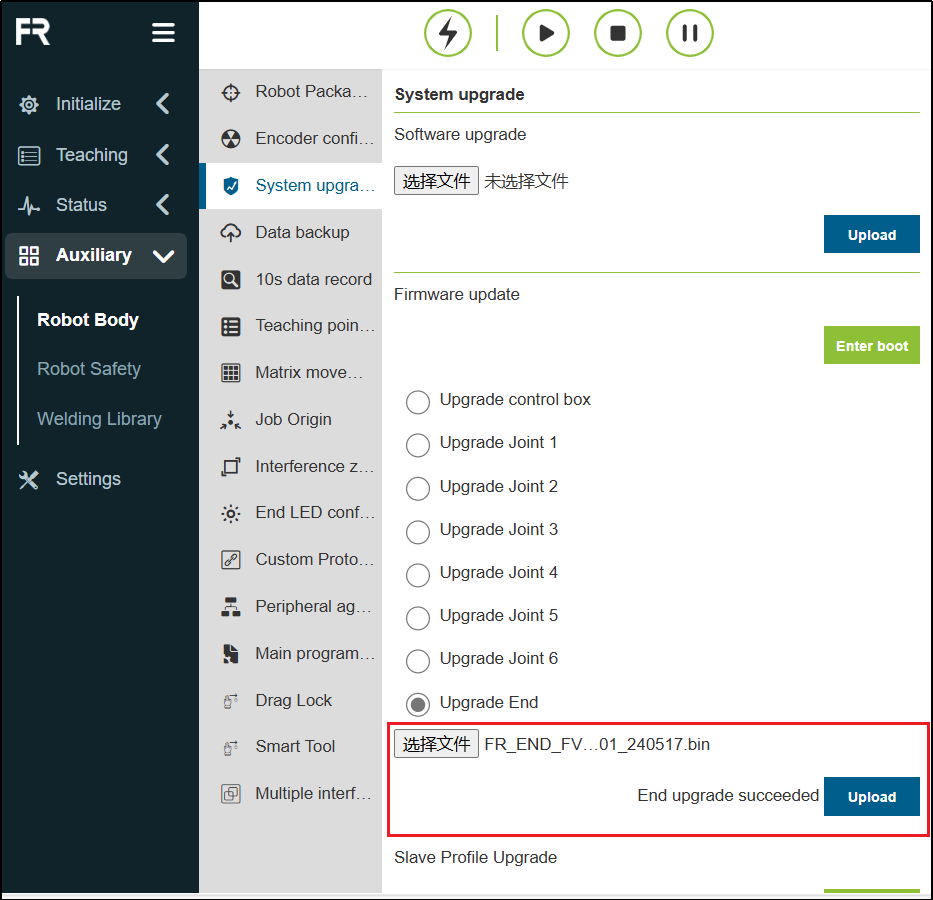

.. centered:: Figure 8.10-12 FT_Click Command Edit

Program example:

.. list-table:: 
   :widths: 15 40 100
   :header-rows: 1
   :align: center

   * - S/N
     - Instruction format
     - notes
   * - 1
     - PTP(1,30,-1,0)
     - #Initial position
   * - 2
     - FT_Click(0,5,5,0,100,0)
     - #Spot force detection

Extended IO device peripheral configuration
--------------------------------------------

Extended IO device configuration steps
~~~~~~~~~~~~~~~~~~~~~~~~~~~~~~~~~~~~~~~~~

**Step1**: In "Initial - Peripheral - End - tool", click the "Adapter device" menu item to enter the terminal peripheral configuration interface.

Select "Extended IO Device" for the device type. The configuration information of the extended IO device is divided into manufacturer, type, software version and mounting location. Users can select according to specific production needs. To configure the corresponding device information. If the user needs to change the configuration, he can first select the corresponding number, click the "Clear" button to clear the corresponding information, and reconfigure according to the needs;

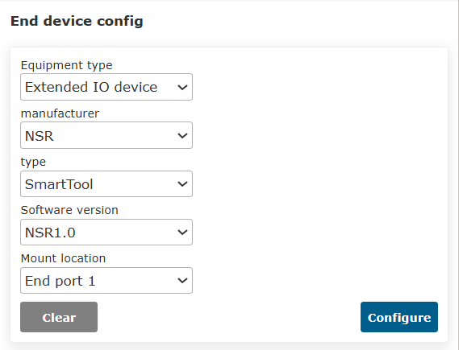

.. centered:: Figure 8.11-1 Extended IO device configuration

.. important:: 
	The corresponding device should be inactive before clicking Clear Configuration.

**Step2**: After the configuration of the extended IO device is completed, the user can click the "Smart Tool" function menu in the auxiliary application to enter the function configuration page, and the user can customize the functions of each button on the end handle, including (new program, hold program, PTP , Lin, ARC, start of weaving, end of weaving, IO port).

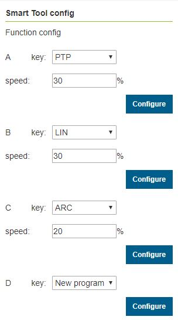

.. centered:: Figure 8.11-2 Extended IO device function configuration

Palletizing system configuration
---------------------------------------

Palletizing system configuration steps
~~~~~~~~~~~~~~~~~~~~~~~~~~~~~~~~~~~~~~~~

**Step1**: In "Initial - Peripheral", click the "Palletization" menu item to enter the palletizing system configuration interface.

For the first time use, you need to create a recipe first. Click "Create Recipe", enter the name of the recipe, click "Create", and click "Start Configuration" after the creation is successful. Enter the palletizing configuration page.

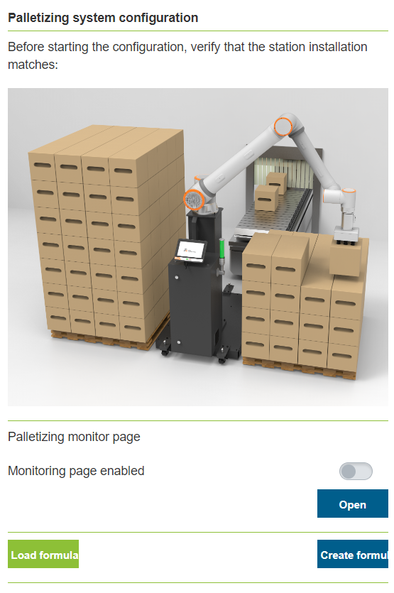

.. centered:: Figure 8.12-1 Palletizing recipe configuration

**Step2**:  Click "Configure" in the workpiece configuration bar to enter the workpiece configuration pop-up window, set the "length", "width", "height" of the workpiece and the grabbing point of the workpiece, click "confirm configuration" to complete the workpiece information setting.

.. centered:: Figure 8.12-2 Palletizing workpiece configuration

**Step3**: Click "Configure" in the tray configuration bar to enter the tray configuration pop-up window, set the tray "front", "side" and "height", then set the station and station transition point, click "confirm configuration" to complete the tray information setting.

.. figure:: robot_peripherals/151.png
   :align: center
   :width: 4in

.. centered:: Figure 8.12-3 Palletizing pallet configuration

**Step4**: Click "Configure" in the size configuration column of the palletizing equipment to enter the size configuration pop-up window. Set the devices "X", "Y", "Z", and "Angle", and click "Confirm Configuration" to complete the size configuration information setting of the palletizing equipment.

.. important:: 
   X, Y and Z are the absolute values of the upper right corner or upper left corner of the tray relative to the robot's coordinate system. Angle is the rotation angle of the robot during installation, and it is recommended to set it to 0 during installation.

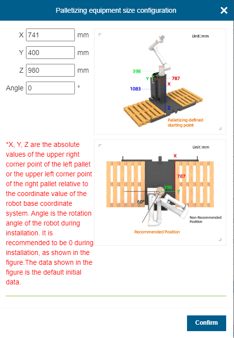

.. centered:: Figure 8.12-4 Size configuration of palletizing equipment

**Step5**: Click "Configure" in the pattern configuration column to enter the mode configuration pop-up window.

   **Pattern B on/off**: on: Can switch pattern A/B, Configure B mode of palletizing each layer mode; off: Mode B cannot be switched, and mode B of each layer mode of palletizing cannot be configured;

   **Pattern A/B switching**: Select mode A: Add the workpiece as mode A, and the workpiece serial numbers are A1, A2..., and the transparency of the workpiece cannot be adjusted; select mode B: Add the workpiece as mode B, and the workpiece serial numbers are B1, B2..., and you can turn on / Turn off the "Display Mode A Configuration" display mode A artifact;

   **Display pattern A on/off**: on: Adjust the transparency of the mode B artifacts to see whether the A/B mode configuration effect is reasonable. At this time, only the mode B artifacts can be selected, added, batch added, deleted and deleted; off: Unable to set mode B artifact transparency;

.. important:: 
   When configuring workpieces, if there is a collision between workpieces, the background color of the workpiece will turn red, and the above operations cannot be performed at this time. If you need to operate, please configure the workpiece to be collision-free.

When configuring workpieces, first set the workpiece interval. The frame on the right simulates the placement of workpieces on the right pallet. You can add them individually or in batches. Then set the number of palletizing layers and the mode of each layer, and click "Confirm Configuration" to complete the mode information setting.

.. important:: 
   Stacking direction: Taking the right pallet as an example, the lower right corner is the farthest point. From the lower right corner, a row of workpieces is placed vertically or horizontally, and then the workpieces are placed horizontally or vertically in the upper row, and so on (the web page has been marked Palletizing direction, please check carefully).
   
   The left pallet places workpieces mirroring the right pallet pattern.

.. figure:: robot_peripherals/153.png
   :align: center
   :width: 6in

.. centered:: Figure 8.12-5 Palletizing pattern A configuration

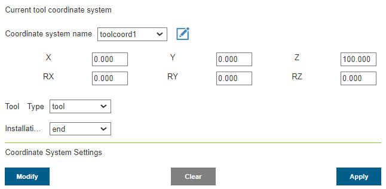

.. centered:: Figure 8.12-6 Palletizing pattern B configuration

**Step6**: Click "Advanced Configuration" in the teaching program generation column to enter the advanced configuration pop-up window. At this time, configure the "Material Lifting Height", "First Offset Distance", "Second Offset Distance" and "Suction Waiting Time".

   **Material Lifting Height**: The user defines the lifting height after the material is successfully retrieved from the grabbing point;

   **First/Second Offset Distance**: User-defined configuration of the offset distance for tilted stacking of the robot to the target point;
   
   **Suction Waiting Time**: The user can configure the waiting time for material suction, monitor the negative pressure arrival signal after suction, and repeat the suction action when it is not in place;

   **Smooth transition**: Turn on the smooth transition button to configure parameters related to palletizing/depalletizing PTP smoothing time and LIN smoothing radius.

   - PTP smoothing time: No smooth transition time/Level 1 (200ms)/Level 2 (400ms)/Level 3 (600ms)/Level 4 (800ms)/Level 5 (1000ms)

   - LIN smooth radius: No smooth transition radius/Level 1 (200mm)/Level 2 (400mm)/Level 3 (600mm)/Level 4 (800mm)/Level 5 (1000mm)

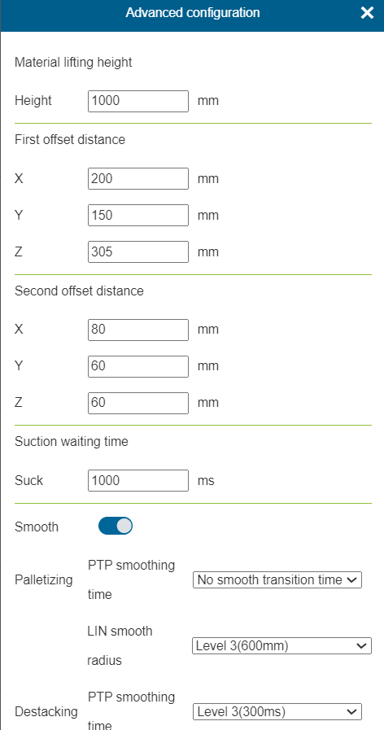

.. centered:: Figure 8.12-7 Advanced palletizing configuration

**Step7**: Click "Generate Program" to open the "Palletizing Monitoring Page", where you can display and view the "Generation Information", "Alarm Information" and "Palletizing Program".

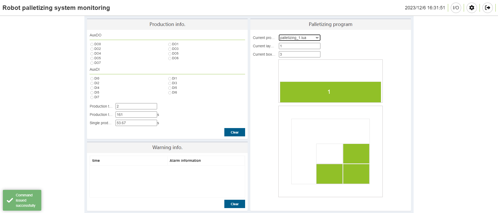

.. centered:: Figure 8.12-8 Palletizing system monitoring

**Step8**: After an error is reported in the middle of the palletizing running program, the program stops. After the user clears the error first, select the palletizing program to run again. At this time, the "Last Program Interruption" pop-up box will pop up. Click the "Continue" button to continue running, and click "Restart" button to restart the program.

.. figure:: robot_peripherals/157.png
   :align: center
   :width: 3in

.. centered:: Figure 8.12-9 Palletizing program continues

Polishing equipment configuration
------------------------------------

Polishing equipment configuration step
~~~~~~~~~~~~~~~~~~~~~~~~~~~~~~~~~~~~~~~~~~~~~~

**Step1**: Click the "Polishing" menu item under the "Initial - Peripheral" menu bar to enter the polishing equipment configuration page.

Configure the communication information, you need to configure the IP address, port, sampling period and communication protocol. After the configuration is successful, it will be automatically displayed next time.

**Step2**: After completing the communication configuration, the communication can be established by loading/unloading the grinding equipment.

**Step3**: Device functions. Operations such as device enabling, error clearing, and force sensor zeroing can be performed.

**Step4**: Parameter configuration. The rotation speed, contact force, reach distance and control mode of the polishing equipment can be set. After successful setting, the corresponding data and status can be displayed in the "Polish" status feedback column on the right.

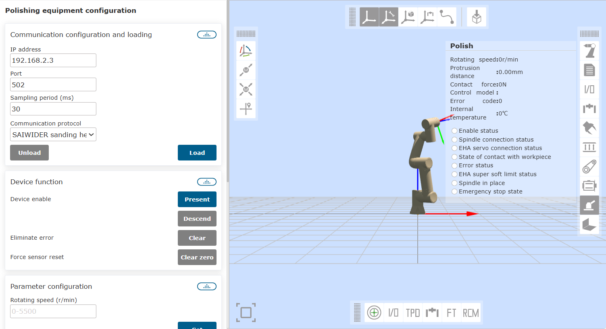

.. centered:: Figure 8.13-1 Polishing equipment configuration page

Virtual Wall Function Based on Force Sensor
-------------------------------------------------

Based on the virtual wall function of force sensor, the virtual wall can be set artificially to limit the workspace of the robot and avoid direct collision and contact.

Installation configuration of force sensor
~~~~~~~~~~~~~~~~~~~~~~~~~~~~~~~~~~~~~~~~~~~~~~~

**Step1**: Take "Kunwei" sensor as an example. During installation, the coordinate system direction of the force sensor should be consistent with the end flange coordinate system, as shown in Figure 1 (in Figure 1, red is the end flange coordinate system X+ direction, green is the end flange coordinate system Y+ direction, and blue is the end flange coordinate system Z+ direction);

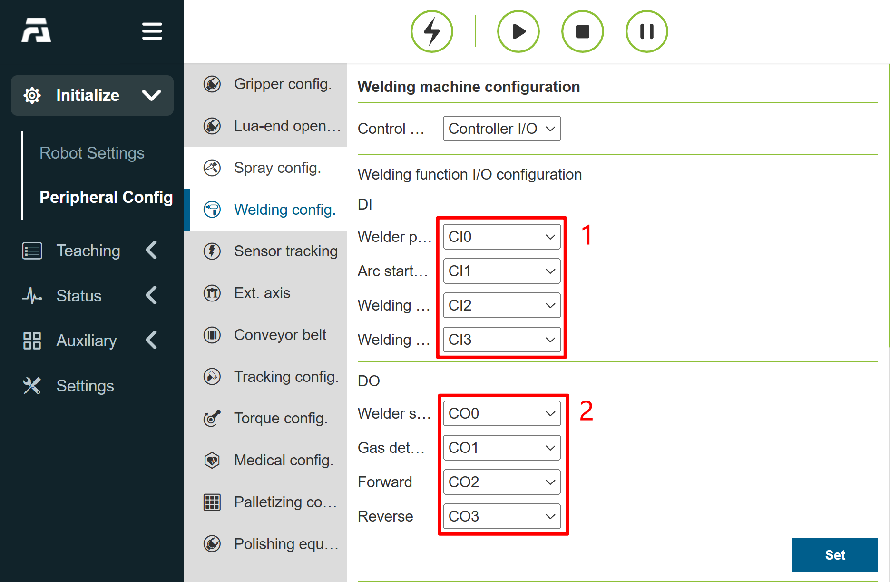

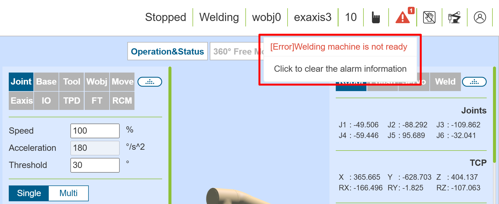

.. centered:: Figure 8.14-1 Installation of Force Sensor

**Step2**: In the menu bar of "Initial - Peripheral - End -tool", click "Adapter device" to enter the terminal peripheral configuration interface.

The equipment type is "Force Sensor Equipment", and the configuration information of force sensor is divided into manufacturer, type, software version and mounting location. Users can configure the corresponding force sensor information according to specific production requirements. If the user needs to change the configuration, he can first select the corresponding number and click the "Clear" button to clear the corresponding information and reconfigure according to the requirements; The specific operation is shown in Figure 2.

**Step3**: Select the number of the configured force sensor and click the "Reset" button. After the page pop-up command is successfully sent, click the "Activate" button to check the activation status in the force sensor information table to judge whether the activation is successful. In addition, the force sensor will have an initial value, and the user can choose "zero point correction" and "zero point removal" according to the use requirements. The zero correction of force sensor needs to ensure that the force sensor is horizontal and vertical, and the robot is not equipped with load.

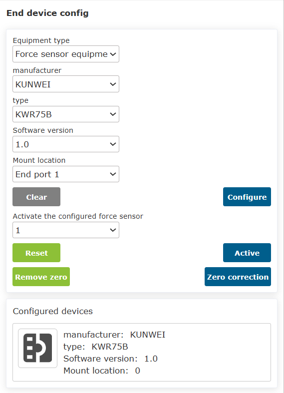

.. centered:: Figure 8.14-2 Force sensor configuration

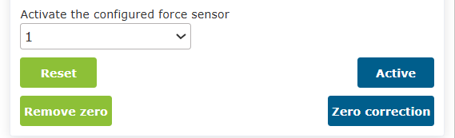

.. centered:: Figure 8.14-3 Force sensor activation

Virtual wall configuration
~~~~~~~~~~~~~~~~~~~~~~~~~~~~~~
With the help of the force sensor, it is necessary to install a drag handle under the force sensor and configure the tool coordinate system. The specific operation is shown in Figure 4. At this time, the way to detect the interference zone is based on the set tool coordinate system position, and the end flange is used as the reference when it is not set.

**Step1**: In the menu bar of "Application - Tool App - Interference area", click "Single" to enter the interference area configuration function interface;

**Step2**: The interference mode and the operation of entering the interference zone need to be configured; The interference mode is "cube interference", and the drag configuration when entering the interference area is "unrestricted drag", and the motion configuration when entering the interference area can be used;

**Step3**: According to the requirements, the parameter configuration can be modified. The detection method can be divided into "command position" and "feedback position", the interference zone mode can be divided into "in-range interference" and "out-of-range interference", the reference coordinate system is selected as "base coordinate", and the setting is selected according to the actual use. The detailed operation is shown in Figure 5.

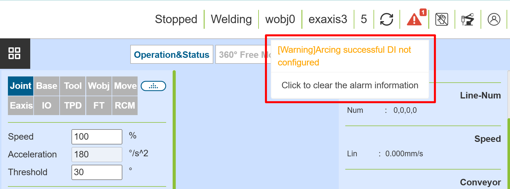

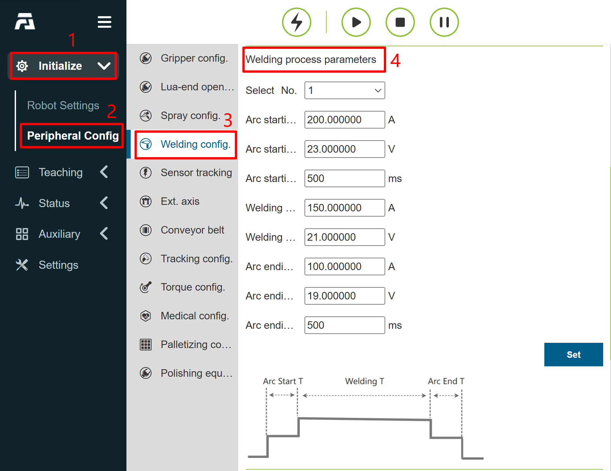

.. centered:: Figure 8.14-4 Install the drag handle and set the tool coordinate system

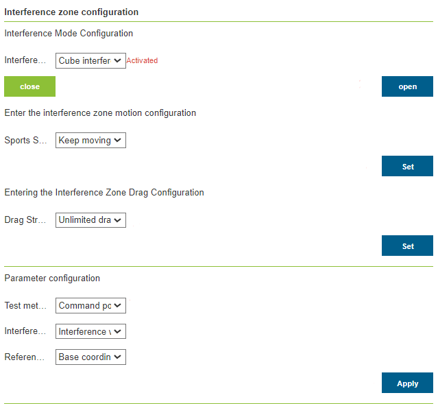

.. centered:: Figure 8.14-5 Parameter Configuration of Virtual Wall

**Step4**: The interference zone modes under parameter configuration are divided into "in-range interference" and "out-of-range interference";

.. figure:: robot_peripherals/166.png
   :align: center
   :width: 4in

.. centered:: Figure 8.14-6 In-range interference

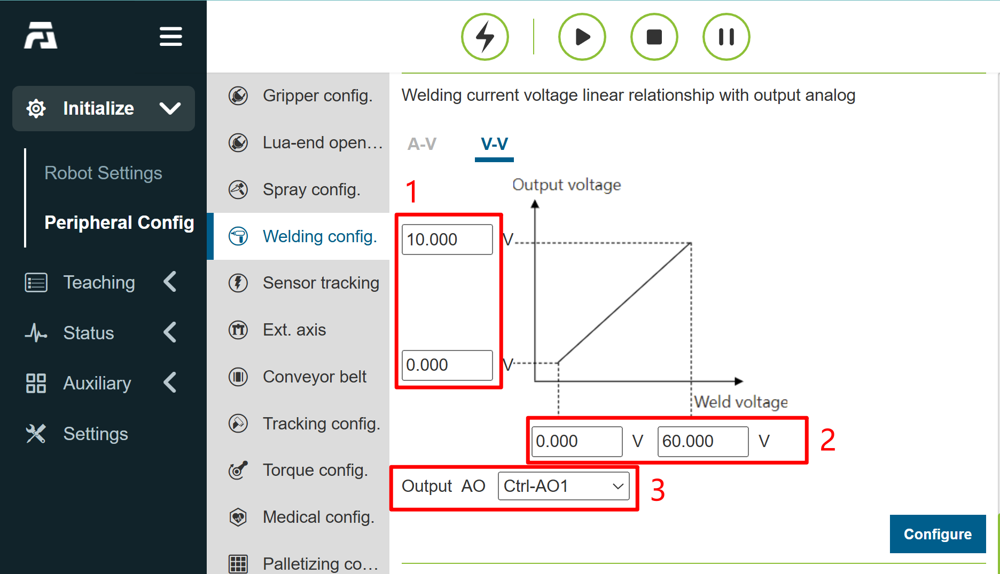

.. centered:: Figure 8.14-7 Out of range interference

**Step5**: Establish the interference zone, as shown in Figures 7 and 8. It is suggested that the interference area should be set as large as possible when selecting "out-of-range interference".

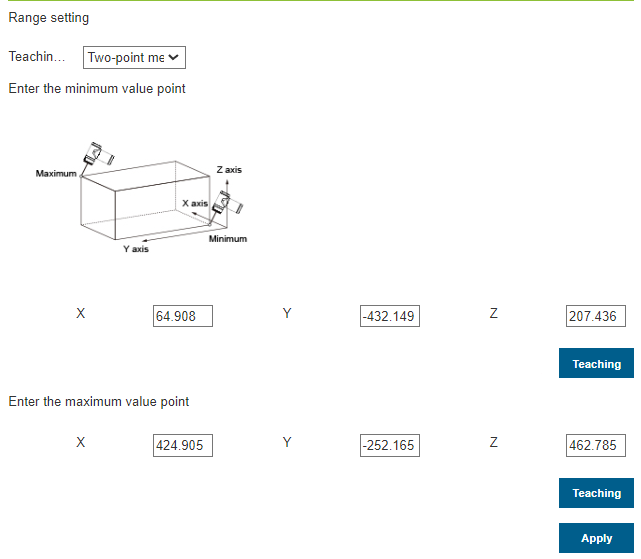

.. centered:: Figure 8.14-8 Two-point method to establish interference zone

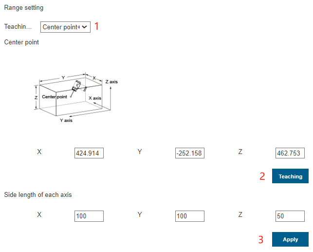

.. centered:: Figure 8.14-9 center point+side length method to establish interference zone

Force sensor assisted drag
~~~~~~~~~~~~~~~~~~~~~~~~~~~~

**Step1**: In the menu bar of "Application - Tool App", click "Drag locking" to enter the drag lock function interface.

**Step2**: Set the parameters as shown in Figure 9 to realize the virtual wall function based on the force sensor. The concrete effects are as follows: near the virtual wall, the resistance becomes larger; Away from the virtual wall, the auxiliary drag function based on the force sensor is normal.

.. figure:: robot_peripherals/138.png
   :align: center
   :width: 4in

.. centered:: Figure 8.14-10 Parameter setting of auxiliary drag of force sensor

Specific function of parameters:

**Adaptive selection**: Turn it on when assembly is required. After turning it on, dragging becomes heavier;

**Inertia Parameter**: Adjust the feel during dragging. It needs to be operated with caution under the guidance of technical personnel.

**Damping parameters**:

-  Translation direction: It is recommended to set the parameter between [100-200];

-  Rotation direction: It is recommended to set the parameters between [3-10], among which the RZ direction setting range is [0.1-5];

-  Effect: When dragging with the help of a sensor, increasing the damping will make it difficult to drag, and reducing the damping will make it too easy to drag the robot (it is recommended not to be too small);

-  The overall range of damping parameters: translation XYZ: [100-1000]; rotation RX, RY: [3-50], RZ: [2-10];

-  The maximum drag force is 50 and the maximum drag speed is 180.

**Stiffness parameter**: All are set to 0;

**Drag force threshold**: Translation XYZ is [5-10]; rotation RX, RY, RZ is [0.5-5];

**Maximum Drag force**: 50;

**Maximum Drag speed**: 180;

Six -dimensional force and joint impedance hybrid drag
~~~~~~~~~~~~~~~~~~~~~~~~~~~~~~~~~~~~~~~~~~~~~~~~~~~~~~~~~~

Summary
+++++++++++

Six -dimensional force and joint impedance mixed drag function are to perceive the external force by the help of sensors. The robot is auxiliary drag in the drag mode. It can obtain a different drag experience by adjusting the gain coefficient. The joint impedance is limited to the drag force with impedance control.

Installation configuration and zero calibration operation of force sensor
++++++++++++++++++++++++++++++++++++++++++++++++++++++++++++++++++++++++++++

1. Installation configuration of force sensor

The detailed operation of the force sensor installation configuration is shown above: Virtual wall configuration based on force sensor.

2. Zero calibration of force sensor

In order to drag the robot conveniently, it is necessary to install a drag handle under the sensor, as shown in Figure 1.

.. centered:: Figure 8.14-11 Drag the handle

**Step1**: According to the length of the actual handle, set the tool coordinate system, as shown in Figure 2.

**Step2**: In the "Initial - Base - Payload" menu bar, click "FT payload" to enter the force/torque sensor load interface.

Use the dragging button to adjust the level of the robot's end level, click the "Record Initial Location" button in the "Sensor Automatic School Zero" column of the "Power/Torque Sensor Load" interface. Then, switch the robot mode as an automatic mode, click the "Automatic School Zero" button. After the program is running, it is to complete the sensor school zero work.  The detailed operation is shown in Figure 3.

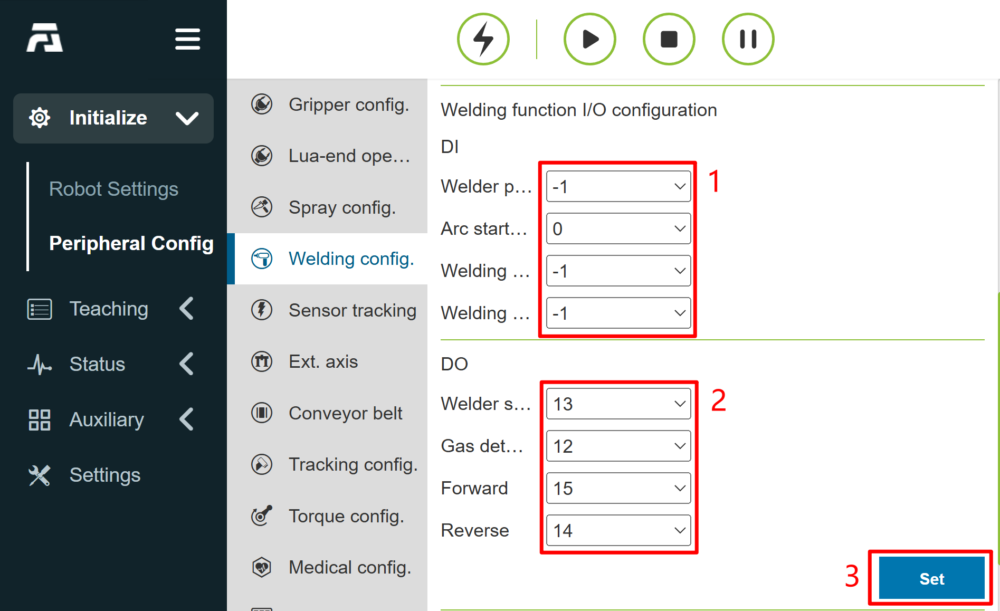

.. centered:: Figure 8.14-12 Tool coordinate system setting

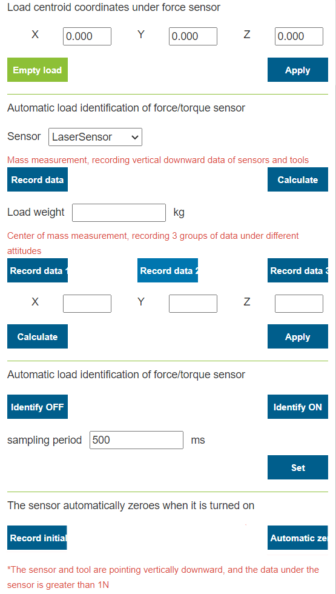

.. centered:: Figure 8.14-13 Automatic zero calibration of force/torque sensor

Six -dimensional force and joint impedance hybrid drag
++++++++++++++++++++++++++++++++++++++++++++++++++++++++++

1. Auxiliary drag

**Step1**: In the menu bar of "Application - Tool App", click "Drag locking" to enter the drag lock function interface.

**Step2**: In the column of "Six dimensions and joint impedance mixed drag", set the control status to "open", the impedance opening state is "closed", set the drag gain, the end line speed is 1000mm/s, the angle speed The limit is 100 °/s, and then click the "Apply" button to enable the function. The specific configuration is shown in Figure 4.

**Step3**: Switch the robot mode to drag mode to drag the robot. The specific effect is: drag the end of the robot, the drag is easy, and the experience is good; drag the robot joint and drag weight.

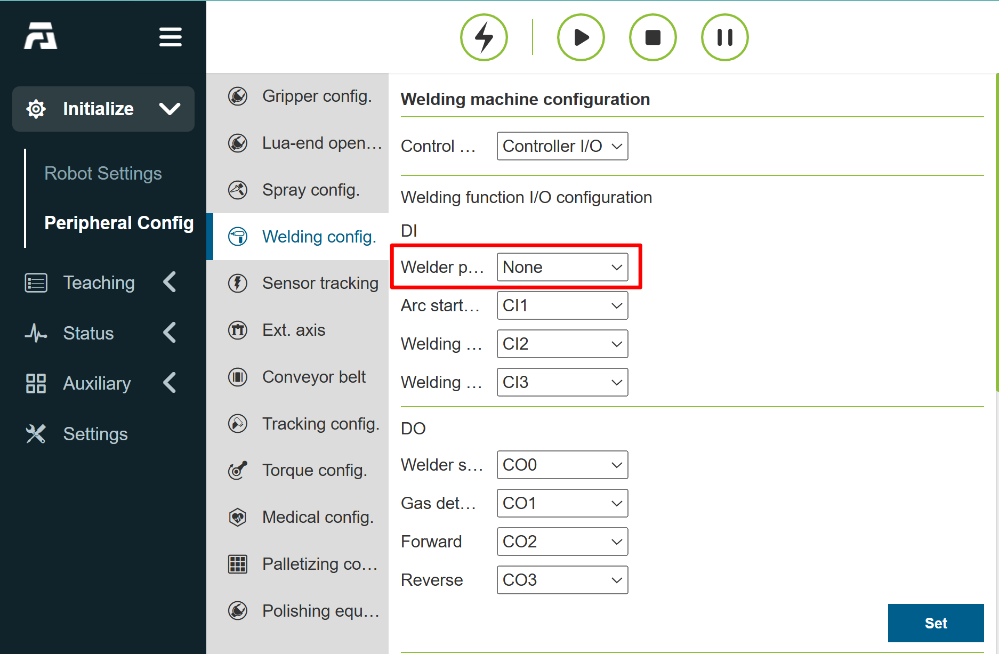

.. centered:: Figure 8.14-14 configuration parameters of six dimensions assisted drag

2. joint impedance control

The role of impedance control is to limit the drag power and drag position, and its default state is "closed".

The specific operation is shown in Figure 5. The setting status of the setting impedance is "open", and then sets the damping coefficient and stiffness coefficient according to Figure 5. Among them, the function of the rigidity coefficient has not yet been opened.

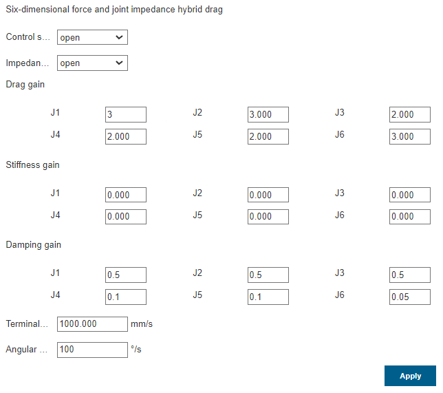

.. centered:: Figure 8.14-15 Configuration parameters of joint impedance

Specific function of parameters:

- **Control status**: After opening, this function can be used in the drag mode.

- **Impedance control opening**: After opening, you need to configure stiffness parameters and damping parameters. The role is to limit the drag power and drag position.

- **Drag gain**: The parameter is recommended between [0-5]. The parameter is set to 0, and the robot cannot be dragged. The parameter is set to 1, and the drag effect has not improved. The parameters are greater than 1, dragged lightly, and the drag experience is good. The larger the parameters, the easier it is to drag.

- **Stiffness gain**: set to 0, and its role is to return to the initial position before dragging after dragging.

- **Damping gain**: The role is to limit the drag power. The range of 1-3 joint parameters is [0-0.5], and the range of 4-5 joint parameters is [0-0.1]; 6-joint parameter range is [0-0.05].

- **Ending speed**: 1000mm/s, when the speed limit of the end line speed, the robot switching mode to the manual mode, and the TCP speed is

- **Angle speed limit**: 100 °/s, when the angle speed is limited, the robot switching mode to the manual mode, and prompt TCP speeding.
