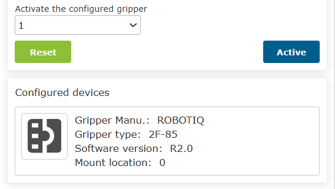
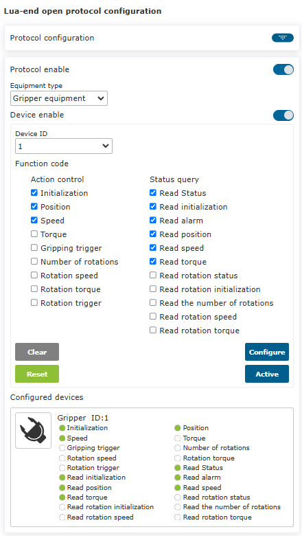
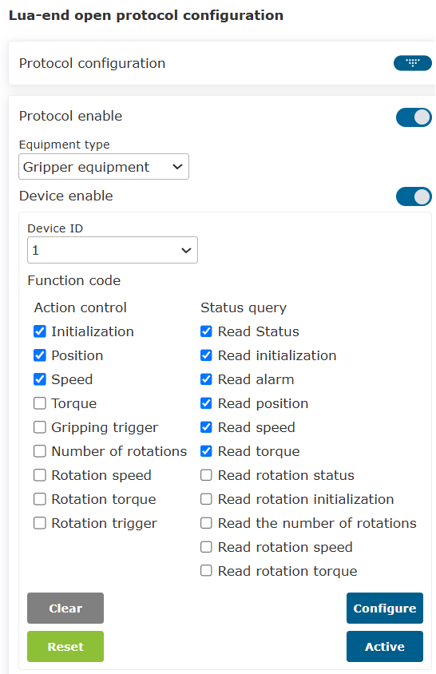
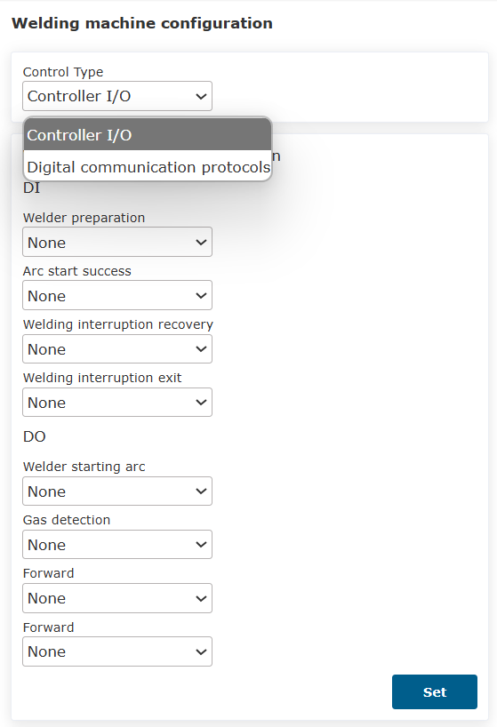
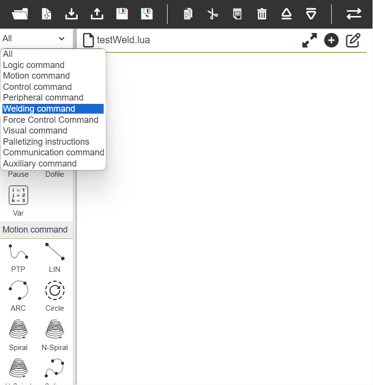
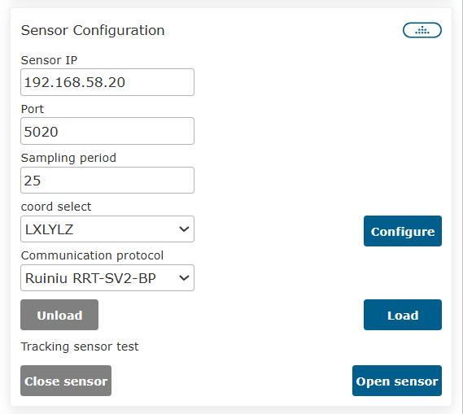

Peripheral
=============

.. toctree:: 
  :maxdepth: 5

Gripper Peripheral Configuration
------------------------------------

Gripper program teaching steps
~~~~~~~~~~~~~~~~~~~~~~~~~~~~~~~~~~~~

**Step1**：Select the "End Peripheral Configuration" button in the user peripheral configuration interface, and select "Gripper Device" for the device type. The configuration information of the gripper is divided into gripper manufacturer, gripper type, software version and mounting location. Specific production requirements to configure the corresponding jaw information. If the user needs to change the configuration, first select the corresponding gripper number, click the "Clear" button to clear the corresponding button, and reconfigure according to the needs;

.. figure:: robot_peripherals/001.png
   :align: center
   :width: 3in

.. centered:: Figure 5.1-1 Gripper Jaw Configuration

.. important:: 
	The corresponding gripper should be inactive before clicking Clear Configuration.

**Step2**：After the gripper configuration is completed, the user can view the corresponding gripper information in the gripper information table at the bottom of the page. If configuration errors are found, click the "Reset" button to reconfigure the grippers;

.. centered:: Figure 5.1-2 Gripper configuration information

**Step3**：Select the configured gripper and click the "Reset" button. After the page pops up and the command is successfully sent, click the "Activate" button to check the activation status in the gripper information table to determine whether the activation is successful;

.. important::
	When the gripper is activated, the gripper must not have a gripping object

**Step4**：Select the "Gripper" command in the program teaching command interface. In the gripper command interface, the user can select the number of the gripper to be controlled (the gripper that has been configured and activated), and set the corresponding opening and closing state, opening and closing speed, and the maximum opening and closing torque that have been waiting for the gripper to move. time. After completing the settings, click Add Application. Additionally, gripper activation and reset commands can be added to deactivate/reset the gripper while running a program.

.. figure:: robot_peripherals/003.png
   :align: center
   :width: 3in

.. centered:: Figure 5.1-3 Gripper Command Edit

Gripper program teaching
~~~~~~~~~~~~~~~~~~~~~~~~~~~~

.. list-table:: 
   :widths: 15 40 100
   :header-rows: 1

   * - S/N
     - Instruction format
     - notes
   * - 1
     - PTP(template2,100,-1,0)
     - #Waiting for pinch point
   * - 2
     - PTP(template1,100,-1,0)
     - #Pinch point
   * - 3
     - MoveGripper(1,255,255,0,1000,0)
     - #Clamping jaws closed
   * - 4
     - PTP(template2,100, -1,0)
     - /
   * - 5
     - PTP(template3,100, -1,0)
     - #Waiting for placement point
   * - 6
     - PTP(template3,100, -1,0)
     - #Placement point
   * - 7
     - MoveGripper(1,0,255,0,1000,0)
     - #Clamping jaws open

Spray gun peripheral configuration
-------------------------------------

Spray gun peripheral configuration steps
~~~~~~~~~~~~~~~~~~~~~~~~~~~~~~~~~~~~~~~~~~~

**Step1**：Select the "Spray Gun Configuration" button in the user peripheral configuration interface, and the user can quickly configure the DO required for spraying through the one-key configuration button of the spraying function (the default configuration DO10 is spraying start and stop, and DO11 is spraying cleaning gun). Users can also customize DO according to their own needs in the "IO Configuration" interface;

.. important:: 
	Before using the spraying function, it is necessary to establish the corresponding tool coordinate system first, and apply the established tool coordinate system during program teaching.

**Step2**：After the configuration is complete, click the four buttons "Start Spraying", "Stop Spraying", "Start Cleaning the Gun" and "Stop Cleaning the Gun" to debug the spray gun;

.. figure:: robot_peripherals/005.png
   :align: center
   :width: 3in

.. centered:: Figure 5.2-1 Gun Configuration

**Step3**：Select the "spray" command on the program teaching command interface. According to the specific program teaching requirements, add and apply four commands "start spraying", "stop spraying", "start cleaning the gun" and "stop cleaning the gun" in the corresponding places.

.. centered:: Figure 5.2-2 Spray Gun Command Editing

Spray program teaching
~~~~~~~~~~~~~~~~~~~~~~~~~

.. list-table:: 
   :widths: 15 40 100
   :header-rows: 1

   * - S/N
     - Instruction format
     - notes
   * - 1
     - Lin(template1,100,-1,0,0)
     - #Start spraying point
   * - 2
     - SprayStart()
     - #Start painting
   * - 3
     - Lin(template2,100,-1,0,0)
     - #Spray path
   * - 4
     - Lin(template3,100,-1,0,0)
     - #Stop spraying point
   * - 5
     - SprayStop()
     - #Stop spraying
   * - 6
     - Lin(template4,100,-1,0,0)
     - #Gun cleaning point
   * - 7
     - PowerCleanStart()
     - #Start to clean the gun
   * - 8
     - WaitTime(5000)
     - #Cleaning time ms
   * - 9
     - PowerCleanStop()
     - #Stop gun cleaning

Peripheral configuration of welding machine
---------------------------------------------

Peripheral configuration of welding machine
~~~~~~~~~~~~~~~~~~~~~~~~~~~~~~~~~~~~~~~~~~~~~

**Step1**：In the user peripherals configuration interface, select the "welding machine configuration" button, and users can configure the IO buttons of the welding machine by selecting the IO type and "Controller I/O" to quickly configure the DI and DO required by the welding machine (the default configuration is DI12 for arc start success signal, DO9 for gas supply signal, and DO10 for gas supply signal). Arc signal, DO11 jog wire feeding, DO12 reverse wire feeding, DO13 JOB selection 1, DO14 JOB selection 2, DO15 JOB selection 3). Users can also customize the configuration in the "IO Configuration" interface according to their own needs; or select "Extended I/O", configure the "Welder preparation" and "Arc start success" of the extended DI, and the "Welder starting arc", "Gas detection", "Forward" and "Reverse" of the DO Send wire;

.. centered:: Figure 5.3-1 I/O configuration(Controller I/O)

.. centered:: Figure 5.3-2 I/O configuration(Extended I/O)

.. important:: 
	Before using the welding machine function, it is necessary to establish the corresponding tool coordinate system first, and apply the established tool coordinate system during program teaching. The welder function is often used in conjunction with a laser tracking sensor.

**Step2**：After the configuration is complete, select the number, set the waiting time, and click the six buttons of "arc end", "arc start", "gas", "gas off", "forward wire feed" and "reverse wire feed" to proceed welding machine debugging;

.. centered:: Figure 5.3-3 Welding machine configuration

**Step3**：Select the "Weld" command on the program teaching command interface. According to the specific program teaching requirements, add and apply the "End arc", "Arc", "Gas OFF", "Gas ON", "Stop forward", "Forward", "Stop reverse" and "Reverse" instructions in the corresponding places.

.. figure:: robot_peripherals/009.png
   :align: center
   :width: 3in

.. centered:: Figure 5.3-4 Welding Machine Command Editing

Welding program teaching
~~~~~~~~~~~~~~~~~~~~~~~~~~~~

.. list-table:: 
   :widths: 15 40 100
   :header-rows: 1

   * - S/N
     - Instruction format
     - notes
   
   * - 1
     - ARCEnd(0,0,10000)
     - End arc

   * - 2
     - ARCStart(0,0,10000)
     - Arc

   * - 3
     - SetAspirated(0,0)
     - Gas OFF

   * - 4
     - SetAspirated(0,1)
     - Gas ON

   * - 5
     - SetForwardWireFeed(0,0)
     - Stop forward

   * - 6
     - SetForwardWireFeed(0,1)
     - Forward

   * - 7
     - SetReverseWireFeed(0,0)
     - Stop reverse

   * - 8
     - SetReverseWireFeed(0,1)
     - Reverse

Arc interruption parameter configuration
~~~~~~~~~~~~~~~~~~~~~~~~~~~~~~~~~~~~~~~~~~
Arc interruption parameter configuration can obtain and set arc interruption detection enable and confirmation duration.

Welding interruption and resumption parameter configuration can obtain and set the welding interruption and reconnection enable, the weld bead overlap distance, the speed of returning to the arc starting point from the current position, and the operating mode.

.. figure:: robot_peripherals/062.png
   :align: center
   :width: 3in

.. centered:: Figure 5.3-5 Arc interruption parameter configuration

When a welding interruption occurs, a warning prompts that the current welding has been interrupted, and "exit interruption" and "interruption recovery" operations can be performed.

Sensor Peripheral Configuration
---------------------------------

Sensor Peripheral Configuration Steps
~~~~~~~~~~~~~~~~~~~~~~~~~~~~~~~~~~~~~~~~~

**Step1**：Select the "Sensor Configuration" button in the user peripheral configuration interface. This section takes the end of the robot as an example. The user first sets the maximum difference. The maximum difference of the sensor scanning deviation points is recommended to be set to 4 by default. Data processing is based on actual use. The scene selects raw data or YZ data. The controller IP defaults to 192.168.57.2, the sensor IP can be configured on the same network segment, the port is 5020, and the sampling period is recommended to be 25. The communication protocol is currently adapted to the Ruiniu communication protocol, just load the corresponding protocol. After the loading is complete, the sensor can be tested by pressing the "Sensor On" and "Sensor Off" buttons.

.. centered:: Figure 5.4-1 Laser tracking sensor IP configuration

.. important:: 
	1. Before using the sensor function, it is necessary to establish the corresponding tool coordinate system first, and apply the established tool coordinate system during program teaching. The welder function is usually used with sensors.
	2. The maximum difference of the sensor is the maximum deviation between the laser scanning weld position at the previous moment and the current moment, the range is [0~10], the unit is mm, and the recommended value is 4.

**Step2**：Calibration sensor reference point.

In the tool coordinate system setting function, we calibrate the sensor type tool and use the six-point method to configure the sensor coordinate system. Select a fixed point in the robot workspace, move the sensor center point to the selected point from three different angles, and set points 1, 2, and 3 respectively. Move the sensor center point vertically directly above the selected point and record point 4. Move the sensor center point from a fixed point to a point in the X-axis direction of the sensor coordinate system, and set point 5. Return to the fixed point, move vertically upwards, and move the sensor center point from the fixed point to a point in the Z-axis direction of the sensor coordinate system, and set it as point 6. Click Calculate to get the pose of the sensor tool, and click Apply to complete.

.. centered:: Figure 5.4-2 Reference Point Configuration - Six Point Method

**Eight point method**：In the tool coordinate system setting function, we calibrate the sensor type tool, use the eight-point method to configure the sensor coordinate system, select the eight-point method, move the sensor laser line to coincide with the calibration line on the calibration board, and keep the sensor and the calibration line as close as possible Closer distance and the calibration point is recognized, record point 1, move about 20mm in the -y/+y direction, adjust the robot so that the laser recognizes the calibration point, record point 2, move about 20mm in the -x/+x direction, and adjust the robot so that the laser Recognize the calibration point, record point 3, move about 20mm in the -y/+y direction, adjust the robot so that the laser recognizes the calibration point, record point 4, move about 5mm in the -rx direction, adjust the robot so that the laser recognizes the calibration point, and record the point 5. Move about 5mm in the -ry direction, adjust the robot so that the laser recognizes the calibration point, record point 6, move about 5mm in the -rz direction, adjust the robot so that the sensor recognizes the calibration point, record point 7, move about 5mm in the -rz direction, and adjust the robot so that Laser recognition to the calibration point, record point 8. Click Calculate to get the sensor pose, click Apply to complete.

.. figure:: robot_peripherals/013.png
   :align: center
   :width: 3in

.. centered:: Figure 5.4-3 Reference Point Configuration - Eight Points Method

**Five point method**：In the tool coordinate system setting function, we calibrate the sensor type tool and use the five-point method to configure the sensor coordinate system. First, determine a fixed point, align the end of the tool with this point, record point 1, and then adjust the posture of the robot so that the laser recognizes Record fixed points, respectively record points 2 to 5, and note that the attitude change needs to be as large as possible. Click Calculate to get the sensor pose, click Apply to complete.

.. figure:: robot_peripherals/014.png
   :align: center
   :width: 3in

.. centered:: Figure 5.4-4 Reference Point Configuration - Five Points Method

Laser sensor tracking function
~~~~~~~~~~~~~~~~~~~~~~~~~~~~~~~

Command description: Select the "Laser" command on the program teaching command interface. It integrates laser-related instructions. According to the specific program teaching requirements, add instructions in the corresponding places. Refer to the program example below.

.. figure:: robot_peripherals/015.png
   :align: center
   :width: 3in

.. centered:: Figure 5.4-5 Laser Tracking Command Editing

program example：

.. list-table:: 
   :widths: 15 40 100
   :header-rows: 1

   * - S/N
     - Instruction format
     - notes
   * - 1
     - LTLaserOn(2)
     - #Turn on the sensor
   * - 2
     - PTP(template1,100,-1,0)
     - #Sensor starting point
   * - 3
     - LTSearchStart(1,20,100,10000,2)
     - #Start searching
   * - 4
     - LTSearchStop()
     - #Stop searching
   * - 5
     - Lin(seamPos,20,-1,0,0,0)
     - #Start of weld
   * - 6
     - LTTrackOn(2)
     - #Laser tracking
   * - 7
     - ARCStart(0,10000)
     - #Arc striking of welder
   * - 8
     - Lin(SeamEnd11,10-1,0,0)
     - #End of weld
   * - 9
     - ARCEnd(0,10000)
     - #Arc extinguishing of welder
   * - 10
     - LTTrackOff()
     - #Sensor tracking off
   * - 11
     - LTLaserOff()
     - #Turn off the sensor

Laser sensor trajectory reproduction function
~~~~~~~~~~~~~~~~~~~~~~~~~~~~~~~~~~~~~~~~~~~~~~~~~~~
Command description: Select the "LT-Rec" command on the program teaching command interface. This instruction is mainly used for obtaining the starting point and end point of the laser recognition path and reappearing the trajectory. According to the specific program teaching requirements, add instructions in the corresponding places. Refer to the program example below.

.. figure:: robot_peripherals/017.png
   :align: center
   :width: 3in

.. centered:: Figure 5.4-6 Editing of track reappearance command

Program example:

.. list-table:: 
   :widths: 15 40 100
   :header-rows: 1

   * - S/N
     - Instruction format
     - notes
   * - 1
     - PTP(template1,100,-1,0)
     - #Move to starting point
   * - 2
     - LaserSensorRecord(2,0,30)
     - #Sensor start recording
   * - 3
     - Lin(template2,100,-1,0,0)
     - #Move to the end
   * - 4
     - LaserSensorRecord(0,0,30)
     - #Stop recording
   * - 5
     - pos={}
     - #Initialize array
   * - 6
     - pos=GetWeldTrackingRecordStartPos(0,30)
     - #Start point for obtaining laser record
   * - 7
     - If type(pos) == “table” then
     - #Judge data type
   * - 8
     - LaserPTP(#pos,pos)
     - #Move to the starting point of the laser track
   * - 9
     - end
     - /
   * - 10
     - LaserSensorRecord(3,0,30)
     - #Set Recurrence Track
   * - 11
     - MoveLTR()
     - #Start reproducing track
   * - 12
     - LaserSensorRecord(0,0,30)
     - #End

Extended Axis Peripheral Configuration
-----------------------------------------

Select the "Extended Axis" button in the user peripheral configuration interface to enter the extended axis interface, and select the combination method to configure the corresponding extended axis peripherals. Combination methods are divided into: Controller + PLC (UDP) and Controller + Servo drive (485).

Controller + PLC（UDP）
~~~~~~~~~~~~~~~~~~~~~~~~~~

Configuration steps
++++++++++++++++++++++++

**Step1**：First configure the expansion axis UDP communication. Set the IP address, port number and communication cycle.

.. centered:: Figure 5.5-1 Extended axis communication configuration

**Step2**：Select the extended axis number 1, and click the "Parameter Configuration" button to enter the right interface. Set the axis type, axis direction, running speed, acceleration, forward limit, reverse limit, lead, encoder resolution, starting point offset, manufacturer, model and mode, and click Configure to complete the configuration.

.. figure:: robot_peripherals/019.png
   :align: center
   :width: 3in

.. centered:: Figure 5.5-2 Extended axis parameter configuration
	
.. important:: 
	Before using the extended axis function, it is necessary to establish the corresponding extended axis coordinate system, and apply the established tool coordinate system during program teaching. The extended axis function is mainly used in conjunction with the welder function and the laser tracking sensor function.

**Step3**：Click the "Zero Setting" button to enter the zero setting pop-up window, as shown in the picture on the right. Set the zero return method, zero search speed, zero hoop speed and axis direction, click the "Setting" button, the extended axis will start to return to zero, the zero return status will be displayed in the blank space below the axis direction, when "zero return completed" appears The prompt indicates that the zero point of the extension axis is set successfully.

.. centered:: Figure 5.5-3 Extended axis zero point setting

**Step4**：Select the number of the extended axis whose parameters have been configured, click "Servo Enable", set the running speed, acceleration and the maximum distance of a single run, and test the extended axis for forward rotation and reverse rotation.

.. centered:: Figure 5.5-4 Extended Axis Test

**Step5**：The extension axis is usually used in conjunction with the laser sensor. At this time, the laser sensor is usually installed externally. The sensor reference point configuration needs to be calibrated by the three-point method instead of the six-point method used before. Align the center of the tool with the middle point of the bottom of the right cross-section (the side close to the camera), set point 1, align the center of the tool with the middle point of the bottom of the other cross-section, which is the middle point of the left cross-section, set point 2, and set the center of the tool with Move the point to the middle point of the upper edge of the cross-section on the right side of the sensor, set point 3, calculate and save, and click Apply to complete the three-point calibration.

.. centered:: Figure 5.5-5 Three-point sensor calibration

**Step6**：Select the "EAxis" command on the program teaching command interface. According to the specific program teaching requirements, add instructions in the corresponding places.

.. centered:: Figure 5.5-6 Extended axis command editing

Controller + Servo drive (485)
~~~~~~~~~~~~~~~~~~~~~~~~~~~~~~~~~~~~~~

**Step1**: First configure the parameters of the servo drive. Set the servo drive serial number, servo drive manufacturer, servo drive model, servo drive software version, encoder resolution and mechanical transmission ratio. Click the "Clear" button to clear the configuration of the current servo drive number. After successful configuration, obtain the servo drive configuration list data.

.. centered:: Figure 5.5-7 Configure servo drive parameters

**Step2**: Before debugging the servo drive, be sure to set the servo drive number first, and then set the control mode after the setting is successful. Set the homing method, homing speed and zero hoop speed. When selecting "Position Mode", set "Target Position" and "Running Speed"; select "Speed Mode" to set "Target Speed".

.. important::
  Before setting the control mode, if the servo is enabled, please disable it first, otherwise the setting will not take effect.

.. centered:: Figure 5.5-8 Servo drive debugging

**Step3**: Select the "Extended Axis" command on the program teaching command interface. According to the specific program teaching needs, add instructions in the corresponding places.

.. centered:: Figure 5.5-9 Extended Axis InstructionEdit

Extended axis with laser tracking welding teaching program
~~~~~~~~~~~~~~~~~~~~~~~~~~~~~~~~~~~~~~~~~~~~~~~~~~~~~~~~~~~~

.. list-table:: 
   :widths: 15 40 100
   :header-rows: 1

   * - S/N
     - Instruction format
     - notes
   * - 1
     - EXT_AXIS_PTP(1,1,laserstart)
     - #External axis movement laser sensor starting point
   * - 2
     - PTP(laserstart,10,-1,0)
     - #Starting point of robot motion laser sensor
   * - 3
     - LTSearchStart(3,20,10,10000)
     - #Start searching
   * - 4
     - LTSearchStop()
     - #Stop searching
   * - 5
     - EXT_AXIS_PTP(1,1,seamPos)
     - #Start point of external axis movement weld
   * - 6
     - Lin(seamPos,20,-1,0,0,0)
     - #Start point of robot moving weld
   * - 7
     - LTTrackOn()
     - #Laser tracking
   * - 8
     - ARCStart(0,10000)
     - #Arc striking of welder
   * - 9
     - EXT_AXIS_PTP(1,1,laserend)
     - #End point of external axis movement weld
   * - 10
     - Lin( laserend,10,-1,0,0)
     - #End point of robot moving weld
   * - 11
     - ARCEnd(0,10000)
     - #Arc extinguishing of welder
   * - 12
     - LTTrackOff
     - #Laser tracking off

Conveyor Tracking Configuration
-----------------------------------

Conveyor Tracking Configuration Steps
~~~~~~~~~~~~~~~~~~~~~~~~~~~~~~~~~~~~~~~~~

**Step1**：Select the "Conveyor Belt Tracking" button in the user peripheral configuration interface to enter the conveyor belt tracking configuration interface, click the "Configure Conveyor Belt IO" button to quickly configure the IO required for the conveyor belt function, and then configure the corresponding parameters according to the actual use of the function. Here, there is no visual Take the tracking and grabbing function as an example, you need to configure the conveyor belt encoder channel, resolution, lead, visual matching, select No, and click Configure.

.. figure:: robot_peripherals/025.png
   :align: center
   :width: 3in

.. centered:: Figure 5.6-1 Conveyor configuration

**Step2**：Next, set the grab point compensation value, which is the compensation distance in the three directions of X, Y, and Z, which can be set according to the actual situation during the debugging process.

.. figure:: robot_peripherals/026.png
   :align: center
   :width: 3in

.. centered:: Figure 5.6-2 Conveyor Grab Point Compensation Configuration

**Step3**：Turn on the conveyor belt, move the calibrated object to the defined point A, and stop the conveyor belt. Move the robot, align the sharp point of the calibration rod at the end of the robot with the sharp point of the object to be calibrated, click the start point A button, a dialog box will pop up, displaying the current encoder value and robot pose, and click Calibrate to complete the start point A calibration.

.. figure:: robot_peripherals/027.png
   :align: center
   :width: 3in

.. centered:: Figure 5.6-3 Starting Point A Configuration

**Step4**：Click the reference point button to enter the reference point calibration. When recording the reference point, record the height and attitude of the robot when it is grasping. Every time it tracks, it will track and grasp with the height and attitude area of the recorded reference point. It can be different from the AB point. Click Calibrate to complete the reference point calibration.

.. figure:: robot_peripherals/028.png
   :align: center
   :width: 3in

.. centered:: Figure 5.6-4 Reference point configuration

**Step5**：Turn on the conveyor belt, move the calibrated object to the defined point B, and stop the conveyor belt. Move the robot, align the sharp point of the calibration rod at the end of the robot with the sharp point of the object to be calibrated, click the end point B button, a dialog box will pop up, displaying the current encoder value and robot pose, click the calibration to complete the end point B calibration.

.. centered:: Figure 5.6-5 Terminal B configuration

Conveyor belt tracking teaching program
~~~~~~~~~~~~~~~~~~~~~~~~~~~~~~~~~~~~~~~~

.. list-table:: 
   :widths: 15 40 100
   :header-rows: 1

   * - S/N
     - Instruction format
     - notes
   * - 1
     - PTP(conveyorstart,30,-1,0)
     - #Robot grabbing starting point
   * - 2
     - While(1) do
     - #Loop Grab
   * - 3
     - ConveyorIODetect(10000)
     - #IO real-time detection of objects
   * - 4
     - ConveyorGetTrackData(1)
     - #Object position acquisition
   * - 5
     - ConveyorTrackStart(1)
     - #Conveyor tracking start
   * - 6
     - Lin(cvrCatchPoint,10,-1,0,0)
     - #Robot reaches the grab point
   * - 7
     - MoveGripper(1,255,255,0,10000)
     - #Gripper claw grabs objects
   * - 8
     - Lin(cvrRaisePoint,10,-1,0,0)
     - #Robot lifting
   * - 9
     - ConveyorTrackEnd()
     - #End of belt tracking
   * - 10
     - PTP(conveyorraise,30,-1,0)
     - #Robot arrives at holding point
   * - 11
     - PTP(conveyorend,30,-1,0)
     - #Robot reaches the placement point
   * - 12
     - MoveGripper(1,0,255,0,10000)
     - #Gripper release
   * - 13
     - PTP(conveyorstart,50,-1,0)
     - #The robot returns to the starting point again and waits for the next capture
   * - 14
     - end
     - #End
  
Attitude Adaptive Configuration
----------------------------------

Attitude adaptive configuration steps
~~~~~~~~~~~~~~~~~~~~~~~~~~~~~~~~~~~~~~~~~

**Step1**：Select the "Tracking attitude configuration" button in the user peripherals configuration interface to enter the attitude adjustment configuration interface, select the plate type and the actual working direction of the robot, adjust the robot attitude, and set the attitude point A, attitude point B and attitude point C respectively, usually A is the attitude point of the plane, B is the attitude point of the rising edge, and C is the attitude point of the falling edge.

.. figure:: robot_peripherals/031.png
   :align: center
   :width: 3in

.. centered:: Figure 5.7-1 Attitude Adjustment Configuration

.. important:: 
	The attitude change between A posture and B posture, A posture and C posture is as small as possible under the condition that the application requirements are met. The posture adaptive function is an auxiliary application function, usually used in conjunction with seam tracking.

**Step2**：Select the "Adjust" command on the program teaching command interface. According to the specific program teaching requirements, add instructions in the corresponding places.

.. figure:: robot_peripherals/032.png
   :align: center
   :width: 3in

.. centered:: Figure 5.7-2 Attitude Adjustment Command Edit

Attitude self-adaptive with extended axis and laser tracking welding teaching program
~~~~~~~~~~~~~~~~~~~~~~~~~~~~~~~~~~~~~~~~~~~~~~~~~~~~~~~~~~~~~~~~~~~~~~~~~~~~~~~~~~~~~~~~~~~

.. list-table:: 
   :widths: 15 40 100
   :header-rows: 1

   * - S/N
     - Instruction format
     - notes
   * - 1
     - EXT_AXIS_PTP(1,1,laserstart)
     - #External axis movement laser sensor starting point
   * - 2
     - PTP(laserstart,10,-1,0)
     - #Starting point of robot motion laser sensor
   * - 3
     - LTSearchStart(3,20,10,10000)
     - #Start searching
   * - 4
     - LTSearchStop()
     - #Stop searching
   * - 5
     - EXT_AXIS_PTP(1,1,seamPos)
     - #Start point of external axis movement weld
   * - 6
     - Lin(seamPos,20,-1,0,0,0)
     - #Start point of robot moving weld
   * - 7
     - LTTrackOn()
     - #Laser tracking
   * - 8
     - ARCStart(0,10000)
     - #Arc striking of welder
   * - 9
     - PostureAdjustOn(0,PosA,PosC,PosB,1000)
     - #Attitude adaptive adjustment on
   * - 10
     - EXT_AXIS_PTP(1,1,laserend)
     - #End point of external axis movement weld
   * - 11
     - Lin( laserend,10,-1,0,0)
     - #End point of robot moving weld
   * - 12
     - ARCEnd(0,10000)
     - #Arc extinguishing of welder
   * - 13
     - PostureAdjustOff(0)
     - #Attitude adaptive adjustment off
   * - 14
     - LTTrackOff
     - #Laser tracking off

Force/Torque Sensor Peripheral Configuration
-----------------------------------------------

Force/Torque Sensor Configuration Steps
~~~~~~~~~~~~~~~~~~~~~~~~~~~~~~~~~~~~~~~~~~

**Step1**：Select the "End Peripheral Configuration" button in the user peripheral configuration interface, and select "Force Sensor Device" for the device type. The force sensor configuration information is divided into manufacturer, type, software version and mounting location. Configure the corresponding force sensor information. If the user needs to change the configuration, he can first select the corresponding number, click the "Clear" button to clear the corresponding information, and reconfigure according to the needs;

.. figure:: robot_peripherals/034.png
   :align: center
   :width: 3in

.. centered:: Figure 5.8-1 Force/Torque Sensor Configuration

.. important:: 
	The corresponding sensor should be inactive before clicking Clear Configuration.

**Step2**：After the configuration of the force sensor is completed, the user can view the corresponding force sensor information in the information table at the bottom of the page. If a configuration error is found, the user can click the "Reset" button to reconfigure.

.. centered:: Figure 5.8-2 Force/Torque Sensor Configuration Information

**Step3**：Select the configured force sensor number and click the "Reset" button. After the page pops up and the command is sent successfully, click the "Activate" button to check the activation status in the force sensor information table to determine whether the activation is successful; in addition, the force sensor will There is an initial value, and the user can select "zero point correction" and "zero point removal" according to the usage requirements. The force sensor zero point correction needs to ensure that the force sensor is horizontal and vertical, and the robot is not equipped with a load.

**Step4**：After the configuration of the force sensor is completed, the sensor type tool coordinate system needs to be configured, and the value of the sensor tool coordinate system can be directly input and applied according to the distance between the sensor and the center of the end tool.

Force/Torque Sensor Load Identification
~~~~~~~~~~~~~~~~~~~~~~~~~~~~~~~~~~~~~~~~

Select "Force/Torque Sensor Load" in the robot configuration interface to configure.

Specific attitude recognition: clear the end load data, configure the force sensor, establish the sensor coordinate system, adjust the end attitude of the robot to be vertically downward, perform "zero point correction" and install the end load. First, select the corresponding sensor tool coordinate system, adjust the robot so that the sensor and tool are vertically downward, record data, and calculate the quality. Next, adjust the three different postures of the robot, record three sets of data respectively, calculate the center of mass, and click Apply after confirming that it is correct.

**Dynamic identification**：After clearing the end load data and configuring the force sensor, establish the sensor coordinate system, adjust the end posture of the robot to be vertically downward, perform "zero point correction" and install the end load. Click "Identification On", drag the robot to move, and then click "Identification Off", the load result can be automatically applied to the robot.

.. figure:: robot_peripherals/036.png
   :align: center
   :width: 3in

.. centered:: Figure 5.8-4 Force/Torque Sensor Load Identification

Force/Torque Sensor Assisted Drag
~~~~~~~~~~~~~~~~~~~~~~~~~~~~~~~~~~~

After the sensor is configured, it can be used with the sensor to better assist the dragging robot. When using it for the first time, you can configure it according to the data in the picture on the right. After the application is completed, you don’t need to enter the drag mode at this time, and you can directly drag the end force sensor to control the robot to move in a fixed posture. (The data in the figure below is a reference standard.)

.. centered:: Figure 5.8-4 Force/Torque Sensor Drag Lock

**Adaptive selection**: Turn it on when assembly is required. After turning it on, dragging becomes heavier;

**Damping parameters**:

-  Translation direction: It is recommended to set the parameter between [100-200];

-  Rotation direction: It is recommended to set the parameters between [3-10], among which the RZ direction setting range is [0.1-5];

-  Effect: When dragging with the help of a sensor, increasing the damping will make it difficult to drag, and reducing the damping will make it too easy to drag the robot (it is recommended not to be too small);

-  The overall range of damping parameters: translation XYZ: [100-1000]; rotation RX, RY: [3-50], RZ: [2-10];

-  The maximum drag force is 50 and the maximum drag speed is 180.

**Stiffness parameter**: All are set to 0;

**Drag force threshold**: Translation XYZ is [5-10]; rotation RX, RY, RZ is [0.5-5];

.. important:: 
  Locking is achieved by increasing the force threshold in the translation direction XYZ or rotation direction RX, RY, RZ.

Force/Torque Sensor Collision Detection
~~~~~~~~~~~~~~~~~~~~~~~~~~~~~~~~~~~~~~~~~~

Command description: "FT_Guard" command is a collision detection command. Select the corresponding sensor coordinate system, check the effective torque direction detection, set the current value, the maximum collision threshold and the minimum collision threshold. The normal range of the collision detection condition is (current value-minimum threshold, current value+maximum threshold), set "Open" and "Close" commands are added to the program.

.. figure:: robot_peripherals/038.png
   :align: center
   :width: 3in

.. centered:: Figure 5.8-5 FT_Guard Command Edit

Program example:

.. list-table:: 
   :widths: 15 15 70
   :header-rows: 1

   * - S/N
     - Instruction format
     - notes
   * - 1
     - FT_Guard(1,1,1,1,1,0,0,0,5,0,0,0,0,0,10,0,0,0,0,0,5,0,0,0,0,0)
     - #Force/moment collision detection on                                  
   * - 2
     - PTP(template1,100,-1,0)
     - #Motion command
   * - 3
     - FT_Guard(0,1,1,1,1,0,0,0,5,0,0,0,0,0,10,0,0,0,0,0,5,0,0,0,0,0)
     - #Force/moment collision detection off

Force/Torque Sensor Force Control Motion
~~~~~~~~~~~~~~~~~~~~~~~~~~~~~~~~~~~~~~~~~

Instruction description: The "FT_Control" instruction is a force control motion instruction, which can make the robot move near the set force, and is often used in grinding scenes. Select the corresponding sensor coordinate system, check the effective torque direction detection, set the detection threshold, and the PID proportional coefficient in each direction (generally set p to 0.001), set the maximum adjustment distance (corresponding to X, Y, Z) and maximum adjustment angle (corresponding to RX, RY, RZ), add the "open" and "close" instructions to the program.

.. figure:: robot_peripherals/040.png
   :align: center
   :width: 3in

.. centered:: Figure 5.8-6 FT_Control Command Edit

Program example:

.. list-table:: 
   :widths: 15 40 100
   :header-rows: 1

   * - S/N
     - Instruction format
     - notes
   * - 1
     - FT_Control(1,11,1,0,1,0,0,0,10,0,5,0,0,0,0.001,0,0,0,0,0,0,0,0,10,5)
     - #Force/torque motion control ON
   * - 2
     - Lin(template3,100,-1,0,0)
     - #Motion command
   * - 3
     - FT_Control(0,11,1,0,1,0,0,0,10,0,5,0,0,0,0.001,0,0,0,0,0,0,0,10,5)
     - #Force/torque motion control off 

Force/Torque Transducer Screw Insertion
~~~~~~~~~~~~~~~~~~~~~~~~~~~~~~~~~~~~~~~~~~~~

Instruction description: The "FT_Spiral" instruction is a spiral line exploration and insertion, which is generally used for the shaft hole assembly action of a cylindrical shaft. Before running the action, you need to drag the end of the robot to the approximate position of the hole. According to the current scene, set the parameters of the command and add it to the program. After running, the robot will explore in a spiral motion.

.. centered:: Figure 5.8-7 FT_Spiral Command Edit

Program example:

.. list-table:: 
   :widths: 15 40 100
   :header-rows: 1

   * - S/N
     - Instruction format
     - notes
   * - 1
     - FT_Control(1,10,0,0,1,0,0,0,0,0,5,0,0,0,0.0005,0,0,0,0,0,0,10,0)
     - #Force/torque motion control ON
   * - 2
     - FT_SpiralSearch(0,0.7,0,60000,5)
     - #Spiral insertion
   * - 3
     - FT_Control(0,10,0,0,1,0,0,0,0,0,5,0,0,0,0.0005,0,0,0,0,0,0,10,0)
     - #Force/torque motion control off 

Force/Torque Transducer Rotary Insertion
~~~~~~~~~~~~~~~~~~~~~~~~~~~~~~~~~~~~~~~~~~~~

Instruction description: The "FT_Rot" instruction is a rotation exploration insertion, which is generally used to undertake the helical insertion action, and is used for the shaft hole assembly of the key shaft. Before running the action, you need to move the end of the robot to the hole found by the helical exploration or the fully aligned teaching hole. According to the current scene, set the parameters of the command and add it to the program. After running, the robot will slowly Spin to explore.

.. figure:: robot_peripherals/044.png
   :align: center
   :width: 3in

.. centered:: Figure 5.8-8 FT_Rot Command Edit

Program example:

.. list-table:: 
   :widths: 15 40 100
   :header-rows: 1

   * - S/N
     - Instruction format
     - notes
   * - 1
     - FT_Control(1,10,0,0,1,0,0,0,0,0,5,0,0,0,0.0005,0,0,0,0,0,0,10,0)
     - #Force/torque motion control ON
   * - 2
     - FT_RotInsertion(0,3,0,5,1,0,1)
     - #Rotate Insert
   * - 3
     - FT_Control(0,10,0,0,1,0,0,0,0,0,5,0,0,0,0.0005,0,0,0,0,0,0,10,0)
     - #Force/torque motion control off 

Force/Torque Transducer Straight Insertion
~~~~~~~~~~~~~~~~~~~~~~~~~~~~~~~~~~~~~~~~~~~~~

Instruction description: "FT_Lin" instruction is rotation exploration insertion, generally used to undertake helical insertion action or rotation insertion action, and is used for shaft hole assembly of key shaft. Before running the action, you need to move the end of the robot to the hole found by the helical exploration, rotate the end of the insertion action or the fully aligned teaching hole, set the parameters of the command according to the current scene, add it to the program, and run After that, the robot will move in a straight line in the set direction.

.. figure:: robot_peripherals/046.png
   :align: center
   :width: 3in

.. centered:: Figure 5.8-9 FT_Lin Command Edit

Program example:

.. list-table:: 
   :widths: 15 40 100
   :header-rows: 1

   * - S/N
     - Instruction format
     - notes
   * - 1
     - FT_Control(1,10,0,0,1,0,0,0,0,0,5,0,0,0,0.0005,0,0,0,0,0,0,10,0)
     - #Force/torque motion control ON
   * - 2
     - FT_LinInsertion(0,50,1,0,100,1)
     - #Line insertion
   * - 3
     - FT_Control(0,10,0,0,1,0,0,0,0,0,5,0,0,0,0.0005,0,0,0,0,0,0,10,0)
     - #Force/torque motion control off

Force/Torque Sensor Surface Orientation
~~~~~~~~~~~~~~~~~~~~~~~~~~~~~~~~~~~~~~~~~~

Instruction description: The "FT_FindSurface" instruction is for surface positioning, and is generally used to find the surface of an object. According to the current scene, set the corresponding coordinate system, moving direction, moving axis, exploring linear speed, exploring linear acceleration, maximum exploring distance, action termination force threshold and other parameters, add them to the program, run the program, the action starts to execute, and the end of the robot starts to slow down Move in the direction of the surface.

.. figure:: robot_peripherals/048.png
   :align: center
   :width: 3in

.. centered:: Figure 5.8-10 FT_FindSurface Command Edit

Program example:

.. list-table:: 
   :widths: 15 40 100
   :header-rows: 1

   * - S/N
     - Instruction format
     - notes
   * - 1
     - PTP(1,30,-1,0)
     - #Initial position
   * - 2
     - FT_FindSurface(0,1,3,1,0,100,5)
     - #Plane positioning

Force/Torque Transducer Centering
~~~~~~~~~~~~~~~~~~~~~~~~~~~~~~~~~~~

Instruction description: The "FT_CalCenter" instruction is for center positioning, and is generally used to find the middle plane surface of two surfaces. According to the current scene, set the corresponding coordinate system, moving direction, moving axis, exploring linear speed, exploring linear acceleration, maximum exploring distance, action termination force threshold and other parameters, find the A plane and B plane respectively, add them to the program, and run the program. The action starts to execute, and the robot slowly moves towards the direction of surface A. After positioning on surface A, the robot slowly moves towards the direction of surface B. After positioning on surface B, the position of the center plane can be calculated.

.. centered:: Figure 5.8-11 FT_CalCenter Command Edit

Program example:

.. list-table:: 
   :widths: 1 40 100
   :header-rows: 1

   * - S/N
     - Instruction format
     - notes
   * - 1
     - PTP(1,30,-1,0)
     - #Initial position
   * - 2
     - FT_CalCenterStart()
     - #Surface positioning start
   * - 3
     - FT_Control(1,10,0,0,1,0,0,0,0,0,-10,0,0,0,0.00001,0,0,0,0,0,0,100,0)
     - #Force/torque motion control ON
   * - 4
     - FT_FindSurface(1,2,2,10,0,200,5)
     - #Positioning plane A
   * - 5
     - FT_Control(0,10,0,0,1,0,0,0,0,0,-10,0,0,0,0.00001,0,0,0,0,0,0,100,0)
     - #Force/torque motion control off
   * - 6
     - PTP (1,30, - 1,0) -- initial position
     - #Initial position
   * - 7
     - FT_Control(1,10,0,0,1,0,0,0,0,0,-10,0,0,0,0.00001,0,0,0,0,0,0,100,0)
     - #Force/torque motion control ON
   * - 8
     - FT_FindSurface(1,1,2,20,0,200,5)
     - #Positioning plane B
   * - 9
     - FT_Control(0,10,0,0,1,0,0,0,0,0,-10,0,0,0,0.00001,0,0,0,0,0,0,100,0)
     - #Force/torque motion control off
   * - 10
     - pos = {}
     - #Acquire Cartesian pose of positioning center
   * - 11
     - pos = FT_CalCenterEnd()
     - #Acquire Cartesian pose of positioning center
   * - 12
     - MoveCart(pos,GetActualTCPNum(),GetActualWObjNum(),30,10,100,-1,0)
     - #Move to the center of positioning

Force/Torque Sensor Tap Force Detection
~~~~~~~~~~~~~~~~~~~~~~~~~~~~~~~~~~~~~~~~~

Instruction description: The "FT_Click" command is click force detection, which is used to detect a click force, and is usually used in conjunction with the surface positioning action. After setting the parameters, add it to the program, run the program, and the end starts to move toward the target along the Z direction of the tool coordinate system. When the force in the positive Z direction reaches the value of the click force, the click force detection is completed.

.. figure:: robot_peripherals/052.png
   :align: center
   :width: 3in

.. centered:: Figure 5.8-12 FT_Click Command Edit

Program example:

.. list-table:: 
   :widths: 15 40 100
   :header-rows: 1

   * - S/N
     - Instruction format
     - notes
   * - 1
     - PTP(1,30,-1,0)
     - #Initial position
   * - 2
     - FT_Click(0,5,5,0,100,0)
     - #Spot force detection

Extended IO device peripheral configuration
--------------------------------------------

Extended IO device configuration steps
~~~~~~~~~~~~~~~~~~~~~~~~~~~~~~~~~~~~~~~~~

**Step1**：Select the "End Peripheral Configuration" button in the user peripheral configuration interface, and select "Extended IO Device" for the device type. The configuration information of the extended IO device is divided into manufacturer, type, software version and mounting location. Users can select according to specific production needs. To configure the corresponding device information. If the user needs to change the configuration, he can first select the corresponding number, click the "Clear" button to clear the corresponding information, and reconfigure according to the needs;

.. centered:: Figure 5.9-1 Extended IO device configuration

.. important:: 
	The corresponding device should be inactive before clicking Clear Configuration.

**Step2**：After the configuration of the extended IO device is completed, the user can click the "Smart Tool" function menu in the auxiliary application to enter the function configuration page, and the user can customize the functions of each button on the end handle, including (new program, hold program, PTP , Lin, ARC, start of weaving, end of weaving, IO port).

.. figure:: robot_peripherals/055.png
   :align: center
   :width: 3in

.. centered:: Figure 5.9-2 Extended IO device function configuration

Palletizing system configuration
---------------------------------------

Palletizing system configuration steps
~~~~~~~~~~~~~~~~~~~~~~~~~~~~~~~~~~~~~~~~

**Step1**：Select the "Palletizing System Configuration" button in the user peripheral configuration interface. For the first time use, you need to create a recipe first. Click "Create Recipe", enter the name of the recipe, click "Create", and click "Start Configuration" after the creation is successful. Enter the palletizing configuration page.

.. figure:: robot_peripherals/056.png
   :align: center
   :width: 3in

.. centered:: Figure 5.10-1 Palletizing recipe configuration

**Step2**： Click "Configure" in the workpiece configuration bar to enter the workpiece configuration pop-up window, set the "length", "width", "height" of the workpiece and the grabbing point of the workpiece, click "confirm configuration" to complete the workpiece information setting.

.. figure:: robot_peripherals/057.png
   :align: center
   :width: 3in

.. centered:: Figure 5.10-2 Palletizing workpiece configuration

**Step3**：Click "Configure" in the tray configuration bar to enter the tray configuration pop-up window, set the tray "front", "side" and "height", then set the station and station transition point, click "confirm configuration" to complete the tray information setting.

.. figure:: robot_peripherals/058.png
   :align: center
   :width: 3in

.. centered:: Figure 5.10-3 Palletizing pallet configuration

**Step4**：Click "Configure" in the size configuration column of the palletizing equipment to enter the size configuration pop-up window. Set the devices "X", "Y", "Z", and "Angle", and click "Confirm Configuration" to complete the size configuration information setting of the palletizing equipment.

.. important:: 
   X, Y and Z are the absolute values of the upper right corner or upper left corner of the tray relative to the robot's coordinate system. Angle is the rotation angle of the robot during installation, and it is recommended to set it to 0 during installation.

.. figure:: robot_peripherals/pallent_equipment.png
   :align: center
   :width: 3in

.. centered:: Figure 5.10‑4 Size configuration of palletizing equipment

**Step5**：Click "Configure" in the mode configuration bar to enter the mode configuration pop-up window, set the workpiece interval, and the right frame is the simulation workpiece placement method, which can be added individually or in batches. Then set the number of palletizing layers and the mode of each layer, click "confirm configuration" to complete the mode information setting.

.. figure:: robot_peripherals/059.png
   :align: center
   :width: 3in

.. centered:: Figure 5.10-5 Palletizing mode configuration

**Step6**：Click "Generate Program" to open the "Palletizing Monitoring Page", where you can display and view the "Generation Information", "Alarm Information" and "Palletizing Program".

.. figure:: robot_peripherals/060.png
   :align: center
   :width: 6in

.. centered:: Figure 5.10-6 Palletizing system monitoring

Polishing equipment configuration
------------------------------------

Polishing equipment configuration step
~~~~~~~~~~~~~~~~~~~~~~~~~~~~~~~~~~~~~~~~~~~~~~

**Step1**：Enter the Polishing equipment configuration page, configure the communication information, you need to configure the IP address, port, sampling period and communication protocol. After the configuration is successful, it will be automatically displayed next time.

**Step2**：After completing the communication configuration, the communication can be established by loading/unloading the grinding equipment.

**Step3**：Device functions. Operations such as device enabling, error clearing, and force sensor zeroing can be performed.

**Step4**：Parameter configuration. The rotation speed, contact force, reach distance and control mode of the polishing equipment can be set. After successful setting, the corresponding data and status can be displayed in the "Polish" status feedback column on the right.

.. figure:: robot_peripherals/061.png
   :align: center
   :width: 6in

.. centered:: Figure 4.11-1 Polishing equipment configuration page