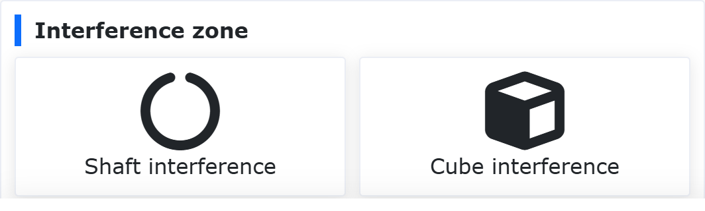
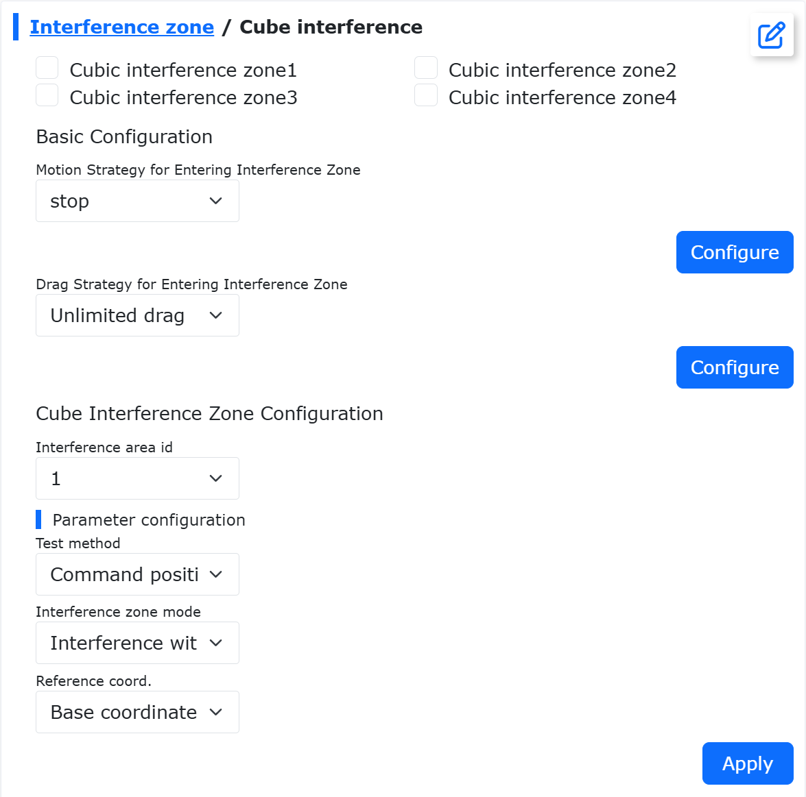
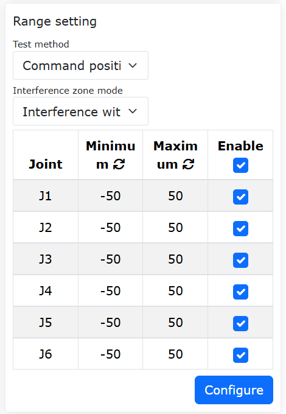

Safety
===============

.. toctree:: 
   :maxdepth: 6

Background
------------------------------------------------
As a key execution unit in the development of industrial intelligent manufacturing, the safety performance of industrial robots has become a core element in the full lifecycle management of equipment. Currently, the industry generally requires that safety function-related parameters be固化 and tamper-proof, and that a complete and traceable verification mechanism be established to meet stringent safety compliance audit requirements.
System integrators and end users in Europe have further put forward clear requirements for transparency and verifiability of safety configurations in actual project acceptance. Specifically, after safety function debugging is completed, the system should be able to automatically generate a safety configuration report containing a complete checksum, and this checksum must be displayed in real-time on the device's web management interface. This mechanism is designed to ensure that any modifications to safety parameters can be effectively identified and recorded, thus providing a reliable basis for equipment safety status assessment, on-site acceptance, and subsequent operation and maintenance.
In view of this, the safety architecture design of this device not only complies with relevant international safety standards but also has built-in safety configuration export and checksum real-time display functions, to assist operators and safety managers in conveniently and reliably completing configuration confirmation and compliance certification work.

Safety Configuration Checksum
------------------------------------------------

Open the web page. The safety checksum is located in the upper right corner of the page, represented by an 8-digit hexadecimal number. The safety checksum is unique; when safety configuration parameters change, the safety checksum changes accordingly.

.. image:: safety/001.png
   :width: 4in
   :align: center

.. centered:: Figure 7.1-1 Safety Configuration Checksum Display

Click on the safety checksum to display the set of safety configuration parameters represented by the current safety checksum.

.. image:: safety/002.png
   :width: 6in
   :align: center

.. centered:: Figure 7.1-2 Safety Configuration Parameters

Safety configuration parameters support exporting PDF reports. Click Download to preview the PDF report, and it also supports export. Click the Save button to download the PDF report.

.. image:: safety/003.png
   :width: 6in
   :align: center

.. centered:: Figure 7.1-3 Safety Configuration Report PDF Preview

Safety Configuration Parameter Management
------------------------------------------------

All robot-related safety configuration parameters are maintained uniformly on the web page under "Initial Setup" -> "Safety". Modifying safety configuration parameters requires first entering the "Safety Configuration Password" for verification. Only after successful verification can safety parameter configuration modifications be made.

.. image:: safety/004.png
   :width: 4in
   :align: center

.. centered:: Figure 7.2-1 Safety Configuration Password Verification

After modifying the safety configuration parameters, click "Apply". A second confirmation of the modified safety configuration parameters is required. Click "Confirm" to apply the parameters. After the parameters are successfully applied, the safety configuration checksum will be updated accordingly.

.. image:: safety/005.png
   :width: 6in
   :align: center

.. centered:: Figure 7.2-2 Safety Configuration Parameters Second Confirmation

Safety Configuration Password Management
------------------------------------------------

The safety configuration password can be changed in "System Settings" -> "Maintenance Mode" -> "Safety Parameter Configuration". The default password is 12345678. Changing the password requires verification of the old password. The new and old passwords cannot be the same. The password length is a minimum of 1 character and a maximum of 8 characters, and is case-sensitive for letters and symbols.

.. image:: safety/006.png
   :width: 4in
   :align: center

.. centered:: Figure 7.3-1 Safety Configuration Password Management

If you forget the old password, please contact the relevant technical personnel of FAIRINO.

Safety Configuration Parameters
--------------------------------------------------------------------------------------------------

Robot Safety Parameters
~~~~~~~~~~~~~~~~~~~~~~~~~~~~~~~~~~~~~~~~~~~~~~~~~~~~~~~~~~~~~~~~~~~~~~~

Robot Speed
++++++++++++++++++++++++++++++++++++++++++++++++++++++++++++++

Click the menu bar "Initial Setup" -> "Safety", and click the "Robot Speed" submenu to enter the configuration interface.

Robot speed is used to limit the robot's maximum linear velocity, linear acceleration, and joint angular acceleration.

.. image:: safety/007.png
   :width: 4in
   :align: center

.. centered:: Figure 7.4-1 Robot Speed
 
Stop Deceleration Planning
++++++++++++++++++++++++++++++++++++++++++++++++++++++++++++++

Click the menu bar "Initial Setup" -> "Safety", and click the "Stop Deceleration Planning" submenu to enter the configuration interface.

- Free Stop: When entering stop, the angular velocity of each axis decelerates and stops according to the set stop deceleration percentage multiplied by the joint maximum acceleration;
- Synchronized Stop: When entering stop, the TCP pose velocity decelerates and stops according to the set stop deceleration percentage multiplied by the pose maximum acceleration;

Stop deceleration is a percentage of acceleration.

.. image:: safety/008.png
   :width: 6in
   :align: center

.. centered:: Figure 7.4-2 Robot Stop Deceleration Planning

Safety Stop
++++++++++++++++++++++++++++++++++++++++++++++++++++++++++++++

Click the menu bar "Initial Setup" -> "Safety", and click "Safety Stop" to enter the configuration interface to set the safety stop mode and safety stop strategy parameters.

When the safety stop trigger mode is set to "Dual Channel", both channels must be cleared and the warning must be manually cleared on the operation interface before the robot can be reset. In addition, a reduced mode option is added to the strategy configuration. When the user selects this strategy, the robot will enter reduced mode motion.

**Step1**: Click "Initial Setup" -> "Safety" -> "Safety Stop". The trigger mode can be selected as "Default" or "Dual Channel". The difference between the two is: in "Default" mode, the interface error is automatically cleared after triggering and recovery; in "Dual Channel" mode, the interface error must be manually cleared after triggering and recovery. "Safety Stop Strategy" can be selected as "Stop", "Pause", "Level 1 Reduced Mode", and "Level 2 Reduced Mode". The detailed descriptions are as follows: When "Stop" is selected, the robot will stop the current motion; when "Pause" is selected, the robot will pause the current motion, and after recovery and error clearing, it will resume the pause; when "Level 1 Reduced Mode" is selected, the robot will enter Level 1 reduced mode motion; when "Level 2 Reduced Mode" is selected, the robot will enter Level 2 reduced mode motion.

.. image:: safety/009.png
   :width: 6in
   :align: center

.. centered:: Figure 7.4-3 Robot Stop Deceleration Planning

**Step2**: When the trigger mode is set to "Default", the interface error can be automatically cleared after trigger recovery. When the trigger mode is set to "Dual Channel", the operation is: after trigger recovery, manually click the "Clear" operation in the upper right corner to reset the robot.

Safety Speed
++++++++++++++++++++++++++++++++++++++++++++++++++++++++++++++

Click the menu bar "Initial Setup" -> "Safety", and click "Safety Speed" to enter the configuration interface to set the safety speed. The TCP manual speed range is 1-1500mm/s.

The robot safety speed function is used in human-robot collaboration or dynamic environments to actively limit the robot's operating speed, controlling kinetic energy and impact force within safety thresholds, thereby preventing personnel injury in accidental contact and effectively protecting equipment and workpieces from collision damage.

**Step1**: Click "Initial Setup" -> "Safety" -> "Safety Speed" to set the safety speed parameters, mainly including three parts: "Function Enable", "Speed Limit", and "Post-Overspeed Mode".

Among them, Function Enable can be selected as "Disable", "Manual Mode Enable", and "All Modes Enable";

In Speed Limit, set the speed limit. When the robot's linear speed reaches this limit, it will be processed according to the parameters set in "Post-Overspeed Mode". "Post-Overspeed Mode" can be selected as "Stop and Alarm", "Auto Speed Limit", and "Disable After Stop and Alarm". Auto speed limit is only available in "Manual Mode Enable".

After setting the required parameters, no further operation is needed. The robot's motion will be processed according to the set parameters. The parameter settings are shown in the figure.

.. image:: safety/010.png
   :width: 4in
   :align: center

.. centered:: Figure 7.4-4 Safety Speed Parameter Settings

Emergency Stop
++++++++++++++++++++++++++++++++++++++++++++++++++++++++++++++

Click the menu bar "Initial Setup" -> "Safety", and click "Emergency Stop" to enter the configuration interface.

Emergency stop types 0, 1a, 1b, 2 can be set, stop time limit can be set, and stop distance limit can be set.

Through the controller sending to the control box board, emergency stop type 0 directly cuts off power to the control box board;

- Emergency stop type 1a: after deceleration stop, cuts off power to the robot body;
- Emergency stop type 1b: after deceleration stop, does not cut off power to the robot body, but disables the robot body;
- Emergency stop type 2: when emergency stop is pressed, the robot decelerates to a stop and remains enabled. After releasing the emergency stop, the robot should be able to operate normally.

.. image:: safety/011.png
   :width: 4in
   :align: center

.. centered:: Figure 7.4-5 Emergency Stop Settings

Protective Stop
++++++++++++++++++++++++++++++++++++++++++++++++++++++++++++++

Click the menu bar "Initial Setup" -> "Safety", and click the "Protective Stop" submenu to enter the configuration interface.

Protective stop types 0, 1, 2. Protective stop type 0 directly cuts off power to the control box board. Protective stop type 1: the control box board first notifies the controller to control the robot to stop, then the controller feeds back to the control box board to cut off power. Protective stop type 2: the control box board notifies the controller to control the robot to stop.

.. image:: safety/012.png
   :width: 4in
   :align: center

.. centered:: Figure 7.4-6 Protective Stop Configuration

Auto Enable on Power-On
++++++++++++++++++++++++++++++++++++++++++++++++++++++++++++++

Click the menu bar "Initial Setup" -> "Safety", and click the "Robot Enable" submenu to enter the configuration interface. You can choose whether the robot automatically enables on power-on or not.

.. image:: safety/013.png
   :width: 4in
   :align: center

.. centered:: Figure 7.4-7 Auto Enable on Power-On

Tool Orientation Limit (Only used in LA system)
++++++++++++++++++++++++++++++++++++++++++++++++++++++++++++++

Click the menu bar "Initial Setup" -> "Safety", and click the "Tool Orientation Limit" submenu to enter the configuration interface.

The tool orientation limit is a protective function acting on the robot's tool end Cartesian space to limit the robot's end posture motion range, including function enable setting, reference tool direction setting, and maximum deviation angle setting. The maximum deviation angle defines the maximum angular limit between the Z-axis of the tool end Cartesian coordinate system and the reference tool direction, which can usually be understood as a conical space.

.. image:: safety/014.png
   :width: 4in
   :align: center

.. centered:: Figure 7.4-8 Tool Orientation Limit

Robot Limits (Only used in LA system)
++++++++++++++++++++++++++++++++++++++++++++++++++++++++++++++

Click the menu bar "Initial Setup" -> "Safety", and click the "Robot Limits" submenu to enter the configuration interface.

Robot limits include momentum and power, where the momentum limit is used to limit the robot's maximum momentum, and the power limit is used to limit the mechanical work done by the robot.

.. image:: safety/015.png
   :width: 4in
   :align: center

.. centered:: Figure 7.4-9 Robot Limits

Joints
~~~~~~~~~~~~~~~~~~~~~~~~~~~~~~~~~~~~~~~~~~~~~

Joint Soft Limits
++++++++++++++++++++++++++++++++++++++++++++++++++++++++++++++

Under the menu bar "Initial Setup" -> "Safety" -> "Joints", click "Joint Soft Limits" to enter the soft limit interface.

There may be other equipment within the robot's travel range. The limit angles can perform soft limiting on the robot, preventing the robot from moving beyond certain coordinate values and avoiding collisions. Triggering a soft limit causes the robot to stop automatically, with no stopping distance.

Administrators can use default values or enter angle values. By entering angle values, the positive and negative angles of the robot's joints can be limited separately. When the entered value exceeds the robot joint soft limit angle values listed in the robot basic parameters table in Section 2.1-Basic Parameters, the limit angle will be adjusted to the maximum settable value. When the robot reports a joint command out-of-limit error, it is necessary to enter drag mode and drag the robot joint back within the limit angle.

The joint soft limit protection function is an active protection mechanism that monitors the motion state of the robotic arm joints in real time and dynamically restricts the operator from exceeding the set soft limit range during drag teaching. This function makes soft limits meaningful even in drag teaching, thereby enhancing human-robot collaboration safety.

- **Step1**: Log in to the web interface and click "Initial Setup" -> "Safety" -> "Joints" -> "Joint Soft Limits" in sequence to enter the robot soft limit setting module.
- **Step2**: Based on the robot's actual working range, reasonably set the soft limits for each joint. At this time, check whether the current angular position of each robot joint is within the preset soft limit range. If yes, click "Apply" to send the preset soft limits. If not, move each joint within the preset range; otherwise, an over-limit prompt will appear when clicking "Apply", as shown in the figure below. At this time, you can jog or drag the over-limit joint in the direction toward the soft limit range to clear the error.
- **Step3**: After the soft limit range is successfully set, select "Enable" for "Joint Soft Limit Protection" to activate this function, as shown in the figure below. In drag mode, the set soft limits will take effect, and resistance will be felt when dragging near the soft limits.
- **Step4**: To disable the joint soft limit protection function, click "Joint Soft Limit Protection" to turn it off.

.. image:: safety/016.png
   :width: 4in
   :align: center

.. centered:: Figure 7.4-10 Joint Soft Limits

Collision Level
++++++++++++++++++++++++++++++++++++++++++++++++++++++++++++++

Under the menu bar "Initial Setup" -> "Safety" -> "Joints", click "Collision Level" to enter the collision level interface.
Collision levels are divided into levels 1 to 10. Levels 1 to 3 are more sensitive, and the robot needs to run at the recommended speed. You can also choose custom percentage settings, with 100% corresponding to level 10. As shown in the figure below:

.. image:: safety/017.png
   :width: 6in
   :align: center

.. centered:: Figure 7.4-11 Collision Level Diagram

Collision strategies are "Stop on Collision", "Pause on Collision", and "Continue Motion". To avoid extrusion force between the robot and objects after collision, strategies "Gravity Torque Mode", "Oscillation Response Mode", and "Collision Rebound Mode" have been added. When triggered, all three strategies will switch from automatic or manual mode to drag mode, and then back to manual mode. The gravity torque mode will move away from the collision point based on the magnitude and direction of the collision force; the oscillation response mode will return to the collision position after moving away from it; the collision rebound mode will accelerate away from the collision point according to the set parameters.

In the "Collision Strategy" section, click the drop-down box to select "Collision Rebound Mode", and set the safety time to 1000ms, safety distance to 150mm, safety speed to 150mm/s, and safety factor for each joint to 5. The specific interface is shown in the figure below.

.. image:: safety/018.png
   :width: 6in
   :align: center

.. centered:: Figure 7.4-12 Collision Strategy: Collision Rebound Mode

Meaning of each parameter:

- Safety Time: Indicates the duration in drag mode after switching from automatic mode to drag mode, range [1000-2000]ms;
- Safety Distance: Indicates the position where the robot moves away from the collision point after collision, range [150-200]mm;
- Safety Speed: Indicates the maximum TCP speed at which the robot moves away from the collision point after collision. Exceeding this speed limit will constrain the rebound force, range [50-250]mm/s;
- Safety Factor: Indicates the decay rate of the rebound force. The smaller the coefficient, the faster the decay and the faster the rebound speed; the larger the coefficient, the slower the decay. Range [1-10], dimensionless.
- Before the robot enters drag mode, torque detection is required. This function is designed to prevent abnormal phenomena such as lifting or dropping after the robot enters drag mode due to incorrect load parameters or installation mode settings by the operator. If the joint torque is detected to exceed the allowable range, the controller will immediately report an error and prohibit the robot from entering drag mode.

Steps to enable the linear rack and pinion rail collision detection function:

- Step1: Ensure that both the rail and robot installation methods are front-mounted. Before enabling the linear rack and pinion rail collision detection function, check whether the installation method is front-mounted. Specifically, first ensure that the rail and robot installation methods are front-mounted. Then, click "Initial Setup" -> "Basic" -> "Installation" in sequence to enter the free installation page. If both "Base Rotation" and "Base Tilt" are 0, the software is set to front-mounted; otherwise, they must be changed to 0. If they are not 0, the interface will prompt an error.
- Step2: Enable the linear rack and pinion rail collision detection function and set parameters. Click "Initial Setup" -> "Safety" -> "Joints" -> "Collision Level" in sequence to enter the collision level setting page. After clicking the "Linear Rack and Pinion Rail Collision Detection" function slider, set the gear radius and slider mass. The gear radius can be calculated from the lead and reduction ratio. The slider mass does not include the robot and its end load. There are 11 rail level options, where Level 1 is the easiest to trigger collision and Level 10 is the most difficult. When the controller is first powered on and before the adaptation program is executed, the collision level should first be set to "Off".

.. image:: safety/019.png
   :width: 4in
   :align: center

.. centered:: Figure 7.4-13 Linear Rack and Pinion Rail Collision Detection Function

- Step3: Execute the "Rail_Adaptation_Program.lua" program to adapt to the current rail. After each controller restart, the "Rail_Adaptation_Program.lua" program must be executed (to prevent changes in robot type and other factors from affecting the rail's dynamic characteristics). Before executing the program, ensure that the rail collision level is set to "Off". In automatic mode, run the LUA program at 100% interface speed. After one loop of the program is completed, the adaptation is complete and execution can be stopped.

.. image:: safety/020.png
   :width: 4in
   :align: center

.. centered:: Figure 7.4-14 Execute "Rail_Adaptation_Program.lua" to Adapt to the Current Rail

- Step4: Reasonably set the rail collision level and execute tasks. Users can reasonably set the rail collision level based on the motor driver performance and task running speed. If the rail and robot operate asynchronously, collision with the robot or rail can trigger an "8-axis collision fault, resettable". At this time, the rail stops running, as shown in Figure 2-9. If the rail and robot operate synchronously, collision with the robot can trigger an alarm, causing the rail to stop running, while the robot reacts according to the set collision strategy.

Reduced Mode
++++++++++++++++++++++++++++++++++++++++++++++++++++++++++++++

Click the menu bar "Initial Setup" -> "Safety", and click the "Reduced Mode" submenu to enter the configuration interface. Select "Level 1/Level 2 Mode" to configure joint speed and end TCP speed.

.. image:: safety/021.png
   :width: 4in
   :align: center

.. centered:: Figure 7.4-15 Reduced Mode

I/O
~~~~~~~~~~~~~~~~~~~~~~~~~~~~~~~~~~~~~~~~~~~~~~~~~~~
Click the menu bar "Initial Setup" -> "Safety", and click the "I/O" submenu to enter the configuration interface.

HMI provides the ability to set the safety state for 16 digital inputs and 16 digital outputs, which can be set to valid or invalid states. When the controller determines that it is in a safety state, the 16 digital inputs and 16 digital outputs are set to the safety state.

.. image:: safety/022.png
   :width: 6in
   :align: center

.. centered:: Figure 7.4-16 I/O Safety State Configuration

Under the LA system:

"I/O Safety" provides DIO safety functions. The safety function is dual-channel DI or DO. When a safety DI signal or safety state flag is triggered, the DO is output.

.. image:: safety/023.png
   :width: 6in
   :align: center

.. centered:: Figure 7.4-17 I/O Safety Function Configuration

Hardware
~~~~~~~~~~~~~~~~~~~~~~~~~~~~~~~~~~~~~~~~~~~~~~~~~~~

ServoJT Power Detection (Only used in QX system)
+++++++++++++++++++++++++++++++++++++++++++++++++++++++++++++++++++++++++++++++++++++++++++++++++++++++
Click the menu bar "Initial Setup" -> "Safety", and click the "Power Detection" submenu to enter the configuration interface.

When directly acting on the robot's current loop (servoJT only), it is used to limit the work done by the robot. When the integral of robot speed and torque is detected to exceed the limit, power protection is activated.

.. image:: safety/024.png
   :width: 4in
   :align: center

.. centered:: Figure 7.4-18 ServoJT Power Detection

Planes
~~~~~~~~~~~~~~~~~~~~~~~~~~~~~~~~~~~~~~~~~~~

Safety Wall
+++++++++++++++++++++++++++++++++++++++++++++++++++++++++++++++++++++++++++++++++++++++++++++++++++++++

Click the menu bar "Initial Setup" -> "Safety", and click the "Safety Wall Configuration" submenu to enter the configuration interface.

- Safety Wall Configuration: Click the Enable button to enable the corresponding safety wall. When a safety wall has not been configured with a safety range, an error will be prompted. Click the configuration button in the upper right corner, select the safety wall you want to set, automatically bring up the safety distance (optional, default is 0), and then click the "Set" button to set successfully.
- Safety Wall Reference Point Configuration: After selecting a safety wall, four reference points can be set. The first three points are plane reference points, used to confirm the plane of the set safety wall. The fourth point is the safety range reference point, used to confirm the safety range of the set safety wall.

If the reference points are set successfully, a green light will be displayed. Otherwise, a yellow light will be displayed until the reference points are successfully set and turn green. When all four reference points are successfully set, the safety range can be calculated. After successful calculation, the safety range parameter point status returns to default.

.. image:: safety/025.png
   :width: 6in
   :align: center

.. centered:: Figure 7.4-19 Safety Range Reference Point Settings

- Application Effect: Enable the successfully configured safety wall. Drag the robot. If the robot's end TCP is within the set safety range, the system is normal. If it is outside the set safety range, an error will be prompted.

.. image:: safety/026.png
   :width: 6in
   :align: center

.. centered:: Figure 7.4-20 Effect After Successful Safety Range Settings

Interference Zone
+++++++++++++++++++++++++++++++++++++++++++++++++++++++++++++++++++++++++++++++++++++++++++++++++++++++

Under the menu bar "Initial Setup" -> "Safety" -> "Interference Zone", click the "Single" submenu item to enter the interference zone configuration interface.

We need to configure the interference method and the operation upon entering the interference zone. Interference methods are divided into "Axis Interference" and "Cuboid Interference".

.. centered:: Figure 7.4-21 Interference Zone Methods

Click the interference zone icon, use the switch to control whether it is enabled, and click the configuration button in the upper right corner for parameter configuration.

.. image:: safety/028.png
   :width: 6in
   :align: center

.. centered:: Figure 7.4-22 Interference Zone Configuration

First, configure the interference zone motion as "Continue Motion" or "Stop". Next, set the drag configuration upon entering the interference zone. Users can set the strategy after entering the interference zone in drag mode according to their needs: no drag restriction, impedance return, or switch back to manual mode.

When selecting Axis Interference, the axis interference parameters need to be configured. The detection method can be "Command Position" or "Feedback Position". The interference zone mode can be "Interference Within Range" or "Interference Outside Range". Next, set the range for each joint and whether the range for each joint is enabled. You can enter values, or use the "Refresh" icon after "Min" and "Max" to record the current robot position, and finally click Configure.

.. image:: safety/029.png
   :width: 6in
   :align: center

.. centered:: Figure 7.4-23 Axis Interference Configuration

When selecting Cuboid Interference, the cuboid interference parameters need to be configured. The detection method can be "Command Position" or "Feedback Position". The interference zone mode can be "Interference Within Range" or "Interference Outside Range". The reference coordinate system can be "Base Coordinate" or "Workpiece Coordinate", selected according to actual usage. Next, set the range. There are two methods for range setting. The first method is the "Two-Point Method", which uses two diagonal vertices of the cuboid. Positions can be entered or recorded through robot teaching. Finally, click Apply.

.. centered:: Figure 7.4-24 Cuboid Interference Configuration

The second method is the "Center Point + Side Length" method, where the center point of the cuboid and the side length of the cuboid form the interference zone. Positions can be entered or recorded through robot teaching. Finally, click Apply.

.. image:: safety/031.png
   :width: 6in
   :align: center

.. centered:: Figure 7.4-25 Cuboid Interference Configuration

Appendix: Gripper Wait Blocking Instruction
~~~~~~~~~~~~~~~~~~~~~~~~~~~~~~~~~~~~~~~~~~~~~~~~~~~~~~~~~~~~~~~~~~~~~~~~~~~~~

Click "Teach Program" -> "Peripheral Instructions" -> "Gripper" to add a wait for gripper motion to complete instruction, which can block until the clamping action is completed to obtain the actual physical position of the gripper.

.. centered:: Figure 7.4-26 Gripper Motion Complete Wait Instruction
 
- Gripper Status: Motion not completed, motion completed with no object detected, motion completed with object detected;
- Timeout Time: Unit ms, -1 means wait forever.
- Timeout Strategy: You can choose to stop with error or continue running.
- Gripper Type: You can choose parallel gripper or rotary gripper.

.. note:: 
   Note: The wait for gripper motion complete instruction is only applicable to custom protocols; adapted devices currently do not support it.

   You can also directly use GetGripperMotionDone() for judgment. Input parameter gripper type: 0 for parallel gripper, 1 for rotary gripper. The return values are gripper error and gripper status. Gripper error 0 means no error, other values mean there is an error. Gripper status 0 means motion not completed, 1 means motion completed with no object detected, 2 means motion completed with object detected. Example programs for waiting for gripper motion completion and getting gripper position are as follows:

.. image:: safety/033.png
   :width: 6in
   :align: center

.. centered:: Figure 7.4-27 Gripper Motion Example Program