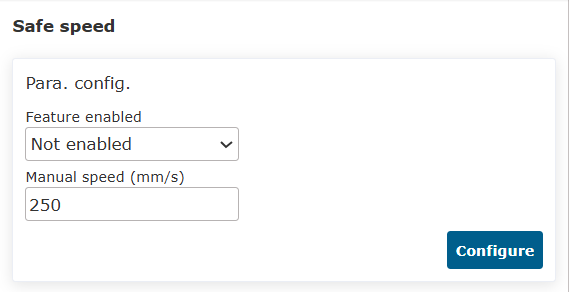
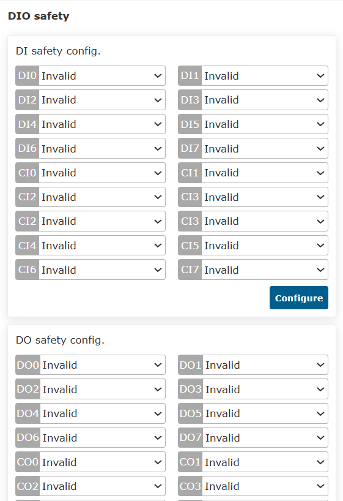
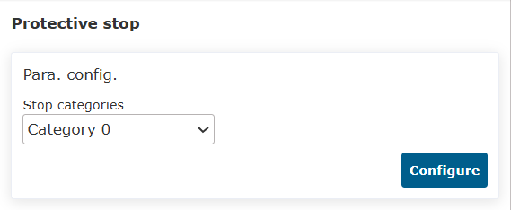

Safety
===============

.. toctree:: 
   :maxdepth: 6

Stop mode
--------------

Click "Initial - Safety" in the menu bar, and then click the "Stop mode" submenu to enter the configuration interface, set the safe stop mode parameter function.

.. centered:: Figure 7.1-1 Safe Stop Mode Configuration

Safe speed
--------------

Click "Initial - Safety" in the menu bar, and then click the "Safe speed" submenu to enter the configuration interface, set the safe speed.

.. note:: TCP manual speed is less than 250mm/s.

.. centered:: Figure 7.2-1 Safe manual speed configuration

I/O safety
--------------

Click "Initial - Safety" in the menu bar, and then click the "I/O safety" submenu to enter the configuration interface.

The HMI provides the setting of the safety status of 16 digital inputs and 16 digital outputs, which can be set to valid or invalid status. When the controller determines that it is in a safe state, the 16 digital inputs and 16 digital outputs are set to a safe state.

.. centered:: Figure 7.3-1 DIO safety status configuration

On Linux:
   The I/O safety function is provided in "DIO Safety". The safety function is dual-channel DI or DO. When a safety DI signal is detected or the safety status flag is triggered, DO is output.

.. centered:: Figure 7.3-2 DIO safety function configuration

Emergency stop
---------------------

Click "Initial - Safety" in the menu bar, and then click the "Emergency stop" submenu to enter the configuration interface.

Emergency stop types 0, 1a, 1b, 2 can be set, stop time limit can be set, and stop distance limit can be set.

 - Send the control box board through the controller, and the emergency stop type 0 control box board directly cuts off the power;

 - Emergency stop type 1a is to cut off the power supply of the main body after deceleration stop;

 - Emergency stop type 1b is to not cut off the power supply of the main body after deceleration stop, and the main body is disabled;

.. centered:: Figure 7.4-1 Emergency stop configuration

Protective stop
---------------------

Click "Initial - Safety" in the menu bar, and then click the "Protective stop" submenu to enter the configuration interface.

Protective stop type 0, 1, 2. Protective stop type 0: the control box board directly cuts off the power. Protective stop type 1: the control box board first notifies the controller to control the robot to stop and then the controller feeds back to cut off the power of the control box board. Protective stop type 2: the control box board notifies the controller to control the robot to stop.

.. centered:: Figure 7.5-1 Protective shutdown configuration

.. important::
   The safety data status flag and control box carrier board fault feedback are obtained through the Web terminal and the controller status feedback. When the flag bit is 1, the safety data status is abnormal in the WebAPP alarm status. After the control box carrier board fault is obtained, the specific error information is displayed in the WebAPP alarm status according to the error code.

.. image:: safety/007.png
   :width: 4in
   :align: center

.. centered:: Figure 7.5-2 WebAPP alarm status 

Safety plane
---------------------------------

Click "Initial - Safety" in the menu bar, and then click the "Safety plane" submenu to enter the configuration interface.

-  **Safety Plane Configuration**:Click the enable button to enable the corresponding security plane. When the security plane is not configured with a security range, an error will be prompted. Click the drop-down box, select the security plane you want to set, and automatically bring out the security distance (you can not set it, the default value is 0), and then click the "Setting" button to set it successfully.
  

.. centered:: Figure 7.6-1 Safety Plane Configuration

-  **SSafety Plane Reference Point Configuration**:After selecting a security plane, four reference points can be set. The first three points are plane reference points, which are used to confirm the plane of the safety wall set. The fourth point is the safety range reference point, which is used to confirm the safety range of the set safety wall.

.. important::
   If the reference point is set successfully, the green light will be on. Otherwise, the yellow light is on. It turns green until the reference point is set successfully. When the four reference points are all set successfully, the safety range can be calculated, and the safety range parameter point status will return to the default after the calculation is successful.

.. centered:: Figure 7.6-2 Safe range reference point setting

-  Apply effects: The successfully configured security plane is enabled. Drag the robot, if the TCP at the end of the robot is within the set safety range, the system is normal. If it is outside the set safety range, an error will be prompted.

.. centered:: Figure 7.6-3 The effect picture after the security range is set successfully

Daemon
---------------------------------

Click "Initial - Safety" in the menu bar, and then click the "Daemon" submenu to enter the configuration interface.

The user clicks the "function enabled" button to open or close the setting of the daemon. Select "Unexpected Situation" and "Background Program", and click the "Settings" button to configure the parameters of the unexpected situation handling logic.

Enable the security background program and set the unexpected scene and background program. When the user starts to run the program and the unexpected situation matches the set unexpected situation, the robot will execute the corresponding background program to play a role of security protection.

.. centered:: Figure 7.7-1 Daemon

Direction limit (Only used in Linux systems)
---------------------------------------------
Robot limit (Only used in Linux systems)
---------------------------------------------

Power detection (Only used in QNX systems)
---------------------------------------------
