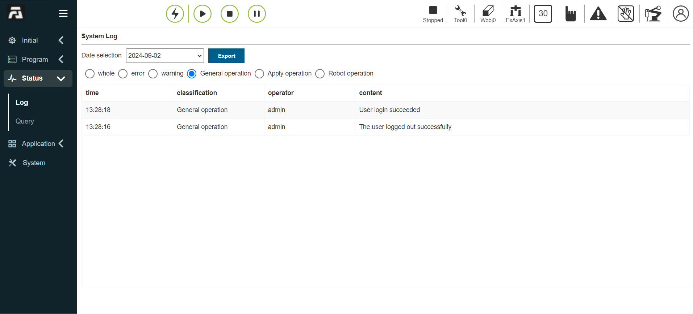
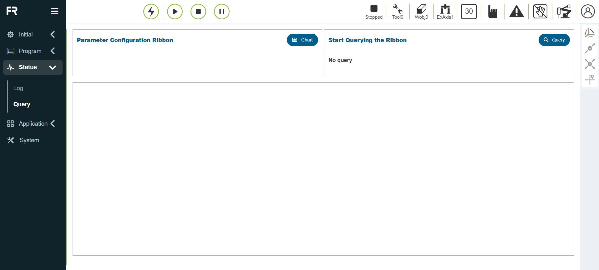
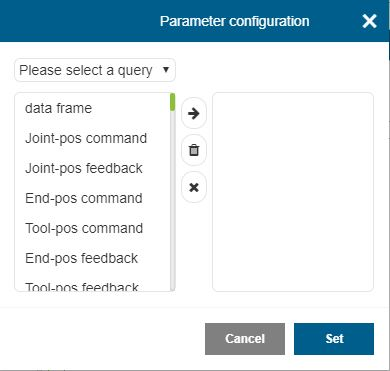

Status
===============

.. toctree:: 
   :maxdepth: 6

System log
----------------------

Click the "Log" button in the "Status" on the left menu bar to enter the log display interface. The log records some important operation records of the teach pendant, such as the log-in person, the increase and decrease of the teaching point, etc. After clicking to enter, the log records of the current day are displayed by default. If you want to query the previous records, select the target in the "Date Selection" Date, the log record of the current day will be displayed in real time below, and the number of log records can be set in the system settings for details. When there is too much user log information, the user can
Find relevant log information according to the type.

.. centered:: Figure 13.1-1 System log interface

Status query
----------------------

Click the "Query" menu in the left menu bar "Status" to enter the status query interface, as shown in figure below.

.. centered:: Figure 13.2-1 Status query

Status query operation steps:

**Step1**: Click the "Figure" button to pop up the Figure setting pop-up box, as shown in figure below, select Figure display query for the query type, select the parameters to be queried and the Figure in which the parameters are placed in the Figure setting, and click the "Move Right" button The parameters can be configured in the Figure. Click "Settings" to issue the setting Figure command. At present, only one table can contain up to four parameters to be checked and one Figure can be set at most;

.. centered:: Figure 13.2-2 Figure settings

**Step2**: The trigger function does not need to be set temporarily, and the data can be queried by clicking the "Query" button.
