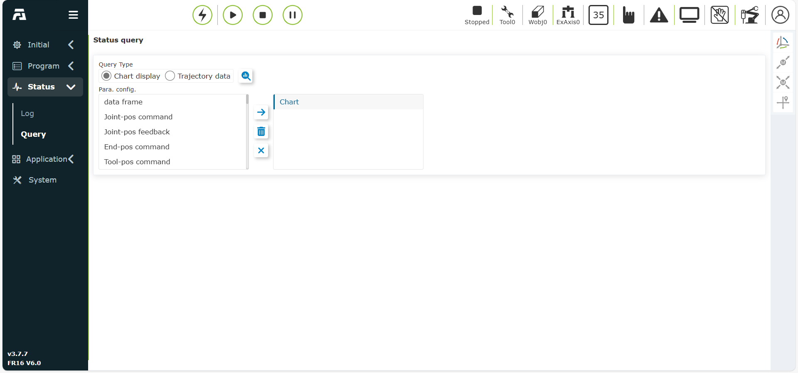
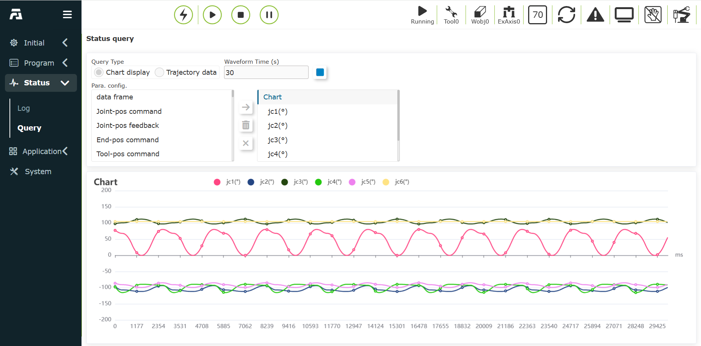
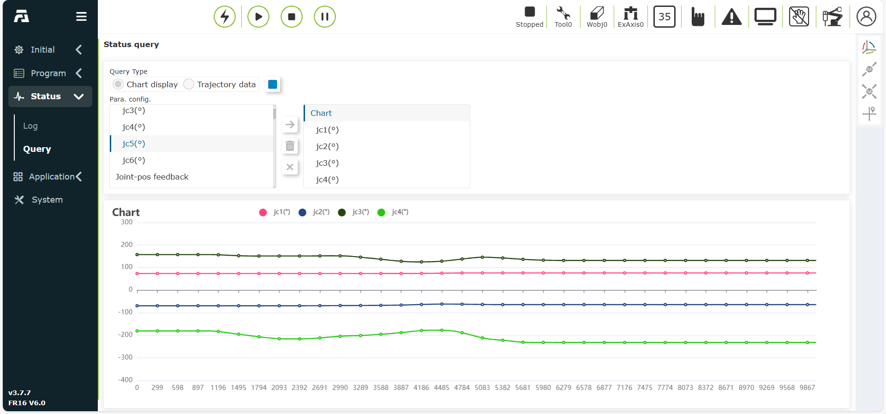
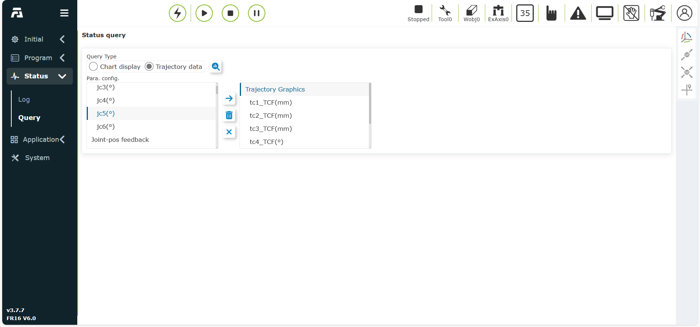

Status
===============

.. toctree:: 
   :maxdepth: 6

System log
----------------------

When you enter the "Status Information - System Log" interface for the first time, all types of log data for the day are displayed by default.

The log data is classified into levels, currently divided into: all, error warnings, basic settings, security settings, peripheral settings, main unit operations, teaching programs, tool applications, system settings, and file import and export.

There is a search input box in the upper right corner of the data table. Users can enter the filter content according to their search needs. The interface is as follows:

.. image:: status/001.png
   :width: 6in
   :align: center

.. centered:: Figure 13.1-1 System log interface

Status Query
----------------------

Click the "Status Query" menu in the "Status Information" menu bar on the left to enter the status query interface. The query types are divided into "Chart Display" and "Track Data". As shown in the figure below:

.. centered:: Figure 13.2‑1 Status query

.. note:: 
   .. image:: status/006.png
      :width: 0.75in
      :height: 0.75in
      :align: left

   Name:**Query button**
   
   Function:Click to issue a command to query chart/trace data, indicating that the query status is not yet completed.

.. note:: 
   .. image:: status/007.png
      :width: 0.75in
      :height: 0.75in
      :align: left

   Name:**Right button**
   
   Function: Click to add the selected item on the left to the subitem on the right

.. note:: 
   .. image:: status/008.png
      :width: 0.75in
      :height: 0.75in
      :align: left

   Name:**Delete Button**
   
   Function: Click to delete the sub-item selected on the right

.. note:: 
   .. image:: status/009.png
      :width: 0.75in
      :height: 0.75in
      :align: left

   Name:**Clear Button**
   
   Function: Click to clear all sub-items on the right

Status query operation steps:

**Step1**:Click the query type radio button, select the parameters you want to query on the left side of the parameter configuration, and click the "Move Right" button to configure the parameters to the list on the right.

.. important:: 
   Currently, parameter configuration can only support adding up to four parameters to be checked.

.. centered:: Figure 13.2‑1 Parameter configuration

**Step2**:Click the "Query" button to query the data.

After selecting the chart display, click the query button, and the line chart will be displayed in real time according to the parameter configuration. As shown below:

.. centered:: Figure 13.2‑2 Chart display

After selecting the trajectory data, there is no line graph during the query process. Click the Stop Query button to successfully stop the query, and then the Download button will be displayed. As shown in the following figure:

.. centered:: Figure 13.2‑3 Trajectory data

.. important:: 
   During the query process, you need to confirm whether to stop the query when switching to other interfaces.
