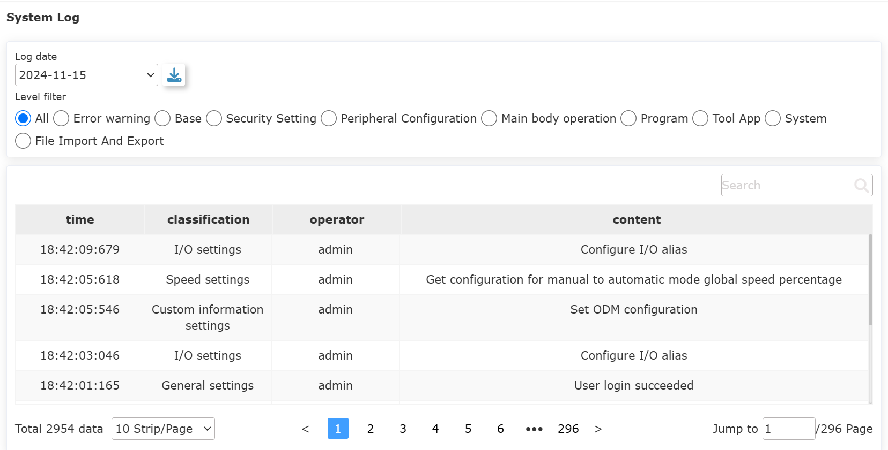

Status
===============

.. toctree:: 
   :maxdepth: 6

System log
----------------------

When you enter the "Status Information - System Log" interface for the first time, all types of log data for the day are displayed by default.

The log data is graded and currently divided into: All, Error Warning, Basic Settings, Security Settings, Peripheral Settings, Main Unit Operation, Teaching Program, Tool Application, System Settings, and File Import and Export.

There is a search input box in the upper right corner of the data table. Users can enter the filter content according to their search needs. The interface is as follows:

.. centered:: Figure 13.1-1 System log interface

Status query
----------------------

Click the "Query" menu in the left menu bar "Status" to enter the status query interface, as shown in figure below.

.. image:: status/002.png
   :width: 6in
   :align: center

.. centered:: Figure 13.2-1 Status query

Status query operation steps:

**Step1**: Click the "Figure" button to pop up the Figure setting pop-up box, as shown in figure below, select Figure display query for the query type, select the parameters to be queried and the Figure in which the parameters are placed in the Figure setting, and click the "Move Right" button The parameters can be configured in the Figure. Click "Settings" to issue the setting Figure command. At present, only one table can contain up to four parameters to be checked and one Figure can be set at most;

.. centered:: Figure 13.2-2 Figure settings

**Step2**: The trigger function does not need to be set temporarily, and the data can be queried by clicking the "Query" button.
