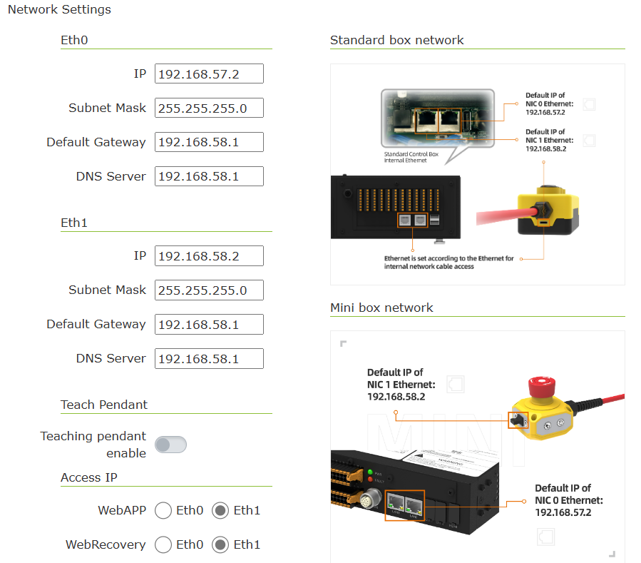
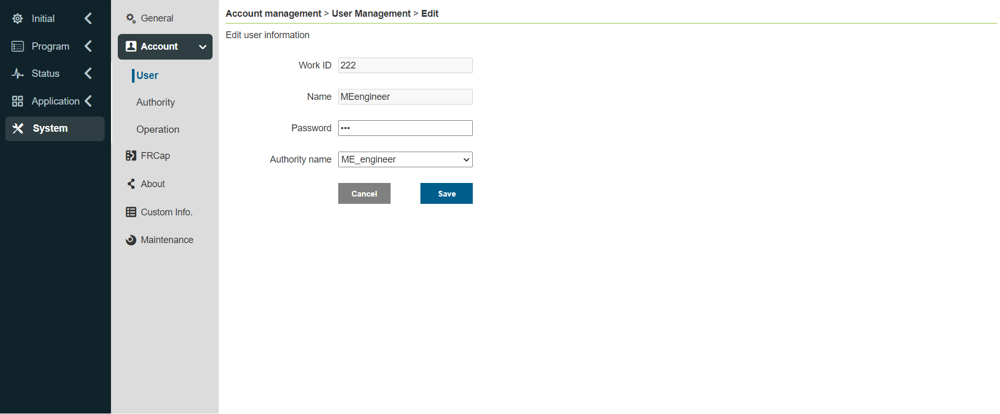
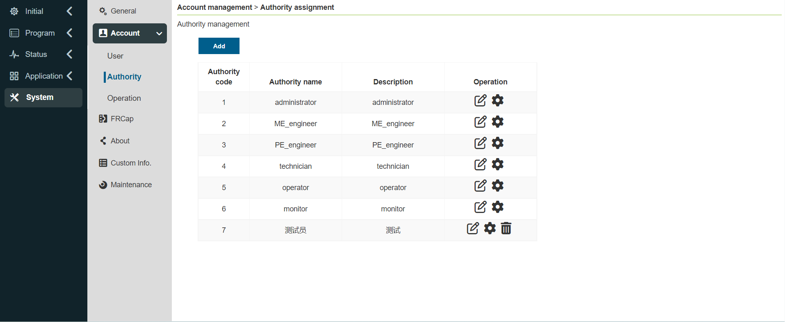
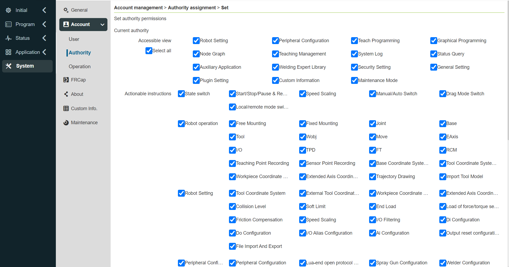
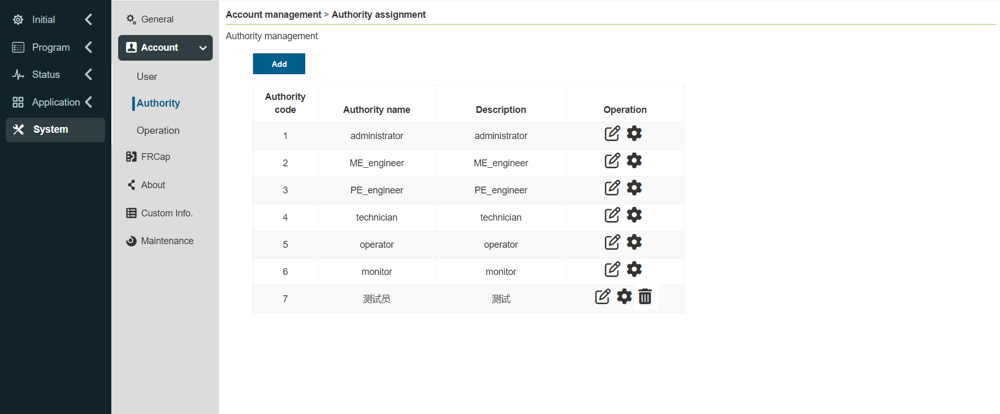
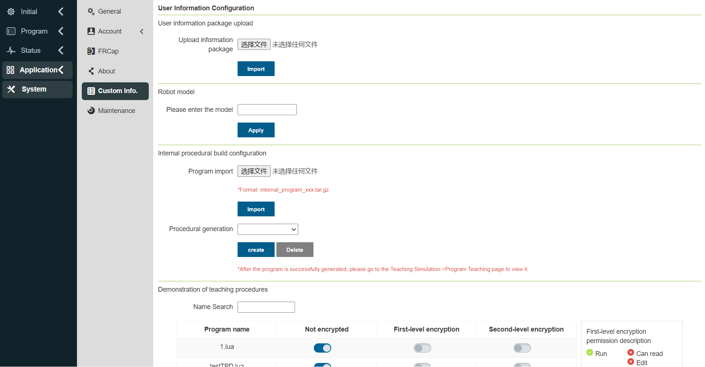
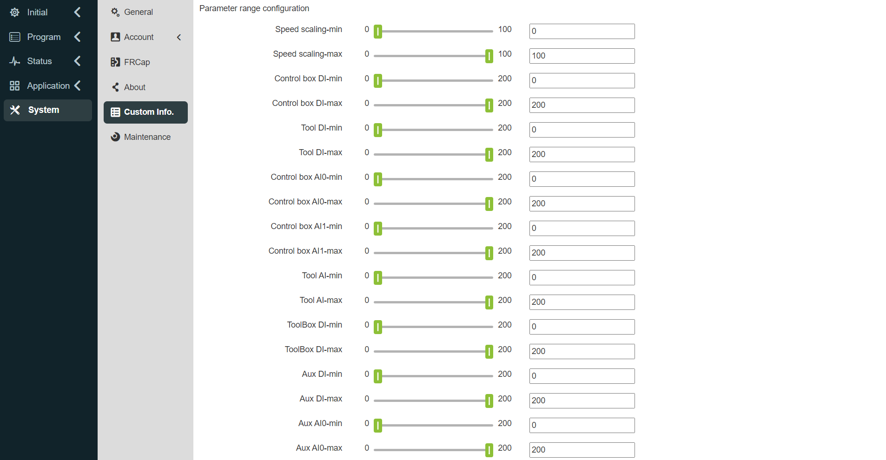
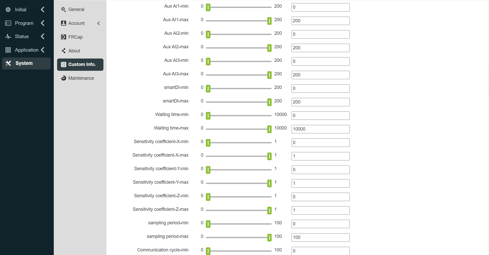
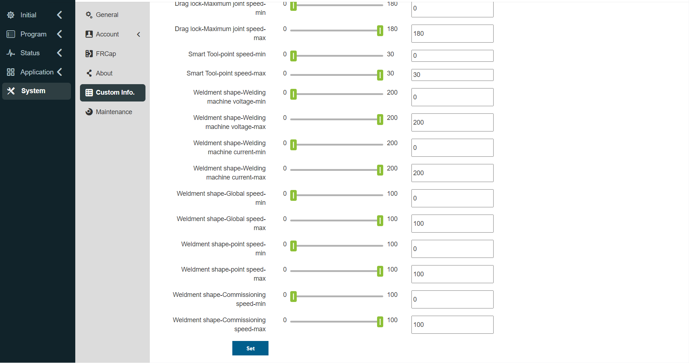
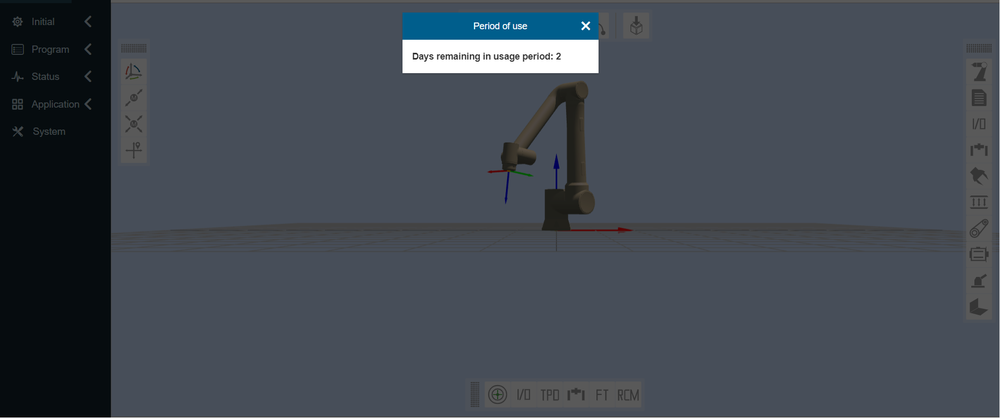

System
===============

.. toctree:: 
   :maxdepth: 6

General settings
-------------------

Click "System Settings" on the left menu bar, and click "General Settings" on the secondary menu bar to enter the general settings interface. The general setting can update the robot system time according to the current computer time, so that the time of recording the log content is accurate.

Network settings can set controller IP, subnet mask, default gateway, DNS server and teach pendant IP (this IP is valid when using our FR-HMI teach pendant, and needs to be used when using FR-HMI teach pendant Configure the teaching pendant to be enabled), which is convenient for customers to use the scene.

- The system currently comes with four languages: Chinese (汉语), English (English), French (français) and Japanese (日本語).

- The language pack name must be: [Language code].json, for example: es.json, the language code is the ISO 639-1 standard.

- The following is a language comparison table.
  
.. list-table:: 
   :widths: 20 40 40 30
   :header-rows: 1
   :align: center

   * - Language
     - Local language name
     - Language code(ISO 639-1)
     - Is it built-in

   * - Chinese
     - 中文(汉语)
     - zh
     - True

   * - English
     - en
     - ja
     - True

   * - French
     - français
     - fr
     - True

   * - Japanese
     - 日本語
     - ja
     - True

   * - Korean
     - 한국어
     - ko
     - True

Users can set the number of retained logs and import and export the system configuration file. The maximum number of retained logs is 30, and the system configuration file records the set value.

Restore factory settings under system recovery can clear user data and restore the robot to factory settings.

The slave station log generation and controller log export functions are to download some important status or error record files of the controller, which is convenient for troubleshooting robot problems.

Network settings
~~~~~~~~~~~~~~~~~~~~~

.. centered:: Figure 15.1‑1 Schematic diagram of network settings

-  **Set ethernet**:Enter the IP of the network card that needs to communicate, subnet mask (linked with IP, automatically filled), default gateway, and DNS server. The factory default IP of network card 0 network port: 192.168.57.2, the factory default IP of network card 1 network port: 192.168.58.2.

-  **Teach pendant enabled**:Controls whether the teach pendant is enabled. By default, the teach pendant is turned off, and the device cannot be operated using the teach pendant. Click the slide switch button to enable the teach pendant to operate the device.
  
-  **Access IP**:Select the network card associated with WebAPP and WebRecovery. When the teach pendant is enabled, WebAPP selects network card 1 by default, and network card 0 is not optional.
  
-  **Set network**:Click the "Set Network" button, prompting that the configuration is in progress. After the configuration is complete, the device needs to be restarted.

Account settings account settings
--------------------------------------

Click Account Settings on the secondary menu bar to enter the Account Settings interface. Account management functions are only available to administrators. The function is divided into the following three modules:

User Management
~~~~~~~~~~~~~~~~~~~~~~~

User management page, used to save user information, you can add user ID, function, etc. The user can log in by entering the existing user name and password in the user list.

.. centered:: Figure 15.2-1 User Management

-  **Add users**:Click the "Add" button, enter the job number, name, password and select the function. 
  
.. important::
   The job number can be up to 10-digit integer, and the job number and password are uniquely checked, and the password is displayed in Braille. After the user is added successfully, you can enter the name and password to log in again.

.. centered:: Figure 15.2-2 Add users
  
-  **Edit users**:When there is a user list, click the "Edit" button on the right, the job number and name cannot be modified, but the password and function can be modified, and the password also needs to be uniquely verified.
  

.. centered:: Figure 15.2-3 Edit users

-  **Delete users**:The deletion methods are divided into single deletion and batch deletion. 
 
   1. Click the single "Delete" button on the right side of the list, and it will prompt "Please click the delete button again to confirm deletion", and click the list again to delete successfully. 
   
   2. Click the check box on the left, select the users to be deleted, and then click the batch "Delete" button at the top of the list twice to delete. 
   
.. important::
   The initial user 111 and the current login user cannot be deleted.

.. centered:: Figure 15.2-4 Delete users

Authority management
~~~~~~~~~~~~~~~~~~~~~~~

.. important:: 
   The default function data (function code 1-6) cannot be deleted, and the function code cannot be modified, but the function name and function description can be modified and the authority of the function can be set.

.. centered:: Figure 15.2-5 Authority management

There are six functions by default, administrators have no function restrictions, operators and monitors can use a small number of functions, ME engineers, PE&PQE engineers and technicians & team leaders have some function restrictions, administrators have no function restrictions, the specific default permissions are shown in the following table:

.. important:: 
   Default permissions can be modified

.. centered:: Table 15.2-1 Permission details

-  **Add function**: Click the "Add" button, enter the function code, function name and function description, click the "Save" button, and return to the list page after success. Among them, the function code can only be an integer greater than 0 and cannot be the same as the existing function code, and all input items are required.

.. image:: system/008.png
   :width: 6in
   :align: center

.. centered:: Figure 15.2-6 Add function

-  **Edit function name and description**: Click the "Edit" icon in the table operation bar to modify the function name and function description of the current function. After the modification is completed, click the "Save" button below to confirm the modification.

.. centered:: Figure 15.2-7 Edit function name and description

-  **Set function permissions**: Click the "Settings" icon in the table operation bar to set the permissions of the current function. After setting, click the "Save" button below to confirm the settings.

.. centered:: Figure 15.2-8 Set function permissions

-  **Delete function**: Click the "Delete" icon in the table operation bar, firstly, it will check whether the current function is used by a user, if no user uses it, the current function can be deleted, otherwise it cannot be deleted.

.. centered:: Figure 15.2-9 Delete function

Import/Export
~~~~~~~~~~~~~~~~~~~~~~~

.. centered:: Figure 15.2-10 Account settings import/export

-  **Import**: Click the "Import" button to import user management and rights management data in batches.

-  **Export**: Click the "Export" button to export the data of user management and rights management in batches.

About
------------

Click About on the secondary menu bar to enter the About interface. This page shows the model and serial number of the robot, the web version and control box version used by the robot, hardware version and firmware version.

.. centered:: Figure 15.3-1 About Schematics

Custom information
------------------------

Click the custom information of the secondary menu bar to enter the custom information interface. Custom information functions can only be used by administrators.
This page can upload user information packages, custom robot models, and setting teaching program encryption status.

.. centered:: Figure 15.4-1 Custom information schematic diagram

Parameter range configuration
~~~~~~~~~~~~~~~~~~~~~~~~~~~~~~~~~~

Parameter range configuration, only the administrator can adjust the parameter range, and the parameters of other authorized members can only be set within the parameter range set by the administrator.

There are two ways to set parameters: slider dragging and manual input. 

.. important:: 
   The maximum value of the parameter range must be greater than the minimum value. 3 seconds after the parameter range is successfully configured, it will automatically jump to the login page, and you need to log in again.

.. centered:: Figure 15.4-2 Schematic diagram of parameter range configuration

WEB interface locked
~~~~~~~~~~~~~~~~~~~~~~~

1. Lock screen settings

Check the web interface lock screen settings in "Custom" and set whether this function is turned on. When choosing to turn on this function, select the usage period. If not selected, it will prompt "The usage period cannot be empty".

.. note:: If the lock screen function is turned on, secondary settings cannot be made, and the system time cannot be updated.) After selecting the usage period, click the "Configure" button.

After selecting the usage period, click the "Configure" button.

.. image:: system/023.png
   :width: 6in
   :align: center

.. centered:: Figure 15.4-3 WEB interface lock screen shutdown settings

.. centered:: Figure 15.4-4 WEB interface lock screen enable settings

2. Expiration reminder

When the web interface lock screen function is turned on, the following prompt will appear after logging in to the interface:

1)5 days before the expiration of the device, if you power on and log in successfully, a pop-up window will prompt the remaining days of the use period, which can be eliminated by resetting.

.. centered:: Figure 15.4-5 Boot prompt

2)If the device continues to work, 5 days before the device expires, a pop-up window will automatically pop up at zero o'clock to prompt the remaining days of the service life, which can be eliminated by resetting.

.. centered:: Figure 15.4-6 Continuous work tips

3. Unlock login

When the web interface lock screen function is turned on, after the device expires, you will directly enter the lock screen interface when you log in to the webApp for the first time. When the device continues to work, it will automatically log out after obtaining the lock screen data at zero point and enter the lock screen interface. At this time, enter the unlock code to unlock and enter the login interface, enter your login information to log in.

.. note:: The integrator operates to generate an encrypted unlock code.
 

.. centered:: Figure 15.4-7 Lock screen  

Robot model configuration
--------------------------------------

.. important:: 
   If you need to modify the robot model, please contact our technical engineers and proceed under guidance.

After logging into the collaborative robot console Web, select the corresponding model to modify in the "System Settings" -> "Maintenance Mode" -> "Controller Compatibility" configuration item. For the robot model, refer to the table below.

The robot model table is as follows:

.. list-table::
   :widths: 30 70
   :header-rows: 0
   :align: center

   * - **Numerical value**
     - **Model (Main model - Major - Minor)**
     
   * - 0
     - Not configured
   
   * - 1
     - FR3-V1-000 (V5.0)
   
   * - 2
     - FR3-V1-001 (V6.0)
   
   * - ...
     - Reserved
   
   * - 101
     - FR5-V1-000
   
   * - 102
     - FR5-V1-001 (V5.0)
   
   * - 103
     - FR5-V1-002 (V6.0)
   
   * - ...
     - Reserved
   
   * - 201
     - FR10-V1-000 (V5.0)
   
   * - 202
     - FR10-V1-001 (V6.0)
   
   * - ...
     - Reserved
   
   * - 301
     - FR16-V1-000 (V5.0)
   
   * - 302
     - FR16-V1-001 (V6.0)
   
   * - ...
     - Reserved
   
   * - 401
     - FR20-V1-000 (V5.0)
   
   * - 402
     - FR20-V1-001 (V6.0)
   
   * - ...
     - Reserved
   
   * - 501
     - ART3-V1-000
   
   * - ...
     - Reserved
   
   * - 601
     - ART5-V1-000
   
   * - ...
     - Reserved
   
   * - 802
     - FRCustom(8)-V1-001(FR5WM)
   
   * - ...
     - Reserved
   
   * - 901
     - FRCustom(9)-V1-001(FR3MT)
   
   * - 902
     - FRCustom(9)-V1-001(FR10YD)
   
   * - ...
     - Reserved
   
   * - 1001
     - FR30-V1-001(V6.0)
   
   * - ...
     - Reserved

.. note:: 
   Among them, 10 major version numbers (1-10) are reserved, and 10 minor version numbers (1-10) are reserved.
