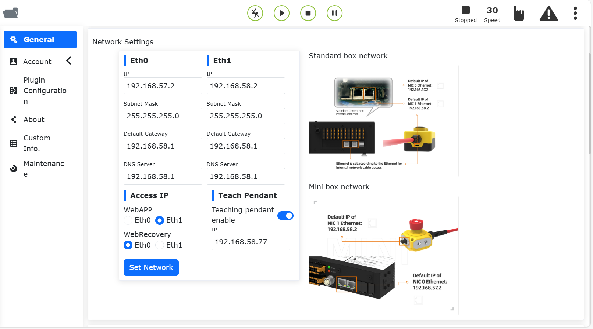
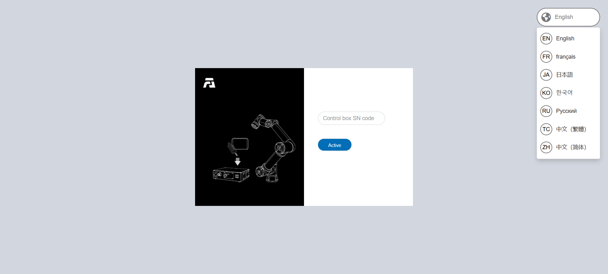
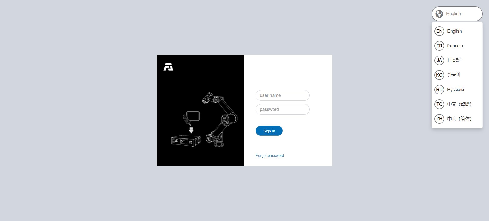
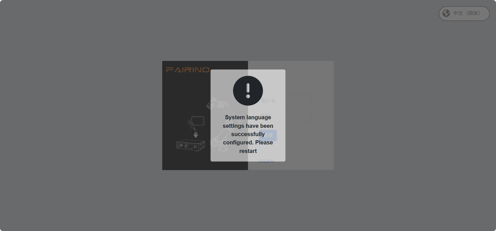
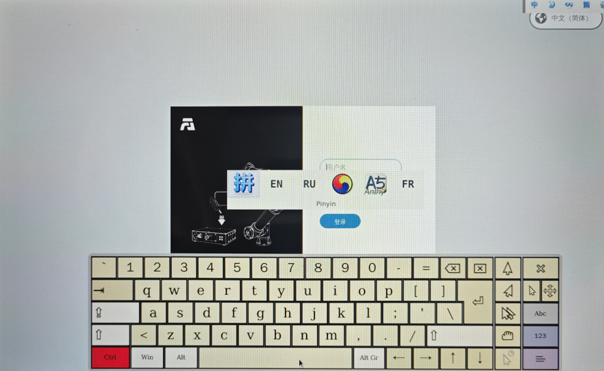
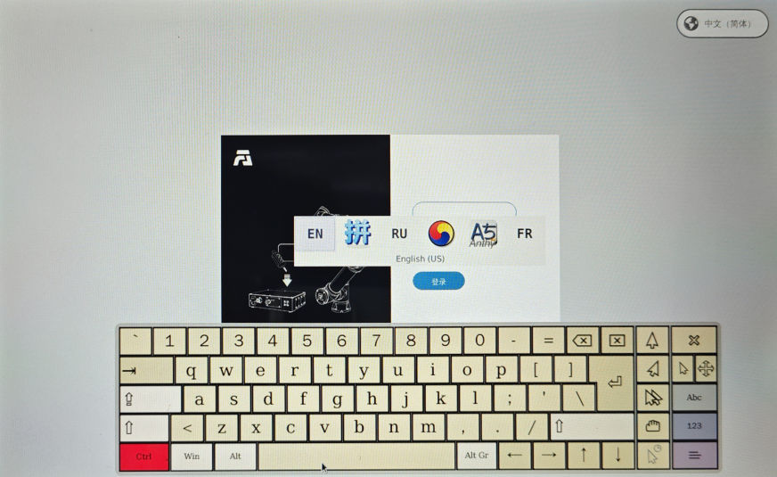
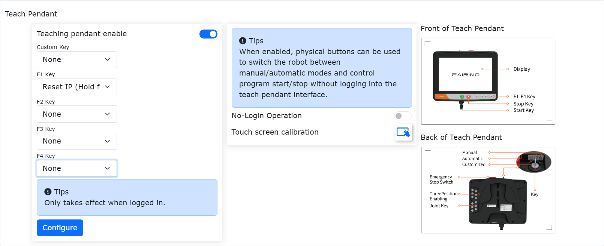
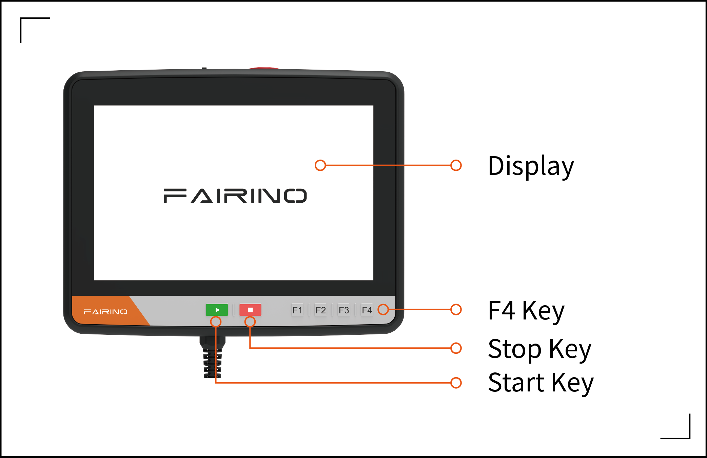

Teach pendant
===============

.. toctree::
   :maxdepth: 6

Teach pendant activation
----------------------------

1. Connect the control box to the teach pendant and start it.

2. Log in with the account admin and password 123. Enter the page, click System Settings-General Settings, and confirm that the teach pendant is enabled.

.. centered:: Figure 16.1‑1 Teaching pendant activation status

Teach pendant multi-language setting
--------------------------------------

1. On the login interface (or the first activation interface), select the language in the upper right corner.

.. centered:: Figure 16.2‑1 Activation interface language setting

.. centered:: Figure 16.2‑2 Login interface language setting

2. Taking the login interface multi-language setting as an example, select the language. If the following prompt (corresponding to different languages) appears, the setting is successful. Restart the control box to complete the language setting.

.. image:: teach_pendant/004.png
   :width: 6in
   :align: center

.. centered:: Figure 16.2‑3 Set Chinese

.. centered:: Figure 16.2‑4 Set English

Input method switch
~~~~~~~~~~~~~~~~~~~~~~~~~~~~~~~~~~~~~~~~~~~~~~~~~

The default input method is English input method.

1. Open the soft keyboard in the lower right corner and click the input box, such as the user name input box.

2. Switch to Chinese Pinyin input method.

Click the CTRL key twice, the key status turns red, and click the spacebar to select the input method. The following is the Chinese input method.

.. centered:: Figure 16.2‑5 Chinese Pinyin Input Method

3. Switch to English Input Method

Click the CTRL key twice, the key status turns red, click the spacebar to select the input method, the following is the English input method.

.. centered:: Figure 16.2‑6 English Input Method

After successful login, the system will load the model and other data, and enter the initial page after loading.

The language of the teaching pendant and webApp is inconsistent
~~~~~~~~~~~~~~~~~~~~~~~~~~~~~~~~~~~~~~~~~~~~~~~~~~~~~~~~~~~~~~~~~~~~~~

After the teach pendant is enabled, the teach pendant and webApp language verification will be triggered on the login interface. When the teach pendant language is inconsistent with the webApp language, the following prompt will appear.

.. centered:: Figure 16.2‑7 The language of the teaching pendant and webApp is inconsistent

Controller and Teach Pendant IP Reset Function
----------------------------------------------------------------------------------

Function Overview
~~~~~~~~~~~~~~~~~~~~~~~~~~~~~~~~~~~~~~~~~~~~

This optimization adds IP reset operations for the controller and the physical teach pendant through different methods, mainly enabling the following functions through the following operations:

- 1. Use the webrecovery interface to reset the IP addresses of the controller's Network Card 0 and Network Card 1;
- 2. Use the physical teach pendant's F1 custom key function configured for IP reset (press and hold for 10 seconds) to reset the IP addresses of the controller's Network Card 0, Network Card 1, and the physical teach pendant;
- 3. Use the physical teach pendant's F2 and F4 key combination, press and hold simultaneously for 10 seconds, to reset the IP address of the physical teach pendant device when it is not logged in.

.. image:: teach_pendant/010.png
   :width: 5in
   :align: center

.. centered:: Figure 16.3‑1 Mini Controller Box Network Port Diagram

Webrecovery Interface IP Reset
~~~~~~~~~~~~~~~~~~~~~~~~~~~~~~~~~~~~~~~~~~~~~~~~~~~~~~~~~~~~~~

Access the webrecovery interface using port 8050, for example, log in with the default IP: 192.168.57.2:8050. Click the 'Reset' button for "Reset Controller IP". The page will display a secondary confirmation pop-up. Click 'Confirm' and then click the Reset Controller IP button again to confirm the reset.

.. image:: teach_pendant/011.png
   :width: 5in
   :align: center

.. centered:: Figure 16.3‑2 Webrecovery Interface IP Reset Function

After the secondary confirmation, a prompt will indicate that a restart is required to take effect. After restarting, the controller's Network Card 0 IP will be restored to the default 192.168.57.2, and Network Card 1 IP will be restored to the default 192.168.58.2.

Physical Teach Pendant F1 Key Custom IP Reset
~~~~~~~~~~~~~~~~~~~~~~~~~~~~~~~~~~~~~~~~~~~~~~~~~~~~~~~~~~~~~~~~~~~~~~~~~~~~~

To use the physical teach pendant's F1 key custom function, you must first log in to the teach pendant interface to configure the F-key custom functions. Click "System Settings", click "General Settings", select the Teach Pendant module, turn on the Enable Teach Pendant switch, configure the F1 key as Reset IP (press and hold for 10 seconds), then click Configure.

.. centered:: Figure 16.3‑3 Physical Teach Pendant F1 Key Custom IP Reset

This function only takes effect when the physical teach pendant is logged into the webapp. After pressing and holding the F1 key for 10 seconds, a prompt will indicate that a restart is required to take effect. After restarting, the controller's Network Card 0 IP will be restored to the default 192.168.57.2, Network Card 1 IP will be restored to the default 192.168.58.2, and the physical teach pendant IP will be restored to the default 192.168.58.77.

Physical Teach Pendant F2 and F4 Key Combination IP Reset
~~~~~~~~~~~~~~~~~~~~~~~~~~~~~~~~~~~~~~~~~~~~~~~~~~~~~~~~~~~~~~~~~~~~~~~~~~~~~

The physical teach pendant device provides an IP reset function, which can be performed even when not connected to the webapp. Simultaneously press and hold the F2 and F4 key combination for 10 seconds to reset the physical teach pendant's IP address. The IP will be restored to the default 192.168.58.77. After restoration, you need to log back into the webapp. In System Settings - General Settings, set the physical teach pendant IP to 192.168.58.77. Restart to re-establish the teach pendant connection.

.. centered:: Figure 16.3‑4 Physical Teach Pendant F2 and F4 Key Combination IP Reset

Teach Pendant Key Customization Function
----------------------------------------------------------------------------------

Function Overview
~~~~~~~~~~~~~~~~~~~~~~~~~~~~~~~~~~~~~~~~~~~~

This document aims to introduce how to use the teach pendant key customization function.

Operation Instructions
~~~~~~~~~~~~~~~~~~~~~~~~~~~~~~~~~~~~~~~~~~~~

Function Configuration
++++++++++++++++++++++++++++++++++++++

1. Open and log in to the webApp;
   
2. Click the "System Settings" - "General Settings" menu in the left sidebar to enter the teach pendant configuration module interface;

.. centered:: Figure 16.4‑1 Teach Pendant Key Function Configuration Interface

3. After the teach pendant is enabled, it includes key custom function and F1-F4 key function configuration. The key custom function can be set to Drag mode. The F1-F4 keys can be configured for Reset IP (press and hold for 10 seconds), One-key Clear Errors, Output DO, Enable Switching, and Start Specified Lua Program.

Key Custom Set to Drag
++++++++++++++++++++++++++++++++++++++++++++++++++++++++++++++++

1. When the key custom is configured to Drag mode, and while logged into the WebApp, if the teach pendant key is rotated to Custom, the interface will pop up a window requiring confirmation of the current load to prevent falling due to incorrect load;

.. image:: installation/061.png
   :width: 6in
   :align: center

.. centered:: Figure 16.4‑2 Teach Pendant Mode Example

2. After confirming the load setting is correct, click Confirm, and the robot will enter Drag mode.

.. image:: teach_pendant/014.png
   :width: 6in
   :align: center

.. centered:: Figure 16.4‑3 Confirm Load Before Setting Drag Mode

F1-F4 Key Function Customization
++++++++++++++++++++++++++++++++++++++++++++++++++++++++++++++++

   
.. centered:: Figure 16.4‑4 Teach Pendant Key Example

1. **Reset IP (press and hold for 10 seconds) function**: After configuration, pressing and holding for 10 seconds will prompt that a restart is required to take effect. After restarting, the controller's Network Card 0 IP will be restored to the default 192.168.57.2, Network Card 1 IP to the default 192.168.58.2, and the physical teach pendant IP to the default 192.168.58.77.
   
2. **One-key Clear Errors function**: When an error message appears on the interface, pressing the corresponding function F key can clear the error.
   
3. **Output DO function**: After configuring this function and setting the DO number, pressing the corresponding function F key can toggle the state corresponding to the current DO number.
   
4. **Enable Switching function**: After configuring this function, pressing the corresponding function F key can toggle the current enable state.
   
5. **Start Lua Program**: After configuring this function and setting the Lua program, pressing the corresponding function F key will cause the robot to automatically run the set Lua program in Automatic mode.