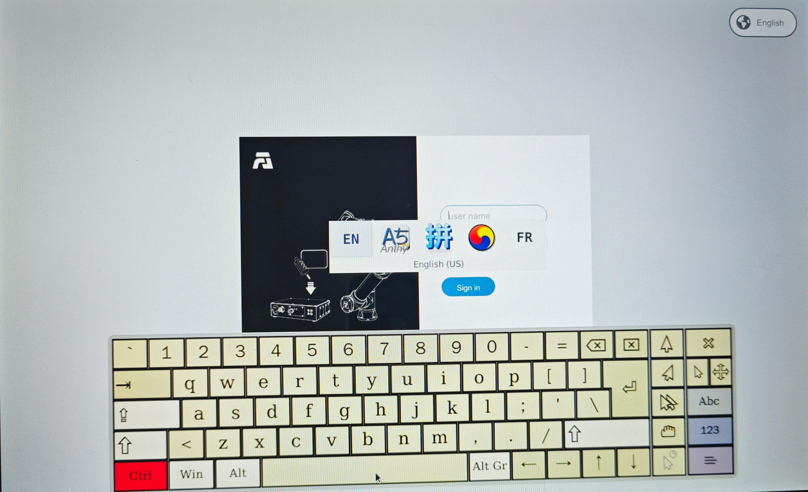

Teach pendant
===============

.. toctree::
   :maxdepth: 6

Teach pendant activation
----------------------------

1. Connect the control box to the teach pendant and start it.

2. Log in with the account admin and password 123. Enter the page, click System Settings-General Settings, and confirm that the teach pendant is enabled.

.. centered:: Figure 16.1‑1 Teaching pendant activation status

Teach pendant multi-language setting
--------------------------------------

1. On the login interface (or the first activation interface), select the language in the upper right corner.

.. image:: teach_pendant/002.png
   :width: 6in
   :align: center

.. centered:: Figure 16.2‑1 Activation interface language setting

.. image:: teach_pendant/003.png
   :width: 6in
   :align: center

.. centered:: Figure 16.2‑2 Login interface language setting

2. Taking the login interface multi-language setting as an example, select the language. If the following prompt (corresponding to different languages) appears, the setting is successful. Restart the control box to complete the language setting.

.. image:: teach_pendant/004.png
   :width: 6in
   :align: center

.. centered:: Figure 16.2‑3 Set Chinese

.. image:: teach_pendant/005.png
   :width: 6in
   :align: center

.. centered:: Figure 16.2‑4 Set English

Input method switch
++++++++++++++++++++++++++++++

The default input method is English input method.

1. Open the soft keyboard in the lower right corner and click the input box, such as the user name input box.

2. Switch to Chinese Pinyin input method.

Click the CTRL key twice, the key status turns red, and click the spacebar to select the input method. The following is the Chinese input method.

.. image:: teach_pendant/006.png
   :width: 6in
   :align: center

.. centered:: Figure 16.2‑5 Chinese Pinyin Input Method

3. Switch to English Input Method

Click the CTRL key twice, the key status turns red, click the spacebar to select the input method, the following is the English input method.

.. centered:: Figure 16.2‑6 English Input Method

After successful login, the system will load the model and other data, and enter the initial page after loading.