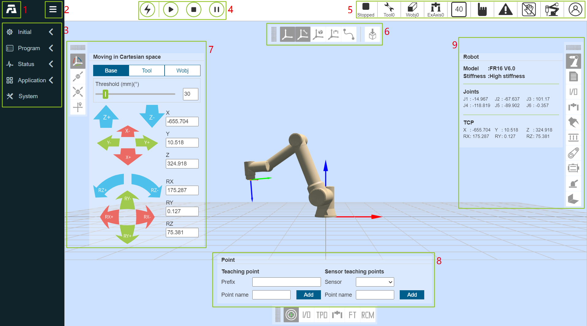
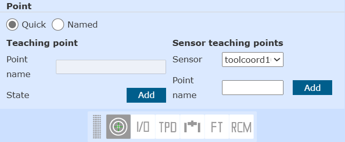
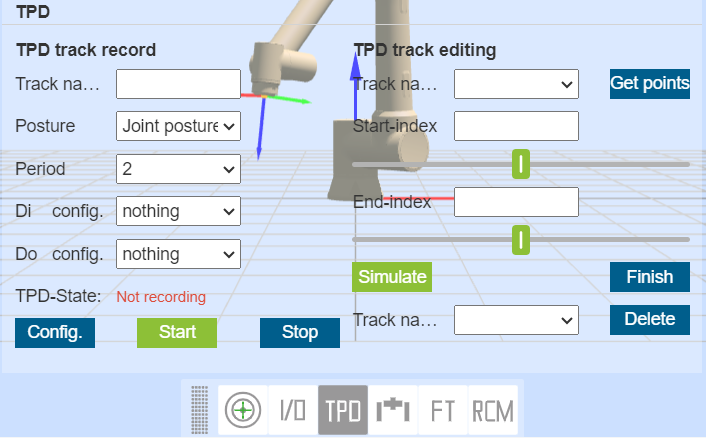
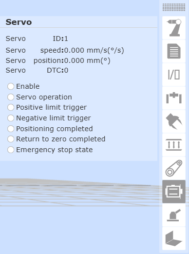

Teaching pendant software
=====================================

.. toctree:: 
   :maxdepth: 6

Basic information
-------------------

Introduction
~~~~~~~~~~~~~~

The teaching pendant software is the supporting software developed for the robot and runs on the teaching pendant operating system. Its main functions and technical characteristics are as follows:

-  Ability to write teaching programs for robots;
-  It can display the coordinates of the robot's position in real time, simulate the physical robot in three dimensions, and control the movement of the robot;
-  It can realize single-axis inching and linkage operation of each axis of the robot;
-  Able to view control IO status;
-  Users can modify passwords, view system information, etc.

Robot's first activation 
~~~~~~~~~~~~~~~~~~~~~~~~~~~~~~~~~~~~~~~~

1. Power on the control box and connect the Ethernet cable to the PC.

2. Open a web browser on the PC and visit the target website 192.168.58.2; the robot will enter the activation page upon first power-up.

.. figure:: teaching_pendant_software/334.png
   :width: 4in
   :align: center

.. centered:: Figure 5.1-1 Activation Interface

3. Enter the correct SN code of the device box and click the "Activate" button after input is complete.
   
4. The system will verify your SN code. If the input is correct, the activation process will be completed automatically.

.. centered:: Figure 5.1-2 Activation Success Interface

5. After successful activation, please manually restart the control box.
   
6. After restarting, visit the target website 192.168.58.2 again to enter the login page.

.. figure:: teaching_pendant_software/001.png
   :width: 6in
   :align: center

.. centered:: Figure 5.1-3 Login Page

Start software
~~~~~~~~~~~~~~~~

1. Power on the control box;
2. The teach pendant opens a browser to access the target website 192.168.58.2;
3. Enter the user name and password and click Login to log in to the system.

User login and permission update
~~~~~~~~~~~~~~~~~~~~~~~~~~~~~~~~~~~~~

.. centered:: Table 5.1-1 Initial user

.. list-table::
   :widths: 70 70 70 70
   :header-rows: 0
   :align: center

   * - **Job number**
     - **Initial username**
     - **Password**
     - **Function code**

   * - 111
     - admin
     - 123
     - 1

   * - 222
     - MEenginer
     - 222
     - 2

   * - 333
     - PEenginer
     - 333
     - 3
   
   * - 444
     - programmer
     - 444
     - 4
   
   * - 555
     - operator
     - 555
     - 5

   * - 666
     - monitor
     - 666
     - 6

Users (refer to 15.2.1 User Management for user management) are divided into six levels by default, administrators have no function restrictions, operators and monitors can use a small number of functions, ME engineers, PE&PQE engineers and technicians & team leaders have some function restrictions, management There are no functional restrictions for administrators. For specific default function code permissions, refer to 15.2.2 Authority management. 

The login interface is shown in figure below.

.. figure:: teaching_pendant_software/001.png
   :width: 6in
   :align: center

.. centered:: Figure 5.1-4 Login Interface

After the login is successful, the system will load the model and other data, and enter the initial page after loading.

System initial interface
----------------------------

After the login is successful, the system enters the "Initial". Mainly include:

- 1. FAIRINO LOGO;
- 2. Menu bar zoom button;
- 3. Menu bar;
- 4. Robot control area;
- 5. Robot status area;
- 6. 3D simulation robot - 3D scene operation;
- 7. 3D simulation robot - robot body operation;
- 8. Robot supporting functions;
- 9. Robot and supporting function status.

The initial interface of the system is shown in the figure below:

.. centered:: Figure 5.2-1 Schematic diagram of the initial interface of the system

Control area
~~~~~~~~~~~~~~~

.. note:: 
   .. image:: teaching_pendant_software/003.png
      :width: 0.75in
      :height: 0.75in
      :align: left

   name:**Enable button**
   
   effect:Enable the robot

.. note:: 
   .. image:: teaching_pendant_software/004.png
      :width: 0.75in
      :height: 0.75in
      :align: left

   name:**Start button**
   
   effect:Upload and start running the teaching program

.. note:: 
   .. image:: teaching_pendant_software/005.png
      :width: 0.75in
      :height: 0.75in
      :align: left

   name:**Stop button**
   
   effect:Stop the current teaching program running

.. note:: 
   .. image:: teaching_pendant_software/006.png
      :width: 0.75in
      :height: 0.75in
      :align: left

   name:**Pause/Resume button**
   
   effect:Pause and resume the current teaching program

.. important::
   The pause instruction is at the end of the program and cannot be judged.

Status Bar
~~~~~~~~~~~~

.. note:: 
   .. image:: teaching_pendant_software/007.png
      :width: 0.75in
      :height: 0.75in
      :align: left

   name:**robot status**
   
   effect:Stopped-stop,Running-run,Pause-pause,Drag-drag

.. note:: 
   .. image:: teaching_pendant_software/008.png
      :width: 0.75in
      :height: 0.75in
      :align: left

   name:**Tool coordinate system number**
   
   effect:Display the tool coordinate system number of the current application

.. note:: 
   .. image:: teaching_pendant_software/027.png
      :width: 0.75in
      :height: 0.75in
      :align: left

   name: **Workpiece coordinate system number**
   
   effect: Display the workpiece coordinate system number currently applied

.. note:: 
   .. image:: teaching_pendant_software/028.png
      :width: 0.75in
      :height: 0.75in
      :align: left

   name: **Extended axis coordinate system number**
   
   effect: Displays the currently applied extended axis coordinate system number
   
.. note:: 
   .. image:: teaching_pendant_software/009.png
      :width: 0.75in
      :height: 0.75in
      :align: left

   name:**Running speed percentage**
   
   effect:The speed of the robot when it is running in the current mode

.. note:: 
   .. image:: teaching_pendant_software/010.png
      :width: 0.75in
      :height: 0.75in
      :align: left

   name:**Runn normally**
   
   effect:The current robot is running normally

.. note:: 
   .. image:: teaching_pendant_software/011.png
      :width: 0.75in
      :height: 0.75in
      :align: left

   name:**Error state**
   
   effect:There is an error in the current robot operation

.. note:: 
   .. image:: teaching_pendant_software/012.png
      :width: 0.75in
      :height: 0.75in
      :align: left

   name:**automatic mode**
   
   effect:Robot automatic operation mode.When the global speed adjustment in manual mode and automatic mode is turned on and the speed is specified, the global speed will be automatically adjusted to the specified speed

.. note:: 
   .. image:: teaching_pendant_software/013.png
      :width: 0.75in
      :height: 0.75in
      :align: left

   name:**Teach mode**
   
   effect:Robot teaching operation mode, set the global speed adjustment of manual mode and automatic mode and specify the speed.

.. note:: 
   .. image:: teaching_pendant_software/014.png
      :width: 0.75in
      :height: 0.75in
      :align: left

   name:**Drag state**
   
   effect:The current robot can drag

.. note:: 
   .. image:: teaching_pendant_software/015.png
      :width: 0.75in
      :height: 0.75in
      :align: left

   name:**Drag state**
   
   effect:The current robot is not draggable

.. note:: 
   .. image:: teaching_pendant_software/017.png
      :width: 0.75in
      :height: 0.75in
      :align: left

   name:**Connection status**
   
   effect:Robot connected

.. note:: 
   .. image:: teaching_pendant_software/016.png
      :width: 0.75in
      :height: 0.75in
      :align: left

   name:**Not connected status**
   
   effect:Robot not connected

.. note:: 
   .. image:: teaching_pendant_software/018.png
      :width: 0.75in
      :height: 0.75in
      :align: left

   name:**Account information**
   
   effect:Display username and permissions and logout user

Menu Bar
~~~~~~~~~~~~

The menu bar is as shown in table below.

.. centered:: Table 5.2-1 Teach pendant menu column

+-------------+----------------+
| first level |  second level  |
+=============+================+
| Initial     | Base           |
+-------------+----------------+
|             | Safety         |
+-------------+----------------+
|             | Peripheral     |
+-------------+----------------+
| Program     | Coding         |
+-------------+----------------+
|             | Graphical      |
+-------------+----------------+
|             | Node Graph     |
+-------------+----------------+
|             | Points         |
+-------------+----------------+
| Status      | Log            |
+-------------+----------------+
|             | Query          |
+-------------+----------------+
| Application | Tool App       |
+-------------+----------------+
|             | Welding expert |
+-------------+----------------+
| System      | /              |
+-------------+----------------+

3D simulation robot
---------------------

3D scene operation bar
~~~~~~~~~~~~~~~~~~~~~~~~~~~~~~~~~~~~~~~~~~~~~

3D visualization display of robot coordinate system
++++++++++++++++++++++++++++++++++++++++++++++++++++++

Create various 3D virtual coordinate systems in the 3D virtual area of the WebAPP robot, taking the display of the base coordinate system as an example, as shown in the figure below. Among them, the X axis is red, the Y axis is green, and the Z axis is blue.

.. note:: 
   .. image:: teaching_pendant_software/021.png
      :width: 0.75in
      :height: 0.75in
      :align: left

   name:**Base coordinate system**
   
   explain: In the base coordinate system WebAPP, the system robot is displayed in the three-dimensional virtual area by default, and the fixed mark is at the bottom center of the robot base. The 3D virtual base coordinate system can be displayed manually.

.. note:: 
   .. image:: teaching_pendant_software/022.png
      :width: 0.75in
      :height: 0.75in
      :align: left

   name:**Tool coordinate system**
   
   explain: The display of the tool coordinate system is enabled by default and can be manually disabled. After the WebAPP starts and the user logs in successfully, obtain the tool coordinate system name and corresponding parameter data of the current application, and initialize the current tool coordinate system.

.. important:: 
   When applying other tool coordinate systems during use, after the application tool coordinate system command succeeds, first clear the existing tool coordinate system in the robot's 3D virtual area, and then transfer the newly applied tool coordinate system parameter data into the 3D coordinate system The API is generated to generate the tool coordinate system, and after the generation is completed, it is displayed in the three-dimensional virtual area of the robot.

.. note:: 
   .. image:: teaching_pendant_software/023.png
      :width: 0.75in
      :height: 0.75in
      :align: left

   name:**Workpiece coordinate system**
   
   explain: The workpiece coordinate system is closed by default, and it can be displayed manually. The process is consistent with the tool coordinate system.

.. note:: 
   .. image:: teaching_pendant_software/024.png
      :width: 0.75in
      :height: 0.75in
      :align: left

   name:**External Axis Coordinate System**
   
   explain: The workpiece coordinate system is closed by default, and it can be displayed manually. The process is consistent with the tool coordinate system.

3D virtual trajectory and import tool model
++++++++++++++++++++++++++++++++++++++++++++++++

.. note:: 
   .. image:: teaching_pendant_software/020.png
      :width: 0.75in
      :height: 0.75in
      :align: left

   name:**Trajectory drawing**
   
   explain: Click the button to turn on the trajectory drawing function. When running the teaching program, the robot 3D model will depict the trajectory of the robot's movement.

.. note:: 
   .. image:: teaching_pendant_software/029.png
      :width: 0.75in
      :height: 0.75in
      :align: left

   name:**Import tool model**
   
   explain: Click the button to pop up the import tool model modal window. After the uploaded file is successfully imported, the tool model can be displayed at the end of the robot. Currently supported tool model file formats are STL and DAE.

Robot body operation bar
~~~~~~~~~~~~~~~~~~~~~~~~~~~

TCP
++++++++++++++++

**Base Jog**: In the base coordinate system, you can click the corresponding coordinate system button to control the robot, move in a straight line on the X, Y, and Z axes or rotate around RX, RY, and RZ. The function of Base jogging is similar to that of single-axis jogging in Joint motion. As shown in figure below.

.. image:: teaching_pendant_software/030.png
   :width: 3in
   :align: center

.. centered:: Figure 5.3-1 Base jog diagram
   
.. important:: 
   The button can be released at any time to stop the robot. If necessary, press the emergency stop button to stop the robot.

**Tool Jog**: Select the tool coordinate system, you can click the corresponding coordinate system button to control the robot, move in a straight line on the X, Y, and Z axes or rotate around RX, RY, and RZ. The function of Tool jogging is similar to that of single-axis jogging in Joint motion. As shown in figure below. 

.. image:: teaching_pendant_software/031.png
   :width: 3in
   :align: center

.. centered:: Figure 5.3-2 Tool Jogging Schematic Diagram

**Wobj Jog**: Select workpiece jogging, you can operate the circular buttons on the left and right to control the robot. In the workpiece coordinate system, move along the X, Y, Z axis in a straight line or rotate around RX, RY, RZ. The function of Wobj jogging is similar to that of single-axis jogging in Joint motion. As shown in figure below. 

.. image:: teaching_pendant_software/032.png
   :width: 3in
   :align: center

.. centered:: Figure 5.3-3 Wobj jogging diagram

Joint Jog
++++++++++++++++

Under Joint operation, the 6 slider bars in the middle represent the angles of the corresponding axes respectively, and the joint movement is divided into single-axis inching and multi-axis linkage

**single axis jog**:The user can control the movement of the robot by operating the left and right circular buttons, as shown in figure below. In the manual mode and the joint coordinate system, perform a rotation operation on a joint of the robot. When the robot stops beyond the range of motion (soft limit), you can use single-axis jogging for manual operation to move the robot out of the overrun position. Single-axis jogging is faster and more convenient than other operation modes for rough positioning and large-scale movement.

.. image:: teaching_pendant_software/033.png
   :width: 3in
   :align: center

.. centered:: Figure 5.3-4 Schematic diagram of single-axis jogging

.. important:: 
   Set the "long press movement threshold" (the maximum distance the robot can run when the button is long pressed, and the input value range is 0~300) parameters, long press the round button to control the robot running, if the button is released during the robot running, the robot will stop immediately Movement, if you keep pressing the button without releasing it, the robot will run and stop moving after long pressing the value set by the movement threshold.

**Multi-axis linkage**:The user can operate the six sliders in the middle to adjust the corresponding target position of the robot, as shown in figure below. The target position can be determined by observing the 3D virtual robot. If the adjusted position does not meet your expectations, click the "Restore" button. Make the 3D virtual robot return to the initial position. After the user determines the target position, he can click the "Apply" button, and the physical robot will perform corresponding movements.

.. centered:: Figure 5.3-5 Schematic diagram of multi-axis linkage

.. important:: 
   In multi-axis linkage, the setting value of the fifth joint j5 cannot be less than 0.01 degrees. If the expected value is less than 0.01 degrees, you can first set it to 0.011 degrees, and then fine-tune the fifth joint j5 through single-axis jogging.

Move
++++++++++++++++

Select Move, you can directly input the Cartesian coordinate value, click "Calculate joint position", the joint position is displayed as the calculated result, confirm that there is no danger, you can click "Move to this point" to control the robot to move to the input Cartesian pose.

.. centered:: Figure 5.3-6 Move mobile diagram

.. important:: 
   When a given pose cannot be reached, first check whether the Cartesian space pose exceeds the working range of the robot, and then check whether there is a singular pose in the process from the current pose to the target pose, if there is a singular position, adjust the current pose or process insert a new pose in order to avoid singular poses.

Robot supporting function bar
~~~~~~~~~~~~~~~~~~~~~~~~~~~~~~~~~~~~~~~~~~~~

Teaching point record
+++++++++++++++++++++++++++

The manual teaching control area is mainly to set the test coordinate system in the teaching mode, and display the angle and coordinate values of each axis of the robot in real time, and can name and save the teaching points.

When saving a teaching point, the coordinate system of the teaching point is the coordinate system of the current robot application. 

For the sensor teaching point, select the calibrated sensor type tool, enter the point name, click Add, and the saved point position is the position recognized by the sensor.

.. centered:: Figure 5.3‑7 Schematic diagram of manual operation area

.. important:: 
   When using it for the first time, please set a small speed value like 30 to familiarize yourself with the movement of the robot to avoid accidents

I/O
++++++++++++++++

In this interface, the digital output, analog output (0-10v) and end tool digital output in the robot control box can be realized. Output, analog output (0-10v) for manual control. As shown in figure below.

- DO operation: select the port number, if the DO is low level, the right operation button will display ON, click the button to set the DO to high level.

- AO operation: Select the port number, enter a value (0-100) in the input box on the right, the value is a percentage, setting 100 means setting the AO port to 10v.

.. image:: teaching_pendant_software/037.png
   :width: 5in
   :align: center

.. centered:: Figure 5.3‑8 I/O

TPD (Teach-in programming)
++++++++++++++++++++++++++++++++

The operation steps of teach programming (TPD) function are as follows:

- **Step1 record initial position**:Enter the operation area on the left side of the 3D model and record the current position of the robot. Set the name of the point in the edit box, click the "Save" button, if the save is successful, it will prompt "Save point successful";

- **Step2 Configure track recording parameters**:Click TPD to enter the "TPD" function item to configure trajectory recording parameters, set the name of the trajectory file, pose type and sampling period, configure DI and DO, and record the corresponding output by triggering DI during the process of recording the TPD trajectory DO, as Figure3.6-8;

.. centered:: Figure 5.3‑9 TPD track record

- **Step3 Check robot mode**:Check whether the robot mode is in manual mode. If not, switch to manual mode. In manual mode, there are two ways to switch to drag teaching mode, one is long press the end button, and the other is interface dragging mode It is recommended to switch the robot from the interface to the drag teaching mode in the TPD record. As shown in Figure 4.6-9;

.. image:: teaching_pendant_software/039.png
   :width: 3in
   :align: center

.. centered:: Figure 5.3‑10 robot mode

.. important:: 
   When switching to the drag mode from the interface, first confirm whether the end tool load and the center of mass are set correctly, and whether the friction compensation coefficient is set reasonably, then press and hold the end button to confirm whether the drag is normal, and then switch to the drag mode from the interface after confirming that it is correct.

- **Step4 start recording**:Click the "Start Recording" button to start track recording, and drag the robot to teach actions. In addition, there is a "TPD recording start/stop" function configuration item in the terminal DI configuration. By configuring this function, the user can trigger the "start recording" trace function through an external signal. It should be noted that to start recording a trace through an external signal, first Configure the TPD track information on the page first.

- **Step5 stop recording**:After the action teaching is completed, click the "Stop Recording" button to stop the track recording, and then drag the teaching switch button to make the robot exit the drag teaching mode. When the teach pendant receives "stop track recording successful", it means the track recording is successful. Same as step 4, after configuring the "TPD recording start/stop" function, you can trigger the recording to stop by an external signal.

- **Step6 teach programming**:Click New, select a blank template, click to enter the PTP function programming item, select the initial position point just saved, click the "Add" button, after the application is completed, a PTP instruction will be displayed in the program file; then click to enter the TPD function programming item, Select the track just recorded, set whether it is smooth and the speed scaling, click the "Add" button, after the application is completed, a MoveTPD instruction will be displayed in the program file, as shown in Figure 3.6-10;

.. image:: teaching_pendant_software/040.png
   :width: 5in
   :align: center

.. centered:: Figure 5.3‑11 TPD programming

- **Step7 Trajectory recurrence**:After editing the teaching program, switch to the automatic operation mode, click the "start running" icon on the top of the interface to start running the program, and the robot will start to reproduce the teaching action.

- **Step8 track edit**:The TPD track editing area can visually display and edit the track to achieve pre-analysis and streamlining of the TPD track. Select the corresponding track acquisition point, then the track points recorded by the user will be displayed in the three-dimensional space of the robot, and then the user can drag the "Start" and "End" scroll bars to simulate and reproduce and edit the start and end points of the track.

TPD file deletion and exception handling:

- **Trajectory file deletion**:Click to enter the TPD function item, select the track file to be deleted, and click the "Delete Track" button. If the deletion is successful, you will receive a successful deletion prompt.

- **Exception handling:**

  +  **Command points exceeded**:A track can record up to 20,000 points. When the number exceeds 20,000 points, the controller will no longer record the exceeded points, and will send a warning to the teach pendant that the number of command points exceeds the limit. At this time, you need to click to stop recording;

  +  **TPD instruction interval is too large**:If the teaching pendant reports an error that the TPD command interval is too large, check whether the robot has returned to the initial position before recording. If the robot returns to the initial position and still reports an error that the TPD command interval is too large, delete the current track and record a new one;

  +  If other abnormal conditions occur during TPD operation, the robot operation should be stopped immediately through the teach pendant or the emergency stop button to check the cause.

.. important:: 
   During the operation of the TPD function, you should strictly follow the corresponding prompts on the teach pendant.

Eaxis move
++++++++++++++++

Select Eaxis to move, this function is the jog function of the extension axis, it needs to be configured to configure the extension axis, use this jog function to control the extension axis, see "Chapter 4 Machine-Robot Peripherals-Extended Axis Peripherals" for details configuration".

.. image:: teaching_pendant_software/041.png
   :width: 5in
   :align: center

.. centered:: Figure 5.3-12 Eaxis Mobile Diagram

FT
++++++++++++++++

Select the reference frame as a reference for the force sensor when dragging.

.. image:: teaching_pendant_software/042.png
   :width: 5in
   :align: center

.. centered:: Figure 5.3‑12 FT diagram

Telecentric fixed point
++++++++++++++++++++++++++++++++

This function is mainly used in medical penetration. After setting the telecentric fixed point, the robot end always moves at this point.

.. image:: teaching_pendant_software/043.png
   :width: 5in
   :align: center

.. centered:: Figure 5.3‑13 Schematic diagram of telecentric fixed point

Robot and supporting function status bar
~~~~~~~~~~~~~~~~~~~~~~~~~~~~~~~~~~~~~~~~~~~~~~~~~~

Robot
++++++++++++++++

Displays the current robot model, stiffness, joints and coordinate data information.

.. image:: teaching_pendant_software/044.png
   :width: 3in
   :align: center

.. centered:: Figure 5.3‑14 Robot Status

Program
++++++++++++++++

Display information about the currently running program and subprogram.

.. image:: teaching_pendant_software/045.png
   :width: 3in
   :align: center

.. centered:: Figure 5.3‑15 Program Status

I/O
++++++++++++++++

The status display area on the right side of the 3D model will display the current IO status. In digital input and digital output, if the port level is high, the point will be displayed in green, and if it is low, it will be displayed in white; analog input and analog output The display value is 0-100, and 100 means 10v.

.. image:: teaching_pendant_software/046.png
   :width: 3in
   :align: center

.. centered:: Figure 5.3‑16 IO Status

ExAxis
++++++++++++++++

Display the current extended axis (controller + PLC) servo status information.

.. centered:: Figure 5.3‑17 Extended axis (controller + PLC) status

Gripper
++++++++++++++++

Displays the current gripper status information.

.. centered:: Figure 5.3‑18 Gripper status

FT
++++++++++++++++

Display current force control status information.

.. image:: teaching_pendant_software/049.png
   :width: 3in
   :align: center

.. centered:: Figure 5.3‑19 Force control state

Convery
++++++++++++++++

Displays current conveyor status information.

.. image:: teaching_pendant_software/050.png
   :width: 3in
   :align: center

.. centered:: Figure 5.3‑20 Conveyor Belt Status

Servo
++++++++++++++++

Displays the current extended axis (controller + servo controller) status information.

.. centered:: Figure 5.3‑21 Extended axis (controller + servo controller) status

Polish
++++++++++++++++

Display current grinding status information.

.. image:: teaching_pendant_software/052.png
   :width: 3in
   :align: center

.. centered:: Figure 5.3‑22 Polishing status

Weld
++++++++++++++++

Display current welding status information.

.. image:: teaching_pendant_software/053.png
   :width: 3in
   :align: center

.. centered:: Figure 5.3‑23 Welding status

Robot installation method setting and display
~~~~~~~~~~~~~~~~~~~~~~~~~~~~~~~~~~~~~~~~~~~~~~~

The default installation mode of the robot is horizontal installation. When the installation mode of the robot is changed, the actual installation mode of the robot must be set in the "Initial - Base - Mounting" menu in time to ensure the normal operation of the robot.

The user clicks the "Fixed" option under the "Initial - Base - Mounting" menu to enter the robot fixed installation mode setting page, selects "Upright Installation", "Inverted Installation" or "Side Installation", and clicks the "Apply" button to complete the robot installation mode setting.

.. centered:: Figure 5.3-24 Fixed installation

Considering the more flexible and rich robot deployment scenarios, we provide a free installation function. Users click the "Free" tab under the "Initial - Base - Mounting" menu to enter the robot free installation mode setting page. Manually adjust the "Base Tilt" and "Base Rotation" angles, and the 3D model will display the installation effect accordingly. After modification, click the "Apply" button to complete the robot installation mode setting.

.. image:: teaching_pendant_software/026.png
   :width: 6in
   :align: center
   
.. centered:: Figure 5.3-25 360 degree free installation

.. important:: 
   After the installation of the robot is completed, the installation method of the robot must be set correctly, otherwise it will affect the use of the robot's dragging function and collision detection function.
