Teaching pendant software
=====================================

.. toctree:: 
   :maxdepth: 6

Basic information
-------------------

Introduction
~~~~~~~~~~~~~~

The teaching pendant software is the supporting software developed for the robot and runs on the teaching pendant operating system. Its main functions and technical characteristics are as follows:

-  Ability to write teaching programs for robots;
-  It can display the coordinates of the robot's position in real time, simulate the physical robot in three dimensions, and control the movement of the robot;
-  It can realize single-axis inching and linkage operation of each axis of the robot;
-  Able to view control IO status;
-  Users can modify passwords, view system information, etc.

Robot's first activation 
~~~~~~~~~~~~~~~~~~~~~~~~~~~~~~~~~~~~~~~~

1. Power on the control box and connect the Ethernet cable to the PC.

2. Open a web browser on the PC and visit the target website 192.168.58.2; the robot will enter the activation page upon first power-up.

.. centered:: Figure 5.1-1 Activation Interface

3. Enter the correct SN code of the device box and click the "Activate" button after input is complete.
   
4. The system will verify your SN code. If the input is correct, the activation process will be completed automatically.

.. figure:: teaching_pendant_software/335.png
   :width: 4in
   :align: center

.. centered:: Figure 5.1-2 Activation Success Interface

5. After successful activation, please manually restart the control box.
   
6. After restarting, visit the target website 192.168.58.2 again to enter the login page.

.. figure:: teaching_pendant_software/001.png
   :width: 6in
   :align: center

.. centered:: Figure 5.1-3 Login Page

Start software
~~~~~~~~~~~~~~~~

1. Power on the control box;
2. The teach pendant opens a browser to access the target website 192.168.58.2;
3. Enter the user name and password and click Login to log in to the system.

User login and permission update
~~~~~~~~~~~~~~~~~~~~~~~~~~~~~~~~~~~~~

.. centered:: Table 5.1-1 Initial user

.. list-table::
   :widths: 70 70 70 70
   :header-rows: 0
   :align: center

   * - **Job number**
     - **Initial username**
     - **Password**
     - **Function code**

   * - 111
     - admin
     - 123
     - 1

   * - 222
     - MEenginer
     - 222
     - 2

   * - 333
     - PEenginer
     - 333
     - 3
   
   * - 444
     - programmer
     - 444
     - 4
   
   * - 555
     - operator
     - 555
     - 5

   * - 666
     - monitor
     - 666
     - 6

Users (refer to 15.2.1 User Management for user management) are divided into six levels by default, administrators have no function restrictions, operators and monitors can use a small number of functions, ME engineers, PE&PQE engineers and technicians & team leaders have some function restrictions, management There are no functional restrictions for administrators. For specific default function code permissions, refer to 15.2.2 Authority management. 

The login interface is shown in figure below.

.. figure:: teaching_pendant_software/001.png
   :width: 6in
   :align: center

.. centered:: Figure 5.1-4 Login Interface

After the login is successful, the system will load the model and other data, and enter the initial page after loading.

System initial interface
----------------------------

After the login is successful, the system enters the "Initial". Mainly include:

- 1. FAIRINO LOGO;
- 2. Menu bar zoom button;
- 3. Menu bar;
- 4. Robot control area;
- 5. Robot status area;
- 6. 3D simulation robot - 3D scene operation;
- 7. 3D simulation robot - robot body operation;
- 8. Robot supporting functions;
- 9. Robot and supporting function status.

The initial interface of the system is shown in the figure below:

.. image:: teaching_pendant_software/002.png
   :align: center
   :width: 6in
.. centered:: Figure 5.2-1 Schematic diagram of the initial interface of the system

Control area
~~~~~~~~~~~~~~~

.. note:: 
   .. image:: teaching_pendant_software/003.png
      :width: 0.75in
      :height: 0.75in
      :align: left

   name:**Enable button**
   
   effect:Enable the robot

.. note:: 
   .. image:: teaching_pendant_software/004.png
      :width: 0.75in
      :height: 0.75in
      :align: left

   name:**Start button**
   
   effect:Upload and start running the teaching program

.. note:: 
   .. image:: teaching_pendant_software/005.png
      :width: 0.75in
      :height: 0.75in
      :align: left

   name:**Stop button**
   
   effect:Stop the current teaching program running

.. note:: 
   .. image:: teaching_pendant_software/006.png
      :width: 0.75in
      :height: 0.75in
      :align: left

   name:**Pause/Resume button**
   
   effect:Pause and resume the current teaching program

.. important::
   The pause instruction is at the end of the program and cannot be judged.

Status Bar
~~~~~~~~~~~~

.. note:: 
   .. image:: teaching_pendant_software/007.png
      :width: 0.75in
      :height: 0.75in
      :align: left

   name:**robot status**
   
   effect:Stopped-stop,Running-run,Pause-pause,Drag-drag

.. note:: 
   .. image:: teaching_pendant_software/008.png
      :width: 0.75in
      :height: 0.75in
      :align: left

   name:**Tool coordinate system number**
   
   effect:Display the tool coordinate system number of the current application

.. note:: 
   .. image:: teaching_pendant_software/027.png
      :width: 0.75in
      :height: 0.75in
      :align: left

   name: **Workpiece coordinate system number**
   
   effect: Display the workpiece coordinate system number currently applied

.. note:: 
   .. image:: teaching_pendant_software/028.png
      :width: 0.75in
      :height: 0.75in
      :align: left

   name: **Extended axis coordinate system number**
   
   effect: Displays the currently applied extended axis coordinate system number
   
.. note:: 
   .. image:: teaching_pendant_software/009.png
      :width: 0.75in
      :height: 0.75in
      :align: left

   name:**Running speed percentage**
   
   effect:The speed of the robot when it is running in the current mode

.. note:: 
   .. image:: teaching_pendant_software/010.png
      :width: 0.75in
      :height: 0.75in
      :align: left

   name:**Runn normally**
   
   effect:The current robot is running normally

.. note:: 
   .. image:: teaching_pendant_software/011.png
      :width: 0.75in
      :height: 0.75in
      :align: left

   name:**Error state**
   
   effect:There is an error in the current robot operation

.. note:: 
   .. image:: teaching_pendant_software/012.png
      :width: 0.75in
      :height: 0.75in
      :align: left

   name:**automatic mode**
   
   effect:Robot automatic operation mode.When the global speed adjustment in manual mode and automatic mode is turned on and the speed is specified, the global speed will be automatically adjusted to the specified speed

.. note:: 
   .. image:: teaching_pendant_software/013.png
      :width: 0.75in
      :height: 0.75in
      :align: left

   name:**Teach mode**
   
   effect:Robot teaching operation mode, set the global speed adjustment of manual mode and automatic mode and specify the speed.

.. note:: 
   .. image:: teaching_pendant_software/014.png
      :width: 0.75in
      :height: 0.75in
      :align: left

   name:**Drag state**
   
   effect:The current robot can drag

.. note:: 
   .. image:: teaching_pendant_software/015.png
      :width: 0.75in
      :height: 0.75in
      :align: left

   name:**Drag state**
   
   effect:The current robot is not draggable

.. note:: 
   .. image:: teaching_pendant_software/017.png
      :width: 0.75in
      :height: 0.75in
      :align: left

   name:**Connection status**
   
   effect:Robot connected

.. note:: 
   .. image:: teaching_pendant_software/016.png
      :width: 0.75in
      :height: 0.75in
      :align: left

   name:**Not connected status**
   
   effect:Robot not connected

.. note:: 
   .. image:: teaching_pendant_software/018.png
      :width: 0.75in
      :height: 0.75in
      :align: left

   name:**Account information**
   
   effect:Display username and permissions and logout user

Menu Bar
~~~~~~~~~~~~

The menu bar is as shown in table below.

.. centered:: Table 5.2-1 Teach pendant menu column

+-------------+----------------+
| first level |  second level  |
+=============+================+
| Initial     | Base           |
+-------------+----------------+
|             | Safety         |
+-------------+----------------+
|             | Peripheral     |
+-------------+----------------+
| Program     | Coding         |
+-------------+----------------+
|             | Graphical      |
+-------------+----------------+
|             | Node Graph     |
+-------------+----------------+
|             | Points         |
+-------------+----------------+
| Status      | Log            |
+-------------+----------------+
|             | Query          |
+-------------+----------------+
| Application | Tool App       |
+-------------+----------------+
|             | Welding expert |
+-------------+----------------+
| System      | /              |
+-------------+----------------+

3D simulation robot
---------------------

3D scene operation bar
~~~~~~~~~~~~~~~~~~~~~~~~~~~~~~~~~~~~~~~~~~~~~

3D visualization display of robot coordinate system
++++++++++++++++++++++++++++++++++++++++++++++++++++++

Create various 3D virtual coordinate systems in the 3D virtual area of the WebAPP robot, taking the display of the base coordinate system as an example, as shown in the figure below. Among them, the X axis is red, the Y axis is green, and the Z axis is blue.

.. note:: 
   .. image:: teaching_pendant_software/021.png
      :width: 0.75in
      :height: 0.75in
      :align: left

   name:**Base coordinate system**
   
   explain: In the base coordinate system WebAPP, the system robot is displayed in the three-dimensional virtual area by default, and the fixed mark is at the bottom center of the robot base. The 3D virtual base coordinate system can be displayed manually.

.. note:: 
   .. image:: teaching_pendant_software/022.png
      :width: 0.75in
      :height: 0.75in
      :align: left

   name:**Tool coordinate system**
   
   explain: The display of the tool coordinate system is enabled by default and can be manually disabled. After the WebAPP starts and the user logs in successfully, obtain the tool coordinate system name and corresponding parameter data of the current application, and initialize the current tool coordinate system.

.. important:: 
   When applying other tool coordinate systems during use, after the application tool coordinate system command succeeds, first clear the existing tool coordinate system in the robot's 3D virtual area, and then transfer the newly applied tool coordinate system parameter data into the 3D coordinate system The API is generated to generate the tool coordinate system, and after the generation is completed, it is displayed in the three-dimensional virtual area of the robot.

.. note:: 
   .. image:: teaching_pendant_software/023.png
      :width: 0.75in
      :height: 0.75in
      :align: left

   name:**Workpiece coordinate system**
   
   explain: The workpiece coordinate system is closed by default, and it can be displayed manually. The process is consistent with the tool coordinate system.

.. note:: 
   .. image:: teaching_pendant_software/024.png
      :width: 0.75in
      :height: 0.75in
      :align: left

   name:**External Axis Coordinate System**
   
   explain: The workpiece coordinate system is closed by default, and it can be displayed manually. The process is consistent with the tool coordinate system.

3D virtual trajectory and import tool model
++++++++++++++++++++++++++++++++++++++++++++++++

.. note:: 
   .. image:: teaching_pendant_software/020.png
      :width: 0.75in
      :height: 0.75in
      :align: left

   name:**Trajectory drawing**
   
   explain: Click the button to turn on the trajectory drawing function. When running the teaching program, the robot 3D model will depict the trajectory of the robot's movement.

.. note:: 
   .. image:: teaching_pendant_software/029.png
      :width: 0.75in
      :height: 0.75in
      :align: left

   name:**Import tool model**
   
   explain: Click the button to pop up the import tool model modal window. After the uploaded file is successfully imported, the tool model can be displayed at the end of the robot. Currently supported tool model file formats are STL and DAE.

Robot body operation bar
~~~~~~~~~~~~~~~~~~~~~~~~~~~

TCP
++++++++++++++++

**Base Jog**: In the base coordinate system, you can click the corresponding coordinate system button to control the robot, move in a straight line on the X, Y, and Z axes or rotate around RX, RY, and RZ. The function of Base jogging is similar to that of single-axis jogging in Joint motion. As shown in figure below.

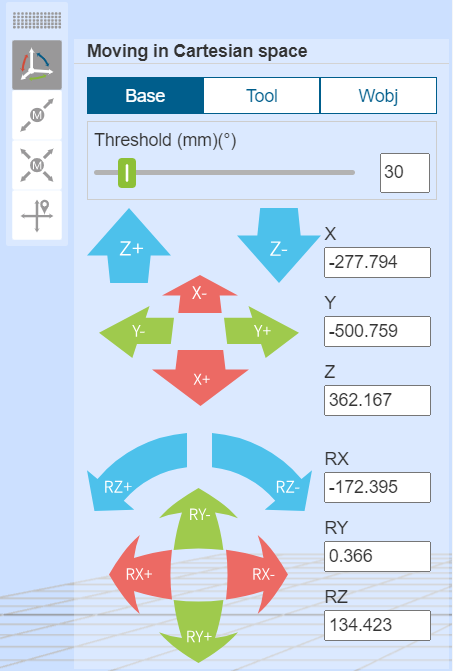

.. centered:: Figure 5.3-1 Base jog diagram
   
.. important:: 
   The button can be released at any time to stop the robot. If necessary, press the emergency stop button to stop the robot.

**Tool Jog**: Select the tool coordinate system, you can click the corresponding coordinate system button to control the robot, move in a straight line on the X, Y, and Z axes or rotate around RX, RY, and RZ. The function of Tool jogging is similar to that of single-axis jogging in Joint motion. As shown in figure below. 

.. image:: teaching_pendant_software/031.png
   :width: 3in
   :align: center

.. centered:: Figure 5.3-2 Tool Jogging Schematic Diagram

**Wobj Jog**: Select workpiece jogging, you can operate the circular buttons on the left and right to control the robot. In the workpiece coordinate system, move along the X, Y, Z axis in a straight line or rotate around RX, RY, RZ. The function of Wobj jogging is similar to that of single-axis jogging in Joint motion. As shown in figure below. 

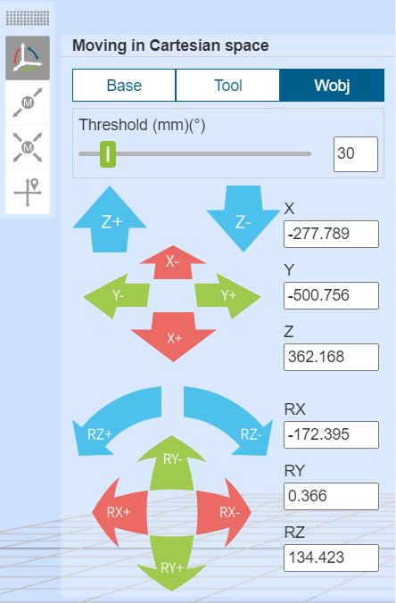

.. centered:: Figure 5.3-3 Wobj jogging diagram

Joint Jog
++++++++++++++++

Under Joint operation, the 6 slider bars in the middle represent the angles of the corresponding axes respectively, and the joint movement is divided into single-axis inching and multi-axis linkage

**single axis jog**:The user can control the movement of the robot by operating the left and right circular buttons, as shown in figure below. In the manual mode and the joint coordinate system, perform a rotation operation on a joint of the robot. When the robot stops beyond the range of motion (soft limit), you can use single-axis jogging for manual operation to move the robot out of the overrun position. Single-axis jogging is faster and more convenient than other operation modes for rough positioning and large-scale movement.

.. image:: teaching_pendant_software/033.png
   :width: 3in
   :align: center

.. centered:: Figure 5.3-4 Schematic diagram of single-axis jogging

.. important:: 
   Set the "long press movement threshold" (the maximum distance the robot can run when the button is long pressed, and the input value range is 0~300) parameters, long press the round button to control the robot running, if the button is released during the robot running, the robot will stop immediately Movement, if you keep pressing the button without releasing it, the robot will run and stop moving after long pressing the value set by the movement threshold.

**Multi-axis linkage**:The user can operate the six sliders in the middle to adjust the corresponding target position of the robot, as shown in figure below. The target position can be determined by observing the 3D virtual robot. If the adjusted position does not meet your expectations, click the "Restore" button. Make the 3D virtual robot return to the initial position. After the user determines the target position, he can click the "Apply" button, and the physical robot will perform corresponding movements.

.. image:: teaching_pendant_software/034.png
   :width: 3in
   :align: center

.. centered:: Figure 5.3-5 Schematic diagram of multi-axis linkage

.. important:: 
   In multi-axis linkage, the setting value of the fifth joint j5 cannot be less than 0.01 degrees. If the expected value is less than 0.01 degrees, you can first set it to 0.011 degrees, and then fine-tune the fifth joint j5 through single-axis jogging.

Move
++++++++++++++++

Select Move, you can directly input the Cartesian coordinate value, click "Calculate joint position", the joint position is displayed as the calculated result, confirm that there is no danger, you can click "Move to this point" to control the robot to move to the input Cartesian pose.

.. image:: teaching_pendant_software/035.png
   :width: 3in
   :align: center

.. centered:: Figure 5.3-6 Move mobile diagram

.. important:: 
   When a given pose cannot be reached, first check whether the Cartesian space pose exceeds the working range of the robot, and then check whether there is a singular pose in the process from the current pose to the target pose, if there is a singular position, adjust the current pose or process insert a new pose in order to avoid singular poses.

Robot supporting function bar
~~~~~~~~~~~~~~~~~~~~~~~~~~~~~~~~~~~~~~~~~~~~

Teaching point record
+++++++++++++++++++++++++++

The manual teaching control area is mainly to set the test coordinate system in the teaching mode, and display the angle and coordinate values of each axis of the robot in real time, and can name and save the teaching points.

When saving a teaching point, the coordinate system of the teaching point is the coordinate system of the current robot application. 

For the sensor teaching point, select the calibrated sensor type tool, enter the point name, click Add, and the saved point position is the position recognized by the sensor.

.. image:: teaching_pendant_software/036.png
   :width: 6in
   :align: center

.. centered:: Figure 5.3‑7 Schematic diagram of manual operation area

.. important:: 
   When using it for the first time, please set a small speed value like 30 to familiarize yourself with the movement of the robot to avoid accidents

I/O
++++++++++++++++

In this interface, the digital output, analog output (0-10v) and end tool digital output in the robot control box can be realized. Output, analog output (0-10v) for manual control. As shown in figure below.

- DO operation: select the port number, if the DO is low level, the right operation button will display ON, click the button to set the DO to high level.

- AO operation: Select the port number, enter a value (0-100) in the input box on the right, the value is a percentage, setting 100 means setting the AO port to 10v.

.. image:: teaching_pendant_software/037.png
   :width: 6in
   :align: center

.. centered:: Figure 5.3‑8 I/O

TPD (Teach-in programming)
++++++++++++++++++++++++++++++++

The operation steps of teach programming (TPD) function are as follows:

- **Step1 record initial position**:Enter the operation area on the left side of the 3D model and record the current position of the robot. Set the name of the point in the edit box, click the "Save" button, if the save is successful, it will prompt "Save point successful";

- **Step2 Configure track recording parameters**:Click TPD to enter the "TPD" function item to configure trajectory recording parameters, set the name of the trajectory file, pose type and sampling period, configure DI and DO, and record the corresponding output by triggering DI during the process of recording the TPD trajectory DO, as Figure3.6-8;

.. image:: teaching_pendant_software/038.png
   :width: 6in
   :align: center

.. centered:: Figure 5.3‑9 TPD track record

- **Step3 Check robot mode**:Check whether the robot mode is in manual mode. If not, switch to manual mode. In manual mode, there are two ways to switch to drag teaching mode, one is long press the end button, and the other is interface dragging mode It is recommended to switch the robot from the interface to the drag teaching mode in the TPD record. As shown in Figure 4.6-9;

.. image:: teaching_pendant_software/039.png
   :width: 3in
   :align: center

.. centered:: Figure 5.3‑10 robot mode

.. important:: 
   When switching to the drag mode from the interface, first confirm whether the end tool load and the center of mass are set correctly, and whether the friction compensation coefficient is set reasonably, then press and hold the end button to confirm whether the drag is normal, and then switch to the drag mode from the interface after confirming that it is correct.

- **Step4 start recording**:Click the "Start Recording" button to start track recording, and drag the robot to teach actions. In addition, there is a "TPD recording start/stop" function configuration item in the terminal DI configuration. By configuring this function, the user can trigger the "start recording" trace function through an external signal. It should be noted that to start recording a trace through an external signal, first Configure the TPD track information on the page first.

- **Step5 stop recording**:After the action teaching is completed, click the "Stop Recording" button to stop the track recording, and then drag the teaching switch button to make the robot exit the drag teaching mode. When the teach pendant receives "stop track recording successful", it means the track recording is successful. Same as step 4, after configuring the "TPD recording start/stop" function, you can trigger the recording to stop by an external signal.

- **Step6 teach programming**:Click New, select a blank template, click to enter the PTP function programming item, select the initial position point just saved, click the "Add" button, after the application is completed, a PTP instruction will be displayed in the program file; then click to enter the TPD function programming item, Select the track just recorded, set whether it is smooth and the speed scaling, click the "Add" button, after the application is completed, a MoveTPD instruction will be displayed in the program file, as shown in Figure 3.6-10;

.. image:: teaching_pendant_software/040.png
   :width: 3in
   :align: center

.. centered:: Figure 5.3‑11 TPD programming

- **Step7 Trajectory recurrence**:After editing the teaching program, switch to the automatic operation mode, click the "start running" icon on the top of the interface to start running the program, and the robot will start to reproduce the teaching action.

- **Step8 track edit**:The TPD track editing area can visually display and edit the track to achieve pre-analysis and streamlining of the TPD track. Select the corresponding track acquisition point, then the track points recorded by the user will be displayed in the three-dimensional space of the robot, and then the user can drag the "Start" and "End" scroll bars to simulate and reproduce and edit the start and end points of the track.

TPD file deletion and exception handling:

- **Trajectory file deletion**:Click to enter the TPD function item, select the track file to be deleted, and click the "Delete Track" button. If the deletion is successful, you will receive a successful deletion prompt.

- **Exception handling:**

  +  **Command points exceeded**:A track can record up to 20,000 points. When the number exceeds 20,000 points, the controller will no longer record the exceeded points, and will send a warning to the teach pendant that the number of command points exceeds the limit. At this time, you need to click to stop recording;

  +  **TPD instruction interval is too large**:If the teaching pendant reports an error that the TPD command interval is too large, check whether the robot has returned to the initial position before recording. If the robot returns to the initial position and still reports an error that the TPD command interval is too large, delete the current track and record a new one;

  +  If other abnormal conditions occur during TPD operation, the robot operation should be stopped immediately through the teach pendant or the emergency stop button to check the cause.

.. important:: 
   During the operation of the TPD function, you should strictly follow the corresponding prompts on the teach pendant.

Eaxis move
++++++++++++++++

Select Eaxis to move, this function is the jog function of the extension axis, it needs to be configured to configure the extension axis, use this jog function to control the extension axis, see "Chapter 4 Machine-Robot Peripherals-Extended Axis Peripherals" for details configuration".

.. image:: teaching_pendant_software/041.png
   :width: 6in
   :align: center

.. centered:: Figure 5.3-12 Eaxis Mobile Diagram

FT
++++++++++++++++

Select the reference frame as a reference for the force sensor when dragging.

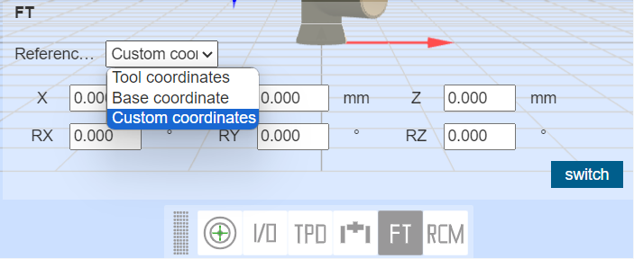

.. centered:: Figure 5.3‑12 FT diagram

Telecentric fixed point
++++++++++++++++++++++++++++++++

This function is mainly used in medical penetration. After setting the telecentric fixed point, the robot end always moves at this point.

.. image:: teaching_pendant_software/043.png
   :width: 6in
   :align: center

.. centered:: Figure 5.3‑13 Schematic diagram of telecentric fixed point

Robot and supporting function status bar
~~~~~~~~~~~~~~~~~~~~~~~~~~~~~~~~~~~~~~~~~~~~~~~~~~

Robot
++++++++++++++++

Displays the current robot model, stiffness, joints and coordinate data information.

.. image:: teaching_pendant_software/044.png
   :width: 3in
   :align: center

.. centered:: Figure 5.3‑14 Robot Status

Program
++++++++++++++++

Display information about the currently running program and subprogram.

.. image:: teaching_pendant_software/045.png
   :width: 3in
   :align: center

.. centered:: Figure 5.3‑15 Program Status

I/O
++++++++++++++++

The status display area on the right side of the 3D model will display the current IO status. In digital input and digital output, if the port level is high, the point will be displayed in green, and if it is low, it will be displayed in white; analog input and analog output The display value is 0-100, and 100 means 10v.

.. centered:: Figure 5.3‑16 IO Status

ExAxis
++++++++++++++++

Display the current extended axis (controller + PLC) servo status information.

.. image:: teaching_pendant_software/047.png
   :width: 3in
   :align: center

.. centered:: Figure 5.3‑17 Extended axis (controller + PLC) status

Gripper
++++++++++++++++

Displays the current gripper status information.

.. image:: teaching_pendant_software/048.png
   :width: 3in
   :align: center

.. centered:: Figure 5.3‑18 Gripper status

FT
++++++++++++++++

Display current force control status information.

.. image:: teaching_pendant_software/049.png
   :width: 3in
   :align: center

.. centered:: Figure 5.3‑19 Force control state

Convery
++++++++++++++++

Displays current conveyor status information.

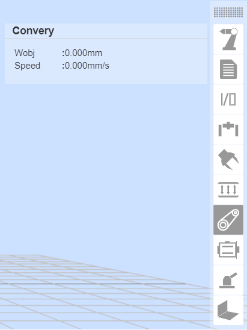

.. centered:: Figure 5.3‑20 Conveyor Belt Status

Servo
++++++++++++++++

Displays the current extended axis (controller + servo controller) status information.

.. image:: teaching_pendant_software/051.png
   :width: 3in
   :align: center

.. centered:: Figure 5.3‑21 Extended axis (controller + servo controller) status

Polish
++++++++++++++++

Display current grinding status information.

.. image:: teaching_pendant_software/052.png
   :width: 3in
   :align: center

.. centered:: Figure 5.3‑22 Polishing status

Weld
++++++++++++++++

Display current welding status information.

.. image:: teaching_pendant_software/053.png
   :width: 3in
   :align: center

.. centered:: Figure 5.3‑23 Welding status

Robot installation method setting and display
~~~~~~~~~~~~~~~~~~~~~~~~~~~~~~~~~~~~~~~~~~~~~~~

The default installation mode of the robot is horizontal installation. When the installation mode of the robot is changed, the actual installation mode of the robot must be set in the "Initial - Base - Mounting" menu in time to ensure the normal operation of the robot.

The user clicks the "Fixed" option under the "Initial - Base - Mounting" menu to enter the robot fixed installation mode setting page, selects "Upright Installation", "Inverted Installation" or "Side Installation", and clicks the "Apply" button to complete the robot installation mode setting.

.. image:: teaching_pendant_software/025.png
   :width: 6in
   :align: center

.. centered:: Figure 5.3-24 Fixed installation

Considering the more flexible and rich robot deployment scenarios, we provide a free installation function. Users click the "Free" tab under the "Initial - Base - Mounting" menu to enter the robot free installation mode setting page. Manually adjust the "Base Tilt" and "Base Rotation" angles, and the 3D model will display the installation effect accordingly. After modification, click the "Apply" button to complete the robot installation mode setting.

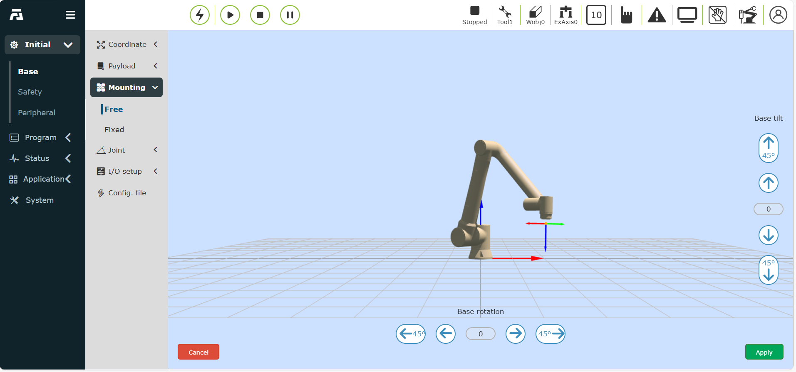
   
.. centered:: Figure 5.3-25 360 degree free installation

.. important:: 
   After the installation of the robot is completed, the installation method of the robot must be set correctly, otherwise it will affect the use of the robot's dragging function and collision detection function.

Teaching simulation
-----------------------
 
Introduction
~~~~~~~~~~~~~~

Click the command on the left to add a program node to the program tree.When the program is running, the currently executing program node is highlighted in green.In manual mode, click the first icon on the right side of the node to make the robot execute the instruction alone, and the second icon is to edit the content of the node.

.. image:: teaching_pendant_software/069.png
   :width: 6in
   :align: center

.. centered:: Figure 4.7-1 Program tree interface

Click "⇄" to switch modes, and the teaching program text can be changed to the editing state, and the editing area can be expanded and collapsed in the editing state.

.. image:: teaching_pendant_software/245.png
   :width: 6in
   :align: center

.. image:: teaching_pendant_software/246.png
   :width: 6in
   :align: center

.. centered:: Figure 4.7-2 Teaching program editing status

Click the "Popup/Hide the content on the right side of the current program" button to expand or hide the local teaching points and the backup content of the current program. After the content on the right is expanded, click the icons of "Partial teaching point" and "Current program backup" to display the corresponding content.

.. image:: teaching_pendant_software/260.png
   :width: 6in
   :align: center

.. image:: teaching_pendant_software/261.png
   :width: 6in
   :align: center

.. centered:: Figure 4.7-3 Contents on the right side of the current program

Tool bar
~~~~~~~~~~

Modify the program tree using the toolbar at the bottom of the program tree.

.. note:: 
   .. image:: teaching_pendant_software/070.png
      :width: 1.5in
      :height: 0.75in
      :align: left

   name:**Open**
   
   effect:Open user program file

.. note:: 
   .. image:: teaching_pendant_software/071.png
      :width: 1.5in
      :height: 0.75in
      :align: left

   name:**New build**
   
   effect:Select a template to create a new program file
   
.. note:: 
   .. image:: teaching_pendant_software/072.png
      :width: 1.5in
      :height: 0.75in
      :align: left

   name:**Import**
   
   effect:Import the file into the user program folder

.. note:: 
   .. image:: teaching_pendant_software/073.png
      :width: 1.5in
      :height: 0.75in
      :align: left

   name:**Export**
   
   effect:Export user program files to a local point.

.. note:: 
   .. image:: teaching_pendant_software/074.png
      :width: 1.5in
      :height: 0.75in
      :align: left

   name:**Save**
   
   effect:Save file edits

.. note:: 
   .. image:: teaching_pendant_software/075.png
      :width: 1.5in
      :height: 0.75in
      :align: left

   name:**Save as**
   
   effect:Rename the file and store it in the user program or template program folder.

.. note:: 
   .. image:: teaching_pendant_software/076.png
      :width: 1.5in
      :height: 0.75in
      :align: left

   name:**Copy**
   
   effect:Duplicates a node and allows it to be used for other operations (eg: paste it elsewhere in the program tree).

.. note:: 
   .. image:: teaching_pendant_software/077.png
      :width: 1.5in
      :height: 0.75in
      :align: left

   name:**Paste**
   
   effect:Allows you to paste previously cut or copied nodes.

.. note:: 
   .. image:: teaching_pendant_software/078.png
      :width: 1.5in
      :height: 0.75in
      :align: left

   name:**To cut**
   
   effect:Cuts a node and allows it to be used for other operations (eg: paste it elsewhere in the program tree).

.. note:: 
   .. image:: teaching_pendant_software/079.png
      :width: 1.5in
      :height: 0.75in
      :align: left

   name:**Delete**
   
   effect:Deletes a node from the program tree.

.. note:: 
   .. image:: teaching_pendant_software/080.png
      :width: 1.5in
      :height: 0.75in
      :align: left

   name:**Move up**
   
   effect:Move the node up.

.. note:: 
   .. image:: teaching_pendant_software/081.png
      :width: 1.5in
      :height: 0.75in
      :align: left

   name:**Move down**
   
   effect:Move the node down.

.. note:: 
   .. image:: teaching_pendant_software/082.png
      :width: 1.5in
      :height: 0.75in
      :align: left

   name:**Toggle edit mode**
   
   effect:The program tree mode and lua editing mode switch each other.

Program command
~~~~~~~~~~~~~~~~~~

The left side is mainly for adding program commands. Click the icon above each keyword to enter the detailed interface. There are two main operations for adding program commands to the file. One way is to open the relevant command and click the Apply button to add the command to the program. , another way is to click the "Add" button first, at this time the command is not saved in the program file, and you need to click "Apply" again to save the command in the file. 
The second method often occurs when multiple commands of the same type are issued. We add an add button and display the content of the added command to this type of command. Click the Add button to add a command, and the added command displays all the added commands. , click "Apply" to save the added command to the opened file on the right.

Logic Command Interface
~~~~~~~~~~~~~~~~~~~~~~~~~

.. image:: teaching_pendant_software/202.png
   :width: 6in
   :align: center

.. centered:: Figure 4.7-4 Logic Command Interface

While command
++++++++++++++++

Click the "While" icon to enter the While command editing interface

Enter the waiting condition in the input box behind While, input the action command during the loop in the input box behind do, and click Save. (For the convenience of operation, you can enter do content arbitrarily, and edit other instructions in the program to insert instead)

.. image:: teaching_pendant_software/101.png
   :width: 6in
   :align: center

.. centered:: Figure 4.7-4-1 While command interface

if…else command
++++++++++++++++

Click the "if...else" button to enter the if...else command editing interface

Enter the statement in the input box on the right, and click "Add" and "Apply" after editing. (This instruction requires a certain programming foundation, if you need help, please contact us)

.. image:: teaching_pendant_software/102.png
   :width: 6in
   :align: center

.. centered:: Figure 4.7-4-2 if…else command interface

Goto command
++++++++++++++++

Click the "Goto" button to enter the Goto command editing interface

The Goto instruction is a jump instruction, enter the statement in the input box on the right, and click "Add" and "Apply" after editing. (This instruction requires a certain programming foundation, if you need help, please contact us)

.. image:: teaching_pendant_software/103.png
   :width: 6in
   :align: center

.. centered:: Figure 4.7-4-3 Goto command interface

Wait command
++++++++++++++++

Click the "Wait" icon to enter the Wait command editing interface

This instruction is a delay instruction, which is divided into three parts: "WaitMs", "WaitDI" and "WaitAI".

"WaitTime" command delay waiting time unit is milliseconds, input the number of milliseconds to wait, click "Add", "Apply".

.. image:: teaching_pendant_software/104.png
   :width: 6in
   :align: center

.. centered:: Figure 4.7-4-4 WaitTime command interface

"WaitDI" command, that is, single DI waiting, select the IO port number to be waited for, wait state, wait maximum time and wait timeout processing method, and click "Add" and "Apply".

.. image:: teaching_pendant_software/105.png
   :width: 6in
   :align: center

.. centered:: Figure 4.7-4-5 WaitDI command interface

"WaitMultiDI" command, that is, multi-DI waiting, first select the multi-DI establishment conditions, then check the DI port and status that need to wait, and finally set the maximum waiting time and waiting timeout processing method, click "Add" and "Apply".

.. image:: teaching_pendant_software/106.png
   :width: 6in
   :align: center

.. centered:: Figure 4.7-4-6 WaitMultiDI command interface

"WaitAI" command, select the analog quantity to be waited for, the value, the maximum waiting time and the waiting timeout processing method, and click "Add" and "Apply".

.. image:: teaching_pendant_software/107.png
   :width: 6in
   :align: center

.. centered:: Figure 4.7-4-7 WaitAI command interface

Pause command
++++++++++++++++

Click the "Pause" icon to enter the Pause command editing interface

This instruction is a pause instruction. Insert this instruction into the program. When the program executes this instruction, the robot will be in a pause state. If you want to continue running, click the "Pause/Resume" button in the control area.

.. image:: teaching_pendant_software/108.png
   :width: 6in
   :align: center

.. centered:: Figure 4.7-4-8 Pause command interface

Dofile command
++++++++++++++++

Click the "Dofile" icon to enter the Dofile command editing interface

The Dofile command calls the internal program of the controller. When using the Dofile command, the called subroutine needs to be saved, and the main program does not need to be saved again if it has not changed. The Dofile command supports two-level calls, and two parameter settings need to be paid attention to. One is the level of the call, and the other is the ID number of the call. In principle, the same ID number cannot appear in the same program.

.. image:: teaching_pendant_software/109.png
   :width: 6in
   :align: center

.. centered:: Figure 4.7-4-9 Dofile command interface

Var command
++++++++++++++++

Click the "Var" icon to enter the Var command editing interface

This command is a variable system command, which is divided into two parts: Lua variable definition, variable query and Sys variable renaming, getting value, and setting value. Lua variable definition can declare a variable and assign an initial value, and cooperate with while, if-else and other commands Use the Lua variable query command to query the value of the input variable name in real time and display it in the status bar. The number of Sys variables is fixed, and you can rename them, get variable values, and set variable values. The values stored in this variable will not be cleared when the system is turned off.

.. image:: teaching_pendant_software/100.png
   :width: 6in
   :align: center

.. centered:: Figure 4.7-4-10 Var command interface

.. important:: Variable names must start with letters or underscores, not numbers or other special characters.

Motion command interface
~~~~~~~~~~~~~~~~~~~~~~~~~~

.. image:: teaching_pendant_software/203.png
   :width: 6in
   :align: center

.. centered:: Figure 4.7-5 Motion command interface

PTP command
++++++++++++++++

Click the "PTP" icon to enter the PTP command editing interface.

You can choose the point to be reached, and the smooth transition time setting can realize that the movement from this point to the next point is continuous. Whether to set the offset, you can choose to offset based on the base coordinate system and based on the tool coordinates, and pop up x, y, z, rx, ry, rz offset settings, PTP specific path is the optimal path automatically planned by the motion controller, click "Add" and "Apply" to save this command.

.. image:: teaching_pendant_software/083.png
   :width: 6in
   :align: center

.. centered:: Figure 4.7-5-1 PTP command interface

Lin command
++++++++++++++++

Click the "Lin" icon to enter the Lin command editing interface.

The function of this command is similar to the "PTP" command, but the path of the point reached by this command is a straight line.

.. image:: teaching_pendant_software/084.png
   :width: 6in
   :align: center

.. centered:: Figure 4.7-5-2 Lin command interface

.. important:: When the selection point name is "seamPos", the straight line command is applied in the welding scene using the laser sensor. Due to the accumulated operating error during welding, "whether to offset" and "offset amount" are added.

   **Whether to offset**:No, base coordinate system offset, tool coordinate system offset, laser original data offset;

   **Offset**: Δx, Δy, Δz, Δrx, Δry, Δrz, range: -300~300;

   .. image:: teaching_pendant_software/277.png
      :width: 6in
      :align: center

   .. centered:: Figure 4.7-5-2-1 Lin command interface(Welding scene)

LIN command joint	overspeed processing function
*****************************************************************

When using the Cartesian space linear motion command LIN, the constrained condition is the linear velocity, but the actual operation is affected by the workspace, and the angular velocity of the joint may have exceeded the limit when the linear velocity requirement is met. This function implements an optional handling strategy to deal with joint overspeed during LIN movements.

**Step1**:Click the Linear Motion Command button；

.. image:: teaching_pendant_software/436.png
   :width: 6in
   :align: center

.. centered:: Figure 4.7‑5-3-1 Click the Linear Motion Command button

**Step2**:Select the linear motion command target waypoint；

.. centered:: Figure 4.7‑5-3-2 Select the linear motion target waypoint

**Step3**:Turn on the joint overspeed protection switch；

.. centered:: Figure 4.7‑5-3-3 Turn on the joint overspeed protection switch button

**Step4**:Select the joint overspeed treatment strategy (first two options is not for joint overspeed treatment)；

.. centered:: Figure 4.7‑5-3-4 Joint overspeed treatment strategies

**Step5**:
   Set the processing option and processing parameters, then click the Add button to add the Lua command；

   Under the adaptive speed reduction strategy, the deceleration threshold is the percentage of the linear velocity reduction value relative to the set linear velocity, and when the deceleration value exceeds the set threshold, the robot will report an error and stop.

.. centered:: Figure 4.7‑5-3-5 Joint overspeed treatment strategy selection and setting

**Step6**:The added Lua command is shown in the figure；

.. centered:: Figure 4.7‑5-3-6 lua command

**Joint overspeed protection begins**:JointOverSpeedProtectStart（a，b）；
   a:strategy type number（same as the order of drop-down box）

   b:threshold（0~100）

**Joint overspeed protection ends**:JointOverSpeedProtectEnd（）；

Arc command
++++++++++++++++

Click the "Arc" icon to enter the Arc command editing interface.

The "Arc" command is arc movement, which includes two points. The first point is the transition point in the middle of the arc, and the second point is the end point. Both the transition point and the end point can be set to offset, and you can choose to base coordinate system offset Shift and offset based on tool coordinates, and pop up x, y, z, rx, ry, rz offset settings, and the end point can set a smooth transition radius to achieve continuous motion effect.

.. image:: teaching_pendant_software/085.png
   :width: 6in
   :align: center

.. image:: teaching_pendant_software/086.png
   :width: 6in
   :align: center

.. centered:: Figure 4.7-5-4 Arc command interface

Circle command
++++++++++++++++

Click the "Circle" icon to enter the Circle command editing interface.

The cooperative robot can carry out the circle trajectory movement by adding the circle command. Before adding the circle command, it is necessary to teach three path points on the circle trajectory. Suppose that the three path points on the circle trajectory are "P1", "P2" and "P3" respectively, where "P1" is the starting point of the circle trajectory, "P2" and "P3" are the middle point 1 and 2 of the circle trajectory.Move the robot to the above three points and add the names of the teaching points as "P1", "P2" and "P3" respectively.

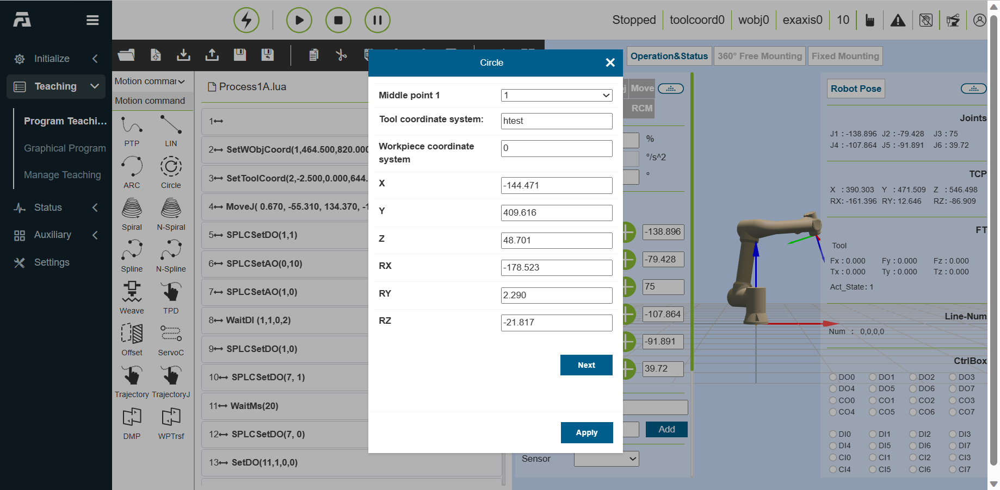

.. centered:: Figure 4.7-5-5 Circle trajectory

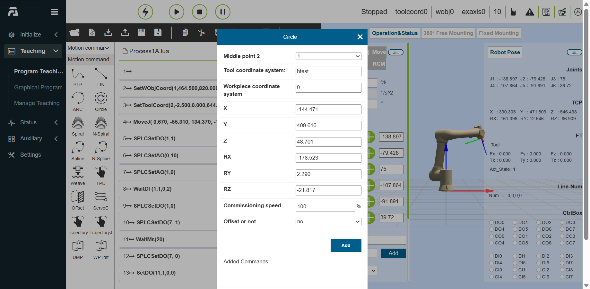

.. image:: teaching_pendant_software/279.png
   :width: 3in
   :align: center

.. image:: teaching_pendant_software/280.png
   :width: 3in
   :align: center

.. centered:: Figure 4.7-5-6 Teaching "P1", "P2" and "P3"

Circle command addition
**********************************************

**Step1**: Create a new user program "testCircle.lua" and click the "Circle" button to open the page of adding circle commands.

.. image:: teaching_pendant_software/281.png
   :width: 6in
   :align: center

.. centered:: Figure 4.7-5-7 Add the circle command button

**Step2**: Select "Middle point 1" as the "P2" point in the circle command addition page, and click "Next".

.. centered:: Figure 4.7-5-8 Middle Point 1 of the Circle

**Step3**: Select "Middle point 2" as the "P3" point, and click the "Add" button and the "Apply" button in turn.

.. centered:: Figure 4.7-5-9 The middle point 2 of the circle

**Step4**: At this time, "testCircle.lua" has added the circle movement command.

.. image:: teaching_pendant_software/284.png
   :width: 6in
   :align: center

.. centered:: Figure 4.7-5-10 Circle movement command addition

The above command only define two path points of the circle, and the starting point of the circle movement needs to be defined to make the robot move according to the predetermined circle trajectory. A linear motion command is added, and the target point of linear motion is the starting point "P1" of the circle trajectory, and the position of the command is adjusted to make the robot move to the starting point "P1" of the circle first, and then perform the circle trajectory motion with the middle points of the path "P2" and "P3".

.. image:: teaching_pendant_software/285.png
   :width: 6in
   :align: center

.. centered:: Figure 4.7-5-11 Add the starting point of circle motion

Switch the robot to automatic mode, start the program on the premise of ensuring safety, and the robot will move according to the circle trajectory shown in Figure 1.

Circle trajectory offset
**********************************************

The circular motion of the cooperative robot supports the offset of the positions of the middle point 1 and the middle point 2 of the circular trajectory, and the offset types include the following two types:

**The middle points of the two trajectories of the circle have the same offset:** the middle point 1 (P2) and the middle point 2 (P3) of the circle are offset by the same offset ∆(dx, dy, dz, drx, dry, drz).

**The middle points of the two trajectories of the circle have different offsets:** the middle point 1 (P2) and the middle point 2 (P3) of the circle adopt two different offsets ∆1 (dx1, dy1, dz1, drx1, dry1, drz1) and ∆2 (dx2, dy2, dz2, drx2, dry2, drz2) respectively.

The following demonstrates the usage of "same offset" and "different offset" respectively.

(1) Same offset

Open the circle command addition page, select "Same Offset" for Offset Type, and also select the Middle point 1 of the circle as "P2" point, and click "Next" button.

.. image:: teaching_pendant_software/286.png
   :width: 3in
   :align: center

.. centered:: Figure 4.7-5-12 Same offset of the circle

Select P3 for the middle point 2 of the circle, and select Base Coordinate Offset for Offset.

.. note:: 
   Note: you can select Tool Coordinate Offset according to the actual work situation.

Enter the offset dx as 10mm, and then click the Add button and the Apply button at the bottom of the page.

.. image:: teaching_pendant_software/287.png
   :width: 3in
   :align: center

.. centered:: Figure 4.7-5-13 Setting Offset

At this time, the circle command that two intermediate points "P2" and "P3" of a circle are offset by 10mm along the X-axis direction of the base coordinate system has been added to the "testCircle.lua" program; Of course, a linear motion command needs to be added before the circle motion command to make the robot move to the starting point of the circle.

.. image:: teaching_pendant_software/288.png
   :width: 6in
   :align: center

.. centered:: Figure 4.7-5-14 Same Offset Program for Circle

Switch the robot to the automatic mode, and start the program under the condition of ensuring safety. The actual motion trajectory of the robot passes through the circles of "P1", "P2" and "P3", where "P2" is the point where the original "P2" is offset by 10mm in the X direction, and "P3" is the point where the original "P3" is offset by 10mm in the X direction.

.. image:: teaching_pendant_software/289.png
   :width: 3in
   :align: center

.. centered:: Figure 4.7-5-15 Track with the same offset X10mm

(2) Different offset

Open the circle command adding page, select "Different Offsets" for Offset Type, and also select the middle point 1 of the circle as "P2" point, and select "Base coordinate offset" for "Offset".

.. note:: 
   Note: you can select "Tool coordinate offset" according to the actual work situation.

Enter the offset dy as 10mm, and click "Next" button.

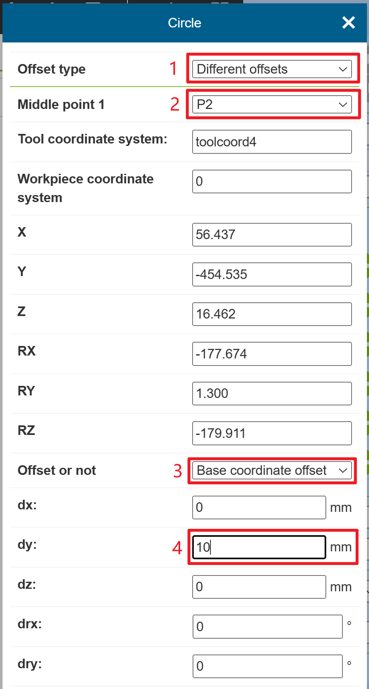

.. centered:: Figure 4.7-5-16 Different offsets

Select P3 for the middle point 2 of the circle, and select Base Coordinate Offset for Offset

.. note:: 
   Note: you can select Tool Coordinate Offset according to the actual work situation.

Enter the offset dx as 10mm, and then click the Add button and the Apply button at the bottom of the page.

.. centered:: Figure 4.7-5-17 Offset of middle point 2 is set with different offsets

At this time, an command that the middle point "P2" of the circle is shifted by 10mm along the Y direction of the base coordinate system and "P3" is shifted by 10mm along the X axis direction of the base coordinate system has been added to the "testCircle.lua" program; Of course, a linear motion command needs to be added before the circle motion command to make the robot move to the starting point of the circle.

.. image:: teaching_pendant_software/292.png
   :width: 6in
   :align: center

.. centered:: Figure 4.7-5-18 Program for Two Different Offset Points of Circle

Switch the robot to the automatic mode, and start the program under the condition of ensuring safety. The actual motion trajectory of the robot passes through the circles of "P1", "P2" and "P3", where "P2" is the point where the original "P2" is offset by 10mm in the Y direction, and "P3" is the point where the original P3 is offset by 10mm in the X direction.

.. image:: teaching_pendant_software/293.png
   :width: 3in
   :align: center

.. centered:: Figure 4.7-5-19 Two trajectory points of the circle are offset from the trajectory respectively

Spiral command
++++++++++++++++

Click the "Spiral" icon to enter the Spiral command editing interface

The "Spiral" command is a spiral motion, which includes three points, which form a circle. On the third point setting page, there are several parameters including the number of spiral turns, attitude correction angle, radius increment and rotation axis direction increment. Setting, the number of helix circles is the number of motion circles of the helix, the attitude correction angle is the attitude at the end of the helix and the attitude of the first point of the helix, the radius increment is the increment of the radius of each circle, and the direction of the rotation axis is increased. The amount is the increment in the direction of the screw axis. set up
Whether to offset, the offset takes effect on the trajectory of the entire helix.

.. image:: teaching_pendant_software/089.png
   :width: 6in
   :align: center

.. centered:: Figure 4.7-5-20 Spiral command interface

N-Spiral command
++++++++++++++++

Click the "N-Spiral" icon to enter the N-Spiral command editing interface

The "N-Spiral" command is an optimized version of the spiral motion. This command only needs one point plus the configuration of various parameters to realize the spiral motion. The robot takes the current position as the starting point, and the user sets the debugging speed, whether to offset, the number of spiral turns, the spiral inclination, the initial radius, the radius increment, the rotation axis direction increment and the rotation direction. The number of spiral turns is the helix. The number of motion circles, the helix inclination is the angle between the Z axis of the tool and the horizontal direction, the attitude correction angle is the attitude at the end of the helix and the attitude of the first point of the helix, the initial radius is the radius of the first circle, and the radius increment That is, the increment of the radius of each circle, the increment in the direction of the rotation axis is the increment in the direction of the screw axis, and the direction of rotation is clockwise and counterclockwise.

.. image:: teaching_pendant_software/090.png
   :width: 6in
   :align: center

.. centered:: Figure 4.7-5-21 N-Spiral command interface

H-Spiral command
+++++++++++++++++++

Click the "H-Spiral" icon to enter the H-Spiral command editing interface

The "H-Spiral" command is a horizontal space spiral motion. This command is set after the single-segment motion (straight line) command. 

   - Spiral radius: 0~100mm
   - Helix angular speed: 0~2rev/s
   - Direction of rotation: spiral clockwise/counterclockwise
   - Helix inclination angle: 0~40°

.. image:: teaching_pendant_software/250.png
   :width: 6in
   :align: center

.. centered:: Figure 4.7-5-22 H-Spiral command interface

Spline command
++++++++++++++++

Click the "Spline" icon to enter the Spline command editing interface

The command is divided into three parts: the start of the spline group, the spline segment and the end of the spline group. The start of the spline group is the start mark of the spline movement. The spline segment includes SPL, SLIN and SCIRC segments. Click the corresponding icon to enter the command Add interface, the end of spline group is the end sign of spline movement.

.. image:: teaching_pendant_software/091.png
   :width: 6in
   :align: center

.. centered:: Figure 4.7-5-23 Spline command interface

N-Spline command
+++++++++++++++++++

Click the "N-Spline" icon to enter the N-Spline command editing interface

This instruction is an optimization instruction for the Spline instruction algorithm, and will replace the existing Spline instruction in the future. 

This instruction is divided into three parts: the start of the multi-point trajectory, the segment of the multi-point trajectory and the end of the multi-point trajectory. The start mark, the multi-point track segment is to set each track point.

Click the icon to enter the point adding interface, the end of the multi-point track is the end mark of the multi-point track movement, here you can set the control mode and debugging speed, the control mode is divided into
For the given control point and the given waypoint.

- Control mode: arc transition point/given path point
- Global average connection time: integer, greater than 10, default value is 2000

.. image:: teaching_pendant_software/092.png
   :width: 6in
   :align: center

.. centered:: Figure 4.7-5-24 N-Spline command interface

Weave command
++++++++++++++++

Click the "Weave" icon to enter the Weave command editing interface. The "Weave" command consists of two parts.

- Select the weaving number with configured parameters, click "Start Weaving" and "Stop Weaving" and apply to add related commands to the program.

.. image:: teaching_pendant_software/110.png
   :width: 6in
   :align: center

.. centered:: Figure 4.7-5-25 Weave command interface

- Click "Configuration and Test" to select the weaving type according to the usage scenario and configure the weaving parameters. After the configuration is completed, the weaving trajectory can be tested by pressing the start weaving test and stop weaving test buttons. The current swing types are:

   - Triangular wave swing (LIN/ARC)
   - Vertical L-shaped triangular wave swing (LIN/ARC)
   - Circular Oscillation - Clockwise (LIN)
   - Circular Oscillation - Counterclockwise (LIN)
   - Sine wave swing (LIN/ARC)
   - Vertical L-shaped sine wave swing (LIN/ARC)
   - Vertical welding triangle swing

.. image:: teaching_pendant_software/111.png
   :width: 6in
   :align: center

.. centered:: Figure 4.7-5-26 Weave configuration and testing command interface

Slope serration weave function
**********************************

This function allows the end of the robot tool to generate slope serration weave trajectory in Cartesian space. The weave is superimposed on the linear trajectory, and the azimuth parameter (unit deg) defines the azimuth angle of the swing welding on the specified welding plane; 

When the value is positive, the left endpoint is skewed in the forward direction, and when it is negative, the right endpoint is skewed in the forward direction; If it is 90deg or -90deg, it can weave in the forward direction.

.. image:: teaching_pendant_software/442.png
   :width: 4in
   :align: center

.. centered:: Figure 4.7‑5-26-1 Swing azimuth effect

**Step1**：Edit to set up basic linear motion.

.. image:: teaching_pendant_software/443.png
   :width: 4in
   :align: center

.. centered:: Figure 4.7‑5-26-2 Example of a basic linear motion LUA program

**Step2**：Add weave command in motion command block.

.. centered:: Figure 4.7‑5-26-3 Add weave command

**Step3**：Click the "Configure" button, select "Triangular wave swing" or "Sine wave swing" from the drop-down box, imput desired azimuth angle in "Swing direction azimuth" box and click "Apply".

.. centered:: Figure 4.7‑5-26-4 Weave parameter configuration

**Step4**：Click the "Start Swing" button to add the swing command above the linear motion; Click the "Stop Swing" button to add the swing command below the linear motion.

.. image:: teaching_pendant_software/446.png
   :width: 4in
   :align: center

.. centered:: Figure 4.7‑5-26-5 Add the lua program after the swing command

**Step5**：Click "Start Running"buttom, and the end trajectory of the robot is shown in the figure.

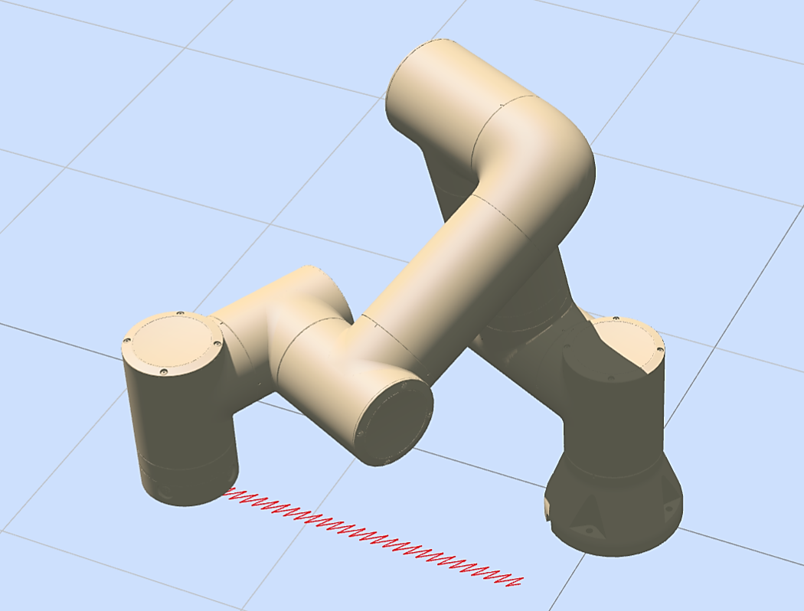

.. centered:: Figure 4.7‑5-26-6 Zigzag weave (left) slope serration weave (right)

TPD command
++++++++++++++++

Click the "TPD" button to enter the TPD command editing interface

In this command, the user first needs to have a recorded track.

About track recording: Before preparing to record the track, first save the starting point of the track. When the robot is in the dragging mode, input the file name, select the period (assuming the value is x, that is, record a point every x milliseconds, it is recommended to record a point every 4 milliseconds), the point starts recording, and the user can drag the robot to specify Movement, after the recording is completed, click to stop recording, and the previous movement track of the robot can be saved. When a movement cannot be fully recorded, a
A reminder that the number of recording points exceeds the limit is displayed, and the user needs to record the exercise in several times.

When programming, first use the PTP instruction to reach the starting point of the corresponding trajectory, then select the trajectory in the TPD trajectory reproduction instruction, select whether it is smooth, set the debugging speed, and click "Add" and "Apply" in sequence to insert the program. The trajectory loading command is mainly used to pre-read the trajectory file and extract it into a trajectory command, which is better applied to the conveyor belt tracking scene.

.. note:: 
   For the detailed operation of TPD, please refer to the teaching programming (TPD) function operation instruction module.

.. image:: teaching_pendant_software/097.png
   :width: 6in
   :align: center

.. centered:: Figure 4.7-5-27 TPD command interface

Offset command
++++++++++++++++

Click the "Offset" icon to enter the Offset command editing interface

This command is an overall offset command. Input each offset, add the opening command and closing command to the program, and the motion command between the start and close will be offset based on the base coordinates (or workpiece coordinates).

.. image:: teaching_pendant_software/123.png
   :width: 6in
   :align: center

.. centered:: Figure 4.7-5-28 Offset command interface

ServoCart command
++++++++++++++++++++

Click the "ServoC" icon to enter the ServoCart command editing interface

ServoCart servo control (Cartesian space motion) command, which can control the robot motion through absolute pose control or based on the current pose offset.

.. image:: teaching_pendant_software/128.png
   :width: 6in
   :align: center

.. centered:: Figure 4.7-5-29 ServoCart command interface

Absolute pose control program example:

.. image:: teaching_pendant_software/129.png
   :width: 6in
   :align: center

In this example, x, y, z, rx, ry, rz (Cartesian position) are the current position of the robot. In addition, the user can control the movement of the robot by reading the trajectory data file and sending the trajectory data through socket communication.

Example of control program based on current pose offset (base coordinate offset):

.. image:: teaching_pendant_software/130.png
   :width: 6in
   :align: center

Trajctory command
+++++++++++++++++++

Click the "Trajctory" icon to enter the Trajctory command editing interface

.. image:: teaching_pendant_software/212.png
   :width: 6in
   :align: center

.. centered:: Figure 4.7-5-30 Trajctory command interface

TrajctoryJ command
++++++++++++++++++++

Click the "TrajctoryJ" icon to enter the TrajctoryJ command editing interface

1.Trajectory file import function: select a local computer file to import to the robot control system

2.Track preloading: select the imported track file and load it by command

3.Trajectory movement: Send the robot movement through the combination command of the preloaded trajectory file and the selected debugging speed

4.Print the track point number: print the track point number during the robot running track, so as to check the progress of the current movement

.. image:: teaching_pendant_software/213.png
   :width: 6in
   :align: center

.. centered:: Figure 4.7-5-31 TrajctoryJ command interface

DMP command
++++++++++++++++

Click the "DMP" icon to enter the DMP command editing interface.

DMP is a trajectory imitation learning method that requires prior planning of reference trajectories. In the command editing interface , select the teaching point as the new starting point, click "Add" and "Apply" to save the command. The DMP specific path is a new trajectory that mimics the reference trajectory with a new starting point.

.. image:: teaching_pendant_software/214.png
   :width: 6in
   :align: center

.. centered:: Figure 4.7-5-32 DMP command interface

WPTrsf command
++++++++++++++++

Click the "WPTrsf" icon to enter the WPTrsf command editing interface.

Select the workpiece coordinate system to be automatically converted, and click "Add" and "Apply" to save the instruction. This instruction realizes automatic conversion of points in the workpiece coordinate system when executing internal PTP and LIN instructions. Use the example area to show and prompt the correct combination of instructions. After adding specific instructions, you can adjust the combination according to the actual scene.

.. image:: teaching_pendant_software/215.png
   :width: 6in
   :align: center

.. centered:: Figure 4.7-5-33 WPTrsf command interface

Control command interface
~~~~~~~~~~~~~~~~~~~~~~~~~~~~~

.. image:: teaching_pendant_software/204.png
   :width: 6in
   :align: center

.. centered:: Figure 4.7-6 Control command interface

IO command
++++++++++++++++

Click the "IO" icon to enter the IO command editing interface

The "IO" command is divided into two parts: setting IO (SetDO/SPLCSetDO) and getting IO (GetDI/SPLCGetDI).

"SetDO/SPLCSetDO" This command can set the specified output DO state, including 16 digital outputs of the control box and 2 digital outputs of the tool. The state option "False" is closed, "True" is open, and whether to block the option selects "blocked". "Indicates that the DO state is set after the movement stops, and selecting the "non-blocking" option means that the DO state is set during the last movement. Selecting "Break" for the smooth trajectory option means setting the DO state after the smooth transition radius ends, and selecting "Serious" means setting the DO state during the smooth transition radius movement. When this instruction is added in the auxiliary thread, whether the application thread needs to select yes, and other places use this instruction to select no. Click "Add", "Apply".

.. image:: teaching_pendant_software/093.png
   :width: 6in
   :align: center

.. centered:: Figure 4.7-6-1 SetDO command interface

In the "GetDI/SPLCGetDI" command, select the value of the port number you want to get, whether to block or not, select "block" to get the DI status after the movement stops, and select the "non-blocking" option to get the DI state during the last movement. When this instruction is added in the auxiliary thread, whether the application thread needs to select yes, and other places use this instruction to select no. After selection, click the "Add" and "Apply" buttons.

.. image:: teaching_pendant_software/094.png
   :width: 6in
   :align: center

.. centered:: Figure 4.7-6-2 GetDI command interface

AI command
++++++++++++++++

Click the "AI" icon to enter the AI command editing interface

In this instruction, it is divided into two functions: setting analog output (SetAO/SPLCSetAO) and obtaining analog input (GetAI/SPLCGetAI).

"SetAO/SPLCSetAO" select the analog output that needs to be set, input the value that needs to be set, the range is 0-10, whether to block or not select "block" means to set the AO state after the movement stops, select "non-block" means to set the AO state after the last movement Set the AO state in the process. When this instruction is added in the auxiliary thread, whether the application thread needs to select yes, and other places use this instruction to select no. Click "Add", "Apply".

.. image:: teaching_pendant_software/095.png
   :width: 6in
   :align: center

.. centered:: Figure 4.7-6-3 SetAO command interface

"GetAI/SPLCGetAI" selects the analog input that needs to be obtained, whether to block or not selects "blocked" to obtain the AI state after the movement stops, and selects the "non-blocked" option to obtain the AI state during the last movement. When this instruction is added in the auxiliary thread, whether the application thread needs to select yes, and other places use this instruction to select no. Click "Add", "Apply".

.. image:: teaching_pendant_software/096.png
   :width: 6in
   :align: center

.. centered:: Figure 4.7-6-4 GetAI command interface

Vir-IO command
++++++++++++++++

Click the "Vir-IO" icon to enter the Vir-IO command editing interface

This command is a virtual IO control command, which can realize the setting of the simulated external DI and AI status, and obtain the simulated DI and AI status.

.. image:: teaching_pendant_software/126.png
   :width: 6in
   :align: center

.. centered:: Figure 4.7-6-5 Vir-IO command interface

Aux-IO command
++++++++++++++++

Click the "Aux-IO" icon to enter the Aux-IO command editing interface

Aux-IO is the instruction function for the robot to communicate with the PLC to control the external expansion IO. It is necessary for the robot to establish UDP communication with the PLC. On the basis of the original 16-channel input and output, 128-channel input and output can be expanded. The usage of this command is the same as that mentioned above. IO usage is similar. There are certain technical difficulties in using this function, please contact us for consultation beforehand.

.. image:: teaching_pendant_software/139.png
   :width: 6in
   :align: center

.. centered:: Figure 4.7-6-6 Aux-IO command interface

MoveDO command
++++++++++++++++

Click the "MoveDO" icon to enter the MoveDO command editing interface

This instruction is divided into continuous output mode and single output mode.

- Continuous output mode: During linear motion, the DO signal function is continuously output according to the set interval.

.. image:: teaching_pendant_software/195.png
   :width: 6in
   :align: center

.. centered:: Figure 4.7-6-7 MoveDO command continuous output interface

- Single output mode: There are two options: constant speed segment output and free configuration. The setting time is output after the movement starts, and the reset time is output before the movement ends, ranging from [0, 1000].

.. image:: teaching_pendant_software/276.png
   :width: 6in
   :align: center

.. centered:: Figure 4.7-6-8 MoveDO instruction single output interface

MoveAO command
++++++++++++++++

Click the "MoveAO" icon to enter the MoveAO command editing interface

1. Summary

When used in conjunction with motion commands, this instruction can output AO signals proportionally based on real-time TCP speed during the motion process.

2. Description of Motion AO Command

The motion AO command is located in the teaching simulation program teaching command editing area, and the icon is Control Command-Motion AO.

.. image:: teaching_pendant_software/336.png
   :width: 3in
   :align: center

.. centered:: Figure 4.7-6-9 Motion AO Instruction

.. centered:: Figure 4.7-6-10 Details of Motion AO Instructions

- AO number: dropdown list selection, Ctrl-AO0 corresponds to control box AO0, Ctrl-AO1 corresponds to control box AO1, and End AO0 corresponds to end AO0.

- Maximum TCP speed: The maximum TCP speed value of the robot; Function: Proportional to real-time TCP speed.

- Maximum TCP speed AO percentage: The AO percentage corresponding to the maximum TCP speed value of the robot; Function: Set the upper limit value of AO output.

- Dead zone compensation value AO percentage: When there is a dead zone in the proportional valve, this parameter can be set to ensure AO output; Function: Set the lower limit value of AO output.

.. important:: 
   Calculation formula:Output AO percentage=Real time TCP speed/Set maximum TCP speed * Set maximum TCP speed AO percentage.

   The accompanying motion commands for this command are as follows:PTP/LIN/ARC/CIRCLE/SPLINE/NSPLINE/SERVOJ.

ToolList command
+++++++++++++++++++

Click the "ToolList" icon to enter the ToolList command editing interface

Select the tool coordinate system name and click "Apply" to add this command to the program. When the program runs this statement, the tool coordinate system of the robot will be set.

.. image:: teaching_pendant_software/098.png
   :width: 6in
   :align: center

.. centered:: Figure 4.7-6-9 ToolList command interface

Mode command
++++++++++++++++

Click the "Mode" icon to enter the Mode command editing interface

This command can switch the robot to manual mode, and is usually added at the end of a program so that the user can automatically switch the robot to manual mode and drag the robot after the program runs.

.. image:: teaching_pendant_software/099.png
   :width: 6in
   :align: center

.. centered:: Figure 4.7-6-10 Mode command interface

Collision command
++++++++++++++++++++

Click the "Collision" icon to enter the Collision command editing interface

This command is used to set the collision level. Through this command, the collision level of each axis can be adjusted in real time during program operation, and the application scenario can be deployed more flexibly.

.. image:: teaching_pendant_software/135.png
   :width: 6in
   :align: center

.. centered:: Figure 4.7-6-11 Collision command interface

Acc command
++++++++++++++++

Click the "Acc" icon to enter the Acc command editing interface

The Acc command is to realize the function that the acceleration of the robot can be set separately. By adjusting the acceleration scaling factor of the motion command, the acceleration and deceleration time can be increased or decreased, and the takt time of the robot action can be adjusted.

.. image:: teaching_pendant_software/137.png
   :width: 6in
   :align: center

.. centered:: Figure 4.7-6-12 Acc command interface

Peripheral Command Interface
~~~~~~~~~~~~~~~~~~~~~~~~~~~~~~~~

.. image:: teaching_pendant_software/205.png
   :width: 6in
   :align: center

.. centered:: Figure 4.7-7 Peripheral Command Interface

Gripper command
++++++++++++++++++

Click the "Gripper" icon to enter the Gripper command editing interface

In this command, it is divided into the gripper motion control command and the gripper activation/reset command. In the gripper control command, the number of the gripper that has been configured and activated is displayed. The user can edit through the edit box, or slide the slider to The required value is used to complete the setting of jaw opening and closing, opening and closing speed and opening and closing torque. Blocking means that the gripper moves in parallel with the previous movement command. Click the "Add" and "Apply" buttons to save the set value to the teaching file. The gripper reset/activation command displays the number of the grippers that have been configured, and the reset/activation command can be added to the program.

.. image:: teaching_pendant_software/114.png
   :width: 6in
   :align: center

.. centered:: Figure 4.7-7-1 Gripper command interface

Spray command
++++++++++++++++

Click the "Spray" icon to enter the Spray command editing interface

This command is a spraying-related command, which controls the spray gun to "start spraying", "stop spraying", "start cleaning the gun" and "stop the light gun". When editing the program command, it is necessary to confirm that the peripherals of the spray gun have been configured. For details, see the chapter on peripherals of the robot.

.. image:: teaching_pendant_software/115.png
   :width: 6in
   :align: center

.. centered:: Figure 4.7-7-2 Spray command interface

EAxis command
++++++++++++++++

Click the "EAxis" icon to enter the EAxis command editing interface, Select the combination mode: controller + servo drive (485) / controller + PLC (UDP).

Select controller + PLC(UDP),this command is used in combination with the PTP command for scenarios using external axes, and can decompose the movement of a point in space in the X-axis direction to the movement of external axes. Select the external axis number, select synchronous motion mode, select the point to be reached, and click "Add" and "Apply" to save the command.

.. image:: teaching_pendant_software/116.png
   :width: 6in
   :align: center

.. centered:: Figure 4.7-7-3 EAxis command interface

Select controller + servo drive(485),This command can configure the extended axis parameters. Set different parameters according to different control modes. The zero point of the configured expansion axis can be set.

.. image:: teaching_pendant_software/218.png
   :width: 6in
   :align: center

.. centered:: Figure 3.7-7-4 Servo command interface

Convey command
++++++++++++++++

Click the "Convey" icon to enter the Convey command editing interface

This command includes four commands: position real-time detection, IO real-time detection, tracking on and tracking off. See Robot Peripherals chapter for details.

.. image:: teaching_pendant_software/119.png
   :width: 6in
   :align: center

.. centered:: Figure 4.7-7-5 Conveyor command interface

Polish command
++++++++++++++++

Click the "Polishing" icon to enter the Polish command editing interface

This command can set the rotation speed, contact force, extension distance and control mode of the grinding equipment.

.. image:: teaching_pendant_software/219.png
   :width: 6in
   :align: center

.. centered:: Figure 3.7-7-6 Polish command interface

Welding command interface
~~~~~~~~~~~~~~~~~~~~~~~~~~~~~~

.. image:: teaching_pendant_software/206.png
   :width: 6in
   :align: center

.. centered:: Figure 4.7-8 Welding command interface 

Weld command
++++++++++++++++

Click the "Weld" icon to enter the Weld command editing interface

This command is mainly used for welding machine peripherals. Before adding this command, please confirm whether the welding machine configuration is completed in the user peripherals. For details, see the chapter on robot peripherals.

**Step1**:"A-V" configuration and "V-V" configuration, by configuring the corresponding relationship between the welding current, voltage and the controller's analog quantity, the controller calculates the corresponding analog quantity voltage and outputs it to the corresponding analog quantity output port.

- Output voltage range: 0~10V
- , welding voltage range: 0~700V
- welding current range: 0~1000A

.. important:: When configuring the output AO, welding current, and welding voltage, you need to select the I/O type. If you select controller I/O, you need to select the corresponding output AO.

.. image:: teaching_pendant_software/117.png
   :width: 6in
   :align: center

.. centered:: Figure 4.7-8-1 Weld command interface

Segment command
++++++++++++++++

Click the "Segment" icon to enter the Segment command editing interface

The collaborative robot can perform segment welding operations by adding segment welding instructions. Before adding segment welding instructions, you need to select the segment welding mode and teach the starting point and end point. The segment welding mode is divided into unchanged posture and changing posture. The robot considers whether to change the posture during the welding trajectory according to the selected segment welding mode.

Teach the starting point "segment01" and the end point "segment02", and confirm the starting point and end point of the welding trajectory, as shown in the figure below.

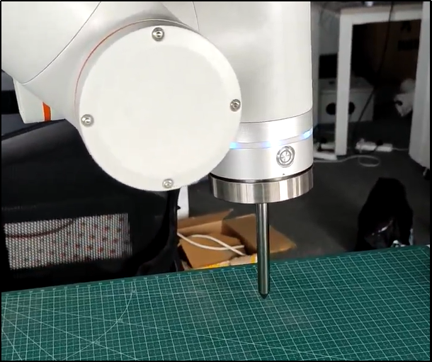

.. centered:: Figure 4.7-8-2-1 Starting point “segment01”

.. image:: teaching_pendant_software/294.png
   :width: 3in
   :align: center

.. centered:: Figure 4.7-8-2-2 Starting point “segment02”

Segment welding command added
********************************
**Step1**: Create a new user program "testSegment1.lua", click the "Segment Welding" button, and open the segment welding instruction adding page.

.. image:: teaching_pendant_software/295.png
   :width: 6in
   :align: center

.. centered:: Figure 4.7-8-2-3 Add segment welding command button

**Step2**: On the segment welding instruction adding page, select "segment01" as the "start point" and "segment02" as the "end point".

.. centered:: Figure 4.7-8-2-4 Starting point and end point of segment welding

**Step3**: Configure the debugging speed, execution length, non-execution length, functional mode, swing selection and rounding rules, and click the "Add" button and the "Apply" button in sequence.

**Step4**: At this time, "testSegment1.lua" has added segment welding motion instructions, as shown in Figure5.

.. image:: teaching_pendant_software/297.png
   :width: 6in
   :align: center

.. centered:: Figure 4.7-8-2-5 Addition of segment welding motion instructions

Changes in segment welding motion trajectory and attitude
************************************************************
The segment welding mode of the collaborative robot can be selected for the segment welding movement. The mode types include the following two types;

**No change in posture**:The robot always maintains the posture of the starting point of the welding trajectory during the welding trajectory.

**Changing posture**:During the welding trajectory process, the robot calculates the Cartesian pose and joint position of each segment of the trajectory, and changes its posture during the segment welding operation.

The following demonstrates the usage of "no change posture" and "change posture" respectively.

1. Do not change posture
   
As shown in Figure 6, open the segment welding instruction adding page, select "No change in attitude" for "segment welding mode", also select "start point" as "segment01", "end point" as "segment02", set the execution length to 100, non-execution Set the length to 50, select other relevant configurations and save the program.

.. centered:: Figure 4.7-8-2-6 Segment welding mode without changing attitude

2. Change posture
   
As shown in Figure 7, open the segment welding instruction adding page, select "Change Attitude" for "Segment Welding Mode", also select "Start Point" as "segment01", "End Point" as "segment02", set the execution length to 100, and the non-execution length. Set it to 50, select other relevant configurations and save the program.

.. centered:: Figure 4.7-8-2-7 Changing attitude segment welding mode

3. Section welding operation type

Running program, robot segment welding operation conditions are divided into the following types:

1) If the function mode selects the first segment to execute the function, and the swing selects the execution segment to swing, the rounding rule will not round. Then the robot performs swing motion at 100mm and linear motion at 50mm alternately, and stops when it reaches the end point;

.. centered:: Figure 4.7-8-2-8 The first section executes the swing function without rounding

2) If the function mode selects the first segment to not execute the function, the swing selection does not execute the segment swing, and the rounding rules do not round. Then the robot performs swing motion for 50mm and linear motion for 100mm alternately, and stops when it reaches the end point;

.. centered:: Figure 4.7-8-2-9 The first section does not execute the swing function and does not round

3) If the function mode selects the first segment to perform the function, the swing selects the execution segment to swing, and the rounding rules are rounded. Then the robot performs swing motion at 100mm and linear motion at 50mm alternately. After the last period of the overall cycle, if the remaining distance is less than 150mm, it will stop swinging;

.. centered:: Figure 4.7-8-2-10 The first section performs circular rounding of the swing function

4) If the function mode selects the first segment to perform the function, and the swing selects not to execute the segment swing, the rounding rules are rounded. Then the robot performs swing motion at 50mm and linear motion at 100mm alternately. After the last period of the overall cycle, if the remaining distance is less than 150mm, it will stop swinging;

.. centered:: Figure 4.7-8-2-11 The first section does not perform circular rounding of the swing function

5) If the function mode selects the first segment to execute the function, the swing selects the execution segment to swing, and the rounding rule is single segment rounding. Then the robot performs swing motion at 100mm and linear motion at 50mm alternately. After the last cycle, if the next segment is 100mm, swing planning is performed and the remaining distance is less than 100mm, the swing will stop; if the next segment is 50mm, linear motion planning is performed and the remaining distance is If it is less than 50mm, the movement will stop;

.. centered:: Figure 4.7-8-2-12 The first section performs single-section rounding of the swing function

6) If the function mode selects the first segment to perform the function, the swing selects not to execute segment swing, and the rounding rule is single segment rounding. Then the robot performs swing motion at 50mm and linear motion at 100mm alternately. After the last cycle, if the next segment is 50mm, swing planning is performed and the remaining distance is less than 50mm, then the swing is stopped; if the next segment is 100mm, linear motion planning is performed and the remaining distance is Less than 100mm, the movement stops.

.. centered:: Figure 4.7-8-2-13 The first section does not perform single-section rounding of the swing function

4. Posture contrast
   
When configuring different segment welding modes, the posture of the robot during welding trajectory operation will also be different. The posture comparison during operation is as follows:

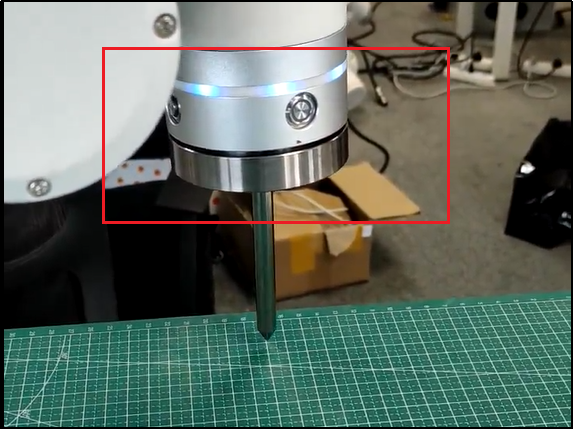

.. centered:: Figure 4.7-8-2-14 Initial posture of welding trajectory

.. image:: teaching_pendant_software/307.png
   :width: 3in
   :align: center

.. centered:: Figure 4.7-8-2-15 The posture does not change during operation

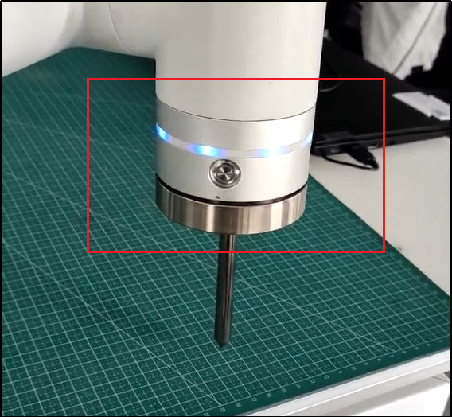

.. centered:: Figure 4.7-8-2-16 Change of attitude during operation

Actual scene of segment welding
*************************************
In the actual test environment, the robot needs to be equipped with a welding gun and other configurations, and perform welding operations on the welding plate according to the created segment welding instructions. The actual scene diagram is as follows:

.. image:: teaching_pendant_software/309.png
   :width: 3in
   :align: center

.. centered:: Figure 4.7-8-2-17 Actual scene of segment welding

Laser command
++++++++++++++++

Click the "Laser" icon to enter the Laser command editing interface

This command includes three parts: laser command, tracking command and positioning command. Before adding this command, please confirm whether the laser tracking sensor in the user peripheral has been configured successfully. See Robot Peripherals chapter for details.

In the sensor loading module, after displaying the corresponding "sensor command" interface according to the function selection, configure the sensor command:

**Ruiniu/CXZK**: Enter the weld type, range: 0~49 integer

.. image:: teaching_pendant_software/118.png
   :width: 6in
   :align: center

.. centered:: Figure 4.7-8-3 Laser command interface

**Quanshi**: Enter the task number, range: 0~255 integer

.. image:: teaching_pendant_software/278.png
   :width: 6in
   :align: center

.. centered:: Figure 4.7-8-3 Laser command interface

LT-Rec command
++++++++++++++++

Click the "LT-Rec" icon to enter the LT-Rec command editing interface

This command realizes the function of taking out the starting point and end point of laser tracking recording, so that the robot can automatically move to the starting point position, which is suitable for the occasion where the movement starts from the outside of the workpiece and laser tracking recording is performed. At the same time, the host computer can obtain the information of the starting point and end point in the recorded data. for follow-up exercise.

Realize the adjustable function of laser tracking and reproduction speed, so that the robot can record at a very fast speed, and then reproduce according to the normal welding speed, which can improve the working efficiency.

.. image:: teaching_pendant_software/216.png
   :width: 6in
   :align: center

.. centered:: Figure 4.7-8-4 LT-Rec command interface

W-Search command
++++++++++++++++

Click the "W-Search" icon to enter the W-Search command editing interface

This command is a welding wire positioning command, including three commands of start of positioning, end of positioning and calculation of offset. This command is generally used in welding scenes and requires the combination of welding machine and robot IO and motion commands.

.. image:: teaching_pendant_software/124.png
   :width: 6in
   :align: center

.. centered:: Figure 4.7-8-5 W-Search command interface

In writing a program, usually first set the start command of the search, and then add two LIN instructions to determine the direction of the search. After the search is successful, obtain the calculated offset, and pass the offset through the overall offset command. To take effect into the real welding motion command, the program example is as follows.

.. image:: teaching_pendant_software/125.png
   :width: 6in
   :align: center

.. centered:: Figure 4.7-8-6 W-Search example(1D)

Weld-Trc command
++++++++++++++++++

Click the "Weld-Trc" icon to enter the Weld-Trc command editing interface

This command realizes the robot seam tracking and uses the deviation detection of the welding seam to compensate the trajectory, and the arc sensor can be used to detect the seam deviation.

**Step1**:Upper and lower compensation reference current setting method: feedback, set the upper and lower reference current start counting and the upper and lower reference current counting

.. image:: teaching_pendant_software/217.png
   :width: 6in
   :align: center

.. centered:: Figure 3.7-8-7-1 Weld-Trc command interface-Feedback

**Step2**:Upper and lower compensation reference current setting method: constant, set the upper and lower reference current

.. image:: teaching_pendant_software/226.png
   :width: 6in
   :align: center

.. centered:: Figure 3.7-8-7-2 Weld-Trc command interface-constant

**Step3**:Left and right compensation parameter interactive page

.. image:: teaching_pendant_software/227.png
   :width: 6in
   :align: center

.. centered:: Figure 3.7-8-7-3 Weld-Trc command interface-left and right compensation parameters

Weld-Trc Operation
++++++++++++++++++++

Welding machine model and setting
**************************************

.. centered:: Table 4.1-2 Verified welding machine model

.. list-table::
   :widths: 70
   :header-rows: 0
   :align: center

   * - **Verified welding machine model**

   * - MEGMEET ArtsenII CM350
  
.. centered:: Table 4.1-3 Welding machine function setting

.. list-table::
   :widths: 100 100
   :header-rows: 0
   :align: center

   * - **Function number**
     - **Set the parameters**

   * - F18
     - 20

   * - F19
     - 56

PLC model and settings
**************************************

.. centered:: Table 4.1-4 Verified PLC models

.. list-table::
   :widths: 70
   :header-rows: 0
   :align: center

   * - **Verified PLC models**

   * - INOVANCE Easy521
  
.. centered:: Table 4.1-5 PLC key settings

.. list-table::
   :widths: 70 70
   :header-rows: 0
   :align: center

   * - **Settings**
     - **Set the contents**

   * - Communication protocols
     - CANOPEN

   * - Feedback current sampling source
     - Feedback data from welding machine

   * - Synchronization period
     - 2ms

:download:`Annex:PLC Program <../_static/_doc/MEGMEET PLC PROGRAME.zip>`

Arc tracking function
**************************************

**1）An introduction to the relationship between setting current and voltage and function tracking performance**

Setting the welding current voltage and feedback welding current signal,blow:

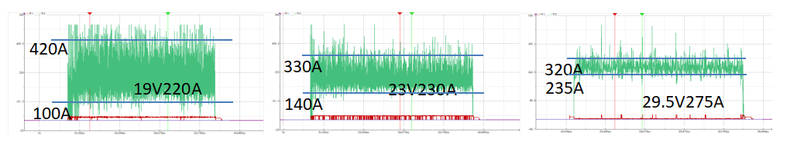

.. centered:: Figure 4.7-8-7-4 Short-circuit transition - > half-jet transition- > jet transition

.. note:: Set higher current and voltage value, feedback smaller burr amplitude of welding current, and more stable the welding process, and the more accurate the weld tracking. 

**2）Introduction to the parameters of the function interface**

.. centered:: Table 4.1-6 Arc tracking up-down compensation module

.. list-table::
   :widths: 70 70 70
   :header-rows: 0
   :align: center

   * - **The name of the parameter**
     - **Meaning**
     - **Parameter description**

   * - Arc tracking lag time
     - The time for the feedback current to lag
     - The default is 0ms, do not adjust it

   * - Compensation for up-down deviations
     - Up-down compensating switches
     - You can choose to "on" or "off"

   * - Up-down adjustment coefficients
     - The coefficient of the relationship between the current and the compensation distance (adjustment sensitivity)
     - The welding tends to be in a short-circuit transition state, and the current signal-to-noise ratio gradually decreases, so it is recommended to reduce the sensitivity

   * - Up-down start compensating period
     - The fastest periods to start the up-down compensation
     - Associated with the swing frequency, it is better to open when the current tends to be stable for 3~4s after arcing. If the oscillation frequency is 1 Hz, the parameter can be 4, if the frequency is 2 Hz, the parameter can be 8, and so on

   * - The maximum distance of up-down compensation each period
     - The maximum distance of compensation per up-down compensation period
     - According to the welding scene setting, the faster the weave frequency, the smaller the compensation distance

   * - The maximum distance of compensation for the up-down totals
     - The maximum cumulative distance of compensation for a single complete welding process
     - According to the welding scene setting, the larger the weld deviation, the larger the setting

   * - Up-down coordinate system selection
     - The coordinate system in which the compensation value is compensated
     - If there is a welding weave, select "Weave", otherwise select "Tool" or "Frame"

   * - Up-down reference current setting method
     - Selection of the reference current acquisition method
     - You can choose "Feedback" by reading the feedback current, or "Constant" by filling in the current value directly

   * - The up-down reference current samples start counting
     - The number of periods for which the reference current is harvested with a delay
     - Associated with the weave frequency, it is better to open when the current tends to be stable for 3~4s after arcing. If the weave frequency is 1 Hz, the parameter can be 4, if the frequency is 2 Hz, the parameter can be 8, and so on

   * - Up-down reference current sampling counts
     - Reference current feedback mode, the statistical period of collecting the reference current
     - Default 1 CYC

   * - Up-down reference currents
     - Reference current constant mode, reference current value
     - It can be filled in manually to achieve the desired compensation height

.. centered:: Table 4.1-7 Arc tracking left-right compensation module

.. list-table::
   :widths: 70 70 70
   :header-rows: 0
   :align: center

   * - **The name of the parameter**
     - **Meaning**
     - **Parameter description**

   * - Arc tracking lag time
     - The time for the feedback current to lag
     - The default is 0ms, do not adjust it

   * - Compensation for left-right deviations
     - Left-right compensation switches
     - You can choose to "On" or "Off"

   * - Left-right compensation coefficients
     - The coefficient of the relationship between the current and the compensation distance (adjustment sensitivity)
     - The welding tends to be in a short-circuit transition state, and the current signal-to-noise ratio gradually decreases, so it is recommended to reduce the sensitivity

   * - Left-right compensation start counting
     - The fastest count to start left-right compensation function
     - Associated with the weave frequency, it is better to start when the current tends to be stable for 3~4s after arcing. If the weave frequency is 1 Hz, the parameter can be 4, if the frequency is 2 Hz, the parameter can be 8, and so on

   * - Left-right the maximum distance of compensation each time
     - The maximum distance of compensation per compensation cycle
     - According to the welding scene setting, the faster the swing frequency, the smaller the compensation distance

   * - The maximum distance of compensation for the left -right totals
     - The maximum cumulative distance of compensation for a single complete welding process
     - According to the welding scene setting, the larger the weld deviation, the larger the setting
     
**3）Scope of application**

.. centered:: Table 4.1-8 Up-down compensation On, Left-right compensation Off

.. list-table::
   :widths: 70 70
   :header-rows: 0
   :align: center

   * - **Key parameters**
     - **Parameter range**

   * - Weave frequency Hz
     - 0 (without welding swing), 0.5 to 2 (with weld swing)

   * - Weave amplitude mm
     - 0 (without welding swing), 3 through 7 (with welding swing)

   * - Set the voltage V
     - >17

   * - Set the current A
     - >160
  
.. centered:: Table 4.1-9 Up-down compensation Off, Left-right compensation On

.. list-table::
   :widths: 70 70
   :header-rows: 0
   :align: center

   * - **Key parameters**
     - **Parameter range**

   * - Weave frequency Hz
     - 0.5 to 2

   * - Weave amplitude mm
     - 3 to 7

   * - Set the voltage V
     - >17

   * - Set the current A
     - >160
  
.. centered:: Table 4.1-10 Up-down compensation On, Left-right compensation On

.. list-table::
   :widths: 70 70
   :header-rows: 0
   :align: center

   * - **Key parameters**
     - **Parameter range**

   * - Weave frequency Hz
     - 0.5 to 2

   * - Weave amplitude mm
     - 3 to 7

   * - Set the voltage V
     - >19

   * - Set the current A
     - >210

**4）Precautions**

1) The left-right compensated arc tracking function can only be adapted to symmetrical triangle or sine weave based on line trajectory.
2) The starting position of the welding to be able using the compensation function must be accurately above the weld (the axis of the welding gun is in the center of the fillet weld), and the welding gun should not be too close to the seam, otherwise there is a risk of hitting the welding gun.

.. centered:: Figure 4.7-8-7-5 The welding gun is above the seam

3) If the deviation between the set trajectory and the seam is larger, the maximum compensation distance each time and the total maximum compensation distance should be larger too.
4) The deviation between the set trajectory and the end point of the weld should not be larger than 100mm/m, and too large the deviation may cause the welding wire or even the welding gun to hit the workpiece, so that the welding position deviates from the preset trajectory (the weave is not in place), resulting in the arc tracking function can not work normally.
5) Before the program starts the WeaveStart command, you need to add the ARCStart arc start command to the program.
6) About the relationship between the arc tracking compensation coordinate and the adjustment coefficient value positive or negative:

.. centered:: Figure 4.7-8-7-6 Welding scene

When the up-down compensation direction of the weld is consistent with the positive direction of the Z-axis of the selected coordinate system, the adjustment coefficient is a positive value.

Case: As shown in Figure 4.7-8-7-6, if the "base" or "tool" is selected in the up-down compensation coordinate system, when the workpiece is in the displayed position, the welding gun gradually moves upwards away from the surface of the workpiece when it is not compensated, and it will compensate downward (base coordinate system - Z direction), then the symbol of the up-down compensation coefficients should be a negative sign.

.. important:: 
   Note that when the "weave" coordinate system is selected, the Z-axis of the weave coordinate system and the Z-axis of the tool coordinate system are inverted, and the compensation coefficient should be positive if the above case is used.
   
   The coefficient of the left-right compensation of the weld does not need to be changed, and it is a positive value by default.

7) If a small set current and voltage is selected for welding, the compensate coefficient of arc tracking should be reduced accordingly to reduce the instability compensation caused by the burr of the feedback current.

Adjust command
++++++++++++++++

Click the "Adjust" icon to enter the Adjust command editing interface

This command adaptively adjusts the posture of the welding torch for the scene of welding tracking. After recording the three corresponding posture points, add the posture adaptive adjustment command according to the actual direction of the robot's movement. See Robot Peripherals chapter for details.

.. image:: teaching_pendant_software/113.png
   :width: 6in
   :align: center

.. centered:: Figure 4.7-8-8 Adjust command interface

Force control command interface 
~~~~~~~~~~~~~~~~~~~~~~~~~~~~~~~~~~~

.. image:: teaching_pendant_software/207.png
   :width: 6in
   :align: center

.. centered:: Figure 4.7-9 Force control command interface

F/T command
++++++++++++++++

Click the "F/T" icon to enter the F/T command editing interface

The instruction includes FT_Guard (collision detection), FT_Control (constant force control), FT_Spiral (spiral insertion), FT_Rot (rotation insertion), FT_Lin (linear insertion), FT_FindSurface (surface positioning), FT_CalCenter (center positioning) seven instructions, detailed See Robot Peripherals chapter.

.. image:: teaching_pendant_software/120.png
   :width: 6in
   :align: center

.. centered:: Figure 4.7-9-1 F/T command interface

Torque command
++++++++++++++++

Click the "Torque" icon to enter the Torque command editing interface

This command is a torque recording command, which realizes the real-time torque recording collision detection function. Click the "Torque Record Start" button to continuously record the collision situation during the operation of the motion command, and the recorded real-time torque is used as the theoretical value of the collision detection judgment to reduce the probability of false alarms. When the set threshold range is exceeded, the collision detection duration is recorded. Click the "Torque Recording Stop" button to stop recording. Click "Torque Record Reset" to return the status to the default state.

.. image:: teaching_pendant_software/138.png
   :width: 6in
   :align: center

.. centered:: Figure 4.7-9-2 Torque command interface

Visual command interface
~~~~~~~~~~~~~~~~~~~~~~~~~~~

.. image:: teaching_pendant_software/208.png
   :width: 6in
   :align: center

.. centered:: Figure 4.7-10 Visual command interface

3D command
++++++++++++++++

Click the "3D" icon to enter the 3D command editing interface

This command generates commands for 3D vision program examples. Users can refer to the generated programs and communicate with other vision devices, including two program case references of camera calibration and camera capture.

.. image:: teaching_pendant_software/121.png
   :width: 6in
   :align: center

.. centered:: Figure 4.7-10-1 3D command interface

Palletizing command interface
~~~~~~~~~~~~~~~~~~~~~~~~~~~~~~~~

.. image:: teaching_pendant_software/209.png
   :width: 6in
   :align: center

.. centered:: Figure 4.7-11 Palletizing command interface

Pallet command
++++++++++++++++

Click the "Pallet" icon to enter the Pallet command editing interface

This instruction generates instructions for the palletizing program, which is consistent with the matrix movement function in Section 3.9.6. For details, refer to that chapter.

.. image:: teaching_pendant_software/122.png
   :width: 6in
   :align: center

.. centered:: Figure 4.7-11-1 Pallet command interface 

Communication command interface
~~~~~~~~~~~~~~~~~~~~~~~~~~~~~~~~~~~~

.. image:: teaching_pendant_software/210.png
   :width: 6in
   :align: center

.. centered:: Figure 4.7-12 Communication command interface

Modbus command
++++++++++++++++

Click the "Mobus" icon to enter the Modbus command editing interface

The command function is a bus function based on the ModbusTCP protocol. The user can control the robot to communicate with the ModbusTCP client or server (the master station communicates with the slave station) through relevant instructions, and perform read and write operations on coils, discrete quantities, and registers.

.. image:: teaching_pendant_software/131.png
   :width: 6in
   :align: center

.. centered:: Figure 4.7-12-1 modbus command master interface

.. image:: teaching_pendant_software/132.png
   :width: 6in
   :align: center

.. centered:: Figure 4.7-12-2 modbus command slave interface

For more operating functions of ModbusTCP, please contact us for consultation.

Xmlrpc command
++++++++++++++++

Click the "Xmlroc" icon to enter the Xmlrpc command editing interface

XML-RPC is a remote procedure call method for transferring data between programs using xml over sockets. In this way, the robot controller can call the function (with parameters) in the remote program/service and obtain the returned structured data. The Robot Controller handles all the details of writing XML-RPC client messages and handling conversions between data types and XML.

.. image:: teaching_pendant_software/136.png
   :width: 6in
   :align: center

.. centered:: Figure 4.7-12-3 Xmlrpc command interface

.. important:: 
   1) The controller acts as a client to connect to the remote custom port;

   2) The controller acts as a client to call the remote function;

   3) Support calling different remote functions;

   4) Support string array parameter input and character array result return, the number of array elements can be customized;

   Support double-type array parameter input and double-type array result return, the number of array elements can be customized;

::

   XmlrpcClientCall(serverUrl,methodName,tableType,param)

   serverUrl server url, for example:"http://192.168.58.29:50000/RPC2"

   methodName Call function name, "example.add"

   tableType 1-double array, 2-string array

   param call function parameters

::

   XmlrpcClientCall(error, result)

   error 0 - no error, 1 - error

   result If the parameter is passed in as a double array, the result is a double array,

   If the parameter is passed in as an array of string type, the result will be an array of string type

Auxiliary command interface
~~~~~~~~~~~~~~~~~~~~~~~~~~~~~~~~

.. image:: teaching_pendant_software/211.png
   :width: 6in
   :align: center

.. centered:: Figure 4.7-13 Auxiliary command interface

Thread command
++++++++++++++++

Click the "Thread" icon to enter the Thread command editing interface

The Thread command is an auxiliary thread function. Users can define an auxiliary thread to run simultaneously with the main thread. The auxiliary thread mainly performs data interaction with external devices, supports socket communication, obtains robot DI status, robot DO status settings, and obtains robot status information. Thread data interaction, the data obtained by the main thread through the auxiliary thread is used to control the judgment of the robot's motion logic, the screenshot of the user program example:

.. image:: teaching_pendant_software/127.png
   :width: 6in
   :align: center

.. centered:: Figure 4.7-13-1 Thread program example

Function command
++++++++++++++++

Click the "Function" icon to enter the Function command editing interface

This command is to call the function interface function, provide the robot interface function to the customer to choose, and remind the customer of the parameters required by the function, which is convenient for the customer to write script commands, and more functions are being added one after another.

.. image:: teaching_pendant_software/134.png
   :width: 6in
   :align: center

.. centered:: Figure 4.7-13-2 Function command interface

PT-Mode command
++++++++++++++++

Click the "PT-Mode" icon to enter the PT-Mode command editing interface

This command is mainly used for mode switching between system mode and point table mode. Teaching points in different point tables can be applied by switching point tables.For details, see \ `Teaching management page <teaching_pendant_software.html#teaching-management>`__\

.. image:: teaching_pendant_software/232.png
   :width: 6in
   :align: center

.. centered:: Figure 4.7-13-3 PT-Mode command interface

Teaching program is not saved for verification
~~~~~~~~~~~~~~~~~~~~~~~~~~~~~~~~~~~~~~~~~~~~~~~~

On the program teaching page, after opening/creating a new program, if the teaching program is modified, the program is not saved.

If you click "Open", "New", "Export", "Rename" and other related file operations, the "Do you want to save this program" pop-up box will be triggered, prompting "The current program has changed. Do you want to save the changes to this program?" ,As shown below.

.. image:: teaching_pendant_software/221.png
   :width: 6in
   :align: center

.. centered:: Figure 4.7-14 The current page program does not save verification

**Step1**:Click the "Not Save" button, and the program will restore the unmodified data and continue to perform previous related file operations.

**Step2**:Click the "Save" button, the unsaved Lua program is saved successfully, and the previous related file operations continue to be performed.

If you leave the program teaching page and switch to other pages, the prompt "Do you want to save this program" will also be triggered, and you will still stay on the current teaching program page, as shown below.

.. image:: teaching_pendant_software/222.png
   :width: 6in
   :align: center

.. centered:: Figure 4.7-15 Switch page program does not save verification

**Step1**:Click the "Not Save" button to jump to the previously selected page.

**Step2**:Click the "Save" button, and the unsaved Lua program is saved successfully and jumps to the previously selected page.

Teaching program encryption
~~~~~~~~~~~~~~~~~~~~~~~~~~~~~~~

The teaching procedure is divided into a state of encryption and non-encryption. The encryption level is divided into first-level encryption and secondary encryption. Among them, the level of first-level encryption is the highest, and the secondary is second.
All teaching programs are displayed and set in the form of program encryption information in "System Settings - Custom Information". Encryption level descriptions are provided to the right of the table.

.. image:: teaching_pendant_software/259.png
   :width: 6in
   :align: center

.. centered:: Figure 4.7-16 Demonstration of teaching procedures

When the program is a first-level encryption state, after opening the program: the corresponding "export", "preservation", "existing as", "copy", "cut", "delete", "delete", "delete", "delete", "delete" The buttons such as "upward", "downward" and "editing mode switching" will be grayed.
Click the icon to be invalid and it will prompt that the current program is in an encrypted state. The program "renamed" icon will hide. Add instruction bars and program editing areas are invisible and prompts to be locked in first-level encryption.

.. image:: teaching_pendant_software/247.png
   :width: 6in
   :align: center

.. centered:: Figure 4.7-17 Program first-level encryption interface

When the program is second-level encryption, after opening the program on the "Program Demonstration" page: the corresponding "savings", "copy", "shear", "paste", "delete", "upper", "upper" in the operating bar The buttons such as the "Move" will turn ashes.
Click the icon to be invalid and it will prompt that the current program is encrypted. The program "renamed" icon will hide. The adding instruction bar is not visible and prompts to be locked in a secondary encryption. The program editing area can browse the reading program normally.

.. image:: teaching_pendant_software/248.png
   :width: 6in
   :align: center

.. centered:: Figure 4.7-18 Program second-level encryption interface

Both first -level encryption and second -level encryption can use the "export" function. Verification operations will be performed when importing.
If the program of the same name is an encrypted file, the import operation will be interrupted and indicated that the coverage of the encryption program cannot be introduced.

.. image:: teaching_pendant_software/252.png
   :width: 6in
   :align: center

.. centered:: Figure 4.7-19 Program import

Local teaching point
~~~~~~~~~~~~~~~~~~~~~~~~

The local teaching point is bound to the current teaching program. When adding a program command, it can only be applied to the current teaching program and cannot be used in other teaching programs.

**Add**: Click the "Add Local Teaching Point" icon on the far right of the program file name to add local teaching points. (For detailed records of local teaching points, please refer to the teaching point records in robot operation)

.. image:: teaching_pendant_software/236.png
   :width: 6in
   :align: center

.. centered:: Figure 4.7-20 Add local teaching points

**Delete**: Click the serial number column of the table to select the local teaching point to be deleted, and then click the "Delete" icon in the upper right corner of the title of the local teaching point to delete the local teaching point.

.. image:: teaching_pendant_software/243.png
   :width: 6in
   :align: center

.. centered:: Figure 4.7-21 Delete local teaching point

**Run**: Click the "Start Running" icon in the data operation bar of the local teaching point table to perform a single-point operation of the local teaching point and move the robot to the position of this point.

.. image:: teaching_pendant_software/266.png
   :width: 6in
   :align: center

.. centered:: Figure 4.7-22 Run local teaching point

**Details**: Click the "Details" icon in the data operation bar of the local teaching point table to view the details of the local teaching point.

.. image:: teaching_pendant_software/255.png
   :width: 6in
   :align: center

.. centered:: Figure 4.7-23 Local teaching point details

Current program backup
~~~~~~~~~~~~~~~~~~~~~~~~~~

After the user modifies the teaching program and clicks save, the "backup" function of the current program is triggered (the backup time is 1 year), and the initial content of the current program is saved and displayed on the right side, which is convenient for the user to compare the modified content.
Users can view the corresponding program backup content by selecting a date, and click the "Delete" icon in the upper right corner to delete the current program backup content. The content of the current program backup can only be viewed, not modified.

.. image:: teaching_pendant_software/258.png
   :width: 6in
   :align: center

.. centered:: Figure 4.7-24 Current program backup

Modbus TCP Communication
~~~~~~~~~~~~~~~~~~~~~~~~~~~~
ModbusTCP is a commonly used communication protocol in industrial production. Faao collaborative robots provide two ways to communicate with your device: ModbusTCP master and ModbusTCP slave.

The collaborative robot supports up to 8 ModbusTCP masters to communicate with external devices at the same time, and each master supports up to 128 registers; the collaborative robot ModbusTCP slave has 128 coils, 128 discrete inputs, 64 holding registers and 64 input registers (holding registers and input register data types include unsigned, signed and floating point types). At the same time, some ModbusTCP slave input register addresses of collaborative robots are dedicated to feedback information such as the current robot's joint position and movement speed, and some coil register addresses are dedicated to controlling the robot to start the program, stop the program, set the control box DO and other functions.

The robot ModbusTCP slave only supports establishing a connection with one master station. The robot can communicate with different devices as a master and a slave at the same time. The following is a detailed usage method.
 
ModbusTCP master
+++++++++++++++++

Before using the cooperative robot as the ModbusTCP master station to communicate with your equipment, please check the network connection between your equipment and the robot, and confirm that the network interfaces are in the same network segment.

There are several steps to use the robot ModbusTCP master station: ①Add the master station; ②Add registers; ③Communication test; (4)Writing user programs; 

Add ModbusTCP master
********************
As shown in Figure 1, open the WebApp, click "Teaching" and "Program Teaching" in turn to create a new user program "testModbusMaster.lua".

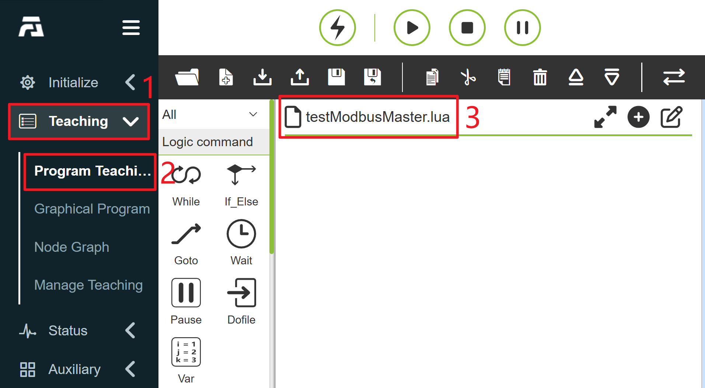

.. centered:: Figure 4.7-25-1 Create ModbusTCP master station user program

As shown in Figure 2, click the button to pop up/hide the content on the right side of the current program.

.. image:: teaching_pendant_software/234.png
   :width: 6in
   :align: center

.. centered:: Figure 4.7-25-2 The content on the right side of the current program pops up

As shown in Figure 3, click "ModbusTCP Settings" button to open the ModbusTCP function configuration page.

.. image:: teaching_pendant_software/338.png
   :width: 6in
   :align: center

.. centered:: Figure 4.7-25-3 Open ModbusTCP Settings

As shown in Figure 4, click "Master settings" and "Add Modbus master station" in turn to finish adding a ModbusTCP master station.

.. centered:: Figure 4.7-25-4 Add "ModbusTCP Master Station

As shown in Figure 5, according to your equipment, enter the name, slave ip, port number, slave number and communication cycle in turn. The specific meanings of the above parameters are as follows:

**Name**:ModbusTCP master station name. Robots can create up to 8 master stations to connect with corresponding slave stations. Different master stations can be distinguished by unique names, such as PLC, camera, data acquisition card and FRRobot1;

**Slave IP**:the slave IP address to which the ModbusTCP master station of the robot is connected;

.. note:: The robot and slave equipment must be connected through the network cable first, and the IP addresses of the robot and slave equipment must be in the same network segment.

**Port number**:The port number of ModbusTCP slave station to be connected;

**Slave station number**:ModbusTCP slave station number to be connected;

**Communication period**: The period (ms) when the robot ModbusTCP master station inquires about the slave station status, which only affects the update speed of the slave station register data on the ModbusTCP Settings page, but does not affect the speed of reading or writing the ModbusTCP slave station register value in the lua program of the user.

.. centered:: Figure 4.7-25-5 Setting ModbusTCP master station parameters

After the above parameters are correctly input, the ModbusTCP master station of the robot automatically establishes a connection with the configured slave station. After the connection is successful, the "Connection status" indicator on the page lights up as shown in Figure 6.

.. note:: 
   If you have confirmed that the relevant parameters of ModbusTCP master station are correctly configured, but the robot is not successfully connected with your equipment, please check the following configurations:
   
   ①The physical network connection between the robot and the slave equipment;

   ②The IP addresses of the two network physical ports of the robot teaching device and the control box are different, please confirm whether they are connected to the correct network port;

   ③Please confirm whether the network port of the robot and the network port of the slave station equipment are in the same network segment. If the IP address of the robot is 192.168.58.2, the IP address of the slave station equipment must be 192.168.58.0~192.168.58.255, and it cannot be the same as the IP address of the robot; 
   
   ④Check whether the port number of the slave equipment is the same as the set port number. (If the connection status indicator is flashing, it means that the register address in the master station is wrong. Please check whether the register type and address are correct)

.. centered:: Figure 4.7-25-6 Connection status of Modbus TCP master station

At this point, we have completed the creation of a ModbusTCP master station for the robot. If you click "Add Modbus Master Station" again, you can create a new ModbusTCP master station (Figure 7). The robot can support up to 8 master stations to communicate with external devices at the same time. Double-click the "Delete" button in the upper right corner of the Modbus master station to delete the Modbus master station.

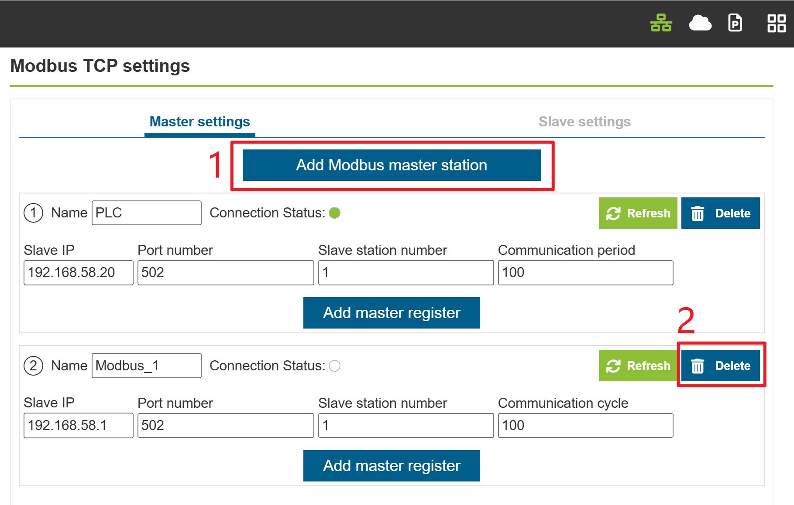

.. centered:: Figure 4.7-25-7 Add ModbusTCP master station again

ModbusTCP master add register
*******************************
As shown in Figure 8, click the "Add master register" button to add a register for this master station.

.. centered:: Figure 4.7-25-8 Add ModbusTCP master station register

As shown in Figure 9, select the modbus register type, input address number and name of the master station in turn, and the meanings of each parameter are as follows:

**Type**:Register type, DI:discrete input; DO:coil; AI-unsigned:unsigned input register (0-65535); AI-signed:signed input register (-32768-32767); AI-float:float type input register (the data length of float type register is 32 bits, occupying two signed or unsigned registers); AO-unsigned:unsigned holding register (0-65535); AI-signed:signed holding register (-32768-32767); AI-float:float type holding register (the data length of float type register is 32 bits, occupying two signed or unsigned registers), among which the floating-point type registers in AI and AO are big-end display.

**Address number**:The address of ModbusTCP slave register to be read or written;

**Name**: The alias of the register. The ModbusTCP master station of the robot can set up at most 128 different registers, and each register can be distinguished by different names according to the actual meaning, such as "Start", "Servo in Place" and "Liquid Level".

.. centered:: Figure 4.7-25-9 Setting ModbusTCP master station register parameters

Click the "Add Master Register" button again to add another master register, and double-click the "Delete" button on the right side of the register to delete it, as shown in Figure 10, a register is added for each type. 

.. note:: If the master station connection status indicator flashes after adding the master station register, it means that the master station register address cannot be read. Please check whether the register type and address are correct.

.. centered:: Figure 4.7-25-10 Adding Multiple Master Station Registers

ModbusTCP master communication test
************************************
Before the communication test, please check whether the "Cnnection status" indicator of ModbusTCP master station is always on. If the indicator is always on, it means that the current connection has been successful. 

As shown in Figure 11, the robot Modbus master station register has an "address value" value box for displaying the current register value, in which the registers of DI (discrete input) and AI (input register) are read-only and the corresponding address values are gray non-editable value boxes. 

When the value of the corresponding address of the slave station changes, the robot master station displays the current value synchronously corresponding to the register address value. DO (coil) and AO (holding register) are readable and writable registers, so their addresses are white editable value boxes, which can be used to read the values of the corresponding registers of ModbusTCP slave stations or modify the values of the registers on the Modbus master station setting page of the robot.

.. centered:: Figure 4.7-25-11 Modbus master station address value

1. Numerical monitoring of DI and AI type registers of master

On the external ModbusTCP slave device, set the address value of No.255 of DI (discrete input) register to 1, change the address value of No.257 of AI (input register) to No.123, change the address value of No.258 to -123, and change the address value of No.259 to 123.3. At this time, the address value of the corresponding register on the robot Modbus master station setting page will be displayed accordingly, as shown in Figure 12. 

.. note:: 
   Because the register with address 259 is a floating-point register, it actually occupies two 16-bit registers 259 and 260 to store a floating-point number, so you can't set a separate register to operate the No.260 register of AI, otherwise a numerical error will occur.

.. centered:: Figure 4.7-25-12 Modbus master station displays the values of DI and AI registers

2. Numerical writing of DO and AO type registers in the master
   
As shown in figure 13, in the Modbus master station setting page of the robot, enter 1 in the No.255 address value input box of the DO (coil) type register named 'Start', and enter 65535,-32767 and 128.78 input boxes of the AO (holding register) named 'Target position A', 'Target position B' and 'Target position C' respectively.

.. centered:: Figure 4.7-25-13 Modbus master station writes DO and AO registers

3. Numerical monitoring of DO and AO type registers of master
If you change the values of DO (coil) and AO (holding register) in ModbusTCP slave station, the register address value of ModbusTCP master station setting page will not be updated immediately. You need to click the "Refresh" button in the upper right corner of master station configuration, and then the register address values of DO and AO on the page will be updated, as shown in Figure 14.

.. centered:: Figure 4.7-25-14 Refresh the DO and AO address values of ModbusTCP master station.

Write ModbusTCP master program
+++++++++++++++++++++++++++++++++

As shown in Figure 15, click "All" and "Communication command" in turn to open the communication command adding page.

.. image:: teaching_pendant_software/350.png
   :width: 6in
   :align: center

.. centered:: Figure 4.7-25-15  Open the communication command add page

As shown in Figure 16, click "Modbus".

.. image:: teaching_pendant_software/351.png
   :width: 6in
   :align: center

.. centered:: Figure 4.7-25-16 Select Modbus

As shown in Figure 17, click "Modbus_TCP".

.. image:: teaching_pendant_software/352.png
   :width: 6in
   :align: center

.. centered:: Figure 4.7-25-17 Select Modbus_TCP
   
As shown in Figure 18, select "Master station (client)" to open the ModbusTCP master station command addition page (Figure 19).

.. image:: teaching_pendant_software/353.png
   :width: 6in
   :align: center

.. centered:: Figure 4.7-25-18 Selecting Master Station (Client)

.. centered:: Figure 4.7-25-19 ModbusTCP master station command addition

1. Write a single digital output DO (coil)

As shown in Figure 20, select "Modbus master name" as the master station ‘PLC’ added on the Modbus master station setting page before, with DO name as ‘Start’, register number as 1 and register value as 1, and click the "Write digital output" button. Finally, scroll to the bottom of the page and click the "Apply" button (Figure 21).

.. centered:: Figure 4.7-25-20 Adding Write Single Digital Output

.. centered:: Figure 4.7-25-21 Apply write a single digital output command

As shown in Figure 22, at this time, the robot program "testModbusMaster.lua" has added an command for the Modbus master station of the robot to write a single digital output. Switch the robot to the automatic mode, click the start button, and the robot will write the address value of the coil register ‘Start’ corresponding to the master station "PLC" as 1.

.. image:: teaching_pendant_software/357.png
   :width: 6in
   :align: center

.. centered:: Figure 4.7-25-22 Writing a single coil lua program

2. Write multiple digital outputs DO (coils)
As shown in Figure 23, open the ModbusTCP master station command adding page, select Modbus master name as the master station ‘PLC’ added in the Modbus master station setting page before, the name of DO is ‘Start’, the number of registers is 5, and the register values are 1,0,1,0,1. the number of register values should correspond to the set number of registers, and multiple register values should be separated by English commas, and click the ‘Write digital output’ button. Finally, scroll to the bottom of the page and click the "Apply" button (Figure 24).

.. centered:: Figure 4.7-25-23 Configures writing multiple digital outputs
   

.. centered:: Figure 4.7-25-24 Apply writing multiple digital outputs

As shown in figure 25, at this time, the robot program "testModbusMaster.lua" has added an command that the robot Modbus master station writes multiple digital outputs, so as to switch the robot to the automatic mode, click the start button, and the robot will write the values of the coil register ‘Start’ corresponding to the master station ‘PLC’ and the following four coils as 1, 0, 1, 0 and 1 respectively.
   
.. image:: teaching_pendant_software/360.png
   :width: 6in
   :align: center

.. centered:: Figure 4.7-25-25 Programming multiple coils lua

3. Read a single digital output DO (coil)
   
As shown in Figure 26, open the ModbusTCP master station command addition page, select "Modbus master name" as the master station "PLC" added in the Modbus master station setting page before, the DO name is "Start", the number of registers is 1, and the register value does not need to be filled in, and click "Read digital output". Finally, scroll to the bottom of the page and click the "Apply" button (Figure 27).
   

.. centered:: Figure 4.7-25-26 Configuring Reading a Single Digital Output
      

.. centered:: Figure 4.7-25-27 Applying Reading a Single Digital Output

As shown in figure 28, at this time, the robot program "testModbusMaster.lua" has added an command for the robot Modbus master station to read a single digital output.
      
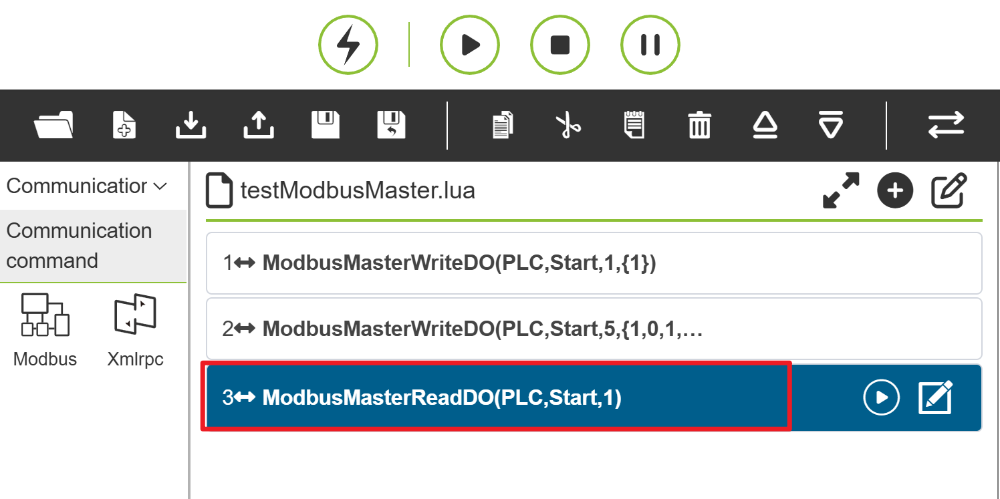

.. centered:: Figure 4.7-25-28 Program for reading a single coil

Usually, after reading the Modbus register, the read value is stored in a variable, so it is necessary to define a variable to store the read value. As shown in figure 29, click the "switch mode" Button to switch the robot lua program to an editable state, and write the variable "startValue" with added return value before the "ModbusMasterReadDO" command, and the value read after executing the program will be stored in "startValue".
      

.. centered:: Figure 4.7-25-29 Reading a single digital output into a variable

The register value of coil type is only 0 and 1, so different operations can be carried out by judging the different register values in robot programs. As shown in Figure 30, click the "Switch Mode" button to switch the robot teaching program to the non-editable mode, and add two joint motion commands to move to two different points "P1" and "P2" respectively.
      

.. centered:: Figure 4.7-25-30 Add motion commands of different points

As shown in Figure 31, the program is switched to the editable mode again, and the judgment condition of the coil value "startValue" is written. When the value of "startValue" is 1, the robot moves to the point "P1", otherwise the robot moves to the point "P2".
      

.. centered:: Figure 4.7-25-31 Move to different points according to different coil values

Finally, switch the robot program to non-editable mode, switch the robot to automatic mode, and start the running program on the premise of confirming safety. As shown in figure 32, the first two lines of the program set the DO value of the coil named "Start" to 1, so the robot will move to the "P1" point after executing the program.
      

.. centered:: Figure 4.7-25-32 Read the register value of a single coil and move it

4. Read multiple digital DO (coils)
As shown in Figure 33, open the ModbusTCP master station command adding page, select "Modbus master name" as the master station "PLC" added in the Modbus master station setting page, the name of DO is "Start", the number of registers is 6, and the register value does not need to be filled in, and click "Read digital output". Finally, scroll to the bottom of the page and click the "Apply" button (Figure 34).
      

.. centered:: Figure 4.7-25-33 Configuring Reading Multiple Digital Outputs 
         

.. centered:: Figure 4.7-25-34 Applying Reading Multiple Digital Outputs

As shown in figure 35, at this time, the robot program "testModbusMaster.lua" has added an command that the robot Modbus master station reads multiple digital outputs.
         
.. image:: teaching_pendant_software/370.png
   :width: 6in
   :align: center

.. centered:: Figure 4.7-25-35 Reading multiple digital output programs

As shown in figure 36, click the "switch mode" button "" to switch the robot lua program to the editable state. Since the number of readings is six, it is necessary to write and add six return value variables "value1,value2,Value3,Value4, Value5,value6" before the "ModbusMasterReadDO" command, and the six register values read after the program execution will have the above six variables respectively.
         

.. centered:: Figure 4.7-25-36 Reading Multiple Digital Outputs and Storing Variables

5. Read DIgital input DI (discrete input)
As shown in Figure 37, open the ModbusTCP master station command addition page, select "Modbus master name" as the master station "PLC" previously added in the Modbus master station setting page, the DI name is "Servo arrive", the number of registers is 2, and click "Read digital input". Finally, scroll to the bottom of the page and click the "Apply" button (Figure 38).
         

.. centered:: Figure 4.7-25-37 Configuring Read Digital Input
            

.. centered:: Figure 4.7-25-38 Applying Read Digital Input

As shown in figure 39, at this time, the robot program "testModbusMaster.lua" has added an command for the Modbus master station to read digital input.
            

.. centered:: Figure 4.7-25-39 Reading digital input program commands

As shown in Figure 40, click the "Switch Mode" button "" to switch the robot lua program to an editable state, and write the return value variables "state1,state2" before the "ModbusMasterReadDO" command. The two digital input values read after executing the program will be stored in the variables "state1" and "state2" respectively, and you can control the robot to do different operations by judging the variable values.
            

.. centered:: Figure 4.7-25-40 Reading digital input and storing variables

6. Read and write analog input AI (input register) and analog output AO (holding register)
The reading and writing operations of analog input AI (input register) and analog output AO (holding register) are basically the same as those of digital input DI (discrete input) and digital output DO (coil), but the difference is that the data range of the latter is only 0 or 1, while the data range of the former is larger, so the specific operations can refer to the programming of digital input and digital output, and only the reading input AI (Figure 41) and writing analog output AO are shown here.
            

.. centered:: Figure 4.7-25-41 Reading analog input AI
            
.. image:: teaching_pendant_software/377.png
   :width: 6in
   :align: center

.. centered:: Figure 4.7-25-42 Read and write analog output AO

7. Waiting for digital input
As shown in Figure 43, open the ModbusTCP master station command addition page, find the "Wait for digital input to be set", that is, wait for DI discrete input setting, select the "servo in place" register with DI name as the configuration, the waiting status is "True" and the timeout time is 5000 ms. Click "Add" button, and finally click "Apply" button.
            

.. centered:: Figure 4.7-25-43 Add the command of waiting for DI input

As shown in Figure 44, at this time, the robot program "testModbusMaster.lua" has added an command that the robot Modbus master station waits for DIgital input DI. After starting the program, the robot will wait for the value of the "Servo arrive" register of the "PLC" master station to become true, that is, the value 1. Since the set timeout is 5s, when the "Servo arrive" signal is still 0 after the robot waits 5s, the robot program will report a timeout error and the program will stop.
            
.. image:: teaching_pendant_software/379.png
   :width: 6in
   :align: center

.. centered:: Figure 4.7-25-44 Waiting for Digital Input DI Program

8. Waiting for analog input
As shown in Figure 45, open the ModbusTCP master station command addition page, find "Waiting for analog input setting", that is, waiting for the setting of AI input register, select the configured "liquid level" register with AI name, waiting status of ">", register value of 255 and timeout time of 5000 ms.. Click "Add" button, and finally click "Apply" button.
            

.. centered:: Figure 4.7-25-45 Add Waiting for Analog Input

As shown in Figure 46, at this time, the robot program "testModbusMaster.lua" has added an command that the robot Modbus master station waits for the AI input register value. After starting the program, the robot will wait for the "Liquid level" register value of the "PLC" master station to be greater than 255. Since the set timeout is 5s, when the "Liquid level" signal is still less than 255 after the robot waits for 5s, the robot program will report a timeout error and the program will automatically stop running.
            

.. centered:: Figure 4.7-25-46 Waiting for AI Input Register Program

ModbusTCP slave
++++++++++++++++++

Robot ModbusTCP slave station provides four types of registers: Digital input (coil), Digital output (discrete input), Analog input (holding register) and Analog output (input register). The digital input and analog input are mainly used for the robot to read the data of the external ModbusTCP master station to control the robot operation, while the digital output and analog output are mainly used for the robot to send data signals to the external ModbusTCP master station equipment, and the external master station equipment reads the relevant register values to control the equipment operation. In addition to the above-mentioned general input and output, the robot also provides some "Functional digital input (coils)" for the external master station equipment to control the robot's start-up program and stop-up program, and provides some input registers to display the current robot's state information, including the robot's current Cartesian position, the robot's current running state, etc. (please refer to Annex 1: ModbusTCP slave address mapping table). The use process of robot ModbusTCP slave station mainly includes: ①parameter configuration; ②Communication test; ③Programming.

ModbusTCP slave communication parameter configuration
******************************************************

As shown in Figure 47, open the WebApp, click "Teaching" and "Program Teaching" in turn to create a new user program "testModbusSlave.lua".
            

.. centered:: Figure 4.7-25-47 Create ModbusTCP slave station user program

As shown in Figure 48, click the button "" to pop up/hide the content on the right side of the current program.
            

.. centered:: Figure 4.7-25-48 The content on the right side of the current program pops up

As shown in Figure 49, click "ModbusTCP Settings" button to open the ModbusTCP function configuration page.
            
.. image:: teaching_pendant_software/384.png
   :width: 6in
   :align: center

.. centered:: Figure 4.7-25-49 Open ModbusTCP Settings

As shown in Figure 50, click "Slave Settings" in turn, and enter the IP, Port number and Slave station number of the robot slave station, where "IP" is the IP address of the robot slave station, FAIRINO cooperative robot has two network ports, the teaching device and the control box and the IP addresses of the two ports are different. Enter the correct IP address according to the network port where the external device is connected to the robot slave station (it is recommended that you use the network port on the control box).You have to restart robot after change the IP address, port number or slave station number of the robot ModbusTCP slave station,otherwise it won't take effect.
            

.. centered:: Figure 4.7-25-50 ModbusTCP slave settings

After the parameters of ModbusTCP slave station are set and the robot is restarted, the external master station equipment can establish a connection with the robot slave station through the set parameters. After the connection is successful, the "Connection status" indicator light on the robot slave station setting page will light up (Figure 51).
            

.. centered:: Figure 4.7-25-51 slave station connection status indicator light

ModbusTCP slave communication test
************************************

1. Digital input (coil)

The robot ModbusTCP slave station provides 128 coil registers, and their register addresses are 100~127.

.. note:: Please refer to Annex I: ModbusTCP slave station address mapping table.

Aliases can be set for the general registers of robot ModbusTCP slave stations as shown in Figure 52. Modify the name of the robot slave station coil register DI0 to be "A in place" and the name of DI1 to be "B in place". According to the address mapping table, the Modbus coil addresses of "A in place" and "B in place" are 100 and 101, respectively. Set the robot slave station coil register addresses 100 and 101 to 1 on the external ModbusTCP master station equipment, At this time, two register indicators on the monitoring page of the robot ModbusTCP slave station light up .
            

.. centered:: Figure 4.7-25-52 ModbusTCP slave station coil state monitoring

2. Digital output (discrete input)

The robot ModbusTCP slave station provides 128 discrete input registers, and their register addresses are 100~127.

.. note:: Please refer to Annex 1: ModbusTCP slave station address mapping table for specific definitions.

Similarly, the robot ModbusTCP slave's discrete input register can also be set with aliases, as shown in Figure 53. Click "Digital Output (Discrete Input)" to modify the name of the robot slave's discrete input register DO0 as "A Start" and DO1 as "B Start". According to the address mapping table, the Modbus discrete input addresses of "A Start" and "B Start" are 100 and 101 respectively. Click "A Start" to correspond to the discrete input indicator light, which lights up, and the value of the corresponding register address 100 becomes 1, which can be read from the external ModbusTCP master station equipment.

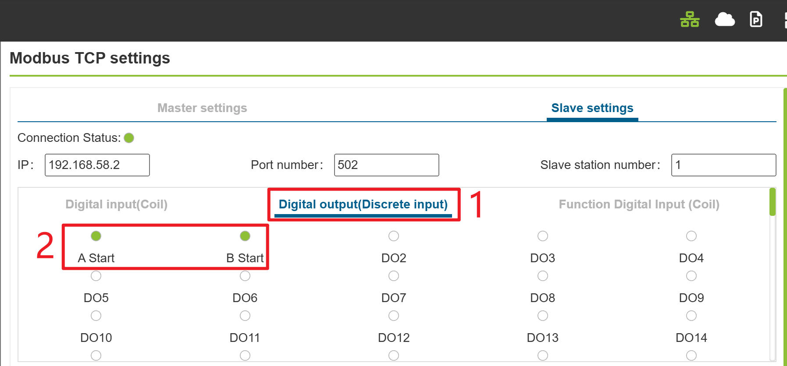

.. centered:: Figure 4.7-25-53 ModbusTCP slave discrete input control

3. Analog input (holding register)

The robot provides 64 holding registers of unsigned, signed and float types, with the addresses of AI0~AI63 ranging from 100 to 195.

.. note:: text
   Please refer to Annex 1: ModbusTCP slave address mapping table for specific definitions, in which the data range of unsigned register is 0~65535, the data range of signed register is -32768~32767, and the float register is displayed at the big end.
   
   As shown in Figure 53, the names of AI0 and AI1 are changed to "voltage" and "current" respectively, and the addresses of the two registers are found to be 100 and 101 respectively from the ModbusTCP slave address mapping table. Therefore, when the connected master station equipment modifies the register address values of the holding registers 100 and 101, the register address values of "voltage" and "current" on the ModbusTCP slave station monitoring page of the robot are updated and displayed synchronously, and the robot's analog input is mainly used for reading the external master station equipment values.

.. centered:: Figure 4.7-25-54 ModbusTCP slave analog input monitoring

4. Analog output (input register)

The robot provides 64 input registers of unsigned, signed and floating-point types, with the addresses of AO0~AO63 ranging from 100 to 195.
   
.. note:: text
   please refer to Annex 1: ModbusTCP slave address mapping table, in which the data range of unsigned register is 0~65535, the data range of signed register is -32768~32767, and the floating-point register is displayed at the big end.
   
   As shown in figure 55, the names of AO0 and AO1 are changed to "position A" and "position B" respectively, and the values of the input registers are 2000 and 1500 respectively. The addresses of the two registers are 100 and 101 respectively from the station address mapping table of ModbusTCP. Therefore, when the connected master station equipment reads the address values of the input registers 100 and 101, the set values can be obtained, and the simulated output of the robot slave station is mainly used for the robot to transfer to the external master station equipment.

.. centered:: Figure 4.7-25-55 Modbus slave station modifies analog input

ModbusTCP slave programming
****************************

As shown in Figure 56, click "All" and "Communication command" in turn to open the communication command adding page.

.. image:: teaching_pendant_software/391.png
   :width: 6in
   :align: center

.. centered:: Figure 4.7-25-56 Open the communication command add page

As shown in Figure 57, click "Modbus".

.. image:: teaching_pendant_software/392.png
   :width: 6in
   :align: center

.. centered:: Figure 4.7-25-57 Select Modbus

As shown in Figure 58, click "Modbus_TCP".

.. image:: teaching_pendant_software/393.png
   :width: 6in
   :align: center

.. centered:: Figure 4.7-25-58 Select Modbus_TCP

As shown in figure 59, select "slave station" to open the ModbusTCP slave station command adding page (figure 60).

.. image:: teaching_pendant_software/394.png
   :width: 6in
   :align: center

.. centered:: Figure 4.7-25-59 Selecting a Slave Station

.. image:: teaching_pendant_software/395.png
   :width: 3in
   :align: center

.. centered:: Figure 4.7-25-60 slave command addition

1. Write a single digital output DO (discrete input)

As shown in Figure 61, select the DO name as "A Start", the number of registers is 1 and the register value is 0, and click "Write Single Digital Output". Finally, scroll to the bottom of the page and click the "Apply" button (Figure 62).

.. image:: teaching_pendant_software/396.png
   :width: 3in
   :align: center

.. centered:: Figure 4.7-25-61 Adding Write Single Digital Output command 
   

.. centered:: Figure 4.7-25-62 Apply Write Single Digital Output command

As shown in Figure 63, at this time, the robot program "testModbusSlave.lua" has added an command for the robot Modbus slave station to write a single digital output, switch the robot to the automatic mode, click the start button, and the robot will write the address value of the corresponding digital output named "A Start" as 0.
   

.. centered:: Figure 4.7-25-63 Write a single digital output LUA program

2. Write multiple digital outputs DO (discrete input)

As shown in Figure 64, open the ModbusTCP slave command addition page, find the "Digital Output Settings", select the DO name as "A Start", the number of registers is 5, and the register values are 1,0,1,0,1, where the number of register values corresponds to the set number of registers, and multiple register values are separated by English commas, and click "Write Digital Output". Finally, scroll to the bottom of the page and click the "Apply" button (Figure 65).
   

.. centered:: Figure 4.7-25-64 Configures Writing Multiple Digital Outputs 
      

.. centered:: Figure 4.7-25-65 Apply Write Multiple Digital Outputs

As shown in figure 66, at this time, the robot program "testModbusSlave.lua" has added an command for the robot Modbus slave station to write multiple digital outputs. Switch the robot to the automatic mode, click the start button, and the robot will start the slave station "A" and write the values of its four discrete input registers as 1, 0, 1, 0 and 1 respectively.
      
.. image:: teaching_pendant_software/401.png
   :width: 6in
   :align: center

.. centered:: Figure 4.7-25-66 Write multiple digital output LUA programs

3. Read a single digital output DO (discrete input)

As shown in Figure 67, open the ModbusTCP master station command addition page, find "Digital Output Settings", the name of DO is "A Start", the number of registers is 1, and the register value does not need to be filled in. Click "Read Digital Output". Finally, scroll to the bottom of the page and click the "Apply" button (Figure 68).
      

.. centered:: Figure 4.7-25-67 Configuring Reading a Single Digital Output 
         

.. centered:: Figure 4.7-25-68 Apply Reading a Single Digital Output

As shown in Figure 69, at this time, the robot program "testModbusSlave.lua" has added an command for the robot Modbus to read a single digital output from the station.
         

.. centered:: Figure 4.7-25-69 Read a single digital output program

Usually, after reading the Modbus register, the read value is stored in a variable, so it is necessary to define a variable to store the read value. As shown in figure 70, click the "switch mode" button "" to switch the robot lua program to the editable state, and write the variable "AStartValue" with added return value before the "ModbusSlaveReadDO" command, and the value read after executing the program will be stored in "AStartValue".
         

.. centered:: Figure 4.7-25-70 Reading a single digital output into a variable

The register value of coil type is only 0 and 1, so different operations can be carried out by judging the different register values in robot programs. As shown in Figure 71, click the "Switch Mode" button "" to switch the robot teaching program to the non-editable mode, and add two joint motion commands to move to two different points "P1" and "P2" respectively.
         
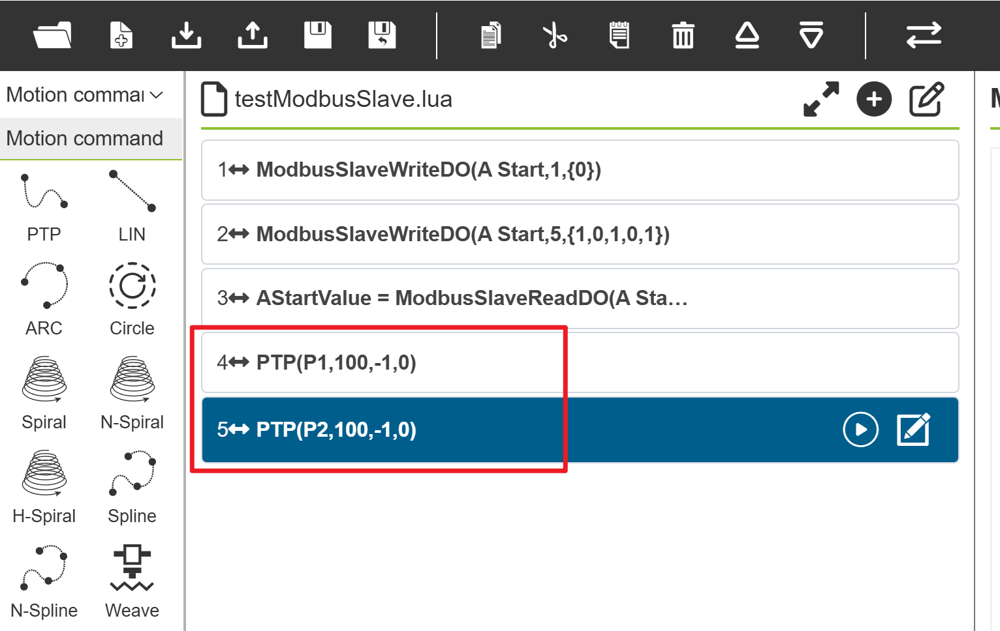

.. centered:: Figure 4.7-25-71 Add motion commands of different points.

As shown in Figure 72, the program is switched to the editable mode again, and the judgment condition of the digital output value "AStartValue" is written. When the value of "AStartValue" is 1, the robot moves to the point "P1", otherwise the robot moves to the point "P2".
         

.. centered:: Figure 4.7-25-72 Move to different points according to different digital output values

Finally, switch the robot program to non-editable mode, switch the robot to automatic mode, and start the running program on the premise of confirming safety. As shown in figure 73, the second line of the program sets the DO value of the digital output named "A Start" to 1, so the robot will move to the "P1" point after executing the program.
         

.. centered:: Figure 4.7-25-73 Read the register value of a single coil and move it

4. Read multiple digital outputs DO (discrete input)

As shown in Figure 74, open the ModbusTCP master station command addition page, find the "Digital Output Settings", select the DO name as "A Start", the number of registers is 2, and the register value does not need to be filled in, and click "Read Digital Output". Finally, scroll to the bottom of the page and click the "Apply" button (Figure 75).
         

.. centered:: Figure 4.7-25-74 Configures Reading Multiple Digital Outputs
            

.. centered:: Figure 4.7-25-75 Apply Read Multiple Digital Outputs

As shown in Figure 76, at this time, the robot program "testModbusSlave.lua" has added an command for the robot Modbus to read multiple digital outputs from the station.
            
.. image:: teaching_pendant_software/411.png
   :width: 6in
   :align: center

.. centered:: Figure 4.7-25-76 Reading multiple digital output programs

As shown in figure 77, click the "switch mode" button "" to switch the robot lua program to the editable state. Since the number of readings is two, it is necessary to write and add two return values "value1,value2" before the "ModbusSlaveReadDO" command, and the values of the two digital output registers read after executing the program will be stored in the above two variables respectively. Similarly, you can judge "value1" and "value2".
            
.. image:: teaching_pendant_software/412.png
   :width: 6in
   :align: center

.. centered:: Figure 4.7-25-77 Reading Multiple Digital Outputs and Storing Variables

5. Read DIgital input DI (coil)

As shown in Figure 78, open the ModbusTCP slave command addition page, find the "Digital Input Settings", select the DI name as "A in place" and the number of registers as 2, and click "Read Digital Input". Finally, scroll to the bottom of the page and click the "Apply" button (Figure 79).
            

.. centered:: Figure 4.7-25-78 Configuring Read Digital Input
               
.. image:: teaching_pendant_software/414.png
   :width: 3in
   :align: center

.. centered:: Figure 4.7-25-79 Applying Read Digital Input

As shown in Figure 80, at this time, the robot program "testModbusSlave.lua" has added an command for the robot Modbus to read digital input from the station.
               
.. image:: teaching_pendant_software/415.png
   :width: 6in
   :align: center

.. centered:: Figure 4.7-25-80 Reading digital input program commands

As shown in Figure 81, click the "switch mode" button "" to switch the robot lua program to an editable state, and write the return value variable "AState,BState" before the "ModbusSlaveReadDI" command. The two digital input values read after executing the program will be stored in the variables "AState" and "BState" respectively, and you can control the robot to do different operations by judging the variable values.
              
.. image:: teaching_pendant_software/416.png
   :width: 6in
   :align: center

.. centered:: Figure 4.7-25-81 Reading digital input program

6. Read and write operations of analog output AO (input register) and analog input AI (hold register)

The reading and writing operations of analog output (input register) and analog input (holding register) are basically the same as those of digital output (discrete input) and digital input (coil), but the difference is that the data range of the latter is only 0 or 1, while the data range of the former is larger, so the specific operations can refer to the programming of digital output and digital input, and only the reading and writing operations of analog input (Figure 82) and analog output (Figure 83) are shown here.
              

.. centered:: Figure 4.7-25-82 Reading Analog Input
              

.. centered:: Figure 4.7-25-83 Reading and writing analog output

7. Waiting for digital input

As shown in Figure 84, open the ModbusTCP slave command addition page, find "Waiting for digital input settings", select the "A in place" register with DI name as configuration, the waiting status is "True", and the timeout time is 5000 ms. Click "Add" button, and finally click "Apply" button.
              

.. centered:: Figure 4.7-25-84 Add the command of waiting for digital input

As shown in Figure 85, at this time, the robot program "testModbusSlave.lua" has added an command that the robot Modbus slave station waits for digital input. After starting the program, the robot will wait for the value of the "A in place" coil register of the slave station to become true, that is, the value 1. Since the set timeout is 5s, when the "A in place" signal is still 0 after the robot waits for 5s, the robot program will report a timeout error and the program will automatically stop running.
              

.. centered:: Figure 4.7-25-85 Waiting for Digital Input Program

8. Waiting for analog input

As shown in figure 86, open the ModbusTCP slave command addition page, and find the voltage register with the AI name selected for "Waiting for Analog Input Settings". The waiting state is ">", the register value is 255, and the timeout time is 5000 ms.. Click "Add" button, and finally click "Apply" button.

.. centered:: Figure 4.7-25-86 Add an command to wait for analog input

As shown in Figure 87, at this time, the robot program "testModbusSlave.lua" has added an command that the robot Modbus slave station waits for the analog input value. After starting the program, the robot will wait for the slave station's "voltage" register value to be greater than 255. Since the set timeout time is 5s, when the robot waits for 5s and the "voltage" signal is still less than 255, the robot program will report a timeout error and the program will automatically stop running.
              

.. centered:: Figure 4.7-25-87 Waiting for Analog Input Register Program

ModbusTCP slave robot state feedback and control
******************************************************

The ModbusTCP slave input register addresses 310~473 of the cooperative robot are used to feed back the real-time status of the robot (see Annex 1: ModbusTCP slave address mapping table). You only need to read the value of the corresponding register with the master station equipment to obtain the corresponding real-time status data of the robot.

The coil register addresses 300~599 of ModbusTCP slave station of the cooperative robot are used for the master station equipment to control the robot (see Annex 1: ModbusTCP slave address mapping table). Taking coil address 502 as an example, this address function indicates "startup program".

When the robot is in automatic mode, the master station equipment sets the value of address 502 from 0 to 1, the robot automatically starts to run the currently configured program; Take the coil address 300 as an example. It is used to control the output of the robot control box DO0. When the external master station sets the coil address 300 from 0 to 1, the automatic output of the control box DO0 is valid. Similarly, when the external master station sets the coil address 300 from 1 to 0, the output of the control box DO0 is invalid. As shown in Figure 88, click "Function Digital Input (Coil)" on the ModbusTCP slave station setting page to monitor all current function digital inputs.
              

.. centered:: Figure 4.7-25-88 Digital Input of Robot Slave Station Function

Annex 1: Modbus slave address mapping table

.. list-table::
   :widths: 10 20 25 15 15 10 10
   :header-rows: 0
   :align: center

   * - **address**
     - **type**
     - **name**
     - **data type**
     - **function code**
     - **Read/write**
     - **remarks**

   * - 100
     - 
     - DI0
     -  
     -  
     -   
     -   

   * - 101
     - 
     - DI1
     -  
     -  
     -   
     -  

   * - 102
     - Universal digital input(coil)
     - DI2
     - BOOL 
     - 0x02 
     -   
     - 读写 
  
   * - 103
     - 
     - DI3
     -  
     -   
     -  
     -  
  
   * - ...
     - 
     - ...
     -  
     -   
     -  
     -  
  
   * - 227
     - 
     - DI127
     -  
     -   
     -  
     -  
  
   * - 
     - 
     -   
     - 
     -  
     -  
     -  

   * - 100
     - 
     - DO0
     -   
     -  
     -  
     -  

   * - 101
     - 
     - DO1
     -   
     -  
     -  
     -  

   * - 102
     - Universal digital output (discrete)
     - DO2
     - BOOL 
     - 0x01、0x05、0x15 
     - read only 
     -   
  
   * - 103
     - 
     - DO3
     -  
     -  
     -   
     -  
  
   * - ...
     - 
     - ...
     -  
     -  
     -   
     -  
  
   * - 227
     - 
     - DO127
     -  
     -  
     -   
     -  
  
   * - 
     - 
     - 
     -   
     -  
     -  
     -  

   * - 100
     - 
     - AI0
     -  
     -   
     -  
     -  

   * - 101
     - 
     - AI1
     -   
     -  
     -  
     -  

   * - 102
     - 
     - AI2
     - UINT16
     - 
     -   
     -  
  
   * - ...
     - 
     - ...
     -  
     -   
     -  
     -  
  
   * - 115
     - 
     - AI15
     -  
     -  
     -   
     -  
  
   * - 116
     - 
     - AI16
     -  
     -   
     -  
     -  
  
   * - 117
     - 
     - AI17
     -  
     -   
     -  
     -  
  
   * - 118
     - analog input (hold register)
     - AI18
     - INT16 
     - 0x04 
     - read only
     -   
  
   * - ...
     - 
     - ...
     -   
     -  
     -  
     -
  
   * - 131
     - 
     - AI31
     -   
     -  
     -  
     -
  
   * - 132
     - 
     - AI32
     -   
     -  
     -  
     -
  
   * - 133
     - 
     - AI33
     - FLOAT32 (big end display)
     -   
     -  
     -
  
   * - ...
     - 
     - ...
     -   
     -  
     -  
     -
  
   * - 194
     - 
     - AI63
     -  
     -   
     -  
     -
  
   * - 195
     - 
     - 
     -  
     -   
     -  
     -
  
   * - 
     - 
     - 
     -   
     -  
     -  
     -  

   * - 100
     - 
     - AO0
     -  
     -   
     -  
     -  

   * - 101
     - 
     - AO1
     -  
     -  
     -   
     -  

   * - 102
     - 
     - AO2
     - UINT16
     - 
     -   
     -  
  
   * - ...
     - 
     - ...
     -  
     -  
     -   
     -  
  
   * - 115
     - 
     - AO15
     -  
     -  
     -   
     -  
  
   * - 116
     - 
     - AO16
     -  
     -  
     -   
     -  
  
   * - 117
     - 
     - AO17
     -  
     -   
     -  
     -  
  
   * - 118
     - analog onput(Input register)
     - AO18
     - INT16 
     - 0x03、0x06、0x16
     - read and write
     -   
  
   * - ...
     - 
     - ...
     -  
     -  
     -   
     -
  
   * - 131
     - 
     - AO31
     -  
     -  
     -   
     -
  
   * - 132
     - 
     - AO32
     -  
     -   
     -  
     -
  
   * - 133
     - 
     - AO33
     - FLOAT32 (big end display)
     -  
     -   
     -
  
   * - ...
     - 
     - ...
     -  
     -  
     -   
     -
  
   * - 194
     - 
     - AO63
     -  
     -  
     -   
     -
  
   * - 195
     - 
     - 
     -  
     -   
     -  
     -
       
   * - 
     - 
     - 
     -  
     -  
     -   
     -
       
   * - Robot state feedback
     - 
     - 
     - 
     -  
     -   
     -
       
   * - 310 
     - 
     - Enabled state 0- not enabled, 1- enabled
     -  
     -   
     -  
     -
       
   * - 311 
     - 
     - Robot mode, 1- manual mode, 0- automatic mode
     -  
     -   
     -  
     -
       
   * - 312 
     - 
     - Robot running state 1- Stop, 2- Run, 3- Pause, 4- Drag
     -  
     -   
     -  
     -
       
   * - 313 
     - Robot state (Input register)
     - Tool number
     -  
     -   
     -  
     -
       
   * - 314 
     - 
     - Workpiece number
     -  
     -   
     -  
     -
       
   * - 315 
     - 
     - Emergency stop state 0- No emergency stop, 1- Emergency stop
     -  
     -   
     -  
     -
     
   * - 316 
     - 
     - Ultra-soft limit fault
     -  
     -  
     -   
     -

   * - 317
     - 
     - Main Error code
     -  
     -   
     -  
     -

   * - 318
     - 
     - Sub Error code
     -  
     -   
     -  
     -

   * - 319
     - 
     - Collision detection, 1- collision, 0- no collision
     -  
     -   
     -  
     -

   * - 320
     - 
     - Motion in place signal
     -  
     -   
     -  
     -

   * - 321
     - 
     - Safety stop signal SI0
     -  
     -  
     -   
     -

   * - 322
     - 
     - Safety stop signal SI1
     -  
     -  
     -  
     -

   * - 330
     - 
     - TCP speed
     -  
     -  
     -   
     -

   * - 340
     - 
     - Joint 1 position
     -  
     -  
     -   
     -

   * - 342
     - 
     - Joint 2 position
     -  
     -  
     -   
     -

   * - 344
     - 
     - Joint 3 position
     -  
     -   
     -  
     -

   * - 346
     - 
     - Position of joint 4
     -   
     -  
     -  
     -

   * - 348
     - 
     - Position of joint 5
     -  
     -  
     -   
     -

   * - 350
     - 
     - Position of joint 6
     -   
     -  
     -  
     -

   * - 352
     - 
     - Joint 1 speed
     -   
     -  
     -  
     -

   * - 354
     - 
     - Joint 2 velocity
     -  
     -   
     -  
     -

   * - 356
     - 
     - Joint 3 velocity
     -  
     -  
     -   
     -

   * - 358
     - 
     - Joint 4 speed
     -  
     -  
     -   
     -

   * - 360
     - 
     - Joint 5 speed
     -  
     -   
     -  
     -

   * - 362
     - 
     - Joint 6 speed
     -  
     -   
     -  
     -

   * - 364
     - 
     - Joint 1 current
     - FLOAT32 (big end display)
     -   
     -  
     -

   * - 366
     - 
     - Joint 2 current
     -  
     -   
     -  
     -

   * - 368
     - 
     - Joint 3 current
     -  
     -   
     -  
     -

   * - 370
     - 
     - Joint 4 current
     -  
     -   
     -  
     -

   * - 372
     - 
     - Joint 5 current
     -  
     -  
     -   
     -

   * - 374
     - 
     - Joint 6 current
     -  
     -   
     -  
     -

   * - 376
     - 
     - Joint 1 torque
     -  
     -   
     -  
     -

   * - 378
     - 
     - Joint 2 torque
     -  
     -   
     -  
     -

   * - 380
     - 
     - Joint 3 torque
     -  
     -  
     -   
     -

   * - 382
     - 
     - Joint 4 torque
     -  
     -   
     -  
     -

   * - 384
     - 
     - Joint 5 torque
     -  
     -  
     -   
     -

   * - 386
     - 
     - Joint 6 torque
     -  
     -   
     -  
     -

   * - 388
     - 
     - TCP location X
     -  
     -  
     -   
     -

   * - 390
     - 
     - TCP location Y
     -  
     -  
     -   
     -

   * - 392
     - 
     - TCP location Z
     -  
     -   
     -  
     -

   * - 394
     - 
     - TCP location RX
     -  
     -   
     -  
     -

   * - 396
     - 
     - TCP location RY
     -  
     -   
     -  
     -

   * - 398
     - 
     - TCP location RZ
     -   
     -  
     -  
     -

   * - 400
     - 
     - TCP speed X
     -  
     -  
     -   
     -

   * - 402
     - 
     - TCP speed Y
     -  
     -   
     -  
     -

   * - 404
     - 
     - TCP speed Z
     -  
     -   
     -  
     -

   * - 406
     - 
     - TCP speed RX
     -  
     -   
     -  
     -

   * - 408
     - 
     - TCP speed RY
     -  
     -   
     -  
     -

   * - 410
     - 
     - TCP speed RZ
     -  
     -   
     -  
     -

   * - 430
     - 
     - Control box analog input AI0
     -  
     -  
     -   
     -

   * - 432
     - 
     - Control box analog input AI1
     -  
     -  
     -   
     -

   * - 438
     - 
     - Tool analog input AI0
     -  
     -  
     -   
     -

   * - 450
     - 
     - Control box analog output AO0
     -  
     -  
     -   
     -

   * - 452
     - 
     - Control box analog output AO1
     -  
     -   
     -  
     -

   * - 458
     - 
     - Tool analog output AO0
     -  
     -   
     -  
     -

   * - 470
     - 
     - Digital inputs Bit0-Bit7 of the control box correspond to DI0-DI7.Bit8-Bit15 corresponds to CI0-CI7
     - UINT16 
     -   
     -  
     -

   * - 471
     - 
     - Tool end digital input Bit0-Bit15 correspond to DI0-DI15
     -  
     -   
     -  
     -

   * - 472
     - 
     - Digital outputs Bit0-Bit7 of the control box correspond to DO0-DO7.Bit8-Bit15 correspond to CO0-CO7
     -  
     -   
     -  
     -

   * - 473
     - 
     - Tool end digital output Bit0-Bit15 corresponds to DO0-DO15
     -  
     -  
     -   
     -

The robot control form is as follows:

.. list-table::
   :widths: 10 20 25 15 15 10 10
   :header-rows: 0
   :align: center
   
   * - **address**
     - **type**
     - **name**
     - **data type**
     - **function code**
     - **Read/write**
     - **remarks**

   * - 300
     - Digital input (coil)
     - Control box DO0
     - BOOL 
     - 0x02 
     - read and write 
     - 

   * - 301
     - 
     - Control box DO1
     -  
     -  
     - 
     - 

   * - 302
     - 
     - Control box DO2
     -  
     -  
     - 
     - 

   * - 303
     - 
     - Control box DO3
     -  
     -  
     - 
     - 

   * - 304
     - 
     - Control box DO4
     -  
     - 
     -  
     - 

   * - 305
     - 
     - Control box DO5
     -  
     -  
     - 
     - 

   * - 306
     - 
     - Control box DO6
     -  
     - 
     -  
     - 

   * - 307
     - 
     - Control box DO7
     -  
     -  
     - 
     - 

   * - 308
     - 
     - Control box CO0
     -  
     - 
     -  
     - 

   * - 309
     - 
     - Control box CO1
     - 
     -  
     -  
     - 

   * - 310
     - 
     - Control box CO2
     -  
     - 
     -  
     - 

   * - 311
     - 
     - Control box CO3
     -  
     - 
     -  
     - 

   * - 312
     - 
     - Control box CO4
     - 
     -  
     -  
     - 

   * - 313
     - 
     - Control box CO5
     -  
     - 
     -  
     - 

   * - 314
     - 
     - Control box CO6
     -  
     - 
     -  
     - 

   * - 315
     - 
     - Control box CO7
     -  
     - 
     -  
     - 

   * - 316
     - 
     - Tool DO0
     -  
     - 
     -  
     - 

   * - 317
     - 
     - Tool DO1
     -  
     -  
     - 
     - 

   * - 318 - 499
     - 
     - reserve
     - 
     -  
     -  
     - 

   * - 500
     - 
     - pause
     - 
     -  
     -  
     - 

   * - 501
     - 
     - resume
     -  
     - 
     -  
     - 

   * - 502
     - 
     - start
     - 
     -  
     -  
     - 

   * - 503
     - 
     - stop
     -  
     - 
     -  
     - 

   * - 504
     - 
     - Move to job origin
     -  
     - 
     -  
     - 

   * - 505
     - 
     - Manual automatic switching
     - 
     -  
     -  
     - 

   * - 506
     - 
     - Start the main program
     -  
     - 
     -  
     - 

   * - 507
     - 
     - level 1 reduction mode
     -  
     - 
     -  
     - 

   * - 508
     - 
     - level 2 reduction mode
     - 
     -  
     -  
     - 

   * - 509
     - 
     - level 3 reduction mode (stop)
     - 
     -  
     -  
     - 

   * - 510
     - 
     - Clear all faults
     - 
     -  
     -  
     - 

   * - 511 - 599
     - 
     - reserve
     -  
     - 
     -  
     - 

Teaching management
~~~~~~~~~~~~~~~~~~~~~

Click "Teaching Management" to display all saved teaching point information. In this interface, you can import and export teaching point files. After selecting a teaching point, click the "Delete" button to delete the point information. The values of teaching points x, y, z, rx, ry, rz and v can be modified. Enter the modified value, check the blue box on the left, and click the upper modification to modify the teaching point information. In addition, users can search for teaching points by name.

.. important:: 
   The modified values of the teaching points x, y, z, rx, ry, rz should not exceed the working range of the robot.

Teaching management is divided into two modes: "system mode" and "point table mode". When calling the robot program, different detection schemes can be implemented by calling different point tables to complete the formula requirements. Each time a device or product is added in the future, the point table data package can be downloaded to the robot through the host computer, and the new point table data package created by the robot can also be uploaded to the host computer.

**System mode**:Supports "modifiy, delete, import, and export" of teaching point content.

.. image:: teaching_pendant_software/140.png
   :width: 6in
   :align: center

.. centered:: Figure 4.7-40-1 Teaching management interface-system mode

**Point table mode**:Supports "adding, applying, renaming, deleting, importing, and exporting" the point table, and "modifying and deleting" the point content in the point table.

.. image:: teaching_pendant_software/228.png
   :width: 6in
   :align: center

.. centered:: Figure 4.7-40-2 Teaching management interface-point table mode

**Details**: Click the "Details" button to view the details of the teaching point.

.. image:: teaching_pendant_software/230.png
   :width: 6in
   :align: center

.. centered:: Figure 4.7-41 Teach point details

**Run**: Click the "Start Run" button to perform a single-point operation of the local teaching point, and move the robot to the position of this point.

.. image:: teaching_pendant_software/231.png
   :width: 6in
   :align: center

.. centered:: Figure 4.7-42 Run teach point

Status information
----------------------

System log
~~~~~~~~~~~~~~

Click the "System Log" button in the "Status Information" on the left menu bar to enter the log display interface. The log records some important operation records of the teach pendant, such as the log-in person, the increase and decrease of the teaching point, etc. After clicking to enter, the log records of the current day are displayed by default. If you want to query the previous records, select the target in the "Date Selection" Date, the log record of the current day will be displayed in real time below, and the number of log records can be set in the system settings for details. When there is too much user log information, the user can
Find relevant log information according to the type.

.. image:: teaching_pendant_software/141.png
   :width: 6in
   :align: center

.. centered:: Figure 4.8-1 System log interface

Status query
~~~~~~~~~~~~~

Click the "Status Query" menu in the left menu bar "Status Information" to enter the status query interface, as shown in Figure 4.8-2 Status Query.

.. image:: teaching_pendant_software/142.png
   :width: 6in
   :align: center

.. centered:: Figure 4.8-2 Status query

Status query operation steps:

**Step1**:Click the "Figure" button to pop up the Figure setting pop-up box, as shown in Figure3.8-3Figure setting, select Figure display query for the query type, select the parameters to be queried and the Figure in which the parameters are placed in the Figure setting, and click the "Move Right" button The parameters can be configured in the Figure. Click "Settings" to issue the setting Figure command. At present, only one table can contain up to four parameters to be checked and one Figure can be set at most;

.. image:: teaching_pendant_software/143.png
   :width: 3in
   :align: center

.. centered:: Figure 4.8-3 Figure settings

**Step2**:The trigger function does not need to be set temporarily, and the data can be queried by clicking the "Query" button.
