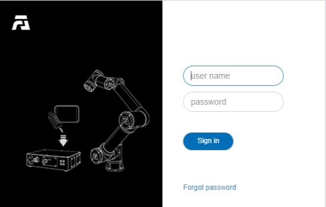
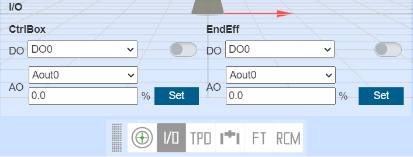
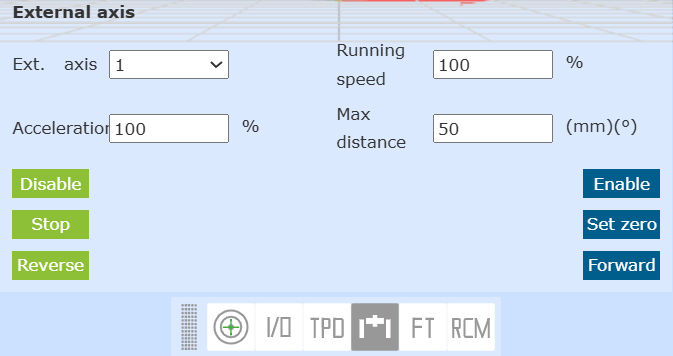
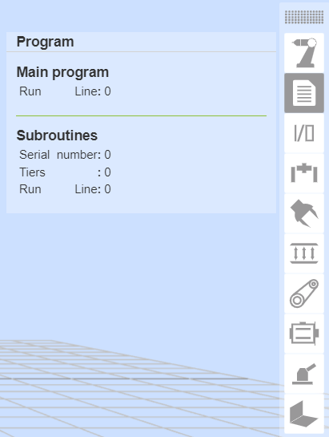
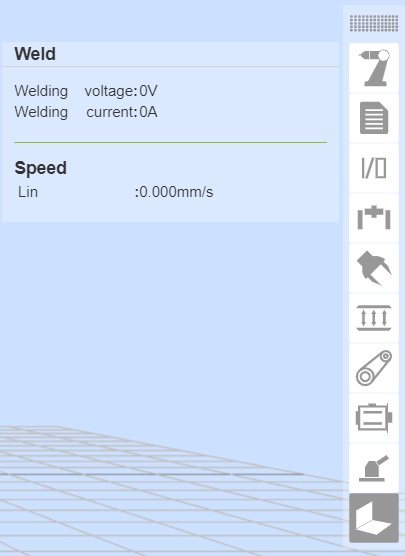
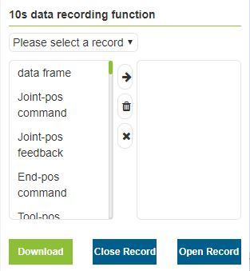
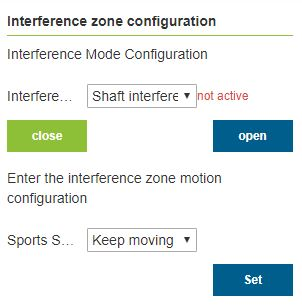
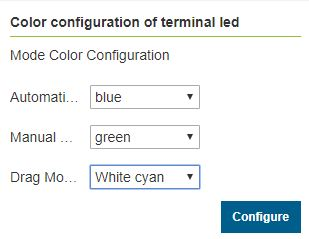

Teaching pendant software
=====================================

.. toctree:: 
   :maxdepth: 6

Basic information
-------------------

Introduction
~~~~~~~~~~~~~~

The teaching pendant software is the supporting software developed for the robot and runs on the teaching pendant operating system. Its main functions and technical characteristics are as follows:

-  Ability to write teaching programs for robots;
-  It can display the coordinates of the robot's position in real time, simulate the physical robot in three dimensions, and control the movement of the robot;
-  It can realize single-axis inching and linkage operation of each axis of the robot;
-  Able to view control IO status;
-  Users can modify passwords, view system information, etc.

Robot's first activation 
~~~~~~~~~~~~~~~~~~~~~~~~~~~~~~~~~~~~~~~~

1. Power on the control box and connect the Ethernet cable to the PC.

2. Open a web browser on the PC and visit the target website 192.168.58.2; the robot will enter the activation page upon first power-up.

.. figure:: teaching_pendant_software/334.png
   :width: 4in
   :align: center

.. centered:: Figure 5.1-1 Activation Interface

3. Enter the correct SN code of the device box and click the "Activate" button after input is complete.
   
4. The system will verify your SN code. If the input is correct, the activation process will be completed automatically.

.. figure:: teaching_pendant_software/335.png
   :width: 4in
   :align: center

.. centered:: Figure 5.1-2 Activation Success Interface

5. After successful activation, please manually restart the control box.
   
6. After restarting, visit the target website 192.168.58.2 again to enter the login page.

.. centered:: Figure 5.1-3 Login Page

Start software
~~~~~~~~~~~~~~~~

1. Power on the control box;
2. The teach pendant opens a browser to access the target website 192.168.58.2;
3. Enter the user name and password and click Login to log in to the system.

User login and permission update
~~~~~~~~~~~~~~~~~~~~~~~~~~~~~~~~~~~~~

.. centered:: Table 5.1-1 Initial user

.. list-table::
   :widths: 70 70 70 70
   :header-rows: 0
   :align: center

   * - **Job number**
     - **Initial username**
     - **Password**
     - **Function code**

   * - 111
     - admin
     - 123
     - 1

   * - 222
     - MEenginer
     - 222
     - 2

   * - 333
     - PEenginer
     - 333
     - 3
   
   * - 444
     - programmer
     - 444
     - 4
   
   * - 555
     - operator
     - 555
     - 5

   * - 666
     - monitor
     - 666
     - 6

Users (refer to \ `5.10.2.1 User Management <#user-management>`__\  for user management) are divided into six levels by default, administrators have no function restrictions, operators and monitors can use a small number of functions, ME engineers, PE&PQE engineers and technicians & team leaders have some function restrictions, management There are no functional restrictions for administrators. For specific default function code permissions, refer to \ `5.10.2.2 Authority management <#authority-management>`__\. 

The login interface is shown in figure below.

.. centered:: Figure 5.1-4 Login Interface

After the login is successful, the system will load the model and other data, and enter the initial page after loading.

System initial interface
----------------------------

After the login is successful, the system enters the "Initial". Mainly include:

- 1. FAIRINO LOGO;
- 2. Menu bar zoom button;
- 3. Menu bar;
- 4. Robot control area;
- 5. Robot status area;
- 6. 3D simulation robot - 3D scene operation;
- 7. 3D simulation robot - robot body operation;
- 8. Robot supporting functions;
- 9. Robot and supporting function status.

The initial interface of the system is shown in the figure below:

.. image:: teaching_pendant_software/002.png
   :align: center
   :width: 6in
.. centered:: Figure 5.2-1 Schematic diagram of the initial interface of the system

Control area
~~~~~~~~~~~~~~~

.. note:: 
   .. image:: teaching_pendant_software/003.png
      :width: 0.75in
      :height: 0.75in
      :align: left

   name:**Enable button**
   
   effect:Enable the robot

.. note:: 
   .. image:: teaching_pendant_software/004.png
      :width: 0.75in
      :height: 0.75in
      :align: left

   name:**Start button**
   
   effect:Upload and start running the teaching program

.. note:: 
   .. image:: teaching_pendant_software/005.png
      :width: 0.75in
      :height: 0.75in
      :align: left

   name:**Stop button**
   
   effect:Stop the current teaching program running

.. note:: 
   .. image:: teaching_pendant_software/006.png
      :width: 0.75in
      :height: 0.75in
      :align: left

   name:**Pause/Resume button**
   
   effect:Pause and resume the current teaching program

.. important::
   The pause instruction is at the end of the program and cannot be judged.

Status Bar
~~~~~~~~~~~~

.. note:: 
   .. image:: teaching_pendant_software/007.png
      :width: 0.75in
      :height: 0.75in
      :align: left

   name:**robot status**
   
   effect:Stopped-stop,Running-run,Pause-pause,Drag-drag

.. note:: 
   .. image:: teaching_pendant_software/008.png
      :width: 0.75in
      :height: 0.75in
      :align: left

   name:**Tool coordinate system number**
   
   effect:Display the tool coordinate system number of the current application

.. note:: 
   .. image:: teaching_pendant_software/027.png
      :width: 0.75in
      :height: 0.75in
      :align: left

   name: **Workpiece coordinate system number**
   
   effect: Display the workpiece coordinate system number currently applied

.. note:: 
   .. image:: teaching_pendant_software/028.png
      :width: 0.75in
      :height: 0.75in
      :align: left

   name: **Extended axis coordinate system number**
   
   effect: Displays the currently applied extended axis coordinate system number
   
.. note:: 
   .. image:: teaching_pendant_software/009.png
      :width: 0.75in
      :height: 0.75in
      :align: left

   name:**Running speed percentage**
   
   effect:The speed of the robot when it is running in the current mode

.. note:: 
   .. image:: teaching_pendant_software/010.png
      :width: 0.75in
      :height: 0.75in
      :align: left

   name:**Runn normally**
   
   effect:The current robot is running normally

.. note:: 
   .. image:: teaching_pendant_software/011.png
      :width: 0.75in
      :height: 0.75in
      :align: left

   name:**Error state**
   
   effect:There is an error in the current robot operation

.. note:: 
   .. image:: teaching_pendant_software/012.png
      :width: 0.75in
      :height: 0.75in
      :align: left

   name:**automatic mode**
   
   effect:Robot automatic operation mode.When the global speed adjustment in manual mode and automatic mode is turned on and the speed is specified, the global speed will be automatically adjusted to the specified speed

.. note:: 
   .. image:: teaching_pendant_software/013.png
      :width: 0.75in
      :height: 0.75in
      :align: left

   name:**Teach mode**
   
   effect:Robot teaching operation mode, set the global speed adjustment of manual mode and automatic mode and specify the speed.

.. note:: 
   .. image:: teaching_pendant_software/014.png
      :width: 0.75in
      :height: 0.75in
      :align: left

   name:**Drag state**
   
   effect:The current robot can drag

.. note:: 
   .. image:: teaching_pendant_software/015.png
      :width: 0.75in
      :height: 0.75in
      :align: left

   name:**Drag state**
   
   effect:The current robot is not draggable

.. note:: 
   .. image:: teaching_pendant_software/017.png
      :width: 0.75in
      :height: 0.75in
      :align: left

   name:**Connection status**
   
   effect:Robot connected

.. note:: 
   .. image:: teaching_pendant_software/016.png
      :width: 0.75in
      :height: 0.75in
      :align: left

   name:**Not connected status**
   
   effect:Robot not connected

.. note:: 
   .. image:: teaching_pendant_software/018.png
      :width: 0.75in
      :height: 0.75in
      :align: left

   name:**Account information**
   
   effect:Display username and permissions and logout user

Menu Bar
~~~~~~~~~~~~

The menu bar is as shown in table below.

.. centered:: Table 5.2-1 Teach pendant menu column

+-------------+----------------+
| first level |  second level  |
+=============+================+
| Initial     | Base           |
+-------------+----------------+
|             | Safety         |
+-------------+----------------+
|             | Peripheral     |
+-------------+----------------+
| Program     | Coding         |
+-------------+----------------+
|             | Graphical      |
+-------------+----------------+
|             | Node Graph     |
+-------------+----------------+
|             | Points         |
+-------------+----------------+
| Status      | Log            |
+-------------+----------------+
|             | Query          |
+-------------+----------------+
| Application | Tool App       |
+-------------+----------------+
|             | Welding expert |
+-------------+----------------+
| System      | /              |
+-------------+----------------+

3D simulation robot
---------------------

3D scene operation bar
~~~~~~~~~~~~~~~~~~~~~~~~~~~~~~~~~~~~~~~~~~~~~

3D visualization display of robot coordinate system
++++++++++++++++++++++++++++++++++++++++++++++++++++++

Create various 3D virtual coordinate systems in the 3D virtual area of the WebAPP robot, taking the display of the base coordinate system as an example, as shown in the figure below. Among them, the X axis is red, the Y axis is green, and the Z axis is blue.

.. note:: 
   .. image:: teaching_pendant_software/021.png
      :width: 0.75in
      :height: 0.75in
      :align: left

   name:**Base coordinate system**
   
   explain: In the base coordinate system WebAPP, the system robot is displayed in the three-dimensional virtual area by default, and the fixed mark is at the bottom center of the robot base. The 3D virtual base coordinate system can be displayed manually.

.. note:: 
   .. image:: teaching_pendant_software/022.png
      :width: 0.75in
      :height: 0.75in
      :align: left

   name:**Tool coordinate system**
   
   explain: The display of the tool coordinate system is enabled by default and can be manually disabled. After the WebAPP starts and the user logs in successfully, obtain the tool coordinate system name and corresponding parameter data of the current application, and initialize the current tool coordinate system.

.. important:: 
   When applying other tool coordinate systems during use, after the application tool coordinate system command succeeds, first clear the existing tool coordinate system in the robot's 3D virtual area, and then transfer the newly applied tool coordinate system parameter data into the 3D coordinate system The API is generated to generate the tool coordinate system, and after the generation is completed, it is displayed in the three-dimensional virtual area of the robot.

.. note:: 
   .. image:: teaching_pendant_software/023.png
      :width: 0.75in
      :height: 0.75in
      :align: left

   name:**Workpiece coordinate system**
   
   explain: The workpiece coordinate system is closed by default, and it can be displayed manually. The process is consistent with the tool coordinate system.

.. note:: 
   .. image:: teaching_pendant_software/024.png
      :width: 0.75in
      :height: 0.75in
      :align: left

   name:**External Axis Coordinate System**
   
   explain: The workpiece coordinate system is closed by default, and it can be displayed manually. The process is consistent with the tool coordinate system.

3D virtual trajectory and import tool model
++++++++++++++++++++++++++++++++++++++++++++++++

.. note:: 
   .. image:: teaching_pendant_software/020.png
      :width: 0.75in
      :height: 0.75in
      :align: left

   name:**Trajectory drawing**
   
   explain: Click the button to turn on the trajectory drawing function. When running the teaching program, the robot 3D model will depict the trajectory of the robot's movement.

.. note:: 
   .. image:: teaching_pendant_software/029.png
      :width: 0.75in
      :height: 0.75in
      :align: left

   name:**Import tool model**
   
   explain: Click the button to pop up the import tool model modal window. After the uploaded file is successfully imported, the tool model can be displayed at the end of the robot. Currently supported tool model file formats are STL and DAE.

Robot body operation bar
~~~~~~~~~~~~~~~~~~~~~~~~~~~

TCP
++++++++++++++++

**Base Jog**: In the base coordinate system, you can click the corresponding coordinate system button to control the robot, move in a straight line on the X, Y, and Z axes or rotate around RX, RY, and RZ. The function of Base jogging is similar to that of single-axis jogging in Joint motion. As shown in figure below.

.. image:: teaching_pendant_software/030.png
   :width: 3in
   :align: center

.. centered:: Figure 5.3-1 Base jog diagram
   
.. important:: 
   The button can be released at any time to stop the robot. If necessary, press the emergency stop button to stop the robot.

**Tool Jog**: Select the tool coordinate system, you can click the corresponding coordinate system button to control the robot, move in a straight line on the X, Y, and Z axes or rotate around RX, RY, and RZ. The function of Tool jogging is similar to that of single-axis jogging in Joint motion. As shown in figure below. 

.. centered:: Figure 5.3-2 Tool Jogging Schematic Diagram

**Wobj Jog**: Select workpiece jogging, you can operate the circular buttons on the left and right to control the robot. In the workpiece coordinate system, move along the X, Y, Z axis in a straight line or rotate around RX, RY, RZ. The function of Wobj jogging is similar to that of single-axis jogging in Joint motion. As shown in figure below. 

.. image:: teaching_pendant_software/032.png
   :width: 3in
   :align: center

.. centered:: Figure 5.3-3 Wobj jogging diagram

Joint Jog
++++++++++++++++

Under Joint operation, the 6 slider bars in the middle represent the angles of the corresponding axes respectively, and the joint movement is divided into single-axis inching and multi-axis linkage

**single axis jog**:The user can control the movement of the robot by operating the left and right circular buttons, as shown in figure below. In the manual mode and the joint coordinate system, perform a rotation operation on a joint of the robot. When the robot stops beyond the range of motion (soft limit), you can use single-axis jogging for manual operation to move the robot out of the overrun position. Single-axis jogging is faster and more convenient than other operation modes for rough positioning and large-scale movement.

.. image:: teaching_pendant_software/033.png
   :width: 3in
   :align: center

.. centered:: Figure 5.3-4 Schematic diagram of single-axis jogging

.. important:: 
   Set the "long press movement threshold" (the maximum distance the robot can run when the button is long pressed, and the input value range is 0~300) parameters, long press the round button to control the robot running, if the button is released during the robot running, the robot will stop immediately Movement, if you keep pressing the button without releasing it, the robot will run and stop moving after long pressing the value set by the movement threshold.

**Multi-axis linkage**:The user can operate the six sliders in the middle to adjust the corresponding target position of the robot, as shown in figure below. The target position can be determined by observing the 3D virtual robot. If the adjusted position does not meet your expectations, click the "Restore" button. Make the 3D virtual robot return to the initial position. After the user determines the target position, he can click the "Apply" button, and the physical robot will perform corresponding movements.

.. image:: teaching_pendant_software/034.png
   :width: 3in
   :align: center

.. centered:: Figure 5.3-5 Schematic diagram of multi-axis linkage

.. important:: 
   In multi-axis linkage, the setting value of the fifth joint j5 cannot be less than 0.01 degrees. If the expected value is less than 0.01 degrees, you can first set it to 0.011 degrees, and then fine-tune the fifth joint j5 through single-axis jogging.

Move
++++++++++++++++

Select Move, you can directly input the Cartesian coordinate value, click "Calculate joint position", the joint position is displayed as the calculated result, confirm that there is no danger, you can click "Move to this point" to control the robot to move to the input Cartesian pose.

.. image:: teaching_pendant_software/035.png
   :width: 3in
   :align: center

.. centered:: Figure 5.3-6 Move mobile diagram

.. important:: 
   When a given pose cannot be reached, first check whether the Cartesian space pose exceeds the working range of the robot, and then check whether there is a singular pose in the process from the current pose to the target pose, if there is a singular position, adjust the current pose or process insert a new pose in order to avoid singular poses.

Robot supporting function bar
~~~~~~~~~~~~~~~~~~~~~~~~~~~~~~~~~~~~~~~~~~~~

Teaching point record
+++++++++++++++++++++++++++

The manual teaching control area is mainly to set the test coordinate system in the teaching mode, and display the angle and coordinate values of each axis of the robot in real time, and can name and save the teaching points.

When saving a teaching point, the coordinate system of the teaching point is the coordinate system of the current robot application. 

For the sensor teaching point, select the calibrated sensor type tool, enter the point name, click Add, and the saved point position is the position recognized by the sensor.

.. image:: teaching_pendant_software/036.png
   :width: 6in
   :align: center

.. centered:: Figure 5.3‑7 Schematic diagram of manual operation area

.. important:: 
   When using it for the first time, please set a small speed value like 30 to familiarize yourself with the movement of the robot to avoid accidents

I/O
++++++++++++++++

In this interface, the digital output, analog output (0-10v) and end tool digital output in the robot control box can be realized. Output, analog output (0-10v) for manual control. As shown in figure below.

- DO operation: select the port number, if the DO is low level, the right operation button will display ON, click the button to set the DO to high level.

- AO operation: Select the port number, enter a value (0-100) in the input box on the right, the value is a percentage, setting 100 means setting the AO port to 10v.

.. centered:: Figure 5.3‑8 I/O

TPD (Teach-in programming)
++++++++++++++++++++++++++++++++

The operation steps of teach programming (TPD) function are as follows:

- **Step1 record initial position**:Enter the operation area on the left side of the 3D model and record the current position of the robot. Set the name of the point in the edit box, click the "Save" button, if the save is successful, it will prompt "Save point successful";

- **Step2 Configure track recording parameters**:Click TPD to enter the "TPD" function item to configure trajectory recording parameters, set the name of the trajectory file, pose type and sampling period, configure DI and DO, and record the corresponding output by triggering DI during the process of recording the TPD trajectory DO, as Figure3.6-8;

.. image:: teaching_pendant_software/038.png
   :width: 6in
   :align: center

.. centered:: Figure 5.3‑9 TPD track record

- **Step3 Check robot mode**:Check whether the robot mode is in manual mode. If not, switch to manual mode. In manual mode, there are two ways to switch to drag teaching mode, one is long press the end button, and the other is interface dragging mode It is recommended to switch the robot from the interface to the drag teaching mode in the TPD record. As shown in Figure 4.6-9;

.. image:: teaching_pendant_software/039.png
   :width: 3in
   :align: center

.. centered:: Figure 5.3‑10 robot mode

.. important:: 
   When switching to the drag mode from the interface, first confirm whether the end tool load and the center of mass are set correctly, and whether the friction compensation coefficient is set reasonably, then press and hold the end button to confirm whether the drag is normal, and then switch to the drag mode from the interface after confirming that it is correct.

- **Step4 start recording**:Click the "Start Recording" button to start track recording, and drag the robot to teach actions. In addition, there is a "TPD recording start/stop" function configuration item in the terminal DI configuration. By configuring this function, the user can trigger the "start recording" trace function through an external signal. It should be noted that to start recording a trace through an external signal, first Configure the TPD track information on the page first.

- **Step5 stop recording**:After the action teaching is completed, click the "Stop Recording" button to stop the track recording, and then drag the teaching switch button to make the robot exit the drag teaching mode. When the teach pendant receives "stop track recording successful", it means the track recording is successful. Same as step 4, after configuring the "TPD recording start/stop" function, you can trigger the recording to stop by an external signal.

- **Step6 teach programming**:Click New, select a blank template, click to enter the PTP function programming item, select the initial position point just saved, click the "Add" button, after the application is completed, a PTP instruction will be displayed in the program file; then click to enter the TPD function programming item, Select the track just recorded, set whether it is smooth and the speed scaling, click the "Add" button, after the application is completed, a MoveTPD instruction will be displayed in the program file, as shown in Figure 3.6-10;

.. image:: teaching_pendant_software/040.png
   :width: 3in
   :align: center

.. centered:: Figure 5.3‑11 TPD programming

- **Step7 Trajectory recurrence**:After editing the teaching program, switch to the automatic operation mode, click the "start running" icon on the top of the interface to start running the program, and the robot will start to reproduce the teaching action.

- **Step8 track edit**:The TPD track editing area can visually display and edit the track to achieve pre-analysis and streamlining of the TPD track. Select the corresponding track acquisition point, then the track points recorded by the user will be displayed in the three-dimensional space of the robot, and then the user can drag the "Start" and "End" scroll bars to simulate and reproduce and edit the start and end points of the track.

TPD file deletion and exception handling:

- **Trajectory file deletion**:Click to enter the TPD function item, select the track file to be deleted, and click the "Delete Track" button. If the deletion is successful, you will receive a successful deletion prompt.

- **Exception handling:**

  +  **Command points exceeded**:A track can record up to 20,000 points. When the number exceeds 20,000 points, the controller will no longer record the exceeded points, and will send a warning to the teach pendant that the number of command points exceeds the limit. At this time, you need to click to stop recording;

  +  **TPD instruction interval is too large**:If the teaching pendant reports an error that the TPD command interval is too large, check whether the robot has returned to the initial position before recording. If the robot returns to the initial position and still reports an error that the TPD command interval is too large, delete the current track and record a new one;

  +  If other abnormal conditions occur during TPD operation, the robot operation should be stopped immediately through the teach pendant or the emergency stop button to check the cause.

.. important:: 
   During the operation of the TPD function, you should strictly follow the corresponding prompts on the teach pendant.

Eaxis move
++++++++++++++++

Select Eaxis to move, this function is the jog function of the extension axis, it needs to be configured to configure the extension axis, use this jog function to control the extension axis, see "Chapter 4 Machine-Robot Peripherals-Extended Axis Peripherals" for details configuration".

.. centered:: Figure 5.3-12 Eaxis Mobile Diagram

FT
++++++++++++++++

Select the reference frame as a reference for the force sensor when dragging.

.. image:: teaching_pendant_software/042.png
   :width: 6in
   :align: center

.. centered:: Figure 5.3‑12 FT diagram

Telecentric fixed point
++++++++++++++++++++++++++++++++

This function is mainly used in medical penetration. After setting the telecentric fixed point, the robot end always moves at this point.

.. centered:: Figure 5.3‑13 Schematic diagram of telecentric fixed point

Robot and supporting function status bar
~~~~~~~~~~~~~~~~~~~~~~~~~~~~~~~~~~~~~~~~~~~~~~~~~~

Robot
++++++++++++++++

Displays the current robot model, stiffness, joints and coordinate data information.

.. image:: teaching_pendant_software/044.png
   :width: 3in
   :align: center

.. centered:: Figure 5.3‑14 Robot Status

Program
++++++++++++++++

Display information about the currently running program and subprogram.

.. centered:: Figure 5.3‑15 Program Status

I/O
++++++++++++++++

The status display area on the right side of the 3D model will display the current IO status. In digital input and digital output, if the port level is high, the point will be displayed in green, and if it is low, it will be displayed in white; analog input and analog output The display value is 0-100, and 100 means 10v.

.. image:: teaching_pendant_software/046.png
   :width: 3in
   :align: center

.. centered:: Figure 5.3‑16 IO Status

ExAxis
++++++++++++++++

Display the current extended axis (controller + PLC) servo status information.

.. image:: teaching_pendant_software/047.png
   :width: 3in
   :align: center

.. centered:: Figure 5.3‑17 Extended axis (controller + PLC) status

Gripper
++++++++++++++++

Displays the current gripper status information.

.. image:: teaching_pendant_software/048.png
   :width: 3in
   :align: center

.. centered:: Figure 5.3‑18 Gripper status

FT
++++++++++++++++

Display current force control status information.

.. image:: teaching_pendant_software/049.png
   :width: 3in
   :align: center

.. centered:: Figure 5.3‑19 Force control state

Convery
++++++++++++++++

Displays current conveyor status information.

.. image:: teaching_pendant_software/050.png
   :width: 3in
   :align: center

.. centered:: Figure 5.3‑20 Conveyor Belt Status

Servo
++++++++++++++++

Displays the current extended axis (controller + servo controller) status information.

.. image:: teaching_pendant_software/051.png
   :width: 3in
   :align: center

.. centered:: Figure 5.3‑21 Extended axis (controller + servo controller) status

Polish
++++++++++++++++

Display current grinding status information.

.. image:: teaching_pendant_software/052.png
   :width: 3in
   :align: center

.. centered:: Figure 5.3‑22 Polishing status

Weld
++++++++++++++++

Display current welding status information.

.. centered:: Figure 5.3‑23 Welding status

Robot installation method setting and display
~~~~~~~~~~~~~~~~~~~~~~~~~~~~~~~~~~~~~~~~~~~~~~~

The default installation mode of the robot is horizontal installation. When the installation mode of the robot is changed, the actual installation mode of the robot must be set in the "Initial - Base - Mounting" menu in time to ensure the normal operation of the robot.

The user clicks the "Fixed" option under the "Initial - Base - Mounting" menu to enter the robot fixed installation mode setting page, selects "Upright Installation", "Inverted Installation" or "Side Installation", and clicks the "Apply" button to complete the robot installation mode setting.

.. image:: teaching_pendant_software/025.png
   :width: 6in
   :align: center

.. centered:: Figure 5.3-24 Fixed installation

Considering the more flexible and rich robot deployment scenarios, we provide a free installation function. Users click the "Free" tab under the "Initial - Base - Mounting" menu to enter the robot free installation mode setting page. Manually adjust the "Base Tilt" and "Base Rotation" angles, and the 3D model will display the installation effect accordingly. After modification, click the "Apply" button to complete the robot installation mode setting.

.. image:: teaching_pendant_software/026.png
   :width: 6in
   :align: center
   
.. centered:: Figure 5.3-25 360 degree free installation

.. important:: 
   After the installation of the robot is completed, the installation method of the robot must be set correctly, otherwise it will affect the use of the robot's dragging function and collision detection function.

Status information
----------------------

System log
~~~~~~~~~~~~~~

Click the "System Log" button in the "Status Information" on the left menu bar to enter the log display interface. The log records some important operation records of the teach pendant, such as the log-in person, the increase and decrease of the teaching point, etc. After clicking to enter, the log records of the current day are displayed by default. If you want to query the previous records, select the target in the "Date Selection" Date, the log record of the current day will be displayed in real time below, and the number of log records can be set in the system settings for details. When there is too much user log information, the user can
Find relevant log information according to the type.

.. image:: teaching_pendant_software/141.png
   :width: 6in
   :align: center

.. centered:: Figure 4.8-1 System log interface

Status query
~~~~~~~~~~~~~

Click the "Status Query" menu in the left menu bar "Status Information" to enter the status query interface, as shown in Figure 4.8-2 Status Query.

.. image:: teaching_pendant_software/142.png
   :width: 6in
   :align: center

.. centered:: Figure 4.8-2 Status query

Status query operation steps:

**Step1**:Click the "Figure" button to pop up the Figure setting pop-up box, as shown in Figure3.8-3Figure setting, select Figure display query for the query type, select the parameters to be queried and the Figure in which the parameters are placed in the Figure setting, and click the "Move Right" button The parameters can be configured in the Figure. Click "Settings" to issue the setting Figure command. At present, only one table can contain up to four parameters to be checked and one Figure can be set at most;

.. image:: teaching_pendant_software/143.png
   :width: 3in
   :align: center

.. centered:: Figure 4.8-3 Figure settings

**Step2**:The trigger function does not need to be set temporarily, and the data can be queried by clicking the "Query" button.

Auxiliary application
------------------------

.. Robot calibration
.. ~~~~~~~~~~~~~~~~~~~

.. Under the menu bar of "Robot Body" in "Auxiliary Application", click "Robot Calibration" to enter the robot calibration interface. This function is mainly to calibrate the zero point position of the robot. Click the "Disable" button, drag each axis of the robot, move to the zero point position of the robot on the machine, and click the "Zero Set" button to set the robot zero point.

.. .. image:: teaching_pendant_software/144.png
..    :width: 3in
..    :align: center

.. .. centered:: Figure 4.9-1 Schematic diagram of robot calibration

.. **Zero setting**:When the robot leaves the factory, it will preset an initial posture, in which the angle of each joint is 0. When the zero point is set, the robot pose corresponds to when each joint of the robot moves to a specific position. The zero point is the benchmark of the robot coordinate system. Without the zero point, the robot cannot judge its own position. Therefore, in order to obtain the highest possible absolute positioning accuracy, it is necessary to calibrate the zero point of the robot.

.. Generally, the zero point calibration of the robot is required under the following circumstances:

.. - After replacing parts of the robot's mechanical system;

.. - After a violent collision with the workpiece or the environment;

.. - When operations such as establishing a coordinate system differ greatly from the actual position;

.. - After a complete system reinstallation;

.. - after the encoder battery has been replaced;

.. - After long-distance transportation of the handling robot.

..    The zero point will be set when the robot leaves the factory. If you need to set the zero point again, please contact us for technical support.

Robot packaging
~~~~~~~~~~~~~~~~~~~
Under the menu bar of "Robot Body" in "Auxiliary Applications", click the "Robot Packaging" button to enter the robot's one-click packaging interface.

.. important:: 
   Before operating the packaging function, please confirm the surrounding environment and status of the robot to prevent collisions.
   
   If it is shipped from the factory, go to System Settings - General Settings and restore the factory settings before leaving the factory.

**Step1**:Move the robot to zero point before moving to the packing point

**Step2**:Click the "Move to Zero" button to confirm that the robot's mechanical zero point is correct and that the gaps in the orange circles in the figure are aligned with each joint.

**Step3**:Click the "Move to Packing Point" button, and the robot will move to the packaging point according to the angles of each axis of the packaging process.

.. image:: teaching_pendant_software/220.png
   :width: 3in
   :align: center

.. centered:: Figure 4.9-1 Robot one-click packaging

System Upgrade
~~~~~~~~~~~~~~~~

Under the menu bar of "Robot Body" in "Auxiliary Application", click the "System Upgrade" button to enter the system upgrade interface. System upgrade is divided into software upgrade, driver upgrade and system shutdown.

**Software upgrade**:Click "Upload File" under Software Upgrade, select the ``software.tar.gz`` upgrade package in the U disk, click Upload Upgrade Package, and "Uploading...Upload Percentage" is displayed next to the upgrade button.
After the download of the background file is completed, the interface displays "uploading completed, upgrading in progress", check the MD5 and version number of the file, after passing, decrypt and decompress the upgrade file, and prompt "Upgrade is successful, please restart the control box!", if detected , unzip or other errors occur, and "upgrade failed" is displayed next to the upgrade button.

.. image:: teaching_pendant_software/145.png
   :width: 3in
   :align: center

.. centered:: Figure 4.9-2 System Upgrade

.. important:: 
   The name of the software upgrade package is determined ``software.tar.gz``. If the name of the upgrade package is inconsistent with it, the upgrade will fail. Just change it to the determined name of the upgrade package.

**Firmware upgrade**:After the robot enters the BOOT mode, upload the upgrade compressed package, select the slaves that need to be upgraded (control box slaves, main body drive slaves 1~6, and end slaves), perform the upgrade operation, and display the upgrade status.

.. image:: teaching_pendant_software/146.png
   :width: 3in
   :align: center

.. centered:: Figure 4.9-3 Firmware upgrade

**Slave configuration file upgrade**:After the robot is disabled, upload the upgrade file, select the slaves that need to be upgraded (control box slaves, main body drive slaves 1~6, and end slaves), perform the upgrade operation, and display the upgrade status.

.. image:: teaching_pendant_software/147.png
   :width: 3in
   :align: center

.. centered:: Figure 4.9-4 Slave configuration file upgrade

Data backup
~~~~~~~~~~~~~

Under the menu bar of "Robot Body" in "Auxiliary Application", click "Data Backup" to enter the data backup interface, as shown in 3.9-5.

The backup package data includes tool coordinate system data, system configuration files, teaching point data, user programs, template programs and user configuration files. When the user needs to move the relevant data of this robot to another robot, he can use this The function is realized quickly.

.. image:: teaching_pendant_software/148.png
   :width: 3in
   :align: center

.. centered:: Figure 4.9-5 Data backup interface

10s data record
~~~~~~~~~~~~~~~~~~

Under the menu bar of "Robot Body" in "Auxiliary Application", click "10s Data Recording" to enter the 10s data recording function interface.

First, select the record type, which is divided into default parameter record and optional parameter record. The default parameter record is the data automatically set and recorded by the system, and the optional parameter record user can choose the parameter data to be recorded. The maximum number of parameters is 15. After selecting the parameter list, select the record parameter and click the "Move Right" button to configure the parameter into the parameter list. Click "Start Recording" to start recording data, click "Stop Recording" to stop recording data, and click "Download Data" to download the data of the last 10 seconds.

.. centered:: Figure 4.9-6 10s data record

Teach point configuration
~~~~~~~~~~~~~~~~~~~~~~~~~~~

Under the menu bar of "Robot Body" in "Auxiliary Application", click "Teaching Point Configuration" to enter the teaching point configuration interface.

Before using the button box or other IO signals to record the teaching point function, the user first configures the teaching point name prefix, the upper limit of the number and the teaching method. The name prefix supports two modes: custom prefix and current program name as the prefix. For example, customize the name prefix "P", number upper limit "3", teaching method "robot teaching", record the current end (tool) points of the robot in sequence: P1, P2, P3, and record again will overwrite the previous record points.

.. image:: teaching_pendant_software/150.png
   :width: 3in
   :align: center

.. centered:: Figure 4.9-7 Teach point configuration

Matrix move
~~~~~~~~~~~~~

Under the menu bar of "Robot Body" in "Auxiliary Application", click "Matrix Movement" to enter the matrix movement configuration function interface.

This function controls the regular movement of the manipulator by setting the three-point coordinates and the values of the row and column layer and layer height, which is suitable for common palletizing applications. The first step is to select the robot movement mode, "PTP" or "Line", the second step is to set the robot movement path, "head-to-tail walking method" or "bow walking method", the third step is to set the stacking method, "stack stacking" or "unstacking".

.. image:: teaching_pendant_software/151.png
   :width: 3in
   :align: center

.. centered:: Figure 4.9-8 Matrix move

The fourth step is to teach three points according to the path. The first point is the starting point of the first row, and the arm posture is determined by this point during the whole movement process. The second point is the end point of the first row, and the third point is the end point of the last row. The fifth step is to set the number of rows and columns. The sixth step is to set the number of layers and the height of each layer. The last step is to name the matrix motion program file, and a matrix movement program is generated successfully.

.. image:: teaching_pendant_software/152.png
   :width: 3in
   :align: center

.. centered:: Figure 4.9-9 Matrix move

Work origin
~~~~~~~~~~~~~~~~~

Under the menu bar of "Robot Body" in "Auxiliary Application", click "Working Origin" to enter the working origin configuration function interface.

This page displays the name and joint position information of the work origin. The work origin is named pHome. Click "Set" to use the current robot pose as the work origin. Click "Move to this point" to move the robot to the work origin. In addition, the configurable option of moving to the origin of the work is added in the DI configuration, and the configurable option of reaching the origin of the work is added in the DO configuration.

.. image:: teaching_pendant_software/153.png
   :width: 3in
   :align: center

.. centered:: Figure 4.9-10 Work origin

Interference zone configuration
~~~~~~~~~~~~~~~~~~~~~~~~~~~~~~~~~

Under the menu bar of "Robot Body" in "Auxiliary Application", click "Interference Area Configuration" to enter the interference area configuration function interface.

First of all, we need to configure the interference mode and the operation of entering the interference area. The interference mode is divided into "axis interference" and "cube interference". When enabled, the activation sign will be displayed. First, enter the interference zone motion configuration "continue motion" or "stop".

.. centered:: Figure 4.9-11 Interference zone configuration

Next, set the configuration of dragging into the interference area. Users can set the strategy after entering the interference area in drag mode according to their needs, without restricting dragging, impedance callback and switching back to manual mode.

.. image:: teaching_pendant_software/155.png
   :width: 3in
   :align: center

.. centered:: Figure 4.9-12 Interference area drag configuration

To select axis interference, you need to configure the parameters of axis interference. The detection method is divided into two types: "command position" and "feedback position". The interference area mode is divided into two types: "interference within the range" and "interference outside the range". Next Set the range of each joint and whether each joint range is enabled, you can enter the value, or you can record the current position of the robot through the "Robot Teaching" button, and finally click Apply.

.. image:: teaching_pendant_software/156.png
   :width: 3in
   :align: center

.. centered:: Figure 4.9-13 Axis interference configuration

To choose cube interference, you need to configure the parameters of cube interference. The detection method is divided into two types: "command position" and "feedback position". The interference area mode is divided into "interference within range" and "interference outside range". The system is divided into "base coordinates" and "workpiece coordinates", which can be selected and set according to actual use. Next, set the range setting. The range setting is divided into two methods. First, look at the first method "two-point method", which is composed of two diagonal vertices of the cube. We can record the position through input or robot teaching. Finally click Apply.

.. image:: teaching_pendant_software/157.png
   :width: 3in
   :align: center

.. centered:: Figure 4.9-14 Cube Interferometric Configuration

Next, look at the second method "center point + side length", that is, the center point of the cube and the side length of the cube form an interference area, and we can record the position through input or robot teaching. Finally click Apply.

.. image:: teaching_pendant_software/158.png
   :width: 3in
   :align: center

.. centered:: Figure 4.9-15 Cube Interferometric Configuration

Terminal LED configuration
~~~~~~~~~~~~~~~~~~~~~~~~~~~~~

Under the menu bar of "Robot Body" in "Auxiliary Application", click "End LED Configuration" to enter the end LED color configuration function interface.

The configurable LED colors are green, blue and white cyan. Users can configure the LED colors of automatic mode, manual mode and drag mode according to their needs. Different modes cannot be configured with the same color.

.. centered:: Figure 4.9-16 Terminal LED configuration

Peripheral protocol
~~~~~~~~~~~~~~~~~~~~~~

Under the menu bar of "Robot Body" in "Auxiliary Application", click "Peripheral Protocol" to enter the peripheral protocol configuration function interface.

This page is the configuration page for the peripheral protocol, and the user can configure the protocol according to the currently used peripheral.

.. image:: teaching_pendant_software/160.png
   :width: 3in
   :align: center

.. centered:: Figure 4.9-17 Peripheral Protocol Configuration

Add a lua interface for reading and writing registers based on Modbus-rtu communication in the program teaching, input register address 0x1000, the number of registers is 50, a total of 100 bytes of data content; hold the register address 0x2000, the number of registers is 50, a total of 100 bytes data content.

::

   ModbusRegRead(fun_code, reg_add, reg_num): read register;

   fun_code: function code, 0x03-holding register, 0x04-input register

   reg_add: register address

   reg_num: number of registers

::

   ModbusRegWrite(fun_code, reg_add, reg_num, reg_value): write register;

   fun_code function code, 0x06-single register, 0x10-multiple registers

   reg_add: register address

   reg_num: number of registers

   reg_value: byte array

::

   ModbusRegGetData (reg_num): Get register data;

   reg_num: number of registers

   Return value description:

   reg_value: array variable

Program sample screenshot:

.. image:: teaching_pendant_software/161.png
   :width: 6in
   :align: center

.. centered:: Figure 4.9-18 Modbus-rtu communication lua program example

Main program configuration
~~~~~~~~~~~~~~~~~~~~~~~~~~~~

Under the menu bar of "Robot Body" in "Auxiliary Application", click "Main Program Configuration" to enter the main program configuration function interface.

The configuration of the main program can be used in conjunction with the DI configuration of the main program startup. The configured main program needs to be trial run first to ensure safety. After configuring the corresponding DI in the robot settings to start the main program signal function, the user can control the DI signal to run the main program. .

.. image:: teaching_pendant_software/162.png
   :width: 3in
   :align: center

.. centered:: Figure 4.9-19 Main program configuration

Drag lock
~~~~~~~~~~~~

Under the menu bar of "Robot Body" in "Auxiliary Application", click "Drag Lock" to enter the drag teaching lock configuration function interface.

For drag teaching, the function of locking degrees of freedom is added. When the drag teaching function switch is set to the enabled state, the parameters of each degree of freedom will take effect when the user drags the robot. For example, when the parameter is set to X:10, Y:0, Z:10, RX:10, RY:10, RZ:10, dragging the robot in the drag mode can restrict the robot to move only in the Y direction, if necessary Keep the posture of the robot unchanged while dragging, and only move in the X, Y, and Z directions. You can set X, Y, and Z to 0, and RX, RY, and RZ to 10.

.. image:: teaching_pendant_software/163.png
   :width: 3in
   :align: center

.. centered:: Figure 4.9-20 Drag teach lock configuration

Smart Tool
~~~~~~~~~~~~

Under the menu bar of "Robot Body" in "Auxiliary Applications", click "Smart Tool" to enter the Smart Tool configuration function interface.

Configure the A-E keys and IO keys in sequence. After the Smart Tool configuration is completed, the task manager internally maintains the function corresponding to each button. When a button is detected to be pressed, the function corresponding to the button is automatically executed.

A~E key function:

-  **Movement instructions**:When selecting PTP, LIN, or ARC motion instructions, you need to enter the corresponding point speed. After the configuration is successful, a new relevant motion instruction is added to the teaching program. When configuring the ARC motion instruction, you need to configure the PTP/LIN instruction first.
  
-  **DO output**:When "DO Output" is selected, a drop-down box is displayed to select output DO0 - DO7 options.
  
.. image:: teaching_pendant_software/229.png
   :width: 3in
   :align: center

.. centered:: Figure 4.9-21 Smart Tool Configuration (A~E key)

IO key function:

-  **IO signal configuration**: The drop-down box can select DO0⁓DO7 options, CO0⁓CO7 options, End-DO0, End-DO1 and extended IO (Aux-DO0⁓Aux-DO127);

-  **Combined instructions**: After selecting "IO Signal", the "Welding options" and "Point Speed" configuration items are displayed under specific conditions, and different program instructions are generated.

.. important::
   -  When the IO signal is configured as DO0~DO7 or CO0~CO7 ("Arcing" is not configured), the program adds 'SetDO'; at this time, "Welding options" and "Point speed" are hidden.
   -  When the IO signal is configured as End-DO0, End-DO1, the program adds 'SetToolDO';at this time, "Welding options" and "Point speed" are hidden.
   -  When the IO signal is configured as extended IO ("Welder starting arc" is not configured) , the program adds 'SetAuxDO'; at this time, "Welding options" and "Point speed" are hidden.
   -  When the IO signal is configured as CO0~CO7 (configuration "Arcing"), when "Welder starting arc" is "None", the program adds 'SetDO'; at this time, "Welding options" and "Point speed" are hidden.
   -  When the IO signal is configured as extended IO (configuration "Welder starting arc"), " When the welding machine selection is "None", the program adds 'SetAuxDO'; at this time, the "Welding options" and "Point Speed" are hidden.
   -  When the IO signal is configured as CO0~CO7 (configuration "Arcing") or extended IO (configuration "Welder starting arc"), when "welding machine selection" is "welding", press the program for the first time to add 'ARCStart', and the second time The program adds 'ARCEnd', the third time the program adds 'ARCStart', the fourth time the program adds 'ARCEnd', and the above operations are repeated alternately; at this time, the "Welding options" and "Point Speed" are hidden.
   -  When the IO signal is configured as CO0~CO7 (configuration "Arcing") or expanded IO (configured "Welder starting arc"), and the "welding machine selection" is "LIN + Welding", press the program for the first time to add 'LIN' and 'ARCStart'. The second program adds 'LIN' and 'ARCEnd', the third program adds 'LIN' and 'ARCStart', the fourth program adds 'LIN' and 'ARCEnd', and the above operations are repeated alternately; at this time, "Welding options" and "Point Speed" are displayed.
   -  When the IO signal is configured as CO0~CO7 (configuration "Arcing") or extended IO (configuration "Welder starting arc"), and the "welding machine selection" is "LIN + Welding + Swing", press the program for the first time to add 'LIN', 'ARCStart' and 'WeaveStart', the second program adds 'LIN', 'ARCEnd' and 'WeaveEnd', the third program adds 'LIN', 'ARCStart' and 'WeaveStart', the fourth program adds 'LIN', 'ARCEnd' and 'WeaveEnd', and the above operations are repeated alternately; at this time, the "Welding options" and "Point Speed".

.. image:: teaching_pendant_software/272.png
   :width: 6in
   :align: center

.. centered:: Figure 4.9-22 Smart Tool Configuration (IO key)

Welding Expert Library
~~~~~~~~~~~~~~~~~~~~~~~~~

Click the menu bar of "Welding Expert Library" in "Auxiliary Application" to enter the function interface of welding expert library. The welding expert library is divided into four parts: weldment shape, part design, fixture structure and configuration.

Click "Direct Welding" under "Weldment Shape" to enter the direct welding guidance interface. On the basis of the configuration of the basic settings of the robot, we can quickly generate a welding teaching program through a few simple steps. It mainly includes the following five steps. Due to the mutual exclusion between functions, the actual steps to generate a welding teaching program are less than five steps.

Step 1, whether to use the extended axis, if the extended axis is used, the related coordinate system of the extended axis needs to be configured and the extended axis should be enabled.

.. image:: teaching_pendant_software/164.png
   :width: 3in
   :align: center

.. centered:: Figure 4.9-23 Extended axis configuration

Step 2: Calibrate the starting point, the starting point safety point, the end point, and the ending point safety point. If the extended axis is selected in the first step, the extended axis movement function will be loaded to cooperate with the calibration of relevant points.

.. centered:: Figure 4.9-24 Calibration related points

Step 3, choose whether laser is needed, if yes, edit the parameters of the laser positioning command.

.. image:: teaching_pendant_software/166.png
   :width: 3in
   :align: center

.. centered:: Figure 4.9-25 Laser positioning configuration

Step 4: Select whether weaving welding is required, and if weaving welding is required, you need to edit the relevant parameters of weaving welding.

.. image:: teaching_pendant_software/167.png
   :width: 3in
   :align: center

.. centered:: Figure 4.9-26 Weaving configuration

Step 5, name the program, and automatically open the program in the program teaching interface.

.. centered:: Figure 4.9-27 Save program

Click "Arc Welding" under "Weldment Shape" to enter the arc welding guidance interface. On the basis of the configuration of the basic settings of the robot, we can quickly generate a welding teaching program through two simple steps. It mainly includes the following two steps.

Step 1: Calibrate the starting point, the starting point safety point, the arc transition point, the end point and the end point safety point.

.. image:: teaching_pendant_software/169.png
   :width: 3in
   :align: center

.. centered:: Figure 4.9-28 Calibration point

Step 2: Name the program and automatically open the program in the program teaching interface.

.. image:: teaching_pendant_software/170.png
   :width: 3in
   :align: center

.. centered:: Figure 4.9-29 Save program

Click "Multi-layer multi-pass welding" under "Weldment shape" to enter the multi-layer multi-pass welding guidance interface. After completing the configuration of various robot basic settings, we can quickly generate a welding teaching program through four simple steps. It mainly includes the following five steps.

Step 1. Set the first group of points according to the prompts, namely welding point, X+ point, Z+ point and safety point.

.. image:: teaching_pendant_software/171.png
   :width: 3in
   :align: center

.. centered:: Figure 4.9-30 First set of point settings

Step 2, the second group of point settings, you can set the type of path point, support straight line and arc path, including welding point, X+ point and Z+ point.

.. image:: teaching_pendant_software/172.png
   :width: 3in
   :align: center

.. centered:: Figure 4.9-31 Second set of point settings

Step 3: After setting all the group points, click "Finish" to enter the function page of each weld bead offset setting function, and set the offset of the required weld bead in turn. The interface is shown in the figure below.

.. image:: teaching_pendant_software/173.png
   :width: 6in
   :align: center

.. centered:: Figure 4.9-32 Weld Bead Offset Setting

Step 4: After all the required weld bead parameters are set, click "Finish" to jump to the program generation page, enter the file name, and the multi-layer multi-pass welding program can be generated, and then the user can open it in the program teaching The program is debugged, and the interface is shown in the figure below.

.. image:: teaching_pendant_software/174.png
   :width: 6in
   :align: center

.. centered:: Figure 4.9-33 Save program

Safe speed setting
~~~~~~~~~~~~~~~~~~~~~~

Under "DI Configuration" in "Robot Settings", click the different DI drop-down boxes to configure the reduction mode (level 1, level 2, level 3).

The joint speed and terminal TCP speed can be configured in the first-level and second-level reduction modes, and the third-level reduction mode is to stop without configuring the speed.

.. image:: teaching_pendant_software/200.png
   :width: 6in
   :align: center

.. image:: teaching_pendant_software/201.png
   :width: 6in
   :align: center

.. centered:: Figure 4.9-34 Safe speed setting

.. Force sensor assisted drag function settings
.. ~~~~~~~~~~~~~~~~~~~~~~~~~~~~~~~~~~~~~~~~~~~~~~~

.. Under "DI Configuration" in "Robot Settings", click on the different DI drop-down boxes to configure auxiliary drag on, auxiliary off and auxiliary drag on/off

.. - The control box DI function is configured with a force sensor drag function, and the force sensor can be dragged directly through the control box DI input.
.. - The DI function at the end of the robot is equipped with a force sensor drag function, and the force sensor can be dragged through the end DI input.
.. - Based on TPD trajectory recording in robot drag mode, TPD trajectory recording in force sensor-assisted drag mode is added to achieve smoother TPD trajectory dragging.

.. .. image:: teaching_pendant_software/271.png
..    :width: 6in
..    :align: center

.. .. centered:: Figure 4.9-35 Force sensor assisted drag function settings

.. .. important:: When the force sensor drag-on state is detected, the robot switches to the force sensor drag state; when the force sensor drag-off DI state is detected, the force sensor drag state is turned off;

Security Wall Configuration
~~~~~~~~~~~~~~~~~~~~~~~~~~~~~

Under the menu bar of "Security Settings" in "Auxiliary Application", click "Security Wall Configuration" to enter the security wall configuration function interface.

-  **Security Wall Configuration**:Click the enable button to enable the corresponding security wall. When the security wall is not configured with a security range, an error will be prompted. Click the drop-down box, select the security wall you want to set, and automatically bring out the security distance (you can not set it, the default value is 0), and then click the "Setting" button to set it successfully.
  
.. image:: teaching_pendant_software/190.png
   :width: 6in
   :align: center

.. centered:: Figure 4.9-35 Security Wall Configuration

-  **Security Wall Reference Point Configuration**:After selecting a security wall, four reference points can be set. The first three points are plane reference points, which are used to confirm the plane of the safety wall set. The fourth point is the safety range reference point, which is used to confirm the safety range of the set safety wall.

.. important::
   If the reference point is set successfully, the green light will be on. Otherwise, the yellow light is on. It turns green until the reference point is set successfully. When the four reference points are all set successfully, the safety range can be calculated, and the safety range parameter point status will return to the default after the calculation is successful.

.. image:: teaching_pendant_software/191.png
   :width: 6in
   :align: center

.. centered:: Figure 4.9-36 Safe range reference point setting

-  Apply effects: The successfully configured security wall is enabled. Drag the robot, if the TCP at the end of the robot is within the set safety range, the system is normal. If it is outside the set safety range, an error will be prompted.

.. image:: teaching_pendant_software/192.png
   :width: 6in
   :align: center

.. centered:: Figure 4.9-37 The effect picture after the security range is set successfully

Security daemon
~~~~~~~~~~~~~~~~~~~~

Under the menu bar of "Security Settings" in "Auxiliary Apps", click "Security Background Program" to enter the security background program function interface.

The user clicks the "function enabled" button to open or close the setting of the security daemon. Select "Unexpected Situation" and "Background Program", and click the "Settings" button to configure the parameters of the unexpected situation handling logic.

Enable the security background program and set the unexpected scene and background program. When the user starts to run the program and the unexpected situation matches the set unexpected situation, the robot will execute the corresponding background program to play a role of security protection.

.. image:: teaching_pendant_software/241.png
   :width: 6in
   :align: center

.. centered:: Figure 4.9-38 Security daemon

SmartTool+Force Sensor Combination
~~~~~~~~~~~~~~~~~~~~~~~~~~~~~~~~~~~~~
Select "End Peripheral Configuration" in the "User Peripheral Configuration" interface, select "Extended IO Device" as the device type, and the extended IO device configuration information is divided into manufacturer, type, software version and mounting location. Different manufacturers correspond to different types.The current manufacturers are NSR and FR.

Users can configure corresponding device information according to specific production needs. After successful configuration, the device information table is displayed. If the user needs to change the configuration, he can first select the corresponding number, click the "Clear" button to clear the corresponding information, and reconfigure the device information according to needs. 

.. important:: Before clicking Clear Configuration, the corresponding device should be in an inactive state.

.. image:: teaching_pendant_software/315.png
   :width: 6in
   :align: center

.. centered:: Figure 4.9-39 NSR interface

.. image:: teaching_pendant_software/316.png
   :width: 6in
   :align: center

.. centered:: Figure 4.9-40 FR interface

NSR
++++++
The corresponding type of NSR are: SmartTool.

1. Hardware installation

1)Disassemble the SmartTool handle, take out the middle tooling, and install it at the end of the robot.

.. image:: teaching_pendant_software/317.png
   :width: 3in
   :align: center

.. centered:: Figure 4.9-41 Install the tooling in the middle of the SmartTool handle

2)After the tooling is installed, splice the SmartTool handle. After the splicing is successful, connect the connecting cable to the end of the robot.

.. image:: teaching_pendant_software/318.png
   :width: 3in
   :align: center

.. centered:: Figure 4.9-42 SmartTool handle installed successfully

2. Device information configuration

.. important:: Please ensure that your SmartTool handle has been fixedly installed on the end of the robot and properly connected to the end of the robot.

1)Click the Smart Tool function menu in the auxiliary application to enter this function configuration page. Customize the functions of each button on the end handle according to your needs, including (New Program, Save Program, PTP, Lin, ARC, Weaving Start, Weaving end and IO port);

.. image:: teaching_pendant_software/319.png
   :width: 6in
   :align: center

.. centered:: Figure 4.9-43 SmartTool handle button function configuration interface

2)After the SmartTool handle button function configuration is completed, configure the manufacturer of the extended IO device as "NSR", select the "Type", "Software Version" and "Hang Position" information, and click the "Configure" button.

.. image:: teaching_pendant_software/320.png
   :width: 6in
   :align: center

.. centered:: Figure 4.9-44 NSR device information configuration interface

3)After successfully configuring the device information, view the table data.

3. Application

After the device information is configured successfully, open the "Teaching Simulation - Program Teaching" interface and create a new "testSmartTool.lua" program. Press the SmartTool handle buttons as needed (key function configuration example: A button - PTP, B button - LIN, C button - ARC, D button - create a new program, E button - save the program, IO button - CO0 ), at this time the robot receives feedback and performs corresponding operations on the program. The teaching program is as shown below:

.. image:: teaching_pendant_software/321.png
   :width: 6in
   :align: center

.. centered:: Figure 4.9-45 testSmartTool.lua program that presses the A key

.. image:: teaching_pendant_software/322.png
   :width: 6in
   :align: center

.. centered:: Figure 4.9-46 testSmartTool.lua program that presses the B key

.. image:: teaching_pendant_software/323.png
   :width: 6in
   :align: center

.. image:: teaching_pendant_software/324.png
   :width: 6in
   :align: center

.. centered:: Figure 4.9-47 testSmartTool.lua program that presses the C key

.. image:: teaching_pendant_software/325.png
   :width: 6in
   :align: center

.. centered:: Figure 4.9-48 testSmartTool.lua program that presses the D key

.. image:: teaching_pendant_software/326.png
   :width: 6in
   :align: center

.. centered:: Figure 4.9-49 testSmartTool.lua program that presses the E key

.. image:: teaching_pendant_software/327.png
   :width: 6in
   :align: center

.. centered:: Figure 4.9-50 testSmartTool.lua program that presses the IO key

FR
+++++
The corresponding type of FR is "SmartTool" and is used in combination with force sensors. The collaborative robot can be adapted to three force sensors of XJC, NSR and GZCX. When using different sensors, you only need to load the corresponding communication protocol, as follows :

- SmartTool + XJC-6F-D82(XJC).
- SmartTool + NSR-FT Sensor A(NSR).
- SmartTool + GZCX-6F-75A(GZCX).

1. Hardware installation
1)Install the SmartTool handle on the end of the robot and connect it correctly to the end of the robot (refer to NSR's hardware installation for detailed installation).

2)After the SmartTool handle is installed, install the force sensor (taking Hong Kong Zhichuangxin as an example) at the end of the SmartTool handle, and connect the connecting cable to the SmartTool handle.

.. image:: teaching_pendant_software/328.png
   :width: 3in
   :align: center

.. centered:: Figure 4.9-51 GZCX force sensor is installed at the end of SmartTool handle

2. Device Configuration

.. important:: Please make sure that your SmartTool handle has been fixedly installed on the end of the robot and is correctly connected to the end of the robot, and that the force sensor has been fixedly installed on the end of the SmartTool handle and is correctly connected to the SmartTool handle.

1)Configure the SmartTool handle (refer to NSR's SmartTool button function configuration);

2)After the SmartTool handle button function configuration is completed, configure the manufacturer of the extended IO device as "FR", select the "Type", "Software Version" and "Hang Position" information, and click the "Configure" button;

.. image:: teaching_pendant_software/329.png
   :width: 6in
   :align: center

.. centered:: Figure 4.9-52 FR device information configuration interface

3)After successfully configuring the device information, select the configured force sensor and click the "Activate" button to activate the force sensor. After successful activation, click the "Zero Point Correction" button to clear the force sensor and view the table data;

.. image:: teaching_pendant_software/330.png
   :width: 6in
   :align: center

.. centered:: Figure 4.9-53 Force sensor zero calibration

4)According to the current end installation, configure the load data on the "End Load" interface, and configure the tool coordinate data, tool type and installation location on the "Tool Coordinates" interface.

.. image:: teaching_pendant_software/331.png
   :width: 6in
   :align: center

.. centered:: Figure 4.9-54 "End load" configuration

.. image:: teaching_pendant_software/332.png
   :width: 6in
   :align: center

.. centered:: Figure 4.9-55 "Tool coordinates" configuration

3. Application

After the device information is successfully configured, the SmartTool button function and the force sensor function can be independently implemented, such as measuring the size and force direction of the force and auxiliary drag locking based on the force sensor.

.. image:: teaching_pendant_software/333.png
   :width: 6in
   :align: center

.. centered:: Figure 4.9-56 Measure the magnitude and direction of force
  
Robot safety
++++++++++++++++++  

1)In Auxiliary Applications -> Robot Safety -> Safe Stop page, set the safe stop mode parameter function.

.. image:: teaching_pendant_software/424.png
   :width: 6in
   :align: center

.. centered:: Figure 4.9-57 Safe Stop Mode Configuration

2)In the Auxiliary Applications -> Robot Safety -> Safe Speed ​​page, set the safe speed.

.. note:: TCP manual speed is less than 250mm/s.

.. image:: teaching_pendant_software/425.png
   :width: 6in
   :align: center

.. centered:: Figure 4.9-58 Safe manual speed configuration

3)The valid state of digital input DI0-DI15 and digital output DO0-DO15 sets the valid level configuration of 16 digital inputs and 16 digital outputs, including high level valid and low level valid.

.. image:: teaching_pendant_software/426.png
   :width: 4in
   :align: center

.. centered:: Figure 4.9-59 DI Configuration

.. image:: teaching_pendant_software/427.png
   :width: 4in
   :align: center

.. centered:: Figure 4.9-60 DO Configuration

4)The HMI provides the setting of the safety status of 16 digital inputs and 16 digital outputs, which can be set to valid or invalid status. When the controller determines that it is in a safe state, the 16 digital inputs and 16 digital outputs are set to a safe state.

The configuration page is in "Robot Safety" -> "DIO Safety" in the auxiliary application. The page is as follows:

.. image:: teaching_pendant_software/428.png
   :width: 4in
   :align: center

.. centered:: Figure 4.9-61 DIO safety status configuration

1. The DIO safety function is provided in "DIO Safety". The safety function is dual-channel DI or DO. When a safety DI signal is detected or the safety status flag is triggered, DO is output.

.. image:: teaching_pendant_software/429.png
   :width: 4in
   :align: center

.. centered:: Figure 4.9-62 DIO safety function configuration

2. Emergency stop types 0, 1a, 1b, 2 can be set, stop time limit can be set, and stop distance limit can be set.

 - Send the control box board through the controller, and the emergency stop type 0 control box board directly cuts off the power;

 - Emergency stop type 1a is to cut off the power supply of the main body after deceleration stop;

 - Emergency stop type 1b is to not cut off the power supply of the main body after deceleration stop, and the main body is disabled;

.. image:: teaching_pendant_software/430.png
   :width: 6in
   :align: center

.. centered:: Figure 4.9-63 Emergency stop configuration

3. Protective stop type 0, 1, 2. Protective stop type 0: the control box board directly cuts off the power. Protective stop type 1: the control box board first notifies the controller to control the robot to stop and then the controller feeds back to cut off the power of the control box board. Protective stop type 2: the control box board notifies the controller to control the robot to stop.

.. image:: teaching_pendant_software/431.png
   :width: 6in
   :align: center

.. centered:: Figure 4.9-64 Protective shutdown configuration

4. The safety data status flag and control box carrier board fault feedback are obtained through the Web terminal and the controller status feedback. When the flag bit is 1, the safety data status is abnormal in the WebAPP alarm status. After the control box carrier board fault is obtained, the specific error information is displayed in the WebAPP alarm status according to the error code.

.. image:: teaching_pendant_software/432.png
   :width: 6in
   :align: center

.. centered:: Figure 4.9-65 WebAPP alarm status 
   
System settings
-----------------

General settings
~~~~~~~~~~~~~~~~~~~~

Click "System Settings" on the left menu bar, and click "General Settings" on the secondary menu bar to enter the general settings interface. The general setting can update the robot system time according to the current computer time, so that the time of recording the log content is accurate.

Network settings can set controller IP, subnet mask, default gateway, DNS server and teach pendant IP (this IP is valid when using our FR-HMI teach pendant, and needs to be used when using FR-HMI teach pendant Configure the teaching pendant to be enabled), which is convenient for customers to use the scene.

- The system currently comes with four languages: Chinese (汉语), English (English), French (français) and Japanese (日本語).
- The following is a language comparison table. Among the non-system built-in languages, download the language package and import it into the system after translation.
- The language pack name must be: [Language code].json, for example: es.json, the language code is the ISO 639-1 standard.

.. list-table:: 
   :widths: 20 40 40 30
   :header-rows: 1

   * - Language
     - Local language name
     - Language code(ISO 639-1)
     - Is it built-in
   * - Chinese
     - 中文(汉语)
     - zh
     - True
   * - English
     - en
     - ja
     - True
   * - French
     - français
     - fr
     - True
   * - Japanese
     - 日本語
     - ja
     - True
   * - Spanish
     - Español
     - es
     - False
   * - Russian
     - Pу́сский
     - ru
     - False
   * - Arabic
     - اَلْعَرَبِيَّةُ
     - ar
     - False
   * - German
     - Deutsch
     - de
     - False
   * - Portuguese
     - Deutsch
     - pt
     - False
   * - Hindi
     - हिन्दी
     - hi
     - False
   * - Italian
     - Italiano
     - it
     - False
   * - Bengali
     - বাংলা
     - bn
     - False
   * - Korean
     - 한국어
     - ko
     - False
   * - Turkish
     - Türkçe
     - tr
     - False

Users can set the number of retained logs and import and export the system configuration file. The maximum number of retained logs is 30, and the system configuration file records the set value.

Restore factory settings under system recovery can clear user data and restore the robot to factory settings.

The slave station log generation and controller log export functions are to download some important status or error record files of the controller, which is convenient for troubleshooting robot problems.

Network settings
++++++++++++++++++

.. image:: teaching_pendant_software/185.png
   :width: 6in
   :align: center

.. centered:: Figure 4.10-1 Schematic diagram of network settings

-  **Set ethernet**:Enter the IP of the network card that needs to communicate, subnet mask (linked with IP, automatically filled), default gateway, and DNS server. The factory default IP of network card 0 network port: 192.168.57.2, the factory default IP of network card 1 network port: 192.168.58.2.

-  **Teach pendant enabled**:Controls whether the teach pendant is enabled. By default, the teach pendant is turned off, and the device cannot be operated using the teach pendant. Click the slide switch button to enable the teach pendant to operate the device.
  
-  **Access IP**:Select the network card associated with WebAPP and WebRecovery. When the teach pendant is enabled, WebAPP selects network card 1 by default, and network card 0 is not optional.
  
-  **Set network**:Click the "Set Network" button, prompting that the configuration is in progress. After the configuration is complete, the device needs to be restarted.

Account settings account settings
~~~~~~~~~~~~~~~~~~~~~~~~~~~~~~~~~~~~

Click Account Settings on the secondary menu bar to enter the Account Settings interface. Account management functions are only available to administrators. The function is divided into the following three modules:

User Management
++++++++++++++++++++++++

User management page, used to save user information, you can add user ID, function, etc. The user can log in by entering the existing user name and password in the user list.

.. image:: teaching_pendant_software/186.png
   :width: 6in
   :align: center

.. centered:: Figure 4.10-2 User Management

-  **Add users**:Click the "Add" button, enter the job number, name, password and select the function. 
  
.. important::
   The job number can be up to 10-digit integer, and the job number and password are uniquely checked, and the password is displayed in Braille. After the user is added successfully, you can enter the name and password to log in again.

.. image:: teaching_pendant_software/187.png
   :width: 6in
   :align: center

.. centered:: Figure 4.10-3 Add users
  
-  **Edit users**:When there is a user list, click the "Edit" button on the right, the job number and name cannot be modified, but the password and function can be modified, and the password also needs to be uniquely verified.
  
.. image:: teaching_pendant_software/188.png
   :width: 6in
   :align: center

.. centered:: Figure 4.10-4 Edit users

-  **Delete users**:The deletion methods are divided into single deletion and batch deletion. 
 
   1.Click the single "Delete" button on the right side of the list, and it will prompt "Please click the delete button again to confirm deletion", and click the list again to delete successfully. 
   
   2.Click the check box on the left, select the users to be deleted, and then click the batch "Delete" button at the top of the list twice to delete. 
   
.. important::
   The initial user 111 and the current login user cannot be deleted.

.. image:: teaching_pendant_software/189.png
   :width: 6in
   :align: center

.. centered:: Figure 4.10-5 Delete users

Authority management
++++++++++++++++++++++++

.. important:: 
   The default function data (function code 1-6) cannot be deleted, and the function code cannot be modified, but the function name and function description can be modified and the authority of the function can be set.

.. image:: teaching_pendant_software/239.png
   :width: 6in
   :align: center

.. centered:: Figure 4.10-6 Authority management

There are six functions by default, administrators have no function restrictions, operators and monitors can use a small number of functions, ME engineers, PE&PQE engineers and technicians & team leaders have some function restrictions, administrators have no function restrictions, the specific default permissions are shown in the following table:

.. important:: 
   Default permissions can be modified

.. centered:: Table 4.10-1 Permission details

.. image:: teaching_pendant_software/238.png
   :width: 6in
   :align: center

-  **Add function**: Click the "Add" button, enter the function code, function name and function description, click the "Save" button, and return to the list page after success. Among them, the function code can only be an integer greater than 0 and cannot be the same as the existing function code, and all input items are required.

.. image:: teaching_pendant_software/235.png
   :width: 6in
   :align: center

.. centered:: Figure 4.10-7 Add function

-  **Edit function name and description**: Click the "Edit" icon in the table operation bar to modify the function name and function description of the current function. After the modification is completed, click the "Save" button below to confirm the modification.

.. image:: teaching_pendant_software/244.png
   :width: 6in
   :align: center

.. centered:: Figure 4.10-8 Edit function name and description

-  **Set function permissions**: Click the "Settings" icon in the table operation bar to set the permissions of the current function. After setting, click the "Save" button below to confirm the settings.

.. image:: teaching_pendant_software/267.png
   :width: 6in
   :align: center

.. image:: teaching_pendant_software/268.png
   :width: 6in
   :align: center

.. centered:: Figure 4.10-9 Set function permissions

-  **Delete function**: Click the "Delete" icon in the table operation bar, firstly, it will check whether the current function is used by a user, if no user uses it, the current function can be deleted, otherwise it cannot be deleted.

.. image:: teaching_pendant_software/242.png
   :width: 6in
   :align: center

.. centered:: Figure 4.10-10 Delete function

Import/Export
++++++++++++++++

.. image:: teaching_pendant_software/251.png
   :width: 6in
   :align: center

.. centered:: Figure 4.10-11 Account settings import/export

-  **Import**: Click the "Import" button to import user management and rights management data in batches.

-  **Export**: Click the "Export" button to export the data of user management and rights management in batches.

About
~~~~~~~~~

Click About on the secondary menu bar to enter the About interface. This page shows the model and serial number of the robot, the web version and control box version used by the robot, hardware version and firmware version.

.. image:: teaching_pendant_software/178.png
   :width: 6in
   :align: center

.. centered:: Figure 4.10-12 About Schematics

Custom information
~~~~~~~~~~~~~~~~~~~~~~~~

Click the custom information of the secondary menu bar to enter the custom information interface. Custom information functions can only be used by administrators.
This page can upload user information packages, custom robot models, and setting teaching program encryption status.

.. image:: teaching_pendant_software/240.png
   :width: 6in
   :align: center

.. centered:: Figure 4.10-13 Custom information schematic diagram

Parameter range configuration
++++++++++++++++++++++++++++++++

Parameter range configuration, only the administrator can adjust the parameter range, and the parameters of other authorized members can only be set within the parameter range set by the administrator.

There are two ways to set parameters: slider dragging and manual input. 

.. important:: 
   The maximum value of the parameter range must be greater than the minimum value. 3 seconds after the parameter range is successfully configured, it will automatically jump to the login page, and you need to log in again.

.. image:: teaching_pendant_software/193.png
   :width: 6in
   :align: center

.. image:: teaching_pendant_software/194.png
   :width: 6in
   :align: center

.. centered:: Figure 4.10-14 Schematic diagram of parameter range configuration

WEB interface locked
++++++++++++++++++++++++

1. Lock screen settings

Check the web interface lock screen settings in "Custom" and set whether this function is turned on. When choosing to turn on this function, select the usage period. If not selected, it will prompt "The usage period cannot be empty".

.. note:: If the lock screen function is turned on, secondary settings cannot be made, and the system time cannot be updated.) After selecting the usage period, click the "Configure" button.

After selecting the usage period, click the "Configure" button.

.. image:: teaching_pendant_software/310.png
   :width: 6in
   :align: center

.. centered:: Figure 4.10-15 WEB interface lock screen shutdown settings

.. image:: teaching_pendant_software/311.png
   :width: 6in
   :align: center

.. centered:: Figure 4.10-16 WEB interface lock screen enable settings

2. Expiration reminder

When the web interface lock screen function is turned on, the following prompt will appear after logging in to the interface:

1)5 days before the expiration of the device, if you power on and log in successfully, a pop-up window will prompt the remaining days of the use period, which can be eliminated by resetting.

.. image:: teaching_pendant_software/312.png
   :width: 6in
   :align: center

.. centered:: Figure 4.10-17 Boot prompt

2)If the device continues to work, 5 days before the device expires, a pop-up window will automatically pop up at zero o'clock to prompt the remaining days of the service life, which can be eliminated by resetting.

.. image:: teaching_pendant_software/313.png
   :width: 6in
   :align: center

.. centered:: Figure 4.10-18 Continuous work tips

3. Unlock login

When the web interface lock screen function is turned on, after the device expires, you will directly enter the lock screen interface when you log in to the webApp for the first time. When the device continues to work, it will automatically log out after obtaining the lock screen data at zero point and enter the lock screen interface. At this time, enter the unlock code to unlock and enter the login interface, enter your login information to log in.

.. note:: The integrator operates to generate an encrypted unlock code.
 
.. image:: teaching_pendant_software/314.png
   :width: 6in
   :align: center

.. centered:: Figure 4.10-19 Lock screen  

Robot model configuration
--------------------------------------

.. important:: 
   If you need to modify the robot model, please contact our technical engineers and proceed under guidance.

After logging into the collaborative robot console Web, select the corresponding model to modify in the "System Settings" -> "Maintenance Mode" -> "Controller Compatibility" configuration item. For the robot model, refer to the table below.

The robot model table is as follows:

.. list-table::
   :widths: 30 70
   :header-rows: 0
   :align: center

   * - **Numerical value**
     - **Model (Main model - Major - Minor)**
     
   * - 0
     - Not configured
   
   * - 1
     - FR3-V1-000 (V5.0)
   
   * - 2
     - FR3-V1-001 (V6.0)
   
   * - ...
     - Reserved
   
   * - 101
     - FR5-V1-000
   
   * - 102
     - FR5-V1-001 (V5.0)
   
   * - 103
     - FR5-V1-002 (V6.0)
   
   * - ...
     - Reserved
   
   * - 201
     - FR10-V1-000 (V5.0)
   
   * - 202
     - FR10-V1-001 (V6.0)
   
   * - ...
     - Reserved
   
   * - 301
     - FR16-V1-000 (V5.0)
   
   * - 302
     - FR16-V1-001 (V6.0)
   
   * - ...
     - Reserved
   
   * - 401
     - FR20-V1-000 (V5.0)
   
   * - 402
     - FR20-V1-001 (V6.0)
   
   * - ...
     - Reserved
   
   * - 501
     - ART3-V1-000
   
   * - ...
     - Reserved
   
   * - 601
     - ART5-V1-000
   
   * - ...
     - Reserved
   
   * - 802
     - FRCustom(8)-V1-001(FR5WM)
   
   * - ...
     - Reserved
   
   * - 901
     - FRCustom(9)-V1-001(FR3MT)
   
   * - 902
     - FRCustom(9)-V1-001(FR10YD)
   
   * - ...
     - Reserved
   
   * - 1001
     - FR30-V1-001(V6.0)
   
   * - ...
     - Reserved

.. note:: 
   Among them, 10 major version numbers (1-10) are reserved, and 10 minor version numbers (1-10) are reserved.
