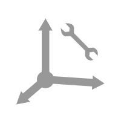
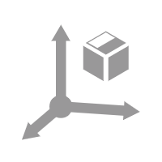
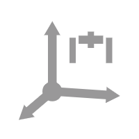
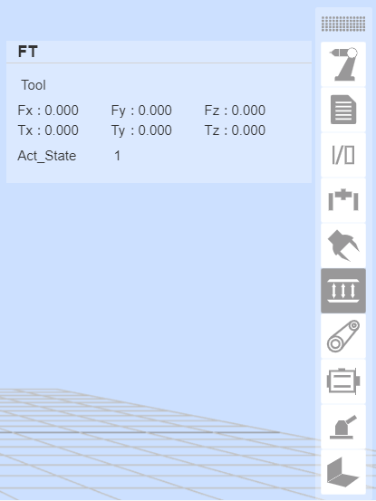
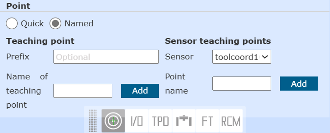
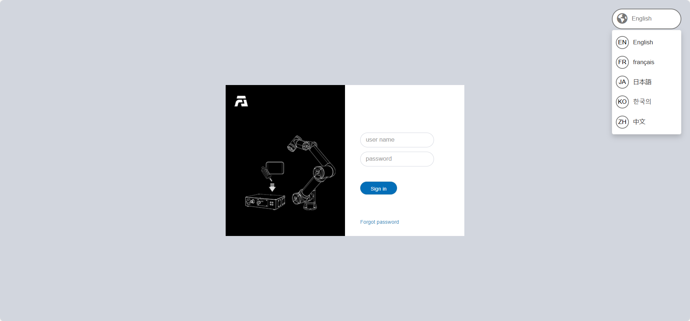
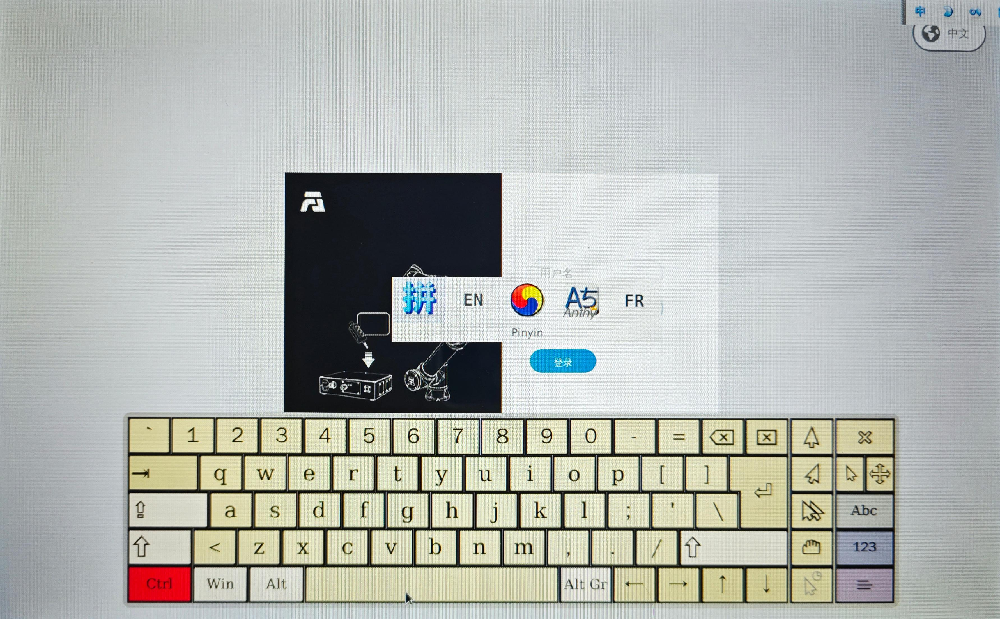
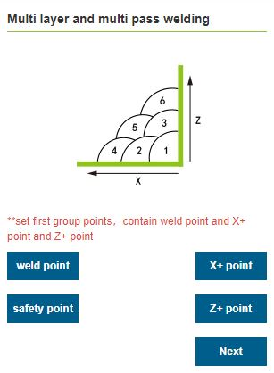

Teaching pendant software
=====================================

.. toctree:: 
   :maxdepth: 6

Basic information
-------------------

Introduction
~~~~~~~~~~~~~~

The teaching pendant software is the supporting software developed for the robot and runs on the teaching pendant operating system. Its main functions and technical characteristics are as follows:

-  Ability to write teaching programs for robots;
-  It can display the coordinates of the robot's position in real time, simulate the physical robot in three dimensions, and control the movement of the robot;
-  It can realize single-axis inching and linkage operation of each axis of the robot;
-  Able to view control IO status;
-  Users can modify passwords, view system information, etc.

Start software
~~~~~~~~~~~~~~~~

1. Power on the control box;
2. The teach pendant opens a browser to access the target website 192.168.58.2;
3. Enter the user name and password and click Login to log in to the system.

User login and permission update
~~~~~~~~~~~~~~~~~~~~~~~~~~~~~~~~~~~~~

.. centered:: Table 4.1-1 Initial user

.. list-table::
   :widths: 70 70 70 70
   :header-rows: 0
   :align: center

   * - **Job number**
     - **Initial username**
     - **Password**
     - **Function code**

   * - 111
     - admin
     - 123
     - 1

   * - 222
     - MEenginer
     - 222
     - 2

   * - 333
     - PEenginer
     - 333
     - 3
   
   * - 444
     - programmer
     - 444
     - 4
   
   * - 555
     - operator
     - 555
     - 5

   * - 666
     - monitor
     - 666
     - 6

Users (refer to \ `4.10.2.1 User Management <#user-management>`__\  for user management) are divided into six levels by default, administrators have no function restrictions, operators and monitors can use a small number of functions, ME engineers, PE&PQE engineers and technicians & team leaders have some function restrictions, management There are no functional restrictions for administrators. For specific default function code permissions, refer to \ `4.10.2.2 Authority management <#authority-management>`__\. 

The login interface is shown in Figure 4.1-1 login interface.

.. figure:: teaching_pendant_software/002.png
   :width: 6in
   :align: center

.. centered:: Figure 4.1-1 Login Interface

After the login is successful, the system will load the model and other data, and enter the initial page after loading.

System initial interface
----------------------------

After the login is successful, the system enters the "initial interface". The initial interface shows that the teach pendant mainly includes the FAIR INNOVATION LOGO and the button to return to the initial page, the menu bar, the menu bar zoom button, the robot operation area, the control area, the status area, the 3D simulation robot and Pose and IO information area, a total of eight areas. As shown in Figure 4.2-1 system initial interface schematic diagram.

.. image:: teaching_pendant_software/003.png
   :align: center
   :width: 6in
.. centered:: Figure 4.2-1 Schematic diagram of the initial interface of the system

Control area
~~~~~~~~~~~~~~~

.. note:: 
   .. image:: teaching_pendant_software/004.png
      :width: 0.75in
      :height: 0.75in
      :align: left

   name：**Enable button**
   
   effect：Enable the robot

.. note:: 
   .. image:: teaching_pendant_software/005.png
      :width: 0.75in
      :height: 0.75in
      :align: left

   name：**Start button**
   
   effect：Upload and start running the teaching program

.. note:: 
   .. image:: teaching_pendant_software/006.png
      :width: 0.75in
      :height: 0.75in
      :align: left

   name：**Stop button**
   
   effect：Stop the current teaching program running

.. note:: 
   .. image:: teaching_pendant_software/007.png
      :width: 0.75in
      :height: 0.75in
      :align: left

   name：**Pause/Resume button**
   
   effect：Pause and resume the current teaching program

.. important::
   The pause instruction is at the end of the program and cannot be judged.

Status Bar
~~~~~~~~~~~~

.. note:: 
   .. image:: teaching_pendant_software/008.png
      :width: 2.25in
      :height: 0.75in
      :align: left

   name：**robot status**
   
   effect：Stopped-stop，Running-run，Pause-pause，Drag-drag

.. note:: 
   .. image:: teaching_pendant_software/009.png
      :width: 2.25in
      :height: 0.75in
      :align: left

   name：**Tool coordinate system number**
   
   effect：Display the tool coordinate system number of the current application
   
.. note:: 
   .. image:: teaching_pendant_software/010.png
      :width: 2.25in
      :height: 0.75in
      :align: left

   name：**Running speed percentage**
   
   effect：The speed of the robot when it is running in the current mode

.. note:: 
   .. image:: teaching_pendant_software/011.png
      :width: 2.25in
      :height: 0.75in
      :align: left

   name：**Runn normally**
   
   effect：The current robot is running normally

.. note:: 
   .. image:: teaching_pendant_software/012.png
      :width: 2.25in
      :height: 0.75in
      :align: left

   name：**Error state**
   
   effect：There is an error in the current robot operation

.. note:: 
   .. image:: teaching_pendant_software/013.png
      :width: 2.25in
      :height: 0.75in
      :align: left

   name：**automatic mode**
   
   effect：Robot automatic operation mode.When the global speed adjustment in manual mode and automatic mode is turned on and the speed is specified, the global speed will be automatically adjusted to the specified speed

.. note:: 
   .. image:: teaching_pendant_software/014.png
      :width: 2.25in
      :height: 0.75in
      :align: left

   name：**Teach mode**
   
   effect：Robot teaching operation mode, set the global speed adjustment of manual mode and automatic mode and specify the speed.

.. note:: 
   .. image:: teaching_pendant_software/015.png
      :width: 2.25in
      :height: 0.75in
      :align: left

   name：**Drag state**
   
   effect：The current robot can drag

.. note:: 
   .. image:: teaching_pendant_software/016.png
      :width: 2.25in
      :height: 0.75in
      :align: left

   name：**Drag state**
   
   effect：The current robot is not draggable

.. note:: 
   .. image:: teaching_pendant_software/017.png
      :width: 2.25in
      :height: 0.75in
      :align: left

   name：**Connection status**
   
   effect：Robot connected

.. note:: 
   .. image:: teaching_pendant_software/017-1.png
      :width: 2.25in
      :height: 0.75in
      :align: left

   name：**Not connected status**
   
   effect：Robot not connected

.. note:: 
   .. image:: teaching_pendant_software/018.png
      :width: 2.25in
      :height: 0.75in
      :align: left

   name：**Account information**
   
   effect：Display username and permissions and logout user

Menu Bar
~~~~~~~~~~~~

The menu bar is as shown in Table 4.2-1 Teaching Pendant Menu Columns

.. centered:: Table 4.2-1 Teach pendant menu column

+--------------------------------------------+----------------------------------------------------------------------------------------------------------------------------------------------------------------------------------------------------------------------------------------------------------------------------------------------------------------------------------------------------------------------------------------------------------+
|class a                                     |second level                                                                                                                                                                                                                                                                                                                                                                                              |
+============================================+==========================================================================================================================================================================================================================================================================================================================================================================================================+
|Initial settings                            |Robot settings                                                                                                                                                                                                                                                                                                                                                                                            | 
|                                            +----------------------------------------------------------------------------------------------------------------------------------------------------------------------------------------------------------------------------------------------------------------------------------------------------------------------------------------------------------------------------------------------------------+
|                                            |User peripheral configuration                                                                                                                                                                                                                                                                                                                                                                             |
+--------------------------------------------+----------------------------------------------------------------------------------------------------------------------------------------------------------------------------------------------------------------------------------------------------------------------------------------------------------------------------------------------------------------------------------------------------------+
|Teaching simulation                         |Program teaching                                                                                                                                                                                                                                                                                                                                                                                          | 
|                                            +----------------------------------------------------------------------------------------------------------------------------------------------------------------------------------------------------------------------------------------------------------------------------------------------------------------------------------------------------------------------------------------------------------+
|                                            |Graphical programming                                                                                                                                                                                                                                                                                                                                                                                     |
|                                            +----------------------------------------------------------------------------------------------------------------------------------------------------------------------------------------------------------------------------------------------------------------------------------------------------------------------------------------------------------------------------------------------------------+
|                                            |Teaching management                                                                                                                                                                                                                                                                                                                                                                                       |
+--------------------------------------------+----------------------------------------------------------------------------------------------------------------------------------------------------------------------------------------------------------------------------------------------------------------------------------------------------------------------------------------------------------------------------------------------------------+                         
|Status information                          |System log                                                                                                                                                                                                                                                                                                                                                                                                | 
|                                            +----------------------------------------------------------------------------------------------------------------------------------------------------------------------------------------------------------------------------------------------------------------------------------------------------------------------------------------------------------------------------------------------------------+
|                                            |Status Query                                                                                                                                                                                                                                                                                                                                                                                              |
+--------------------------------------------+----------------------------------------------------------------------------------------------------------------------------------------------------------------------------------------------------------------------------------------------------------------------------------------------------------------------------------------------------------------------------------------------------------+
|Auxiliary application                       |Robot body                                                                                                                                                                                                                                                                                                                                                                                                | 
|                                            +----------------------------------------------------------------------------------------------------------------------------------------------------------------------------------------------------------------------------------------------------------------------------------------------------------------------------------------------------------------------------------------------------------+
|                                            |Welding expert database                                                                                                                                                                                                                                                                                                                                                                                   |
|                                            +----------------------------------------------------------------------------------------------------------------------------------------------------------------------------------------------------------------------------------------------------------------------------------------------------------------------------------------------------------------------------------------------------------+
|                                            |Secruity settings                                                                                                                                                                                                                                                                                                                                                                                         |
+--------------------------------------------+----------------------------------------------------------------------------------------------------------------------------------------------------------------------------------------------------------------------------------------------------------------------------------------------------------------------------------------------------------------------------------------------------------+ 
|System settings                             |/                                                                                                                                                                                                                                                                                                                                                                                                         |
+--------------------------------------------+----------------------------------------------------------------------------------------------------------------------------------------------------------------------------------------------------------------------------------------------------------------------------------------------------------------------------------------------------------------------------------------------------------+ 

Operating area
~~~~~~~~~~~~~~~~~

IO settings can refer to \ `4.5.1 I/O settings <#i-o-settings>`__\  in 4.5 Control Box I/O.

Joint, Base and other functions can refer to \ `4.6 Robot operation <#robot-operation>`__\.

3D simulation robot
---------------------

3D virtual trajectory and import tool model
~~~~~~~~~~~~~~~~~~~~~~~~~~~~~~~~~~~~~~~~~~~~~

**Trajectory drawing**：When running the teaching program, turn on the trajectory drawing function, and the 3D model of the robot will describe the trajectory of the robot movement.

**Import tool model**：Click the "Import" button, and the tool model can be displayed on the end of the robot after the tool model is imported. Currently, the tool model file formats supported are STL and DAE.

.. centered:: Figure 4.3-1 Virtual trajectory drawing and tool model import

3D visualization display of robot coordinate system
~~~~~~~~~~~~~~~~~~~~~~~~~~~~~~~~~~~~~~~~~~~~~~~~~~~~~~

Create various 3D virtual coordinate systems in the 3D virtual area of the WebAPP robot, taking the display of the base coordinate system as an example, as shown in the figure below. Among them, the X axis is red, the Y axis is green, and the Z axis is blue.

**Base coordinate system**：In the base coordinate system WebAPP, the system robot is displayed in the three-dimensional virtual area by default, and the fixed mark is at the bottom center of the robot base. The 3D virtual base coordinate system can be displayed manually.

.. image:: teaching_pendant_software/021.png
   :width: 6in
   :align: center

.. centered:: Figure 4.3-2 Base coordinate system display off and on

**Tool coordinate system**：The display of the tool coordinate system is enabled by default and can be manually disabled. After the WebAPP starts and the user logs in successfully, obtain the tool coordinate system name and corresponding parameter data of the current application, and initialize the current tool coordinate system.

When applying other tool coordinate systems during use, after the application tool coordinate system command succeeds, first clear the existing tool coordinate system in the robot's 3D virtual area, and then transfer the newly applied tool coordinate system parameter data into the 3D coordinate system The API is generated to generate the tool coordinate system, and after the generation is completed, it is displayed in the three-dimensional virtual area of the robot.

.. centered:: Figure 4.3-3 Tool coordinate system display

**Workpiece coordinate system**：The workpiece coordinate system is closed by default, and it can be displayed manually. The process is consistent with the tool coordinate system.

.. centered:: Figure 4.3-4 Workpiece coordinate system display

**External Axis Coordinate System**：The external axis coordinate system is turned off by default, and it can be manually turned on and displayed. The process is consistent with the tool coordinate system.

.. centered:: Figure 4.3-5 External axis coordinate system display

Robot installation method setting and display
~~~~~~~~~~~~~~~~~~~~~~~~~~~~~~~~~~~~~~~~~~~~~~~

The default installation mode of the robot is horizontal installation. When the installation mode of the robot is changed, the actual installation mode of the robot must be set on this page in time to ensure the normal operation of the robot.

The user clicks the "Fixed Installation" tab in the robot's 3D virtual display area to enter the robot's fixed installation mode setting page, select "Front Mount", "Flip Mount" or "Side Mount", and click the "Apply" button to complete the robot installation mode setting .

.. image:: teaching_pendant_software/025.png
   :width: 6in
   :align: center

.. centered:: Figure 4.3-6 Fixed installation

Considering more flexible and rich robot deployment scenarios, we provide a free installation function. Users click the "360-degree free installation" tab in the robot's 3D virtual display area to enter the robot free installation mode setting page. Manually adjust the "base tilt" and "base rotation" angles, and the 3D model will show the installation effect accordingly. After modification, click the "Apply" button to complete the robot installation method setting.

.. image:: teaching_pendant_software/026.png
   :width: 6in
   :align: center
   
.. centered:: Figure 4.3-7 360 degree free installation

.. important:: 
   After the installation of the robot is completed, the installation method of the robot must be set correctly, otherwise it will affect the use of the robot's dragging function and collision detection function.

Robot settings
----------------

Tool coordinates
~~~~~~~~~~~~~~~~~~~

Under the menu bar of "Robot Settings" in "Initial Settings", click "Tool Coordinates" to enter the tool coordinates interface. Tool coordinates can realize the modification, clearing and application of tool coordinates. There are 15 numbers in the drop-down list of the tool coordinate system. After selecting the corresponding coordinate system (the name of the coordinate system can be customized), the corresponding coordinate value, tool type and installation position will be displayed below (displayed only under the sensor type tool), select Click the "Apply" button after a certain coordinate system, and the currently used tool coordinate system will change to the selected coordinates, as shown in Figure3.4-1.

.. image:: teaching_pendant_software/027.png
   :width: 3in
   :align: center
   
.. centered:: Figure 4.4-1 Set tool coordinates

Click "Modify" to reset the tool coordinate system of the number according to the prompt. Tool calibration methods are divided into four-point method and six-point method. The four-point method only calibrates the tool TCP, that is, the position of the center point of the tool. Its posture defaults to be consistent with the end posture. The six-point method adds two points to the four-point method. , used to calibrate the attitude of the tool, here we take the six-point method as an example to explain.

.. image:: teaching_pendant_software/028.png
   :width: 3in
   :align: center

.. centered:: Figure 4.4-2 Set tool coordinates

Select a fixed point in the robot space, move the tool to the fixed point in three different postures, and set 1-3 points in sequence. As shown in the upper left of Figure 4.4-3. Move the tool vertically to the fixed point setting point 4, as shown in the upper right of Figure 4.4-3. Keep the posture unchanged, use the base coordinates to move, move a certain distance in the horizontal direction, and set point 5, which is the positive direction of the X-axis of the set tool coordinate system. Return to the fixed point, move vertically for a certain distance, and set point 6. This direction is the positive direction of the Z-axis of the tool coordinate system, and the positive direction of the Y-axis of the tool coordinate system is determined by the right-hand rule. Click the Calculate button to calculate the tool pose. If you need to reset it, click Cancel and press the Modify button to re-create the tool coordinate system.

.. image:: teaching_pendant_software/029.png
   :width: 6in
   :align: center

.. centered:: Figure 4.4-3 Schematic diagram of the six-point method

After completing the last step, click "Finish" to return to the tool coordinate interface, and click "Save" to store the tool coordinate system just created.

.. important:: 
   1. After the tool is installed at the end, the tool coordinate system must be calibrated and applied, otherwise the position and attitude of the tool center point will not meet the expected values when the robot executes the motion command.
   2. The tool coordinate system generally uses toolcoord1~toolcoord14, and toolcoord0 is used to indicate that the position center of the tool TCP is at the center of the end flange. When calibrating the tool coordinate system, it is first necessary to apply the tool coordinate system to toolcoord0, and then select other tool coordinate systems for calibration and application.

External tool coordinates
~~~~~~~~~~~~~~~~~~~~~~~~~~

Under the menu bar of "Robot Settings" in "Initial Settings", click "External Tool Coordinate System" to enter the external tool coordinate system interface.

The modification, clearing and application of external tool coordinates can be realized in the external tool coordinate system setting interface.

There are 15 numbers in the drop-down list of the external tool coordinate system, from etoolcoord0~etoolcoord14, after selecting the corresponding coordinate system, the corresponding coordinate value will be displayed below, after selecting a coordinate system, click the "Apply" button, the currently used tool coordinate system Change to the selected coordinates, as shown in Figure 4.4-4.

.. image:: teaching_pendant_software/030.png
   :width: 3in
   :align: center

.. centered:: Figure 4.4-4 External tool coordinates

Click "Modify" to reset the tool coordinate system of the number according to the prompt, as shown in Figure 4.4-5.

.. image:: teaching_pendant_software/031.png
   :width: 3in
   :align: center

.. centered:: Figure 4.4-5 Schematic diagram of the six-point method

**1. Three-point method to determine the external TCP**

1. **Set point 1**：The TCP of the measured tool is moved to the external TCP, click the Setpoint 1 button;

2. **Set point 2**：Move a certain distance from point 1 along the X axis of the external TCF coordinate system, and click the button to set point 2;

3. **Set point 3**：Go back to point 1, move from point 1 along the Z axis of the external TCF coordinate system for a certain distance, and click the button to set point 3;

4. **Calculate**：Click the calculate button to get the external TCF;

**2.Six-point method to determine the tool TCF**

1. **Set points 1-4**：Select a fixed point in the robot space, move the tool to the selected point from four different angles, and set points 1-4 in sequence;

2. **Set point 5**：Go back to the fixed point and move a certain distance along the X axis of the tool TCF coordinate system, and click the Set Point 5 button;

3. **Set point 6**：Go back to the fixed point and move a certain distance along the Y axis of the tool TCF coordinate system, and click the set point 6 button;

4. **Calculate**：Click the calculate button to get the tool TCF;

If you need to reset, click the Cancel button to go back to the step of creating a new tool coordinate system.

After completing the last step, click "Finish" to return to the tool coordinate interface, and click "Save" to store the tool coordinate system just created.

.. important:: 
   1. The use of external tools must be calibrated and applied to the external tool coordinate system, otherwise the position and attitude of the tool center point when the robot executes motion commands will not meet the expected values.
   2. The external tool coordinate system generally uses etoolcoord1~etoolcoord14, and the application of etoolcoord0 means that the center position of the external tool TCP is at the center of the end flange. When calibrating the tool coordinate system, the tool coordinate system must first be applied to etoolcoord0, and then other tool coordinate systems should be selected calibration.

Workpiece coordinates
~~~~~~~~~~~~~~~~~~~~~~~

Under the menu bar of "Robot Settings" in "Initial Settings", click "Workpiece Coordinates" to enter the workpiece coordinates interface. Workpiece coordinates can realize the modification, clearing and application of workpiece coordinates. There are 15 numbers in the drop-down list of the workpiece coordinate system, select the corresponding coordinate system (wobjcoord0~
wobjcoord14), and then the corresponding coordinate value will be displayed in the "Coordinate System Coordinates" below. After selecting a certain coordinate system, click the "Apply" button, and the currently used workpiece coordinate system will change to the selected coordinates, as shown in Figure3.4-6 shown.

.. image:: teaching_pendant_software/032.png
   :width: 3in
   :align: center

.. centered:: Figure 4.4-6 Set workpiece coordinates

The workpiece coordinate system is generally calibrated based on the tool, and the workpiece coordinate system needs to be established on the basis of the established tool coordinate system. Click "Modify" to reset the workpiece coordinate system of the number according to the prompt. Fix the workpiece and select the calibration method "origin-X-axis-Z-axis" or "origin-X-axis-XY+plane". The selection of the first two points of the two calibration methods is the same, and the third point is different. One method is to calibrate the Z direction of the workpiece coordinate system, and the second method is to calibrate a point on the XY+ plane, just calibrate according to the diagram. Click the Calculate button to calculate the workpiece pose. If you need to reset it, click Cancel and press the Modify button to re-create the workpiece coordinate system.

.. centered:: Figure 4.4-7 Schematic diagram of the three-point method

After completing the last step, click "Finish" to return to the workpiece coordinate interface, and click "Save" to store the workpiece coordinate system just created.

.. important:: 
   1. The workpiece coordinate system is calibrated based on the tool, and the workpiece coordinate system needs to be established on the basis of the established tool coordinate system.
   2. The workpiece coordinate system generally uses wobjcoord1~wobjcoord14, and wobjcoord0 is used to indicate that the origin of the workpiece coordinate system is at the origin of the base coordinates. When calibrating the workpiece coordinate system, it is first necessary to apply the workpiece coordinate system to wobjcoord0, and then select other workpiece coordinate systems for calibration and application.

Extended Axis Coordinates
~~~~~~~~~~~~~~~~~~~~~~~~~~~

Under the menu bar of "Robot Settings" in "Initial Settings", click "Extended Axis Coordinate System" to enter the extended axis coordinate system interface. In the extended axis coordinate system setting interface, the modification, clearing and application of the extended axis coordinates can be realized.

There are 5 numbers in the drop-down list of the extended axis coordinate system, from eaxis0~eaxis4, after selecting the corresponding coordinate system, the corresponding coordinate value will be displayed below, after selecting a coordinate system, click the "Apply" button, the currently used extended axis coordinates The system becomes the selected coordinates, as shown in Figure 4.4-8.

.. image:: teaching_pendant_software/034.png
   :width: 3in
   :align: center

.. centered:: Figure 4.4-8 Extended Axis Coordinates

Click "Modify" to reset the extended axis coordinate system of the number according to the prompt, as shown in Figure 4.4-9. Before calibration, clear the extended axis coordinate system that needs to be calibrated, and apply this extended axis coordinate system. Let’s first look at the first expansion axis scheme - the calibration method of the linear guide. Select the number of the extension axis, get information to get the driver information of the corresponding extension axis, and we can configure parameters based on this information. Set the DH parameters after configuration, and the linear guide rail scheme defaults to 0. Set the position of the robot relative to the expansion axis, and the linear guide is on the expansion axis. If you don’t want to calibrate, just click Save. At this time, the expansion axis can only move asynchronously.

.. image:: teaching_pendant_software/035.png
   :width: 3in
   :align: center

.. centered:: Figure 4.4-9 Linear guide configuration

If you need to move synchronously with the robot, click Calibrate to enter the calibration interface. At the zero point of the extended axis, click the Eaxis in the operation area to enable the extended axis, and align the end center of the robot (using the tool end point in the application tool coordinate system) with two different postures. Fix a point on the quasi-expansion axis, set point 1 and point 2 respectively. Remove the enable, and move the extension axis for a certain distance. After enabling, also align the center point of the end of the robot with the previous fixed point, and set point 3. Remove the enable, move the expansion axis to the zero point, and enable the expansion axis. Move the center point of the end of the robot to the fixed point and vertically upward space, set point 4, calculate the coordinate system and save it.

.. image:: teaching_pendant_software/036.png
   :width: 3in
   :align: center

.. centered:: Figure 4.4-10 Linear guide calibration

Next, let's look at the second expansion axis scheme - the calibration method of the positioner. The positioner is composed of two extension axes. Select the number of the extension axis and get the information to get the driver information of the corresponding extension axis. We can configure parameters according to this information. After configuration, set the DH parameters, measure the DH parameters of the positioner according to the diagram, and input them into the input box. Set the position of the robot relative to the extension axis, and the positioner is outside the extension axis. If you don’t want to calibrate, just click Save. At this time, the expansion axis can only move asynchronously.

.. image:: teaching_pendant_software/037.png
   :width: 3in
   :align: center

.. centered:: Figure 4.4-11 Positioner configuration

If you need to move synchronously with the robot, click Calibrate to enter the calibration interface. At the zero point of the extended axis, click the Eaxis in the operation area to enable the extended axis, establish a coordinate system on the positioner, select a point, and input the value of the point under the coordinate system. Carl pose, for example, select a point in the positive direction of Y, and measure Y to be 100mm, then input the value as shown in the figure, click the reference point, and the reference point can be set. The following four calibration points need to align the center of the end of the robot (the end point of the tool in the application tool coordinate system) with this reference point.

.. image:: teaching_pendant_software/038.png
   :width: 3in
   :align: center

.. centered:: Figure 4.4-12 Positioner reference point configuration

Align the center of the end of the robot (using the end point of the tool in the application tool coordinate system) to the reference point, set point 1, click the Eaxis in the operation area to jog the two axes for a short distance, align the center of the end of the robot to the reference point, and set Point 2, continue to jog the two axes, the center of the robot end is aligned with the reference point, set point 3, and finally continue to jog the two axes, align the center of the robot end with the reference point, set point 4, click Calculate, and get the coordinates Click the save button to apply the result.

.. centered:: Figure 4.4-13 Positioner calibration

Next, let's look at the third extended axis solution - the calibration method of the single-axis positioner. The positioner is composed of a rotating extension shaft. Select the number of the extension shaft and get the information to get the driver information of the corresponding extension shaft. We can configure parameters according to this information. The DH parameter is set to 0. Set the position of the robot relative to the extension axis, and the positioner is outside the extension axis. If you don’t want to calibrate, just click Save. At this time, the expansion axis can only move asynchronously.

.. image:: teaching_pendant_software/040.png
   :width: 3in
   :align: center

.. centered:: Figure 4.4-14 Single axis positioner configuration

If you need to move synchronously with the robot, click Calibrate to enter the calibration interface. At the zero point of the extended axis, click the Eaxis in the operation area to enable the extended axis, establish a coordinate system on the positioner, select a point, and input the value of the point under the coordinate system. Carl pose, click "Reference Point" to set the reference point. The following four calibration points need to align the center of the end of the robot (the end point of the tool in the application tool coordinate system) with this reference point. Align the center of the end of the robot (using the end point of the tool in the application tool coordinate system) to the reference point, set point 1, click the Eaxis in the operation area to jog the rotation axis for a short distance, align the center of the end of the robot to the reference point, and set the point 2. Continue to jog the rotation axis, align the center of the end of the robot with the reference point, set point 3, and finally continue to jog the rotation axis, align the center of the end of the robot with the reference point, set point 4, click Calculate, and get the result of the coordinate system, Click Save to apply.

.. image:: teaching_pendant_software/041.png
   :width: 3in
   :align: center

.. centered:: Figure 4.4-15 Single axis positioner calibration

.. important:: 
   1. The extended axis coordinate system is calibrated on the basis of the tool, and the extended axis coordinate system needs to be established on the basis of the established tool coordinate system.
   2. The extended axis system generally uses exaxis1~exaxis4, and exaxis0 is used to represent the non-extended axis coordinate system. When calibrating the extended axis coordinate system, the extended axis coordinate system must first be applied to exaxis0, and then other extended axis coordinate systems should be selected for calibration and application.

Collision level
~~~~~~~~~~~~~~~~~~

Under the menu bar of "Robot Settings" in "Initial Settings", click "Collision Level" to enter the collision level interface.

The collision level is divided into one to ten levels, and the detection of one to three levels is more sensitive, and the robot needs to run at the recommended speed. At the same time, you can choose to customize the percentage setting, and 100% corresponds to the tenth level. The collision strategy can set the processing method of the robot after the collision, which is divided into error stop and continuous movement, and the user can set it according to the specific use requirements. Such as Figure 4.4-16.

.. image:: teaching_pendant_software/042.png
   :width: 3in
   :align: center

.. centered:: Figure 4.4-16 Schematic diagram of collision level

Soft limit
~~~~~~~~~~~

Under the menu bar of "Robot Settings" in "Initial Settings", click "Soft Limits" to enter the soft limit interface.

There may be other equipment in the robot's stroke, and the limit angle can softly limit the robot so that the robot's movement does not exceed a certain coordinate value and prevent the robot from colliding. Triggering the soft limit to stop the robot is automatically triggered by the robot, and there is no stopping distance.

Administrators can use the default values or enter angle values. Input the angle value to limit the positive and negative angles of the robot joints respectively. When the input value exceeds the soft limit angle of the robot joints listed in \ `Table 1.1-1 Robot Basic Parameters <introduction.html#basic-parameters>`__\ value, the limit angle will be adjusted to the maximum value that can be set. When the robot reports that the command exceeds the limit, it needs to enter the drag mode and drag the robot joints to within the limit angle. The interface is shown in 3.4-17.

.. image:: teaching_pendant_software/043.png
   :width: 3in
   :align: center

.. centered:: Figure 4.4-17 Schematic diagram of robot limit

End load
~~~~~~~~~~

Under the menu bar of "Robot Settings" in "Initial Settings", click "End Load" to enter the end load interface.

When configuring the end load, please enter the mass of the end tool used and the corresponding center of mass coordinates into the "Load mass" and "Load mass center coordinates X, Y and Z" input boxes and apply.

.. important:: 
    The load mass cannot exceed the maximum load range of the robot. Please refer to the load range corresponding to the specific robot model. \ `2.1. Basic parameters <robot_brief_introduction.html#basic-parameters>`__\ .The center of mass coordinate setting range is 0-1000, unit mm。

.. image:: teaching_pendant_software/044.png
   :width: 3in
   :align: center

.. centered:: Figure 4.4-18 Schematic diagram of load setting

.. important:: 
   After the load is installed at the end of the robot, the weight of the end load and the coordinates of the center of mass must be set correctly, otherwise it will affect the drag function of the robot and the use of the collision detection function.

If the user is unsure about the tool mass or center of mass, he can click "Automatic Identification" to enter the load identification function to measure the tool data.

Before taking measurements, make sure the load is installed and then select the version. Click the "Tool Data Measurement" button to enter the load motion test interface.

.. image:: teaching_pendant_software/045.png
   :width: 3in
   :align: center

.. centered:: Figure 4.4-19 Load Identification Joint Setup

Click "Load Identification Start" to test. In case of emergency, please stop the movement in time.

.. image:: teaching_pendant_software/046.png
   :width: 3in
   :align: center

.. centered:: Figure 4.4-20 load identification start

After the exercise is over, click the "Get Identification Result" button to obtain the calculated tool data and display it on the page. If you want to apply it to the load data, click Apply

.. image:: teaching_pendant_software/047.png
   :width: 3in
   :align: center

.. centered:: Figure 4.4-21 Load Identification Results

Friction compensation
~~~~~~~~~~~~~~~~~~~~~~~~~

Under the menu bar of "Robot Settings" in "Initial Settings", click "Friction Compensation" to enter the friction compensation setting interface.

**Friction compensation coefficient**：The usage scenario for friction compensation is only in the dragging mode. The friction compensation coefficient can be set from 0 to 1. The higher the value, the greater the compensation force when dragging. The friction compensation coefficient needs to be set separately for each axis according to the different installation methods.

**Friction compensation switch**：Users can turn on or off friction compensation according to the actual robot and usage habits.

.. image:: teaching_pendant_software/048.png
   :width: 3in
   :align: center

.. centered:: Figure 4.4-22 Friction Compensation Settings

.. important:: 
   The friction compensation function of the robot needs to be used with caution. According to the actual situation, a reasonable compensation coefficient should be set. Generally, the recommended median value is about 0.5.

Speed scaling
~~~~~~~~~~~~~

Under the menu bar of "Robot Settings" in "Initial Settings", click "Speed Scaling Settings" to enter the speed scaling setting interface.

This function is to set the running speed of the robot under manual/automatic mode. If the current running mode is automatic, the set speed is the automatic running speed of the robot. If the current running mode is manual, the set speed is the manual running speed of the robot. The setting value is the percentage of the standard speed of the robot. If it is set to 100, it means 100% of the standard speed (for standard speed, please refer to  \ `Table 1.1-1 Robot Basic Parameters <introduction.html#basic-parameters>`__\ ).

.. centered:: Figure 4.4-23 Velocity scaling settings

After the speed is set successfully, the corresponding speed status bar will change to the set value, and the range of speed value setting is 0~100.

.. Configuration import and export
.. ~~~~~~~~~~~~~~~~~~~~~~~~~~~~~~~~~

.. Under the menu bar of "Robot Settings" in "Initial Settings", click "Configuration Import and Export" to enter the configuration import and export interface.

.. **Import robot configuration files**：The user imports a robot configuration file named user.config, which contains various parameters in the robot setting function. Click the "Select File" button, select the configuration file that has been modified and the content meets the specifications, and click the "Import" button. When the prompt of import completion appears, the parameters in the file are successfully set.

.. **Export robot configuration file**：Click the "Export" button to export the robot configuration file user.config to the local.

.. **Import controller database**：The user imports the controller database file named fr_controller_data.db. Click the "Select File" button, select the database file that has been modified and the content meets the specifications, and click the "Import" button. When the prompt of import completion appears, the parameters in the file are successfully set.

.. **Controller database**：Click the "Export" button to export the robot controller database file to the local.

.. .. image:: teaching_pendant_software/050.png
..    :width: 3in
..    :align: center

.. .. centered:: Figure 4.4-24 Configuration import and export

Control box I/O
--------------------

I/O settings
~~~~~~~~~~~~~~~

Click the "IO" button in the operation area on the left side of the 3D model to enter the IO setting interface, as shown in Figure 4.5-1. In this interface, the digital output, analog output (0-10v) and end tool digital output in the robot control box can be realized. Output, analog output (0-10v) for manual control:

.. image:: teaching_pendant_software/051.png
   :width: 3in
   :align: center

.. centered:: Figure 4.5-1 I/O setting interface

- DO operation: select the port number, if the DO is low level, the right operation button will display ON, click the button to set the DO to high level.

- AO operation: Select the port number, enter a value (0-100) in the input box on the right, the value is a percentage, setting 100 means setting the AO port to 10v.

I/O status display
~~~~~~~~~~~~~~~~~~~~

The status display area on the right side of the 3D model will display the current IO status. In digital input and digital output, if the port level is high, the point will be displayed in green, and if it is low, it will be displayed in white; analog input and analog output The display value is 0-100, and 100 means 10v.

.. centered:: Figure 4.5-2 Status display interface

I/O filtering
~~~~~~~~~~~~~~~~

Click "Robot Settings" in "Initial Settings" in the left menu bar, and click the "IO Filter" submenu to enter the IO filter time setting interface. The filter time setting interface includes: control box DI filter time, end board DI filter time, control box AI0 Filtering time, AI1 filtering time of the control box, AI0 filtering time of the end board, as shown in Figure3.5-3. Users can set the corresponding parameters according to their needs, just click the corresponding setting button.

.. image:: teaching_pendant_software/053.png
   :width: 3in
   :align: center

.. centered:: Figure 4.5-3 Filter interface

.. important:: 
   The I/O filter time range is [0~200], the unit is ms.

I/O configuration
~~~~~~~~~~~~~~~~~~

Click "Robot Settings" in "Initial Settings" on the left menu bar, and click the "DI Configuration" and "DO Configuration" submenus respectively to enter the DI and DO configuration interface. Among them, the control box CI0-CI7 and CO0-CO7 are configurable, and the terminal DI0 and DI1 are configurable. In production, when the collaborative robot needs to connect peripherals or stops suddenly due to failure or other factors, it needs to output DO signal to realize sound and light alarm prompt. The input configurable functions are shown in Table 4.5-1 Control Box Input Configurable Functions.

.. centered:: Table 4.5-1 Control box input configurable functions

.. list-table:: 
   :widths: 15 80
   :header-rows: 1

   * - Fuction No
     - Fuction name
   * - 0
     - nothing
   * - 1
     - Arcing success signal
   * - 2
     - Welding machine preparation signal
   * - 3
     - Belt detection
   * - 4
     - suspend
   * - 5
     - recovery
   * - 6
     - start-up 
   * - 7
     - stop it  
   * - 8
     - Pause/Resume 
   * - 9
     - Start/Stop
   * - 10
     - Pedal drag switch 
   * - 11
     - Move to job origin
   * - 12
     - Manual automatic switching
   * - 13
     - Welding wire position finding succeeded
   * - 14
     - Motion interruption 
   * - 15
     - Start main program
   * - 16
     - Start rewind
   * - 17
     - Start up confirmation
   * - 18
     - Laser detection signal X
   * - 19
     - Laser detection signal Y

The output configurable functions are shown in Table 4.5-2 and Table 4.5-3.

.. centered:: Table 4.5-2 Control box output configurable function

.. list-table:: 
   :widths: 15 80
   :header-rows: 1

   * - Fuction No
     - Fuction name
   * - 0
     - nothing
   * - 1
     - report errors
   * - 2
     - motion
   * - 3
     - Spraying start and stop
   * - 4
     - Spraying gun cleaning
   * - 5
     - Arcing
   * - 6
     - aspiration
   * - 7
     - Forward wire feeding
   * - 8
     - Reverse wire feeding
   * - 9
     - JOB input port 1
   * - 10
     - JOB input port 2
   * - 11
     - JOB input port 3
   * - 12
     - Start and stop of conveyor belt
   * - 13
     - suspend
   * - 14
     - Reaching the job origin
   * - 15
     - Enter the interference zone
   * - 16
     - Start stop control of welding wire positioning
   * - 17
     - Robot startup completed
   * - 18
     - Program start and stop
   * - 19
     - Automatic manual mode

.. centered:: Table 4.5-3 Terminal input configurable function

.. list-table:: 
   :widths: 15 80
   :header-rows: 1

   * - Fuction No
     - Fuction name
   * - 0
     - nothing
   * - 1
     - Drag Mode
   * - 2
     - Teaching point record
   * - 3
     - Manual automatic switching
   * - 4
     - TPD track recording start/stop
   * - 5
     - suspend
   * - 6
     - recovery
   * - 7
     - start-up
   * - 8
     - stop it
   * - 9
     - Pause/Resume
   * - 10
     - Start/Stop

Among them, the default configuration of the control box: CO0 is 1-the robot is reporting an error, and CO1 is 2-the robot is in motion.

.. image:: teaching_pendant_software/057.png
   :width: 6in
   :align: center

.. centered:: Figure 4.5-4 Control box DI and DO configuration

The default configuration of terminal DI: DI0 drag teaching, DI1 teaching point recording.

.. image:: teaching_pendant_software/058.png
   :width: 3in
   :align: center

.. centered:: Figure 4.5-5 Terminal DI configuration

After the configuration is complete, you can view the corresponding output DO status on the I/O page of the control box under the corresponding status. (Note: configured DI and DO cannot appear on the teaching programming page)

.. important:: 
   Configured DI and DO are forbidden to be used in teaching programming.

I/O alias configuration
~~~~~~~~~~~~~~~~~~~~~~~~~~~~~~~

Click on "Robot Settings" in the "Initial Settings" menu bar on the left, click on the "I/O Alias Configuration" submenu to enter the configuration interface, and configure the given meaning names of the control box and end IO signals according to the actual usage scenario. After successful configuration, the modules related to IO signal content will display corresponding aliases, as follows:

.. centered:: Figure 4.5‑6 I/O alias configuration

**Robot operation**: IO signal selection boxes for IO and TPD control boxes (CtrlBox) and end (End);

.. centered:: Figure 4.5‑7 Robot operation IO

.. centered:: Figure 4.5‑8 机器人操作TPD

**Robot status**: IO signal status of Robot's control box (CtrlBox) and end (End);

.. centered:: Figure 4.5‑9 Robot status IO

**Teaching simulation - program teaching**: Add program commands such as "Wait", "Digital IO", and "Analog IO", and select the program command line by clicking the "Edit" icon. The IO selection box in the pop-up box will pop up;

.. centered:: Figure 4.5‑10 Program Teach Add IO

.. centered:: Figure 4.5‑11 Program Teaching Editor IO

**Teaching simulation - graphical programming**: IO dropdown selection for 'Logic' and 'Control' modules;

.. centered:: Figure 4.5‑12 Graphical programming IO

**Auxiliary Application - Robot Body**: IO key selection box in 'Smart Tool';

.. centered:: Figure 4.5‑13 smart Tool IO

Robot operation
-----------------

Teaching point record
~~~~~~~~~~~~~~~~~~~~~~~

The manual teaching control area is mainly to set the test coordinate system in the teaching mode, and display the angle and coordinate values of each axis of the robot in real time, and can name and save the teaching points.

When saving a teaching point, the coordinate system of the teaching point is the coordinate system of the current robot application. The speed and acceleration of the teaching point can be set above the operation area. The set value is the percentage of the standard speed of the robot. If it is set to 100, it means 100% of the standard speed (please refer to\ `Table 1.1-1 Robot Basic Parameters <introduction.html#basic-parameters>`__\）。

For the sensor teaching point, select the calibrated sensor type tool, enter the point name, click Add, and the saved point position is the position recognized by the sensor.

.. image:: teaching_pendant_software/059.png
   :width: 3in
   :align: center

.. centered:: Figure 4.6-1 Schematic diagram of manual operation area

.. important:: 
   When using it for the first time, please set a small speed value like 30 to familiarize yourself with the movement of the robot to avoid accidents

Joint Jog
~~~~~~~~~~~

Under Joint operation, the 6 slider bars in the middle represent the angles of the corresponding axes respectively, and the joint movement is divided into single-axis inching and multi-axis linkage

**single axis jog**：The user can control the movement of the robot by operating the left and right circular buttons, as shown in Figure3.6-2. In the manual mode and the joint coordinate system, perform a rotation operation on a joint of the robot. When the robot stops beyond the range of motion (soft limit), you can use single-axis jogging for manual operation to move the robot out of the overrun position. Single-axis jogging is faster and more convenient than other operation modes for rough positioning and large-scale movement.

Set the "long press movement threshold" (the maximum distance the robot can run when the button is long pressed, and the input value range is 0~300) parameters, long press the round button to control the robot running, if the button is released during the robot running, the robot will stop immediately Movement, if you keep pressing the button without releasing it, the robot will run and stop moving after long pressing the value set by the movement threshold.

**Multi-axis linkage**：The user can operate the six sliders in the middle to adjust the corresponding target position of the robot, as shown in Figure3.6-3. The target position can be determined by observing the 3D virtual robot. If the adjusted position does not meet your expectations, click the "Restore" button. Make the 3D virtual robot return to the initial position. After the user determines the target position, he can click the "Apply" button, and the physical robot will perform corresponding movements.

.. centered:: Figure 4.6-2 Schematic diagram of single-axis jogging and multi-axis linkage

.. important:: 
   In multi-axis linkage, the setting value of the fifth joint j5 cannot be less than 0.01 degrees. If the expected value is less than 0.01 degrees, you can first set it to 0.011 degrees, and then fine-tune the fifth joint j5 through single-axis jogging.

Base Jog
~~~~~~~~~~

In the base coordinate system, you can operate the circular buttons on the left and right sides to control the robot, move in a straight line on the X, Y, and Z axes or rotate around RX, RY, and RZ, and the six slider bars in the middle are respectively represented on the corresponding coordinate axes The position and range of motion, as shown in Figure3.6-3. The function of Base jogging is similar to that of single-axis jogging in Joint motion.

.. image:: teaching_pendant_software/061.png
   :width: 3in
   :align: center

.. centered:: Figure 4.6-3 Base jog diagram
   
.. important:: 
   The button can be released at any time to stop the robot. If necessary, press the emergency stop button to stop the robot.

Tool Jog
~~~~~~~~~~~~~~~~

Select the tool coordinate system, you can operate the circular buttons on the left and right sides to control the robot, move in a straight line on the X, Y, and Z axes or rotate around RX, RY, and RZ, and the six slider bars in the middle represent the positions on the corresponding coordinate axes. Position and range of motion, as shown in Figure3.6-4. The function of Tool jogging is similar to that of single-axis jogging in Joint motion.

.. centered:: Figure 4.6-4 Tool Jogging Schematic Diagram

Wobj jog
~~~~~~~~~~

Select workpiece jogging, you can operate the circular buttons on the left and right to control the robot. In the workpiece coordinate system, move along the X, Y, Z axis in a straight line or rotate around RX, RY, RZ. The six slider bars in the middle are respectively Indicates the position and motion range on the corresponding coordinate axis, as shown in Figure3.6-5. The function of Wobj jogging is similar to that of single-axis jogging in Joint motion.

.. centered:: Figure 4.6-5 Wobj jogging diagram

Move
~~~~~~~~~~

Select Move, you can directly input the Cartesian coordinate value, click "Calculate joint position", the joint position is displayed as the calculated result, confirm that there is no danger, you can click "Move to this point" to control the robot to move to the input Cartesian pose.

.. image:: teaching_pendant_software/064.png
   :width: 3in
   :align: center

.. centered:: Figure 4.6-6 Move mobile diagram

.. important:: 
   When a given pose cannot be reached, first check whether the Cartesian space pose exceeds the working range of the robot, and then check whether there is a singular pose in the process from the current pose to the target pose, if there is a singular position, adjust the current pose or process insert a new pose in order to avoid singular poses.

Eaxis move
~~~~~~~~~~~~

Select Eaxis to move, this function is the jog function of the extension axis, it needs to be configured to configure the extension axis, use this jog function to control the extension axis, see "Chapter 4 Machine-Robot Peripherals-Extended Axis Peripherals" for details configuration".

.. image:: teaching_pendant_software/065.png
   :width: 3in
   :align: center

.. centered:: Figure 4.6-7 Eaxis Mobile Diagram

TPD (Teach-in programming)
~~~~~~~~~~~~~~~~~~~~~~~~~~~~

The operation steps of teach programming (TPD) function are as follows:

- **Step1 record initial position**：Enter the operation area on the left side of the 3D model and record the current position of the robot. Set the name of the point in the edit box, click the "Save" button, if the save is successful, it will prompt "Save point successful";

- **Step2 Configure track recording parameters**：Click TPD to enter the "TPD" function item to configure trajectory recording parameters, set the name of the trajectory file, pose type and sampling period, configure DI and DO, and record the corresponding output by triggering DI during the process of recording the TPD trajectory DO, as Figure3.6-8;

.. image:: teaching_pendant_software/066.png
   :width: 3in
   :align: center

.. centered:: Figure 4.6-8 TPD track record

- **Step3 Check robot mode**：Check whether the robot mode is in manual mode. If not, switch to manual mode. In manual mode, there are two ways to switch to drag teaching mode, one is long press the end button, and the other is interface dragging mode It is recommended to switch the robot from the interface to the drag teaching mode in the TPD record. As shown in Figure 4.6-9;

.. image:: teaching_pendant_software/067.png
   :width: 3in
   :align: center

.. centered:: Figure 4.6-9 robot mode

.. important:: 
   When switching to the drag mode from the interface, first confirm whether the end tool load and the center of mass are set correctly, and whether the friction compensation coefficient is set reasonably, then press and hold the end button to confirm whether the drag is normal, and then switch to the drag mode from the interface after confirming that it is correct.

- **Step4 start recording**：Click the "Start Recording" button to start track recording, and drag the robot to teach actions. In addition, there is a "TPD recording start/stop" function configuration item in the terminal DI configuration. By configuring this function, the user can trigger the "start recording" trace function through an external signal. It should be noted that to start recording a trace through an external signal, first Configure the TPD track information on the page first.

- **Step5 stop recording**：After the action teaching is completed, click the "Stop Recording" button to stop the track recording, and then drag the teaching switch button to make the robot exit the drag teaching mode. When the teach pendant receives "stop track recording successful", it means the track recording is successful. Same as step 4, after configuring the "TPD recording start/stop" function, you can trigger the recording to stop by an external signal.

- **Step6 teach programming**：Click New, select a blank template, click to enter the PTP function programming item, select the initial position point just saved, click the "Add" button, after the application is completed, a PTP instruction will be displayed in the program file; then click to enter the TPD function programming item, Select the track just recorded, set whether it is smooth and the speed scaling, click the "Add" button, after the application is completed, a MoveTPD instruction will be displayed in the program file, as shown in Figure3.6-10;

.. image:: teaching_pendant_software/068.png
   :width: 6in
   :align: center

.. centered:: Figure 4.6-10 TPD programming

- **Step7 Trajectory recurrence**：After editing the teaching program, switch to the automatic operation mode, click the "start running" icon on the top of the interface to start running the program, and the robot will start to reproduce the teaching action.

- **Step8 track edit**：The TPD track editing area can visually display and edit the track to achieve pre-analysis and streamlining of the TPD track. Select the corresponding track acquisition point, then the track points recorded by the user will be displayed in the three-dimensional space of the robot, and then the user can drag the "Start" and "End" scroll bars to simulate and reproduce and edit the start and end points of the track.

TPD file deletion and exception handling：

- **Trajectory file deletion**：Click to enter the TPD function item, select the track file to be deleted, and click the "Delete Track" button. If the deletion is successful, you will receive a successful deletion prompt.

- **Exception handling：**

  +  **Command points exceeded**：A track can record up to 20,000 points. When the number exceeds 20,000 points, the controller will no longer record the exceeded points, and will send a warning to the teach pendant that the number of command points exceeds the limit. At this time, you need to click to stop recording;

  +  **TPD instruction interval is too large**：If the teaching pendant reports an error that the TPD command interval is too large, check whether the robot has returned to the initial position before recording. If the robot returns to the initial position and still reports an error that the TPD command interval is too large, delete the current track and record a new one;

  +  If other abnormal conditions occur during TPD operation, the robot operation should be stopped immediately through the teach pendant or the emergency stop button to check the cause.

.. important:: 
   During the operation of the TPD function, you should strictly follow the corresponding prompts on the teach pendant.

Teaching simulation
-----------------------
 
Introduction
~~~~~~~~~~~~~~

Click the command on the left to add a program node to the program tree.When the program is running, the currently executing program node is highlighted in green.In manual mode, click the first icon on the right side of the node to make the robot execute the instruction alone, and the second icon is to edit the content of the node.

.. centered:: Figure 4.7-1 Program tree interface

Click "⇄" to switch modes, and the teaching program text can be changed to the editing state, and the editing area can be expanded and collapsed in the editing state.

.. centered:: Figure 4.7-2 Teaching program editing status

Click the "Popup/Hide the content on the right side of the current program" button to expand or hide the local teaching points and the backup content of the current program. After the content on the right is expanded, click the icons of "Partial teaching point" and "Current program backup" to display the corresponding content.

.. centered:: Figure 4.7-3 Contents on the right side of the current program

Tool bar
~~~~~~~~~~

Modify the program tree using the toolbar at the bottom of the program tree.

.. note:: 
   .. image:: teaching_pendant_software/070.png
      :width: 1.5in
      :height: 0.75in
      :align: left

   name：**Open**
   
   effect：Open user program file

.. note:: 
   .. image:: teaching_pendant_software/071.png
      :width: 1.5in
      :height: 0.75in
      :align: left

   name：**New build**
   
   effect：Select a template to create a new program file
   
.. note:: 
   .. image:: teaching_pendant_software/072.png
      :width: 1.5in
      :height: 0.75in
      :align: left

   name：**Import**
   
   effect：Import the file into the user program folder

.. note:: 
   .. image:: teaching_pendant_software/073.png
      :width: 1.5in
      :height: 0.75in
      :align: left

   name：**Export**
   
   effect：Export user program files to a local point.

.. note:: 
   .. image:: teaching_pendant_software/074.png
      :width: 1.5in
      :height: 0.75in
      :align: left

   name：**Save**
   
   effect：Save file edits

.. note:: 
   .. image:: teaching_pendant_software/075.png
      :width: 1.5in
      :height: 0.75in
      :align: left

   name：**Save as**
   
   effect：Rename the file and store it in the user program or template program folder.

.. note:: 
   .. image:: teaching_pendant_software/076.png
      :width: 1.5in
      :height: 0.75in
      :align: left

   name：**Copy**
   
   effect：Duplicates a node and allows it to be used for other operations (eg: paste it elsewhere in the program tree).

.. note:: 
   .. image:: teaching_pendant_software/077.png
      :width: 1.5in
      :height: 0.75in
      :align: left

   name：**Paste**
   
   effect：Allows you to paste previously cut or copied nodes.

.. note:: 
   .. image:: teaching_pendant_software/078.png
      :width: 1.5in
      :height: 0.75in
      :align: left

   name：**To cut**
   
   effect：Cuts a node and allows it to be used for other operations (eg: paste it elsewhere in the program tree).

.. note:: 
   .. image:: teaching_pendant_software/079.png
      :width: 1.5in
      :height: 0.75in
      :align: left

   name：**Delete**
   
   effect：Deletes a node from the program tree.

.. note:: 
   .. image:: teaching_pendant_software/080.png
      :width: 1.5in
      :height: 0.75in
      :align: left

   name：**Move up**
   
   effect：Move the node up.

.. note:: 
   .. image:: teaching_pendant_software/081.png
      :width: 1.5in
      :height: 0.75in
      :align: left

   name：**Move down**
   
   effect：Move the node down.

.. note:: 
   .. image:: teaching_pendant_software/082.png
      :width: 1.5in
      :height: 0.75in
      :align: left

   name：**Toggle edit mode**
   
   effect：The program tree mode and lua editing mode switch each other.

Program command
~~~~~~~~~~~~~~~~~~

The left side is mainly for adding program commands. Click the icon above each keyword to enter the detailed interface. There are two main operations for adding program commands to the file. One way is to open the relevant command and click the Apply button to add the command to the program. , another way is to click the "Add" button first, at this time the command is not saved in the program file, and you need to click "Apply" again to save the command in the file. 
The second method often occurs when multiple commands of the same type are issued. We add an add button and display the content of the added command to this type of command. Click the Add button to add a command, and the added command displays all the added commands. , click "Apply" to save the added command to the opened file on the right.

Logic Command Interface
~~~~~~~~~~~~~~~~~~~~~~~~~

.. image:: teaching_pendant_software/202.png
   :width: 6in
   :align: center

.. centered:: Figure 4.7-4 Logic Command Interface

While command
++++++++++++++++

Click the "While" icon to enter the While command editing interface

Enter the waiting condition in the input box behind While, input the action command during the loop in the input box behind do, and click Save. (For the convenience of operation, you can enter do content arbitrarily, and edit other instructions in the program to insert instead)

.. image:: teaching_pendant_software/101.png
   :width: 6in
   :align: center

.. centered:: Figure 4.7-4-1 While command interface

if…else command
++++++++++++++++

Click the "if...else" button to enter the if...else command editing interface

Enter the statement in the input box on the right, and click "Add" and "Apply" after editing. (This instruction requires a certain programming foundation, if you need help, please contact us)

.. image:: teaching_pendant_software/102.png
   :width: 6in
   :align: center

.. centered:: Figure 4.7-4-2 if…else command interface

Goto command
++++++++++++++++

Click the "Goto" button to enter the Goto command editing interface

The Goto instruction is a jump instruction, enter the statement in the input box on the right, and click "Add" and "Apply" after editing. (This instruction requires a certain programming foundation, if you need help, please contact us)

.. image:: teaching_pendant_software/103.png
   :width: 6in
   :align: center

.. centered:: Figure 4.7-4-2 Goto command interface

Wait command
++++++++++++++++

Click the "Wait" icon to enter the Wait command editing interface

This instruction is a delay instruction, which is divided into three parts: "WaitMs", "WaitDI" and "WaitAI".

"WaitTime" command delay waiting time unit is milliseconds, input the number of milliseconds to wait, click "Add", "Apply".

.. image:: teaching_pendant_software/104.png
   :width: 6in
   :align: center

.. centered:: Figure 4.7-4-42 WaitTime command interface

"WaitDI" command, that is, single DI waiting, select the IO port number to be waited for, wait state, wait maximum time and wait timeout processing method, and click "Add" and "Apply".

.. image:: teaching_pendant_software/105.png
   :width: 6in
   :align: center

.. centered:: Figure 4.7-4-5 WaitDI command interface

"WaitMultiDI" command, that is, multi-DI waiting, first select the multi-DI establishment conditions, then check the DI port and status that need to wait, and finally set the maximum waiting time and waiting timeout processing method, click "Add" and "Apply".

.. image:: teaching_pendant_software/106.png
   :width: 6in
   :align: center

.. centered:: Figure 4.7-4-6 WaitMultiDI command interface

"WaitAI" command, select the analog quantity to be waited for, the value, the maximum waiting time and the waiting timeout processing method, and click "Add" and "Apply".

.. image:: teaching_pendant_software/107.png
   :width: 6in
   :align: center

.. centered:: Figure 4.7-4-7 WaitAI command interface

Pause command
++++++++++++++++

Click the "Pause" icon to enter the Pause command editing interface

This instruction is a pause instruction. Insert this instruction into the program. When the program executes this instruction, the robot will be in a pause state. If you want to continue running, click the "Pause/Resume" button in the control area.

.. image:: teaching_pendant_software/108.png
   :width: 6in
   :align: center

.. centered:: Figure 4.7-4-8 Pause command interface

Dofile command
++++++++++++++++

Click the "Dofile" icon to enter the Dofile command editing interface

The Dofile command calls the internal program of the controller. When using the Dofile command, the called subroutine needs to be saved, and the main program does not need to be saved again if it has not changed. The Dofile command supports two-level calls, and two parameter settings need to be paid attention to. One is the level of the call, and the other is the ID number of the call. In principle, the same ID number cannot appear in the same program.

.. image:: teaching_pendant_software/109.png
   :width: 6in
   :align: center

.. centered:: Figure 4.7-4-9 Dofile command interface

Var command
++++++++++++++++

Click the "Var" icon to enter the Var command editing interface

This command is a variable system command, which is divided into two parts: Lua variable definition, variable query and Sys variable renaming, getting value, and setting value. Lua variable definition can declare a variable and assign an initial value, and cooperate with while, if-else and other commands Use the Lua variable query command to query the value of the input variable name in real time and display it in the status bar. The number of Sys variables is fixed, and you can rename them, get variable values, and set variable values. The values stored in this variable will not be cleared when the system is turned off.

.. image:: teaching_pendant_software/100.png
   :width: 6in
   :align: center

.. centered:: Figure 4.7-4-10 Var command interface

.. important:: Variable names must start with letters or underscores, not numbers or other special characters.

Motion command interface
~~~~~~~~~~~~~~~~~~~~~~~~~~

.. image:: teaching_pendant_software/203.png
   :width: 6in
   :align: center

.. centered:: Figure 4.7-5 Motion command interface

PTP command
++++++++++++++++

Click the "PTP" icon to enter the PTP command editing interface.

You can choose the point to be reached, and the smooth transition time setting can realize that the movement from this point to the next point is continuous. Whether to set the offset, you can choose to offset based on the base coordinate system and based on the tool coordinates, and pop up x, y, z, rx, ry, rz offset settings, PTP specific path is the optimal path automatically planned by the motion controller, click "Add" and "Apply" to save this command.

.. image:: teaching_pendant_software/083.png
   :width: 6in
   :align: center

.. centered:: Figure 4.7-5-1 PTP command interface

Lin command
++++++++++++++++

Click the "Lin" icon to enter the Lin command editing interface.

The function of this command is similar to the "PTP" command, but the path of the point reached by this command is a straight line.

.. image:: teaching_pendant_software/084.png
   :width: 6in
   :align: center

.. centered:: Figure 4.7-5-2 Lin command interface

Arc command
++++++++++++++++

Click the "Arc" icon to enter the Arc command editing interface.

The "Arc" command is arc movement, which includes two points. The first point is the transition point in the middle of the arc, and the second point is the end point. Both the transition point and the end point can be set to offset, and you can choose to base coordinate system offset Shift and offset based on tool coordinates, and pop up x, y, z, rx, ry, rz offset settings, and the end point can set a smooth transition radius to achieve continuous motion effect.

.. image:: teaching_pendant_software/085.png
   :width: 6in
   :align: center

.. image:: teaching_pendant_software/086.png
   :width: 6in
   :align: center

.. centered:: Figure 4.7-5-3.7-6 Arc command interface

Circle command
++++++++++++++++

Click the "Circle" icon to enter the Circle command editing interface.

The "Circle" command is a full circle movement, including two points. The first point is the middle transition point 1 of the full circle, and the second point is the middle transition point 2 of the full circle. The transition point 2 can be set to be offset. Effective at transition point 1 and transition point 2.

.. image:: teaching_pendant_software/087.png
   :width: 6in
   :align: center

.. image:: teaching_pendant_software/088.png
   :width: 6in
   :align: center

.. centered:: Figure 4.7-5-4 Circle command interface

Spiral command
++++++++++++++++

Click the "Spiral" icon to enter the Spiral command editing interface

The "Spiral" command is a spiral motion, which includes three points, which form a circle. On the third point setting page, there are several parameters including the number of spiral turns, attitude correction angle, radius increment and rotation axis direction increment. Setting, the number of helix circles is the number of motion circles of the helix, the attitude correction angle is the attitude at the end of the helix and the attitude of the first point of the helix, the radius increment is the increment of the radius of each circle, and the direction of the rotation axis is increased. The amount is the increment in the direction of the screw axis. set up
Whether to offset, the offset takes effect on the trajectory of the entire helix.

.. image:: teaching_pendant_software/089.png
   :width: 6in
   :align: center

.. centered:: Figure 4.7-5-5 Spiral command interface

N-Spiral command
++++++++++++++++

Click the "N-Spiral" icon to enter the N-Spiral command editing interface

The "N-Spiral" command is an optimized version of the spiral motion. This command only needs one point plus the configuration of various parameters to realize the spiral motion. The robot takes the current position as the starting point, and the user sets the debugging speed, whether to offset, the number of spiral turns, the spiral inclination, the initial radius, the radius increment, the rotation axis direction increment and the rotation direction. The number of spiral turns is the helix. The number of motion circles, the helix inclination is the angle between the Z axis of the tool and the horizontal direction, the attitude correction angle is the attitude at the end of the helix and the attitude of the first point of the helix, the initial radius is the radius of the first circle, and the radius increment That is, the increment of the radius of each circle, the increment in the direction of the rotation axis is the increment in the direction of the screw axis, and the direction of rotation is clockwise and counterclockwise.

.. image:: teaching_pendant_software/090.png
   :width: 6in
   :align: center

.. centered:: Figure 4.7-5-6 N-Spiral command interface

Spline command
++++++++++++++++

Click the "Spline" icon to enter the Spline command editing interface

The command is divided into three parts: the start of the spline group, the spline segment and the end of the spline group. The start of the spline group is the start mark of the spline movement. The spline segment includes SPL, SLIN and SCIRC segments. Click the corresponding icon to enter the command Add interface, the end of spline group is the end sign of spline movement.

.. image:: teaching_pendant_software/091.png
   :width: 6in
   :align: center

.. centered:: Figure 4.7-5-7 Spline command interface

N-Spline command
+++++++++++++++++++

Click the "N-Spline" icon to enter the N-Spline command editing interface

This instruction is an optimization instruction for the Spline instruction algorithm, and will replace the existing Spline instruction in the future. This instruction is divided into three parts: the start of the multi-point trajectory, the segment of the multi-point trajectory and the end of the multi-point trajectory. The start mark, the multi-point track segment is to set each track point, click the icon to enter the point adding interface, the end of the multi-point track is the end mark of the multi-point track movement, here you can set the control mode and debugging speed, the control mode is divided into
For the given control point and the given waypoint.

.. image:: teaching_pendant_software/092.png
   :width: 6in
   :align: center

.. centered:: Figure 4.7-5-8 N-Spline command interface

Weave command
++++++++++++++++

Click the "Weave" icon to enter the Weave command editing interface

The "Weave" command consists of two parts. In the first part, select the weaving number with configured parameters, click "Start Weaving" and "Stop Weaving" and apply to add related commands to the program.

.. image:: teaching_pendant_software/110.png
   :width: 6in
   :align: center

.. centered:: Figure 4.7-5-9 Weave command interface

Click "Configuration and Test" to configure the parameters of the weaving welding. After the configuration is completed, the weaving welding track can be tested by starting the weaving test and stopping the weaving test.

.. image:: teaching_pendant_software/111.png
   :width: 6in
   :align: center

.. centered:: Figure 4.7-5-10 Weave configuration and testing command interface

TPD command
++++++++++++++++

Click the "TPD" button to enter the TPD command editing interface

In this command, the user first needs to have a recorded track.

About track recording: Before preparing to record the track, first save the starting point of the track. When the robot is in the dragging mode, input the file name, select the period (assuming the value is x, that is, record a point every x milliseconds, it is recommended to record a point every 4 milliseconds), the point starts recording, and the user can drag the robot to specify Movement, after the recording is completed, click to stop recording, and the previous movement track of the robot can be saved. When a movement cannot be fully recorded, a
A reminder that the number of recording points exceeds the limit is displayed, and the user needs to record the exercise in several times.

When programming, first use the PTP instruction to reach the starting point of the corresponding trajectory, then select the trajectory in the TPD trajectory reproduction instruction, select whether it is smooth, set the debugging speed, and click "Add" and "Apply" in sequence to insert the program. The trajectory loading command is mainly used to pre-read the trajectory file and extract it into a trajectory command, which is better applied to the conveyor belt tracking scene.

.. note:: 
   For the detailed operation of TPD, please refer to the teaching programming (TPD) function operation instruction module.

.. image:: teaching_pendant_software/097.png
   :width: 6in
   :align: center

.. centered:: Figure 4.7-5-11 TPD command interface

Offset command
++++++++++++++++

Click the "Offset" icon to enter the Offset command editing interface

This command is an overall offset command. Input each offset, add the opening command and closing command to the program, and the motion command between the start and close will be offset based on the base coordinates (or workpiece coordinates).

.. image:: teaching_pendant_software/123.png
   :width: 6in
   :align: center

.. centered:: 3.7-5-12 Offset command interface

ServoCart command
++++++++++++++++++++

Click the "ServoC" icon to enter the ServoCart command editing interface

ServoCart servo control (Cartesian space motion) command, which can control the robot motion through absolute pose control or based on the current pose offset.

.. image:: teaching_pendant_software/128.png
   :width: 6in
   :align: center

.. centered:: Figure 4.7-5-13 ServoCart command interface

Absolute pose control program example：

.. image:: teaching_pendant_software/129.png
   :width: 6in
   :align: center

In this example, x, y, z, rx, ry, rz (Cartesian position) are the current position of the robot. In addition, the user can control the movement of the robot by reading the trajectory data file and sending the trajectory data through socket communication.

Example of control program based on current pose offset (base coordinate offset):

.. image:: teaching_pendant_software/130.png
   :width: 6in
   :align: center

Trajctory command
+++++++++++++++++++

Click the "Trajctory" icon to enter the Trajctory command editing interface

.. image:: teaching_pendant_software/212.png
   :width: 6in
   :align: center

.. centered:: Figure 4.7-5-14 Trajctory command interface

TrajctoryJ command
++++++++++++++++++++

Click the "TrajctoryJ" icon to enter the TrajctoryJ command editing interface

1.Trajectory file import function: select a local computer file to import to the robot control system

2.Track preloading: select the imported track file and load it by command

3.Trajectory movement: Send the robot movement through the combination command of the preloaded trajectory file and the selected debugging speed

4.Print the track point number: print the track point number during the robot running track, so as to check the progress of the current movement

.. image:: teaching_pendant_software/213.png
   :width: 6in
   :align: center

.. centered:: Figure 4.7-5-15 TrajctoryJ command interface

DMP command
++++++++++++++++

Click the "DMP" icon to enter the DMP command editing interface.

DMP is a trajectory imitation learning method that requires prior planning of reference trajectories. In the command editing interface , select the teaching point as the new starting point, click "Add" and "Apply" to save the command. The DMP specific path is a new trajectory that mimics the reference trajectory with a new starting point.

.. image:: teaching_pendant_software/214.png
   :width: 6in
   :align: center

.. centered:: Figure 4.7-5-16 DMP command interface

WPTrsf command
++++++++++++++++

Click the "WPTrsf" icon to enter the WPTrsf command editing interface.

Select the workpiece coordinate system to be automatically converted, and click "Add" and "Apply" to save the instruction. This instruction realizes automatic conversion of points in the workpiece coordinate system when executing internal PTP and LIN instructions. Use the example area to show and prompt the correct combination of instructions. After adding specific instructions, you can adjust the combination according to the actual scene.

.. image:: teaching_pendant_software/215.png
   :width: 6in
   :align: center

.. centered:: Figure 4.7-5-17 WPTrsf command interface

Control command interface
~~~~~~~~~~~~~~~~~~~~~~~~~~~~~

.. image:: teaching_pendant_software/204.png
   :width: 6in
   :align: center

.. centered:: Figure 4.7-6 Control command interface

IO command
++++++++++++++++

Click the "IO" icon to enter the IO command editing interface

The "IO" command is divided into two parts: setting IO (SetDO/SPLCSetDO) and getting IO (GetDI/SPLCGetDI).

"SetDO/SPLCSetDO" This command can set the specified output DO state, including 16 digital outputs of the control box and 2 digital outputs of the tool. The state option "False" is closed, "True" is open, and whether to block the option selects "blocked". "Indicates that the DO state is set after the movement stops, and selecting the "non-blocking" option means that the DO state is set during the last movement. Selecting "Break" for the smooth trajectory option means setting the DO state after the smooth transition radius ends, and selecting "Serious" means setting the DO state during the smooth transition radius movement. When this instruction is added in the auxiliary thread, whether the application thread needs to select yes, and other places use this instruction to select no. Click "Add", "Apply".

.. image:: teaching_pendant_software/093.png
   :width: 6in
   :align: center

.. centered:: Figure 4.7-6-1 SetDO command interface

In the "GetDI/SPLCGetDI" command, select the value of the port number you want to get, whether to block or not, select "block" to get the DI status after the movement stops, and select the "non-blocking" option to get the DI state during the last movement. When this instruction is added in the auxiliary thread, whether the application thread needs to select yes, and other places use this instruction to select no. After selection, click the "Add" and "Apply" buttons.

.. image:: teaching_pendant_software/094.png
   :width: 6in
   :align: center

.. centered:: Figure 4.7-6-2 GetDI command interface

AI command
++++++++++++++++

Click the "AI" icon to enter the AI command editing interface

In this instruction, it is divided into two functions: setting analog output (SetAO/SPLCSetAO) and obtaining analog input (GetAI/SPLCGetAI).

"SetAO/SPLCSetAO" select the analog output that needs to be set, input the value that needs to be set, the range is 0-10, whether to block or not select "block" means to set the AO state after the movement stops, select "non-block" means to set the AO state after the last movement Set the AO state in the process. When this instruction is added in the auxiliary thread, whether the application thread needs to select yes, and other places use this instruction to select no. Click "Add", "Apply".

.. image:: teaching_pendant_software/095.png
   :width: 6in
   :align: center

.. centered:: Figure 4.7-6-3 SetAO command interface

"GetAI/SPLCGetAI" selects the analog input that needs to be obtained, whether to block or not selects "blocked" to obtain the AI state after the movement stops, and selects the "non-blocked" option to obtain the AI state during the last movement. When this instruction is added in the auxiliary thread, whether the application thread needs to select yes, and other places use this instruction to select no. Click "Add", "Apply".

.. image:: teaching_pendant_software/096.png
   :width: 6in
   :align: center

.. centered:: Figure 4.7-6-4 GetAI command interface

Vir-IO command
++++++++++++++++

Click the "Vir-IO" icon to enter the Vir-IO command editing interface

This command is a virtual IO control command, which can realize the setting of the simulated external DI and AI status, and obtain the simulated DI and AI status.

.. image:: teaching_pendant_software/126.png
   :width: 6in
   :align: center

.. centered:: Figure 4.7-6-5 Vir-IO command interface

Aux-IO command
++++++++++++++++

Click the "Aux-IO" icon to enter the Aux-IO command editing interface

Aux-IO is the instruction function for the robot to communicate with the PLC to control the external expansion IO. It is necessary for the robot to establish UDP communication with the PLC. On the basis of the original 16-channel input and output, 128-channel input and output can be expanded. The usage of this command is the same as that mentioned above. IO usage is similar. There are certain technical difficulties in using this function, please contact us for consultation beforehand.

.. image:: teaching_pendant_software/139.png
   :width: 6in
   :align: center

.. centered:: Figure 4.7-6-6 Aux-IO command interface

MoveDO command
++++++++++++++++

Click the "MoveDO" icon to enter the MoveDO command editing interface

This command realizes the function of outputting DO signal continuously according to the set interval during the linear motion.

.. image:: teaching_pendant_software/195.png
   :width: 6in
   :align: center

.. centered:: Figure 4.7-6-7 MoveDO interface

ToolList command
+++++++++++++++++++

Click the "ToolList" icon to enter the ToolList command editing interface

Select the tool coordinate system name and click "Apply" to add this command to the program. When the program runs this statement, the tool coordinate system of the robot will be set.

.. image:: teaching_pendant_software/098.png
   :width: 6in
   :align: center

.. centered:: Figure 4.7-6-8 ToolList command interface

Mode command
++++++++++++++++

Click the "Mode" icon to enter the Mode command editing interface

This command can switch the robot to manual mode, and is usually added at the end of a program so that the user can automatically switch the robot to manual mode and drag the robot after the program runs.

.. image:: teaching_pendant_software/099.png
   :width: 6in
   :align: center

.. centered:: Figure 4.7-6-9 Mode command interface

Collision command
++++++++++++++++++++

Click the "Collision" icon to enter the Collision command editing interface

This command is used to set the collision level. Through this command, the collision level of each axis can be adjusted in real time during program operation, and the application scenario can be deployed more flexibly.

.. image:: teaching_pendant_software/135.png
   :width: 6in
   :align: center

.. centered:: Figure 4.7-6-10 Collision command interface

Acc command
++++++++++++++++

Click the "Acc" icon to enter the Acc command editing interface

The Acc command is to realize the function that the acceleration of the robot can be set separately. By adjusting the acceleration scaling factor of the motion command, the acceleration and deceleration time can be increased or decreased, and the takt time of the robot action can be adjusted.

.. image:: teaching_pendant_software/137.png
   :width: 6in
   :align: center

.. centered:: Figure 4.7-6-11 Acc command interface

Peripheral Command Interface
~~~~~~~~~~~~~~~~~~~~~~~~~~~~~~~~

.. image:: teaching_pendant_software/205.png
   :width: 6in
   :align: center

.. centered:: Figure 4.7-7 Peripheral Command Interface

Gripper command
++++++++++++++++++

Click the "Gripper" icon to enter the Gripper command editing interface

In this command, it is divided into the gripper motion control command and the gripper activation/reset command. In the gripper control command, the number of the gripper that has been configured and activated is displayed. The user can edit through the edit box, or slide the slider to The required value is used to complete the setting of jaw opening and closing, opening and closing speed and opening and closing torque. Blocking means that the gripper moves in parallel with the previous movement command. Click the "Add" and "Apply" buttons to save the set value to the teaching file. The gripper reset/activation command displays the number of the grippers that have been configured, and the reset/activation command can be added to the program.

.. image:: teaching_pendant_software/114.png
   :width: 6in
   :align: center

.. centered:: Figure 4.7-7-1 Gripper command interface

Spray command
++++++++++++++++

Click the "Spray" icon to enter the Spray command editing interface

This command is a spraying-related command, which controls the spray gun to "start spraying", "stop spraying", "start cleaning the gun" and "stop the light gun". When editing the program command, it is necessary to confirm that the peripherals of the spray gun have been configured. For details, see the chapter on peripherals of the robot.

.. image:: teaching_pendant_software/115.png
   :width: 6in
   :align: center

.. centered:: Figure 4.7-7-2 Spray command interface

EAxis command
++++++++++++++++

Click the "EAxis" icon to enter the EAxis command editing interface, Select the combination mode: controller + servo drive (485) / controller + PLC (UDP).

Select controller + PLC(UDP),this command is used in combination with the PTP command for scenarios using external axes, and can decompose the movement of a point in space in the X-axis direction to the movement of external axes. Select the external axis number, select synchronous motion mode, select the point to be reached, and click "Add" and "Apply" to save the command.

.. image:: teaching_pendant_software/116.png
   :width: 6in
   :align: center

.. centered:: Figure 4.7-7-3 EAxis command interface

Select controller + servo drive(485),This command can configure the extended axis parameters. Set different parameters according to different control modes. The zero point of the configured expansion axis can be set.

.. image:: teaching_pendant_software/218.png
   :width: 6in
   :align: center

.. centered:: Figure 3.7-7-4 Servo command interface

Convey command
++++++++++++++++

Click the "Convey" icon to enter the Convey command editing interface

This command includes four commands: position real-time detection, IO real-time detection, tracking on and tracking off. See Robot Peripherals chapter for details.

.. image:: teaching_pendant_software/119.png
   :width: 6in
   :align: center

.. centered:: Figure 4.7-7-5 Conveyor command interface

Polish command
++++++++++++++++

Click the "Polishing" icon to enter the Polish command editing interface

This command can set the rotation speed, contact force, extension distance and control mode of the grinding equipment.

.. image:: teaching_pendant_software/219.png
   :width: 6in
   :align: center

.. centered:: Figure 3.7-7-6 Polish command interface

Welding command interface
~~~~~~~~~~~~~~~~~~~~~~~~~~~~~~

.. image:: teaching_pendant_software/206.png
   :width: 6in
   :align: center

.. centered:: Figure 4.7-8 Welding command interface 

Weld command
++++++++++++++++

Click the "Weld" icon to enter the Weld command editing interface

This command is mainly used for welding machine peripherals. Before adding this command, please confirm whether the welding machine configuration is completed in the user peripherals. For details, see the chapter on robot peripherals.

"A-V" configuration and "V-V" configuration, by configuring the corresponding relationship between the welding current, voltage and the controller's analog quantity, the controller calculates the corresponding analog quantity voltage and outputs it to the corresponding analog quantity output port.

Output voltage range: 0~10V, welding voltage range: 0~700V, welding current range: 0~1000A.

.. image:: teaching_pendant_software/117.png
   :width: 6in
   :align: center

.. centered:: Figure 4.7-8-1 Weld command interface

Segment command
++++++++++++++++

Click the "Segment" icon to enter the Segment command editing interface

This instruction is a special instruction for welding, mainly used in the intermittent welding scene where one section is welded and one section is not welded. Between the start point and the end point, use this command to select the start point and end point, set the debugging speed, set the DO port for arc start, the execution length, the non-execution length, set the function mode according to the actual application scene, swing selection and rounding rules. Realize segment welding function.

.. image:: teaching_pendant_software/112.png
   :width: 6in
   :align: center

.. centered:: Figure 4.7-8-2 Segment command interface

Laser command
++++++++++++++++

Click the "Laser" icon to enter the Laser command editing interface

This command includes three parts: laser command, tracking command and positioning command. Before adding this command, please confirm whether the laser tracking sensor in the user peripheral has been configured successfully. See Robot Peripherals chapter for details.

.. image:: teaching_pendant_software/118.png
   :width: 6in
   :align: center

.. centered:: Figure 4.7-8-3 Laser command interface

LT-Rec command
++++++++++++++++

Click the "LT-Rec" icon to enter the LT-Rec command editing interface

This command realizes the function of taking out the starting point and end point of laser tracking recording, so that the robot can automatically move to the starting point position, which is suitable for the occasion where the movement starts from the outside of the workpiece and laser tracking recording is performed. At the same time, the host computer can obtain the information of the starting point and end point in the recorded data. for follow-up exercise.

Realize the adjustable function of laser tracking and reproduction speed, so that the robot can record at a very fast speed, and then reproduce according to the normal welding speed, which can improve the working efficiency.

.. image:: teaching_pendant_software/216.png
   :width: 6in
   :align: center

.. centered:: Figure 4.7-8-4 LT-Rec command interface

W-Search command
++++++++++++++++

Click the "W-Search" icon to enter the W-Search command editing interface

This command is a welding wire positioning command, including three commands of start of positioning, end of positioning and calculation of offset. This command is generally used in welding scenes and requires the combination of welding machine and robot IO and motion commands.

.. image:: teaching_pendant_software/124.png
   :width: 6in
   :align: center

.. centered:: Figure 4.7-8-5 W-Search command interface

In writing a program, usually first set the start command of the search, and then add two LIN instructions to determine the direction of the search. After the search is successful, obtain the calculated offset, and pass the offset through the overall offset command. To take effect into the real welding motion command, the program example is as follows.

.. image:: teaching_pendant_software/125.png
   :width: 6in
   :align: center

.. centered:: Figure 4.7-8-6 W-Search example(1D)

Weld-Trc command
++++++++++++++++++

Click the "Weld-Trc" icon to enter the Weld-Trc command editing interface

This command realizes the robot seam tracking and uses the deviation detection of the welding seam to compensate the trajectory, and the arc sensor can be used to detect the seam deviation.

**Step1**：Upper and lower compensation reference current setting method: feedback, set the upper and lower reference current start counting and the upper and lower reference current counting

.. image:: teaching_pendant_software/217.png
   :width: 6in
   :align: center

.. centered:: Figure 3.7-8-7-1 Weld-Trc command interface-Feedback

**Step2**：Upper and lower compensation reference current setting method: constant, set the upper and lower reference current

.. image:: teaching_pendant_software/226.png
   :width: 6in
   :align: center

.. centered:: Figure 3.7-8-7-2 Weld-Trc command interface-constant

**Step3**：Left and right compensation parameter interactive page

.. image:: teaching_pendant_software/227.png
   :width: 6in
   :align: center

.. centered:: Figure 3.7-8-7-3 Weld-Trc command interface-left and right compensation parameters

Adjust command
++++++++++++++++

Click the "Adjust" icon to enter the Adjust command editing interface

This command adaptively adjusts the posture of the welding torch for the scene of welding tracking. After recording the three corresponding posture points, add the posture adaptive adjustment command according to the actual direction of the robot's movement. See Robot Peripherals chapter for details.

.. image:: teaching_pendant_software/113.png
   :width: 6in
   :align: center

.. centered:: Figure 4.7-8-8 Adjust command interface

Force control command interface 
~~~~~~~~~~~~~~~~~~~~~~~~~~~~~~~~~~~

.. image:: teaching_pendant_software/207.png
   :width: 6in
   :align: center

.. centered:: Figure 4.7-9 Force control command interface

F/T command
++++++++++++++++

Click the "F/T" icon to enter the F/T command editing interface

The instruction includes FT_Guard (collision detection), FT_Control (constant force control), FT_Spiral (spiral insertion), FT_Rot (rotation insertion), FT_Lin (linear insertion), FT_FindSurface (surface positioning), FT_CalCenter (center positioning) seven instructions, detailed See Robot Peripherals chapter.

.. image:: teaching_pendant_software/120.png
   :width: 6in
   :align: center

.. centered:: Figure 4.7-9-1 F/T command interface

Torque command
++++++++++++++++

Click the "Torque" icon to enter the Torque command editing interface

This command is a torque recording command, which realizes the real-time torque recording collision detection function. Click the "Torque Record Start" button to continuously record the collision situation during the operation of the motion command, and the recorded real-time torque is used as the theoretical value of the collision detection judgment to reduce the probability of false alarms. When the set threshold range is exceeded, the collision detection duration is recorded. Click the "Torque Recording Stop" button to stop recording. Click "Torque Record Reset" to return the status to the default state.

.. image:: teaching_pendant_software/138.png
   :width: 6in
   :align: center

.. centered:: Figure 4.7-9-2 Torque command interface

Visual command interface
~~~~~~~~~~~~~~~~~~~~~~~~~~~

.. image:: teaching_pendant_software/208.png
   :width: 6in
   :align: center

.. centered:: Figure 4.7-10 Visual command interface

3D command
++++++++++++++++

Click the "3D" icon to enter the 3D command editing interface

This command generates commands for 3D vision program examples. Users can refer to the generated programs and communicate with other vision devices, including two program case references of camera calibration and camera capture.

.. image:: teaching_pendant_software/121.png
   :width: 6in
   :align: center

.. centered:: Figure 4.7-10-1 3D command interface

Palletizing command interface
~~~~~~~~~~~~~~~~~~~~~~~~~~~~~~~~

.. image:: teaching_pendant_software/209.png
   :width: 6in
   :align: center

.. centered:: Figure 4.7-11 Palletizing command interface

Pallet command
++++++++++++++++

Click the "Pallet" icon to enter the Pallet command editing interface

This instruction generates instructions for the palletizing program, which is consistent with the matrix movement function in Section 3.9.6. For details, refer to that chapter.

.. image:: teaching_pendant_software/122.png
   :width: 6in
   :align: center

.. centered:: Figure 4.7-11-1 Pallet command interface 

Communication command interface
~~~~~~~~~~~~~~~~~~~~~~~~~~~~~~~~~~~~

.. image:: teaching_pendant_software/210.png
   :width: 6in
   :align: center

.. centered:: Figure 4.7-12 Communication command interface

Modbus command
++++++++++++++++

Click the "Mobus" icon to enter the Modbus command editing interface

The command function is a bus function based on the ModbusTCP protocol. The user can control the robot to communicate with the ModbusTCP client or server (the master station communicates with the slave station) through relevant instructions, and perform read and write operations on coils, discrete quantities, and registers.

Example of modbus master reading coil：

.. image:: teaching_pendant_software/131.png
   :width: 6in
   :align: center

Example of modbus master write coil：

.. image:: teaching_pendant_software/132.png
   :width: 6in
   :align: center

Modbus slave read and write coil example：

.. image:: teaching_pendant_software/133.png
   :width: 6in
   :align: center

For more operating functions of ModbusTCP, please contact us for consultation.

Xmlrpc command
++++++++++++++++

Click the "Xmlroc" icon to enter the Xmlrpc command editing interface

XML-RPC is a remote procedure call method for transferring data between programs using xml over sockets. In this way, the robot controller can call the function (with parameters) in the remote program/service and obtain the returned structured data. The Robot Controller handles all the details of writing XML-RPC client messages and handling conversions between data types and XML.

.. image:: teaching_pendant_software/136.png
   :width: 6in
   :align: center

.. centered:: Figure 4.7-12-1 Xmlrpc command interface

.. important:: 
   1) The controller acts as a client to connect to the remote custom port;

   2) The controller acts as a client to call the remote function;

   3) Support calling different remote functions;

   4) Support string array parameter input and character array result return, the number of array elements can be customized;

   Support double-type array parameter input and double-type array result return, the number of array elements can be customized;

::

   XmlrpcClientCall(serverUrl,methodName,tableType,param)

   serverUrl server url, for example："http://192.168.58.29:50000/RPC2"

   methodName Call function name, "example.add"

   tableType 1-double array, 2-string array

   param call function parameters

::

   XmlrpcClientCall(error, result)

   error 0 - no error, 1 - error

   result If the parameter is passed in as a double array, the result is a double array,

   If the parameter is passed in as an array of string type, the result will be an array of string type

Auxiliary command interface
~~~~~~~~~~~~~~~~~~~~~~~~~~~~~~~~

.. image:: teaching_pendant_software/211.png
   :width: 6in
   :align: center

.. centered:: Figure 4.7-13 Auxiliary command interface

Thread command
++++++++++++++++

Click the "Thread" icon to enter the Thread command editing interface

The Thread command is an auxiliary thread function. Users can define an auxiliary thread to run simultaneously with the main thread. The auxiliary thread mainly performs data interaction with external devices, supports socket communication, obtains robot DI status, robot DO status settings, and obtains robot status information. Thread data interaction, the data obtained by the main thread through the auxiliary thread is used to control the judgment of the robot's motion logic, the screenshot of the user program example:

.. image:: teaching_pendant_software/127.png
   :width: 6in
   :align: center

.. centered:: Figure 4.7-13-1 Thread program example

Function command
++++++++++++++++

Click the "Function" icon to enter the Function command editing interface

This command is to call the function interface function, provide the robot interface function to the customer to choose, and remind the customer of the parameters required by the function, which is convenient for the customer to write script commands, and more functions are being added one after another.

.. image:: teaching_pendant_software/134.png
   :width: 6in
   :align: center

.. centered:: Figure 4.7-13-2 Function command interface

PT-Mode command
++++++++++++++++

Click the "PT-Mode" icon to enter the PT-Mode command editing interface

This command is mainly used for mode switching between system mode and point table mode. Teaching points in different point tables can be applied by switching point tables.For details, see \ `Teaching management page <teaching_pendant_software.html#teaching-management>`__\

.. image:: teaching_pendant_software/232.png
   :width: 6in
   :align: center

.. centered:: Figure 3.7-13-3 PT-Mode command interface

Teaching program is not saved for verification
~~~~~~~~~~~~~~~~~~~~~~~~~~~~~~~~~~~~~~~~~~~~~~~~

On the program teaching page, after opening/creating a new program, if the teaching program is modified, the program is not saved.

If you click "Open", "New", "Export", "Rename" and other related file operations, the "Do you want to save this program" pop-up box will be triggered, prompting "The current program has changed. Do you want to save the changes to this program?" ,As shown below.

.. image:: teaching_pendant_software/221.png
   :width: 6in
   :align: center

.. centered:: Figure 3.7-14 The current page program does not save verification

**Step1**：Click the "Not Save" button, and the program will restore the unmodified data and continue to perform previous related file operations.

**Step2**：Click the "Save" button, the unsaved Lua program is saved successfully, and the previous related file operations continue to be performed.

If you leave the program teaching page and switch to other pages, the prompt "Do you want to save this program" will also be triggered, and you will still stay on the current teaching program page, as shown below.

.. image:: teaching_pendant_software/222.png
   :width: 6in
   :align: center

.. centered:: Figure 3.7-15 Switch page program does not save verification

**Step1**：Click the "Not Save" button to jump to the previously selected page.

**Step2**：Click the "Save" button, and the unsaved Lua program is saved successfully and jumps to the previously selected page.

Teaching program encryption
~~~~~~~~~~~~~~~~~~~~~~~~~~~~~~~

The teaching procedure is divided into a state of encryption and non-encryption. The encryption level is divided into first-level encryption and secondary encryption. Among them, the level of first-level encryption is the highest, and the secondary is second.
All teaching programs are displayed and set in the form of program encryption information in "System Settings - Custom Information". Encryption level descriptions are provided to the right of the table.

.. centered:: Figure 4.7-16 Demonstration of teaching procedures

When the program is a first-level encryption state, after opening the program: the corresponding "export", "preservation", "existing as", "copy", "cut", "delete", "delete", "delete", "delete", "delete" The buttons such as "upward", "downward" and "editing mode switching" will be grayed.
Click the icon to be invalid and it will prompt that the current program is in an encrypted state. The program "renamed" icon will hide. Add instruction bars and program editing areas are invisible and prompts to be locked in first-level encryption.

.. centered:: Figure 4.7-17 Program first-level encryption interface

When the program is second-level encryption, after opening the program on the "Program Demonstration" page: the corresponding "savings", "copy", "shear", "paste", "delete", "upper", "upper" in the operating bar The buttons such as the "Move" will turn ashes.
Click the icon to be invalid and it will prompt that the current program is encrypted. The program "renamed" icon will hide. The adding instruction bar is not visible and prompts to be locked in a secondary encryption. The program editing area can browse the reading program normally.

.. centered:: Figure 4.7-18 Program second-level encryption interface

Both first -level encryption and second -level encryption can use the "export" function. Verification operations will be performed when importing.
If the program of the same name is an encrypted file, the import operation will be interrupted and indicated that the coverage of the encryption program cannot be introduced.

.. centered:: Figure 4.7-19 Program import

Local teaching point
~~~~~~~~~~~~~~~~~~~~~~~~

The local teaching point is bound to the current teaching program. When adding a program command, it can only be applied to the current teaching program and cannot be used in other teaching programs.

**Add**: Click the "Add Local Teaching Point" icon on the far right of the program file name to add local teaching points. (For detailed records of local teaching points, please refer to the teaching point records in robot operation)

.. centered:: Figure 4.7-20 Add local teaching points

**Delete**: Click the serial number column of the table to select the local teaching point to be deleted, and then click the "Delete" icon in the upper right corner of the title of the local teaching point to delete the local teaching point.

.. centered:: Figure 4.7-21 Delete local teaching point

**Run**: Click the "Start Running" icon in the data operation bar of the local teaching point table to perform a single-point operation of the local teaching point and move the robot to the position of this point.

.. centered:: Figure 4.7-22 Run local teaching point

**Details**: Click the "Details" icon in the data operation bar of the local teaching point table to view the details of the local teaching point.

.. centered:: Figure 4.7-23 Local teaching point details

Current program backup
~~~~~~~~~~~~~~~~~~~~~~~~~~

After the user modifies the teaching program and clicks save, the "backup" function of the current program is triggered (the backup time is 1 year), and the initial content of the current program is saved and displayed on the right side, which is convenient for the user to compare the modified content.
Users can view the corresponding program backup content by selecting a date, and click the "Delete" icon in the upper right corner to delete the current program backup content. The content of the current program backup can only be viewed, not modified.

.. centered:: Figure 4.7-24 Current program backup

Graphical programming
~~~~~~~~~~~~~~~~~~~~~~~
Since the teaching pendant is generally not connected with peripherals such as a keyboard and mouse, when accessing the robot WebAPP on the teaching pendant side, the user can edit the robot teaching program through the graphical programming function. Functional standardization functions are implemented using the Blockly library, which can be integrated in the WebAPP system, and custom code blocks can be implemented as needed, and after the drag-and-drop programming is completed, it is converted into a LUA program and issued and run through the existing instruction protocol. 

Through the use of graphic programming, it can be simple, easy to understand, easy to operate, and the language can be operated in Chinese.

.. image:: teaching_pendant_software/179.png
   :width: 6in
   :align: center

.. centered:: Figure 4.7-25 Graphical programming interface

The page is divided into three areas: "operation bar", "toolbox toolbar" and "workspace code editing area". The overall layout design is as follows

.. image:: teaching_pendant_software/180.png
   :width: 6in
   :align: center

.. centered:: Figure 4.7-26 Graphical programming page layout overall design

**Operation bar**：The "Load" button is responsible for reloading the workspace, the function of the "Save" button is to save the code block as the corresponding teaching program after editing, and the "Clear button" is responsible for quickly clearing the code editing area;

**Toolbox**：A code block containing all instructions and logic codes can be dragged to the workspace to create a code block and edited; the Toolbox toolbar will be further classified according to the instruction type. Logical instructions: if-else, while, print, etc.; basic motion instructions: PTP, LIN, ARC, etc.; instruction classification based on application scenarios: gluing, welding, conveyor belt, etc. You can easily find the required code block during use.

**Workspace**：Graphical code blocks can be edited and displayed in the code editing area.

Motion Graphical Programming Commands
+++++++++++++++++++++++++++++++++++++++
Motion graphic programming commands include  \ `PTP <teaching_pendant_software.html#ptp-command>`__\、\ `Lin <teaching_pendant_software.html#lin-command>`__\、\ `ARC <teaching_pendant_software.html#arc-command>`__\  and other motion commands.

.. image:: teaching_pendant_software/181.png
   :width: 6in
   :align: center

.. centered:: Figure 4.7-27 Motion Graphical Programming

Control graphical programming commands
++++++++++++++++++++++++++++++++++++++++
Control graphical programming commands include \ `Wait <teaching_pendant_software.html#wait-command>`__\、\ `IO <teaching_pendant_software.html#io-command>`__\ and other commands.

.. image:: teaching_pendant_software/182.png
   :width: 6in
   :align: center

.. centered:: Figure 4.7-28 Control graphical programming commands

Advanced graphical programming commands
++++++++++++++++++++++++++++++++++++++++++++
Advanced graphical programming commands include \ `dofile <teaching_pendant_software.html#dofile-command>`__\、\ `thread <teaching_pendant_software.html#thread-command>`__\、fold command and other advanced commands.

.. image:: teaching_pendant_software/183.png
   :width: 6in
   :align: center

.. centered:: Figure 4.7-29 Advanced graphical programming commands

Example of using graphical programming commands
+++++++++++++++++++++++++++++++++++++++++++++++++
After selecting the graphical programming type, click the graphic code block you want to use, you can drag and drop and stitch in the workspace.

For example, if you select PTP and Lin motion instructions and control commands Waitms for stitching, you can also nest a folding advanced instruction on the outer layer and enter the comment name, which can realize the code block folding operation. Click the drop-down box to select the command parameter type, and the input box can fill in the command parameter data. Examples of graphical programming commands are as follows:

.. image:: teaching_pendant_software/184.png
   :width: 6in
   :align: center

.. centered:: Figure 4.7-30 Example of using graphical programming commands

After the graphical programming instruction splicing and parameter filling is completed, fill in the name of the workspace, and click the "Save" icon to save the program. Select the "Workspace" that has been written, click Start Run, and you can execute this program.

Modularization of graphical programming code blocks
+++++++++++++++++++++++++++++++++++++++++++++++++++++++

In order to improve the readability of graphical programming codes, the modularization function of graphical programming code blocks is added, that is, advanced instructions: folding instruction code blocks

.. image:: teaching_pendant_software/196.png
   :width: 6in
   :align: center

.. centered:: Figure 4.7-31 Fold instruction code block

- 1.Write a code block instruction, add a folding instruction code block in the outer layer, and write the remarks of the instruction in the input box.

.. image:: teaching_pendant_software/197.png
   :width: 6in
   :align: center

.. centered:: Figure 4.7-32 Folding instruction rendering

- 2.Right-click "Collapse Block" in the right-click operation bar, this section of instruction code block is folded, the code block is folded into one line and displayed, and the program can be executed correctly when folded.

.. image:: teaching_pendant_software/198.png
   :width: 6in
   :align: center

.. centered:: Figure 4.7-33 Effect picture after folding

3.Roll the mouse to realize the page zoom function, the specific effect is as follows:

.. image:: teaching_pendant_software/199.png
   :width: 6in
   :align: center

.. centered:: Figure 4.7-34 Fold page zoom function effect diagram

Graphical programming coverage of the same name
++++++++++++++++++++++++++++++++++++++++++++++++
On the graphical programming page, click "Save" after changing the workspace name, change the workspace name. If the changed workspace name file already exists, the "Teaching Point Already Exists" pop-up box will be triggered, as shown in the figure below.

.. image:: teaching_pendant_software/225.png
   :width: 6in
   :align: center

.. centered:: Figure 3.7-35 Graphical programming program coverage

**Step1**：Click the "Cancel" button to continue with the previous operation.

**Step2**：Click the "Synchronize Update Teaching Program" check box, and then click the "Overwrite" button, then the Lua program on the current graphical programming page will overwrite the Lua program with the changed workspace file name.

Verification when graphical programming program is not saved
+++++++++++++++++++++++++++++++++++++++++++++++++++++++++++++

On the graphical programming page, after opening/creating a new program, if the graphical programming program is modified, the program is not saved.

If you click the "Open" file operation, the "Do you want to save this program" pop-up box will be triggered, prompting "The current program has changed. Do you want to save the changes to this program?", as shown below.

.. image:: teaching_pendant_software/223.png
   :width: 6in
   :align: center

.. centered:: Figure 3.7-36 The current page program does not save verification

**Step1**：Click the "Not Save" button to continue the previous "Open" file operation.

**Step2**：Click the "Save" button, the unsaved Lua program is saved successfully, and the previous "open" file operation continues.

If you leave the graphical programming page and switch to other pages, the prompt "Do you want to save this program" will also be triggered, and you will still stay on the current graphical programming page, as shown below.

.. image:: teaching_pendant_software/224.png
   :width: 6in
   :align: center

.. centered:: Figure 3.7-37 Switch page program does not save verification

**Step1**：Click the "Not Save" button to jump to the previously selected page.

**Step2**：Click the "Save" button to save the unsusnted LUA program and jump to the previously selected page. If the preserved program name already exists, it is prompted to show that the teaching point exists and whether it is covered. After the cancellation/cover operation, jump to the page you chose before.

Teaching management
~~~~~~~~~~~~~~~~~~~~~

Click "Teaching Management" to display all saved teaching point information. In this interface, you can import and export teaching point files. After selecting a teaching point, click the "Delete" button to delete the point information. The values of teaching points x, y, z, rx, ry, rz and v can be modified. Enter the modified value, check the blue box on the left, and click the upper modification to modify the teaching point information. In addition, users can search for teaching points by name.

.. important:: 
   The modified values of the teaching points x, y, z, rx, ry, rz should not exceed the working range of the robot.

Teaching management is divided into two modes: "system mode" and "point table mode". When calling the robot program, different detection schemes can be implemented by calling different point tables to complete the formula requirements. Each time a device or product is added in the future, the point table data package can be downloaded to the robot through the host computer, and the new point table data package created by the robot can also be uploaded to the host computer.

**System mode**：Supports "modifiy, delete, import, and export" of teaching point content.

.. image:: teaching_pendant_software/140.png
   :width: 6in
   :align: center

.. centered:: Figure 3.7‑38-1 Teaching management interface-system mode

**Point table mode**：Supports "adding, applying, renaming, deleting, importing, and exporting" the point table, and "modifying and deleting" the point content in the point table.

.. image:: teaching_pendant_software/228.png
   :width: 6in
   :align: center

.. centered:: Figure 3.7‑38-2 Teaching management interface-point table mode

**Details**: Click the "Details" button to view the details of the teaching point.

.. image:: teaching_pendant_software/230.png
   :width: 6in
   :align: center

.. centered:: Figure 4.7-39 Teach point details

**Run**: Click the "Start Run" button to perform a single-point operation of the local teaching point, and move the robot to the position of this point.

.. image:: teaching_pendant_software/231.png
   :width: 6in
   :align: center

.. centered:: Figure 4.7-40 Run teach point

Status information
----------------------

System log
~~~~~~~~~~~~~~

Click the "System Log" button in the "Status Information" on the left menu bar to enter the log display interface. The log records some important operation records of the teach pendant, such as the log-in person, the increase and decrease of the teaching point, etc. After clicking to enter, the log records of the current day are displayed by default. If you want to query the previous records, select the target in the "Date Selection" Date, the log record of the current day will be displayed in real time below, and the number of log records can be set in the system settings for details. When there is too much user log information, the user can
Find relevant log information according to the type.

.. image:: teaching_pendant_software/141.png
   :width: 6in
   :align: center

.. centered:: Figure 4.8-1 System log interface

Status query
~~~~~~~~~~~~~

Click the "Status Query" menu in the left menu bar "Status Information" to enter the status query interface, as shown in Figure 4.8-2 Status Query.

.. image:: teaching_pendant_software/142.png
   :width: 6in
   :align: center

.. centered:: Figure 4.8-2 Status query

Status query operation steps:

**Step1**：Click the "Figure" button to pop up the Figure setting pop-up box, as shown in Figure3.8-3Figure setting, select Figure display query for the query type, select the parameters to be queried and the Figure in which the parameters are placed in the Figure setting, and click the "Move Right" button The parameters can be configured in the Figure. Click "Settings" to issue the setting Figure command. At present, only one table can contain up to four parameters to be checked and one Figure can be set at most;

.. image:: teaching_pendant_software/143.png
   :width: 3in
   :align: center

.. centered:: Figure 4.8-3 Figure settings

**Step2**：The trigger function does not need to be set temporarily, and the data can be queried by clicking the "Query" button.

Auxiliary application
------------------------

.. Robot calibration
.. ~~~~~~~~~~~~~~~~~~~

.. Under the menu bar of "Robot Body" in "Auxiliary Application", click "Robot Calibration" to enter the robot calibration interface. This function is mainly to calibrate the zero point position of the robot. Click the "Disable" button, drag each axis of the robot, move to the zero point position of the robot on the machine, and click the "Zero Set" button to set the robot zero point.

.. .. image:: teaching_pendant_software/144.png
..    :width: 3in
..    :align: center

.. .. centered:: Figure 4.9-1 Schematic diagram of robot calibration

.. **Zero setting**：When the robot leaves the factory, it will preset an initial posture, in which the angle of each joint is 0. When the zero point is set, the robot pose corresponds to when each joint of the robot moves to a specific position. The zero point is the benchmark of the robot coordinate system. Without the zero point, the robot cannot judge its own position. Therefore, in order to obtain the highest possible absolute positioning accuracy, it is necessary to calibrate the zero point of the robot.

.. Generally, the zero point calibration of the robot is required under the following circumstances:

.. - After replacing parts of the robot's mechanical system;

.. - After a violent collision with the workpiece or the environment;

.. - When operations such as establishing a coordinate system differ greatly from the actual position;

.. - After a complete system reinstallation;

.. - after the encoder battery has been replaced;

.. - After long-distance transportation of the handling robot.

..    The zero point will be set when the robot leaves the factory. If you need to set the zero point again, please contact us for technical support.

Robot packaging
~~~~~~~~~~~~~~~~~~~
Under the menu bar of "Robot Body" in "Auxiliary Applications", click the "Robot Packaging" button to enter the robot's one-click packaging interface.

.. important:: 
   Before operating the packaging function, please confirm the surrounding environment and status of the robot to prevent collisions.
   
   If it is shipped from the factory, go to System Settings - General Settings and restore the factory settings before leaving the factory.

**Step1**：Move the robot to zero point before moving to the packing point

**Step2**：Click the "Move to Zero" button to confirm that the robot's mechanical zero point is correct and that the gaps in the orange circles in the figure are aligned with each joint.

**Step3**：Click the "Move to Packing Point" button, and the robot will move to the packaging point according to the angles of each axis of the packaging process.

.. image:: teaching_pendant_software/220.png
   :width: 3in
   :align: center

.. centered:: Figure 4.9-1 Robot one-click packaging

System Upgrade
~~~~~~~~~~~~~~~~

Under the menu bar of "Robot Body" in "Auxiliary Application", click the "System Upgrade" button to enter the system upgrade interface. System upgrade is divided into software upgrade, driver upgrade and system shutdown.

**Software upgrade**：Click "Upload File" under Software Upgrade, select the ``software.tar.gz`` upgrade package in the U disk, click Upload Upgrade Package, and "Uploading...Upload Percentage" is displayed next to the upgrade button.
After the download of the background file is completed, the interface displays "uploading completed, upgrading in progress", check the MD5 and version number of the file, after passing, decrypt and decompress the upgrade file, and prompt "Upgrade is successful, please restart the control box!", if detected , unzip or other errors occur, and "upgrade failed" is displayed next to the upgrade button.

.. image:: teaching_pendant_software/145.png
   :width: 3in
   :align: center

.. centered:: Figure 4.9-2 System Upgrade

.. important:: 
   The name of the software upgrade package is determined ``software.tar.gz``. If the name of the upgrade package is inconsistent with it, the upgrade will fail. Just change it to the determined name of the upgrade package.

**Firmware upgrade**：After the robot enters the BOOT mode, upload the upgrade compressed package, select the slaves that need to be upgraded (control box slaves, main body drive slaves 1~6, and end slaves), perform the upgrade operation, and display the upgrade status.

.. centered:: Figure 4.9-3 Firmware upgrade

**Slave configuration file upgrade**：After the robot is disabled, upload the upgrade file, select the slaves that need to be upgraded (control box slaves, main body drive slaves 1~6, and end slaves), perform the upgrade operation, and display the upgrade status.

.. image:: teaching_pendant_software/147.png
   :width: 3in
   :align: center

.. centered:: Figure 4.9-4 Slave configuration file upgrade

Data backup
~~~~~~~~~~~~~

Under the menu bar of "Robot Body" in "Auxiliary Application", click "Data Backup" to enter the data backup interface, as shown in 3.9-5.

The backup package data includes tool coordinate system data, system configuration files, teaching point data, user programs, template programs and user configuration files. When the user needs to move the relevant data of this robot to another robot, he can use this The function is realized quickly.

.. image:: teaching_pendant_software/148.png
   :width: 3in
   :align: center

.. centered:: Figure 4.9-5 Data backup interface

10s data record
~~~~~~~~~~~~~~~~~~

Under the menu bar of "Robot Body" in "Auxiliary Application", click "10s Data Recording" to enter the 10s data recording function interface.

First, select the record type, which is divided into default parameter record and optional parameter record. The default parameter record is the data automatically set and recorded by the system, and the optional parameter record user can choose the parameter data to be recorded. The maximum number of parameters is 15. After selecting the parameter list, select the record parameter and click the "Move Right" button to configure the parameter into the parameter list. Click "Start Recording" to start recording data, click "Stop Recording" to stop recording data, and click "Download Data" to download the data of the last 10 seconds.

.. image:: teaching_pendant_software/149.png
   :width: 3in
   :align: center

.. centered:: Figure 4.9-6 10s data record

Teach point configuration
~~~~~~~~~~~~~~~~~~~~~~~~~~~

Under the menu bar of "Robot Body" in "Auxiliary Application", click "Teaching Point Configuration" to enter the teaching point configuration interface.

Before using the button box or other IO signals to record the teaching point function, the user first configures the teaching point name prefix, the upper limit of the number and the teaching method. The name prefix supports two modes: custom prefix and current program name as the prefix. For example, customize the name prefix "P", number upper limit "3", teaching method "robot teaching", record the current end (tool) points of the robot in sequence: P1, P2, P3, and record again will overwrite the previous record points.

.. image:: teaching_pendant_software/150.png
   :width: 3in
   :align: center

.. centered:: Figure 4.9-7 Teach point configuration

Matrix move
~~~~~~~~~~~~~

Under the menu bar of "Robot Body" in "Auxiliary Application", click "Matrix Movement" to enter the matrix movement configuration function interface.

This function controls the regular movement of the manipulator by setting the three-point coordinates and the values of the row and column layer and layer height, which is suitable for common palletizing applications. The first step is to select the robot movement mode, "PTP" or "Line", the second step is to set the robot movement path, "head-to-tail walking method" or "bow walking method", the third step is to set the stacking method, "stack stacking" or "unstacking".

.. image:: teaching_pendant_software/151.png
   :width: 3in
   :align: center

.. centered:: Figure 4.9-8 Matrix move

The fourth step is to teach three points according to the path. The first point is the starting point of the first row, and the arm posture is determined by this point during the whole movement process. The second point is the end point of the first row, and the third point is the end point of the last row. The fifth step is to set the number of rows and columns. The sixth step is to set the number of layers and the height of each layer. The last step is to name the matrix motion program file, and a matrix movement program is generated successfully.

.. image:: teaching_pendant_software/152.png
   :width: 3in
   :align: center

.. centered:: Figure 4.9-9 Matrix move

Work origin
~~~~~~~~~~~~~~~~~

Under the menu bar of "Robot Body" in "Auxiliary Application", click "Working Origin" to enter the working origin configuration function interface.

This page displays the name and joint position information of the work origin. The work origin is named pHome. Click "Set" to use the current robot pose as the work origin. Click "Move to this point" to move the robot to the work origin. In addition, the configurable option of moving to the origin of the work is added in the DI configuration, and the configurable option of reaching the origin of the work is added in the DO configuration.

.. image:: teaching_pendant_software/153.png
   :width: 3in
   :align: center

.. centered:: Figure 4.9-10 Work origin

Interference zone configuration
~~~~~~~~~~~~~~~~~~~~~~~~~~~~~~~~~

Under the menu bar of "Robot Body" in "Auxiliary Application", click "Interference Area Configuration" to enter the interference area configuration function interface.

First of all, we need to configure the interference mode and the operation of entering the interference area. The interference mode is divided into "axis interference" and "cube interference". When enabled, the activation sign will be displayed. First, enter the interference zone motion configuration "continue motion" or "stop".

.. image:: teaching_pendant_software/154.png
   :width: 3in
   :align: center

.. centered:: Figure 4.9-11 Interference zone configuration

Next, set the configuration of dragging into the interference area. Users can set the strategy after entering the interference area in drag mode according to their needs, without restricting dragging, impedance callback and switching back to manual mode.

.. image:: teaching_pendant_software/155.png
   :width: 3in
   :align: center

.. centered:: Figure 4.9-12 Interference area drag configuration

To select axis interference, you need to configure the parameters of axis interference. The detection method is divided into two types: "command position" and "feedback position". The interference area mode is divided into two types: "interference within the range" and "interference outside the range". Next Set the range of each joint and whether each joint range is enabled, you can enter the value, or you can record the current position of the robot through the "Robot Teaching" button, and finally click Apply.

.. image:: teaching_pendant_software/156.png
   :width: 3in
   :align: center

.. centered:: Figure 4.9-13 Axis interference configuration

To choose cube interference, you need to configure the parameters of cube interference. The detection method is divided into two types: "command position" and "feedback position". The interference area mode is divided into "interference within range" and "interference outside range". The system is divided into "base coordinates" and "workpiece coordinates", which can be selected and set according to actual use. Next, set the range setting. The range setting is divided into two methods. First, look at the first method "two-point method", which is composed of two diagonal vertices of the cube. We can record the position through input or robot teaching. Finally click Apply.

.. image:: teaching_pendant_software/157.png
   :width: 3in
   :align: center

.. centered:: Figure 4.9-14 Cube Interferometric Configuration

Next, look at the second method "center point + side length", that is, the center point of the cube and the side length of the cube form an interference area, and we can record the position through input or robot teaching. Finally click Apply.

.. image:: teaching_pendant_software/158.png
   :width: 3in
   :align: center

.. centered:: Figure 4.9-15 Cube Interferometric Configuration

Terminal LED configuration
~~~~~~~~~~~~~~~~~~~~~~~~~~~~~

Under the menu bar of "Robot Body" in "Auxiliary Application", click "End LED Configuration" to enter the end LED color configuration function interface.

The configurable LED colors are green, blue and white cyan. Users can configure the LED colors of automatic mode, manual mode and drag mode according to their needs. Different modes cannot be configured with the same color.

.. image:: teaching_pendant_software/159.png
   :width: 3in
   :align: center

.. centered:: Figure 4.9-16 Terminal LED configuration

Peripheral protocol
~~~~~~~~~~~~~~~~~~~~~~

Under the menu bar of "Robot Body" in "Auxiliary Application", click "Peripheral Protocol" to enter the peripheral protocol configuration function interface.

This page is the configuration page for the peripheral protocol, and the user can configure the protocol according to the currently used peripheral.

.. image:: teaching_pendant_software/160.png
   :width: 3in
   :align: center

.. centered:: Figure 4.9-17 Peripheral Protocol Configuration

Add a lua interface for reading and writing registers based on Modbus-rtu communication in the program teaching, input register address 0x1000, the number of registers is 50, a total of 100 bytes of data content; hold the register address 0x2000, the number of registers is 50, a total of 100 bytes data content.

::

   ModbusRegRead(fun_code, reg_add, reg_num): read register;

   fun_code: function code, 0x03-holding register, 0x04-input register

   reg_add: register address

   reg_num: number of registers

::

   ModbusRegWrite(fun_code, reg_add, reg_num, reg_value): write register;

   fun_code function code, 0x06-single register, 0x10-multiple registers

   reg_add: register address

   reg_num: number of registers

   reg_value: byte array

::

   ModbusRegGetData (reg_num): Get register data;

   reg_num: number of registers

   Return value description:

   reg_value: array variable

Program sample screenshot:

.. image:: teaching_pendant_software/161.png
   :width: 6in
   :align: center

.. centered:: Figure 4.9-18 Modbus-rtu communication lua program example

Main program configuration
~~~~~~~~~~~~~~~~~~~~~~~~~~~~

Under the menu bar of "Robot Body" in "Auxiliary Application", click "Main Program Configuration" to enter the main program configuration function interface.

The configuration of the main program can be used in conjunction with the DI configuration of the main program startup. The configured main program needs to be trial run first to ensure safety. After configuring the corresponding DI in the robot settings to start the main program signal function, the user can control the DI signal to run the main program. .

.. centered:: Figure 4.9-19 Main program configuration

Drag lock
~~~~~~~~~~~~

Under the menu bar of "Robot Body" in "Auxiliary Application", click "Drag Lock" to enter the drag teaching lock configuration function interface.

For drag teaching, the function of locking degrees of freedom is added. When the drag teaching function switch is set to the enabled state, the parameters of each degree of freedom will take effect when the user drags the robot. For example, when the parameter is set to X:10, Y:0, Z:10, RX:10, RY:10, RZ:10, dragging the robot in the drag mode can restrict the robot to move only in the Y direction, if necessary Keep the posture of the robot unchanged while dragging, and only move in the X, Y, and Z directions. You can set X, Y, and Z to 0, and RX, RY, and RZ to 10.

.. image:: teaching_pendant_software/163.png
   :width: 3in
   :align: center

.. centered:: Figure 4.9-20 Drag teach lock configuration

Smart Tool
~~~~~~~~~~~~

Under the menu bar of "Robot Body" in "Auxiliary Applications", click "Smart Tool" to enter the Smart Tool configuration function interface.

Configure the A-E keys and IO keys in sequence. After the Smart Tool configuration is completed, the task manager internally maintains the function corresponding to each button. When a button is detected to be pressed, the function corresponding to the button is automatically executed.

-  **Movement instructions**：When selecting PTP, LIN, or ARC motion instructions, you need to enter the corresponding point speed. After the configuration is successful, a new relevant motion instruction is added to the teaching program. When configuring the ARC motion instruction, you need to configure the PTP/LIN instruction first.
  
-  **DO output**：When "DO Output" is selected, a drop-down box is displayed to select output DO0 - DO7 options.
  
.. image:: teaching_pendant_software/229.png
   :width: 3in
   :align: center

.. centered:: Figure 3.9-21 Smart Tool Configuration

Welding Expert Library
~~~~~~~~~~~~~~~~~~~~~~~~~

Click the menu bar of "Welding Expert Library" in "Auxiliary Application" to enter the function interface of welding expert library. The welding expert library is divided into four parts: weldment shape, part design, fixture structure and configuration.

Click "Direct Welding" under "Weldment Shape" to enter the direct welding guidance interface. On the basis of the configuration of the basic settings of the robot, we can quickly generate a welding teaching program through a few simple steps. It mainly includes the following five steps. Due to the mutual exclusion between functions, the actual steps to generate a welding teaching program are less than five steps.

Step 1, whether to use the extended axis, if the extended axis is used, the related coordinate system of the extended axis needs to be configured and the extended axis should be enabled.

.. image:: teaching_pendant_software/164.png
   :width: 3in
   :align: center

.. centered:: Figure 4.9-22 Extended axis configuration

Step 2: Calibrate the starting point, the starting point safety point, the end point, and the ending point safety point. If the extended axis is selected in the first step, the extended axis movement function will be loaded to cooperate with the calibration of relevant points.

.. image:: teaching_pendant_software/165.png
   :width: 3in
   :align: center

.. centered:: Figure 4.9-23 Calibration related points

Step 3, choose whether laser is needed, if yes, edit the parameters of the laser positioning command.

.. image:: teaching_pendant_software/166.png
   :width: 3in
   :align: center

.. centered:: Figure 4.9-24 Laser positioning configuration

Step 4: Select whether weaving welding is required, and if weaving welding is required, you need to edit the relevant parameters of weaving welding.

.. image:: teaching_pendant_software/167.png
   :width: 3in
   :align: center

.. centered:: Figure 4.9-25 Weaving configuration

Step 5, name the program, and automatically open the program in the program teaching interface.

.. image:: teaching_pendant_software/168.png
   :width: 3in
   :align: center

.. centered:: Figure 4.9-26 Save program

Click "Arc Welding" under "Weldment Shape" to enter the arc welding guidance interface. On the basis of the configuration of the basic settings of the robot, we can quickly generate a welding teaching program through two simple steps. It mainly includes the following two steps.

Step 1: Calibrate the starting point, the starting point safety point, the arc transition point, the end point and the end point safety point.

.. image:: teaching_pendant_software/169.png
   :width: 3in
   :align: center

.. centered:: Figure 4.9-27 Calibration point

Step 2: Name the program and automatically open the program in the program teaching interface.

.. image:: teaching_pendant_software/170.png
   :width: 3in
   :align: center

.. centered:: Figure 4.9-28 Save program

Click "Multi-layer multi-pass welding" under "Weldment shape" to enter the multi-layer multi-pass welding guidance interface. After completing the configuration of various robot basic settings, we can quickly generate a welding teaching program through four simple steps. It mainly includes the following five steps.

Step 1. Set the first group of points according to the prompts, namely welding point, X+ point, Z+ point and safety point.

.. centered:: Figure 4.9-29 First set of point settings

Step 2, the second group of point settings, you can set the type of path point, support straight line and arc path, including welding point, X+ point and Z+ point.

.. centered:: Figure 4.9-30 Second set of point settings

Step 3: After setting all the group points, click "Finish" to enter the function page of each weld bead offset setting function, and set the offset of the required weld bead in turn. The interface is shown in the figure below.

.. image:: teaching_pendant_software/173.png
   :width: 6in
   :align: center

.. centered:: Figure 4.9-31 Weld Bead Offset Setting

Step 4: After all the required weld bead parameters are set, click "Finish" to jump to the program generation page, enter the file name, and the multi-layer multi-pass welding program can be generated, and then the user can open it in the program teaching The program is debugged, and the interface is shown in the figure below.

.. image:: teaching_pendant_software/174.png
   :width: 6in
   :align: center

.. centered:: Figure 4.9-32 Save program

Safe speed setting
~~~~~~~~~~~~~~~~~~~~~~

Under "DI Configuration" in "Robot Settings", click the different DI drop-down boxes to configure the reduction mode (level 1, level 2, level 3).

The joint speed and terminal TCP speed can be configured in the first-level and second-level reduction modes, and the third-level reduction mode is to stop without configuring the speed.

.. image:: teaching_pendant_software/200.png
   :width: 6in
   :align: center

.. image:: teaching_pendant_software/201.png
   :width: 6in
   :align: center

.. centered:: Figure 4.9-33 Safe speed setting

Security Wall Configuration
~~~~~~~~~~~~~~~~~~~~~~~~~~~~~

Under the menu bar of "Security Settings" in "Auxiliary Application", click "Security Wall Configuration" to enter the security wall configuration function interface.

-  **Security Wall Configuration**：Click the enable button to enable the corresponding security wall. When the security wall is not configured with a security range, an error will be prompted. Click the drop-down box, select the security wall you want to set, and automatically bring out the security distance (you can not set it, the default value is 0), and then click the "Setting" button to set it successfully.
  
.. image:: teaching_pendant_software/190.png
   :width: 6in
   :align: center

.. centered:: Figure 4.9-34 Security Wall Configuration

-  **Security Wall Reference Point Configuration**：After selecting a security wall, four reference points can be set. The first three points are plane reference points, which are used to confirm the plane of the safety wall set. The fourth point is the safety range reference point, which is used to confirm the safety range of the set safety wall.

.. important::
   If the reference point is set successfully, the green light will be on. Otherwise, the yellow light is on. It turns green until the reference point is set successfully. When the four reference points are all set successfully, the safety range can be calculated, and the safety range parameter point status will return to the default after the calculation is successful.

.. image:: teaching_pendant_software/191.png
   :width: 6in
   :align: center

.. centered:: Figure 4.9-35 Safe range reference point setting

-  Apply effects: The successfully configured security wall is enabled. Drag the robot, if the TCP at the end of the robot is within the set safety range, the system is normal. If it is outside the set safety range, an error will be prompted.

.. image:: teaching_pendant_software/192.png
   :width: 6in
   :align: center

.. centered:: Figure 4.9-36 The effect picture after the security range is set successfully

Security daemon
~~~~~~~~~~~~~~~~~~~~

Under the menu bar of "Security Settings" in "Auxiliary Apps", click "Security Background Program" to enter the security background program function interface.

The user clicks the "function enabled" button to open or close the setting of the security daemon. Select "Unexpected Situation" and "Background Program", and click the "Settings" button to configure the parameters of the unexpected situation handling logic.

Enable the security background program and set the unexpected scene and background program. When the user starts to run the program and the unexpected situation matches the set unexpected situation, the robot will execute the corresponding background program to play a role of security protection.

.. centered:: Figure 4.9-37 Security daemon

System settings
-----------------

General settings
~~~~~~~~~~~~~~~~~~~~

Click "System Settings" on the left menu bar, and click "General Settings" on the secondary menu bar to enter the general settings interface. The general setting can update the robot system time according to the current computer time, so that the time of recording the log content is accurate.

Network settings can set controller IP, subnet mask, default gateway, DNS server and teach pendant IP (this IP is valid when using our FR-HMI teach pendant, and needs to be used when using FR-HMI teach pendant Configure the teaching pendant to be enabled), which is convenient for customers to use the scene.

- The system currently comes with four languages: Chinese (汉语), English (English), French (français) and Japanese (日本语).
- The following is a language comparison table. Among the non-system built-in languages, download the language package and import it into the system after translation.
- The language pack name must be: [Language code].json, for example: es.json, the language code is the ISO 639-1 standard.

.. list-table:: 
   :widths: 20 40 40 30
   :header-rows: 1

   * - Language
     - Local language name
     - Language code(ISO 639-1)
     - Is it built-in
   * - Chinese
     - 中文（汉语）
     - zh
     - True
   * - English
     - en
     - ja
     - True
   * - French
     - français
     - fr
     - True
   * - Japanese
     - 日本語
     - ja
     - True
   * - Spanish
     - Español
     - es
     - False
   * - Russian
     - Pу́сский
     - ru
     - False
   * - Arabic
     - اَلْعَرَبِيَّةُ
     - ar
     - False
   * - German
     - Deutsch
     - de
     - False
   * - Portuguese
     - Deutsch
     - pt
     - False
   * - Hindi
     - हिन्दी
     - hi
     - False
   * - Italian
     - Italiano
     - it
     - False
   * - Bengali
     - বাংলা
     - bn
     - False
   * - Korean
     - 한국어
     - ko
     - False
   * - Turkish
     - Türkçe
     - tr
     - False

Users can set the number of retained logs and import and export the system configuration file. The maximum number of retained logs is 30, and the system configuration file records the set value.

Restore factory settings under system recovery can clear user data and restore the robot to factory settings.

The slave station log generation and controller log export functions are to download some important status or error record files of the controller, which is convenient for troubleshooting robot problems.

Network settings
++++++++++++++++++

.. image:: teaching_pendant_software/185.png
   :width: 6in
   :align: center

.. centered:: Figure 4.10-1 Schematic diagram of network settings

-  **Set ethernet**：Enter the IP of the network card that needs to communicate, subnet mask (linked with IP, automatically filled), default gateway, and DNS server. The factory default IP of network card 0 network port: 192.168.57.2, the factory default IP of network card 1 network port: 192.168.58.2.

-  **Teach pendant enabled**：Controls whether the teach pendant is enabled. By default, the teach pendant is turned off, and the device cannot be operated using the teach pendant. Click the slide switch button to enable the teach pendant to operate the device.
  
-  **Access IP**：Select the network card associated with WebAPP and WebRecovery. When the teach pendant is enabled, WebAPP selects network card 1 by default, and network card 0 is not optional.
  
-  **Set network**：Click the "Set Network" button, prompting that the configuration is in progress. After the configuration is complete, the device needs to be restarted.

Account settings account settings
~~~~~~~~~~~~~~~~~~~~~~~~~~~~~~~~~~~~

Click Account Settings on the secondary menu bar to enter the Account Settings interface. Account management functions are only available to administrators. The function is divided into the following three modules:

User Management
++++++++++++++++++++++++

User management page, used to save user information, you can add user ID, function, etc. The user can log in by entering the existing user name and password in the user list.

.. image:: teaching_pendant_software/186.png
   :width: 6in
   :align: center

.. centered:: Figure 4.10-2 User Management

-  **Add users**：Click the "Add" button, enter the job number, name, password and select the function. 
  
.. important::
   The job number can be up to 10-digit integer, and the job number and password are uniquely checked, and the password is displayed in Braille. After the user is added successfully, you can enter the name and password to log in again.

.. image:: teaching_pendant_software/187.png
   :width: 6in
   :align: center

.. centered:: Figure 4.10-3 Add users
  
-  **Edit users**：When there is a user list, click the "Edit" button on the right, the job number and name cannot be modified, but the password and function can be modified, and the password also needs to be uniquely verified.
  
.. image:: teaching_pendant_software/188.png
   :width: 6in
   :align: center

.. centered:: Figure 4.10-4 Edit users

-  **Delete users**：The deletion methods are divided into single deletion and batch deletion. 
 
   1.Click the single "Delete" button on the right side of the list, and it will prompt "Please click the delete button again to confirm deletion", and click the list again to delete successfully. 
   
   2.Click the check box on the left, select the users to be deleted, and then click the batch "Delete" button at the top of the list twice to delete. 
   
.. important::
   The initial user 111 and the current login user cannot be deleted.

.. image:: teaching_pendant_software/189.png
   :width: 6in
   :align: center

.. centered:: Figure 4.10-5 Delete users

Authority management
++++++++++++++++++++++++

.. important:: 
   The default function data (function code 1-6) cannot be deleted, and the function code cannot be modified, but the function name and function description can be modified and the authority of the function can be set.

.. centered:: Figure 4.10-6 Authority management

There are six functions by default, administrators have no function restrictions, operators and monitors can use a small number of functions, ME engineers, PE&PQE engineers and technicians & team leaders have some function restrictions, administrators have no function restrictions, the specific default permissions are shown in the following table:

.. important:: 
   Default permissions can be modified

.. centered:: Table 4.10-1 Permission details

-  **Add function**: Click the "Add" button, enter the function code, function name and function description, click the "Save" button, and return to the list page after success. Among them, the function code can only be an integer greater than 0 and cannot be the same as the existing function code, and all input items are required.

.. centered:: Figure 4.10-7 Add function

-  **Edit function name and description**: Click the "Edit" icon in the table operation bar to modify the function name and function description of the current function. After the modification is completed, click the "Save" button below to confirm the modification.

.. centered:: Figure 4.10-8 Edit function name and description

-  **Set function permissions**: Click the "Settings" icon in the table operation bar to set the permissions of the current function. After setting, click the "Save" button below to confirm the settings.

.. centered:: Figure 4.10-9 Set function permissions

-  **Delete function**: Click the "Delete" icon in the table operation bar, firstly, it will check whether the current function is used by a user, if no user uses it, the current function can be deleted, otherwise it cannot be deleted.

.. centered:: Figure 4.10-10 Delete function

Import/Export
++++++++++++++++

.. centered:: Figure 4.10-11 Account settings import/export

-  **Import**: Click the "Import" button to import user management and rights management data in batches.

-  **Export**: Click the "Export" button to export the data of user management and rights management in batches.

About
~~~~~~~~~

Click About on the secondary menu bar to enter the About interface. This page shows the model and serial number of the robot, the web version and control box version used by the robot, hardware version and firmware version.

.. image:: teaching_pendant_software/178.png
   :width: 6in
   :align: center

.. centered:: Figure 4.10-12 About Schematics

Custom information
~~~~~~~~~~~~~~~~~~~~~~~~

Click the custom information of the secondary menu bar to enter the custom information interface. Custom information functions can only be used by administrators.
This page can upload user information packages, custom robot models, and setting teaching program encryption status.

.. centered:: Figure 4.10-13 Custom information schematic diagram

Parameter range configuration
++++++++++++++++++++++++++++++++

Parameter range configuration, only the administrator can adjust the parameter range, and the parameters of other authorized members can only be set within the parameter range set by the administrator.

There are two ways to set parameters: slider dragging and manual input. 

.. important:: 
   The maximum value of the parameter range must be greater than the minimum value. 3 seconds after the parameter range is successfully configured, it will automatically jump to the login page, and you need to log in again.

.. image:: teaching_pendant_software/193.png
   :width: 6in
   :align: center

.. image:: teaching_pendant_software/194.png
   :width: 6in
   :align: center

.. centered:: Figure 4.10-14 Schematic diagram of parameter range configuration