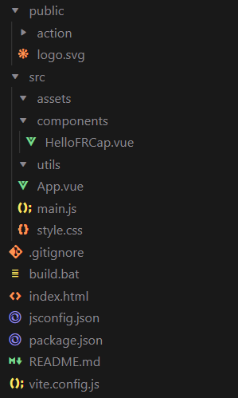

Development guidance
=========================

.. toctree:: 
   :maxdepth: 6

Development environment and conditions
-------------------------------------------

The development environment must meet the following minimum configuration:

- CPU:1.6 GHz or faster processor;
- RAM:>=1 GB(more than 2 GB recommended);
- ROM:>=128GB;
- OS:Requires Windows 10 or higher, macOS 10.1 5 or higher, Linux (x64) system (Ubuntu, Debian, etc.).

We have encapsulated some interfaces and modules, but if you want to achieve a better development effect, it is recommended to have a certain understanding of web development, and it is best to be familiar with the following technologies:

- HTML，JavaScript/TypeScript，CSS;
- Vue3;
- Vite;
- Node.js.

Development tools
--------------------------
We recommend using the latest Visual Studio Code (VSCode) software for development. To download, please visit the VSCode official download page and select the corresponding system to download.

At the same time, the Node.js runtime environment needs to be installed on the local computer. When installing Node.js, tools such as npm will be installed to facilitate package management. Visit the Node.js official download page and select the corresponding system version v20 to download.

When developing in VSCode, you may also use the following VSCode plug-ins, which can be installed and configured as needed .

- Vue;
- ESlint;
- npm Intellisense;
- Vue Language Features (Volar);
- TypeScript Vue Plugin (Volar)或者Vue.volar;
- Tailwind CSS IntelliSense.

FRCap project structure
---------------------------

FRCap project file structure:

.. centered:: Figure 5-1  FRCap project structure

- Public:

In the public resource folder, the internal files will not be built during the build process, but will be copied directly to the build directory.

The action folder and logo.svg are included by default .

The Action folder is used to store custom command background interface logic files.

Logo.svg is the plug-in icon.

- Src:

Assets folder is mainly used to place static resources.

The Components folder is mainly used to place components.

The Utils folder is mainly used to place utility classes.

App.vue home page code.

Main.js is mainly responsible for global resource introduction.

Vue framework creation, etc.

Style.css project basic style file.

- Build.bat:Windows platform build script.
- Index.html:The main frame of the page UI.
- Package.json:package description file and compilation strategy, etc.
- Vite.config.js:Vite configuration file.

Front-end frcap-ui and frcap-api use
------------------------------------------

Frcap-ui provides some HTML controls that have been encapsulated through Vue components, which can be imported into projects for use, reducing the difficulty of page UI development and the amount of code, and improving code readability. Of course, you can also choose some excellent open source UI component libraries, such as Element plus, etc.

First open the terminal in your project path and install frcap-ui.

.. code-block:: c++
   :linenos:

   npm install frcap-ui -s

After successful installation, introduce it into the components that need to use frcap-ui , taking the button control as an example.

.. code-block:: javascript
   :linenos:

   import { AppButton } from 'frcap-ui'

Then use it in the <template> element of the component.

.. code-block:: c++
   :linenos:

   <AppButton button-text="Start" button-type="primary"></AppButton>

Preview the development project results in the browser.

.. centered:: Figure 5-2  AppButton效果

Currently we provide 4 common control components.

- AppButton:Button component.
  
  - buttonType: button type, String, corresponding to different button styles, the default is primary.
  
    - primary:blue;
    - secondery:gray;
    - safety:green;
    - warning:yellow;
    - serious:red.
  
  - buttonText:Button text, String, default value is "primary".

- AppInput:Input component.
  
  - Type:required item, String, default value text. Indicates the type of input box.
  
    - Number:number input box;
    - Text:text input box.
  
  - inputLabel:required item, String, input box label text.
  - inputUnit:String, input box unit text.
  - hasUnit:Boolean, default false, indicates whether unit text is required.
  - isEmptyErr:Boolean, whether the input box is empty.
  - isReadonly:Boolean, whether the input box is read-only.

- AppSelect:Selection box component.
  
  - selectionLabel:required item, String, selection box label text.
  - optionsData:required items, Array, option data.

- Modal:modal window component.
  
  - show:Boolean, whether to pop up the modal window.
  - title:String, modal window title.

In order to facilitate the development of custom instructions that may be created in FRCap , we have built Http requests and APIs into the initial FRCap project downloaded in the "Creation Wizard". In this way, both custom instructions and default provided instructions can be placed in the api.js file in frcap-api . The specific path of api.js is "./src/api/api.js".

The use of F rcap-api is similar to frcap-ui , as follows:

1. api in files that need to use api , such as components .

.. code-block:: javascript
   :linenos:

   import api from '@/api/api';

2. Call the default instructions provided in the interface.

.. code-block:: c++
   :linenos:

   api.getRobotStatus()

3. Write processing logic in the returned promise.

.. code-block:: c++
   :linenos:

    api. getRobotStatus ()
    .then((res) => {
    console.log(res.data);
    })
    .catch((err) => {
        console.error(err);
    });

Backend custom instruction development
-----------------------------------------

Database operation example
+++++++++++++++++++++++++++++

1. Introduce database module

.. code-block:: javascript
   :linenos:

    var node = "/usr/local/etc/node/sys"
    var Sqlite3_Action = require(node + '/better-sqlite3/better-sqlite3.js');
    var sqlite = new Sqlite3_Action();

2. Get the content in the point database
   
.. code-block:: javascript
   :linenos:

    // Match cmd
    case 'get_points':
    // Write the sql statement in ascending order of numbers + ascending order starting with the first letter + ascending order starting with Chinese, and feed the data back to the front-end page for display
    var sql = "select * from points order by name ASC"; 
    var sql_data = sqlite.queryall(DB_POINTS, sql); 
    // json data formatting
    for (var i = 0; i < sql_data.length; i++) {
        response_data[sql_data[i].name] = sql_data[i];
    }
    //json data is fed back to the front end
    event_socket.emit('response', res, response_status, response_data);
    break;  

Socket communication operation example
++++++++++++++++++++++++++++++++++++++++

- Introduce socket communication module
   
.. code-block:: javascript
   :linenos:

    var node = "/usr/local/etc/node/sys"
    var Socket_Cmd = require(node + '/socket/socket_cmd');
    var socket_cmd = new Socket_Cmd();

- Issue instructions to set system variables
  
.. code-block:: javascript
   :linenos:

   // Match cmd
    case 511:
   //Get the content of sent data
    content = data_json.content;
   //Get the length of sent data
    len = data_json.content.length;
    //Group sends data
    send_content = '/f/bIII1III511III' + len + 'III' + content + 'III/b/f'
    //socket send
    socket_cmd.send(send_content);
    //socket recv
    socket_cmd.recv().then((recv_data)=>{
        response_data = recv_data;
    event_socket.emit('response', res, response_status, response_data);
    }).catch((err)=>{
        console.log(err);
    })
    break;