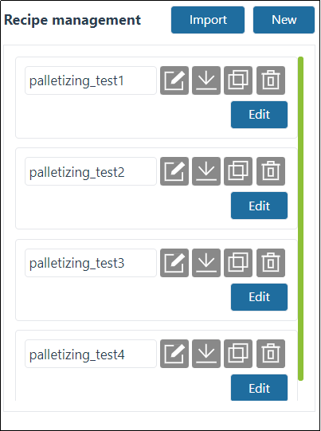
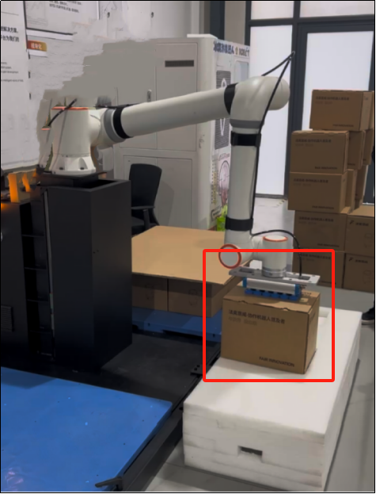
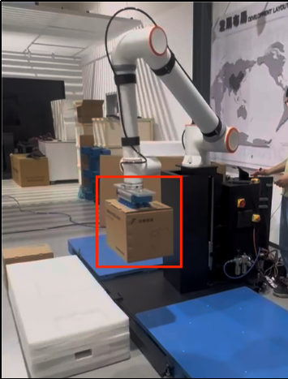
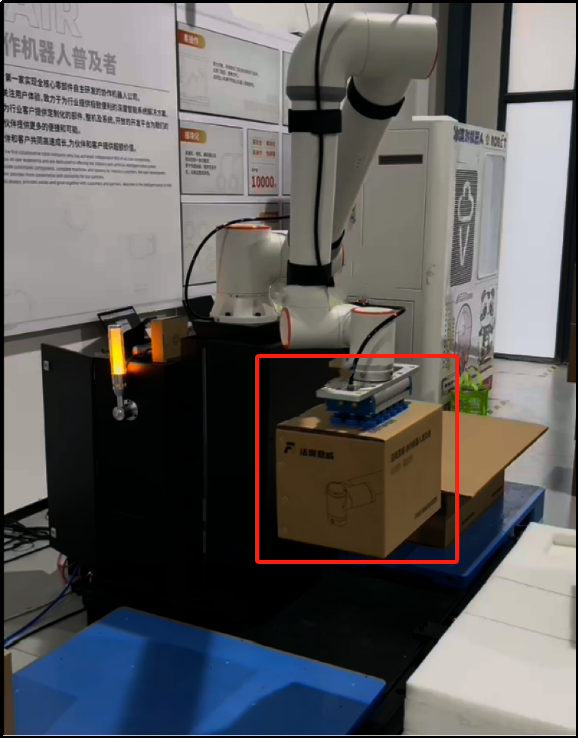
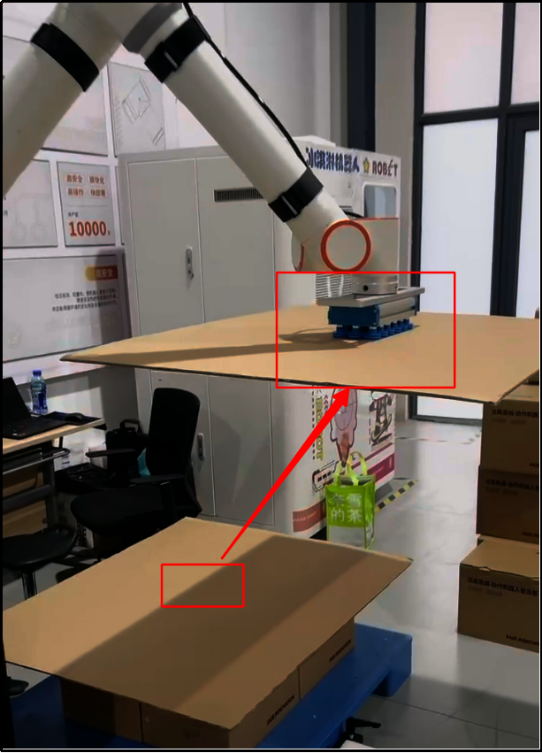
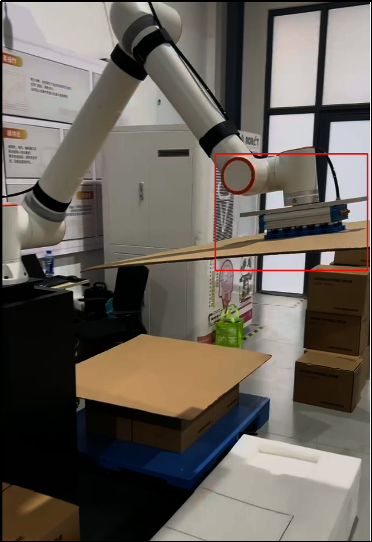
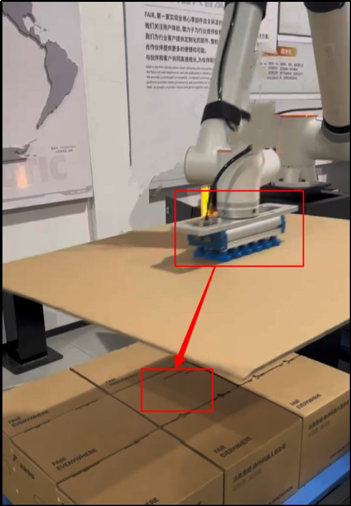
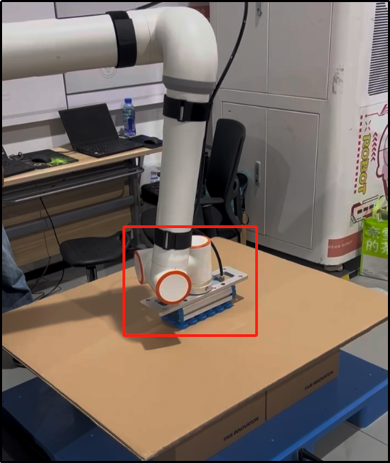
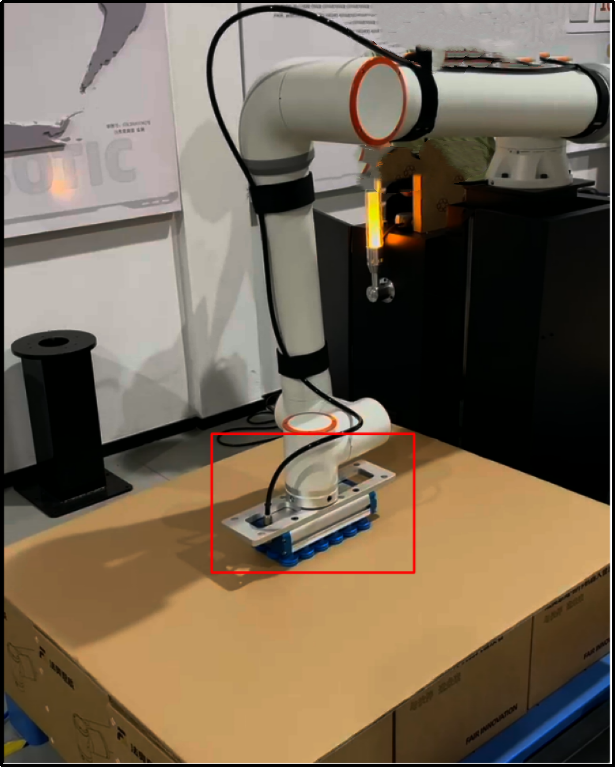

Palletizing FRCap
=======================

.. toctree:: 
   :maxdepth: 6

Palletizing FRCap plug-in package management
----------------------------------------------

In the collaborative robot WebApp, "System Settings - FRCap Config." page，click the "Import" button and select the palletizing FRCap plug-in package (name format: plug-in package name + version number. frcap, example: palletizer Palletizer-v0.0.0.frcap) to upload. After the upload is successful, the list displays the successfully imported palletized FRCap plug-in package, including Status, Name, Version, Description and Author, etc. The palletizing FRCap plug-in package can be "Deactivate", "Enabled" and "Delete" in the operation bar.

.. image:: frcap_pictures/0013.png
   :width: 6in
   :align: center

.. centered:: Figure 10-1-1 WebApp plug-in configuration interface

After successfully importing the palletizing FRCap plug-in package for the first time, the status of the plug-in package is "Disabled". Click the "Enable" button. After successful activation, the "Auxiliary Application" module of the collaborative robot WebApp adds the palletizing FRCap plug-in package start page ( For example: the page module name corresponding to Palletizer-v0.0.0.frcap is "Palletizer"). Click the "Start" button to enter the homepage, view the currently configured palletizing formula, and use it according to your needs.

.. note:: 
    If the recipe is empty, please add/import the recipe first.

.. image:: frcap_pictures/0014.png
   :width: 6in
   :align: center

.. centered:: Figure 10-1-2 WebApp+ palletizing FRCap display diagram

.. image:: frcap_pictures/0015.png
   :width: 6in
   :align: center

.. centered:: Figure 10-1-3 Palletizing FRCap Home Page

Recipe management
----------------------------------------------

Each recipe is divided into three major areas: recipe name, recipe operation and recipe editing. The operation area buttons are: Rename, Export, Copy and Delete.

.. image:: frcap_pictures/0016.png
   :width: 3in
   :align: center

.. centered:: Figure 10-2-1 Recipe area division

Obtain
+++++++++++++++++++++

After entering the homepage of the palletizing plug-in package, you can obtain all current recipes. When the number of recipes is greater than four, a scroll bar appears in the recipe display area, and the user can scroll up and down to view the recipes.

.. note:: 
    All recipe names start with "palletizing", for example "palletizing_test1".

.. centered:: Figure 10-2-2 Recipe acquisition

New
+++++++++++++++++++++

In the operation area of any formula, click the "Add" button to enter the "New Formula" pop-up window, enter the name of the palletizing formula, and click the "Confirm" button. After the addition is successful, the new palletizing formula will be added to the formula display area.

.. note:: 
    All recipe names start with "palletizing". There is no need to enter "palletizing". You only need to enter the name after "_". For example, "palletizing_add", enter "add".

.. image:: frcap_pictures/0018.png
   :width: 6in
   :align: center

.. image:: frcap_pictures/0019.png
   :width: 6in
   :align: center

.. centered:: Figure 10-2-3 New recipe added

Rename
+++++++++++++++++++++
In the operation area of any formula, click the "Rename" icon to enter the "Palletizing Recipe Rename" pop-up window, enter the name of the palletizing formula, and click the "Confirm" button. After the renaming is successful, the original palletizing recipe name in the recipe display area is renamed.

.. note:: 
    All recipe names start with "palletizing". There is no need to enter "palletizing". The modal window will automatically bring out the name after "_". For example, "palletizing_rename" will automatically bring out "rename".

.. image:: frcap_pictures/0020.png
   :width: 6in
   :align: center

.. centered:: Figure 10-2-4 Recipe rename

Export
+++++++++++++++++++++

In the operation area of any recipe, click the "Export" icon to download all data of the current recipe.

.. image:: frcap_pictures/0021.png
   :width: 6in
   :align: center

.. centered:: Figure 10-2-5 Recipe export

Copy
+++++++++++++++++++++

In the operation area of any formula, click the "Copy" icon to enter the "Palletizing Formula Copy" pop-up window, enter the name of the palletizing formula, and click the "Confirm" button. After the copy is successful, the copied palletizing formula will be added to the formula display area.

.. note:: 
    All recipe names start with "palletizing". There is no need to enter "palletizing". The modal window will automatically bring out the names after "_". For example, "palletizing_copy" will automatically bring out "copy".

.. image:: frcap_pictures/0022.png
   :width: 6in
   :align: center

.. centered:: Figure 10-2-6 Recipe copy

Delete
+++++++++++++++++++++

In the operation area of any recipe, click the "Delete" icon to delete the current recipe.

.. image:: frcap_pictures/0023.png
   :width: 6in
   :align: center

.. image:: frcap_pictures/0024.png
   :width: 6in
   :align: center

.. centered:: Figure 10-2-7 Recipe delete

Edit
+++++++++++++++++++++

For any recipe, click the "Edit" button to enter the configuration interface of the current recipe.

.. image:: frcap_pictures/0025.png
   :width: 6in
   :align: center

.. centered:: Figure 10-2-8 Palletizing recipe editor

Import
+++++++++++++++++++++

Click the "Import" button, select the compressed package of the palletizing formula and upload it. After the import is successful, the imported formula will be added to the palletizing formula.

.. note:: 
    All recipe compressed package names start with "palletizing" and end with ".tar.gz", such as "palletizing_import.tar.gz".

.. image:: frcap_pictures/0026.png
   :width: 6in
   :align: center

.. centered:: Figure 10-2-9 Recipe import

.. important:: 
    When "adding", "renaming" and "copying" a palletizing formula, entering an existing formula name will prompt "There is already a formula with the same name".

.. image:: frcap_pictures/0027.png
   :width: 6in
   :align: center

.. centered:: Figure 10-2-10 Tips for recipes with the same name

Recipe configuration
----------------------------------------------

The configuration interface of any recipe displays the basic information of boxes, pallets, partitions, modes and advanced configurations, and configure specific parameters in the corresponding configuration column.

.. image:: frcap_pictures/0028.png
   :width: 6in
   :align: center

.. centered:: Figure 10-3-1 Palletizing recipe editing interface

Parameter configuration
++++++++++++++++++++++++++++++++++++++++++

Box configuration
~~~~~~~~~~~~~~~~~~

Click "Config" in the box configuration column to enter the "Box Configuration" pop-up window, set the "length", "width" and "height" of the box, click the "Confirm" button to complete the box information configuration; set the grab point of the box (keep The grabbing point is at the center of the box, and the bottom of the suction cup is in a squeezing state when it contacts the box), click the "Record" button to complete the setting.

.. image:: frcap_pictures/0029.png
   :width: 6in
   :align: center

.. centered:: Figure 10-3-2 Box configuration

.. centered:: Figure 10-3-3 Box grab point

.. important:: 
    The box grab point must be recorded, otherwise the length, width and height of the box cannot be configured.

Pallet configuration
~~~~~~~~~~~~~~~~~~~~~~~~~~~~~~~~~~~~

Click "Config" in the pallet configuration column to enter the "Pallet Configuration" pop-up window, set the "front", "side" and "height" of the pallet, then set the workstation transition point, and click "Confirm Configuration" to complete the pallet information setting.

.. image:: frcap_pictures/0031.png
   :width: 6in
   :align: center

.. centered:: Figure 10-3-4 Pallet configuration

.. centered:: Figure 10-3-5 Left station transition point

.. centered:: Figure 10-3-6 Right station transition point

.. important:: 
    Station transition points must be recorded, otherwise the program that cannot be generated cannot be saved.

Partition configuration
~~~~~~~~~~~~~~~~~~~~~~~~~~~~~~~~~~~~

Click "Configuration" in the partition configuration column to enter the "Partition Configuration" pop-up window, set the partition size "length", "width" and "height" and select the start and stop of the partition.

.. image:: frcap_pictures/0034.png
   :width: 6in
   :align: center

.. centered:: Figure 10-3-7 Partition configuration

Then set the transition points of the partitions. There are three transition points for the partitions. The purpose of setting them is to roughly plan a movement path after grabbing the partitions to avoid collisions and being unable to complete the action of placing the partitions.

.. note:: 
    Transition point 1 starts to move a certain distance from the box grab point and then teaches; transition point 2 starts to move a certain distance from transition point 1 and starts teaching, and can also become a transition intermediate point; transition point 3 starts to move from transition point 2 A distance is the last point before the partition is placed.

.. centered:: Figure 10-3-8 Partition transition point 1 (take the right station as an example)

.. centered:: Figure 10-3-9 Partition transition point 2 (take the right station as an example)

.. centered:: Figure 10-3-10 Partition transition point 3 (take the right station as an example)

Then set the grab point (keep the grab point at the center of the partition, and the bottom of the suction cup will be in a squeeze state when it contacts the partition) and placement point, and click "Confirm" to complete the partition information setting.

.. centered:: Figure 10-3-11 Partition grab point (take the right station as an example)

.. centered:: Figure 10-3-12 Partition placement point (take the right workstation as an example)

Mode configuration
++++++++++++++++++++++++++++++++++++++++++

Click "Configuration" in the mode configuration column to enter the "Mode Configuration" pop-up window. It is mainly divided into four areas: mode selection, box operation, palletizing scene simulation and palletizing layers.

.. image:: frcap_pictures/0040.png
   :width: 6in
   :align: center

.. centered:: Figure 10-3-13 Mode configuration

.. important:: 
    When adding boxes, the background color of the workpiece turns red when there is a collision between boxes, and the above operation cannot be performed at this time. If necessary, please adjust the box to be collision-free.

Select the mode, add boxes in this mode, and set the box interval first. You can add them individually or in batches. Then set the number of palletizing layers and the mode of each layer, and click "Confirm" to complete the mode information setting.

Select the reference mode (the selected mode cannot be selected), compare and see whether the current mode configuration can be palletized based on the reference mode, so that customers can intuitively check the box stacking types in different modes.

.. note:: 
    Currently only two modes, A and B, are supported.

.. important:: 
    Palletizing direction: Taking the right pallet as an example, the lower right corner is the farthest point. Place a row of workpieces vertically or horizontally from the lower right corner, then place workpieces horizontally or vertically in the upper row, and so on (Web page The palletizing direction has been marked, please check carefully). The left pallet places workpieces mirroring the right pallet mode.

Advanced configuration
+++++++++++++++++++++++++++++++++++++++

Click "Config" in the advanced configuration column to enter the "Advanced Configuration" pop-up window. The configuration items are as follows:

1) Dimensions of palletizing equipment: Dimensions of palletizing workbench.

.. important:: 
    X, Y, and Z are the absolute values of the upper right corner of the pallet or the upper left corner of the right pallet relative to the coordinates of the robot's base coordinate system. Angle is the rotation angle of the robot during installation. It is recommended to be 0 during installation.
    
2) Lifting height for picking up materials: User-defined lifting height after successfully picking up materials from the grabbing point.

3) Waiting time for picking up materials: The user can customize the waiting time for monitoring the negative pressure arrival signal after picking up materials, and repeat the picking up action when it is not in place.

4) First/second offset distance: User-defined offset distance for tilting the robot to the target point. (Note: The first offset parameter Z must be greater than the height of the box, otherwise it will collide with the already placed boxes during the stacking process).

5) Lifting axis: Users can customize the start and stop of the lifting axis, communication parameters (IP address, port number and communication cycle) and the floor number to start lifting. At the same time, you can click the "Configure" button in the lifting axis configuration column to enter the "Lifting Axis Configuration" pop-up window, and test the accuracy of loading communication, rising and falling of the lifting axis to avoid problems of inoperability and large errors when used directly.

.. note:: 
    When the lifting shaft is working, the height it lifts each time is the height of the box.

.. image:: frcap_pictures/0041.png
   :width: 6in
   :align: center

.. centered:: Figure 10-3-14 Advanced configuration

.. image:: frcap_pictures/0042.png
   :width: 6in
   :align: center

.. centered:: Figure 10-3-15 Lifting shaft configuration

Procedural generation
--------------------------------------------

Check "Program Generation" below the recipe display, enter the program name, select the recipe according to the recipe and requirements. The left and right recipes can be the same or different, and click the "Generate" button.

.. note:: 
    All program names start with "palletizing". There is no need to enter "palletizing". You only need to enter the name after "_". For example, for "palletizing_program", enter "program".

.. important:: 
    1) If the palletizing formula is not selected for the left or right station, it means that the station is not enabled.
    2) After successfully generating the program, be sure to manually save all subprograms and main programs in program teaching.
    3) The depalletizing program starts with "de", for example, the palletizing program is "palletizing_program" and the depalletizing program is "depalletizing_program".

.. image:: frcap_pictures/0043.png
   :width: 6in
   :align: center

.. centered:: Figure 10-4-1 Procedural generation

Palletizing status page start and stop
--------------------------------------------

Enable this function in the "Status Page" column, enter the palletizing work status page, and view "Production Information", "Alarm Information" and "Palletizing Program".

.. image:: frcap_pictures/0044.png
   :width: 6in
   :align: center

.. centered:: Figure 10-5-1 Palletizing status page
