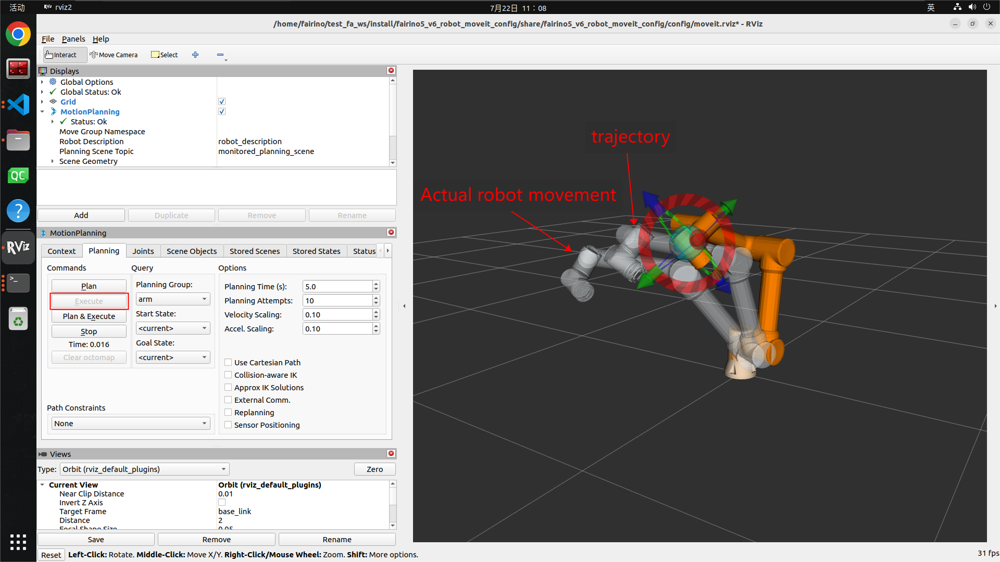
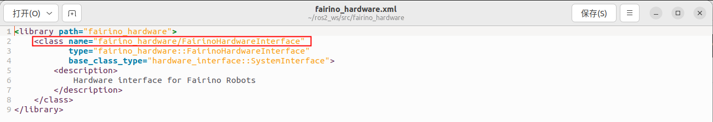
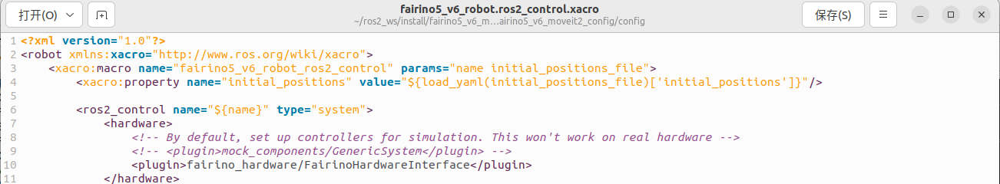

Plug-in Introduction
++++++++++++++++++++++++++++++++++++++++++++++++++++++++++++
Fairino MoveIt2 plug-in is a plug-in that provides support for motion control and path planning of Fairino robots. With the help of Fairino MoveIt2 plug-in can realize complex robot motion control, path planning, inverse kinematics solving and real-time collision detection, etc. It is suitable for a variety of robotic arm application scenarios, such as industrial, welding, manufacturing, automated loading and unloading, palletizing, medical and other scenarios.

Rapid Access
++++++++++++++++++++++++++++++++++++++++++++++++++++++++++++
This chapter describes how to configure the APP running environment.

It is recommended to use it on Ubuntu22.04LTS (Jammy). After the system is installed, you can install ROS2. It is recommended to use ros2-humble. For the installation of ROS2, please refer to the tutorial: https://docs.ros.org/en/humble/index.html.

MoveIt2 Installation
------------------------------------------------------------
Clone Fairino MoveIt2 Plugin
""""""""""""""""""""""""""""""""""
Clone the Fairino MoveIt2 plugin locally, and then cd to the target directory, where the main files include fairino_msgs Fairino robot data transfer data type function package; fairino_hardware Fairino robot fairino_hardware plugin function package; 

fairino_robot/ fairino_description Fairino robot appearance and urdf file function package; fairino_robot/fairino3mt_v6_moveit2_config, fairino_robot/fairino3_v6_moveit2_config, fairino_robot/fairino5_v6_moveit2_config, fairino_robot/fairino10_v6_moveit2_config, fairino_robot/fairino16_v6_moveit2_config, fairino_robot /fairino20_v6_moveit2_config, fairino_robot/fairino30_v6_moveit2_config Fairino Robotics moveit2 Configuration Package, fairino_robot/fairino_mtc_demo Fairino mtc Sample Code Package.

.. image:: img/fairino_harware_002.png
    :width: 6in
    :align: center

Compile Feature Packs
""""""""""""""""""""""""""""""""""
Compile the fairino_msgs function package.

.. code-block:: shell
    :linenos:

    cd ros2_ws
    colcon build --packages-select fairino_msgs
    source install/setup.bash

Compile the fairino_hardware function package.

.. code-block:: shell
    :linenos:

    cd ros2_ws
    colcon build --packages-select fairino_hardware
    source install/setup.bash

Compile the fairino_description function package.

.. code-block:: shell
    :linenos:

    cd ros2_ws
    colcon build --packages-select fairino_description
    source install/setup.bash

Compile the Fairino robot moveit2 configuration package, using fairino5_v6_moveit2_config as an example.

.. code-block:: shell
    :linenos:

    cd ros2_ws
    colcon build --packages-select fairino5_v6_moveit2_config
    source install/setup.bash

Compile Fairino Robotics fairino_mtc_demo sample code package, if the code sample package does not appear in the official ros2_ws workspace, you can contact the after-sales service to get it.

.. code-block:: shell
    :linenos:

    cd ros2_ws
    colcon build --packages-select fairino_mtc_demo
    source install/setup.bash

Configuring the Moveit2 model of the Fairino robotic arm
------------------------------------------------------------
If you do not want to use the official robot moveit2_config package, you can customize the robot moveit2_config package by configuring it with moveit_setup_assistant.

Creating A Workspace
""""""""""""""""""""""""""""""""""
Create the workspace and create the feature pack.

.. code-block:: shell
    :linenos:

    mkdir -p test_fa_ws/src
    cd test_fa_w/src
    mkdir fairino5_v6_robot_moveit_config
    cd ..
    cd ..

Compile the functional package and source.

.. code-block:: shell
    :linenos:

    colcon build
    source install/setup.bash

Start moveit_setup_assistant for robot configuration.

.. code-block:: shell
    :linenos:

    ros2 launch moveit_setup_assistant setup_assistant.launch.py

Configuration Robot
""""""""""""""""""""""""""""""""""
Launching the configuration interface
^^^^^^^^^^^^^^^^^^^^^^^^^^^^^^^^^^^^^^^^
Open the terminal in the test_fa_ws directory and select “Create New Moveit Configuration Package” in the configuration interface to create a new moveit configuration package.

Then select the description file of the robot, that is, the .urdf file, and then select Load Files, load the robot model, you can see the right side of the robot model loaded out.

Configuring Self-Collisions
^^^^^^^^^^^^^^^^^^^^^^^^^^^^^^^^^^^^^^^^
Self-Collisions for the robot collision settings, click Generate Collision Matrix can automatically generate the joints collision matrix, which will cancel the collision between the two contacting connecting rods and the connecting rods that can never be contacted, so as to configure the robot joints collision matrix, thus avoiding the calculation of the collision between the two contacting surfaces, click Generate Collision Matrix is automatically generated by clicking Generate.

.. image:: img/fairino_harware_005.png
    :width: 6in
    :align: center

Configuring Virtual Joints
^^^^^^^^^^^^^^^^^^^^^^^^^^^^^^^^^^^^^^^^
Virtual Joints is the virtual axes of the robot, when the robot is installed on the mobile platform, it is necessary to set the virtual axes for the robot, set the name of the virtual axes, the sub-links, the type of joints, etc.

when the mobile platform moves, the virtual axes will also synchronize with the movement of the robot to drive the robot to move, so as to realize the robot with the movement of the mobile platform function this time the robot will be placed directly on the world coordinate system, named virtual_joints.

Configuring Planning Groups
^^^^^^^^^^^^^^^^^^^^^^^^^^^^^^^^^^^^^^^^
Planning Groups is the planning group of the robot, which will be the joints that need to be considered in the same kinematic calculation in the same planning group for unified forward and reverse kinematic calculations, such as placing a robot on an AGV cart, and then installing a fixture at the end of the robot, the test will be the four joints of the AGV cart in a planning group, the six joints of the robot in a planning group, and one of the joints of the fixture in a planning group for kinematics calculations.

One joint of the fixture is in one planning group for kinematic calculation. Since this does not involve the fixture so only add the robot's joints group, that is, the arm group, first of all add the arm group, the dynamics solver Kinematic Solver select kdl_kinematics_plugin/KDLKinematicsPlugin, and then the default planner Group Default Planner select TRRT, then click Add Joints to add joints for this planning group.

.. image:: img/fairino_harware_007.png
    :width: 6in
    :align: center

arm's joints hold shift to make multiple selections, click '>' to add, then click save to save.

.. image:: img/fairino_harware_008.png
    :width: 6in
    :align: center

The defined planning group is shown below.

.. image:: img/fairino_harware_009.png
    :width: 6in
    :align: center

Configuring Robot Poses
^^^^^^^^^^^^^^^^^^^^^^^^^^^^^^^^^^^^^^^^
Robot Poses is the robot preset poses, which defines some preset poses for each planning group, and a home pose for arm, which can be chosen at will.

Robot Poses can define preset poses for each planning group. When there are fixtures in the robot, you can add a fixture planning group in the Planning Groups section, and then set the preset poses for the fixtures when setting poses in Robot Poses.

Configuring End Effectors
^^^^^^^^^^^^^^^^^^^^^^^^^^^^^^^^^^^^^^^^
End Effectors is the robot end actuator, the planning group of end actuator is hand, and then the default connected parent_link is panda_link8, since there is no end actuator this time, so this step can be skipped.

ros2_control URDF Modifications
^^^^^^^^^^^^^^^^^^^^^^^^^^^^^^^^^^^^^^^^
ros2_control URDF Modifications is mainly used to set the joint data type of sending and feedback, you can choose the position, speed, torque three kinds of joint data type of sending and feedback are position control, and then directly Add interfaces to be able to.

.. important:: 

   - Note: 

    Selecting the joint data type needs to match the subsequent fairino_hardware plug-in, and select the joint data type for sending down and feedback according to the data transmitted by the fairino_hardware plug-in. Since the fairino_hardware plug-in controlling the motion of the actual robot this time uses the position data type, this time the Because the fairino_hardware plug-in that controls the motion of the actual robot uses the position data type, this time the joint data type chosen for sending and feedback are both position control.
   

ROS 2 Controllers
^^^^^^^^^^^^^^^^^^^^^^^^^^^^^^^^^^^^^^^^
ROS 2 Controllers is mainly used to generate the ros2_controllers.yaml file, which sets the release frequency, joint name, controller name, controller type, etc.

Configure ROS 2 Controllers, configure controllers for each planning group, click Auto Add JointTrajectoryController Controllers For Each Planning Group.

.. image:: img/fairino_harware_012.png
    :width: 6in
    :align: center

Moveit Controllers
^^^^^^^^^^^^^^^^^^^^^^^^^^^^^^^^^^^^^^^^
Moveit Controllers is mainly used to generate the moveit_controllers file, which sets the controller name, controller type, etc. It should be noted that the controller name in moveit_controllers needs to be the same as that of ros2_controllers, or it will not run smoothly. It should be noted that the controller name in moveit_controllers should be the same as the controller name in ros2_controllers, otherwise it will not run smoothly.

When the controller name in moveit_controllers is the same as the controller name in ros2_controllers, the controller type in moveit_controllers will be automatically mapped to the controller type in ros2_controllers, realizing that the control data sent down through the moveit_controllers is sent to ros2_controllers, and then the actual robot motion is driven by the plug-in in ros2_controllers.

.. image:: img/fairino_harware_013.png
    :width: 6in
    :align: center

Launch Files
^^^^^^^^^^^^^^^^^^^^^^^^^^^^^^^^^^^^^^^^
Configure Launch Files, just use the default configuration.

.. image:: img/fairino_harware_014.png
    :width: 6in
    :align: center

Author Information
^^^^^^^^^^^^^^^^^^^^^^^^^^^^^^^^^^^^^^^^

Generate Launch File
^^^^^^^^^^^^^^^^^^^^^^^^^^^^^^^^^^^^^^^^
Generate the Launch file, select the location, this time in the test_fa_ws/src file path to create a folder fairino5_v6_robot_moveit_config used to store the configuration file, and then select the Generate.

.. image:: img/fairino_harware_016.png
    :width: 6in
    :align: center

As this has been configured once before, if the initial configuration Check files you want to be generated part of the contents of the black, indicating that you can generate Launch files.

Launch
""""""""""""""""""""""""""""""""""
After the configuration is complete, you can compile the functionality packages, you can use the custom robot moveit2 configuration package to replace the Fao robot moveit2 configuration package, to achieve plug-in compatibility for the use of user-defined robots.

.. code-block:: shell
    :linenos:

    colcon build --packages-select fairino5_v6_robot_moveit_config
    source install/setup.bash

Then just run the Launch file you just configured.

.. code-block:: shell
    :linenos:

    ros2 launch fairino5_v6_robot_moveit_config demo.launch.py

After that you can see the rviz2 interface with the configuration completed.

Moveit2 Usage
""""""""""""""""""""""""""""""""""
After opening the configured package, you can set the robot target position by dragging and dropping the blue sphere at the end of the robot in the 3D interface on the right side, and then change the robot end attitude by using the red, green, and blue rings at the end of the robot.

Click on the Plan button on the left to plan the robot trajectory.

.. image:: img/fairino_harware_019.png
    :width: 6in
    :align: center

Click the Execute button on the left to drive the robot to the target position according to the planned trajectory.

Plan&Execute buttons are used to automatically control the robot's motion after planning a trajectory.

Then click on the Joints tab to change the robot's target position by changing the angles of the joints, and then use the Plan, Execute, Plan&Execute buttons to drive the robot.

Fairino_hardware Plugin (custom robot moveit configuration package)
------------------------------------------------------------------------------------------
Fairino_hardware plugin for the connection between moveit and the robot's intermediate layer, through the fairino_hardware plugin move_group will be sent to moveit_control, and then forwarded to ros2_control, ros2_control and then through the fairino_hardware plugin to drive the actual robot movement, and fairino_hardware plugin will also accept the actual robot feedback data, so as to realize the rviz2 simulation interface robot model and the actual robot synchronization.

Hardware plug-in drives the actual robot motion, and fairino_hardware plug-in also accepts the feedback data from the actual robot, thus realizing the synchronization between the robot model of the rviz2 simulation interface and the actual robot, and thus realizing the function of the user driving the actual robot motion through the rviz2 interface.

And thanks to the implementation of the fairino_hardware plug-in, the Fairino robot can access the ros2_control control framework, making the Fairino robot compatible with third-party packages based on ros2_control.

Fairino_hardware Plugin Compilation
""""""""""""""""""""""""""""""""""""""""""""""""""""""""""""""""""""
Compile the fairino_hardware plugin package in the official ros2_ws package, compile the fairino_hardware plugin package through the previous section, then you will see the .so file libfairino_hardware.so generated by the plugin under “ros2_ws/install/fairino_hardware/lib/”, which means the plugin is compiled successfully.

Then you will see the .so file libfairino_hardware.so generated by the plug-in under “ros2_ws/install/fairino_hardware/lib/”, which indicates that the plug-in has been compiled.

It should be noted that you need to make the naming of each joint of the robot by the fairino_hardware plug-in the same as the naming of each joint of the robot configured by moveit2.

The naming of the six joints of the robot by this fairino_hardware plug-in from the base coordinate position to the end of the robot are j1, j2, j3, j4, j5 and j6 respectively, so you need to name the joints of the robot as j1, j2, j3, j4, j5 and j6 when the robot is configured by moveit2. moveit2 configuration of the robot need to robot joints named j1, j2, j3, j4, j5, j6.

Fairino_hardware Plugin Usage
""""""""""""""""""""""""""""""""""""""""""""""""""""""""""""""""""""
Compile the fairino_hardware plugin package in the official ros2_ws package, compile the fairino_hardware plugin package through the previous section, then you will see the .so file libfairino_hardware.so generated by the plugin under “ros2_ws/install/fairino_hardware/lib/”, which means the plugin is compiled successfully.

Then you will see the .so file libfairino_hardware.so generated by the plug-in under “ros2_ws/install/fairino_hardware/lib/”, which indicates that the plug-in has been compiled successfully.

where “fairino_hardware/FairinoHardwareInterface” is the name of the plug-in for the hardware settings, which can be found in the “fairino_hardware.xml” file in the “ros2_ws/src /fairino_hardware” directory of the ‘fairino_hardware.xml’ file to see.

Running Plug-ins
""""""""""""""""""""""""""""""""""
Open the terminal, then go to the ros2_ws workspace and source workspace, the purpose is to add the fairino_hardware plugin, you can also load the path to the “~/.bashrc” file, but it is not recommended.

.. code-block:: shell
    :linenos:

    cd ros2_ws
    source install/setup.bash

Then go back to the home directory and go to the test_fa_ws workspace and the source workspace and run the demo.launch.py file.

.. code-block:: shell
    :linenos:

    cd ..
    cd test_fa_ws
    source install/setup.bash
    ros2 launch fairino5_v6_robot_moveit_config demo.launch.py

Running Result
""""""""""""""""""""""""""""""""""
After the demo.launch.py file is launched, the rviz2 interface is shown below.

Compile the fairino_hardware plugin package in the official ros2_ws package, compile the fairino_hardware plugin package through the previous section, then you will see the .so file libfairino_hardware.so generated by the plugin under “ros2_ws/install/fairino_hardware/lib/”, which means the plugin is compiled successfully.

Then you will see the .so file libfairino_hardware.so generated by the plug-in under “ros2_ws/install/fairino_hardware/lib/”, which indicates that the plug-in has been compiled successfully.

The actual robot position at this point is as follows.

.. image:: img/fairino_harware_025.png
    :width: 3in
    :align: center

At this point, you can drive the actual robot through the rviz2 interface, drag the blue sphere at the end of the robot in the rviz2 interface to move the end of the robot to the target position, then drag the red, green, and blue rings at the end of the robot to change the robot's end attitude, and then click on the left-hand side of the Planning&Execute button to carry out the motion trajectory planning and drive the robot motion.

You will find that the actual robot moves synchronously with the simulated robot on the rviz2 interface and stops at the target position.

The following figure shows the motion of the actual robot and the simulated robot through the rviz2 interface to the target position.

.. image:: img/fairino_harware_027.png
    :width: 3in
    :align: center

At this point it is possible to control the synchronized motion of the actual robot and the simulated robot on the rviz2 interface via moveit2.

Fairino_hardware Plugin (official robot moveit configuration package)
---------------------------------------------------------------------------------
In the ros2_ws directory, compile the functionality packages for your corresponding robot model, using the fairino5 robot as an example.

.. code-block:: shell
    :linenos:

    cd ros2_ws
    colcon build --packages-select fairino5_v6_moveit2_config
    source install/setup.bash

Then you need to add the fairino_hardware plugin to synchronize the movement with the actual robot, go to “ros2_ws/install/fairino5_v6_moveit2_config/share/fairino5_v6_moveit2_config/” directory.

Locate the fairino5_v6_robot.ros2_control.xacro file, replace "<plugin>mock_components/GenericSystem</plugin>" in line 9 of the file, with "<plugin>fairino_hardware/FairinoHardwareInterface</plugin>", save and exit.

where “fairino_hardware/FairinoHardwareInterface” is the name of the plug-in for the hardware settings, which can be found in the 'fairino_hardware.xml' file in the “/ros2_ws/src /fairino_hardware” directory of the 'fairino_hardware.xml' file to see the.

.. image:: img/fairino_harware_029.png
    :width: 6in
    :align: center

At this point to run the plugin you need to go to the ros2_ws workspace, then source the environment and run the demo.launch.py file.

.. code-block:: shell
    :linenos:

    cd ros2_ws
    source install/setup.bash
    ros2 launch fairino5_v6_moveit2_config demo.launch.py

MTC Sample Code Package
++++++++++++++++++++++++++++++

MTC Sample Code Package Introduction
---------------------------------------------------
The mtc sample code package provides a refactored rviz2 interface using the moveit2 and fairino_hardware plugins. The original MotionPlanning tab is replaced with the Motion Planning Tasks tab, which is used to display the various phases of the robot's motion.

Rviz2 interface can be accessed via the The rviz2 interface can be edited from the file “mtc.rviz” under the path “ros2_ws/install/fairino_mtc_demo/share/fairino_mtc_demo/launch”. "You can edit the 'mtc.rviz' file to customize the rviz2 interface to meet your functional requirements.

And mtc sample code package also provides a moveit2 and fairino_hardware plugin to drive the robot cycle to grab the target example, through the example you can understand how to make use of the form of code to better use the moveit2 and fairino_hardware plugin and the actual robot interaction, based on which you can make Customization to fit your needs.

MTC Sample Code Package Compilation
---------------------------------------------------

MTC Sample Code Package Cloning
""""""""""""""""""""""""""""""""""""""""""""""""""""""""""""""""""""
Clone the official mtc sample code package 'fairino_robot' into the src directory of the 'ros2_ws' workspace.

Robot Model Selection
""""""""""""""""""""""""""""""""""
Select the robot model in the mtc_demo_env.launch.py file in the 'ros2_ws/src/fairino_robot/fairino_mtc_demo_launch' directory of the official mtc sample code package. Select the robot model in the file, and modify lines 9, 10, and 11 of the file to match your robot.

You can refer to the function packs for each robot model in the “ros2_ws/src/fairino_robot/” directory for the robot model names.

.. image:: img/fairino_harware_031.png
    :width: 3in
    :align: center

MTC Sample Code Package Compilation
""""""""""""""""""""""""""""""""""""""""""""""""""""""""""""""""""""
Compiling the fairino_description function package
^^^^^^^^^^^^^^^^^^^^^^^^^^^^^^^^^^^^^^^^^^^^^^^^^^^^^^^^^^^^^^^^^^^^^^^^^^^^^^^^
Open a terminal, go to the ros2_ws directory, compile the fairino_description feature package, and then do a source.

.. code-block:: shell
    :linenos:

    cd ros2_ws
    colcon build --packages-select fairino_description
    source install/setup.bash

Compile robot function packs
^^^^^^^^^^^^^^^^^^^^^^^^^^^^^^^^^^^^^^^^^^^^^^^^^^^^^^^^^^^^^^^^^^^^^^^^^^^^^^^^
In the ros2_ws directory, compile the functionality packages for your corresponding robot model, using the fairino5 robot as an example.

.. code-block:: shell
    :linenos:

    colcon build --packages-select fairino5_v6_moveit2_config
    source install/setup.bash

Then add the fairino_hardware plugin to synchronize the movement with the actual robot, go to “ros2_ws/install/fairino5_v6_moveit2_config/share/fairino5_v6_moveit2_config/ config” directory, find fairino5_v6_moveit2_config.

Find fairino5_v6_robot.ros2_control.xacro, replace “<plugin>mock_components/GenericSystem</plugin>” with “<plugin>fairino_hardware/FairinoHardwareInterface</plugin>” in line 9 of the file, save and exit.

.. image:: img/fairino_harware_032.png
    :width: 6in
    :align: center

Compile fairino_mtc_demo function package
^^^^^^^^^^^^^^^^^^^^^^^^^^^^^^^^^^^^^^^^^^^^^^^^^^^^^^^^^^^^^^^^^^^^^^^^^^^^^^^^
Compile fairino_mtc_demo function package and source.

.. code-block:: shell
    :linenos:

    colcon build --packages-select fairino_mtc_demo
    source install/setup.bash

The MTC Sample Code Package Runs
---------------------------------------------------------------------------------
Rviz2 Interface
""""""""""""""""""""""""""""""""""""""""""""""""""""""""""""""""""""
Run the mtc_demo_env.launch.py file to open the customized rviz2 interface. The Motion Planning Tasks tab on the left side of the interface is used to display the customized processes for each motion of the robot.

.. code-block:: shell
    :linenos:

    cd ros2_ws
    source install/setup.bash
    ros2 launch fairino_mtc_demo mtc_demo_env.launch.py

.. image:: img/fairino_harware_034.png
    :width: 3in
    :align: center

Robot Motion
""""""""""""""""""""""""""""""""""""""""""""""""""""""""""""""""""""
Reopen a new terminal, go to the ros2_ws directory and source file and run the mtc_demo_app.launch.py file to execute the robot motion.

.. code-block:: shell
    :linenos:

    cd ros2_ws
    source install/setup.bash
    ros2 launch fairino_mtc_demo mtc_demo_app.launch.py

Then the Motion Planning Tasks tab in the rviz2 interface will show the robot's various motion processes, and the actual robot and the simulated robot in the rviz2 interface will be synchronized.

.. image:: img/fairino_harware_036.png
    :width: 3in
    :align: center

Caveat
++++++++++++++++++++++++++++++

Fairino_hardware Plugin Version Synchronization
---------------------------------------------------------------------------------
To use the fairino_hardware plug-in, the version of the fairino_hardware plug-in needs to be the same as the version of the Valeo robot. robot motion data sent by ros2_control is converted to a data type acceptable to Fairino robot.

So it is critical that the fairino_hardware plug-in's data type is consistent with the Fairino robot's data type, and the different versions of the plug-in and the robot may result in different data types, so before officially debugging the fairino_hardware plug-in, you need to confirm that the version of Fairino robot is consistent with the version of fairino_hardware plug-in and the version of the robot.

Before debugging the fairino_hardware plugin, you need to make sure that the version of the Fairino robot is the same as the version of the fairino_hardware plugin, and if it is not, you need to upgrade the Fairino robot.

- First of all, you can check the current version of the robot in the “WebAPP Interface->System Settings->About” interface of Fairino Robotics.

- Then you need to prepare the official robot software package, then enter the “WebAPP interface->Auxiliary applications->Robot body->System upgrade” interface of the Fairino Robot, and then click the “Select file” button to select the prepared software package corresponding to the version of the fairino_hardware plug-in, and then select “Upload package” and wait for the software upgrade to complete. Click the “Select File” button, select the robot software upgrade package corresponding to the version of the fairino_hardware plug-in, select “Upload Package”, and wait for the software upgrade to complete.

- After the upgrade is completed, the system will prompt the need to restart the robot, the robot control box switch to the off position, wait for about 25 seconds, and then start the robot, so the robot software version upgrade is complete, you can carry out the subsequent fairino_hardware plug-in compilation and use.

Problems Likely To Be Encountered
---------------------------------------------------
The robot model may not be loaded on the right side of the Configure Robot Feature Pack.
""""""""""""""""""""""""""""""""""""""""""""""""""""""""""""""""""""""""""""""""""""""""""""""""""""""""""""""""""""""""""""""""""""""""
Solution: This error may be due to the path in the .urdf file is not written correctly, can be solved by modifying the path in the .urdf file and copying the meshes file into the workspace under install/test_moveit/share/test_moveit.

After generating the package, there is an error running it.
""""""""""""""""""""""""""""""""""""""""""""""""""""""""""""""""""""""""""""""""""""""""""""""""""""""""""""""""""""""""""""""""""""""""
Solution: Removing line 203 in the launches.py file “default_value=moveit_config.move_group_capabilities["capabilities"],” in ["capabilities"] will fix it.

Summarize
++++++++++++++++++++++++++++++
This tutorial describes the installation, configuration and use of the MoveIt2 plug-in; the installation and use of the fairino_hardware plug-in to realize the synchronous motion of the rviz2 simulation robot and the actual robot; and the compilation and running of the mtc sample code package to realize the customization function with the help of the moveit2 and fairino_hardware plug-ins.

It is hoped that the elaboration of this tutorial will enable users to have a more comprehensive understanding of MoveIt2 and the fairino_hardware plugin, and hopefully help them to better personalize the Fao robot service features.