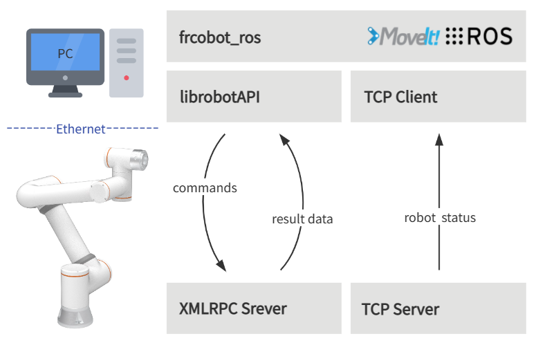

Overview
++++++++++
The brief architecture of frcobot_ros is shown in the figure below. The collaborative robot side provides an XMLRPC server and a TCP server.

- The XMLRPC server mainly provides the robot command API to complete the robot movement and state value acquisition function, which is mainly based on the C++ SDK.
- The TCP server of the state feedback provides real-time feedback of the state of the robot, and the feedback period is 8ms.

ROS and Moveit! have been installed on the user's PC, and frcobot_ros has been compiled. Each function package in frcobot_ros includes the lib library of the robot API, and establishes a TCP client in frcobot_hw to communicate with the robot status feedback server to obtain robot status feedback data.

Install
++++++++++
This chapter introduces how to build frcobot_ros and the required installation environment.

Environmental requirements
-----------------------------------
The recommended environment for frcobot_ros is as follows:

.. note:: 
    -	Ubuntu 18.04 LTS Bionic Beaver & ROS Melodic Morenia
    -	Ubuntu 20.04 LTS Focal Fossa & ROS Noetic Ninjemys

The instructions below are for Ubuntu 20.04 LTS systems and ROS Noetic Ninjemys. If you are using Melodic, replace ``noetic`` in the command line with ``melodic``.

ROS installation & requirements
--------------------------------
After installing the Ubuntu system, `Install and configure the ROS Noetic environment <https://wiki.ros.org/noetic/Installation/Ubuntu>`__.

After configuring ROS Noetic, install the required environment as follows:

.. code-block:: shell
    :linenos:

    echo "source /opt/ros/noetic/setup.bash" >> ~/.bashrc
    source ~/.bashrc
    sudo apt-get install -y \
        ros-noetic-rosparam-shortcuts \
        ros-noetic-ros-control \
        ros-noetic-ros-controllers \
        ros-noetic-moveit \
        libxmlrpcpp-dev

Compile
---------------------------
After ROS Noetic is properly installed and configured, create a Catkin workspace in a directory of your choice.

.. code-block:: shell
    :linenos:

    mkdir -p ~/catkin_ws/src
    cd ~/catkin_ws
    catkin_init_workspace src

Then clone the frcobot_ros library from Github.

.. code-block:: shell
    :linenos:

    cd src
    git clone https://github.com/FAIR-INNOVATION/frcobot_ros.git

Build the frcobot_ros package

.. code-block::  shell
    :linenos:

    cd ~/catkin_ws
    catkin_make
    echo "source ~/catkin_ws/devel/setup.bash" >> ~/.bashrc
    source ~/.bashrc

If an error occurs, please check whether the packages in the ROS installation requirements have been installed successfully. After the compilation is complete, copy the lib library to the ROS lib environment (the path is: /opt/ros/noetic/lib), so that the program can run normally .

.. code-block:: shell
    :linenos:

    # The default path of catkin_ws here is "~", if it is different, just change "~" to the actual path
    sudo cp ~/catkin_ws/src/frcobot_ros/frcobot_hw/lib/* /opt/ros/noetic/lib

Quick start
++++++++++++++

frcobot_hw
-----------------
``frcobot_hw`` mainly provides basic functions for communicating with collaborative robots.

.. note:: 
    - Contains the collaborative robot status feedback msg
    - Provide command demos for controlling collaborative robots
    - Provide collaborative robot status feedback nodes and topics
    - The status node and command demo can be quickly started through the launch file

The content of ``frcobot_hw.launch`` is as follows:

.. code-block:: xml
    :linenos:

    <launch>

        <!-- params -->
        <param name="robot_ip" type="string" value="192.168.58.2"/>
        <param name="robot_port" type="int" value="8083"/>

        <!-- frcobot status node -->
        <node pkg="frcobot_hw" type="frcobot_status_node" name="frcobot_status_node" output="screen" />

        <!-- frcobot control demo -->
        <node pkg="frcobot_hw" type="frcobot_cmd_demo" name="frcobot_cmd_demo" output="screen" />
        
    </launch>

.. important:: 

    - ``robot_ip`` and ``robot_port`` need to be consistent with the IP and port of the controlled collaborative robot
    - The default IP of the factory robot is 192.168.58.2, and the user status feedback port is 8083

Use the following commands to quickly start the robot status feedback node and command demo functions.

.. code-block:: shell
    :linenos:

    roslaunch frcobot_hw frcobot_hw.launch

Open a new terminal, and use the following commands to print and view real-time status feedback data.

.. code-block:: shell
    :linenos:

    rostopic ehco /frcobot_status

.. frcobot_camera
.. -----------------
.. frcobot_camera提供与图漾RVS和相机的手眼标定功能和无序抓取（Bin-Picking）功能.

.. frcobot_gripper
.. -------------------

.. frcobot_description
.. ----------------------

.. frcobot moveit!
.. -----------------------

    