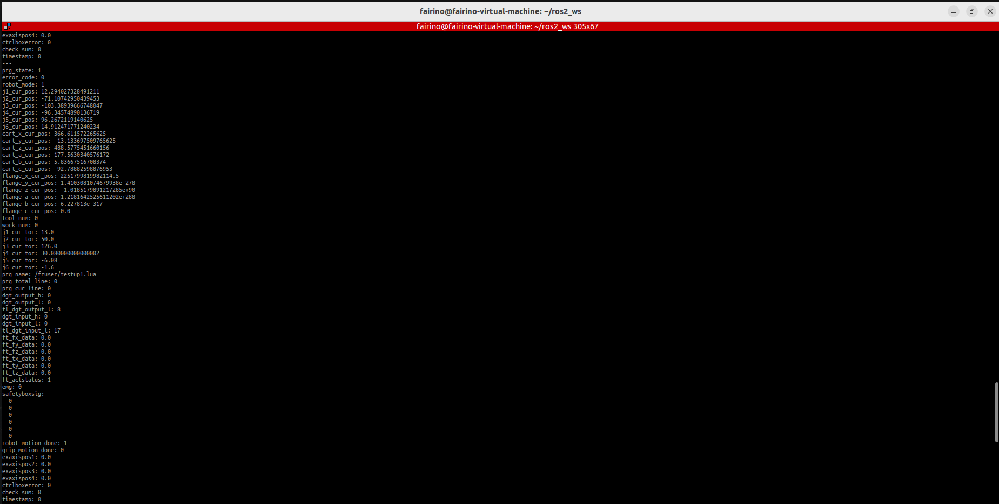
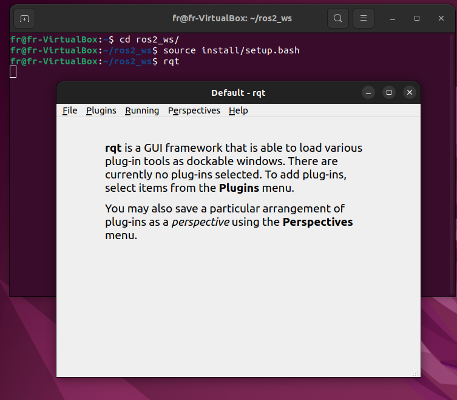
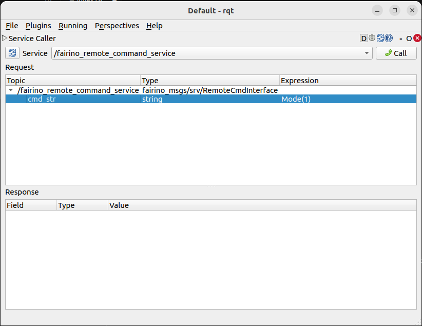

Overview
++++++++++
frcobot_ros2 is an API interface developed by Fao collaborative robot based on ROS2, aiming to use Fao SDK more conveniently for entry-level users. The configuration of the default parameters through the parameter configuration file can adapt to different customer requirements.

fr_ros2
++++++++++++++
This chapter describes how to configure the APP running environment.

Basic environment installation
----------------------------------
It is recommended to use it on Ubuntu22.04LTS (Jammy). After the system is installed, you can install ROS2. It is recommended to use ros2-humble. For the installation of ROS2, please refer to the tutorial: https://docs.ros.org/en/humble/index.html.

Compile and build
---------------------
1. Create colcon workspace
fr_ros2 consists of two function packages, one is the function package frhal_msgs of the custom data structure, and the other is the program main body fr_ros2 function package. After installing the basic environment, first create a colcon workspace, such as:

.. code-block:: shell
    :linenos:

    cd ~/
    mkdir -p ros2_ws/src

2. Compile feature pack
Copy the code of the installation package to the ros2_ws/src directory, and run the following command in the ros2_ws directory:

.. code-block:: shell
    :linenos:

    colcon build --packages-select frhal_msgs

After waiting for the previous command to finish compiling, enter:

.. code-block::  shell
    :linenos:

    colcon build --packages-select fr_ros2

Quick start
++++++++++++++

Start
-----------------
Open the command line under Ubuntu and enter:

.. code-block::  shell
    :linenos:

    cd ros2_ws
    source install/setup.bash
    ros2 run fr_ros2 ros2_cmd_server

View the robotic arm status feedback
--------------------------------------------------
The status feedback of the robotic arm is released through the topic. Users can observe the status data refresh through the ros2 built-in command, or write a program to obtain the data. The following shows how to observe the status data of the robotic arm through the ros2 command.

Open the command line under Ubuntu and enter:

.. code-block:: shell
    :linenos:

    cd ros2_ws
    source install/setup.bash
    ros2 topic echo /nonrt_state_data

You can see the status data constantly refreshed in the command line window, as shown in the figure below.

Issue order
--------------------------
Open the command line under Ubuntu and enter:

.. code-block:: shell
    :linenos:

    cd ros2_ws
    source install/setup.bash
    rqt

After the above command is executed, a rqt GUI interface will be called out, as shown in the figure below.

Select plugins->serivce->serivce caller in the GUI interface, call up the following interface, select /FR_ROS_API_service, enter the command string in the interface expression and click call to see the reply message in the dialog box below.

.. important:: 

   - Enter a string rule description:

   The program internally screens the input string format. The format of the function input must be in the form of [function name](), and the parameter string in parentheses must be composed of letters, numbers, commas and minus signs. Other characters or spaces will report an error.

   - Command feedback value description:

   Except for the GET command which will feedback a string of strings, the feedback values of the rest of the functions are all int types. Generally, 0 means that an error occurred, and 1 means that it was executed correctly. If there are other values, please refer to the error code corresponding to the error code defined in the xmlrpc SDK.

Modify parameter
--------------------------
Since the simplified SDK is an improvement from the original SDK interface, it can be simplified because some parameters are given default values, and in the actual use process, there will be situations where the default parameters cannot meet the requirements. At this time, you can modify the values ​​of the corresponding default parameters. , and then loaded into the node.

There is a fr_ros2_para.yaml parameter file in the source code file. The parameters in the file are preset default parameters, which are used to simplify the command input parameters. You can modify the parameters according to your specific needs, and then use the command to dynamically modify the parameters: ros2 param load FR_ROS_API_nod ~/ros2_ws/src/fr_ros2/fr_ros2_para.yaml.

API Description
++++++++++++++++++

.. code-block:: c++
    :linenos:

    /*
    function bref:store a joint space point
    id - the index of point, start from 1,be aware that this id is idependant from the point id of CARTPoint function
    double j1-j6 - position of 6 axies, unit is deg
    */
    int JNTPoint(int id, double j1, double j2, double j3, double j4, double j5, double j6)
    // example
    JNTPoint(1,10,11,12,13,14,15)

    /*
    function bref:store a cartesian space point
    id - the index of point, start from 1, be aware that this id is idependant from the point id of JNTPoint function
    double x,y,z,rx,ry,yz - cartesian position,unit of distance is mm, angle unit is deg
    */
    int CARTPoint(int id, double x,y,z,rx,ry,rz)
    // example
    CARTPoint(1,100,110,200,0,0,0)

    /*
    function bref:get the specific id point data of joint space or cartesian space
    string name - input 'JNT' or 'CART',JNT means joint space point, 'CART' means cartesian space point 
    int id - point id, starts from 1
    */
    string GET(string name, int id)
    // example
    GET(JNT,1)

    /*
    function bref:free drive mode switch
    uint8_t state - 1-open free drive mode,0-close free drvie mode
    */
    int DragTeachSwitch(uint8_t state)
    // example
    DragTeachSwitch(0)

    /*
    function bref:robot servo on switch
    uint8_t state - 1-servo on,0-servo off
    */
    int RobotEnable(uint8_t state)
    // example
    RobotEnable(1)

    /*
    function bref:robot operation mode switch
    uint8_t state - 1-manual mode,0-auto mode
    */
    int Mode(uint8_t state)
    // example
    Mode(1)

    /*
    function bref:set robot speed on current operation mode
    float vel - percentage of speed,from 1 to 100
    */
    int SetSpeed(float vel)
    // example
    SetSpeed(10)

    /*
    function bref:set and load specific index tool coordinate
    int id - the index of tool coordinate, from 1 to 15
    float x,y,z,rx,ry,rz - transformation of tool coordinate
    */
    int SetToolCoord(int id, float x,float y, float z,float rx,float ry,float rz)
    // example
    SetToolCoord(1,0,0,0,0,0,0)

    /*
    function bref:set tool coordinate list
    int id - the index of tool coordinate list, from 1 to 15
    float x,y,z,rx,ry,rz - transformation of tool coordinate
    */
    int SetToolList(int id, float x,float y, float z,float rx,float ry,float rz );
    // example
    SetToolList(1,0,0,0,0,0,0)

    /*
    function bref:set and load specific index external tool coordinate
    int id - the index of external tool coordinate, from 1 to 15
    float x,y,z,rx,ry,rz - transformation of external tool coordinate
    */
    int SetExToolCoord(int id, float x,float y, float z,float rx,float ry,float rz);	
    // example
    SetExToolCoord(1,0,0,0,0,0,0)

    /*
    function bref:set external tool coordinate list
    int id - the index of external tool coordinate, from 1 to 15
    float x,y,z,rx,ry,rz - transformation of external tool coordinate
    */
    int SetExToolList(int id, float x,float y, float z,float rx,float ry,float rz);
    // example
    SetExToolList(1,0,0,0,0,0,0)

    /*
    function bref:set object coordinate
    int id - the index of object coordinate,from 1 to 15
    float x,y,z,rx,ry,rz - transformation of object coordinate
    */
    int SetWObjCoord(int id, float x,float y, float z,float rx,float ry,float rz);
    // example
    SetWObjCoord(1,0,0,0,0,0,0)

    /*
    function bref:set object coordinate list
    int id - the index of object coordinate,from 1 to 15
    float x,y,z,rx,ry,rz - transformation of object coordinate
    */
    int SetWObjList(int id, float x,float y, float z,float rx,float ry,float rz);
    // example
    SetWObjList(1,0,0,0,0,0,0)

    /*
    function bref:set TCP load weight
    float weight - load weight, unit is kg
    */
    int SetLoadWeight(float weight);
    // example
    SetLoadWeight(3.5)

    /*
    function bref:set gravity center of load weight
    float x,y,z - location os gravity center,uint is mm
    */
    int SetLoadCoord(float x,float y,float z);
    // example
    SetLoadCoord(10,20,30)

    /*
    function bref:set robot install direction
    uint8_t install - 0-floor,1-wall,2-ceiling
    */
    int SetRobotInstallPos(uint8_t install);
    // example
    SetRobotInstallPos(0)

    /*
    function bref:set robot installation dirction in free install case
    double yangle - dip angle
    double zangle - rotation angle
    */
    int SetRobotInstallAngle(double yangle,double zangle);
    // example
    SetRobotInstallAngle(90,0)

    /*
    function bref:set axies collision levels
    float level1-level6 - collision level of each axis, from 1 to 10
    */
    int SetAnticollision(float level1, float level2, float level3, float level4, float level5, folat level6);
    // example
    SetAnticollision(1,1,1,1,1,1)

    /*
    function bref:set strategy after collision
    int strategy - 0-stop motion and throw error,1-keep running
    */
    int SetCollisionStrategy(int strategy);
    // example
    SetCollisionStrategy(1)

    /*
    function bref:set positive limit of each axis
    float limit1-limit6 - value of limit of each axis
    */
    int SetLimitPositive(float limit1, float limit2, float limit3, float limit4, float limit5, float limit6);
    // example
    SetLimitPositve(100,90,90,90,90,90)

    /*
    function bref:set negetive limit of each axis
    float limit1-limit6 - value of limit of each axis
    */
    int SetLimitNegative(float limit1, float limit2, float limit3, float limit4, float limit5, float limit6);
    // example
    SetLimitNegative(-100,-90,-90,-90,-90,-90)

    /*
    function bref:error state clear
    */
    int ResetAllError();

    /*
    function bref:joint friction compensation switch
    uint8_t state - 0-off, 1-on
    */
    int FrictionCompensationOnOff(uint8_t state);
    // example
    FrictionCompensationOnOff(1)

    /*
    function bref:set coefficient of each joint in floor installtion case
    float coeff1-coeff6 - coefficient of each joint, from 0 to 1
    */
    int SetFrictionValue_level(float coeff1,float coeff1,float coeff3,float coeff4,float coeff5,float coeff6);
    // example
    SetFrictionValue_level(1,1,1,1,1,1)

    /*
    function bref:set coefficient of each joint in wall installtion case
    float coeff1-coeff6 - coefficient of each joint, from 0 to 1
    */
    int SetFrictionValue_wall(float coeff1,float coeff1,float coeff3,float coeff4,float coeff5,float coeff6);
    // example
    SetFrictionValue_wall(0.5,0.5,0.5,0.5,0.5,0.5)

    /*
    function bref:set coefficient of each joint in ceiling installtion case
    float coeff1-coeff6 - coefficient of each joint, from 0 to 1
    */
    int SetFrictionValue_ceiling(float coeff1,float coeff1,float coeff3,float coeff4,float coeff5,float coeff6);
    // example
    SetFrictionValue_ceiling(0.5,0.5,0.5,0.5,0.5,0.5)

    /*
    function bref:active gripper
    int index - index of gripper
    uint8_t act - 0-reset, 1-active
    */
    int ActGripper(int index,uint8_t act);
    // example
    ActGripper(1,1)

    /*
    function bref:control motion of gripper
    int index - index of gripper
    int pos - persentage of gripper position, from 0 to 100
    */
    int MoveGripper(int index,int pos);
    // example
    MoveGripper(1,10)

    /*
    function bref:set digital output of control box
    int id - index of IO, from 0 to 15
    uint_t status - 0-off, 1-on
    */
    int SetDO(int id,uint8_t status);
    // example
    SetDO(1,1)

    /*
    function bref:set digitial output of tool
    int id - index of IO, from 0 to 1
    uint_t status - 0-off, 1-on
    */
    int SetToolDO(int id,uint8_t status);
    // example
    SetToolDO(0,1)

    /*
    function bref:set analog output of control box
    int id - index of IO, from 0 to 1
    float vlaue - current of voltage persentage,from 0 to 100
    */
    int SetAO(int id,float value);
    // example
    SetAO(1,100)

    /*
    function bref:set analog output of tool
    int id - index of IO, from 0 to 0
    float vlaue - current of voltage persentage,from 0 to 100
    */
    int SetToolAO(int id,float value);
    // example
    SetToolAO(0,100)

    /*
    function bref:JOG
    uint8_t ref - 0-joint coordinate jog, 2-base coordinate jog, 4-tool coordinate jog, 8-object coordinate jog
    uint8_t nb - 1-axis1(x axis),2-axis2(y axis),3-axis3(z axis),4-axis4(rx),5-axis5(ry),6-axis6(rz)
    uint8_t dir - 0-negetive direction, 1-positive direction
    float vel - speed persentage, from 0 to 100
    */
    int StartJOG(uint8_t ref, uin8_t nb, uint8_t dir, float vel);
    // example
    StartJOG(1,1,1,10)

    /*
    function bref:JOG stop
    uint8_t ref - 0-joint coordinate jog stop, 2-base coordinate jog stop, 4-tool coordinate jog stop, 8-object coordinate jog stop
    */
    int StopJOG(uint8_t ref);
    // example
    StopJOG(1)

    /*
    function bref:JOG immediately stop
    */
    int ImmStopJOG();

    /*
    function bref:point to point motion in joint space
    string point_name - name of prestored point,like JNT1 means the first point of joint prestored point,CART means the first point fo cartiean prestored point
    float vel - speed persentage, from 0 to 100
    */
    int MoveJ(string point_name, float vel);
    // example
    MoveJ(JNT1,10)

    /*
    function bref:linear motion in cartesian space
    string point_name - name of prestored point,like JNT1 means the first point of joint prestored point,CART means the first point fo cartiean prestored point
    float vel - speed persentage, from 0 to 100
    */
    int MoveL(string point_name,float vel);
    // example
    MoveL(CART1,10)

    /*
    function bref:arc motion in cartesian space
    string point1_name point2_name - name of prestored point,like JNT1 means the first point of joint prestored point,CART means the first point fo cartiean prestored point, be aware that the two points must be the same type, which means user must input two JNT points or two CART points
    float vel - speed persentage, from 0 to 100
    */
    int MoveC(string point1_name,string point2_name, float vel);
    // example
    MoveC(JNT1,JNT2,10)

    /*
    function bref:joint space spline motion start
    */
    int SplineStart();

    /*
    function bref:Spline motion in joint space, only JNT point supported, an error will be thrown if input a CART point
    string point_name - name of prestored point,like JNT1 means the first point of joint prestored point
    float vel - speed persentage, from 0 to 100
    */
    int SplinePTP(string point_name, float vel);
    // example
    SplinePTP(JNT2,10)

    /*
    function bref:joint space spline motion end
    */
    int SplineEnd();

    /*
    function bref:cartesian space spline motion start
    uint8_t ctlpoint - 0-trajectory through the control point, 1-trajectory will no reach the control point
    */
    int NewSplineStart(uint8_t ctlpoint);
    // example
    NewSplineStrart(1)

    /*
    function bref:Spline motion in cartesian space, only CART point supported, an error will be thrown if input a JNT point
    string point_name - name of prestored point,like CART1 means the first point of cartesian prestored point
    float vel - speed persentage, from 0 to 100
    int lastflag - 0-not last point, 1-last point
    */
    int NewSplinePoint(string point_name, float vel, int lastflag);
    // example
    NewSplinePoint(JNT2,20,0)

    /*
    function bref:cartesian space spline motion end
    */
    int NewSplineEnd();

    /*
    function bref:stop robot motion
    */
    int StopMotion();

    /*
    function bref:points shift start
    int flag - 0-shift on base/object coordinate, 2-shift on tool coordinate
    double x,y,z,rx,ry,rz - transformation of shift
    */
    int PointsOffsetEnable(int flag,double x,double y,double z,double rx,double ry,double rz);
    // example
    PointsOffsetEnable(1,10,10,10,0,0,0)

    /*
    function bref:points shift end
    */
    int PointsOffsetDisable();