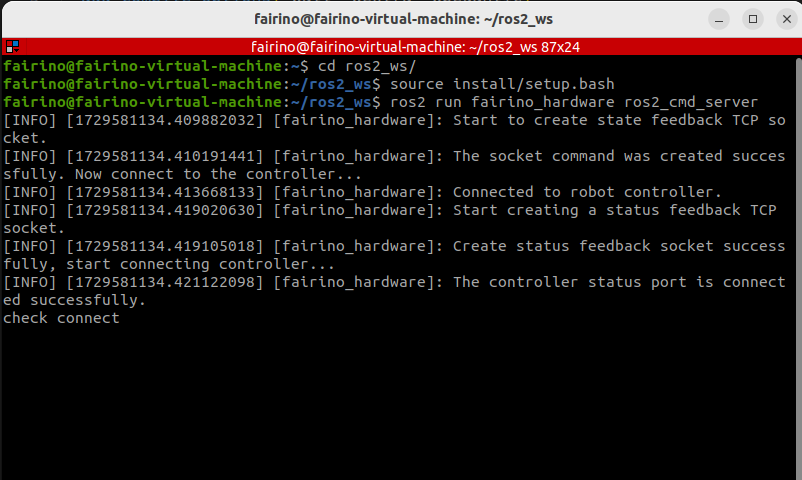

Introduction
++++++++++
fairino_hardware is an API interface developed based on ROS2 for FaAO collaborative robot, aiming at making it more convenient for entry-level users to use FaAO SDK. Through the parameter configuration file to configure the default parameters, it can adapt to different customer requirements.

fairino_hardware
++++++++++++++
This section explains how to configure the APP environment.

Basic Environment Installation
--------------

It is recommended to use Ubuntu22.04LTS(Jammy). Once the system is installed, you can install ROS2. Ros2-humble is recommended:https://docs.ros.org/en/humble/index.html。Before compiling fairino_hardware, you need to install the official ros2_control package. For ros2_control installation, see the tutorial:https://control.ros.org/humble/index.html。There are two official ros2_control installation modes, namely command installation mode and source code compilation installation mode. Because command installation mode may lead to incomplete installation of function package, it is recommended to use source code compilation installation mode.

Compile and build fairino_hardware
---------------------
1. Create the colcon workspace
fairino_hardware consists of two packages: fairino_msgs for custom data structures and fairino_hardware for the program body. Once you have the base environment installed, create a colcon workspace, like this:

.. code-block:: shell
    :linenos:

    cd ~/
    mkdir -p ros2_ws/src

2. Compile feature packs
Copy the package code to ros2_ws/src and run the following command inside ros2_ws:

.. code-block:: shell
    :linenos:

    colcon build --packages-select fairino_msgs

Wait for the previous command to finish compiling

.. code-block::  shell
    :linenos:

    colcon build --packages-select fairino_hardware

Quick start
++++++++++++++

Starting the process
-----------------
On Ubuntu, open the command line and type:

.. code-block::  shell
    :linenos:

    cd ros2_ws
    source install/setup.bash
    ros2 run fairino_hardware ros2_cmd_server

View the manipulator state feedback process
--------------------------
The state feedback of the manipulator is published through the topic. Users can observe the state data refresh through the commands that come with ros2, or write programs to obtain the data.

On ubuntu, open the command line and type:

.. code-block:: shell
    :linenos:

    cd ros2_ws
    source install/setup.bash
    ros2 topic echo /nonrt_state_data

Can see the status data being refreshed in the command-line window, as shown in the following screenshot:

.. image:: img/fr_ros2_002.png
    :width: 6in
    :align: center

Process for issuing instructions
--------------------------
On ubuntu, open the command line and type:

.. code-block:: shell
    :linenos:

    cd ros2_ws
    source install/setup.bash
    rqt

After executing the above command, an rqt GUI will be brought up, as shown in the following figure.

.. image:: img/fr_ros2_003.png
    :width: 6in
    :align: center

In the GUI, select plugins->serivce->serivce caller, bring up the following screen, select /fairino_remote_command_service, Enter the instruction string in the interface expression and click call to see the reply message pop up in the dialog box below.

.. image:: img/fr_ros2_004.png
    :width: 6in
    :align: center

.. important:: 

   - Input string rule description:

   The program internally filters the input strings to be of the form [function name](), and the parenthesis argument string must consist of letters, numbers, commas, and minus signs; any other characters or Spaces will throw an error.

   - Instruction feedback value description:

   Except for the GET command, which returns a string, the rest of the function feedback values are int values, typically 0 for error, 1 for correct execution, and any other values refer to the error code defined in the xmlrpc SDK.

Modifying the parameter flow
--------------------------
Since the simplified SDK is to improve the native SDK interface, it can be simplified because some parameters are given default values. However, in the actual use process, the default parameters can not meet the requirements, in this case, you can modify the value of the corresponding default parameters and then load them into the node.

There is a fairino_remotecmdinterface_para.yaml parameter file in the source code file. The parameters in the file are preset default parameters, which are used to simplify the instruction input parameters. You can modify the parameters according to your specific needs, and then use the command to modify the parameters dynamically: ros2 param load fr_command_server ~/ros2_ws/src/fairino_hardware/fairino_remotecmdinterface_para.yaml。

API Description
++++++++++++++

.. code-block:: c++
    :linenos:

    /*
    Function description: Store a joint point position information
    id - Stores the point id, starting with 1, independently of the point id of CARTPoint
    double j1−j6 − 6 joint positions in degrees
    */
    int JNTPoint(int id, double j1, double j2, double j3, double j4, double j5, double j6)
    // Examples
    JNTPoint(1,10,11,12,13,14,15)

    /*
    Function description: Store a Cartesian point position information
    id - Stores the point id, starting from 1, independently of the point id of JNTPoint
    double x,y,z,rx,ry,yz - Cartesian point position information, position in mm, Angle in degrees
    */
    int CARTPoint(int id, double x,y,z,rx,ry,rz)//Store a point in Cartesian space
    // Examples
    CARTPoint(1,100,110,200,0,0,0)

    /*
    Function description: Get the joint or Cartesian position information of the specified sequence point
    string name - 'JNT' or 'CART', where JNT stands for getting information about joint points and 'CART' stands for getting information about Cartesian points
    int id - The point id, starting at 1
    */
    string GET(string name, int id)//Get the contents of the corresponding id sequence number point; name can be entered as JNT or CART
    // Examples
    GET(JNT,1)

    /*
    Function description: Drag mode switch
    uint8_t state - 1- Enable drag mode,0- disable drag mode
    */
    int DragTeachSwitch(uint8_t state)
    // Examples
    DragTeachSwitch(0)

    /*
    Function description: Manipulator enable switch
    uint8_t state - 1 -manipulator enabled,0 -manipulator deenabled
    */
    int RobotEnable(uint8_t state)
    // Examples
    RobotEnable(1)

    /*
    Function description:Mode switching
    uint8_t state - 1- Manual mode,0- automatic mode
    */
    int Mode(uint8_t state)
    // Examples
    Mode(1)

    /*
    Function description:Set the manipulator speed in the current mode
    float vel - Percentage of speed, ranging from 1-100
    */
    int SetSpeed(float vel)
    // Examples
    SetSpeed(10)

    /*
    Function description:Sets and loads the tool coordinate system with the specified sequence number
    int id - Tool coordinate system number, range 1-15
    float x,y,z,rx,ry,rz - Offset information for the tool coordinate system
    */
    int SetToolCoord(int id, float x,float y, float z,float rx,float ry,float rz)
    // Examples
    SetToolCoord(1,0,0,0,0,0,0)

    /*
    Function description:Set the list of tool coordinate systems
    int id - Tool coordinate system number, range 1-15
    float x,y,z,rx,ry,rz - Offset information for the tool coordinate system
    */
    int SetToolList(int id, float x,float y, float z,float rx,float ry,float rz );
    // Examples
    SetToolList(1,0,0,0,0,0,0)

    /*
    Function description:Set the external tool coordinate system
    int id - Tool coordinate system number, range 1-15
    float x,y,z,rx,ry,rz - Offset information for the external tool coordinate system
    */
    int SetExToolCoord(int id, float x,float y, float z,float rx,float ry,float rz);	
    // Examples
    SetExToolCoord(1,0,0,0,0,0,0)

    /*
    Function description:Sets the list of external tool coordinate systems
    int id - Tool coordinate system number, range 1-15
    float x,y,z,rx,ry,rz - Offset information for the external tool coordinate system
    */
    int SetExToolList(int id, float x,float y, float z,float rx,float ry,float rz);
    // Examples
    SetExToolList(1,0,0,0,0,0,0)

    /*
    Function description:Set the workpiece coordinate system
    int id - Workpiece coordinate system number, range 1-15
    float x,y,z,rx,ry,rz - Offset information of the workpiece coordinate system
    */
    int SetWObjCoord(int id, float x,float y, float z,float rx,float ry,float rz);
    // Examples
    SetWObjCoord(1,0,0,0,0,0,0)

    /*
    Function description:Set the list of workpiece coordinate systems
    int id - Workpiece coordinate system number, range 1-15
    float x,y,z,rx,ry,rz - Offset information of the workpiece coordinate system
    */
    int SetWObjList(int id, float x,float y, float z,float rx,float ry,float rz);
    // Examples
    SetWObjList(1,0,0,0,0,0,0)

    /*
    Function description:Set the end load weight
    float weight - Load weight in kg
    */
    int SetLoadWeight(float weight);
    // Examples
    SetLoadWeight(3.5)

    /*
    Function description:Set the end-load centroid coordinates
    float x,y,z - Coordinates of the center of mass in mm
    */
    int SetLoadCoord(float x,float y,float z);
    // Examples
    SetLoadCoord(10,20,30)

    /*
    Function description:Set the robot installation mode
    uint8_t install - Installation mode,0- formal,1- side,2- inverted
    */
    int SetRobotInstallPos(uint8_t install);
    // Examples
    SetRobotInstallPos(0)

    /*
    Function description:Set the robot installation Angle, free installation
    double yangle - Angle of inclination
    double zangle - Angle of rotation
    */
    int SetRobotInstallAngle(double yangle,double zangle);
    // Examples
    SetRobotInstallAngle(90,0)

    //Security configuration
    /*
    Function description:Set the robot collision level
    float level1-level6 - Collision levels for axes 1-6, ranging from 1-10
    */
    int SetAnticollision(float level1, float level2, float level3, float level4, float level5, folat level6);
    // Examples
    SetAnticollision(1,1,1,1,1,1)

    /*
    Function description:Set the post-collision policy
    int strategy - 0- Stop with error,1- Keep running
    */
    int SetCollisionStrategy(int strategy);
    // Examples
    SetCollisionStrategy(1)

    /*
    Function description:Set the positive limit, note that the set value must be within the hard limit range
    float limit1-limit6 - Six joint limit values
    */
    int SetLimitPositive(float limit1, float limit2, float limit3, float limit4, float limit5, float limit6);
    // Examples
    SetLimitPositve(100,90,90,90,90,90)

    /*
    Function description:Set the negative limit, note that the set value must be within the hard limit range
    float limit1-limit6 - Six joint limit values
    */
    int SetLimitNegative(float limit1, float limit2, float limit3, float limit4, float limit5, float limit6);
    // Examples
    SetLimitNegative(-100,-90,-90,-90,-90,-90)

    /*
    Function description:Error state removal
    */
    int ResetAllError();

    /*
    Function description:Joint friction compensation switch
    uint8_t state - 0- off, 1- on
    */
    int FrictionCompensationOnOff(uint8_t state);
    // Examples
    FrictionCompensationOnOff(1)

    /*
    Function description:Set the joint friction compensation coefficient -formal suit
    float coeff1-coeff6 - Six joint compensation coefficients, ranging from 0-1
    */
    int SetFrictionValue_level(float coeff1,float coeff1,float coeff3,float coeff4,float coeff5,float coeff6);
    // Examples
    SetFrictionValue_level(1,1,1,1,1,1)

    /*
    Function description:Set the joint friction compensation coefficient -side loading
    float coeff1-coeff6 - Six joint compensation coefficients, ranging from 0-1
    */
    int SetFrictionValue_wall(float coeff1,float coeff1,float coeff3,float coeff4,float coeff5,float coeff6);
    // Examples
    SetFrictionValue_wall(0.5,0.5,0.5,0.5,0.5,0.5)

    /*
    Function description:Set the joint friction compensation coefficient -flip
    float coeff1-coeff6 - Six joint compensation coefficients, ranging from 0-1
    */
    int SetFrictionValue_ceiling(float coeff1,float coeff1,float coeff3,float coeff4,float coeff5,float coeff6);
    // Examples
    SetFrictionValue_ceiling(0.5,0.5,0.5,0.5,0.5,0.5)

    //Peripheral device control
    /*
    Function description:Activated gripper
    int index - Clamp claw number
    uint8_t act - 0- Reset, 1- Activate
    */
    int ActGripper(int index,uint8_t act);
    // Examples
    ActGripper(1,1)

    /*
    Function description:Control gripper
    int index - Clamp claw number
    int pos - Percentage of position, range 0-100
    */
    int MoveGripper(int index,int pos);
    // Examples
    MoveGripper(1,10)

    //IO控制
    /*
    Function description:Set the control box digital output
    int id - io number, range 0-15
    uint_t status - 0- off, 1- on
    */
    int SetDO(int id,uint8_t status);
    // Examples
    SetDO(1,1)

    /*
    Function description:Set tool number output
    int id - io number, range 0-1
    uint_t status - 0- off, 1- on
    */
    int SetToolDO(int id,uint8_t status);
    // Examples
    SetToolDO(0,1)

    /*
    Function description:Set the control box analog output
    int id - io number, range 0-1
    float vlaue - Percentage of current or voltage value, range 0-100
    */
    int SetAO(int id,float value);
    // Examples
    SetAO(1,100)

    /*
    Function description:Set tool analog output
    int id - io number, range 0
    float vlaue - Percentage of current or voltage value, range 0-100
    */
    int SetToolAO(int id,float value);
    // Examples
    SetToolAO(0,100)

    //Motor command
    /*
    Function description:Robot JOG Start
    uint8_t ref - 0-joint JOG, 2-JOG in base coordinate system, 4-JOG in tool coordinate system, 8-JOG in workpiece  coordinate system
    uint8_t nb - 1 - Joint 1 (or X-axis), 2 - Joint 2 (or Y-axis), 3 - Joint 3 (or Z-axis), 4 - Joint 4 (or Rotation around X-axis), 5 - Joint 5 (or Rotation around Y-axis), 6 - Joint 6 (or Rotation around Z-axis)
    uint8_t dir - 0- negative direction, 1- positive direction
    float vel - Percentage of speed, ranging from 0-100
    */
    int StartJOG(uint8_t ref, uin8_t nb, uint8_t dir, float vel);
    // Examples
    StartJOG(1,1,1,10)

    /*
    Function description:Robot JOG Stop
    uint8_t ref - 0 - Joint Jog Stop, 2 - Jog Stop in Base Coordinate System, 4 - Jog Stop in Tool Coordinate System, 8 - Jog Stop in Workpiece Coordinate System
    */
    int StopJOG(uint8_t ref);
    // Examples
    StopJOG(1)

    /*
    Function description:Robot JOG Immediate Stop
    */
    int ImmStopJOG();

    /*
    Function description:Joint space motion
    string point_name - For example, JNT1 is the point with the sequence number 1 of the node information,CART1 is the point with the sequence number 1 of the Cartesian point information,MoveJ instruction supports the input of the node or Cartesian point. It should be noted that because the default parameters of the MoveJ instruction specify the tool coordinate system and the workpiece coordinate system, when the serial number of the two coordinate systems is inconsistent with the current load, the instruction will cause an error. It is necessary to modify the coordinate system parameters and LOAD parameters in the default parameters before running the movement instruction.
    float vel - Command speed percentage, range 0-100
    */
    int MoveJ(string point_name, float vel);//point_name indicates the input prestored point information,
    // Examples
    MoveJ(JNT1,10)

    /*
    Function description:Rectilinear motion in Cartesian space
    string point_name - For example, JNT1 is the point whose sequence number is 1,CART1 is the point whose sequence number is 1, and the MoveL instruction supports the input of the point or Cartesian point. It should be noted that since the default parameters of the MoveL instruction specify the tool coordinate system and the workpiece coordinate system, when the serial number of the two coordinate systems is inconsistent with the current load, the instruction will cause an error. The coordinate system parameters and load parameters need to be modified in the default parameters before running the motion instruction.
    float vel - Command speed percentage, range 0-100
    */
    int MoveL(string point_name,float vel);
    // Examples
    MoveL(CART1,10)

    /*
    Function description:Circular motion in Cartesian space
    string point1_name point2_name - For example, JNT1 is the point whose sequence number is 1,CART1 is the point whose sequence number is 1. MoveC command supports the input of the point or Cartesian point, but the two points must be of the same type, that is, the first point does not support the input of the joint space point and the second point input of the Cartesian point. It should be noted that because the default parameters of the MoveC instruction specify the tool coordinate system and the workpiece coordinate system, when the serial number of the two coordinate systems is inconsistent with the current load, the instruction will cause an error. It is necessary to modify the coordinate system parameters and LOAD parameters in the default parameters before running the movement instruction.
    float vel - Command speed percentage, range 0-100
    */
    int MoveC(string point1_name,string point2_name, float vel);
    // Examples
    MoveC(JNT1,JNT2,10)

    /*
    Function description:The spline movement begins
    */
    int SplineStart();

    /*
    Function description:Joint space spline movement, this command only supports the input of joint data such as JNT1, the input of Cartesian point will report an error
    string point_name - The prestored point name, such as JNT1, is the point whose sequence number is 1.
    float vel - Percentage of speed, range 0-100
    */
    int SplinePTP(string point_name, float vel);
    // Examples
    SplinePTP(JNT2,10)

    /*
    Function description:The spline movement is over
    */
    int SplineEnd();

    /*
    Function description:The Cartesian space spline motion begins
    uint8_t ctlpoint - 0- trajectory passes through the path point, 1- trajectory does not pass through the control point, at least 4 points
    */
    int NewSplineStart(uint8_t ctlpoint);
    // Examples
    NewSplineStrart(1)

    /*
    Function description:For Cartesian space spline movement, only Cartesian space points such as CART1 can be entered, and an error will be reported when entering joint space points
    string point_name - Prestored point names, such as CART1, are points in Cartesian space with sequence number 1.
    float vel - Percentage of speed, range 0-100
    int lastflag - 0- not the last point, 1- the last point
    */
    int NewSplinePoint(string point_name, float vel, int lastflag);
    // Examples
    NewSplinePoint(JNT2,20,0)

    /*
    Function description:The Cartesian space spline motion ends
    */
    int NewSplineEnd();

    /*
    Function description:Stop motion
    */
    int StopMotion();

    /*
    Function description:Global shift of point position begins
    int flag - 0- Offset in base coordinate/workpiece coordinate, 2- offset in tool coordinate
    double x,y,z,rx,ry,rz - Offset pose amount
    */
    int PointsOffsetEnable(int flag,double x,double y,double z,double rx,double ry,double rz);
    // Examples
    PointsOffsetEnable(1,10,10,10,0,0,0)

    /*
    Function description:The point offset is complete
    */
    int PointsOffsetDisable();
