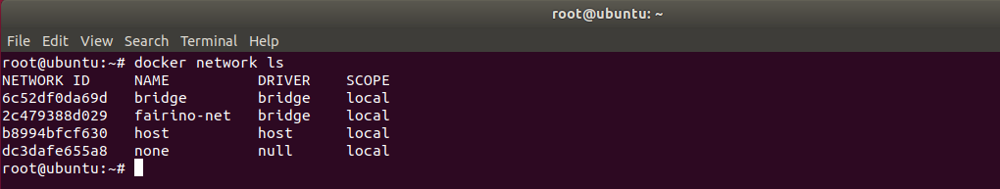
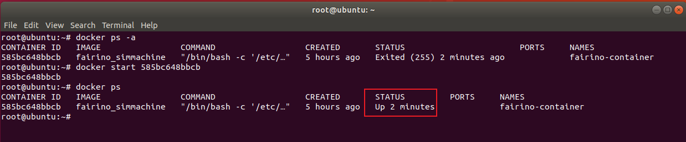
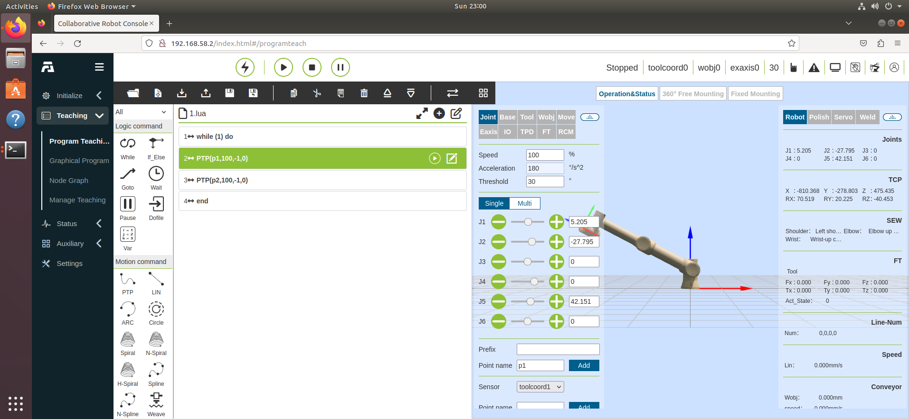
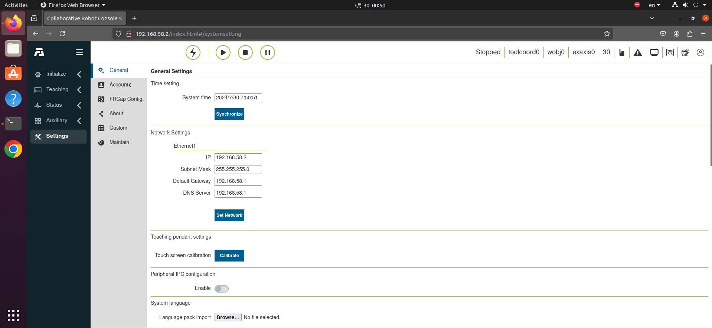
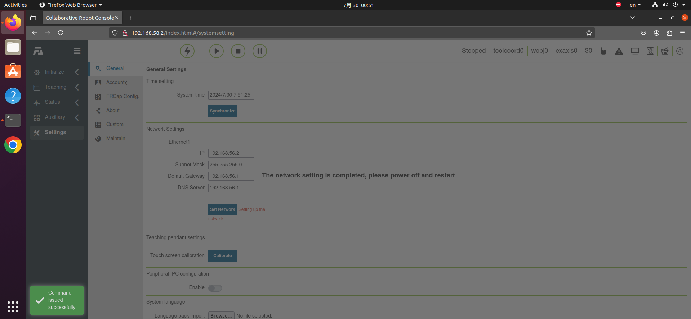
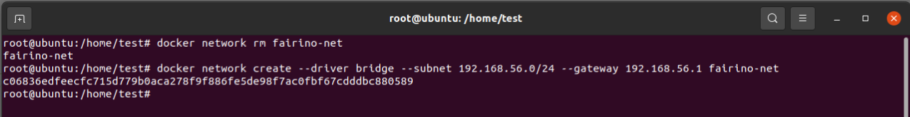
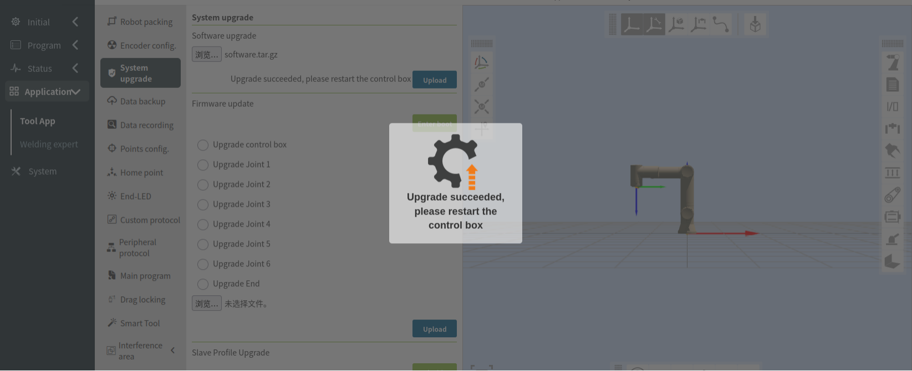
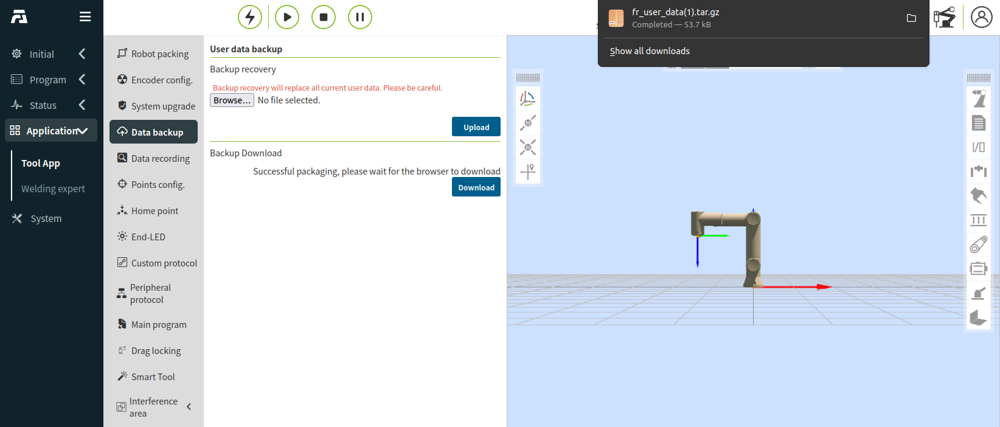
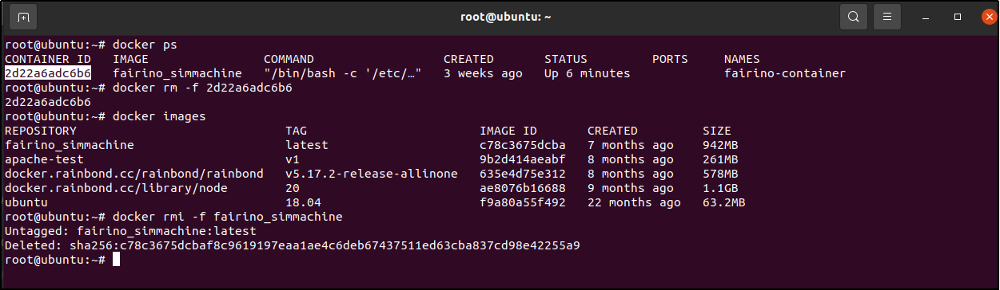
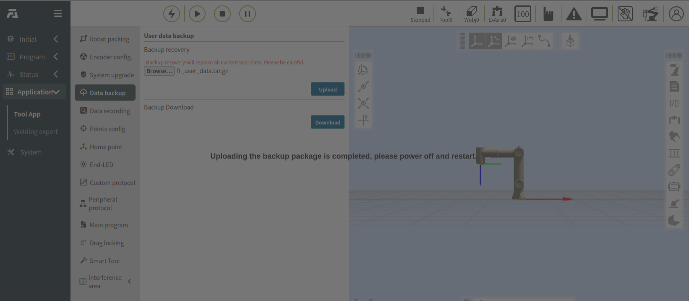

Virtual machine-Docker
=================================

Deploying Docker images on Linux
-------------------------------------

Operating environment
~~~~~~~~~~~~~~~~~~~~~~~~~~~

Virtual machine operating system: Ubuntu 18.04.6.

Virtual machine operating environment: RAM 4G, ROM 50G, 6-core CPU.

Operational rights: Use the superuser root privileges, the setup method is detailed in Appendix 1.

Docker installation file: fr_docker.tar.gz.

FAIRINO SimMachine image: FAIRINOSimMachine.tar.

Install Docker
~~~~~~~~~~~~~~

If the user has already installed Docker, skip this section and proceed to section 1.3 for image deployment.

1. Download fr_docker.tar.gz and place it in the Ubuntu file path /opt/.

2. Unzip fr_docker.tar.gz, for example, in the /opt/ directory:

.. code-block:: console
   :linenos:

   cd /opt/ && tar -zxvf fr_docker.tar.gz

.. image:: controller_virtual_machine/036.png
   :width: 6in
   :align: center

3.Execute the Docker installation script:

.. code-block:: console
   :linenos:

   sh install.sh docker-27.0.3.tgz

Once the script has been executed and the version number appears, it indicates that the installation has been successful.

.. image:: controller_virtual_machine/037.png
   :width: 6in
   :align: center

Image Configuration
~~~~~~~~~~~~~~~~~~~~~~~~~~

Import the Docker image
++++++++++++++++++++++++++++

1. Download the virtual machine image FAIRINOSimMachine.tar and unzip it.
   
2. Check the Docker version to confirm that it is installed.

.. code-block:: console
   :linenos:

   docker -v

.. image:: controller_virtual_machine/038.png
   :width: 6in
   :align: center   

3. Import the image.

.. code-block:: console
   :linenos:

   docker load -i ./FAIRINOSimMachine.tar

If "fairino_simmachine:latest" appears, it indicates that the import is complete.

.. image:: controller_virtual_machine/039.png
   :width: 6in
   :align: center  

4. Execute `docker images` to check if the import was successful.

Create a custom bridge network
+++++++++++++++++++++++++++++++

1. Execute the following command to create a bridge network named "fairino-net" with the subnet 192.168.58.0/24.

.. code-block:: console
   :linenos:

   docker network create --driver bridge --subnet 192.168.58.0/24 --gateway 192.168.58.1 fairino-net

2. View the network.

.. code-block:: console
   :linenos:

   docker network ls

The existence of the "fairino-net" network indicates that the creation was successful.

Start the Docker container for the first time
++++++++++++++++++++++++++++++++++++++++++++++++++++

1. Create and start the container.

Use the "fairino-net" network and the "fairino_simmachine" image to start a container.

.. code-block:: console
   :linenos:

   docker run -d -P --name fairino-container --privileged -u root --net fairino-net fairino_simmachine

.. image:: controller_virtual_machine/041.png
   :width: 6in
   :align: center 

.. code-block:: console
   :linenos:

   docker ps 

Check if the container has started successfully by looking for "fairino-container" in the output of `docker ps`. If it appears, it indicates that the container has started successfully.

.. image:: controller_virtual_machine/042.png
   :width: 6in
   :align: center 

Web-based operation of virtual robots
------------------------------------------

Container starts normally
~~~~~~~~~~~~~~~~~~~~~~~~~~~~~~

This section is for non-first-time container startups, addressing situations where the container is not running in the background due to computer restarts or Docker being closed.

1. Start docker: 

.. code-block:: console
   :linenos:

   systemctl start docker

2. Check the Docker status：

.. code-block:: console
   :linenos:

   systemctl status docker
   
"active (running)" indicates that the startup was successful.

.. image:: controller_virtual_machine/043.png
   :width: 6in
   :align: center 

3. Execute "docker ps -a" to view the container ID.

.. image:: controller_virtual_machine/044.png
   :width: 6in
   :align: center 

4. Execute docker start [container ID].

.. image:: controller_virtual_machine/045.png
   :width: 6in
   :align: center 

5. If the execution is successful, run "docker ps" again to check if the container is running.

Operate the virtual robot
~~~~~~~~~~~~~~~~~~~~~~~~~~~~~~

1. Ensure that the Docker container is running.

.. code-block:: console
   :linenos:

   docker ps 
   
If "fairino-container" is present, it indicates that the container is running.

.. image:: controller_virtual_machine/047.png
   :width: 6in
   :align: center 

2. Open a web browser and enter the default IP address: 192.168.58.2 to access the web interface and operate the virtual robot. 

.. image:: controller_virtual_machine/048.png
   :width: 6in
   :align: center 

3. Log in with the admin account, using the password: 123.

Modify IP address
~~~~~~~~~~~~~~~~~~~~~~

1. Open the browser, enter the default IP: 192.168.58.2, to open the web page. 
2. Log in with the admin account, password: 123.
3. Go to "System Settings" → "General Settings" → "Network Settings", change the IP to the target IP address, subnet mask, and gateway. Click "Set Network".
   
Take modifying the IP to 192.168.56.2/24 as an example.

4. Open the terminal, stop the container.
 	
View the container ID:

.. code-block:: console
   :linenos:
      
   docker ps -a

.. image:: controller_virtual_machine/052.png
   :width: 6in
   :align: center 

Stop the container：

.. code-block:: console
   :linenos:
   
   docker stop [container ID]

.. image:: controller_virtual_machine/053.png
   :width: 6in
   :align: center 

5. Reconfigure the container network.
   
Delete the original network:

.. code-block:: console
   :linenos:
   
   docker network rm fairino-net

Create a new network：

.. code-block:: console
   :linenos:
   
   docker network create --driver bridge --subnet [Target IP/Mask] --gateway [gateway] fairino-net

Take 192.168.56.0/24 as an example：docker network create --driver bridge --subnet 192.168.56.0/24 --gateway 192.168.56.1 fairino-net

6. Attach the container to the newly created network.

.. code-block:: console
   :linenos:

   docker network connect fairino-net [container ID]

.. image:: controller_virtual_machine/055.png
   :width: 6in
   :align: center 

7. Restart the container.

.. code-block:: console
   :linenos:
   
   docker start [container ID]

8. At this point, open the browser and enter the modified IP address to access the web interface and operate the virtual robot.

.. image:: controller_virtual_machine/056.png
   :width: 6in
   :align: center 

Virtual Machine Version Upgrade/Downgrade
----------------------------------------------------

Overview
~~~~~~~~~~~~~~~~~~~~~~~~~~~~~~

This manual details the standard procedures for software upgrade and downgrade operations when using FAIRINO SimMachine Docker virtual machine, and systematically outlines key considerations during version changes.

Preparation and Precautions
~~~~~~~~~~~~~~~~~~~~~~~~~~~~~

Preparation
++++++++++++++++++++++

1. A properly deployed and functioning FAIRINO SimMachine Docker virtual machine. Refer to "User Manual - Linux Docker Image Deployment" for deployment instructions;
2. Docker virtual machine version software upgrade package, download link available in "Downloads - FAIRINO SimMachine Docker". After extraction, it contains the latest docker image FAIRINOSimMachine.tar and software upgrade package software.tar.gz.

Precautions
++++++++++++++

1. Data backup: It is recommended to perform backup before upgrade (see "Data Backup" section) to prevent data loss due to upgrade failures.
2. Version restrictions:

.. centered:: Figure 2.3-1 Upgrade/Downgrade Version Restrictions

.. list-table::
   :widths: 50 50 50
   :header-rows: 0
   :align: center

   * - **Operation Type** 
     - **Conditions/Restrictions**
     - **Procedure Description**

   * - **Version Upgrade** 
     - Current version >= 3.7.8
     - Direct upgrade possible

   * - **Version Upgrade** 
     - Current version < 3.7.8
     - Must first upgrade to 3.7.5 or use compatibility solution

   * - **Version Downgrade**
     - Current and target version >= 3.7.8
     - Direct downgrade possible

   * - **Version Downgrade**
     - Current or target version <3.7.8
     - Use compatibility solution

   * - **Compatibility Solution**
     - Applicable for both upgrade/downgrade exceptions
     - See "Compatibility Solution" section for detailed steps

Operation Instructions
~~~~~~~~~~~~~~~~~~~~~~~~~

Direct Software Version Upgrade/Downgrade Steps
+++++++++++++++++++++++++++++++++++++++++++++++++++++++

1. Log in to webApp, select Auxiliary Applications - Tool Applications from menu bar, then Software Upgrade;
2. Select upgrade package, upload it and start upgrade;
3. After successful upgrade (shown below). For upgrade failures, refer to "Compatibility Solution" section;

.. centered:: Figure 2.3-1 Upgrade Successful

4. Open terminal, execute "docker ps" to query current container ID;
5. Execute "docker restart [container ID]" to restart container (shown below);

.. image:: controller_virtual_machine/060.png
   :width: 6in
   :align: center 

.. centered:: Figure 2.3-2 Restart Container

6. Wait for restart to complete, then refresh page for normal use.

Compatibility Solution
++++++++++++++++++++++++++

Solution approach: Backup data before upgrade -> Delete old version containers/images -> Recreate target version -> Data recovery.

Data Backup
********************

1. Log in to webApp, select Auxiliary Applications - Tool Applications - Data Backup, click to download backup package (fr_user_data.tar.gz);

.. centered:: Figure 2.3-3 Download Backup Package

Rebuild Target Version Container
*****************************************

1. Open terminal to delete old version images/containers, execute "docker ps" to query container ID;
2. Execute "docker rm -f [container ID]" to delete container;
3. Execute "docker rmi -f fairino_simmachine" to delete version image;

.. centered:: Figure 2.3-4 Delete Container and Image

4. Refer to manual "FAIRINO SimMachine - Virtual Machine Docker Image Configuration" to configure/start target version docker container;
5. After logging in webApp, perform data recovery (see "Data Recovery" section).

Data Recovery
*****************************

1. Log in to webApp, select Auxiliary Applications - Tool Applications - Data Backup, select pre-upgrade backup package fr_user_data.tar.gz and upload;
2. After recovery completes (shown below);

.. centered:: Figure 2.3-5 User Data Recovery

3. Open terminal, execute "docker ps" to query current container ID;
4. Execute "docker restart [container ID]" to restart container (shown below);

.. image:: controller_virtual_machine/064.png
   :width: 6in
   :align: center 

.. centered:: Figure 2.3-6 Restart Container

5. Wait for restart to complete, then refresh page for normal use.