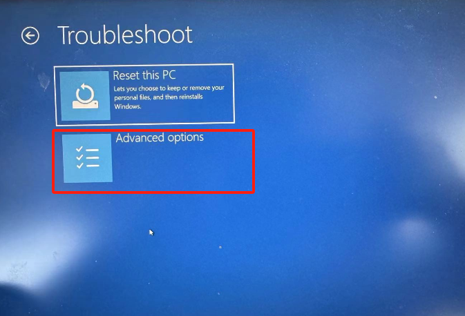
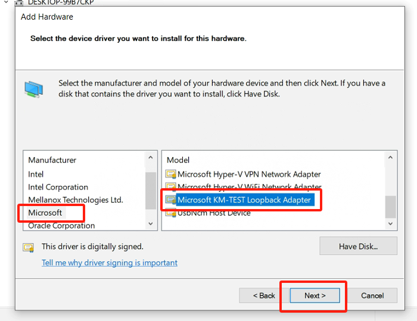

Virtual machine environment configuration
=============================================

Install the Virtual Box
-------------------------

- Virtual Box Version: VirtualBox-7.0.14.
- File name: VirtualBox-7.0.14-161095-Win.exe.
- After downloading the installation package, select the default path for installation.

.. image:: controller_virtual_machine/001.png
   :width: 6in
   :align: center

.. centered:: Figure 6.1-1 VirtualBox 7.0.14

Mirror configuration
----------------------

1) Download and open the image.

- Download and extract the virtual machine image FAIRINO SimMachine.rar.
- Open VirtualBox, select "Register", select the virtual machine "FAIRINO SimMachine". Vbox file, and then import the virtual environment.

.. centered:: Figure 6.1-2 Select Register in VirtualBox

.. image:: controller_virtual_machine/003.png
   :width: 6in
   :align: center

.. centered:: Figure 6.1-3 Select Virtual Machine File

- After importing, select "FAIRINO SimMachine" and click "Start" to start the virtual machine.

.. image:: controller_virtual_machine/004.png
   :width: 6in
   :align: center

.. centered:: Figure 6.1-4 Starting a virtual machine 

.. note:: 
    Virtual Machine Settings -> System -> Processor, PAE/NX is enabled by default. If the computer BIOS has not enabled virtualization, it will cause boot failure. You need to enable virtualization in the BIOS. See \ `Appendix 1 <#appendix-1-enabling-virtualization-in-the-bios>`__\  for details. 
    
    Appendix 1: Enabling Virtualization in the BIOS.

2) Shared folder.

The shared folder between the virtual machine and the host has been set by default. It is recommended to use the shared folder to copy files. At the same time, the virtual machine environment has been installed with enhanced features to share the pasteboard for easy copy and paste.

- The shared folder of the host is in D: \ share (you need to create the share folder manually).
- The virtual machine shared folder is at/home/fr/shared.

.. image:: controller_virtual_machine/005.png
   :width: 6in
   :align: center

.. centered:: Figure 6.1-5  Shared Folder Configuration

3) Enter the virtual machine system.

- Virtual machine running environment system: Ubuntu 18.04.6.
- Virtual machine running environment system: RAM 4G, ROM 50G, 6-core CPU.
- Username: root, Password: 123.

.. image:: controller_virtual_machine/007.png
   :width: 6in
   :align: center

.. centered:: Figure 6.1-6 tty login virtual machine system

The virtual machine system turns off the graphical user interface by default and logs in with tty.

- If the user needs to open the graphical user interface:
  
.. list-table::
   :widths: 200
   :align: center

   * - systemctl set-default graphical.target

   * - reboot
  
- If the user needs to close the graphical user interface again:
  
.. list-table::
   :widths: 200
   :align: center

   * - systemctl set-default multi-user.target

   * - reboot

The user logs in the web page and operates the virtual robot
===============================================================

- When logging in for the first time, the user prepares a test computer and connects it to the virtual machine through a network cable. The network port IP of the test computer is set to 192.168.58.XXX network segment, and the subnet mask is set to 255.255.255.0.
- On the test computer, open the Chrome browser and enter the default IP: 192.168.58.2 to access the web interface and operate the virtual robot.

.. image:: controller_virtual_machine/008.png
   :width: 6in
   :align: center

.. centered:: Figure 6.2-1 Virtual machine web login interface

.. centered:: Figure 6.2-2 Virtual machine web operation interface

User modifies IP address
----------------------------

.. image:: controller_virtual_machine/010.png
   :width: 6in
   :align: center

.. centered:: Figure 6.2-3 Setting up the network page

1. Open the browser, enter the default IP: 192.168.58.2, and open the web page;
2. Log in with admin account, password: 123;
3. Enter "System Settings" -> "General Settings" -> "Network Settings", modify the IP address as the target IP address, and click "Set Network";
4. Restart the virtual machine. The IP address on the bridge network card of the virtual machine has been automatically changed to the modified IP address;
5. Configure the Ethernet port of the local test computer, the Ethernet port of the host computer and the IP on the virtual machine bridging network card as the same network segment;
6. At this time, the user can access the web interface and operate the virtual robot by opening the Chrome browser on the test computer and entering the modified IP address.

.. image:: controller_virtual_machine/011.png
   :width: 6in
   :align: center

.. centered:: Figure 6.2-4 Network topology diagram

.. note:: 
    If you do not currently have a test computer, you can add a virtual network card (loopback network adapter) to the local computer. See \ `Appendix 2 <#appendix-2-adding-a-virtual-nic-loopback-network-adapter>`__\  for details.
    
    Appendix 2: Adding a Virtual NIC (Loopback Network Adapter).

Appendix
==================================

Appendix 1：Enabling Virtualization in the BIOS
------------------------------------------------------

Different models of computers may have different processes to enable virtualization. Take Lenovo ThinkPad series Windows 10 as an example:

- Open PC Settings and select Update and Security.

.. image:: controller_virtual_machine/014.png
   :width: 4in
   :align: center

- Select "Recover".

.. image:: controller_virtual_machine/015.png
   :width: 4in
   :align: center

- Select "Restart Now".

.. image:: controller_virtual_machine/016.png
   :width: 4in
   :align: center

- Select "Troubleshoot".
  
.. image:: controller_virtual_machine/017.png
   :width: 4in
   :align: center

- Select "Advanced Options".

- Select "UEFI Firmware Settings".

.. image:: controller_virtual_machine/019.png
   :width: 4in
   :align: center

- Select "Restart".

.. image:: controller_virtual_machine/020.png
   :width: 4in
   :align: center

- Select "Virtualization" under Security.

.. image:: controller_virtual_machine/021.png
   :width: 4in
   :align: center

- Select "Enabled" and press "Enter" to confirm.

.. image:: controller_virtual_machine/022.png
   :width: 4in
   :align: center

- Press "F10", select "Yes", press "Enter" to save changes.

Appendix 2:Adding a Virtual NIC (Loopback Network Adapter)
-------------------------------------------------------------------

1. Open Device Manager, press "Windows Key - X", select "Network adapters".
   

2. Add a network.

.. image:: controller_virtual_machine/025.png
   :width: 4in
   :align: center

.. image:: controller_virtual_machine/026.png
   :width: 4in
   :align: center

.. image:: controller_virtual_machine/028.png
   :width: 4in
   :align: center

.. image:: controller_virtual_machine/030.png
   :width: 4in
   :align: center

.. image:: controller_virtual_machine/031.png
   :width: 4in
   :align: center
   
3. View the virtual network card, press the "Windows key - X" , select "Network Connection".

.. image:: controller_virtual_machine/035.png
   :width: 6in
   :align: center
   
4. Configuring a Loopback Adapter Network.

- IP address: 192.168.58.XXX (same network segment as 192.168.58.2) .
- Subnet mask: 255.255.255.0.

5. Open the Virtualbox network configuration, select "Loopback Adapter Network" for the network card name, and start the virtual machine.

