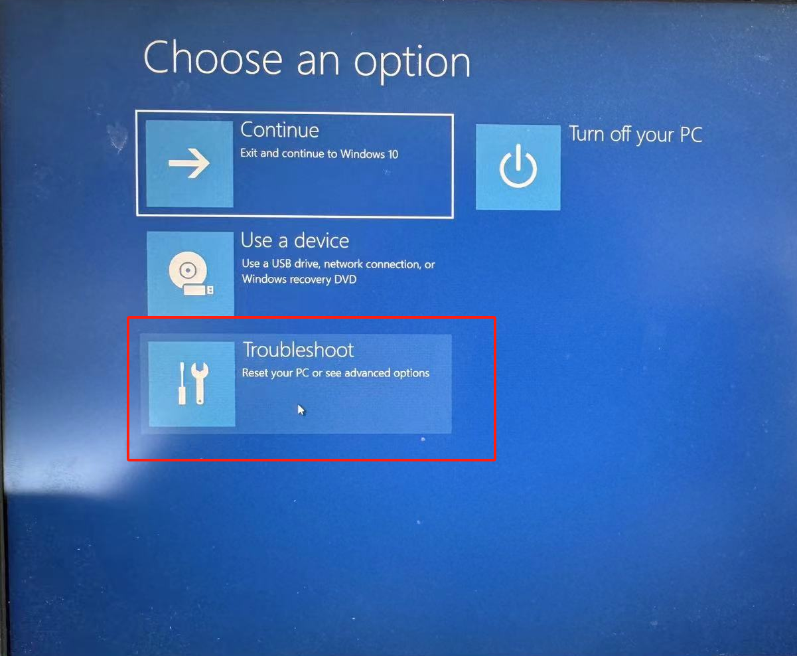
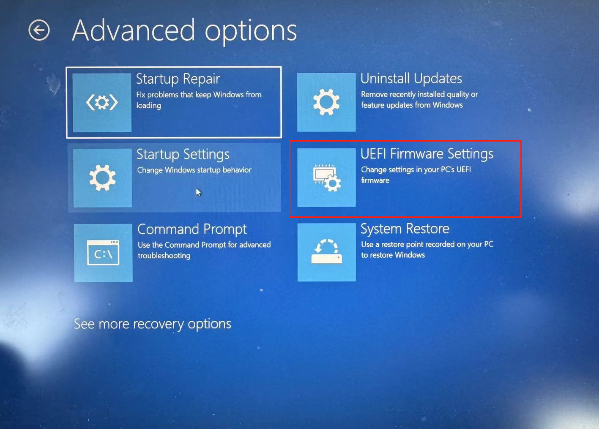
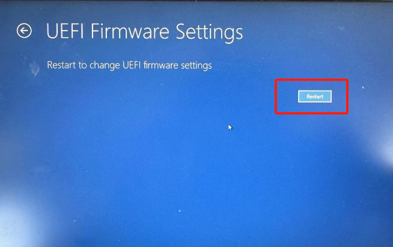
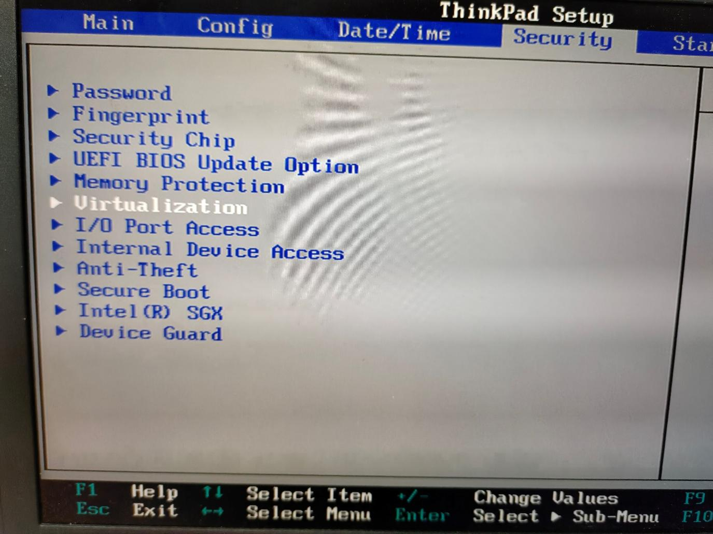

Virtual machine-Virtual Box
=============================================

Virtual machine environment configuration
---------------------------------------------

Install the Virtual Box
~~~~~~~~~~~~~~~~~~~~~~~~~~~

- Virtual Box Version: VirtualBox-7.0.14.
- File name: VirtualBox-7.0.14-161095-Win.exe.
- After downloading the installation package, select the default path for installation.

.. centered:: Figure 6.1-1 VirtualBox 7.0.14

Mirror configuration
~~~~~~~~~~~~~~~~~~~~~~~~~

1) Download and open the image.

- Download and extract the virtual machine image FAIRINO SimMachine.rar.
- Open VirtualBox, select "Register", select the virtual machine "FAIRINO SimMachine". Vbox file, and then import the virtual environment.

.. image:: controller_virtual_machine/002.png
   :width: 6in
   :align: center

.. centered:: Figure 6.1-2 Select Register in VirtualBox

.. centered:: Figure 6.1-3 Select Virtual Machine File

- After importing, select "FAIRINO SimMachine" and click "Start" to start the virtual machine.

.. centered:: Figure 6.1-4 Starting a virtual machine 

.. note:: 
    Virtual Machine Settings -> System -> Processor, PAE/NX is enabled by default. If the computer BIOS has not enabled virtualization, it will cause boot failure. You need to enable virtualization in the BIOS. See \ `Appendix 1 <#appendix-1-enabling-virtualization-in-the-bios>`__\  for details. 
    
    Appendix 1: Enabling Virtualization in the BIOS.

2) Shared folder.

The shared folder between the virtual machine and the host has been set by default. It is recommended to use the shared folder to copy files. At the same time, the virtual machine environment has been installed with enhanced features to share the pasteboard for easy copy and paste.

- The shared folder of the host is in D: \ share (you need to create the share folder manually).
- The virtual machine shared folder is at/home/fr/shared.

.. centered:: Figure 6.1-5  Shared Folder Configuration

3) Enter the virtual machine system.

- Virtual machine running environment system: Ubuntu 18.04.6.
- Virtual machine running environment system: RAM 4G, ROM 50G, 6-core CPU.
- Username: root, Password: 123.

.. centered:: Figure 6.1-6 tty login virtual machine system

The virtual machine system turns off the graphical user interface by default and logs in with tty.

- If the user needs to open the graphical user interface:
  
.. list-table::
   :widths: 200
   :align: center

   * - systemctl set-default graphical.target

   * - reboot
  
- If the user needs to close the graphical user interface again:
  
.. list-table::
   :widths: 200
   :align: center

   * - systemctl set-default multi-user.target

   * - reboot

The user logs in the web page and operates the virtual robot
------------------------------------------------------------------------

- When logging in for the first time, the user prepares a test computer and connects it to the virtual machine through a network cable. The network port IP of the test computer is set to 192.168.58.XXX network segment, and the subnet mask is set to 255.255.255.0.
- On the test computer, open the Chrome browser and enter the default IP: 192.168.58.2 to access the web interface and operate the virtual robot.

.. centered:: Figure 6.2-1 Virtual machine web login interface

.. image:: controller_virtual_machine/009.png
   :width: 6in
   :align: center

.. centered:: Figure 6.2-2 Virtual machine web operation interface

User modifies IP address
~~~~~~~~~~~~~~~~~~~~~~~~~~~~

.. centered:: Figure 6.2-3 Setting up the network page

1. Open the browser, enter the default IP: 192.168.58.2, and open the web page;
2. Log in with admin account, password: 123;
3. Enter "System Settings" -> "General Settings" -> "Network Settings", modify the IP address as the target IP address, and click "Set Network";
4. Restart the virtual machine. The IP address on the bridge network card of the virtual machine has been automatically changed to the modified IP address;
5. Configure the Ethernet port of the local test computer, the Ethernet port of the host computer and the IP on the virtual machine bridging network card as the same network segment;
6. At this time, the user can access the web interface and operate the virtual robot by opening the Chrome browser on the test computer and entering the modified IP address.

.. centered:: Figure 6.2-4 Network topology diagram

.. note:: 
    If you do not currently have a test computer, you can add a virtual network card (loopback network adapter) to the local computer. See \ `Appendix 2 <#appendix-2-adding-a-virtual-nic-loopback-network-adapter>`__\  for details.
    
    Appendix 2: Adding a Virtual NIC (Loopback Network Adapter).

Virtual machine-Docker
=================================

Deploying Docker images on Linux
-------------------------------------

Operating environment
~~~~~~~~~~~~~~~~~~~~~~~~~~~

Virtual machine operating system: Ubuntu 18.04.6.

Virtual machine operating environment: RAM 4G, ROM 50G, 6-core CPU.

Operational rights: Use the superuser root privileges, the setup method is detailed in Appendix 1.

Docker installation file: fr_docker.tar.gz.

FAIRINO SimMachine image: FAIRINOSimMachine.tar.

Install Docker
~~~~~~~~~~~~~~

If the user has already installed Docker, skip this section and proceed to section 1.3 for image deployment.

1. Download fr_docker.tar.gz and place it in the Ubuntu file path /opt/.

2. Unzip fr_docker.tar.gz, for example, in the /opt/ directory:

.. code-block:: console
   :linenos:

   cd /opt/ && tar -zxvf fr_docker.tar.gz

.. image:: controller_virtual_machine/036.png
   :width: 6in
   :align: center

3.Execute the Docker installation script:

.. code-block:: console
   :linenos:

   sh install.sh docker-27.0.3.tgz

Once the script has been executed and the version number appears, it indicates that the installation has been successful.

Image Configuration
~~~~~~~~~~~~~~~~~~~~~~~~~~

Import the Docker image
++++++++++++++++++++++++++++

1. Download the virtual machine image FAIRINOSimMachine.tar and unzip it.
   
2. Check the Docker version to confirm that it is installed.

.. code-block:: console
   :linenos:

   docker -v

.. image:: controller_virtual_machine/038.png
   :width: 6in
   :align: center   

3. Import the image.

.. code-block:: console
   :linenos:

   docker load -i ./FAIRINOSimMachine.tar

If "fairino_simmachine:latest" appears, it indicates that the import is complete.

4. Execute `docker images` to check if the import was successful.

Create a custom bridge network
+++++++++++++++++++++++++++++++

1. Execute the following command to create a bridge network named "fairino-net" with the subnet 192.168.58.0/24.

.. code-block:: console
   :linenos:

   docker network create --driver bridge --subnet 192.168.58.0/24 --gateway 192.168.58.1 fairino-net

2. View the network.

.. code-block:: console
   :linenos:

   docker network ls

The existence of the "fairino-net" network indicates that the creation was successful.

.. image:: controller_virtual_machine/040.png
   :width: 6in
   :align: center 

Start the Docker container for the first time
++++++++++++++++++++++++++++++++++++++++++++++++++++

1. Create and start the container.

Use the "fairino-net" network and the "fairino_simmachine" image to start a container.

.. code-block:: console
   :linenos:

   docker run -d -P --name fairino-container --net fairino-net fairino_simmachine

.. code-block:: console
   :linenos:

   docker ps 

Check if the container has started successfully by looking for "fairino-container" in the output of `docker ps`. If it appears, it indicates that the container has started successfully.

.. image:: controller_virtual_machine/042.png
   :width: 6in
   :align: center 

Web-based operation of virtual robots
------------------------------------------

Container starts normally
~~~~~~~~~~~~~~~~~~~~~~~~~~~~~~

This section is for non-first-time container startups, addressing situations where the container is not running in the background due to computer restarts or Docker being closed.

1. Start docker: 

.. code-block:: console
   :linenos:

   systemctl start docker

2. Check the Docker status：

.. code-block:: console
   :linenos:

   systemctl status docker
   
"active (running)" indicates that the startup was successful.

3. Execute "docker ps -a" to view the container ID.

4. Execute docker start [container ID].

.. image:: controller_virtual_machine/045.png
   :width: 6in
   :align: center 

5. If the execution is successful, run "docker ps" again to check if the container is running.

.. image:: controller_virtual_machine/046.png
   :width: 6in
   :align: center 

Operate the virtual robot
~~~~~~~~~~~~~~~~~~~~~~~~~~~~~~

1. Ensure that the Docker container is running.

.. code-block:: console
   :linenos:

   docker ps 
   
If "fairino-container" is present, it indicates that the container is running.

.. image:: controller_virtual_machine/047.png
   :width: 6in
   :align: center 

2. Open a web browser and enter the default IP address: 192.168.58.2 to access the web interface and operate the virtual robot. 

3. Log in with the admin account, using the password: 123.

Modify IP address
~~~~~~~~~~~~~~~~~~~~~~

.. image:: controller_virtual_machine/050.png
   :width: 6in
   :align: center 

1. Open the browser, enter the default IP: 192.168.58.2, to open the web page. 
2. Log in with the admin account, password: 123.
3. Go to "System Settings" → "General Settings" → "Network Settings", change the IP to the target IP address, subnet mask, and gateway. Click "Set Network".
   
Take modifying the IP to 192.168.56.2/24 as an example.

4. Open the terminal, stop the container.
 	
View the container ID:

.. code-block:: console
   :linenos:
      
   docker ps -a

.. image:: controller_virtual_machine/052.png
   :width: 6in
   :align: center 

Stop the container：

.. code-block:: console
   :linenos:
   
   docker stop [container ID]

5. Reconfigure the container network.
   
Delete the original network:

.. code-block:: console
   :linenos:
   
   docker network rm fairino-net

Create a new network：

.. code-block:: console
   :linenos:
   
   docker network create --driver bridge --subnet [Target IP/Mask] --gateway [gateway] fairino-net

Take 192.168.56.0/24 as an example：docker network create --driver bridge --subnet 192.168.56.0/24 --gateway 192.168.56.1 fairino-net

6. Attach the container to the newly created network.

.. code-block:: console
   :linenos:

   docker network connect fairino-net [container ID]

.. image:: controller_virtual_machine/055.png
   :width: 6in
   :align: center 

7. Restart the container.

.. code-block:: console
   :linenos:
   
   docker start [container ID]

8. At this point, open the browser and enter the modified IP address to access the web interface and operate the virtual robot.

Appendix
==================================

Appendix 1:Enabling Virtualization in the BIOS
------------------------------------------------------

Different models of computers may have different processes to enable virtualization. Take Lenovo ThinkPad series Windows 10 as an example:

- Open PC Settings and select Update and Security.

.. image:: controller_virtual_machine/013.png
   :width: 4in
   :align: center

- Select "Recover".

- Select "Restart Now".

- Select "Troubleshoot".
  

- Select "Advanced Options".

.. image:: controller_virtual_machine/018.png
   :width: 4in
   :align: center

- Select "UEFI Firmware Settings".

- Select "Restart".

- Select "Virtualization" under Security.

- Select "Enabled" and press "Enter" to confirm.

.. image:: controller_virtual_machine/022.png
   :width: 4in
   :align: center

- Press "F10", select "Yes", press "Enter" to save changes.

.. image:: controller_virtual_machine/023.png
   :width: 4in
   :align: center

Appendix 2:Adding a Virtual NIC (Loopback Network Adapter)
-------------------------------------------------------------------

1. Open Device Manager, press "Windows Key - X", select "Network adapters".
   
.. image:: controller_virtual_machine/024.png
   :width: 4in
   :align: center

2. Add a network.

.. image:: controller_virtual_machine/027.png
   :width: 4in
   :align: center

.. image:: controller_virtual_machine/029.png
   :width: 4in
   :align: center

   
3. View the virtual network card, press the "Windows key - X" , select "Network Connection".

.. image:: controller_virtual_machine/032.png
   :width: 4in
   :align: center

.. image:: controller_virtual_machine/033.png
   :width: 4in
   :align: center

.. image:: controller_virtual_machine/034.png
   :width: 4in
   :align: center

   
4. Configuring a Loopback Adapter Network.

- IP address: 192.168.58.XXX (same network segment as 192.168.58.2) .
- Subnet mask: 255.255.255.0.

.. image:: controller_virtual_machine/012.png
   :width: 6in
   :align: center

5. Open the Virtualbox network configuration, select "Loopback Adapter Network" for the network card name, and start the virtual machine.

.. image:: controller_virtual_machine/013.png
   :width: 6in
   :align: center

Appendix 3: root Permissions
--------------------------------------

After Ubuntu is installed, the root user is not allowed to log in by default, and the password is empty. If you want to log in as the root user, you must first set a password for the root user.

1. Open the terminal, type `sudo passwd root`, press Enter, and then enter the password several times. A success message will be displayed once the password is set.

2. Continue in the terminal by entering the command `su - root` to switch users, and press Enter to input the password.

.. warning:: When entering the command, be sure to include the hyphen in "su -". The option "-" signifies that the environment variables should be switched along with the user, and it is crucial not to omit it.

.. image:: controller_virtual_machine/058.png
   :width: 6in
   :align: center

Appendix 4: Docker Basic Commands
--------------------------------------

1. Docker help command: 

.. code-block:: console
   :linenos:

   docker --help

2. Start Docker :

.. code-block:: console
   :linenos:

   systemctl start docker

3.  Stop Docker :

.. code-block:: console
   :linenos:

   systemctl stop docker

4. Restart Docker :

.. code-block:: console
   :linenos:

   systemctl restart docker

5. Set Docker to start automatically with the service :

.. code-block:: console
   :linenos:

   systemctl enable docker

6. Check the running status of Docker :

.. code-block:: console
   :linenos:

   systemctl status docker
   --If it's running, you'll see "active" in green

7. Docker image-related commands :

.. code-block:: console
   :linenos:

   docker images: List the downloaded images.
   docker rmi [image_id_or_name]: Remove a local image.
   docker rmi -f [image_id_or_name]: Force remove an image.
   docker build: Build an image.
   docker search [image_id_or_name]: Search for an image by keyword in the Hub.
   docker pull [image_id_or_name]: Download an image
   docker images: List the downloaded images.
   docker rmi [image_id_or_name]: Remove a local image.
   docker rmi -f [image_id_or_name]: Force remove an image.
   docker build: Build an image.

8. docker镜像相关 :

.. code-block:: console
   :linenos:

   docker ps: List running containers.
   docker ps -a: List all containers, including those not running.
   docker stop [container_id_or_name]: Stop a container.
   docker kill [container_id]: Force stop a container.
   docker start [container_id_or_name]: Start a stopped container.
   docker inspect [container_id]: View all information about a container.
   docker container logs [container_id]: View container logs.
   docker top [container_id]: View processes inside the container.
   docker exec -it [container_id] /bin/bash: Enter the container.
   exit: Exit the container.
   docker rm [container_id_or_name]: Remove a stopped container.
   docker rm -f [container_id]: Remove a running container.
   docker exec -it [container_ID] sh: Enter the container using the shell.